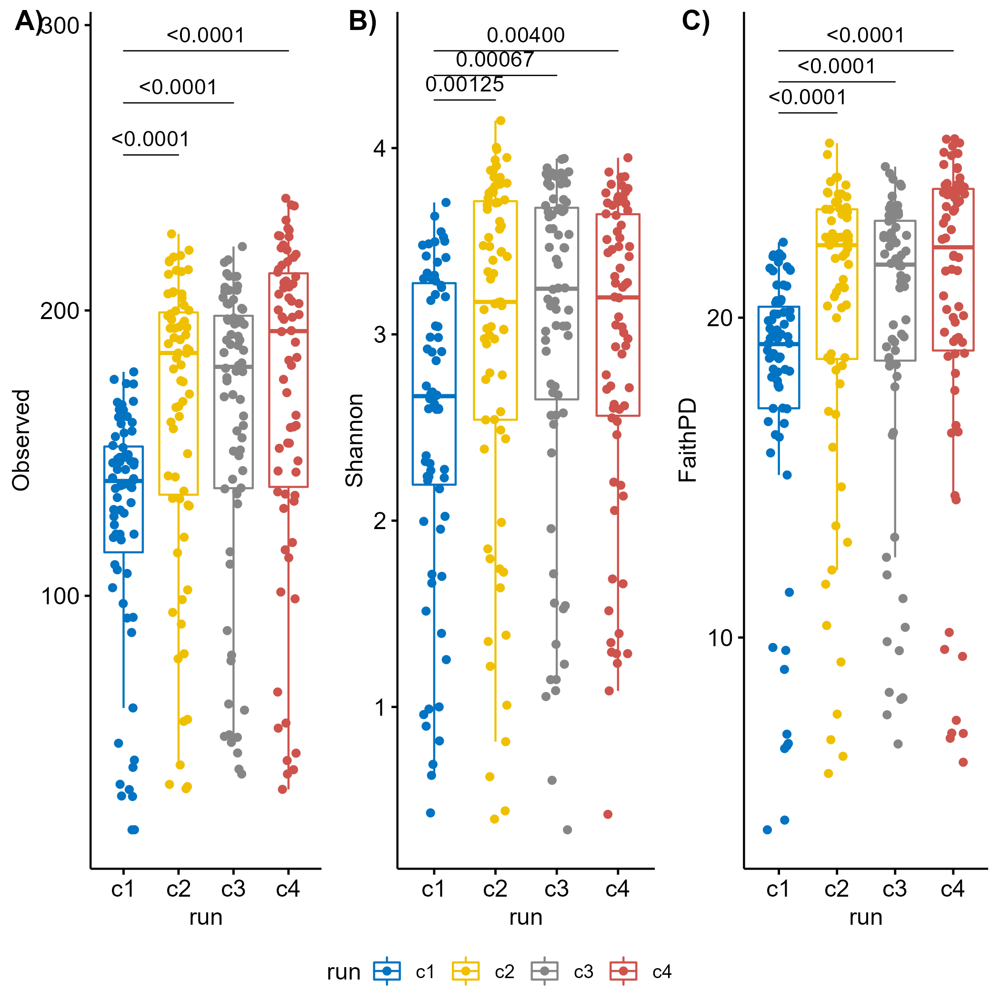

# ALPHA DIVERSITY {.tabset .tabset-fade .tabset-pills}

This Rmarkdown contains the commands necessary to perform alpha diversity analysis of the output from the DF_GMH_PIPELINE. It is expected that the data has been imported, cleaned, and saved following the script 1_Import_QC.Rmd prior to using this script. I recommend visiting the ["Analysis of community ecology data in R"](https://www.davidzeleny.net/anadat-r/doku.php/en:start) to read about the theory behind the alpha and beta diversity and examples of the necessary R-code to execute them. Other excellent source of help is the R [cheat-sheets](https://www.rstudio.com/resources/cheatsheets/) and for problems related to Rmarkdown I suggest this [online Book](https://bookdown.org/yihui/rmarkdown/).

Alpha diversity, also called "within sample diversity" is calculated for each sample individually and is independent of all other samples. Alpha diversity is sensitive to sequencing depth, so rarefaction must be done first.

## SETUP

```{r setup, eval=TRUE, echo=TRUE, message=FALSE,warning = FALSE}
knitr::opts_chunk$set(echo = TRUE)

# Load libraries
library(tidyverse)
library(phyloseq)
library(ggpubr)
library(rstatix)
library(kableExtra)
library(picante)
library(plotly)
library(cowplot)

# Create used folders if missing
if (!file.exists("R_objects")) dir.create(file.path(getwd(), "R_objects"))
if (!file.exists("plots")) dir.create(file.path(getwd(), "plots"))
if (!file.exists("plots/adiv")) dir.create(file.path(getwd(), "plots/adiv"))
if (!file.exists("tables")) dir.create(file.path(getwd(), "tables"))
if (!file.exists("scripts")) dir.create(file.path(getwd(), "scripts"))

# Save params
saveRDS(params, file = "R_objects/Adiv_params.RDS")
```

## SCRIPTS
```{r}
adiv_batch_effect <- function(INNER.VAR, OUTER.VAR, MTRL, DAY) {
  load(params$input)
  adat <- data.frame(sample_data(phy))
  adat <- adat[adat$material == MTRL & adat$day == DAY,]
  
  # Remove samples with incomplete metadata
  adat <- adat[!is.na(adat[,INNER.VAR]) & !is.na(adat[,OUTER.VAR]),]
  adat[,OUTER.VAR] <- as.factor(adat[,OUTER.VAR])
  adat[,INNER.VAR] <- as.factor(adat[,INNER.VAR])
  
  # Determine if any batch effect might influence your data
  ## Calculate distribution counts
  freq.t <- with(adat, table(get(params$batch), feed, exclude = NULL))
  freq.t
  
  ## Determine distribution percentages
  pct.freq.t <- prop.table(freq.t,2)*100
  
  ## Test if any difference is significant (if not significant the batch effect should be negligible)
  chisq <- chisq_test(freq.t)
  output <- list(freq.t, pct.freq.t, chisq)
  output
  return(output)
}

# Process alpha divertsity data for a material and day and create combined plot with wilcoxon statistics
adiv_output <- function(INNER.VAR, OUTER.VAR, MTRL, DAY) {
  load(params$input)
  adat <- data.frame(sample_data(phy))
  adat <- adat[adat$material == MTRL & adat$day == DAY,]
  
  # Remove samples with incomplete metadata
  adat <- adat[!is.na(adat[,INNER.VAR]) & !is.na(adat[,OUTER.VAR]),]
  adat[,OUTER.VAR] <- as.factor(adat[,OUTER.VAR])
  adat[,INNER.VAR] <- as.factor(adat[,INNER.VAR])
  
  INDECES <- c("Observed","Evenness","Shannon","FaithPD")
  
  #### Test project variable
  for (i in INDECES) {
      fit <- aov(as.formula(paste(i, "~", OUTER.VAR,"*",INNER.VAR, sep = " ")), data = adat)
      aov <- anova(fit)
      thsd <- TukeyHSD(fit)
      
      ## Calculate stats for inner variable
      # Perform pairwise comparisons
      stat.test <- adat %>%
        group_by(.data[[OUTER.VAR]]) %>%
        wilcox_test(as.formula(paste(i, "~", INNER.VAR, sep = " "))) %>%
        adjust_pvalue(method = "BH") %>%
        add_significance("p.adj") %>% 
        add_xy_position(x = OUTER.VAR, dodge = 0.8) %>%
        p_format("p.adj", accuracy = 0.0001, trailing.zero = TRUE, new.col = TRUE)
      
      ## Calculate stats for outer variable
      # Perform pairwise comparisons
      stat.test2 <- adat %>%
        wilcox_test(as.formula(paste(i,"~", OUTER.VAR, sep = " "))) %>%
        adjust_pvalue(method = "BH") %>%
        add_significance("p.adj") %>% 
        add_xy_position(x = OUTER.VAR) %>%
        p_format("p.adj", accuracy = 0.0001, trailing.zero = TRUE, new.col = TRUE)
      
      # Adjust y value for outer p-values
      stat.test2$y.position <- max(stat.test$y.position)*1.1
      
      # Create plot
      p <- ggboxplot(adat, x = OUTER.VAR, y = i,
                color = INNER.VAR,
                fill = INNER.VAR,
                add = "jitter",
                add.params = list(size = 1)) +
        scale_fill_manual(values = params$COL, name = "Group", labels = c("HF_CTRL" = "HF-CTRL","HF_PFOS" = "HF-PFOS","LF_CTRL" = "LF-CTRL","LF_PFOS" = "LF-PFOS")) +
        scale_color_manual(values = c("black","black","black","black")) +
        guides(color = "none") +
        theme(axis.title.x = element_blank())
      
      # Add p-values
      if (i == "Observed") {
        p.obs <- p + stat_pvalue_manual(stat.test, label = "p.adj.signif",tip.length = 0, hide.ns = TRUE, color = "red")
        p.obs <- p.obs + stat_pvalue_manual(stat.test2, label = "p.adj.signif",tip.length = 0, step.increase = 0.1, hide.ns = TRUE)
        obs <- list(fit = fit, ANOVA = aov, TukeyHSD = thsd)
      } else if (i == "Evenness") {
        p.eve <- p + stat_pvalue_manual(stat.test, label = "p.adj.signif",tip.length = 0, hide.ns = TRUE, color = "red")
        p.eve <- p.eve + stat_pvalue_manual(stat.test2, label = "p.adj.signif",tip.length = 0, step.increase = 0.1, hide.ns = TRUE)
        eve <- list(fit = fit, ANOVA = aov, TukeyHSD = thsd)
      } else if (i == "Shannon") {
        p.sha <- p + stat_pvalue_manual(stat.test, label = "p.adj.signif",tip.length = 0, hide.ns = TRUE, color = "red")
        p.sha <- p.sha + stat_pvalue_manual(stat.test2, label = "p.adj.signif",tip.length = 0, step.increase = 0.1, hide.ns = TRUE)
        sha <- list(fit = fit, ANOVA = aov, TukeyHSD = thsd)
      } else if (i == "FaithPD") {
        p.fpd <- p + stat_pvalue_manual(stat.test, label = "p.adj.signif",tip.length = 0, hide.ns = TRUE, color = "red")
        p.fpd <- p.fpd + stat_pvalue_manual(stat.test2, label = "p.adj.signif",tip.length = 0, step.increase = 0.1, hide.ns = TRUE)
        fph <- list(fit = fit, ANOVA = aov, TukeyHSD = thsd)
      }
  }
      adiv.plot <- ggarrange(p.obs,p.eve,p.sha,p.fpd, nrow = 1, labels = c("A)","B)","C)","D)"), common.legend = TRUE,legend = "top")
      adiv.plot
      
      save(p.obs,p.eve,p.sha,p.fpd, file = paste0("plots/adiv/alpha_",DAY,"/adiv_",MTRL,"_",DAY,".Rdata"))
      
      suppressMessages(ggsave(filename = paste0("plots/adiv/alpha_",DAY,"/adiv_",MTRL,"_",DAY,"_nested.png"), plot = adiv.plot, device = "png", units = "mm", width = 350, height = 100, dpi = 300))
      suppressMessages(ggsave(filename = paste0("plots/adiv/alpha_",DAY,"/adiv_",MTRL,"_",DAY,"_nested.pdf"), plot = adiv.plot, device = "pdf", units = "mm", width = 350, height = 100, dpi = 300))
      # output <- list(adiv.plot,obs.fit,obs.aov,obs.thsd,eve.fit,eve.aov,eve.thsd,sha.fit,sha.aov,sha.thsd,fph.fit,fph.aov,fph.thsd)
      # output
      return(list(plot = adiv.plot, Observed = obs, Evenness = eve, Shannon = sha, FaithPH = fph))
}


adiv_day <- function(INNER.VAR, OUTER.VAR, MTRL, DAY) {
  load(params$input)
  adat <- data.frame(sample_data(phy))
  adat <- adat[adat$material == MTRL & adat$day == DAY,]
  
  # Remove samples with incomplete metadata
  adat <- adat[!is.na(adat[,INNER.VAR]) & !is.na(adat[,OUTER.VAR]),]
  adat[,OUTER.VAR] <- as.factor(adat[,OUTER.VAR])
  adat[,INNER.VAR] <- as.factor(adat[,INNER.VAR])
    
      
  ### Observed richness
  fit <- aov(as.formula(paste("Observed ~", OUTER.VAR,"*",INNER.VAR, sep = " ")), data = adat)
  anova(fit)
  TukeyHSD(fit)
  
  ## Calculate stats for inner variable
  # Perform pairwise comparisons
  stat.test <- adat %>%
    group_by(.data[[OUTER.VAR]]) %>%
    wilcox_test(as.formula(paste("Observed ~", INNER.VAR, sep = " "))) %>%
    adjust_pvalue(method = "BH") %>%
    add_significance("p.adj") %>% 
    add_xy_position(x = OUTER.VAR, dodge = 0.8) %>%
    p_format("p.adj", accuracy = 0.0001, trailing.zero = TRUE, new.col = TRUE)
  
  ## Calculate stats for outer variable
  # Perform pairwise comparisons
  stat.test2 <- adat %>%
    wilcox_test(as.formula(paste("Observed ~", OUTER.VAR, sep = " "))) %>%
    adjust_pvalue(method = "BH") %>%
    add_significance("p.adj") %>% 
    add_xy_position(x = OUTER.VAR) %>%
    p_format("p.adj", accuracy = 0.0001, trailing.zero = TRUE, new.col = TRUE)
  
  # Adjust y value for outer p-values
  stat.test2$y.position <- max(stat.test$y.position)*1.1
  
  # Create plot
  p <- ggboxplot(adat, x = OUTER.VAR, y = "Observed",
            color = INNER.VAR,
            fill = INNER.VAR,
            add = "jitter",
            add.params = list(size = 1)) +
    scale_fill_manual(values = params$COL, name = "Group", labels = c("HF_CTRL" = "HF-CTRL","HF_PFOS" = "HF-PFOS","LF_CTRL" = "LF-CTRL","LF_PFOS" = "LF-PFOS")) +
    scale_color_manual(values = c("black","black","black","black")) +
    guides(color = "none") +
    theme(axis.title.x = element_blank())
  
  # Add p-values
  p.obs <- p + stat_pvalue_manual(stat.test, label = "p.adj.format",tip.length = 0, color = "red", hide.ns = TRUE)
  p.obs <- p.obs + stat_pvalue_manual(stat.test2, label = "p.adj.format",tip.length = 0, step.increase = 0.1, hide.ns = TRUE)
  
  ### Evenness
  fit <- aov(as.formula(paste("Evenness ~", OUTER.VAR,"*",INNER.VAR, sep = " ")), data = adat)
  anova(fit)
  TukeyHSD(fit)
  
  ## Calculate stats for inner variable
  # Perform pairwise comparisons
  stat.test <- adat %>%
    group_by(.data[[OUTER.VAR]]) %>%
    wilcox_test(as.formula(paste("Evenness ~", INNER.VAR, sep = " "))) %>%
    adjust_pvalue(method = "BH") %>%
    add_significance("p.adj") %>% 
    add_xy_position(x = OUTER.VAR, dodge = 0.8) %>%
    p_format("p.adj", accuracy = 0.0001, trailing.zero = TRUE, new.col = TRUE)
  
  ## Calculate stats for outer variable
  # Perform pairwise comparisons
  stat.test2 <- adat %>%
    wilcox_test(as.formula(paste("Evenness ~", OUTER.VAR, sep = " "))) %>%
    adjust_pvalue(method = "BH") %>%
    add_significance("p.adj") %>% 
    add_xy_position(x = OUTER.VAR) %>%
    p_format("p.adj", accuracy = 0.0001, trailing.zero = TRUE, new.col = TRUE)
  
  # Adjust y value for outer p-values
  stat.test2$y.position <- max(stat.test$y.position)*1.1
  
  # Create plot
  p <- ggboxplot(adat, x = OUTER.VAR, y = "Evenness",
            color = INNER.VAR,
            fill = INNER.VAR,
            add = "jitter",
            add.params = list(size = 1)) +
    scale_fill_manual(values = params$COL, name = "Group", labels = c("HF_CTRL" = "HF-CTRL","HF_PFOS" = "HF-PFOS","LF_CTRL" = "LF-CTRL","LF_PFOS" = "LF-PFOS")) +
    scale_color_manual(values = c("black","black","black","black")) +
    guides(color = "none") +
    theme(axis.title.x = element_blank())
  # Add p-values
  p.eve <- p + stat_pvalue_manual(stat.test, label = "p.adj.format",tip.length = 0, color = "red", hide.ns = TRUE)
  p.eve <- p.eve + stat_pvalue_manual(stat.test2, label = "p.adj.format",tip.length = 0, step.increase = 0.1, hide.ns = TRUE)
  
  ### Shannon diversity index
  fit <- aov(as.formula(paste("Shannon ~", OUTER.VAR,"*",INNER.VAR, sep = " ")), data = adat)
  anova(fit)
  TukeyHSD(fit)
  
  ## Calculate stats for inner variable
  # Perform pairwise comparisons
  stat.test <- adat %>%
    group_by(.data[[OUTER.VAR]]) %>%
    wilcox_test(as.formula(paste("Shannon ~", INNER.VAR, sep = " "))) %>%
    adjust_pvalue(method = "BH") %>%
    add_significance("p.adj") %>% 
    add_xy_position(x = OUTER.VAR, dodge = 0.8) %>%
    p_format("p.adj", accuracy = 0.0001, trailing.zero = TRUE, new.col = TRUE)
  
  ## Calculate stats for outer variable
  # Perform pairwise comparisons
  stat.test2 <- adat %>%
    wilcox_test(as.formula(paste("Shannon ~", OUTER.VAR, sep = " "))) %>%
    adjust_pvalue(method = "BH") %>%
    add_significance("p.adj") %>% 
    add_xy_position(x = OUTER.VAR) %>%
    p_format("p.adj", accuracy = 0.0001, trailing.zero = TRUE, new.col = TRUE)
  
  # Adjust y value for outer p-values
  stat.test2$y.position <- max(stat.test$y.position)*1.1
  
  # Create plot
  p <- ggboxplot(adat, x = OUTER.VAR, y = "Shannon",
            color = INNER.VAR,
            fill = INNER.VAR,
            add = "jitter",
            add.params = list(size = 1)) +
    scale_fill_manual(values = params$COL, name = "Group", labels = c("HF_CTRL" = "HF-CTRL","HF_PFOS" = "HF-PFOS","LF_CTRL" = "LF-CTRL","LF_PFOS" = "LF-PFOS")) +
    scale_color_manual(values = c("black","black","black","black")) +
    guides(color = "none") +
    theme(axis.title.x = element_blank())
  # Add p-values
  p.sha <- p + stat_pvalue_manual(stat.test, label = "p.adj.format",tip.length = 0, color = "red", hide.ns = TRUE)
  p.sha <- p.sha + stat_pvalue_manual(stat.test2, label = "p.adj.format",tip.length = 0, step.increase = 0.1, hide.ns = TRUE)
  
  ### FaithPD diversity index
  fit <- aov(as.formula(paste("FaithPD ~", OUTER.VAR,"*",INNER.VAR, sep = " ")), data = adat)
  anova(fit)
  TukeyHSD(fit)
  
  ## Calculate stats for inner variable
  # Perform pairwise comparisons
  stat.test <- adat %>%
    group_by(.data[[OUTER.VAR]]) %>%
    wilcox_test(as.formula(paste("FaithPD ~", INNER.VAR, sep = " "))) %>%
    adjust_pvalue(method = "BH") %>%
    add_significance("p.adj") %>% 
    add_xy_position(x = OUTER.VAR, dodge = 0.8) %>%
    p_format("p.adj", accuracy = 0.0001, trailing.zero = TRUE, new.col = TRUE)
  
  ## Calculate stats for outer variable
  # Perform pairwise comparisons
  stat.test2 <- adat %>%
    wilcox_test(as.formula(paste("FaithPD ~", OUTER.VAR, sep = " "))) %>%
    adjust_pvalue(method = "BH") %>%
    add_significance("p.adj") %>% 
    add_xy_position(x = OUTER.VAR) %>%
    p_format("p.adj", accuracy = 0.0001, trailing.zero = TRUE, new.col = TRUE)
  
  # Adjust y value for outer p-values
  stat.test2$y.position <- max(stat.test$y.position)*1.1
  
  # Create plot
  p <- ggboxplot(adat, x = OUTER.VAR, y = "FaithPD",
            color = INNER.VAR,
            fill = INNER.VAR,
            add = "jitter",
            add.params = list(size = 1)) +
    scale_fill_manual(values = params$COL, name = "Group", labels = c("HF_CTRL" = "HF-CTRL","HF_PFOS" = "HF-PFOS","LF_CTRL" = "LF-CTRL","LF_PFOS" = "LF-PFOS")) +
    scale_color_manual(values = c("black","black","black","black")) +
    guides(color = "none") +
    theme(axis.title.x = element_blank())
  # Add p-values
  p.fpd <- p + stat_pvalue_manual(stat.test, label = "p.adj.format",tip.length = 0, color = "red", hide.ns = TRUE)
  p.fpd <- p.fpd + stat_pvalue_manual(stat.test2, label = "p.adj.format",tip.length = 0, step.increase = 0.1, hide.ns = TRUE)
  ### Create output plot
  # filename <- paste0("plots/adiv/alpha_d0/adiv_",var1,"_",var2,"_nested.png")
  # filename2 <- paste0("plots/adiv/alpha_d0/adiv_",var1,"_",var2,"_nested.pdf")
  adiv.plot <- ggarrange(p.obs,p.eve,p.sha,p.fpd, nrow = 1, labels = c("A)","B)","C)","D)"), common.legend = TRUE,legend = "top")
  adiv.plot
  suppressMessages(ggsave(filename = paste0("plots/adiv/alpha_",DAY,"/adiv_",MTRL,"_",DAY,"_nested.png"), plot = adiv.plot, device = "png", units = "mm", width = 350, height = 100, dpi = 300))
  suppressMessages(ggsave(filename = paste0("plots/adiv/alpha_",DAY,"/adiv_",MTRL,"_",DAY,"_nested.pdf"), plot = adiv.plot, device = "pdf", units = "mm", width = 350, height = 100, dpi = 300))
  
  return(adiv.plot)
}

rm_legend <- function(p){p + theme(legend.position = "none")}

save(adiv_day,adiv_batch_effect,adiv_output, rm_legend, file = "scripts/adiv.Rdata")


```

```{r}
load("scripts/adiv.Rdata")

adiv_day(INNER.VAR = "feed_treat", OUTER.VAR = "feed", MTRL = "Feces", DAY = "d08")

adiv_output(INNER.VAR = "feed_treat", OUTER.VAR = "feed", MTRL = "Feces", DAY = "d08")

```

## BATCH EFFECTS

Before testing any of the project specific variables it is important to determine if there is any batch effects that affect the samples (for example extraction batches or sequencing run)

```{r alpha_div_batch, eval=TRUE}

params <- readRDS("R_objects/Adiv_params.RDS")
# Load data
load("R_objects/Phyloseq.Rdata")
# Extract sample data and alpha diversity
adat <- as_tibble(sample_data(phy))

### Test observed richness
FORMULA <- as.formula(paste("Observed ~", params$batch, sep = " "))
compare_means(FORMULA,  data = adat, method = "kruskal")

## If significant:
# Perform pairwise comparisons
stat.test <- adat %>%
  wilcox_test(FORMULA) %>%
  adjust_pvalue(method = "BH") %>%
  add_significance("p.adj") %>% 
  add_x_position(x = params$batch) %>%
  p_format("p.adj", accuracy = 0.0001, trailing.zero = TRUE, new.col = TRUE)

# Format for 
if (sum(stat.test$p.adj.signif != "ns") == 0) {
  stat.sig <- stat.test %>%
    add_y_position(step.increase = 0.25) %>%
    mutate(y.position = seq(min(y.position), max(y.position),length.out = n()))
} else {
  stat.sig <- stat.test[stat.test$p.adj.signif != "ns",] %>%
    add_y_position(step.increase = 0.25) %>%
    mutate(y.position = seq(min(y.position), max(y.position),length.out = n()))
}

# Create plot
p <- ggboxplot(adat, x = params$batch, y = "Observed",
          color = params$batch, palette = "jco",
          add = "jitter")

p.obs <- p + stat_pvalue_manual(stat.sig, label = "p.adj.format",tip.length = 0)


### Test Evenness
FORMULA <- as.formula(paste("Evenness ~", params$batch, sep = " "))
compare_means(FORMULA,  data = adat, method = "kruskal")

## If significant:
# Perform pairwise comparisons
stat.test <- adat %>%
  wilcox_test(FORMULA) %>%
  adjust_pvalue(method = "BH") %>%
  add_significance("p.adj") %>% 
  add_x_position(x = params$batch) %>%
  p_format("p.adj", accuracy = 0.0001, trailing.zero = TRUE, new.col = TRUE)

# Format for 
if (sum(stat.test$p.adj.signif != "ns") == 0) {
  stat.sig <- stat.test %>%
    add_y_position(step.increase = 0.25) %>%
    mutate(y.position = seq(min(y.position), max(y.position),length.out = n()))
} else {
  stat.sig <- stat.test[stat.test$p.adj.signif != "ns",] %>%
    add_y_position(step.increase = 0.25) %>%
    mutate(y.position = seq(min(y.position), max(y.position),length.out = n()))
}

# Create plot
p <- ggboxplot(adat, x = params$batch, y = "Evenness",
          color = params$batch, palette = "jco",
          add = "jitter")

p.eve <- p + stat_pvalue_manual(stat.sig, label = "p.adj.format",tip.length = 0)

### Test shannon diversity index
# Run statistical test of batch effect
FORMULA <- as.formula(paste("Shannon ~", params$batch, sep = " "))
compare_means(FORMULA,  data = adat, method = "kruskal")

## If significant:
# Perform pairwise comparisons
stat.test <- adat %>%
  wilcox_test(FORMULA) %>%
  adjust_pvalue(method = "BH") %>%
  add_significance("p.adj") %>% 
  add_x_position(x = params$batch) %>%
  p_format("p.adj", accuracy = 0.0001, trailing.zero = TRUE, new.col = TRUE)

# Format for 
if (sum(stat.test$p.adj.signif != "ns") == 0) {
  stat.sig <- stat.test %>%
    add_y_position(step.increase = 0.25) %>%
    mutate(y.position = seq(min(y.position), max(y.position),length.out = n()))
} else {
  stat.sig <- stat.test[stat.test$p.adj.signif != "ns",] %>%
    add_y_position(step.increase = 0.25) %>%
    mutate(y.position = seq(min(y.position), max(y.position),length.out = n()))
}

# Create plot
p <- ggboxplot(adat, x = params$batch, y = "Shannon", color = params$batch, palette = "jco", add = "jitter")

p.sdi <- p + stat_pvalue_manual(stat.sig, label = "p.adj.format",tip.length = 0)
# If there is a significant batch effect, then it will be necessary to correct following tests for this effect.

# Test Faith phylogenetic distance
FORMULA <- as.formula(paste("FaithPD ~", params$batch, sep = " "))
compare_means(FORMULA,  data = adat, method = "kruskal")

## If significant:
# Perform pairwise comparisons
stat.test <- adat %>%
  wilcox_test(FORMULA) %>%
  adjust_pvalue(method = "BH") %>%
  add_significance("p.adj") %>% 
  add_x_position(x = params$batch) %>%
  p_format("p.adj", accuracy = 0.0001, trailing.zero = TRUE, new.col = TRUE)

# Format for 
if (sum(stat.test$p.adj.signif != "ns") == 0) {
  stat.sig <- stat.test %>%
    add_y_position(step.increase = 0.25) %>%
    mutate(y.position = seq(min(y.position), max(y.position),length.out = n()))
} else {
  stat.sig <- stat.test[stat.test$p.adj.signif != "ns",] %>%
    add_y_position(step.increase = 0.25) %>%
    mutate(y.position = seq(min(y.position), max(y.position),length.out = n()))
}

# Create plot
p <- ggboxplot(adat, x = params$batch, y = "FaithPD",
          color = params$batch, palette = "jco",
          add = "jitter")

p.fpd <- p + stat_pvalue_manual(stat.sig, label = "p.adj.format",tip.length = 0)

adiv_batch <- ggarrange(p.obs, p.eve, p.sdi, p.fpd, nrow = 1, labels = c("A)","B)","C)","D)"), common.legend = TRUE, legend = "bottom")
suppressMessages(ggsave(filename = "plots/adiv/misc/adiv_batch.png",plot = adiv_batch, device = "png", units = "mm", width = 350, height = 100, dpi = 300))
suppressMessages(ggsave(filename = "plots/adiv/misc/adiv_batch.pdf",plot = adiv_batch, device = "pdf", units = "mm", width = 350, height = 100, dpi = 300))
adiv_batch

# clear the environment and release memory
rm(list = ls(all.names = TRUE))
invisible(gc())

```

Boxplot of the influence of sequencing batches on alpha diversity: {width="100%"} Unfortunately, there is a batch effect between c1 and c2-4. This should be kept in mind for further analysis. However, as all batches are randomized across all samples part of this effect should be equaled out by random dispersion. It is still important that we determine if any tested variables are independent of the batches or if there is an interaction.

# CATEGORICAL VARIABLES EFFECTS {.tabset .tabset-fade .tabset-pills}

Keeping in mind possible batch effects, now we can test for project effects. Depending on the project it might be best to test each variable individually or to perform a nested test of the variables. It is important to ensure that R has interpreted the selected variable as a factor, character variables will automatically be interpreted as factors, but variables that consists solely of numbers (numerical or integers) is interpreted as continuous by R and must be transformed to be factors.

## Diversity plot with rats over time
Here we look at all data in one figure per metric. The plots contain data from all feces data which are plotted for each rat along with summary of each treatment group per day as boxplots. Vancomycin treatment factor "van" is used to facet_wrap for better overview and labels are adjusted for better overview.
```{r adiv_figure_over_time, eval=TRUE, echo=TRUE}
params <- readRDS("R_objects/Adiv_params.RDS")

# Load data
load("R_objects/Phyloseq.Rdata")

# Extract sample data and alpha diversity
adat <- as_tibble(sample_data(phy))

# Subset and order data
tmp <- adat[adat$material == "Feces",]
tmp <- tmp[order(tmp$day),]

# Add column
rats <- unique(tmp$rat_name)

# NORMALISED ADIV PLOT FOR RATS + TREATMENT OVER TIME (NORMALISED)
for (rat in rats){
  tmp$Observed_norm[tmp$rat_name == rat] <- tmp$Observed[tmp$rat_name == rat]/tmp$Observed[tmp$rat_name == rat & tmp$day == "d0"]
  tmp$Shannon_norm[tmp$rat_name == rat] <- tmp$Shannon[tmp$rat_name == rat]/tmp$Shannon[tmp$rat_name == rat & tmp$day == "d0"]
  tmp$Evenness_norm[tmp$rat_name == rat] <- tmp$Evenness[tmp$rat_name == rat]/tmp$Evenness[tmp$rat_name == rat & tmp$day == "d0"]
  tmp$FaithPD_norm[tmp$rat_name == rat] <- tmp$FaithPD[tmp$rat_name == rat]/tmp$FaithPD[tmp$rat_name == rat & tmp$day == "d0"]
}

# Set names of variables
PREDICTOR <- "feed_treat_day"#c("feed","treatment","day")
OCS <- c("Observed", "Evenness", "Shannon", "FaithPD")
OUTCOME <- "Observed"
SUBJECT <- "rat_name"

for (OUTCOME in OCS) {
print(paste0("Processing ",OUTCOME))
# Remove rows with NA
tmp <- subset(tmp, !is.na(OUTCOME))

# Will yoou run a paired test? (set variable to `TRUE` or `FALSE`)
PAIRED <- FALSE

# Create formula
FORMULA <- as.formula(paste(OUTCOME, PREDICTOR, sep = "~"))

# Sort data for paired test
if (PAIRED) {
  # Order data
  tmp <- arrange(tmp, !!sym(SUBJECT))
  
  # Remove unpaired samples
  tmp <- tmp %>% 
    group_by(!!sym(SUBJECT)) %>%
    filter(n() != 1) %>%
    arrange(!!sym(PREDICTOR), !!sym(SUBJECT)) %>%
    droplevels() %>% 
    ungroup()
}

# identify outliers
ol <- tmp %>%
  group_by(!!sym(PREDICTOR)) %>%
  identify_outliers(!!sym(OUTCOME))
print(ol)
# Run Shapiro test
st <- tmp %>% 
  group_by(!!sym(PREDICTOR)) %>%
  shapiro_test(!!sym(OUTCOME))
print(st)
# Create QQplot
qq <- ggqqplot(tmp, x = OUTCOME, facet.by = PREDICTOR)
print(qq)
# Run test
lt <- tmp %>% levene_test(FORMULA)
print(lt)
# Save output
EQUAL.VAR <- tmp %>% levene_test(FORMULA) %>% pull(p) > 0.05
print(paste0("Equal variance for ",OUTCOME," = ",EQUAL.VAR))
}

```
###Statistics and figure
Due to low sample count from day 12 and on (group n = 6) we will compare based on non-parametric Kruskal-Wallis with post hoc Dunn's test. Comparison between diets on each day is done using non-parametric t-test (Wilcoxon).
``` {r }
# Run statistics and create plots for all metrices in OCS
for (OUTCOME in OCS) {
  print(paste0("Processing ",OUTCOME,"..."))
## Pairwise comparison for inner variable
  FORM.IN <- paste0(OUTCOME," ~ treatment")
stat.in <- tmp %>%
  group_by(feed, day) %>%
  wilcox_test(formula = as.formula(FORM.IN),
              paired = FALSE) %>%
  add_significance() %>%
  p_format("p", accuracy = 0.001, trailing.zero = TRUE, new.col = TRUE)
print(stat.in)

## Pairwise comparison for outer variable (day)
  FORM.OUT <- paste0(OUTCOME," ~ day")
stat.out1 <- tmp %>%
  group_by(feed) %>%
  kruskal_test(formula = as.formula(FORM.OUT)) %>%
  add_significance() %>%
  p_format("p", accuracy = 0.001, trailing.zero = TRUE, new.col = TRUE)
print(stat.out1)

pwc1 <- tmp %>%
  group_by(feed) %>%
  dunn_test(formula = as.formula(FORM.OUT)) %>%
  add_significance() %>%
  p_format("p.adj", accuracy = 0.001, trailing.zero = TRUE, new.col = TRUE) %>%
  add_xy_position(x = "day")
print(pwc1)

## Pairwise comparison for outer variable facetform (feed_treat) only for inspection, not plotting
stat.out2 <- tmp %>%
  group_by(feed_treat) %>%
  kruskal_test(formula = as.formula(FORM.OUT)) %>%
  add_significance() %>%
  p_format("p", accuracy = 0.001, trailing.zero = TRUE, new.col = TRUE)
print(stat.out2)

pwc2 <- tmp %>%
  group_by(feed_treat) %>%
  dunn_test(formula = as.formula(FORM.OUT)) %>%
  add_significance() %>%
  p_format("p.adj", accuracy = 0.001, trailing.zero = TRUE, new.col = TRUE)
print(pwc2)

## Calculate positions statistics on plot
stat.in <- stat.in %>% add_xy_position(x = "day", dodge = 0.8)
stat.in$y.position <- 1.2

#Statistics for normalised data (for potential reference)
pwc.norm <- tmp %>%
  group_by(feed) %>%
  dunn_test(formula = as.formula(paste0(OUTCOME,"_norm ~ day"))) %>%
  add_significance() %>%
  p_format("p.adj", accuracy = 0.001, trailing.zero = TRUE, new.col = TRUE) %>%
  add_xy_position(x = "day")
print(pwc.norm)

#Plot
p <- ggplot(tmp, aes(x=day, y = .data[[paste0(OUTCOME,"_norm")]])) + 
  geom_boxplot(aes(fill = feed_treat), outlier.shape = NA, lwd=0.5, color = "#222222") + 
  geom_line(aes(group = rat_name, color = feed_treat), alpha = 0.5, position = position_dodge(width = 0.8)) + 
  geom_point(aes(fill = factor(feed_treat), color = factor(feed_treat)), shape = 21, stroke = NA, size = 1, fill = "#222222", position = position_jitterdodge(dodge.width = 0.8, jitter.width = 0.2)) + #, color = c("#222222","#222222","#222222","#222222")
  facet_wrap("feed", nrow = 2,scales = "free", strip.position="left") + 
  scale_color_manual(values = params$COL) + 
  scale_fill_manual(name = "Treatment", values = params$COL, labels = c("HF_CTRL" = "HF-CTRL","HF_PFOS" = "HF-PFOS","LF_CTRL" = "LF-CTRL","LF_PFOS" = "LF-PFOS")) + 
  guides(color = "none") +
  scale_x_discrete(name = "Day", breaks=c("d0","d08","d12","d16","d20","d21"), labels=c("0","8","12","16","20","21")) +
  scale_y_continuous(name = paste0(OUTCOME," % change"), labels = function(x) paste0(x*100-100, "%"), expand = expansion(mult = c(0.05, 0.1))) +
  theme_bw()
p
if (OUTCOME == "Observed") {
  pT <- p + stat_pvalue_manual(stat.in, label = "p.signif", tip.length = 0, hide.ns = TRUE, color = "red") +
  stat_pvalue_manual(pwc1, label = "p.adj.signif", tip.length = 0, hide.ns = TRUE, y.position = 2.60)
} else if (OUTCOME == "Evenness") {
  pT <- p + stat_pvalue_manual(stat.in, label = "p.signif", tip.length = 0, hide.ns = TRUE, color = "red") +
  stat_pvalue_manual(pwc1, label = "p.adj.signif", tip.length = 0, hide.ns = TRUE, y.position = c(1.9,2.1))
} else if (OUTCOME == "Shannon") {
  pT <- p + stat_pvalue_manual(stat.in, label = "p.signif", tip.length = 0, hide.ns = TRUE, color = "red") +
  stat_pvalue_manual(pwc1, label = "p.adj.signif", tip.length = 0, hide.ns = TRUE, y.position = c(2.3,2.55))
} else if (OUTCOME == "FaithPD") {
  pT <- p + stat_pvalue_manual(stat.in, label = "p.signif", tip.length = 0, hide.ns = TRUE, color = "red") +
  stat_pvalue_manual(pwc1, label = "p.adj.signif", tip.length = 0, hide.ns = TRUE, y.position = 1.7)
}

pT
print(pT)

ggsave(filename = paste0("plots/adiv/timeline/adiv_over_time_rats_",OUTCOME,".png"), plot = pT, device = "png", units = "mm", width = 150, height = 180, dpi = 300)
ggsave(filename = paste0("plots/adiv/timeline/adiv_over_time_rats_",OUTCOME,".pdf"), plot = pT, device = "pdf", units = "mm", width = 150, height = 180, dpi = 300)
}


```

``` {r}
###########################

#Plot
p <- ggplot(tmp, aes(x=day, y = Observed_norm, color = feed_treat)) + 
  geom_boxplot(outlier.shape = NA, lwd=1) + 
  geom_line(aes(group = rat_name), alpha = 0.5) + 
  geom_point() + 
  facet_wrap("feed", nrow = 2,scales = "free",labeller = facet_labeller, strip.position="left") + 
  scale_color_manual(values = params$COL) + 
  ylab("Observed % change") +
  xlab("Day") +
  labs(color = "Treatment") +
  scale_x_discrete(breaks=c("d0","d08","d12","d16","d20","d21"), labels=c("0","8","12","16","20","21")) +
  theme_bw()
pT <- p + ggtitle("Observed richness in fecal samples over time")
pT
ggsave(filename = "plots/adiv/timeline/adiv_over_time_rats_obs.png", plot = pT, device = "png", units = "mm", width = 150, height = 180, dpi = 300)
ggsave(filename = "plots/adiv/timeline/adiv_over_time_rats_obs.pdf", plot = pT, device = "pdf", units = "mm", width = 150, height = 180, dpi = 300)


# SHANNON ADIV PLOT FOR RATS + TREATMENT OVER TIME (NORMALISED)

#Plot
p <- ggplot(tmp, aes(x=day, y = Shannon_norm, color = feed_treat)) + 
  geom_boxplot(outlier.shape = NA, lwd=1) + 
  geom_line(aes(group = rat_name), alpha = 0.5) + 
  geom_point() + 
  facet_wrap("feed", nrow = 2,scales = "free",labeller = facet_labeller, strip.position="left") + 
  scale_color_manual(values = params$COL) + 
  ylab("Shannon % change") +
  xlab("Day") +
  labs(color = "Treatment") +
  scale_x_discrete(breaks=c("d0","d08","d12","d16","d20","d21"), labels=c("0","8","12","16","20","21")) +
  theme_bw()
pT <- p + ggtitle("Shannon diversity in fecal samples over time")
pT
ggsave(filename = "plots/adiv/timeline/adiv_over_time_rats_sha.png", plot = pT, device = "png", units = "mm", width = 150, height = 180, dpi = 300)
ggsave(filename = "plots/adiv/timeline/adiv_over_time_rats_sha.pdf", plot = pT, device = "pdf", units = "mm", width = 150, height = 180, dpi = 300)


# EVENNESS ADIV PLOT FOR RATS + TREATMENT OVER TIME (NORMALISED)

for (rat in rats){
  tmp$Evenness_norm[tmp$rat_name == rat] <- tmp$Evenness[tmp$rat_name == rat]/tmp$Evenness[tmp$rat_name == rat & tmp$day == "d0"]*100
}

#Plot
p <- ggplot(tmp, aes(x=day, y = Evenness_norm, color = feed_treat)) + 
  geom_boxplot(outlier.shape = NA, lwd=1) + 
  geom_line(aes(group = rat_name), alpha = 0.5) + 
  geom_point() + 
  facet_wrap("feed", nrow = 2,scales = "free",labeller = facet_labeller, strip.position="left") + 
  scale_color_manual(values = params$COL) + 
  ylab("Evenness % change") +
  xlab("Day") +
  labs(color = "Treatment") +
  scale_x_discrete(breaks=c("d0","d08","d12","d16","d20","d21"), labels=c("0","8","12","16","20","21")) +
  theme_bw()
pT <- p + ggtitle("Pielou's Evenness in fecal samples over time")
pT
ggsave(filename = "plots/adiv/timeline/adiv_over_time_rats_env.png", plot = pT, device = "png", units = "mm", width = 150, height = 180, dpi = 300)
ggsave(filename = "plots/adiv/timeline/adiv_over_time_rats_rnv.pdf", plot = pT, device = "pdf", units = "mm", width = 150, height = 180, dpi = 300)


# FAITHPD ADIV PLOT FOR RATS + TREATMENT OVER TIME (NORMALISED)

for (rat in rats){
  tmp$FaithPD_norm[tmp$rat_name == rat] <- tmp$FaithPD[tmp$rat_name == rat]/tmp$FaithPD[tmp$rat_name == rat & tmp$day == "d0"]*100
}

#Plot
p <- ggplot(tmp, aes(x=day, y = FaithPD_norm, color = feed_treat)) + 
  geom_boxplot(outlier.shape = NA, lwd=1, aes(fill = feed_treat), color = c("black","black","black","black")) + 
  geom_line(aes(group = rat_name), alpha = 0.5) + 
  geom_point() + 
  facet_wrap("feed", nrow = 2,scales = "free",labeller = facet_labeller, strip.position="left") + 
  scale_color_manual(values = params$COL) + 
  ylab("FaithPD % change") +
  xlab("Day") +
  labs(color = "Treatment") +
  scale_x_discrete(breaks=c("d0","d08","d12","d16","d20","d21"), labels=c("0","8","12","16","20","21")) +
  theme_bw()
pT <- p + ggtitle("Faith's Phylogenetic Diversity in fecal samples over time")
pT
ggsave(filename = "plots/adiv/timeline/adiv_over_time_rats_fpd.png", plot = pT, device = "png", units = "mm", width = 150, height = 180, dpi = 300)
ggsave(filename = "plots/adiv/timeline/adiv_over_time_rats_fpd.pdf", plot = pT, device = "pdf", units = "mm", width = 150, height = 180, dpi = 300)

# clear the environment and release memory
rm(list = ls(all.names = TRUE)) #will clear all objects includes hidden objects.
invisible(gc()) #free up memory and report the memory usage.

```
### Conclusions
Based on current analysis, no significant changes are observed in alpha diversity over time


## Diversity plot with rats over time (not including day 20)
Here we look at all data in one figure per metric. The plots contain data from all feces data which are plotted for each rat along with summary of each treatment group per day as boxplots. Vancomycin treatment factor "van" is used to facet_wrap for better overview and labels are adjusted for better overview.
```{r adiv_figure_over_time, eval=TRUE, echo=TRUE}
params <- readRDS("R_objects/Adiv_params.RDS")

# Load data
load("R_objects/Phyloseq.Rdata")

# Extract sample data and alpha diversity
adat <- as_tibble(sample_data(phy))

# Subset and order data
tmp <- adat[adat$material == "Feces" & adat$day != "d20",]
tmp <- tmp[order(tmp$day),]

# Add column
rats <- unique(tmp$rat_name)

# NORMALISED ADIV PLOT FOR RATS + TREATMENT OVER TIME (NORMALISED)
for (rat in rats){
  tmp$Observed_norm[tmp$rat_name == rat] <- tmp$Observed[tmp$rat_name == rat]/tmp$Observed[tmp$rat_name == rat & tmp$day == "d0"]
  tmp$Shannon_norm[tmp$rat_name == rat] <- tmp$Shannon[tmp$rat_name == rat]/tmp$Shannon[tmp$rat_name == rat & tmp$day == "d0"]
  tmp$Evenness_norm[tmp$rat_name == rat] <- tmp$Evenness[tmp$rat_name == rat]/tmp$Evenness[tmp$rat_name == rat & tmp$day == "d0"]
  tmp$FaithPD_norm[tmp$rat_name == rat] <- tmp$FaithPD[tmp$rat_name == rat]/tmp$FaithPD[tmp$rat_name == rat & tmp$day == "d0"]
}

# Set names of variables
PREDICTOR <- "feed_treat_day"#c("feed","treatment","day")
OCS <- c("Observed", "Evenness", "Shannon", "FaithPD")
OUTCOME <- "Observed"
SUBJECT <- "rat_name"

for (OUTCOME in OCS) {
print(paste0("Processing ",OUTCOME))
# Remove rows with NA
tmp <- subset(tmp, !is.na(OUTCOME))

# Will yoou run a paired test? (set variable to `TRUE` or `FALSE`)
PAIRED <- FALSE

# Create formula
FORMULA <- as.formula(paste(OUTCOME, PREDICTOR, sep = "~"))

# Sort data for paired test
if (PAIRED) {
  # Order data
  tmp <- arrange(tmp, !!sym(SUBJECT))
  
  # Remove unpaired samples
  tmp <- tmp %>% 
    group_by(!!sym(SUBJECT)) %>%
    filter(n() != 1) %>%
    arrange(!!sym(PREDICTOR), !!sym(SUBJECT)) %>%
    droplevels() %>% 
    ungroup()
}

# identify outliers
ol <- tmp %>%
  group_by(!!sym(PREDICTOR)) %>%
  identify_outliers(!!sym(OUTCOME))
print(ol)
# Run Shapiro test
st <- tmp %>% 
  group_by(!!sym(PREDICTOR)) %>%
  shapiro_test(!!sym(OUTCOME))
print(st)
# Create QQplot
qq <- ggqqplot(tmp, x = OUTCOME, facet.by = PREDICTOR)
print(qq)
# Run test
lt <- tmp %>% levene_test(FORMULA)
print(lt)
# Save output
EQUAL.VAR <- tmp %>% levene_test(FORMULA) %>% pull(p) > 0.05
print(paste0("Equal variance for ",OUTCOME," = ",EQUAL.VAR))
}

```
###Statistics and figure
Due to low sample count from day 12 and on (group n = 6) we will compare based on non-parametric Kruskal-Wallis with post hoc Dunn's test. Comparison between diets on each day is done using non-parametric t-test (Wilcoxon).
``` {r }
# Run statistics and create plots for all metrices in OCS
for (OUTCOME in OCS) {
  print(paste0("Processing ",OUTCOME,"..."))
## Pairwise comparison for inner variable
  FORM.IN <- paste0(OUTCOME," ~ treatment")
stat.in <- tmp %>%
  group_by(feed, day) %>%
  wilcox_test(formula = as.formula(FORM.IN),
              paired = FALSE) %>%
  add_significance() %>%
  p_format("p", accuracy = 0.001, trailing.zero = TRUE, new.col = TRUE)
print(stat.in)

## Pairwise comparison for outer variable (day)
  FORM.OUT <- paste0(OUTCOME," ~ day")
stat.out1 <- tmp %>%
  group_by(feed) %>%
  kruskal_test(formula = as.formula(FORM.OUT)) %>%
  add_significance() %>%
  p_format("p", accuracy = 0.001, trailing.zero = TRUE, new.col = TRUE)
print(stat.out1)

pwc1 <- tmp %>%
  group_by(feed) %>%
  dunn_test(formula = as.formula(FORM.OUT)) %>%
  add_significance() %>%
  p_format("p.adj", accuracy = 0.001, trailing.zero = TRUE, new.col = TRUE) %>%
  add_xy_position(x = "day")
print(pwc1)

## Pairwise comparison for outer variable facetform (feed_treat) only for inspection, not plotting
stat.out2 <- tmp %>%
  group_by(feed_treat) %>%
  kruskal_test(formula = as.formula(FORM.OUT)) %>%
  add_significance() %>%
  p_format("p", accuracy = 0.001, trailing.zero = TRUE, new.col = TRUE)
print(stat.out2)

pwc2 <- tmp %>%
  group_by(feed_treat) %>%
  dunn_test(formula = as.formula(FORM.OUT)) %>%
  add_significance() %>%
  p_format("p.adj", accuracy = 0.001, trailing.zero = TRUE, new.col = TRUE)
print(pwc2)

## Calculate positions statistics on plot
stat.in <- stat.in %>% add_xy_position(x = "day", dodge = 0.8)
stat.in$y.position <- 1.2

#Statistics for normalised data (for potential reference)
pwc.norm <- tmp %>%
  group_by(feed) %>%
  dunn_test(formula = as.formula(paste0(OUTCOME,"_norm ~ day"))) %>%
  add_significance() %>%
  p_format("p.adj", accuracy = 0.001, trailing.zero = TRUE, new.col = TRUE)
print(pwc.norm)

#Plot
p <- ggplot(tmp, aes(x=day, y = .data[[paste0(OUTCOME,"_norm")]])) + 
  geom_boxplot(aes(fill = feed_treat), outlier.shape = NA, lwd=0.5, color = "#222222") + 
  geom_line(aes(group = rat_name, color = feed_treat), alpha = 0.5, position = position_jitterdodge(dodge.width = 0.8, jitter.width = 0.2)) + 
  geom_point(aes(fill = factor(feed_treat), color = factor(feed_treat)), shape = 21, stroke = NA, size = 1, fill = "#222222", position = position_jitterdodge(dodge.width = 0.8, jitter.width = 0.2)) + #, color = c("#222222","#222222","#222222","#222222")
  facet_wrap("feed", nrow = 2,scales = "free", strip.position="left") + 
  scale_color_manual(values = params$COL) + 
  scale_fill_manual(name = "Group", values = params$COL, labels = c("HF_CTRL" = "HF-CTRL","HF_PFOS" = "HF-PFOS","LF_CTRL" = "LF-CTRL","LF_PFOS" = "LF-PFOS")) + 
  guides(color = "none") +
  scale_x_discrete(name = "Day", breaks=c("d0","d08","d12","d16","d21"), labels=c("0","8","12","16","21")) +
  scale_y_continuous(name = paste0(OUTCOME," % change"), labels = function(x) paste0(x*100-100, "%"), expand = expansion(mult = c(0.01, 0.1))) +
  theme_pubr(legend = "top")

if (OUTCOME == "Observed") {
  p.obs <- p + stat_pvalue_manual(stat.in, label = "p.signif", tip.length = 0, hide.ns = TRUE, color = "red") +
  stat_pvalue_manual(pwc1, label = "p.adj.signif", tip.length = 0, hide.ns = TRUE, y.position = c(2.6,1.65))
  pT <- p.obs
} else if (OUTCOME == "Evenness") {
  p.eve <- p + stat_pvalue_manual(stat.in, label = "p.signif", tip.length = 0, hide.ns = TRUE, color = "red") +
  stat_pvalue_manual(pwc1, label = "p.adj.signif", tip.length = 0, hide.ns = TRUE, y.position = c(1.8,2))
  pT <- p.eve
} else if (OUTCOME == "Shannon") {
  p.sha <- p + stat_pvalue_manual(stat.in, label = "p.signif", tip.length = 0, hide.ns = TRUE, color = "red") +
  stat_pvalue_manual(pwc1, label = "p.adj.signif", tip.length = 0, hide.ns = TRUE, y.position = c(2.25,2.5))
  pT <- p.sha
} else if (OUTCOME == "FaithPD") {
  p.fpd <- p + stat_pvalue_manual(stat.in, label = "p.signif", tip.length = 0, hide.ns = TRUE, color = "red") +
  stat_pvalue_manual(pwc1, label = "p.adj.signif", tip.length = 0, hide.ns = TRUE, y.position = 1.68)
  pT <- p.fpd
}

pT
print(pT)

ggsave(filename = paste0("plots/adiv/timeline/adiv_over_time_rats_",OUTCOME,"_final.png"), plot = pT, device = "png", units = "mm", width = 130, height = 180, dpi = 300)
ggsave(filename = paste0("plots/adiv/timeline/adiv_over_time_rats_",OUTCOME,"_final.pdf"), plot = pT, device = "pdf", units = "mm", width = 130, height = 180, dpi = 300)
}

#Create combined figure
print(paste0("Saving the final figure..."))
p.all <- ggarrange(p.obs,p.sha,p.fpd, nrow = 1, labels = c("A)","B)","C)"), common.legend = TRUE,legend = "top")

ggsave(filename = "plots/adiv/timeline/adiv_over_time_rats_final_all.png", plot = p.all, device = "png", units = "mm", width = 360, height = 180, dpi = 300)
ggsave(filename = "plots/adiv/timeline/adiv_over_time_rats_final_all.pdf", plot = p.all, device = "pdf", units = "mm", width = 360, height = 180, dpi = 300)

```

### Conclusions
Based on current analysis, no significant changes are observed in alpha diversity over time


## Diversity plot with rats group-wise over time (not including day 20)
Here we look at all data in one figure per metric. The plots contain data from all feces data which are plotted for each rat along with summary of each treatment group per day as boxplots. Vancomycin treatment factor "van" is used to facet_wrap for better overview and labels are adjusted for better overview.
```{r adiv_figure_over_time, eval=TRUE, echo=TRUE}
params <- readRDS("R_objects/Adiv_params.RDS")

# Load data
load("R_objects/Phyloseq.Rdata")

# Extract sample data and alpha diversity
adat <- as_tibble(sample_data(phy))

# Subset and order data
tmp <- adat[adat$material == "Feces" & adat$day != "d20",]
tmp <- tmp[order(tmp$day),]

# Add column
rats <- unique(tmp$rat_name)

# NORMALISED ADIV PLOT FOR RATS + TREATMENT OVER TIME (NORMALISED)
for (rat in rats){
  tmp$Observed_norm[tmp$rat_name == rat] <- tmp$Observed[tmp$rat_name == rat]/tmp$Observed[tmp$rat_name == rat & tmp$day == "d0"]
  tmp$Shannon_norm[tmp$rat_name == rat] <- tmp$Shannon[tmp$rat_name == rat]/tmp$Shannon[tmp$rat_name == rat & tmp$day == "d0"]
  tmp$Evenness_norm[tmp$rat_name == rat] <- tmp$Evenness[tmp$rat_name == rat]/tmp$Evenness[tmp$rat_name == rat & tmp$day == "d0"]
  tmp$FaithPD_norm[tmp$rat_name == rat] <- tmp$FaithPD[tmp$rat_name == rat]/tmp$FaithPD[tmp$rat_name == rat & tmp$day == "d0"]
}

# Set names of variables
PREDICTOR <- "feed_treat_day"#c("feed","treatment","day")
OCS <- c("Observed", "Evenness", "Shannon", "FaithPD")
OUTCOME <- "Observed"
SUBJECT <- "rat_name"

for (OUTCOME in OCS) {
print(paste0("Processing ",OUTCOME))
# Remove rows with NA
tmp <- subset(tmp, !is.na(OUTCOME))

# Will yoou run a paired test? (set variable to `TRUE` or `FALSE`)
PAIRED <- FALSE

# Create formula
FORMULA <- as.formula(paste(OUTCOME, PREDICTOR, sep = "~"))

# Sort data for paired test
if (PAIRED) {
  # Order data
  tmp <- arrange(tmp, !!sym(SUBJECT))
  
  # Remove unpaired samples
  tmp <- tmp %>% 
    group_by(!!sym(SUBJECT)) %>%
    filter(n() != 1) %>%
    arrange(!!sym(PREDICTOR), !!sym(SUBJECT)) %>%
    droplevels() %>% 
    ungroup()
}

# identify outliers
ol <- tmp %>%
  group_by(!!sym(PREDICTOR)) %>%
  identify_outliers(!!sym(OUTCOME))
print(ol)
# Run Shapiro test
st <- tmp %>% 
  group_by(!!sym(PREDICTOR)) %>%
  shapiro_test(!!sym(OUTCOME))
print(st)
# Create QQplot
qq <- ggqqplot(tmp, x = OUTCOME, facet.by = PREDICTOR)
print(qq)
# Run test
lt <- tmp %>% levene_test(FORMULA)
print(lt)
# Save output
EQUAL.VAR <- tmp %>% levene_test(FORMULA) %>% pull(p) > 0.05
print(paste0("Equal variance for ",OUTCOME," = ",EQUAL.VAR))
}

```
###Statistics and figure
Due to low sample count from day 12 and on (group n = 6) we will compare based on non-parametric Kruskal-Wallis with post hoc Dunn's test. Comparison between diets on each day is done using non-parametric t-test (Wilcoxon).
``` {r }
# Run statistics and create plots for all metrices in OCS
for (OUTCOME in OCS) {
  print(paste0("Processing ",OUTCOME,"..."))
## Pairwise comparison for inner variable
  FORM.OUT <- paste0(OUTCOME," ~ day")
  stat.out <- tmp %>%
    group_by(feed_treat) %>%
    kruskal_test(formula = as.formula(FORM.OUT)) %>%
    add_significance() %>%
    p_format("p", accuracy = 0.001, trailing.zero = TRUE, new.col = TRUE)
  print(stat.out)
  
  pwc1 <- tmp %>%
    group_by(feed_treat) %>%
    dunn_test(formula = as.formula(FORM.OUT)) %>%
    add_significance() %>%
    p_format("p.adj", accuracy = 0.001, trailing.zero = TRUE, new.col = TRUE) %>%
    add_xy_position(x = "day")
  print(pwc1)
  
#Plot
p <- ggplot(tmp, aes(x=day, y = .data[[paste0(OUTCOME,"_norm")]])) + 
  geom_boxplot(aes(fill = feed_treat), outlier.shape = NA, lwd=0.5, color = "#222222") + 
  geom_line(aes(group = rat_name, color = feed_treat), alpha = 0.5) + 
  geom_point(aes(fill = factor(feed_treat), color = factor(feed_treat)), shape = 21, stroke = NA, size = 1, fill = "#222222") + #, color = c("#222222","#222222","#222222","#222222")
  facet_wrap("feed_treat", nrow = 2, ncol = 2,, strip.position="top", labeller = labeller(feed_treat = c("LF_CTRL" = "LF-CTRL","LF_PFOS" = "LF-PFOS","HF_CTRL" = "HF-CTRL","HF_PFOS" = "HF-PFOS"))) + 
  scale_color_manual(values = params$COL) + 
  scale_fill_manual(name = "Group", values = params$COL, labels = c("HF_CTRL" = "HF-CTRL","HF_PFOS" = "HF-PFOS","LF_CTRL" = "LF-CTRL","LF_PFOS" = "LF-PFOS")) + 
  guides(color = "none") +
  scale_x_discrete(name = "Day", breaks=c("d0","d08","d12","d16","d21"), labels=c("0","8","12","16","21")) +
  scale_y_continuous(name = paste0(OUTCOME," % change"), labels = function(x) paste0(x*100-100, "%"), expand = expansion(mult = c(0.01, 0.1))) +
  theme_pubr(legend = "top")
p
if (OUTCOME == "Observed") {
  p.obs <- p + stat_pvalue_manual(pwc1, label = "p.adj.signif", tip.length = 0, hide.ns = TRUE, y.position = 2.6)
  pT <- p.obs
} else if (OUTCOME == "Evenness") {
  p.eve <- p + stat_pvalue_manual(pwc1, label = "p.adj.signif", tip.length = 0, hide.ns = TRUE, y.position = 2)
  pT <- p.eve
} else if (OUTCOME == "Shannon") {
  p.sha <- p + stat_pvalue_manual(pwc1, label = "p.adj.signif", tip.length = 0, hide.ns = TRUE, y.position = 2.5)
  pT <- p.sha
} else if (OUTCOME == "FaithPD") {
  p.fpd <- p + stat_pvalue_manual(pwc1, label = "p.adj.signif", tip.length = 0, hide.ns = TRUE, y.position = 1.6)
  pT <- p.fpd
}

pT
print(pT)

ggsave(filename = paste0("plots/adiv/timeline/adiv_over_time_rats_",OUTCOME,"_group.png"), plot = pT, device = "png", units = "mm", width = 130, height = 180, dpi = 300)
ggsave(filename = paste0("plots/adiv/timeline/adiv_over_time_rats_",OUTCOME,"_group.pdf"), plot = pT, device = "pdf", units = "mm", width = 130, height = 180, dpi = 300)
}

p.all <- ggarrange(p.obs,p.sha,p.fpd, nrow = 1, labels = c("A)","B)","C)"), common.legend = TRUE,legend = "top")
p.all
ggsave(filename = "plots/adiv/timeline/adiv_over_time_rats_group_all.png", plot = p.all, device = "png", units = "mm", width = 300, height = 150, dpi = 300)
ggsave(filename = "plots/adiv/timeline/adiv_over_time_rats_group_all.pdf", plot = p.all, device = "pdf", units = "mm", width = 300, height = 150, dpi = 300)

save(p.obs, p.eve, p.sha, p.fpd, p.all, file = "plots/adiv/timeline/adiv_figures.Rdata")

```

### Conclusions
Based on current analysis, no significant changes are observed in alpha diversity over time


# Diversity figure (INSERT FIGURE NUMBER)
```{r}
params <- readRDS("R_objects/Adiv_params.RDS")
load("scripts/adiv.Rdata")

# Load rdata files with scfa plots
div.plots <- c("plots/adiv/timeline/adiv_figures.Rdata","plots/bdiv/timeline/Feces_HF_no0/PCoA_plot_Feces_HF_no0.Rdata")
lapply(div.plots, load,.GlobalEnv)
# rm_legend <- function(p){p + theme(legend.position = "none")}

#Renaming bdiv HF plots
hf.bray.perm <- bray.perm
hf.bray.plot <- rm_legend(bray.plot)
hf.jac.perm <- jac.perm
hf.jac.plot <- rm_legend(jac.plot)
hf.unif.perm <- unif.perm
hf.unif.plot <- rm_legend(unif.plot)
hf.wuf.perm <- wuf.perm
hf.wuf.plot <- rm_legend(wuf.plot)
hf.ait.perm <- ait.perm
hf.ait.plot <- rm_legend(ait.plot)

# Load bdiv LF plots
load("plots/bdiv/timeline/Feces_LF_no0/PCoA_plot_Feces_LF_no0.Rdata")

#Renaming bdiv HF plots
lf.bray.perm <- bray.perm
lf.bray.plot <- rm_legend(bray.plot)
lf.jac.perm <- jac.perm
lf.jac.plot <- rm_legend(jac.plot)
lf.unif.perm <- unif.perm
lf.unif.plot <- rm_legend(unif.plot)
lf.wuf.perm <- wuf.perm
lf.wuf.plot <- rm_legend(wuf.plot)
lf.ait.perm <- ait.perm
lf.ait.plot <- rm_legend(ait.plot)

load("plots/bdiv/timeline/Feces_no20/PCoA_plot_Feces_no20.Rdata")

legend <- get_legend(bray.plot)

#remove leftovers
rm(bray.perm,bray.plot,jac.perm,jac.plot,unif.perm,unif.plot,wuf.perm,wuf.plot,ait.perm,ait.plot)


p.adiv <- ggarrange(p.obs,p.sha,p.fpd, 
                    nrow = 1, 
                    labels = c("A","B","C"),
                    common.legend = TRUE,
                    legend = "top",
                    font.label = list(size = 24, face = "bold"))
p.adiv

p.bdivhf <- ggarrange(hf.bray.plot, hf.unif.plot,
                   ncol = 2, nrow = 1,
                   label.x = 0,
                   font.label = list(size = 24, face = "bold"),
                   labels = c("D","E"))
p.bdivhf

p.bdivlf <- ggarrange(lf.bray.plot, lf.unif.plot,
                   ncol = 2, nrow = 1, 
                   label.x = 0,
                   font.label = list(size = 24, face = "bold"),
                   labels = c("F","G"))
p.bdivlf

p.all <- ggarrange(p.adiv, legend, p.bdivhf, p.bdivlf,
                   ncol = 1, nrow = 4,
                   heights = c(3,0.5,2,2))
p.all

# Save combined graphics
ggsave(filename = "plots/figures/diversity_combined.png", p.all, device = "png", dpi = 300, height = 350, width = 350, units = "mm")
ggsave(filename = "plots/figures/diversity_combined.pdf", p.all, device = "pdf", dpi = 300, height = 350, width = 350, units = "mm")

# clear the environment and release memory
rm(list = ls(all.names = TRUE)[ls(all.names = TRUE) != "params"])
invisible(gc())
```


## Diversity daily treatment per material 

Here we aim to look at diversity differences in each type of sample (material) on each day (0, 2, 4, 8).

### Feces treatment day 0 (INDIVIDUAL)

Here is code to test alpha diversity for a single categorical variable. To change the variable, just update the TEST.VAR

```{r, eval=TRUE}

params <- readRDS("R_objects/Adiv_params.RDS")
# Load data
load("R_objects/Phyloseq.Rdata")
# Extract sample data and alpha diversity
adat <- data.frame(sample_data(phy))

# Subset variables
TEST.VAR <- "feed_treat"
SUBSET.VAR <- "Feces"
DAY.VAR <- "d0"

# Subset
adat <- adat[adat$material == SUBSET.VAR & adat$day == DAY.VAR,]

# Remove samples with incomplete metadata
adat <- adat[!is.na(adat[,TEST.VAR]),]
adat[,TEST.VAR] <- as.factor(adat[,TEST.VAR])

### Determine if any batch effect might influence your data
# Calculate distribution counts
freq.t <- with(adat, table(get(params$batch), feed, exclude = NULL))
freq.t

# Determine distribution percentages
prop.table(freq.t,2)*100

# Test if any difference is significant (if not significant the batch effect should be negligible)
chisq_test(freq.t)
```

As there is no significant interaction identified by the chi^2^-test, we can ignore the batch effects when analysing the variable.

```{r alpha_div_treatF0_test, eval=TRUE, fig.cap="Boxplot of alpha diversity"}
################################################################################

#adat <- adat[adat$day == DAY.VAR,]
#### Test project variable
### Observed richness
FORMULA <- as.formula(paste("Observed ~", TEST.VAR, sep = " "))
compare_means(FORMULA,  data = adat, method = "kruskal")

## If significant:
# Perform pairwise comparisons
stat.test <- adat %>%
  wilcox_test(FORMULA) %>%
  adjust_pvalue(method = "BH") %>%
  add_significance("p.adj") %>% 
  add_x_position(x = TEST.VAR) %>%
  p_format("p.adj", accuracy = 0.0001, trailing.zero = TRUE, new.col = TRUE)

# Format for 
if (sum(stat.test$p.adj.signif != "ns") == 0) {
  stat.sig <- stat.test %>%
    add_y_position(step.increase = 0.25) %>%
    mutate(y.position = seq(min(y.position), max(y.position),length.out = n()))
} else {
  stat.sig <- stat.test[stat.test$p.adj.signif != "ns",] %>%
    add_y_position(step.increase = 0.25) %>%
    mutate(y.position = seq(min(y.position), max(y.position),length.out = n()))
}

# Create plot
p <- ggboxplot(adat, x = TEST.VAR, y = "Observed",
          fill = TEST.VAR,
          add = "jitter") + scale_fill_manual(values = params$COL) 

p.obs <- p + stat_pvalue_manual(stat.sig, label = "p.adj.format",tip.length = 0)

### Pilous Evenness
FORMULA <- as.formula(paste("Evenness ~", TEST.VAR, sep = " "))
compare_means(FORMULA,  data = adat, method = "kruskal")

## If significant:
# Perform pairwise comparisons
stat.test <- adat %>%
  wilcox_test(FORMULA) %>%
  adjust_pvalue(method = "BH") %>%
  add_significance("p.adj") %>% 
  add_x_position(x = TEST.VAR) %>%
  p_format("p.adj", accuracy = 0.0001, trailing.zero = TRUE, new.col = TRUE)

# Format for 
if (sum(stat.test$p.adj.signif != "ns") == 0) {
  stat.sig <- stat.test %>%
    add_y_position(step.increase = 0.25) %>%
    mutate(y.position = seq(min(y.position), max(y.position),length.out = n()))
} else {
  stat.sig <- stat.test[stat.test$p.adj.signif != "ns",] %>%
    add_y_position(step.increase = 0.25) %>%
    mutate(y.position = seq(min(y.position), max(y.position),length.out = n()))
}

# Create plot
p <- ggboxplot(adat, x = TEST.VAR, y = "Evenness",
          fill = TEST.VAR,
          add = "jitter") + scale_fill_manual(values = params$COL)

p.eve <- p + stat_pvalue_manual(stat.sig, label = "p.adj.format",tip.length = 0)

### Test shannon diversity index
# Run statistical test of batch effect
FORMULA <- as.formula(paste("Shannon ~", TEST.VAR, sep = " "))
compare_means(FORMULA,  data = adat, method = "kruskal")

## If significant:
# Perform pairwise comparisons
stat.test <- adat %>%
  wilcox_test(FORMULA) %>%
  adjust_pvalue(method = "BH") %>%
  add_significance("p.adj") %>% 
  add_x_position(x = TEST.VAR) %>%
  p_format("p.adj", accuracy = 0.0001, trailing.zero = TRUE, new.col = TRUE)

# Format for 
if (sum(stat.test$p.adj.signif != "ns") == 0) {
  stat.sig <- stat.test %>%
    add_y_position(step.increase = 0.25) %>%
    mutate(y.position = seq(min(y.position), max(y.position),length.out = n()))
} else {
  stat.sig <- stat.test[stat.test$p.adj.signif != "ns",] %>%
    add_y_position(step.increase = 0.25) %>%
    mutate(y.position = seq(min(y.position), max(y.position),length.out = n()))
}
# Create plot
p <- ggboxplot(adat, x = TEST.VAR, y = "Shannon",
          fill = TEST.VAR,
          add = "jitter") + scale_fill_manual(values = params$COL)

p.sdi <- p + stat_pvalue_manual(stat.sig, label = "p.adj.format",tip.length = 0)

# Test Faith phylogenetic distance
FORMULA <- as.formula(paste("FaithPD ~", TEST.VAR, sep = " "))
compare_means(FORMULA,  data = adat, method = "kruskal")

## If significant:
# Perform pairwise comparisons
stat.test <- adat %>%
  wilcox_test(FORMULA) %>%
  adjust_pvalue(method = "BH") %>%
  add_significance("p.adj") %>% 
  add_x_position(x = TEST.VAR) %>%
  p_format("p.adj", accuracy = 0.0001, trailing.zero = TRUE, new.col = TRUE)

# Format for 
if (sum(stat.test$p.adj.signif != "ns") == 0) {
  stat.sig <- stat.test %>%
    add_y_position(step.increase = 0.25) %>%
    mutate(y.position = seq(min(y.position), max(y.position),length.out = n()))
} else {
  stat.sig <- stat.test[stat.test$p.adj.signif != "ns",] %>%
    add_y_position(step.increase = 0.25) %>%
    mutate(y.position = seq(min(y.position), max(y.position),length.out = n()))
}

# Create plot
p <- ggboxplot(adat, x = TEST.VAR, y = "FaithPD",
          fill = TEST.VAR,
          add = "jitter") + scale_fill_manual(values = params$COL)

p.fpd <- p + stat_pvalue_manual(stat.sig, label = "p.adj.format",tip.length = 0)

# If there is a significant batch effect, then it will be necessary to correct following tests for this effect.
filename <- paste0("plots/adiv/alpha_",DAY.VAR,"/adiv_",SUBSET.VAR,"_",DAY.VAR,"_",TEST.VAR,".png")
filename2 <- paste0("plots/adiv/alpha_",DAY.VAR,"/adiv_",SUBSET.VAR,"_",DAY.VAR,"_",TEST.VAR,".pdf")
adiv_plot <- ggarrange(p.obs, p.eve, p.sdi, p.fpd, nrow = 1, labels = c("A)","B)","C)","D)"), common.legend = TRUE,legend = "bottom")
adiv.plot <- adiv_plot + ggtitle(paste0("Difference in alpha diversity between ",TEST.VAR,":"))
suppressMessages(ggsave(filename = filename, plot = adiv.plot, device = "png", units = "mm", width = 350, height = 100, dpi = 300))
suppressMessages(ggsave(filename = filename2, plot = adiv.plot, device = "pdf", units = "mm", width = 350, height = 100, dpi = 300))

# clear the environment and release memory
rm(list = ls(all.names = TRUE))
invisible(gc())
```


### Feces treatment day 8 (INDIVIDUAL)

Here is code to test alpha diversity for a single categorical variable. To change the variable, just update the TEST.VAR

```{r alpha_div_treatF2_independence, eval=TRUE}

params <- readRDS("R_objects/Adiv_params.RDS")
# Load data
load("R_objects/Phyloseq.Rdata")
# Extract sample data and alpha diversity
adat <- data.frame(sample_data(phy))
TEST.VAR <- "feed_treat"
SUBSET.VAR <- "Feces"
DAY.VAR <- "d08"

# Subset
adat <- adat[adat$material == SUBSET.VAR & adat$day == DAY.VAR,]

# Remove samples with incomplete metadata
adat <- adat[!is.na(adat[,TEST.VAR]),]
adat[,TEST.VAR] <- as.factor(adat[,TEST.VAR])

### Determine if any batch effect might influence your data
# Calculate distribution counts
freq.t <- with(adat, table(get(params$batch), feed, exclude = NULL))
freq.t

# Determine distribution percentages
prop.table(freq.t,2)*100

# Test if any difference is significant (if not significant the batch effect should be negligible)
chisq_test(freq.t)
```

As there is no significant interaction identified by the chi^2^-test, we can ignore the batch effects when analysing the variable.

```{r alpha_div_treatF2_test, eval=TRUE, fig.cap="Boxplot of alpha diversity"}
################################################################################

#adat <- adat[adat$day == DAY.VAR,]
#### Test project variable
### Observed richness
FORMULA <- as.formula(paste("Observed ~", TEST.VAR, sep = " "))
compare_means(FORMULA,  data = adat, method = "kruskal")

## If significant:
# Perform pairwise comparisons
stat.test <- adat %>%
  wilcox_test(FORMULA) %>%
  adjust_pvalue(method = "BH") %>%
  add_significance("p.adj") %>% 
  add_x_position(x = TEST.VAR) %>%
  p_format("p.adj", accuracy = 0.0001, trailing.zero = TRUE, new.col = TRUE)

# Format for 
if (sum(stat.test$p.adj.signif != "ns") == 0) {
  stat.sig <- stat.test %>%
    add_y_position(step.increase = 0.25) %>%
    mutate(y.position = seq(min(y.position), max(y.position),length.out = n()))
} else {
  stat.sig <- stat.test[stat.test$p.adj.signif != "ns",] %>%
    add_y_position(step.increase = 0.25) %>%
    mutate(y.position = seq(min(y.position), max(y.position),length.out = n()))
}

# Create plot
p <- ggboxplot(adat, x = TEST.VAR, y = "Observed",
          fill = TEST.VAR,
          add = "jitter") + scale_fill_manual(values = params$COL)

p.obs <- p + stat_pvalue_manual(stat.sig, label = "p.adj.format",tip.length = 0)

### Pilous Evenness
FORMULA <- as.formula(paste("Evenness ~", TEST.VAR, sep = " "))
compare_means(FORMULA,  data = adat, method = "kruskal")

## If significant:
# Perform pairwise comparisons
stat.test <- adat %>%
  wilcox_test(FORMULA) %>%
  adjust_pvalue(method = "BH") %>%
  add_significance("p.adj") %>% 
  add_x_position(x = TEST.VAR) %>%
  p_format("p.adj", accuracy = 0.0001, trailing.zero = TRUE, new.col = TRUE)

# Format for 
if (sum(stat.test$p.adj.signif != "ns") == 0) {
  stat.sig <- stat.test %>%
    add_y_position(step.increase = 0.25) %>%
    mutate(y.position = seq(min(y.position), max(y.position),length.out = n()))
} else {
  stat.sig <- stat.test[stat.test$p.adj.signif != "ns",] %>%
    add_y_position(step.increase = 0.25) %>%
    mutate(y.position = seq(min(y.position), max(y.position),length.out = n()))
}

# Create plot
p <- ggboxplot(adat, x = TEST.VAR, y = "Evenness",
          fill = TEST.VAR,
          add = "jitter") +scale_fill_manual(values = params$COL)

p.eve <- p + stat_pvalue_manual(stat.sig, label = "p.adj.format",tip.length = 0)

### Test shannon diversity index
# Run statistical test of batch effect
FORMULA <- as.formula(paste("Shannon ~", TEST.VAR, sep = " "))
compare_means(FORMULA,  data = adat, method = "kruskal")

## If significant:
# Perform pairwise comparisons
stat.test <- adat %>%
  wilcox_test(FORMULA) %>%
  adjust_pvalue(method = "BH") %>%
  add_significance("p.adj") %>% 
  add_x_position(x = TEST.VAR) %>%
  p_format("p.adj", accuracy = 0.0001, trailing.zero = TRUE, new.col = TRUE)

# Format for 
if (sum(stat.test$p.adj.signif != "ns") == 0) {
  stat.sig <- stat.test %>%
    add_y_position(step.increase = 0.25) %>%
    mutate(y.position = seq(min(y.position), max(y.position),length.out = n()))
} else {
  stat.sig <- stat.test[stat.test$p.adj.signif != "ns",] %>%
    add_y_position(step.increase = 0.25) %>%
    mutate(y.position = seq(min(y.position), max(y.position),length.out = n()))
}
# Create plot
p <- ggboxplot(adat, x = TEST.VAR, y = "Shannon", 
          fill = TEST.VAR,
          add = "jitter") +scale_fill_manual(values = params$COL)

p.sdi <- p + stat_pvalue_manual(stat.sig, label = "p.adj.format",tip.length = 0)

# Test Faith phylogenetic distance
FORMULA <- as.formula(paste("FaithPD ~", TEST.VAR, sep = " "))
compare_means(FORMULA,  data = adat, method = "kruskal")

## If significant:
# Perform pairwise comparisons
stat.test <- adat %>%
  wilcox_test(FORMULA) %>%
  adjust_pvalue(method = "BH") %>%
  add_significance("p.adj") %>% 
  add_x_position(x = TEST.VAR) %>%
  p_format("p.adj", accuracy = 0.0001, trailing.zero = TRUE, new.col = TRUE)

# Format for 
if (sum(stat.test$p.adj.signif != "ns") == 0) {
  stat.sig <- stat.test %>%
    add_y_position(step.increase = 0.25) %>%
    mutate(y.position = seq(min(y.position), max(y.position),length.out = n()))
} else {
  stat.sig <- stat.test[stat.test$p.adj.signif != "ns",] %>%
    add_y_position(step.increase = 0.25) %>%
    mutate(y.position = seq(min(y.position), max(y.position),length.out = n()))
}

# Create plot
p <- ggboxplot(adat, x = TEST.VAR, y = "FaithPD",
          fill = TEST.VAR,
          add = "jitter") +scale_fill_manual(values = params$COL)

p.fpd <- p + stat_pvalue_manual(stat.sig, label = "p.adj.format",tip.length = 0)

# If there is a significant batch effect, then it will be necessary to correct following tests for this effect.
filename <- paste0("plots/adiv/alpha_",DAY.VAR,"/adiv_",SUBSET.VAR,"_",DAY.VAR,"_",TEST.VAR,".png")
filename2 <- paste0("plots/adiv/alpha_",DAY.VAR,"/adiv_",SUBSET.VAR,"_",DAY.VAR,"_",TEST.VAR,".pdf")
adiv_plot <- ggarrange(p.obs, p.eve, p.sdi, p.fpd, nrow = 1, labels = c("A)","B)","C)","D)"), common.legend = TRUE,legend = "bottom")
adiv.plot <- adiv_plot + ggtitle(paste0("Difference in alpha diversity between ",TEST.VAR,":"))
suppressMessages(ggsave(filename = filename, plot = adiv.plot, device = "png", units = "mm", width = 350, height = 100, dpi = 300))
suppressMessages(ggsave(filename = filename2, plot = adiv.plot, device = "pdf", units = "mm", width = 350, height = 100, dpi = 300))

# clear the environment and release memory
rm(list = ls(all.names = TRUE))
invisible(gc())
```


### Feces treatment day 12 (INDIVIDUAL)

Here is code to test alpha diversity for a single categorical variable. To change the variable, just update the TEST.VAR

```{r alpha_div_treatF4_independence, eval=TRUE}

params <- readRDS("R_objects/Adiv_params.RDS")
# Load data
load("R_objects/Phyloseq.Rdata")
# Extract sample data and alpha diversity
adat <- data.frame(sample_data(phy))
TEST.VAR <- "feed_treat"
SUBSET.VAR <- "Feces"
DAY.VAR <- "d12"

# Subset
adat <- adat[adat$material == SUBSET.VAR & adat$day == DAY.VAR,]

# Remove samples with incomplete metadata
adat <- adat[!is.na(adat[,TEST.VAR]),]
adat[,TEST.VAR] <- as.factor(adat[,TEST.VAR])

### Determine if any batch effect might influence your data
# Calculate distribution counts
freq.t <- with(adat, table(get(params$batch), feed, exclude = NULL))
freq.t

# Determine distribution percentages
prop.table(freq.t,2)*100

# Test if any difference is significant (if not significant the batch effect should be negligible)
chisq_test(freq.t)
```

As there is no significant interaction identified by the chi^2^-test, we can ignore the batch effects when analysing the variable.

```{r alpha_div_treatF4_test, eval=TRUE, fig.cap="Boxplot of alpha diversity"}
################################################################################

#adat <- adat[adat$day == DAY.VAR,]
#### Test project variable
### Observed richness
FORMULA <- as.formula(paste("Observed ~", TEST.VAR, sep = " "))
compare_means(FORMULA,  data = adat, method = "kruskal")

## If significant:
# Perform pairwise comparisons
stat.test <- adat %>%
  wilcox_test(FORMULA) %>%
  adjust_pvalue(method = "BH") %>%
  add_significance("p.adj") %>% 
  add_x_position(x = TEST.VAR) %>%
  p_format("p.adj", accuracy = 0.0001, trailing.zero = TRUE, new.col = TRUE)

# Format for 
if (sum(stat.test$p.adj.signif != "ns") == 0) {
  stat.sig <- stat.test %>%
    add_y_position(step.increase = 0.25) %>%
    mutate(y.position = seq(min(y.position), max(y.position),length.out = n()))
} else {
  stat.sig <- stat.test[stat.test$p.adj.signif != "ns",] %>%
    add_y_position(step.increase = 0.25) %>%
    mutate(y.position = seq(min(y.position), max(y.position),length.out = n()))
}

# Create plot
p <- ggboxplot(adat, x = TEST.VAR, y = "Observed",
          fill = TEST.VAR,
          add = "jitter") +scale_fill_manual(values = params$COL)

p.obs <- p + stat_pvalue_manual(stat.sig, label = "p.adj.format",tip.length = 0)

### Pilous Evenness
FORMULA <- as.formula(paste("Evenness ~", TEST.VAR, sep = " "))
compare_means(FORMULA,  data = adat, method = "kruskal")

## If significant:
# Perform pairwise comparisons
stat.test <- adat %>%
  wilcox_test(FORMULA) %>%
  adjust_pvalue(method = "BH") %>%
  add_significance("p.adj") %>% 
  add_x_position(x = TEST.VAR) %>%
  p_format("p.adj", accuracy = 0.0001, trailing.zero = TRUE, new.col = TRUE)

# Format for 
if (sum(stat.test$p.adj.signif != "ns") == 0) {
  stat.sig <- stat.test %>%
    add_y_position(step.increase = 0.25) %>%
    mutate(y.position = seq(min(y.position), max(y.position),length.out = n()))
} else {
  stat.sig <- stat.test[stat.test$p.adj.signif != "ns",] %>%
    add_y_position(step.increase = 0.25) %>%
    mutate(y.position = seq(min(y.position), max(y.position),length.out = n()))
}

# Create plot
p <- ggboxplot(adat, x = TEST.VAR, y = "Evenness",
          fill = TEST.VAR,
          add = "jitter") +scale_fill_manual(values = params$COL)

p.eve <- p + stat_pvalue_manual(stat.sig, label = "p.adj.format",tip.length = 0)

### Test shannon diversity index
# Run statistical test of batch effect
FORMULA <- as.formula(paste("Shannon ~", TEST.VAR, sep = " "))
compare_means(FORMULA,  data = adat, method = "kruskal")

## If significant:
# Perform pairwise comparisons
stat.test <- adat %>%
  wilcox_test(FORMULA) %>%
  adjust_pvalue(method = "BH") %>%
  add_significance("p.adj") %>% 
  add_x_position(x = TEST.VAR) %>%
  p_format("p.adj", accuracy = 0.0001, trailing.zero = TRUE, new.col = TRUE)

# Format for 
if (sum(stat.test$p.adj.signif != "ns") == 0) {
  stat.sig <- stat.test %>%
    add_y_position(step.increase = 0.25) %>%
    mutate(y.position = seq(min(y.position), max(y.position),length.out = n()))
} else {
  stat.sig <- stat.test[stat.test$p.adj.signif != "ns",] %>%
    add_y_position(step.increase = 0.25) %>%
    mutate(y.position = seq(min(y.position), max(y.position),length.out = n()))
}
# Create plot
p <- ggboxplot(adat, x = TEST.VAR, y = "Shannon",
          fill = TEST.VAR,
          add = "jitter") +scale_fill_manual(values = params$COL)

p.sdi <- p + stat_pvalue_manual(stat.sig, label = "p.adj.format",tip.length = 0)

# Test Faith phylogenetic distance
FORMULA <- as.formula(paste("FaithPD ~", TEST.VAR, sep = " "))
compare_means(FORMULA,  data = adat, method = "kruskal")

## If significant:
# Perform pairwise comparisons
stat.test <- adat %>%
  wilcox_test(FORMULA) %>%
  adjust_pvalue(method = "BH") %>%
  add_significance("p.adj") %>% 
  add_x_position(x = TEST.VAR) %>%
  p_format("p.adj", accuracy = 0.0001, trailing.zero = TRUE, new.col = TRUE)

# Format for 
if (sum(stat.test$p.adj.signif != "ns") == 0) {
  stat.sig <- stat.test %>%
    add_y_position(step.increase = 0.25) %>%
    mutate(y.position = seq(min(y.position), max(y.position),length.out = n()))
} else {
  stat.sig <- stat.test[stat.test$p.adj.signif != "ns",] %>%
    add_y_position(step.increase = 0.25) %>%
    mutate(y.position = seq(min(y.position), max(y.position),length.out = n()))
}

# Create plot
p <- ggboxplot(adat, x = TEST.VAR, y = "FaithPD",
          fill = TEST.VAR,
          add = "jitter") +scale_fill_manual(values = params$COL)

p.fpd <- p + stat_pvalue_manual(stat.sig, label = "p.adj.format",tip.length = 0)

# If there is a significant batch effect, then it will be necessary to correct following tests for this effect.
filename <- paste0("plots/adiv/alpha_",DAY.VAR,"/adiv_",SUBSET.VAR,"_",DAY.VAR,"_",TEST.VAR,".png")
filename2 <- paste0("plots/adiv/alpha_",DAY.VAR,"/adiv_",SUBSET.VAR,"_",DAY.VAR,"_",TEST.VAR,".pdf")
adiv_plot <- ggarrange(p.obs, p.eve, p.sdi, p.fpd, nrow = 1, labels = c("A)","B)","C)","D)"), common.legend = TRUE,legend = "bottom")
adiv.plot <- adiv_plot + ggtitle(paste0("Difference in alpha diversity between ",TEST.VAR,":"))
suppressMessages(ggsave(filename = filename, plot = adiv.plot, device = "png", units = "mm", width = 350, height = 100, dpi = 300))
suppressMessages(ggsave(filename = filename2, plot = adiv.plot, device = "pdf", units = "mm", width = 350, height = 100, dpi = 300))

# clear the environment and release memory
rm(list = ls(all.names = TRUE))
invisible(gc())
```


### Feces treatment day 16 (INDIVIDUAL)

Here is code to test alpha diversity for a single categorical variable. To change the variable, just update the TEST.VAR

```{r alpha_div_treatF8_independence, eval=TRUE}

params <- readRDS("R_objects/Adiv_params.RDS")
# Load data
load("R_objects/Phyloseq.Rdata")
# Extract sample data and alpha diversity
adat <- data.frame(sample_data(phy))
TEST.VAR <- "feed_treat"
SUBSET.VAR <- "Feces"
DAY.VAR <- "d16"

# Subset
adat <- adat[adat$material == SUBSET.VAR & adat$day == DAY.VAR,]

# Remove samples with incomplete metadata
adat <- adat[!is.na(adat[,TEST.VAR]),]
adat[,TEST.VAR] <- as.factor(adat[,TEST.VAR])

### Determine if any batch effect might influence your data
# Calculate distribution counts
freq.t <- with(adat, table(get(params$batch), feed, exclude = NULL))
freq.t

# Determine distribution percentages
prop.table(freq.t,2)*100

# Test if any difference is significant (if not significant the batch effect should be negligible)
chisq_test(freq.t)
```

As there is no significant interaction identified by the chi^2^-test, we can ignore the batch effects when analysing the variable.

```{r alpha_div_treatF8_test, eval=TRUE, fig.cap="Boxplot of alpha diversity"}
################################################################################

#adat <- adat[adat$day == DAY.VAR,]
#### Test project variable
### Observed richness
FORMULA <- as.formula(paste("Observed ~", TEST.VAR, sep = " "))
compare_means(FORMULA,  data = adat, method = "kruskal")

## If significant:
# Perform pairwise comparisons
stat.test <- adat %>%
  wilcox_test(FORMULA) %>%
  adjust_pvalue(method = "BH") %>%
  add_significance("p.adj") %>% 
  add_x_position(x = TEST.VAR) %>%
  p_format("p.adj", accuracy = 0.0001, trailing.zero = TRUE, new.col = TRUE)

# Format for 
if (sum(stat.test$p.adj.signif != "ns") == 0) {
  stat.sig <- stat.test %>%
    add_y_position(step.increase = 0.25) %>%
    mutate(y.position = seq(min(y.position), max(y.position),length.out = n()))
} else {
  stat.sig <- stat.test[stat.test$p.adj.signif != "ns",] %>%
    add_y_position(step.increase = 0.25) %>%
    mutate(y.position = seq(min(y.position), max(y.position),length.out = n()))
}

# Create plot
p <- ggboxplot(adat, x = TEST.VAR, y = "Observed",
          fill = TEST.VAR,
          add = "jitter") +scale_fill_manual(values = params$COL)

p.obs <- p + stat_pvalue_manual(stat.sig, label = "p.adj.format",tip.length = 0)

### Pilous Evenness
FORMULA <- as.formula(paste("Evenness ~", TEST.VAR, sep = " "))
compare_means(FORMULA,  data = adat, method = "kruskal")

## If significant:
# Perform pairwise comparisons
stat.test <- adat %>%
  wilcox_test(FORMULA) %>%
  adjust_pvalue(method = "BH") %>%
  add_significance("p.adj") %>% 
  add_x_position(x = TEST.VAR) %>%
  p_format("p.adj", accuracy = 0.0001, trailing.zero = TRUE, new.col = TRUE)

# Format for 
if (sum(stat.test$p.adj.signif != "ns") == 0) {
  stat.sig <- stat.test %>%
    add_y_position(step.increase = 0.25) %>%
    mutate(y.position = seq(min(y.position), max(y.position),length.out = n()))
} else {
  stat.sig <- stat.test[stat.test$p.adj.signif != "ns",] %>%
    add_y_position(step.increase = 0.25) %>%
    mutate(y.position = seq(min(y.position), max(y.position),length.out = n()))
}

# Create plot
p <- ggboxplot(adat, x = TEST.VAR, y = "Evenness",
          fill = TEST.VAR,
          add = "jitter") +scale_fill_manual(values = params$COL)

p.eve <- p + stat_pvalue_manual(stat.sig, label = "p.adj.format",tip.length = 0)

### Test shannon diversity index
# Run statistical test of batch effect
FORMULA <- as.formula(paste("Shannon ~", TEST.VAR, sep = " "))
compare_means(FORMULA,  data = adat, method = "kruskal")

## If significant:
# Perform pairwise comparisons
stat.test <- adat %>%
  wilcox_test(FORMULA) %>%
  adjust_pvalue(method = "BH") %>%
  add_significance("p.adj") %>% 
  add_x_position(x = TEST.VAR) %>%
  p_format("p.adj", accuracy = 0.0001, trailing.zero = TRUE, new.col = TRUE)

# Format for 
if (sum(stat.test$p.adj.signif != "ns") == 0) {
  stat.sig <- stat.test %>%
    add_y_position(step.increase = 0.25) %>%
    mutate(y.position = seq(min(y.position), max(y.position),length.out = n()))
} else {
  stat.sig <- stat.test[stat.test$p.adj.signif != "ns",] %>%
    add_y_position(step.increase = 0.25) %>%
    mutate(y.position = seq(min(y.position), max(y.position),length.out = n()))
}
# Create plot
p <- ggboxplot(adat, x = TEST.VAR, y = "Shannon",
          fill = TEST.VAR,
          add = "jitter") +scale_fill_manual(values = params$COL)

p.sdi <- p + stat_pvalue_manual(stat.sig, label = "p.adj.format",tip.length = 0)

# Test Faith phylogenetic distance
FORMULA <- as.formula(paste("FaithPD ~", TEST.VAR, sep = " "))
compare_means(FORMULA,  data = adat, method = "kruskal")

## If significant:
# Perform pairwise comparisons
stat.test <- adat %>%
  wilcox_test(FORMULA) %>%
  adjust_pvalue(method = "BH") %>%
  add_significance("p.adj") %>% 
  add_x_position(x = TEST.VAR) %>%
  p_format("p.adj", accuracy = 0.0001, trailing.zero = TRUE, new.col = TRUE)

# Format for 
if (sum(stat.test$p.adj.signif != "ns") == 0) {
  stat.sig <- stat.test %>%
    add_y_position(step.increase = 0.25) %>%
    mutate(y.position = seq(min(y.position), max(y.position),length.out = n()))
} else {
  stat.sig <- stat.test[stat.test$p.adj.signif != "ns",] %>%
    add_y_position(step.increase = 0.25) %>%
    mutate(y.position = seq(min(y.position), max(y.position),length.out = n()))
}

# Create plot
p <- ggboxplot(adat, x = TEST.VAR, y = "FaithPD",
          fill = TEST.VAR,
          add = "jitter") +scale_fill_manual(values = params$COL)

p.fpd <- p + stat_pvalue_manual(stat.sig, label = "p.adj.format",tip.length = 0)

# If there is a significant batch effect, then it will be necessary to correct following tests for this effect.
filename <- paste0("plots/adiv/alpha_",DAY.VAR,"/adiv_",SUBSET.VAR,"_",DAY.VAR,"_",TEST.VAR,".png")
filename2 <- paste0("plots/adiv/alpha_",DAY.VAR,"/adiv_",SUBSET.VAR,"_",DAY.VAR,"_",TEST.VAR,".pdf")
adiv_plot <- ggarrange(p.obs, p.eve, p.sdi, p.fpd, nrow = 1, labels = c("A)","B)","C)","D)"), common.legend = TRUE,legend = "bottom")
adiv.plot <- adiv_plot + ggtitle(paste0("Difference in alpha diversity between ",TEST.VAR,":"))
suppressMessages(ggsave(filename = filename, plot = adiv.plot, device = "png", units = "mm", width = 350, height = 100, dpi = 300))
suppressMessages(ggsave(filename = filename2, plot = adiv.plot, device = "pdf", units = "mm", width = 350, height = 100, dpi = 300))

# clear the environment and release memory
rm(list = ls(all.names = TRUE))
invisible(gc())
```


### Feces treatment day 20 (INDIVIDUAL)

Here is code to test alpha diversity for a single categorical variable. To change the variable, just update the TEST.VAR

```{r alpha_div_treatF8_independence, eval=TRUE}

params <- readRDS("R_objects/Adiv_params.RDS")
# Load data
load("R_objects/Phyloseq.Rdata")
# Extract sample data and alpha diversity
adat <- data.frame(sample_data(phy))
TEST.VAR <- "feed_treat"
SUBSET.VAR <- "Feces"
DAY.VAR <- "d20"

# Subset
adat <- adat[adat$material == SUBSET.VAR & adat$day == DAY.VAR,]

# Remove samples with incomplete metadata
adat <- adat[!is.na(adat[,TEST.VAR]),]
adat[,TEST.VAR] <- as.factor(adat[,TEST.VAR])

### Determine if any batch effect might influence your data
# Calculate distribution counts
freq.t <- with(adat, table(get(params$batch), feed, exclude = NULL))
freq.t

# Determine distribution percentages
prop.table(freq.t,2)*100

# Test if any difference is significant (if not significant the batch effect should be negligible)
chisq_test(freq.t)
```

As there is no significant interaction identified by the chi^2^-test, we can ignore the batch effects when analysing the variable.

```{r alpha_div_treatF8_test, eval=TRUE, fig.cap="Boxplot of alpha diversity"}
################################################################################

#adat <- adat[adat$day == DAY.VAR,]
#### Test project variable
### Observed richness
FORMULA <- as.formula(paste("Observed ~", TEST.VAR, sep = " "))
compare_means(FORMULA,  data = adat, method = "kruskal")

## If significant:
# Perform pairwise comparisons
stat.test <- adat %>%
  wilcox_test(FORMULA) %>%
  adjust_pvalue(method = "BH") %>%
  add_significance("p.adj") %>% 
  add_x_position(x = TEST.VAR) %>%
  p_format("p.adj", accuracy = 0.0001, trailing.zero = TRUE, new.col = TRUE)

# Format for 
if (sum(stat.test$p.adj.signif != "ns") == 0) {
  stat.sig <- stat.test %>%
    add_y_position(step.increase = 0.25) %>%
    mutate(y.position = seq(min(y.position), max(y.position),length.out = n()))
} else {
  stat.sig <- stat.test[stat.test$p.adj.signif != "ns",] %>%
    add_y_position(step.increase = 0.25) %>%
    mutate(y.position = seq(min(y.position), max(y.position),length.out = n()))
}

# Create plot
p <- ggboxplot(adat, x = TEST.VAR, y = "Observed",
          fill = TEST.VAR,
          add = "jitter") +scale_fill_manual(values = params$COL)

p.obs <- p + stat_pvalue_manual(stat.sig, label = "p.adj.format",tip.length = 0)

### Pilous Evenness
FORMULA <- as.formula(paste("Evenness ~", TEST.VAR, sep = " "))
compare_means(FORMULA,  data = adat, method = "kruskal")

## If significant:
# Perform pairwise comparisons
stat.test <- adat %>%
  wilcox_test(FORMULA) %>%
  adjust_pvalue(method = "BH") %>%
  add_significance("p.adj") %>% 
  add_x_position(x = TEST.VAR) %>%
  p_format("p.adj", accuracy = 0.0001, trailing.zero = TRUE, new.col = TRUE)

# Format for 
if (sum(stat.test$p.adj.signif != "ns") == 0) {
  stat.sig <- stat.test %>%
    add_y_position(step.increase = 0.25) %>%
    mutate(y.position = seq(min(y.position), max(y.position),length.out = n()))
} else {
  stat.sig <- stat.test[stat.test$p.adj.signif != "ns",] %>%
    add_y_position(step.increase = 0.25) %>%
    mutate(y.position = seq(min(y.position), max(y.position),length.out = n()))
}

# Create plot
p <- ggboxplot(adat, x = TEST.VAR, y = "Evenness",
          fill = TEST.VAR,
          add = "jitter") +scale_fill_manual(values = params$COL)

p.eve <- p + stat_pvalue_manual(stat.sig, label = "p.adj.format",tip.length = 0)

### Test shannon diversity index
# Run statistical test of batch effect
FORMULA <- as.formula(paste("Shannon ~", TEST.VAR, sep = " "))
compare_means(FORMULA,  data = adat, method = "kruskal")

## If significant:
# Perform pairwise comparisons
stat.test <- adat %>%
  wilcox_test(FORMULA) %>%
  adjust_pvalue(method = "BH") %>%
  add_significance("p.adj") %>% 
  add_x_position(x = TEST.VAR) %>%
  p_format("p.adj", accuracy = 0.0001, trailing.zero = TRUE, new.col = TRUE)

# Format for 
if (sum(stat.test$p.adj.signif != "ns") == 0) {
  stat.sig <- stat.test %>%
    add_y_position(step.increase = 0.25) %>%
    mutate(y.position = seq(min(y.position), max(y.position),length.out = n()))
} else {
  stat.sig <- stat.test[stat.test$p.adj.signif != "ns",] %>%
    add_y_position(step.increase = 0.25) %>%
    mutate(y.position = seq(min(y.position), max(y.position),length.out = n()))
}
# Create plot
p <- ggboxplot(adat, x = TEST.VAR, y = "Shannon",
          fill = TEST.VAR,
          add = "jitter") +scale_fill_manual(values = params$COL)

p.sdi <- p + stat_pvalue_manual(stat.sig, label = "p.adj.format",tip.length = 0)

# Test Faith phylogenetic distance
FORMULA <- as.formula(paste("FaithPD ~", TEST.VAR, sep = " "))
compare_means(FORMULA,  data = adat, method = "kruskal")

## If significant:
# Perform pairwise comparisons
stat.test <- adat %>%
  wilcox_test(FORMULA) %>%
  adjust_pvalue(method = "BH") %>%
  add_significance("p.adj") %>% 
  add_x_position(x = TEST.VAR) %>%
  p_format("p.adj", accuracy = 0.0001, trailing.zero = TRUE, new.col = TRUE)

# Format for 
if (sum(stat.test$p.adj.signif != "ns") == 0) {
  stat.sig <- stat.test %>%
    add_y_position(step.increase = 0.25) %>%
    mutate(y.position = seq(min(y.position), max(y.position),length.out = n()))
} else {
  stat.sig <- stat.test[stat.test$p.adj.signif != "ns",] %>%
    add_y_position(step.increase = 0.25) %>%
    mutate(y.position = seq(min(y.position), max(y.position),length.out = n()))
}

# Create plot
p <- ggboxplot(adat, x = TEST.VAR, y = "FaithPD",
          fill = TEST.VAR,
          add = "jitter") +scale_fill_manual(values = params$COL)

p.fpd <- p + stat_pvalue_manual(stat.sig, label = "p.adj.format",tip.length = 0)

# If there is a significant batch effect, then it will be necessary to correct following tests for this effect.
filename <- paste0("plots/adiv/alpha_",DAY.VAR,"/adiv_",SUBSET.VAR,"_",DAY.VAR,"_",TEST.VAR,".png")
filename2 <- paste0("plots/adiv/alpha_",DAY.VAR,"/adiv_",SUBSET.VAR,"_",DAY.VAR,"_",TEST.VAR,".pdf")
adiv_plot <- ggarrange(p.obs, p.eve, p.sdi, p.fpd, nrow = 1, labels = c("A)","B)","C)","D)"), common.legend = TRUE,legend = "bottom")
adiv.plot <- adiv_plot + ggtitle(paste0("Difference in alpha diversity between ",TEST.VAR,":"))
suppressMessages(ggsave(filename = filename, plot = adiv.plot, device = "png", units = "mm", width = 350, height = 100, dpi = 300))
suppressMessages(ggsave(filename = filename2, plot = adiv.plot, device = "pdf", units = "mm", width = 350, height = 100, dpi = 300))

# clear the environment and release memory
rm(list = ls(all.names = TRUE))
invisible(gc())
```


### Feces treatment day 21 (INDIVIDUAL)

Here is code to test alpha diversity for a single categorical variable. To change the variable, just update the TEST.VAR

```{r alpha_div_treatF8_independence, eval=TRUE}

params <- readRDS("R_objects/Adiv_params.RDS")
# Load data
load("R_objects/Phyloseq.Rdata")
# Extract sample data and alpha diversity
adat <- data.frame(sample_data(phy))
TEST.VAR <- "feed_treat"
SUBSET.VAR <- "Feces"
DAY.VAR <- "d21"

# Subset
adat <- adat[adat$material == SUBSET.VAR & adat$day == DAY.VAR,]

# Remove samples with incomplete metadata
adat <- adat[!is.na(adat[,TEST.VAR]),]
adat[,TEST.VAR] <- as.factor(adat[,TEST.VAR])

### Determine if any batch effect might influence your data
# Calculate distribution counts
freq.t <- with(adat, table(get(params$batch), feed, exclude = NULL))
freq.t

# Determine distribution percentages
prop.table(freq.t,2)*100

# Test if any difference is significant (if not significant the batch effect should be negligible)
chisq_test(freq.t)
```

As there is no significant interaction identified by the chi^2^-test, we can ignore the batch effects when analysing the variable.

```{r alpha_div_treatF8_test, eval=TRUE, fig.cap="Boxplot of alpha diversity"}
################################################################################

#adat <- adat[adat$day == DAY.VAR,]
#### Test project variable
### Observed richness
FORMULA <- as.formula(paste("Observed ~", TEST.VAR, sep = " "))
compare_means(FORMULA,  data = adat, method = "kruskal")

## If significant:
# Perform pairwise comparisons
stat.test <- adat %>%
  wilcox_test(FORMULA) %>%
  adjust_pvalue(method = "BH") %>%
  add_significance("p.adj") %>% 
  add_x_position(x = TEST.VAR) %>%
  p_format("p.adj", accuracy = 0.0001, trailing.zero = TRUE, new.col = TRUE)

# Format for 
if (sum(stat.test$p.adj.signif != "ns") == 0) {
  stat.sig <- stat.test %>%
    add_y_position(step.increase = 0.25) %>%
    mutate(y.position = seq(min(y.position), max(y.position),length.out = n()))
} else {
  stat.sig <- stat.test[stat.test$p.adj.signif != "ns",] %>%
    add_y_position(step.increase = 0.25) %>%
    mutate(y.position = seq(min(y.position), max(y.position),length.out = n()))
}

# Create plot
p <- ggboxplot(adat, x = TEST.VAR, y = "Observed",
          fill = TEST.VAR,
          add = "jitter") +scale_fill_manual(values = params$COL)

p.obs <- p + stat_pvalue_manual(stat.sig, label = "p.adj.format",tip.length = 0)

### Pilous Evenness
FORMULA <- as.formula(paste("Evenness ~", TEST.VAR, sep = " "))
compare_means(FORMULA,  data = adat, method = "kruskal")

## If significant:
# Perform pairwise comparisons
stat.test <- adat %>%
  wilcox_test(FORMULA) %>%
  adjust_pvalue(method = "BH") %>%
  add_significance("p.adj") %>% 
  add_x_position(x = TEST.VAR) %>%
  p_format("p.adj", accuracy = 0.0001, trailing.zero = TRUE, new.col = TRUE)

# Format for 
if (sum(stat.test$p.adj.signif != "ns") == 0) {
  stat.sig <- stat.test %>%
    add_y_position(step.increase = 0.25) %>%
    mutate(y.position = seq(min(y.position), max(y.position),length.out = n()))
} else {
  stat.sig <- stat.test[stat.test$p.adj.signif != "ns",] %>%
    add_y_position(step.increase = 0.25) %>%
    mutate(y.position = seq(min(y.position), max(y.position),length.out = n()))
}

# Create plot
p <- ggboxplot(adat, x = TEST.VAR, y = "Evenness",
          fill = TEST.VAR,
          add = "jitter") +scale_fill_manual(values = params$COL)

p.eve <- p + stat_pvalue_manual(stat.sig, label = "p.adj.format",tip.length = 0)

### Test shannon diversity index
# Run statistical test of batch effect
FORMULA <- as.formula(paste("Shannon ~", TEST.VAR, sep = " "))
compare_means(FORMULA,  data = adat, method = "kruskal")

## If significant:
# Perform pairwise comparisons
stat.test <- adat %>%
  wilcox_test(FORMULA) %>%
  adjust_pvalue(method = "BH") %>%
  add_significance("p.adj") %>% 
  add_x_position(x = TEST.VAR) %>%
  p_format("p.adj", accuracy = 0.0001, trailing.zero = TRUE, new.col = TRUE)

# Format for 
if (sum(stat.test$p.adj.signif != "ns") == 0) {
  stat.sig <- stat.test %>%
    add_y_position(step.increase = 0.25) %>%
    mutate(y.position = seq(min(y.position), max(y.position),length.out = n()))
} else {
  stat.sig <- stat.test[stat.test$p.adj.signif != "ns",] %>%
    add_y_position(step.increase = 0.25) %>%
    mutate(y.position = seq(min(y.position), max(y.position),length.out = n()))
}
# Create plot
p <- ggboxplot(adat, x = TEST.VAR, y = "Shannon",
          fill = TEST.VAR,
          add = "jitter") +scale_fill_manual(values = params$COL)

p.sdi <- p + stat_pvalue_manual(stat.sig, label = "p.adj.format",tip.length = 0)

# Test Faith phylogenetic distance
FORMULA <- as.formula(paste("FaithPD ~", TEST.VAR, sep = " "))
compare_means(FORMULA,  data = adat, method = "kruskal")

## If significant:
# Perform pairwise comparisons
stat.test <- adat %>%
  wilcox_test(FORMULA) %>%
  adjust_pvalue(method = "BH") %>%
  add_significance("p.adj") %>% 
  add_x_position(x = TEST.VAR) %>%
  p_format("p.adj", accuracy = 0.0001, trailing.zero = TRUE, new.col = TRUE)

# Format for 
if (sum(stat.test$p.adj.signif != "ns") == 0) {
  stat.sig <- stat.test %>%
    add_y_position(step.increase = 0.25) %>%
    mutate(y.position = seq(min(y.position), max(y.position),length.out = n()))
} else {
  stat.sig <- stat.test[stat.test$p.adj.signif != "ns",] %>%
    add_y_position(step.increase = 0.25) %>%
    mutate(y.position = seq(min(y.position), max(y.position),length.out = n()))
}

# Create plot
p <- ggboxplot(adat, x = TEST.VAR, y = "FaithPD",
          fill = TEST.VAR,
          add = "jitter") +scale_fill_manual(values = params$COL)

p.fpd <- p + stat_pvalue_manual(stat.sig, label = "p.adj.format",tip.length = 0)

# If there is a significant batch effect, then it will be necessary to correct following tests for this effect.
filename <- paste0("plots/adiv/alpha_",DAY.VAR,"/adiv_",SUBSET.VAR,"_",DAY.VAR,"_",TEST.VAR,".png")
filename2 <- paste0("plots/adiv/alpha_",DAY.VAR,"/adiv_",SUBSET.VAR,"_",DAY.VAR,"_",TEST.VAR,".pdf")
adiv_plot <- ggarrange(p.obs, p.eve, p.sdi, p.fpd, nrow = 1, labels = c("A)","B)","C)","D)"), common.legend = TRUE,legend = "bottom")
adiv.plot <- adiv_plot + ggtitle(paste0("Difference in alpha diversity between ",TEST.VAR,":"))
suppressMessages(ggsave(filename = filename, plot = adiv.plot, device = "png", units = "mm", width = 350, height = 100, dpi = 300))
suppressMessages(ggsave(filename = filename2, plot = adiv.plot, device = "pdf", units = "mm", width = 350, height = 100, dpi = 300))

# clear the environment and release memory
rm(list = ls(all.names = TRUE))
invisible(gc())
```


### Cecum treatment day 8 (INDIVIDUAL)

Here is code to test alpha diversity for a single categorical variable. To change the variable, just update the TEST.VAR

```{r alpha_div_treatCE8_independence, eval=TRUE}

params <- readRDS("R_objects/Adiv_params.RDS")
# Load data
load("R_objects/Phyloseq.Rdata")
# Extract sample data and alpha diversity
adat <- data.frame(sample_data(phy))
TEST.VAR <- "feed_treat"
SUBSET.VAR <- "Cecum"
DAY.VAR <- "d08"

# Subset
adat <- adat[adat$material == SUBSET.VAR & adat$day == DAY.VAR,]

# Remove samples with incomplete metadata
adat <- adat[!is.na(adat[,TEST.VAR]),]
adat[,TEST.VAR] <- as.factor(adat[,TEST.VAR])

### Determine if any batch effect might influence your data
# Calculate distribution counts
freq.t <- with(adat, table(get(params$batch), feed, exclude = NULL))
freq.t

# Determine distribution percentages
prop.table(freq.t,2)*100

# Test if any difference is significant (if not significant the batch effect should be negligible)
chisq_test(freq.t)
```

As there is no significant interaction identified by the chi^2^-test, we can ignore the batch effects when analysing the variable.

```{r alpha_div_treatCE8_test, eval=TRUE, fig.cap="Boxplot of alpha diversity"}
################################################################################

#adat <- adat[adat$day == DAY.VAR,]
#### Test project variable
### Observed richness
FORMULA <- as.formula(paste("Observed ~", TEST.VAR, sep = " "))
compare_means(FORMULA,  data = adat, method = "kruskal")

## If significant:
# Perform pairwise comparisons
stat.test <- adat %>%
  wilcox_test(FORMULA) %>%
  adjust_pvalue(method = "BH") %>%
  add_significance("p.adj") %>% 
  add_x_position(x = TEST.VAR) %>%
  p_format("p.adj", accuracy = 0.0001, trailing.zero = TRUE, new.col = TRUE)

# Format for 
if (sum(stat.test$p.adj.signif != "ns") == 0) {
  stat.sig <- stat.test %>%
    add_y_position(step.increase = 0.25) %>%
    mutate(y.position = seq(min(y.position), max(y.position),length.out = n()))
} else {
  stat.sig <- stat.test[stat.test$p.adj.signif != "ns",] %>%
    add_y_position(step.increase = 0.25) %>%
    mutate(y.position = seq(min(y.position), max(y.position),length.out = n()))
}

# Create plot
p <- ggboxplot(adat, x = TEST.VAR, y = "Observed",
          fill = TEST.VAR,
          add = "jitter") +scale_fill_manual(values = params$COL)

p.obs <- p + stat_pvalue_manual(stat.sig, label = "p.adj.format",tip.length = 0)

### Pilous Evenness
FORMULA <- as.formula(paste("Evenness ~", TEST.VAR, sep = " "))
compare_means(FORMULA,  data = adat, method = "kruskal")

## If significant:
# Perform pairwise comparisons
stat.test <- adat %>%
  wilcox_test(FORMULA) %>%
  adjust_pvalue(method = "BH") %>%
  add_significance("p.adj") %>% 
  add_x_position(x = TEST.VAR) %>%
  p_format("p.adj", accuracy = 0.0001, trailing.zero = TRUE, new.col = TRUE)

# Format for 
if (sum(stat.test$p.adj.signif != "ns") == 0) {
  stat.sig <- stat.test %>%
    add_y_position(step.increase = 0.25) %>%
    mutate(y.position = seq(min(y.position), max(y.position),length.out = n()))
} else {
  stat.sig <- stat.test[stat.test$p.adj.signif != "ns",] %>%
    add_y_position(step.increase = 0.25) %>%
    mutate(y.position = seq(min(y.position), max(y.position),length.out = n()))
}

# Create plot
p <- ggboxplot(adat, x = TEST.VAR, y = "Evenness",
          fill = TEST.VAR,
          add = "jitter") +scale_fill_manual(values = params$COL)

p.eve <- p + stat_pvalue_manual(stat.sig, label = "p.adj.format",tip.length = 0)

### Test shannon diversity index
# Run statistical test of batch effect
FORMULA <- as.formula(paste("Shannon ~", TEST.VAR, sep = " "))
compare_means(FORMULA,  data = adat, method = "kruskal")

## If significant:
# Perform pairwise comparisons
stat.test <- adat %>%
  wilcox_test(FORMULA) %>%
  adjust_pvalue(method = "BH") %>%
  add_significance("p.adj") %>% 
  add_x_position(x = TEST.VAR) %>%
  p_format("p.adj", accuracy = 0.0001, trailing.zero = TRUE, new.col = TRUE)

# Format for 
if (sum(stat.test$p.adj.signif != "ns") == 0) {
  stat.sig <- stat.test %>%
    add_y_position(step.increase = 0.25) %>%
    mutate(y.position = seq(min(y.position), max(y.position),length.out = n()))
} else {
  stat.sig <- stat.test[stat.test$p.adj.signif != "ns",] %>%
    add_y_position(step.increase = 0.25) %>%
    mutate(y.position = seq(min(y.position), max(y.position),length.out = n()))
}
# Create plot
p <- ggboxplot(adat, x = TEST.VAR, y = "Shannon",
          fill = TEST.VAR,
          add = "jitter") +scale_fill_manual(values = params$COL)

p.sdi <- p + stat_pvalue_manual(stat.sig, label = "p.adj.format",tip.length = 0)

# Test Faith phylogenetic distance
FORMULA <- as.formula(paste("FaithPD ~", TEST.VAR, sep = " "))
compare_means(FORMULA,  data = adat, method = "kruskal")

## If significant:
# Perform pairwise comparisons
stat.test <- adat %>%
  wilcox_test(FORMULA) %>%
  adjust_pvalue(method = "BH") %>%
  add_significance("p.adj") %>% 
  add_x_position(x = TEST.VAR) %>%
  p_format("p.adj", accuracy = 0.0001, trailing.zero = TRUE, new.col = TRUE)

# Format for 
if (sum(stat.test$p.adj.signif != "ns") == 0) {
  stat.sig <- stat.test %>%
    add_y_position(step.increase = 0.25) %>%
    mutate(y.position = seq(min(y.position), max(y.position),length.out = n()))
} else {
  stat.sig <- stat.test[stat.test$p.adj.signif != "ns",] %>%
    add_y_position(step.increase = 0.25) %>%
    mutate(y.position = seq(min(y.position), max(y.position),length.out = n()))
}

# Create plot
p <- ggboxplot(adat, x = TEST.VAR, y = "FaithPD",
          fill = TEST.VAR,
          add = "jitter") +scale_fill_manual(values = params$COL)

p.fpd <- p + stat_pvalue_manual(stat.sig, label = "p.adj.format",tip.length = 0)

# If there is a significant batch effect, then it will be necessary to correct following tests for this effect.
filename <- paste0("plots/adiv/alpha_",DAY.VAR,"/adiv_",SUBSET.VAR,"_",DAY.VAR,"_",TEST.VAR,".png")
filename2 <- paste0("plots/adiv/alpha_",DAY.VAR,"/adiv_",SUBSET.VAR,"_",DAY.VAR,"_",TEST.VAR,".pdf")
adiv_plot <- ggarrange(p.obs, p.eve, p.sdi, p.fpd, nrow = 1, labels = c("A)","B)","C)","D)"), common.legend = TRUE,legend = "bottom")
adiv.plot <- adiv_plot + ggtitle(paste0("Difference in alpha diversity between ",TEST.VAR,":"))
suppressMessages(ggsave(filename = filename, plot = adiv.plot, device = "png", units = "mm", width = 350, height = 100, dpi = 300))
suppressMessages(ggsave(filename = filename2, plot = adiv.plot, device = "pdf", units = "mm", width = 350, height = 100, dpi = 300))

# clear the environment and release memory
rm(list = ls(all.names = TRUE))
invisible(gc())
```

### Cecum treatment day 21 (INDIVIDUAL)

Here is code to test alpha diversity for a single categorical variable. To change the variable, just update the TEST.VAR

```{r alpha_div_treatCE8_independence, eval=TRUE}

params <- readRDS("R_objects/Adiv_params.RDS")
# Load data
load("R_objects/Phyloseq.Rdata")
# Extract sample data and alpha diversity
adat <- data.frame(sample_data(phy))
TEST.VAR <- "feed_treat"
SUBSET.VAR <- "Cecum"
DAY.VAR <- "d21"

# Subset
adat <- adat[adat$material == SUBSET.VAR & adat$day == DAY.VAR,]

# Remove samples with incomplete metadata
adat <- adat[!is.na(adat[,TEST.VAR]),]
adat[,TEST.VAR] <- as.factor(adat[,TEST.VAR])

### Determine if any batch effect might influence your data
# Calculate distribution counts
freq.t <- with(adat, table(get(params$batch), feed, exclude = NULL))
freq.t

# Determine distribution percentages
prop.table(freq.t,2)*100

# Test if any difference is significant (if not significant the batch effect should be negligible)
chisq_test(freq.t)
```

As there is no significant interaction identified by the chi^2^-test, we can ignore the batch effects when analysing the variable.

```{r alpha_div_treatCE8_test, eval=TRUE, fig.cap="Boxplot of alpha diversity"}
################################################################################

#adat <- adat[adat$day == DAY.VAR,]
#### Test project variable
### Observed richness
FORMULA <- as.formula(paste("Observed ~", TEST.VAR, sep = " "))
compare_means(FORMULA,  data = adat, method = "kruskal")

## If significant:
# Perform pairwise comparisons
stat.test <- adat %>%
  wilcox_test(FORMULA) %>%
  adjust_pvalue(method = "BH") %>%
  add_significance("p.adj") %>% 
  add_x_position(x = TEST.VAR) %>%
  p_format("p.adj", accuracy = 0.0001, trailing.zero = TRUE, new.col = TRUE)

# Format for 
if (sum(stat.test$p.adj.signif != "ns") == 0) {
  stat.sig <- stat.test %>%
    add_y_position(step.increase = 0.25) %>%
    mutate(y.position = seq(min(y.position), max(y.position),length.out = n()))
} else {
  stat.sig <- stat.test[stat.test$p.adj.signif != "ns",] %>%
    add_y_position(step.increase = 0.25) %>%
    mutate(y.position = seq(min(y.position), max(y.position),length.out = n()))
}

# Create plot
p <- ggboxplot(adat, x = TEST.VAR, y = "Observed",
          fill = TEST.VAR,
          add = "jitter") +scale_fill_manual(values = params$COL)

p.obs <- p + stat_pvalue_manual(stat.sig, label = "p.adj.format",tip.length = 0)

### Pilous Evenness
FORMULA <- as.formula(paste("Evenness ~", TEST.VAR, sep = " "))
compare_means(FORMULA,  data = adat, method = "kruskal")

## If significant:
# Perform pairwise comparisons
stat.test <- adat %>%
  wilcox_test(FORMULA) %>%
  adjust_pvalue(method = "BH") %>%
  add_significance("p.adj") %>% 
  add_x_position(x = TEST.VAR) %>%
  p_format("p.adj", accuracy = 0.0001, trailing.zero = TRUE, new.col = TRUE)

# Format for 
if (sum(stat.test$p.adj.signif != "ns") == 0) {
  stat.sig <- stat.test %>%
    add_y_position(step.increase = 0.25) %>%
    mutate(y.position = seq(min(y.position), max(y.position),length.out = n()))
} else {
  stat.sig <- stat.test[stat.test$p.adj.signif != "ns",] %>%
    add_y_position(step.increase = 0.25) %>%
    mutate(y.position = seq(min(y.position), max(y.position),length.out = n()))
}

# Create plot
p <- ggboxplot(adat, x = TEST.VAR, y = "Evenness",
          fill = TEST.VAR,
          add = "jitter") +scale_fill_manual(values = params$COL)

p.eve <- p + stat_pvalue_manual(stat.sig, label = "p.adj.format",tip.length = 0)

### Test shannon diversity index
# Run statistical test of batch effect
FORMULA <- as.formula(paste("Shannon ~", TEST.VAR, sep = " "))
compare_means(FORMULA,  data = adat, method = "kruskal")

## If significant:
# Perform pairwise comparisons
stat.test <- adat %>%
  wilcox_test(FORMULA) %>%
  adjust_pvalue(method = "BH") %>%
  add_significance("p.adj") %>% 
  add_x_position(x = TEST.VAR) %>%
  p_format("p.adj", accuracy = 0.0001, trailing.zero = TRUE, new.col = TRUE)

# Format for 
if (sum(stat.test$p.adj.signif != "ns") == 0) {
  stat.sig <- stat.test %>%
    add_y_position(step.increase = 0.25) %>%
    mutate(y.position = seq(min(y.position), max(y.position),length.out = n()))
} else {
  stat.sig <- stat.test[stat.test$p.adj.signif != "ns",] %>%
    add_y_position(step.increase = 0.25) %>%
    mutate(y.position = seq(min(y.position), max(y.position),length.out = n()))
}
# Create plot
p <- ggboxplot(adat, x = TEST.VAR, y = "Shannon",
          fill = TEST.VAR,
          add = "jitter") +scale_fill_manual(values = params$COL)

p.sdi <- p + stat_pvalue_manual(stat.sig, label = "p.adj.format",tip.length = 0)

# Test Faith phylogenetic distance
FORMULA <- as.formula(paste("FaithPD ~", TEST.VAR, sep = " "))
compare_means(FORMULA,  data = adat, method = "kruskal")

## If significant:
# Perform pairwise comparisons
stat.test <- adat %>%
  wilcox_test(FORMULA) %>%
  adjust_pvalue(method = "BH") %>%
  add_significance("p.adj") %>% 
  add_x_position(x = TEST.VAR) %>%
  p_format("p.adj", accuracy = 0.0001, trailing.zero = TRUE, new.col = TRUE)

# Format for 
if (sum(stat.test$p.adj.signif != "ns") == 0) {
  stat.sig <- stat.test %>%
    add_y_position(step.increase = 0.25) %>%
    mutate(y.position = seq(min(y.position), max(y.position),length.out = n()))
} else {
  stat.sig <- stat.test[stat.test$p.adj.signif != "ns",] %>%
    add_y_position(step.increase = 0.25) %>%
    mutate(y.position = seq(min(y.position), max(y.position),length.out = n()))
}

# Create plot
p <- ggboxplot(adat, x = TEST.VAR, y = "FaithPD",
          fill = TEST.VAR,
          add = "jitter") +scale_fill_manual(values = params$COL)

p.fpd <- p + stat_pvalue_manual(stat.sig, label = "p.adj.format",tip.length = 0)

# If there is a significant batch effect, then it will be necessary to correct following tests for this effect.
filename <- paste0("plots/adiv/alpha_",DAY.VAR,"/adiv_",SUBSET.VAR,"_",DAY.VAR,"_",TEST.VAR,".png")
filename2 <- paste0("plots/adiv/alpha_",DAY.VAR,"/adiv_",SUBSET.VAR,"_",DAY.VAR,"_",TEST.VAR,".pdf")
adiv_plot <- ggarrange(p.obs, p.eve, p.sdi, p.fpd, nrow = 1, labels = c("A)","B)","C)","D)"), common.legend = TRUE,legend = "bottom")
adiv.plot <- adiv_plot + ggtitle(paste0("Difference in alpha diversity between ",TEST.VAR,":"))
suppressMessages(ggsave(filename = filename, plot = adiv.plot, device = "png", units = "mm", width = 350, height = 100, dpi = 300))
suppressMessages(ggsave(filename = filename2, plot = adiv.plot, device = "pdf", units = "mm", width = 350, height = 100, dpi = 300))

# clear the environment and release memory
rm(list = ls(all.names = TRUE))
invisible(gc())
```


### Ileum treatment day 8 (INDIVIDUAL)

Here is code to test alpha diversity for a single categorical variable. To change the variable, just update the TEST.VAR

```{r alpha_div_treatCE8_independence, eval=TRUE}

params <- readRDS("R_objects/Adiv_params.RDS")
# Load data
load("R_objects/Phyloseq.Rdata")
# Extract sample data and alpha diversity
adat <- data.frame(sample_data(phy))
TEST.VAR <- "feed_treat"
SUBSET.VAR <- "Ileum"
DAY.VAR <- "d08"

# Subset
adat <- adat[adat$material == SUBSET.VAR & adat$day == DAY.VAR,]

# Remove samples with incomplete metadata
adat <- adat[!is.na(adat[,TEST.VAR]),]
adat[,TEST.VAR] <- as.factor(adat[,TEST.VAR])

### Determine if any batch effect might influence your data
# Calculate distribution counts
freq.t <- with(adat, table(get(params$batch), feed, exclude = NULL))
freq.t

# Determine distribution percentages
prop.table(freq.t,2)*100

# Test if any difference is significant (if not significant the batch effect should be negligible)
chisq_test(freq.t)
```

As there is no significant interaction identified by the chi^2^-test, we can ignore the batch effects when analysing the variable.

```{r alpha_div_treatCE8_test, eval=TRUE, fig.cap="Boxplot of alpha diversity"}
################################################################################

#adat <- adat[adat$day == DAY.VAR,]
#### Test project variable
### Observed richness
FORMULA <- as.formula(paste("Observed ~", TEST.VAR, sep = " "))
compare_means(FORMULA,  data = adat, method = "kruskal")

## If significant:
# Perform pairwise comparisons
stat.test <- adat %>%
  wilcox_test(FORMULA) %>%
  adjust_pvalue(method = "BH") %>%
  add_significance("p.adj") %>% 
  add_x_position(x = TEST.VAR) %>%
  p_format("p.adj", accuracy = 0.0001, trailing.zero = TRUE, new.col = TRUE)

# Format for 
if (sum(stat.test$p.adj.signif != "ns") == 0) {
  stat.sig <- stat.test %>%
    add_y_position(step.increase = 0.25) %>%
    mutate(y.position = seq(min(y.position), max(y.position),length.out = n()))
} else {
  stat.sig <- stat.test[stat.test$p.adj.signif != "ns",] %>%
    add_y_position(step.increase = 0.25) %>%
    mutate(y.position = seq(min(y.position), max(y.position),length.out = n()))
}

# Create plot
p <- ggboxplot(adat, x = TEST.VAR, y = "Observed",
          fill = TEST.VAR,
          add = "jitter") +scale_fill_manual(values = params$COL)

p.obs <- p + stat_pvalue_manual(stat.sig, label = "p.adj.format",tip.length = 0)

### Pilous Evenness
FORMULA <- as.formula(paste("Evenness ~", TEST.VAR, sep = " "))
compare_means(FORMULA,  data = adat, method = "kruskal")

## If significant:
# Perform pairwise comparisons
stat.test <- adat %>%
  wilcox_test(FORMULA) %>%
  adjust_pvalue(method = "BH") %>%
  add_significance("p.adj") %>% 
  add_x_position(x = TEST.VAR) %>%
  p_format("p.adj", accuracy = 0.0001, trailing.zero = TRUE, new.col = TRUE)

# Format for 
if (sum(stat.test$p.adj.signif != "ns") == 0) {
  stat.sig <- stat.test %>%
    add_y_position(step.increase = 0.25) %>%
    mutate(y.position = seq(min(y.position), max(y.position),length.out = n()))
} else {
  stat.sig <- stat.test[stat.test$p.adj.signif != "ns",] %>%
    add_y_position(step.increase = 0.25) %>%
    mutate(y.position = seq(min(y.position), max(y.position),length.out = n()))
}

# Create plot
p <- ggboxplot(adat, x = TEST.VAR, y = "Evenness",
          fill = TEST.VAR,
          add = "jitter") +scale_fill_manual(values = params$COL)

p.eve <- p + stat_pvalue_manual(stat.sig, label = "p.adj.format",tip.length = 0)

### Test shannon diversity index
# Run statistical test of batch effect
FORMULA <- as.formula(paste("Shannon ~", TEST.VAR, sep = " "))
compare_means(FORMULA,  data = adat, method = "kruskal")

## If significant:
# Perform pairwise comparisons
stat.test <- adat %>%
  wilcox_test(FORMULA) %>%
  adjust_pvalue(method = "BH") %>%
  add_significance("p.adj") %>% 
  add_x_position(x = TEST.VAR) %>%
  p_format("p.adj", accuracy = 0.0001, trailing.zero = TRUE, new.col = TRUE)

# Format for 
if (sum(stat.test$p.adj.signif != "ns") == 0) {
  stat.sig <- stat.test %>%
    add_y_position(step.increase = 0.25) %>%
    mutate(y.position = seq(min(y.position), max(y.position),length.out = n()))
} else {
  stat.sig <- stat.test[stat.test$p.adj.signif != "ns",] %>%
    add_y_position(step.increase = 0.25) %>%
    mutate(y.position = seq(min(y.position), max(y.position),length.out = n()))
}
# Create plot
p <- ggboxplot(adat, x = TEST.VAR, y = "Shannon",
          fill = TEST.VAR,
          add = "jitter") +scale_fill_manual(values = params$COL)

p.sdi <- p + stat_pvalue_manual(stat.sig, label = "p.adj.format",tip.length = 0)

# Test Faith phylogenetic distance
FORMULA <- as.formula(paste("FaithPD ~", TEST.VAR, sep = " "))
compare_means(FORMULA,  data = adat, method = "kruskal")

## If significant:
# Perform pairwise comparisons
stat.test <- adat %>%
  wilcox_test(FORMULA) %>%
  adjust_pvalue(method = "BH") %>%
  add_significance("p.adj") %>% 
  add_x_position(x = TEST.VAR) %>%
  p_format("p.adj", accuracy = 0.0001, trailing.zero = TRUE, new.col = TRUE)

# Format for 
if (sum(stat.test$p.adj.signif != "ns") == 0) {
  stat.sig <- stat.test %>%
    add_y_position(step.increase = 0.25) %>%
    mutate(y.position = seq(min(y.position), max(y.position),length.out = n()))
} else {
  stat.sig <- stat.test[stat.test$p.adj.signif != "ns",] %>%
    add_y_position(step.increase = 0.25) %>%
    mutate(y.position = seq(min(y.position), max(y.position),length.out = n()))
}

# Create plot
p <- ggboxplot(adat, x = TEST.VAR, y = "FaithPD",
          fill = TEST.VAR,
          add = "jitter") +scale_fill_manual(values = params$COL)

p.fpd <- p + stat_pvalue_manual(stat.sig, label = "p.adj.format",tip.length = 0)

# If there is a significant batch effect, then it will be necessary to correct following tests for this effect.
filename <- paste0("plots/adiv/alpha_",DAY.VAR,"/adiv_",SUBSET.VAR,"_",DAY.VAR,"_",TEST.VAR,".png")
filename2 <- paste0("plots/adiv/alpha_",DAY.VAR,"/adiv_",SUBSET.VAR,"_",DAY.VAR,"_",TEST.VAR,".pdf")
adiv_plot <- ggarrange(p.obs, p.eve, p.sdi, p.fpd, nrow = 1, labels = c("A)","B)","C)","D)"), common.legend = TRUE,legend = "bottom")
adiv.plot <- adiv_plot + ggtitle(paste0("Difference in alpha diversity between ",TEST.VAR,":"))
suppressMessages(ggsave(filename = filename, plot = adiv.plot, device = "png", units = "mm", width = 350, height = 100, dpi = 300))
suppressMessages(ggsave(filename = filename2, plot = adiv.plot, device = "pdf", units = "mm", width = 350, height = 100, dpi = 300))

# clear the environment and release memory
rm(list = ls(all.names = TRUE))
invisible(gc())
```

### Ileum treatment day 21 (INDIVIDUAL)

Here is code to test alpha diversity for a single categorical variable. To change the variable, just update the TEST.VAR

```{r alpha_div_treatCE8_independence, eval=TRUE}

params <- readRDS("R_objects/Adiv_params.RDS")
# Load data
load("R_objects/Phyloseq.Rdata")
# Extract sample data and alpha diversity
adat <- data.frame(sample_data(phy))
TEST.VAR <- "feed_treat"
SUBSET.VAR <- "Ileum"
DAY.VAR <- "d21"

# Subset
adat <- adat[adat$material == SUBSET.VAR & adat$day == DAY.VAR,]

# Remove samples with incomplete metadata
adat <- adat[!is.na(adat[,TEST.VAR]),]
adat[,TEST.VAR] <- as.factor(adat[,TEST.VAR])

### Determine if any batch effect might influence your data
# Calculate distribution counts
freq.t <- with(adat, table(get(params$batch), feed, exclude = NULL))
freq.t

# Determine distribution percentages
prop.table(freq.t,2)*100

# Test if any difference is significant (if not significant the batch effect should be negligible)
chisq_test(freq.t)
```

As there is no significant interaction identified by the chi^2^-test, we can ignore the batch effects when analysing the variable.

```{r alpha_div_treatCE8_test, eval=TRUE, fig.cap="Boxplot of alpha diversity"}
################################################################################

#adat <- adat[adat$day == DAY.VAR,]
#### Test project variable
### Observed richness
FORMULA <- as.formula(paste("Observed ~", TEST.VAR, sep = " "))
compare_means(FORMULA,  data = adat, method = "kruskal")

## If significant:
# Perform pairwise comparisons
stat.test <- adat %>%
  wilcox_test(FORMULA) %>%
  adjust_pvalue(method = "BH") %>%
  add_significance("p.adj") %>% 
  add_x_position(x = TEST.VAR) %>%
  p_format("p.adj", accuracy = 0.0001, trailing.zero = TRUE, new.col = TRUE)

# Format for 
if (sum(stat.test$p.adj.signif != "ns") == 0) {
  stat.sig <- stat.test %>%
    add_y_position(step.increase = 0.25) %>%
    mutate(y.position = seq(min(y.position), max(y.position),length.out = n()))
} else {
  stat.sig <- stat.test[stat.test$p.adj.signif != "ns",] %>%
    add_y_position(step.increase = 0.25) %>%
    mutate(y.position = seq(min(y.position), max(y.position),length.out = n()))
}

# Create plot
p <- ggboxplot(adat, x = TEST.VAR, y = "Observed",
          fill = TEST.VAR,
          add = "jitter") +scale_fill_manual(values = params$COL)

p.obs <- p + stat_pvalue_manual(stat.sig, label = "p.adj.format",tip.length = 0)

### Pilous Evenness
FORMULA <- as.formula(paste("Evenness ~", TEST.VAR, sep = " "))
compare_means(FORMULA,  data = adat, method = "kruskal")

## If significant:
# Perform pairwise comparisons
stat.test <- adat %>%
  wilcox_test(FORMULA) %>%
  adjust_pvalue(method = "BH") %>%
  add_significance("p.adj") %>% 
  add_x_position(x = TEST.VAR) %>%
  p_format("p.adj", accuracy = 0.0001, trailing.zero = TRUE, new.col = TRUE)

# Format for 
if (sum(stat.test$p.adj.signif != "ns") == 0) {
  stat.sig <- stat.test %>%
    add_y_position(step.increase = 0.25) %>%
    mutate(y.position = seq(min(y.position), max(y.position),length.out = n()))
} else {
  stat.sig <- stat.test[stat.test$p.adj.signif != "ns",] %>%
    add_y_position(step.increase = 0.25) %>%
    mutate(y.position = seq(min(y.position), max(y.position),length.out = n()))
}

# Create plot
p <- ggboxplot(adat, x = TEST.VAR, y = "Evenness",
          fill = TEST.VAR,
          add = "jitter") +scale_fill_manual(values = params$COL)

p.eve <- p + stat_pvalue_manual(stat.sig, label = "p.adj.format",tip.length = 0)

### Test shannon diversity index
# Run statistical test of batch effect
FORMULA <- as.formula(paste("Shannon ~", TEST.VAR, sep = " "))
compare_means(FORMULA,  data = adat, method = "kruskal")

## If significant:
# Perform pairwise comparisons
stat.test <- adat %>%
  wilcox_test(FORMULA) %>%
  adjust_pvalue(method = "BH") %>%
  add_significance("p.adj") %>% 
  add_x_position(x = TEST.VAR) %>%
  p_format("p.adj", accuracy = 0.0001, trailing.zero = TRUE, new.col = TRUE)

# Format for 
if (sum(stat.test$p.adj.signif != "ns") == 0) {
  stat.sig <- stat.test %>%
    add_y_position(step.increase = 0.25) %>%
    mutate(y.position = seq(min(y.position), max(y.position),length.out = n()))
} else {
  stat.sig <- stat.test[stat.test$p.adj.signif != "ns",] %>%
    add_y_position(step.increase = 0.25) %>%
    mutate(y.position = seq(min(y.position), max(y.position),length.out = n()))
}
# Create plot
p <- ggboxplot(adat, x = TEST.VAR, y = "Shannon",
          fill = TEST.VAR,
          add = "jitter") +scale_fill_manual(values = params$COL)

p.sdi <- p + stat_pvalue_manual(stat.sig, label = "p.adj.format",tip.length = 0)

# Test Faith phylogenetic distance
FORMULA <- as.formula(paste("FaithPD ~", TEST.VAR, sep = " "))
compare_means(FORMULA,  data = adat, method = "kruskal")

## If significant:
# Perform pairwise comparisons
stat.test <- adat %>%
  wilcox_test(FORMULA) %>%
  adjust_pvalue(method = "BH") %>%
  add_significance("p.adj") %>% 
  add_x_position(x = TEST.VAR) %>%
  p_format("p.adj", accuracy = 0.0001, trailing.zero = TRUE, new.col = TRUE)

# Format for 
if (sum(stat.test$p.adj.signif != "ns") == 0) {
  stat.sig <- stat.test %>%
    add_y_position(step.increase = 0.25) %>%
    mutate(y.position = seq(min(y.position), max(y.position),length.out = n()))
} else {
  stat.sig <- stat.test[stat.test$p.adj.signif != "ns",] %>%
    add_y_position(step.increase = 0.25) %>%
    mutate(y.position = seq(min(y.position), max(y.position),length.out = n()))
}

# Create plot
p <- ggboxplot(adat, x = TEST.VAR, y = "FaithPD",
          fill = TEST.VAR,
          add = "jitter") + scale_fill_manual(values = params$COL)

p.fpd <- p + stat_pvalue_manual(stat.sig, label = "p.adj.format",tip.length = 0)

# If there is a significant batch effect, then it will be necessary to correct following tests for this effect.
filename <- paste0("plots/adiv/alpha_",DAY.VAR,"/adiv_",SUBSET.VAR,"_",DAY.VAR,"_",TEST.VAR,".png")
filename2 <- paste0("plots/adiv/alpha_",DAY.VAR,"/adiv_",SUBSET.VAR,"_",DAY.VAR,"_",TEST.VAR,".pdf")
adiv_plot <- ggarrange(p.obs, p.eve, p.sdi, p.fpd, nrow = 1, labels = c("A)","B)","C)","D)"), common.legend = TRUE,legend = "bottom")
adiv.plot <- adiv_plot + ggtitle(paste0("Difference in alpha diversity between ",TEST.VAR,":"))
suppressMessages(ggsave(filename = filename, plot = adiv.plot, device = "png", units = "mm", width = 350, height = 100, dpi = 300))
suppressMessages(ggsave(filename = filename2, plot = adiv.plot, device = "pdf", units = "mm", width = 350, height = 100, dpi = 300))

# clear the environment and release memory
rm(list = ls(all.names = TRUE))
invisible(gc())
```


## Diversity over time (Feces, treatment)

Here we investigate the change in alpha-diversity over the four sampling days in feces.

### Feces loop for A+B and CTRL+PFOS (INDIVIDUAL)

Here is code to test alpha diversity for a single categorical variable. To change the variable, just update the TEST.VAR

```{r alpha_div_dayFctrl_independence, eval=TRUE}

params <- readRDS("R_objects/Adiv_params.RDS")
# Load data
load("R_objects/Phyloseq.Rdata")
# Extract sample data and alpha diversity
adat <- data.frame(sample_data(phy))
TEST.VAR <- "day"
SUBSET.VAR <- "Feces"
TREATS <- c("LF_CTRL","LF_PFOS","HF_CTRL","HF_PFOS")
# TREAT.VAR <- "A_CTRL"

for (TREAT.VAR in TREATS) {
  load("R_objects/Phyloseq.Rdata")
# Extract sample data and alpha diversity
adat <- data.frame(sample_data(phy))
  
# Subset
adat <- adat[adat$material == SUBSET.VAR & adat$feed_treat == TREAT.VAR,]

# Remove samples with incomplete metadata
adat <- adat[!is.na(adat[,TEST.VAR]),]
adat[,TEST.VAR] <- as.factor(adat[,TEST.VAR])

### Determine if any batch effect might influence your data
# Calculate distribution counts
freq.t <- with(adat, table(get(params$batch), day, exclude = NULL))
freq.t

# Determine distribution percentages
prop.table(freq.t,2)*100

# Test if any difference is significant (if not significant the batch effect should be negligible)
chisq_test(freq.t)

#### Test project variable
### Observed richness
FORMULA <- as.formula(paste("Observed ~", TEST.VAR, sep = " "))
compare_means(FORMULA,  data = adat, method = "kruskal")

## If significant:
# Perform pairwise comparisons
stat.test <- adat %>%
  wilcox_test(FORMULA) %>%
  adjust_pvalue(method = "BH") %>%
  add_significance("p.adj") %>% 
  add_x_position(x = TEST.VAR) %>%
  p_format("p.adj", accuracy = 0.0001, trailing.zero = TRUE, new.col = TRUE)

# Format for 
if (sum(stat.test$p.adj.signif != "ns") == 0) {
  stat.sig <- stat.test %>%
    add_y_position(step.increase = 0.25) %>%
    mutate(y.position = seq(min(y.position), max(y.position),length.out = n()))
} else {
  stat.sig <- stat.test[stat.test$p.adj.signif != "ns",] %>%
    add_y_position(step.increase = 0.25) %>%
    mutate(y.position = seq(min(y.position), max(y.position),length.out = n()))
}

# Create plot
p <- ggboxplot(adat, x = TEST.VAR, y = "Observed",
          fill = TEST.VAR,
          add = "jitter") + scale_color_brewer(palette = "PuBu")

p.obs <- p + stat_pvalue_manual(stat.sig, label = "p.adj.format",tip.length = 0)

### Pilous Evenness
FORMULA <- as.formula(paste("Evenness ~", TEST.VAR, sep = " "))
compare_means(FORMULA,  data = adat, method = "kruskal")

## If significant:
# Perform pairwise comparisons
stat.test <- adat %>%
  wilcox_test(FORMULA) %>%
  adjust_pvalue(method = "BH") %>%
  add_significance("p.adj") %>% 
  add_x_position(x = TEST.VAR) %>%
  p_format("p.adj", accuracy = 0.0001, trailing.zero = TRUE, new.col = TRUE)

# Format for 
if (sum(stat.test$p.adj.signif != "ns") == 0) {
  stat.sig <- stat.test %>%
    add_y_position(step.increase = 0.25) %>%
    mutate(y.position = seq(min(y.position), max(y.position),length.out = n()))
} else {
  stat.sig <- stat.test[stat.test$p.adj.signif != "ns",] %>%
    add_y_position(step.increase = 0.25) %>%
    mutate(y.position = seq(min(y.position), max(y.position),length.out = n()))
}

# Create plot
p <- ggboxplot(adat, x = TEST.VAR, y = "Evenness",
          fill = TEST.VAR,
          add = "jitter") + scale_color_brewer(palette = "PuBu")

p.eve <- p + stat_pvalue_manual(stat.sig, label = "p.adj.format",tip.length = 0)

### Test shannon diversity index
# Run statistical test of batch effect
FORMULA <- as.formula(paste("Shannon ~", TEST.VAR, sep = " "))
compare_means(FORMULA,  data = adat, method = "kruskal")

## If significant:
# Perform pairwise comparisons
stat.test <- adat %>%
  wilcox_test(FORMULA) %>%
  adjust_pvalue(method = "BH") %>%
  add_significance("p.adj") %>% 
  add_x_position(x = TEST.VAR) %>%
  p_format("p.adj", accuracy = 0.0001, trailing.zero = TRUE, new.col = TRUE)

# Format for 
if (sum(stat.test$p.adj.signif != "ns") == 0) {
  stat.sig <- stat.test %>%
    add_y_position(step.increase = 0.25) %>%
    mutate(y.position = seq(min(y.position), max(y.position),length.out = n()))
} else {
  stat.sig <- stat.test[stat.test$p.adj.signif != "ns",] %>%
    add_y_position(step.increase = 0.25) %>%
    mutate(y.position = seq(min(y.position), max(y.position),length.out = n()))
}
# Create plot
p <- ggboxplot(adat, x = TEST.VAR, y = "Shannon", 
          fill = TEST.VAR,
          add = "jitter") + scale_color_brewer(palette = "PuBu")

p.sdi <- p + stat_pvalue_manual(stat.sig, label = "p.adj.format",tip.length = 0)

# Test Faith phylogenetic distance
FORMULA <- as.formula(paste("FaithPD ~", TEST.VAR, sep = " "))
compare_means(FORMULA,  data = adat, method = "kruskal")

## If significant:
# Perform pairwise comparisons
stat.test <- adat %>%
  wilcox_test(FORMULA) %>%
  adjust_pvalue(method = "BH") %>%
  add_significance("p.adj") %>% 
  add_x_position(x = TEST.VAR) %>%
  p_format("p.adj", accuracy = 0.0001, trailing.zero = TRUE, new.col = TRUE)

# Format for 
if (sum(stat.test$p.adj.signif != "ns") == 0) {
  stat.sig <- stat.test %>%
    add_y_position(step.increase = 0.25) %>%
    mutate(y.position = seq(min(y.position), max(y.position),length.out = n()))
} else {
  stat.sig <- stat.test[stat.test$p.adj.signif != "ns",] %>%
    add_y_position(step.increase = 0.25) %>%
    mutate(y.position = seq(min(y.position), max(y.position),length.out = n()))
}

# Create plot
p <- ggboxplot(adat, x = TEST.VAR, y = "FaithPD",
          fill = TEST.VAR,
          add = "jitter") + scale_color_brewer(palette = "PuBu")

p.fpd <- p + stat_pvalue_manual(stat.sig, label = "p.adj.format",tip.length = 0)

# If there is a significant batch effect, then it will be necessary to correct following tests for this effect.
filename <- paste0("plots/adiv/alpha_feces/adiv_",SUBSET.VAR,"_",TREAT.VAR,"_",TEST.VAR,".png")
filename2 <- paste0("plots/adiv/alpha_feces/adiv_",SUBSET.VAR,"_",TREAT.VAR,"_",TEST.VAR,".pdf")
adiv_plot <- ggarrange(p.obs, p.eve, p.sdi, p.fpd, nrow = 1, labels = c("A)","B)","C)","D)"), common.legend = TRUE,legend = "bottom")
adiv.plot <- adiv_plot + ggtitle(paste0("Difference in alpha diversity between ",TEST.VAR,":"))
suppressMessages(ggsave(filename = filename, plot = adiv.plot, device = "png", units = "mm", width = 350, height = 100, dpi = 300))
suppressMessages(ggsave(filename = filename2, plot = adiv.plot, device = "pdf", units = "mm", width = 350, height = 100, dpi = 300))

}
# clear the environment and release memory
rm(list = ls(all.names = TRUE))
invisible(gc())

```


## Diversity between PFOSvsCTRL 

Here we aim to look at diversity differences in each type of sample (material) on each day (0, 2, 4, 8).

### Feces loop for day, feed against treatment (INDIVIDUAL)

Here is code to test alpha diversity for a single categorical variable. To change the variable, just update the TEST.VAR

```{r alpha_div_d0TreatNoVan_independence, eval=TRUE}

params <- readRDS("R_objects/Adiv_params.RDS")

DAYS <- c("d0","d08","d12","d16","d20","d21")
FEEDS <- c("LF","HF")
TEST.VAR <- "treatment"
SUBSET.VAR <- "Feces"
for (DAY.VAR in DAYS) {
  for (FEED.VAR in FEEDS) {
# Load data
load("R_objects/Phyloseq.Rdata")
# Extract sample data and alpha diversity
adat <- data.frame(sample_data(phy))
if (FEED.VAR == "LF") {
  COL <- c("CTRL" = "#a5cee3","PFOS" = "#1778b6")
} else if (FEED.VAR == "HF") {
  COL <- c("CTRL" = "#b4d88a","PFOS" = "#30a148")
}
# Subset
adat <- adat[adat$material == SUBSET.VAR & adat$day == DAY.VAR & adat$feed == FEED.VAR,]

# Remove samples with incomplete metadata
adat <- adat[!is.na(adat[,TEST.VAR]),]
adat[,TEST.VAR] <- as.factor(adat[,TEST.VAR])

### Determine if any batch effect might influence your data
# Calculate distribution counts
freq.t <- with(adat, table(get(params$batch), treatment, exclude = NULL))
freq.t

# Determine distribution percentages
prop.table(freq.t,2)*100

# Test if any difference is significant (if not significant the batch effect should be negligible)
chisq_test(freq.t)
################################################################################
#### Test project variable
### Observed richness
FORMULA <- as.formula(paste("Observed ~", TEST.VAR, sep = " "))
compare_means(FORMULA,  data = adat, method = "kruskal")

## If significant:
# Perform pairwise comparisons
stat.test <- adat %>%
  wilcox_test(FORMULA) %>%
  adjust_pvalue(method = "BH") %>%
  add_significance("p.adj") %>% 
  add_x_position(x = TEST.VAR) %>%
  p_format("p.adj", accuracy = 0.0001, trailing.zero = TRUE, new.col = TRUE)

# Format for 
if (sum(stat.test$p.adj.signif != "ns") == 0) {
  stat.sig <- stat.test %>%
    add_y_position(step.increase = 0.25) %>%
    mutate(y.position = seq(min(y.position), max(y.position),length.out = n()))
} else {
  stat.sig <- stat.test[stat.test$p.adj.signif != "ns",] %>%
    add_y_position(step.increase = 0.25) %>%
    mutate(y.position = seq(min(y.position), max(y.position),length.out = n()))
}

# Create plot
p <- ggboxplot(adat, x = TEST.VAR, y = "Observed",
               fill = TEST.VAR,
               add = "jitter") +
  scale_fill_manual(values = COL)

p.obs <- p + stat_pvalue_manual(stat.sig, label = "p.adj.format",tip.length = 0) 
p.obs
### Pilous Evenness
FORMULA <- as.formula(paste("Evenness ~", TEST.VAR, sep = " "))
compare_means(FORMULA,  data = adat, method = "kruskal")

## If significant:
# Perform pairwise comparisons
stat.test <- adat %>%
  wilcox_test(FORMULA) %>%
  adjust_pvalue(method = "BH") %>%
  add_significance("p.adj") %>% 
  add_x_position(x = TEST.VAR) %>%
  p_format("p.adj", accuracy = 0.0001, trailing.zero = TRUE, new.col = TRUE)

# Format for 
if (sum(stat.test$p.adj.signif != "ns") == 0) {
  stat.sig <- stat.test %>%
    add_y_position(step.increase = 0.25) %>%
    mutate(y.position = seq(min(y.position), max(y.position),length.out = n()))
} else {
  stat.sig <- stat.test[stat.test$p.adj.signif != "ns",] %>%
    add_y_position(step.increase = 0.25) %>%
    mutate(y.position = seq(min(y.position), max(y.position),length.out = n()))
}

# Create plot
p <- ggboxplot(adat, x = TEST.VAR, y = "Evenness",
          fill = TEST.VAR,
          add =  "jitter") + scale_fill_manual(values = COL)

p.eve <- p + stat_pvalue_manual(stat.sig, label = "p.adj.format",tip.length = 0)

### Test shannon diversity index
# Run statistical test of batch effect
FORMULA <- as.formula(paste("Shannon ~", TEST.VAR, sep = " "))
compare_means(FORMULA,  data = adat, method = "kruskal")

## If significant:
# Perform pairwise comparisons
stat.test <- adat %>%
  wilcox_test(FORMULA) %>%
  adjust_pvalue(method = "BH") %>%
  add_significance("p.adj") %>% 
  add_x_position(x = TEST.VAR) %>%
  p_format("p.adj", accuracy = 0.0001, trailing.zero = TRUE, new.col = TRUE)

# Format for 
if (sum(stat.test$p.adj.signif != "ns") == 0) {
  stat.sig <- stat.test %>%
    add_y_position(step.increase = 0.25) %>%
    mutate(y.position = seq(min(y.position), max(y.position),length.out = n()))
} else {
  stat.sig <- stat.test[stat.test$p.adj.signif != "ns",] %>%
    add_y_position(step.increase = 0.25) %>%
    mutate(y.position = seq(min(y.position), max(y.position),length.out = n()))
}
# Create plot
p <- ggboxplot(adat, x = TEST.VAR, y = "Shannon", 
               fill = TEST.VAR, add =  "jitter") + 
  scale_fill_manual(values = COL)

p.sdi <- p + stat_pvalue_manual(stat.sig, label = "p.adj.format",tip.length = 0)

# Test Faith phylogenetic distance
FORMULA <- as.formula(paste("FaithPD ~", TEST.VAR, sep = " "))
compare_means(FORMULA,  data = adat, method = "kruskal")

## If significant:
# Perform pairwise comparisons
stat.test <- adat %>%
  wilcox_test(FORMULA) %>%
  adjust_pvalue(method = "BH") %>%
  add_significance("p.adj") %>% 
  add_x_position(x = TEST.VAR) %>%
  p_format("p.adj", accuracy = 0.0001, trailing.zero = TRUE, new.col = TRUE)

# Format for 
if (sum(stat.test$p.adj.signif != "ns") == 0) {
  stat.sig <- stat.test %>%
    add_y_position(step.increase = 0.25) %>%
    mutate(y.position = seq(min(y.position), max(y.position),length.out = n()))
} else {
  stat.sig <- stat.test[stat.test$p.adj.signif != "ns",] %>%
    add_y_position(step.increase = 0.25) %>%
    mutate(y.position = seq(min(y.position), max(y.position),length.out = n()))
}

# Create plot
p <- ggboxplot(adat, x = TEST.VAR, y = "FaithPD",
          fill = TEST.VAR,
          add =  "jitter") + scale_fill_manual(values = COL)

p.fpd <- p + stat_pvalue_manual(stat.sig, label = "p.adj.format",tip.length = 0)

# If there is a significant batch effect, then it will be necessary to correct following tests for this effect.
filename <- paste0("plots/adiv/alpha_",TEST.VAR,"/adiv_",SUBSET.VAR,"_",DAY.VAR,"_FEED_",FEED.VAR,"_",TEST.VAR,".png")
filename2 <- paste0("plots/adiv/alpha_",TEST.VAR,"/adiv_",SUBSET.VAR,"_",DAY.VAR,"_FEED_",FEED.VAR,"_",TEST.VAR,".pdf")
adiv_plot <- ggarrange(p.obs, p.eve, p.sdi, p.fpd, nrow = 1, labels = c("A)","B)","C)","D)"), common.legend = TRUE,legend = "bottom")
adiv.plot <- adiv_plot + ggtitle(paste0("Difference in alpha diversity between ",TEST.VAR,":"))
suppressMessages(ggsave(filename = filename, plot = adiv.plot, device = "png", units = "mm", width = 250, height = 100, dpi = 300))
suppressMessages(ggsave(filename = filename2, plot = adiv.plot, device = "pdf", units = "mm", width = 250, height = 100, dpi = 300))
  }
}
# clear the environment and release memory
rm(list = ls(all.names = TRUE))
invisible(gc())
```


# NESTED
## Diversity daily treatment per material 

Here we aim to look at diversity differences in each material on each day (0, 8, 12, 16 and 21).

### Feces day 0
```{r}
# Load parameters and scripts
params <- readRDS("R_objects/Adiv_params.RDS")
load("scripts/adiv.Rdata")

# Set variables for subset analysis
INNER.VAR <- "feed_treat"
OUTER.VAR <- "feed"
MTRL <- "Feces"
DAY <- "d0"

# Test batch effect for subset
adiv_batch_effect(INNER.VAR, OUTER.VAR, MTRL, DAY)

# Run alpha-diversity analysis and create output data with plot
adiv_output(INNER.VAR, OUTER.VAR, MTRL, DAY)
#INNER.VAR = "feed_treat", OUTER.VAR = "feed", MTRL = "Feces", DAY = "d08"

# clear the environment and release memory
rm(list = ls(all.names = TRUE)[ls(all.names = TRUE) != "params"])
invisible(gc())
```

### Feces day 8
```{r}
# Load parameters and scripts
params <- readRDS("R_objects/Adiv_params.RDS")
load("scripts/adiv.Rdata")

# Set variables for subset analysis
INNER.VAR <- "feed_treat"
OUTER.VAR <- "feed"
MTRL <- "Feces"
DAY <- "d08"

# Test batch effect for subset
adiv_batch_effect(INNER.VAR, OUTER.VAR, MTRL, DAY)

# Run alpha-diversity analysis and create output data with plot
adiv_output(INNER.VAR, OUTER.VAR, MTRL, DAY)

# clear the environment and release memory
rm(list = ls(all.names = TRUE)[ls(all.names = TRUE) != "params"])
invisible(gc())
```

### Feces day 12
```{r}
# Load parameters and scripts
params <- readRDS("R_objects/Adiv_params.RDS")
load("scripts/adiv.Rdata")

# Set variables for subset analysis
INNER.VAR <- "feed_treat"
OUTER.VAR <- "feed"
MTRL <- "Feces"
DAY <- "d12"

# Test batch effect for subset
adiv_batch_effect(INNER.VAR, OUTER.VAR, MTRL, DAY)

# Run alpha-diversity analysis and create output data with plot
adiv_output(INNER.VAR, OUTER.VAR, MTRL, DAY)

# clear the environment and release memory
rm(list = ls(all.names = TRUE)[ls(all.names = TRUE) != "params"])
invisible(gc())
```

### Feces day 16
```{r}
# Load parameters and scripts
params <- readRDS("R_objects/Adiv_params.RDS")
load("scripts/adiv.Rdata")

# Set variables for subset analysis
INNER.VAR <- "feed_treat"
OUTER.VAR <- "feed"
MTRL <- "Feces"
DAY <- "d16"

# Test batch effect for subset
adiv_batch_effect(INNER.VAR, OUTER.VAR, MTRL, DAY)

# Run alpha-diversity analysis and create output data with plot
adiv_output(INNER.VAR, OUTER.VAR, MTRL, DAY)

# clear the environment and release memory
rm(list = ls(all.names = TRUE)[ls(all.names = TRUE) != "params"])
invisible(gc())
```

### Feces day 20
```{r}
# Load parameters and scripts
params <- readRDS("R_objects/Adiv_params.RDS")
load("scripts/adiv.Rdata")

# Set variables for subset analysis
INNER.VAR <- "feed_treat"
OUTER.VAR <- "feed"
MTRL <- "Feces"
DAY <- "d20"

# Test batch effect for subset
adiv_batch_effect(INNER.VAR, OUTER.VAR, MTRL, DAY)

# Run alpha-diversity analysis and create output data with plot
adiv_output(INNER.VAR, OUTER.VAR, MTRL, DAY)

# clear the environment and release memory
rm(list = ls(all.names = TRUE)[ls(all.names = TRUE) != "params"])
invisible(gc())
```

### Feces day 21
```{r}
# Load parameters and scripts
params <- readRDS("R_objects/Adiv_params.RDS")
load("scripts/adiv.Rdata")

# Set variables for subset analysis
INNER.VAR <- "feed_treat"
OUTER.VAR <- "feed"
MTRL <- "Feces"
DAY <- "d21"

# Test batch effect for subset
adiv_batch_effect(INNER.VAR, OUTER.VAR, MTRL, DAY)

# Run alpha-diversity analysis and create output data with plot
adiv_output(INNER.VAR, OUTER.VAR, MTRL, DAY)

# clear the environment and release memory
rm(list = ls(all.names = TRUE)[ls(all.names = TRUE) != "params"])
invisible(gc())
```

### Ileum day 8
```{r}
# Load parameters and scripts
params <- readRDS("R_objects/Adiv_params.RDS")
load("scripts/adiv.Rdata")

# Set variables for subset analysis
INNER.VAR <- "feed_treat"
OUTER.VAR <- "feed"
MTRL <- "Ileum"
DAY <- "d08"

# Test batch effect for subset
adiv_batch_effect(INNER.VAR, OUTER.VAR, MTRL, DAY)

# Run alpha-diversity analysis and create output data with plot
adiv_output(INNER.VAR, OUTER.VAR, MTRL, DAY)

# clear the environment and release memory
rm(list = ls(all.names = TRUE)[ls(all.names = TRUE) != "params"])
invisible(gc())
```

### Ileum day 21
```{r}
# Load parameters and scripts
params <- readRDS("R_objects/Adiv_params.RDS")
load("scripts/adiv.Rdata")

# Set variables for subset analysis
INNER.VAR <- "feed_treat"
OUTER.VAR <- "feed"
MTRL <- "Ileum"
DAY <- "d21"

# Test batch effect for subset
adiv_batch_effect(INNER.VAR, OUTER.VAR, MTRL, DAY)

# Run alpha-diversity analysis and create output data with plot
adiv_output(INNER.VAR, OUTER.VAR, MTRL, DAY)

# clear the environment and release memory
rm(list = ls(all.names = TRUE)[ls(all.names = TRUE) != "params"])
invisible(gc())
```

### Cecum day 8
```{r}
# Load parameters and scripts
params <- readRDS("R_objects/Adiv_params.RDS")
load("scripts/adiv.Rdata")

# Set variables for subset analysis
INNER.VAR <- "feed_treat"
OUTER.VAR <- "feed"
MTRL <- "Cecum"
DAY <- "d08"

# Test batch effect for subset
adiv_batch_effect(INNER.VAR, OUTER.VAR, MTRL, DAY)

# Run alpha-diversity analysis and create output data with plot
adiv_output(INNER.VAR, OUTER.VAR, MTRL, DAY)

# clear the environment and release memory
rm(list = ls(all.names = TRUE)[ls(all.names = TRUE) != "params"])
invisible(gc())
```

### Cecum day 21
```{r}
# Load parameters and scripts
params <- readRDS("R_objects/Adiv_params.RDS")
load("scripts/adiv.Rdata")

# Set variables for subset analysis
INNER.VAR <- "feed_treat"
OUTER.VAR <- "feed"
MTRL <- "Cecum"
DAY <- "d21"

# Test batch effect for subset
adiv_batch_effect(INNER.VAR, OUTER.VAR, MTRL, DAY)

# Run alpha-diversity analysis and create output data with plot
adiv_output(INNER.VAR, OUTER.VAR, MTRL, DAY)
#INNER.VAR = "feed_treat", OUTER.VAR = "feed", MTRL = "Feces", DAY = "d08"

# clear the environment and release memory
rm(list = ls(all.names = TRUE)[ls(all.names = TRUE) != "params"])
invisible(gc())
```

# CONTIOUS VARIABLES EFFECTS {.tabset .tabset-fade .tabset-pills}

When testing continuous variables I will recommend to first test for correlations between all relevant variables. If two or more variables are strongly correlated it is not necessary to test them all. Any identified batch effects should still be kept in mind when testing continous variables. Also it can be relevant to include information about categorical variables in the analysis. The procedure is based on the suggestions from Statistical tools for high-throughput data analysis ([STHDA](http://www.sthda.com/english/wiki/correlation-test-between-two-variables-in-r))

## THEORY

This section is a summary of information on the above mentioned website. For instance, if we are interested to know whether there is a relationship between the heights of fathers and sons, a correlation coefficient can be calculated to answer this question.

### Methods for correlation analyses

There are different methods to perform **correlation analysis**:

#### Pearson correlation (r)

Pearson correlation measures a linear dependence between two variables (x and y). It's also known as a **parametric correlation** test because it depends to the distribution of the data. It can be used only when x and y are from normal distribution. The plot of $y=f(x)$ is named the **linear regression** curve.

#### Kendall rank correlation test

The Kendall rank correlation coefficient or Kendall's tau $(\tau)$ statistic is used to estimate a rank-based measure of association. This test may be used if the data do not necessarily come from a bivariate normal distribution.

#### Spearman rank correlation coefficient

Spearman's rho $(\rho)$ statistic is also used to estimate a rank-based measure of association. This test may be used if the data do not come from a bivariate normal distribution.

### Correlation formula

In the formula below,

-   **x** and **y** are two vectors of length **n**

-   mxmx and mymy corresponds to the means of x and y, respectively.

**Pearson correlation formula**

$$\frac{\sum(xm_{x})(ym_{y})(xmx)}{\sqrt{\sum(xm_{x})^2\sum(ym_{y})^2}}$$

$m_{x}$ and $m_{y}$ are the means of x and y variables.

The p-value (significance level) of the correlation can be determined :

1.  by using the correlation coefficient table for the degrees of freedom : $df=n2$, where nn is the number of observation in x and y variables.

2.  or by calculating the **t value** as follow:

$$t = \frac{r}{\sqrt{1-r^2}}\sqrt{n-2} $$ In the case 2) the corresponding p-value is determined using [**t distribution table**](http://www.sthda.com/english/wiki/t-distribution-table) for $df=n2$

**Spearman correlation formula** The Spearman correlation method computes the correlation between the rank of $x$ and the rank of $y$ variables. $$\rho=\frac{\sum(x'-m_{x'})(y'_{i}-m_{y'})}{\sqrt{\sum(x'-m_{x'})^2\sum(y'_{i}-m_{y'})^2}}$$ where $x'=rank(x)$ and $y'=rank(y)$.

**Kendall correlation formula** The Kendall correlation method measures the correspondence between the ranking of x and y variables. The total number of possible pairings of x with y observations is $n(n1)/2$, where n is the size of x and y.

The procedure is as follow: - Begin by ordering the pairs by the x values. If x and y are correlated, then they would have the same relative rank orders. - Now, for each $y_{i}$, count the number of $y_{j}>y_{i}$ (**concordant pairs (c)**) and the number of $y_{j}<y_{i}$ (**discordant pairs (d)**).

**Kendall correlation distance** is defined as follow: $$\tau=\frac{n_{c}-n_{d}}{\frac{1}{2}n(n-1)}$$ Where, - $n_{c}$: total number of concordant pairs - $n_{d}$: total number of discordant pairs - $n$: size of x and y

## TEST VARIABLES

I do not have sufficient continuous variables to test for interactions, but I will perform the test for the calculated alpha diversity indeces.

```{r cor_variables, eval=TRUE}

params <- readRDS("R_objects/Adiv_params.RDS")
# Load data
load("R_objects/AlphaDiversity.RData")

# Subset
var1 <- "Feces"
var2 <- "d8"
MET <- "pearson"
adat <- adat[adat$material == var1 & adat$day == var2,]

# create vector with the relevant variables (can also be subset by column indeces)
# CON.VARS <- c("dnaC","PFOS_serum4_ug","PFOS_serum8_ug","PFOS_liver_mg","acetic","formic","propanoic","X_2m_propanoic","butanoic","X_3m_butanoic","pentanoic","X_4m_pentanoic","hexanoic","heptanoic","bw","liver_w","liver_w_n","cecum_w","cecum_w_n","Observed","Shannon","Evenness","Chao1","FaithPD","quant_reading")
CON.VARS <- c("PFOS_serum4_ug","PFOS_serum8_ug","PFOS_liver_mg","Observed","Shannon","Evenness","Chao1","FaithPD","acetic","formic","propanoic","X_2m_propanoic","butanoic","X_3m_butanoic","pentanoic","X_4m_pentanoic","hexanoic","heptanoic")

# Plot all variables against each other
pairs(adat[adat$pfos == "pfos",CON.VARS], pch = 19,  cex = 0.5, lower.panel=NULL)

# Run Pearson test
(corrmat <- cor(adat[,CON.VARS], method = MET, use = "pairwise.complete.obs"))

# Create heatmap
corrmat_rounded <- round(corrmat, 2)

melted_corrmat_rounded <- tibble(Var1 = rep(row.names(corrmat_rounded), length(row.names(corrmat_rounded))),
                                 Var2 = rep(row.names(corrmat_rounded), each = length(row.names(corrmat_rounded))),
                                 dist = as.numeric(matrix(corrmat_rounded)))

p.cor <- ggplot(melted_corrmat_rounded, aes(x = Var1, y = Var2, fill = dist)) + 
  labs(title = "Correlation between continous variables") + 
  geom_tile(color = "white") + 
  scale_fill_gradient2(low = "blue", mid = "white", high = "red", midpoint = 0, limit = c(-1,1), 
                      space = "Lab", name = "Correlation coefficient") +
  theme_minimal() +
  theme(axis.text.x = element_text(angle = 45, size = 12, hjust = 1, vjust = 1), 
        axis.text.y = element_text(size = 12, hjust = 1, vjust = 0.5),
        axis.title.x = element_blank(), axis.title.y = element_blank(),
        panel.grid.major = element_blank(),
        panel.border = element_blank(),
        panel.background = element_blank(),
        axis.ticks = element_blank()) + 
  geom_text(aes(x = Var1, y = Var2, label = dist), color = "black", size = 4) + 
  coord_fixed()
filename <- paste0("plots/adiv/correlation/continuous_cor_",var1,"_",var2,"_",MET)
suppressMessages(ggsave(filename = paste0(filename,".png"), plot = p.cor, device = "png", units = "mm", width = 350, height = 350, dpi = 300))
suppressMessages(ggsave(filename = paste0(filename,".pdf"), plot = p.cor, device = "pdf", units = "mm", width = 350, height = 350, dpi = 300))
p.cor

# The significance of any correlations can the be tested individually
with(adat, cor.test(Chao1, dnaC, method = MET, use = "complete.obs"))
with(adat, cor.test(PFOS_serum8_ug, X_2m_propanoic, method = MET, use = "complete.obs"))


rm(list = ls(all.names = TRUE)[ls(all.names = TRUE) != "params"])
invisible(gc())
```

As we see that Observed, ACE, and Chao1 is strongly correlated there is no reason to test all of them so I will only test Observed richness.

## PERFORM CORRELATION TEST

First step is to determine if the variables are normally distributed.

# clear the environment and release memory
```{r Adiv_prelim, eval=TRUE}
with(adat, cor.test(Chao1,Observed, method = MET, use = "complete.obs"))

params <- readRDS("R_objects/Adiv_params.RDS")
# Load data
load("R_objects/AlphaDiversity.RData")

#Subset
var1 <- "Feces"
var2 <- "g4"
var3 <- "d8"
adat <- adat[adat$material == var1 & adat$gr == var2 & adat$day == var3,]

# store variables
INDEX <- "Observed"
VAR <- "PFOS_serum8_ug"

# Visualise data
ggscatter(adat[adat$pfos == "pfos",], x = VAR, y = INDEX, # basic plot
          facet.by = "mtrl_day", # This line can be commented out if alpha diversity is independent of batches
          add = "reg.line", conf.int = TRUE, # Adds a trendline with confidence interval
          cor.coef = TRUE, cor.method = "pearson") +  # performs a pearson test and show p-value 
  ggtitle("Preliminary visualization of data")

### Preliminary test of assumptions
## Create Q-Q plots
# Adiv plot
Q.ind <- ggqqplot(adat,x = INDEX)
# Variable plot
Q.var <- ggqqplot(adat, x = VAR)

filename <- paste0("plots/QQplot_",INDEX,"_",VAR,".png")
QQplot <- ggarrange(Q.ind,Q.var, nrow = 1, labels = c("A)","B)"), common.legend = TRUE,legend = "bottom")
QQplot + ggtitle(paste0("Q-Q plots for ",INDEX, " and ",VAR,":"))
suppressMessages(ggsave(filename = filename, plot = QQplot, device = "png"))

## Test for normal distribution using Shapiro test
# Shapiro-Wilk normality test for Adiv
shapiro_test(dat = adat[adat$pfos == "pfos",], vars = INDECES)
# Shapiro-Wilk normality test for Variable
shapiro.test(adat[,VAR])

```

To determine what test to use for the correlation analysis we must answer two questions:

1.  **Is the covariation linear?**

    -   In the situation where the scatter plots show curved patterns, we are dealing with nonlinear association between the two variables.

2.  **Are the data from each of the 2 variables (x, y) follow a normal distribution?** + **Visual inspection of the data normality using Q-Q plots (quantile-quantile plots)**.

    -   Q-Q plot draws the correlation between a given sample and the normal distribution. If the samples diverge from the trendline they are not normally distributed. + **From the Shapiro-Wilk normality test:** If the two p-values are greater than the significance level 0.05 it implies that the distribution of the data are not significantly different from normal distribution.

If it looks like the data follows the trendline in the preliminary plot we should test the correlation. If the test of normality determined that both variables are normally distributed we should use a **Pearson correlation** and if not we should use **Kendall correlation** or **Spearman correlation** (I prefer the latter)

```{r Adiv_continous_test}
# Set method
METHOD <- "pearson"

# Run test
cor.test(adat[,INDEX],adat[,VAR], method = METHOD)

# Create plot with correct correlation statistics
filename <- paste0("plots/CORplot_",INDEX,"_",VAR,".png")

ggscatter(adat, x = VAR, y = INDEX,
          facet.by = params$batch, # This line can be commented out if alpha diversity is independent of batches
          add = "reg.line", conf.int = TRUE, 
          cor.coef = TRUE, cor.method = METHOD)
suppressMessages(ggsave(filename = filename, device = "png"))

```

# SETTINGS {.tabset .tabset-fade .tabset-pills}

Overview of the parameters and packages that were used for this analysis

## PARAMETERS

The following paramenters were set in for this analysis:

```{r parameters, eval=TRUE}
params <- readRDS("R_objects/Adiv_params.RDS")

tmp <- unlist(params)
dat <- data.frame(Parameter = names(tmp), Value = unname(tmp))


kbl(dat, row.names = F) %>% kable_classic(lightable_options = "striped")

```

## PACKAGES

The analysis was run in R version `r getRversion()` using the following packages:

```{r packages, eval=TRUE}
pack <- data.frame(Package = (.packages()))

for (i in seq(nrow(pack))) pack$Version[i] <- as.character(packageVersion(pack$Package[i]))

kbl(pack[order(pack$Package),], row.names = F) %>% kable_classic(lightable_options = "striped")   
     
```
