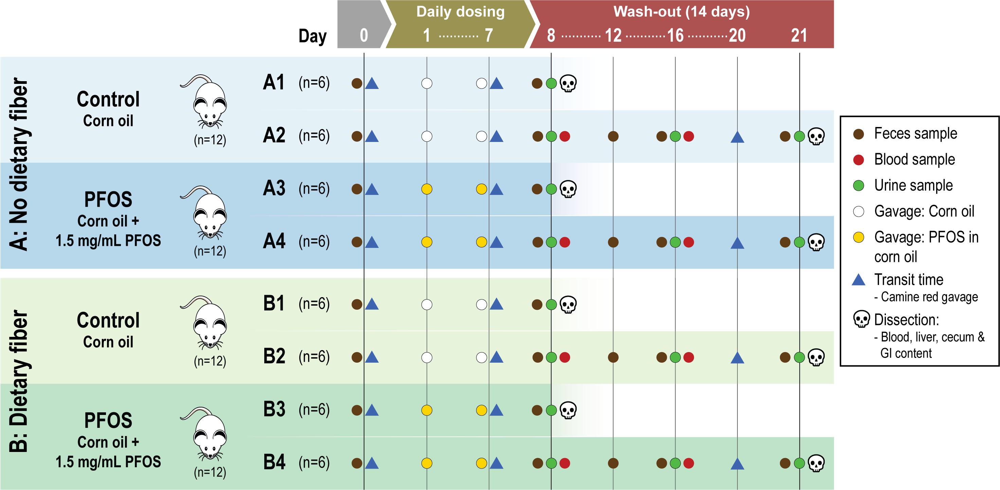
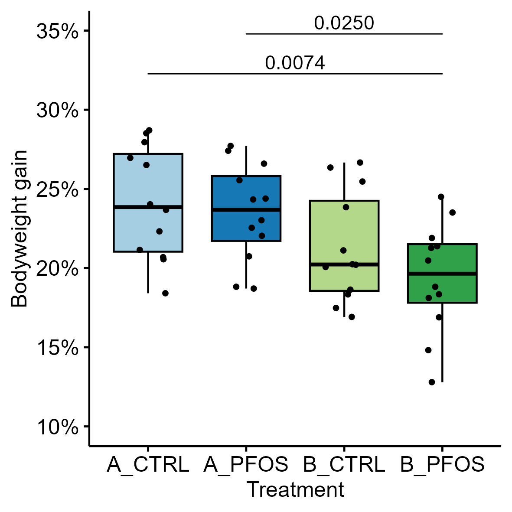
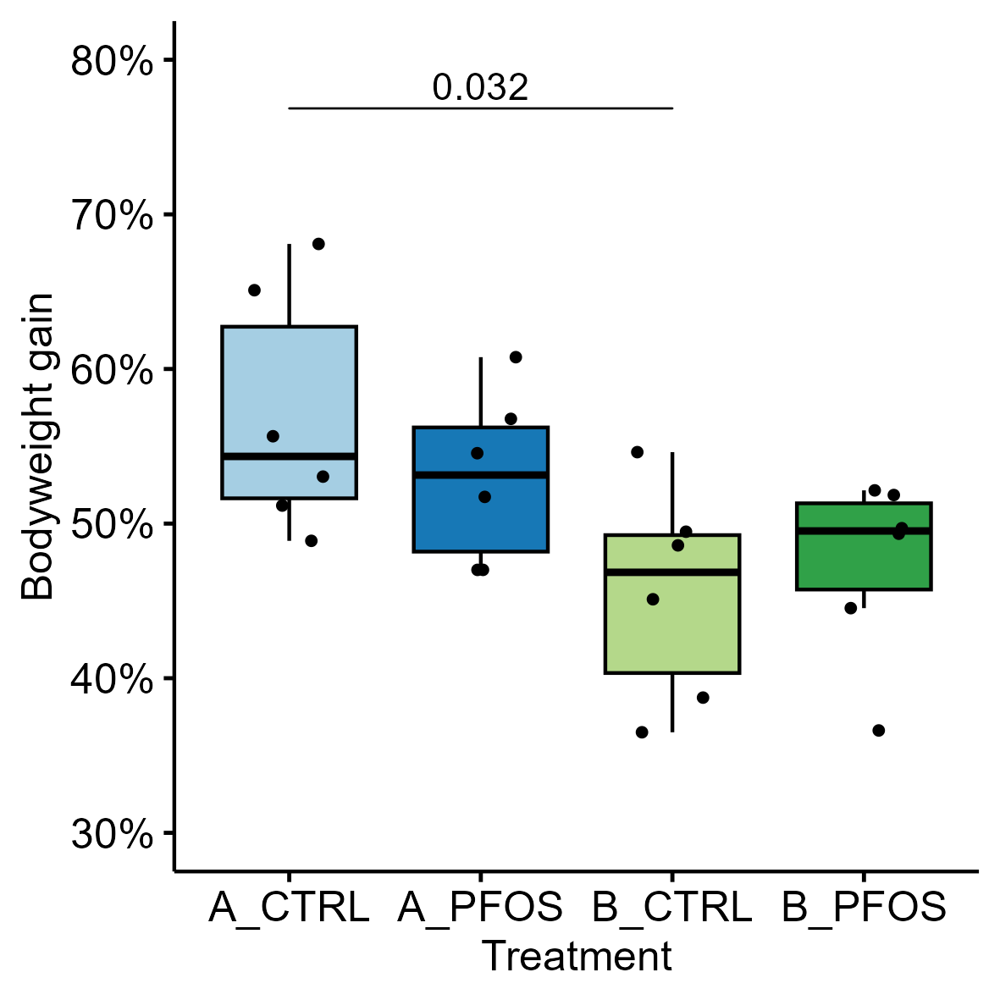
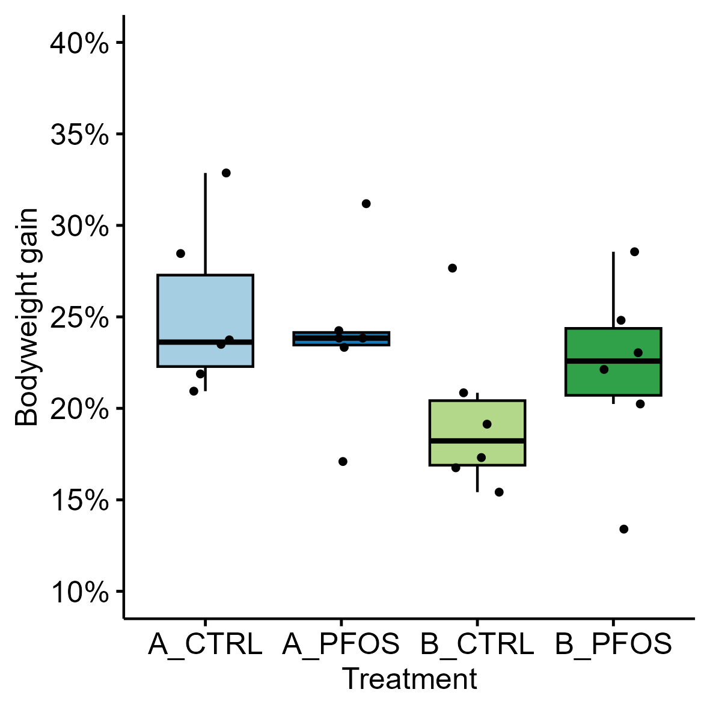

# INFO

This document contains the commands necessary to analyse experimental data obtained from "Fibrex" (internal project name: B-02-22), not including 16S-based microbiota data.

"Fibrex" refers to an animal study with the scope of investigating the effect of dietary fibres on uptake and wash-out of orally administered perfluorooctance sulfonic acid (PFOS) in adult male rats. The setup of the study is described below including a graphical overview of the setup:

- 48 adult male Sprague-Dawley rats were acclimatised (7 days prior to study start) to, and continuously fed, either:
  + Research Diet AIN-93G feed ("feed" *A*) with no dietary fibres and mineral caseine (serial number D19090404), or
  + Altromin 1314 ("feed" *B*), containing dietary fibres.
  
- Half of the rats were dosed with corn oil with or without PFOS daily for 7 days by oral gavage (2 mL / kg):
  + 12 rats in each fed group were given pure corn oil as control ("treatment" *CTRL*)
    + R01-12 for AIN-93G (*A_CTRL*)
    + R25-36 for Altromin (*B_CTRL*)
  + 12 rats in each fed group were given corn oil with suspended 1.5 mg/mL PFOS (3 mg / kg) ("treatment" *PFOS*)
    + R13-24 for AIN-93G (*A_PFOS*)
    + R37-48 for Altromin (*B_PFOS*)
  
- Study period run from Day 0 to Day 21:

  + Day 0: Feces samples and first transit time was measured
  
  + Day 1-7: Dosing period - oral gavage was given daily in the morning (~ 06:00 - 08:00)
    + Body weight was measured daily
    + Day 7: Second transit time measured
    
  + Day 8: Dissection of half of each group
    + Body weight, feces and urine samples were collected from all animals in the morning (except urine for R19)
    + Blood samples from tongue-vein was taken from all animals not dissected
    + Animals dissected:
      + R01-06
      + R13-18
      + R25-30
      + R37-40 + R43-44
    
  + Day 8-21: Wash-out period - all remaining rats were measured for PFOS in blood, feces and urine
    + Day 12: Feces samples and body weight
    + Day 16: Feces, urine, tongue-vein blood samples and body weight
    + Day 20: Third transit time measured
    
  + Day 21: Dissection of remaining 24 rats
    + Body weight, feces and urine samples were collected prior to dissection
    + Animals dissected:
      + R07-12
      + R19-24
      + R31-37
      + R41-42 + R45-48

- During each dissections following samples and information were collected:
  + Weight: Cecum weight, and Liver weight
  + Blood samples
  + Tissue samples:
    + Liver
    + Brain
  + Gastrointestinal samples from:
    + Upper and lower jejunum
    + Ileum
    + Cecum
  
{width="100%"}

The project data contains:

- **Animal identifiers**:
  + "rat_org" lists rat names as given during the study
  + "rat_name" is corrected rat names due to non-continuous numbering for rat_org and dissection days for rat_org *R41-R42* (day 21) and *R43-R44* (day 8). This column should be used for rat identification - same is corrected in metadata for microbiome data. All following information is following rat_name nomenclature.
  + "cage" number (*01-24*)
  + "feed" given during the study: *A* = no fibre, and *B* = fibre
  + "treatment" for oral gavage given: *CTRL* for control, and *PFOS* for PFOS
  + "dissection" for dissection days of each rat: *d8* and *d21*
  + combined identifiers with values from above separated by "_": "feedtreat", "feedtreatday"

- **Animal weight** data (grams) including calculated weights per bw (ratio) and normalized weight data (normalised after mean weight of control group):
  + Body weight ("bw" followed by number of day) from day *0* to day *8* and subsequent days *12*, *16*, *20* and *21*, including bw gain from day 0 - 8, 0 - 21, and 8 - 21.
  + Liver and cecum weight from dissections on day *8* and *21*
  + Estimated brain weights per rat ("brain_wt_estimate") based on ["Herculano-Houzel, Mota, and Lent - 2006"]("https://doi.org/10.1073/pnas.0604911103")
  + Estimated blood volume per rat ("bloodvol_8", "bloodvol_16", "bloodvol_21") based on an standard average of 64mL blood / kilogram in rats ["Diehl et al. 2001"]("https://doi.org/10.1002/jat.727")

- **Transit time** per rat in minutes for:
  + Day 0 ("transit_0") - note: measurement were done per cage of 2 rats, hence the real value is not known for individual rats
  + Day 7 ("transit_7")
  + Day 20 ("transit_20")
  
- **Total dosed volume** (mL) of oral gavage per rat ("dose_total_ml")

- **PFOS quantitative data** in ug / g ("_ugg") or ug / mL ("_ugml), mg total ("_mg") and percentage of total dosed PFOS in systemic samples ("_pct"):
  + Total dosed PFOS per rat on day 8 ("pfos_total_mg"), respectively
  + Systemic samples:
    + Liver values for day *8* and *21*
    + Brain values for day *8* and *21* (except *R01*, *R02*, *R13*, *R40*, *R43*, due to missing or loss of sample)
    + Blood serum values for day *8*, *16*, and *21*
  + Secreted / Wash-out samples:
    + Cecum values for day *8* and *21* (except *R04*)
    + Feces values for day *8*, *12*, *16*, and *21*
    + Urine values for day *8*, *16*, and *21*
    + total PFOS detected in blood from total dosed per day (pct)

- **pH measurements** of gastrointestinal contents by 4x dilution (wt/vol) in sterile nuclease-free water:
  + Upper and lower jejunum
  + Ileum
  + Cecum (except *R04*)

- **Short-chain fatty acids** quantification of 10 compounds in cecal water from day *8* and *21* given in mM:
  + formic acid (formate),
  + acetic acid (acetate),
  + propanoic acid (propionate),
  + 2-methyl-propanoic acid (isobutyrate),
  + butanoic acid (butyrate),
  + 3-methyl-butanoic acid (isovalerate),
  + pentanoic acid (valerate),
  + 4-methyl-pentanoic acid (isocaproate),
  + hexanoic acid (coproate) and
  + heptanoic acid (enanthate)
  
The following content of this document goes through data analysis of the above mentioned data and contains code for creation of figures used for the associated publication.

# Setup 
Following code loads packages, creates necessary folder and saves parameters for the following analyses.
```{r setup, eval=TRUE, echo=TRUE, message=FALSE, warning = FALSE}
knitr::opts_chunk$set(echo = TRUE)

# Load libraries
library(tidyverse)
library(phyloseq)
library(decontam)
library(pals)
library(ggpubr)
library(vegan)
library(phangorn)
library(kableExtra)
library(plotly)
library(rstatix)
library(forcats)
library(dplyr)
library(tidyr)
library(ggplot2)
library(cowplot)
library(DAtest)

# Create used folders if missing
if (!file.exists("R_objects")) dir.create(file.path(getwd(), "R_objects"))
if (!file.exists("plots")) dir.create(file.path(getwd(), "plots"))
if (!file.exists("plots/animal_data")) dir.create(file.path(getwd(), "plots/animal_data"))
if (!file.exists("scripts")) dir.create(file.path(getwd(), "scripts"))

# Save params
saveRDS(params, file = "R_objects/animal_params.RDS")
```

# Scripts
```{r functions, eval=TRUE, echo=TRUE, message=FALSE, warning=FALSE}


```


# LOAD DATA
Loading data from CSV-format and saves as Rdata-format.
```{r , eval=TRUE, echo=TRUE, error=TRUE}
params <- readRDS("R_objects/animal_params.RDS")
# Load analysis data
dat <- read.csv(params$input, header = TRUE, sep = ";", dec = ",")

save(dat, file = "R_objects/animal_data.Rdata")

# clear the environment and release memory
rm(list = ls(all.names = TRUE)) #will clear all objects includes hidden objects.
invisible(gc()) #free up memory and report the memory usage.
```


# ANIMAL WEIGHT DATA {.tabset .tabset-fade .tabset-pills}
Animal weight data contains data from body weight through the entire study period with calculated body weight gain, and organ weights from cecum and liver. 

## Body weight gain - Day 0-8
This section will prepare to perform the data analysis for body weight gain

### Statistics
#### **Prepare data**

This section sets the variables to be used and prepares the data if necessary.

```{r, eval=TRUE}
# load data 
load("R_objects/animal_data.Rdata")
params <- readRDS("R_objects/animal_params.RDS")
dat.clean <- dat
#dat.clean <- dat %>% select_if(~ !any(is.na(.)))
#dat.clean <- subset(dat, !dat$rat_name %in% c("R01","R30"))

# Set names of variables
PREDICTOR <- "feedtreat"#c("treatment","pfos","van")
OUTCOME <- "bw_gain08"
SUBJECT <- "rat_name"

# Create formula
PREDICTOR.F <- ifelse(length(PREDICTOR) > 1, paste(PREDICTOR, collapse = "*"), PREDICTOR)
FORMULA <- as.formula(paste(OUTCOME,PREDICTOR.F, sep = " ~ "))

# Summary samples in groups
dat.clean %>% group_by(across(all_of(PREDICTOR))) %>% get_summary_stats(!!sym(OUTCOME), type = "mean_sd")

# Create plot
bxp <- dat.clean %>%
  ggboxplot(x = if_else(length(PREDICTOR) > 1, PREDICTOR[2],PREDICTOR[1]),
            y = OUTCOME,
            color = PREDICTOR[1],
            facet.by = if(length(PREDICTOR) == 3) PREDICTOR[3],
            palette = params$COL)
bxp

```
#### **Assumptions and preliminary tests**

The ANOVA tests assume the following characteristics about the data:

-   **Independence of the observations.** Each subject should belong to only one group. There is no relationship between the observations in each group.\
    *This is already done for the whole project*

-   **No significant outliers** in the two groups

-   **Normality.** the data for each group should be approximately normally distributed.

-   **Homogeneity of variances.** the variance of the outcome variable should be equal in each group.

In this section, we'll perform some preliminary tests to check whether these assumptions are met.

**Identify outliers**\
Outliers can be easily identified using boxplot methods, implemented in the R function identify_outliers() [rstatix package].

```{r, eval=TRUE}
# Test for outliers
dat.clean %>% 
  group_by(across(all_of(PREDICTOR))) %>% 
  identify_outliers(!!sym(OUTCOME))
```

Data contains two outliers: sample from rat_name R01 and R30. 

**Check normality**\
QQ plot and Shapiro-Wilk test of normality are used to analyze the model residuals.

```{r , eval=TRUE, echo=TRUE, error=TRUE}
# Build the linear model
model  <- lm(FORMULA, data = dat.clean)
# Create a QQ plot of residuals
ggqqplot(residuals(model))
# Compute Shapiro-Wilk test of normality
shapiro_test(residuals(model))
```

**Test homogneity of variance assumption**\
1. The residuals versus fits plot can be used to check the homogeneity of variances.

```{r , eval=TRUE, echo=TRUE, error=TRUE}
plot(model, 1)
```

2.  It's also possible to use the Levene's test to check the homogeneity of variances:

```{r , eval=TRUE, echo=TRUE, error=TRUE}
dat.clean %>% levene_test(FORMULA)

# Save result
EQUAL.VAR <- dat.clean %>% levene_test(FORMULA) %>% pull(p) > 0.05

```

This shows that body weight gain data has two outliers, has equal variance and is normally distributed without the outliers according to Shapiro-Wilk test. Therefore we use a **one-way ANOVA test with Tukey's honest significance test**.

#### ANOVA One-Way test

##### **Perform test**

If we had equality of variance we can now run a one-way ANOVA tests `anova_test()` (if we have equal variance) or a `welch_anova_test()` (if variance vary).

```{r , eval=TRUE, echo=TRUE, error=TRUE}

if(EQUAL.VAR) {
  res.aov <- dat.clean %>% anova_test(FORMULA)
  res.aov
} else {
  res.aov <- dat.clean %>% welch_anova_test(FORMULA)
  res.aov
}

```

##### **Perform posthoc test**

A significant one-way ANOVA is generally followed up by Tukey post-hoc tests to perform multiple pairwise comparisons between groups. When running relaxed Welch one-way test, the Games-Howell post hoc test or pairwise t-tests (with no assumption of equal variances) can be used to compare all possible combinations of group differences.

```{r , eval=TRUE, echo=TRUE, error=TRUE}
if(EQUAL.VAR) {
  pwc <- dat.clean %>% tukey_hsd(FORMULA)
  pwc
} else {
  pwc <- dat.clean %>% games_howell_test(FORMULA)
  pwc
}
```

### Create figure
```{r , eval=TRUE, echo=TRUE}
## Prepare statistical information:
pwc.adj <- pwc %>% 
  add_x_position(x = PREDICTOR) %>%
  p_format("p.adj", accuracy = 0.0001, trailing.zero = TRUE, new.col = TRUE)

# Format for ggplot
if (sum(pwc.adj$p.adj.signif != "ns") == 0) {
  stat.sig <- pwc.adj %>%
    add_y_position(step.increase = 0.25) %>%
    mutate(y.position = seq(min(y.position), max(y.position),length.out = n()))
} else {
  stat.sig <- pwc.adj[pwc.adj$p.adj.signif != "ns",] %>%
    add_y_position(step.increase = 0.25) %>%
    mutate(y.position = seq(min(y.position), max(y.position),length.out = n()))
}

# Create plot
p <- ggboxplot(dat.clean, x = PREDICTOR, y = OUTCOME,
          fill = PREDICTOR,
          add =  "jitter",
          add.params = list(size = 1)) +
  scale_fill_manual(values = params$COL) +
  scale_y_continuous(name = "Bodyweight gain",limits = c(10,35),breaks = seq(10,35,5), labels = function(x) paste0(x, "%")) +
  labs(fill = "Treatment") +
  scale_x_discrete(name = "Treatment")

p <- p + stat_pvalue_manual(stat.sig, label = "p.adj.format",tip.length = 0, hide.ns = TRUE)
p
# Plot for saving without legend
p2 <- p + theme(legend.position = "none")

# Output plot
ggsave(filename = paste0("plots/animal_data/weight/",OUTCOME,"_plot.png"), p2, device = "png", dpi = 300, units = "mm", width = 100, height = 100)
ggsave(filename = paste0("plots/animal_data/weight/",OUTCOME,"_plot.pdf"), p2, device = "pdf", dpi = 300, units = "mm", width = 100, height = 100)

# clear the environment and release memory
rm(list = ls(all.names = TRUE)) #will clear all objects includes hidden objects.
invisible(gc()) #free up memory and report the memory usage.
```

{width="100%"}

## Body weight gain - Day 0-21
This section will prepare to perform the data analysis for body weight gain

### Statistics
#### **Prepare data**

This section sets the variables to be used and prepares the data if necessary.

```{r, eval=TRUE}
# load data 
load("R_objects/animal_data.Rdata")
params <- readRDS("R_objects/animal_params.RDS")

# Subset
dat.clean <- subset(dat, !is.na(bw_gain021))

# Set names of variables
PREDICTOR <- "feedtreat"#c("treatment","pfos","van")
OUTCOME <- "bw_gain021"
SUBJECT <- "rat_name"

# Create formula
PREDICTOR.F <- ifelse(length(PREDICTOR) > 1, paste(PREDICTOR, collapse = "*"), PREDICTOR)
FORMULA <- as.formula(paste(OUTCOME,PREDICTOR.F, sep = " ~ "))

# Summary samples in groups
dat.clean %>% group_by(across(all_of(PREDICTOR))) %>% get_summary_stats(!!sym(OUTCOME), type = "mean_sd")
```

#### **Visualise**

Create a boxplot of the data.

```{r , eval=TRUE, echo=TRUE, error=TRUE}
# Create plot
bxp <- dat.clean %>%
  ggboxplot(x = if_else(length(PREDICTOR) > 1, PREDICTOR[2],PREDICTOR[1]),
            y = OUTCOME,
            color = PREDICTOR[1],
            facet.by = if(length(PREDICTOR) == 3) PREDICTOR[3],
            palette = params$COL)
bxp

```
#### **Assumptions and preliminary tests**

The ANOVA tests assume the following characteristics about the data:

-   **Independence of the observations.** Each subject should belong to only one group. There is no relationship between the observations in each group.\
    *This is already done for the whole project*

-   **No significant outliers** in the two groups

-   **Normality.** the data for each group should be approximately normally distributed.

-   **Homogeneity of variances.** the variance of the outcome variable should be equal in each group.

In this section, we'll perform some preliminary tests to check whether these assumptions are met.

**Identify outliers**\
Outliers can be easily identified using boxplot methods, implemented in the R function identify_outliers() [rstatix package].

```{r, eval=TRUE}
# Test for outliers
dat.clean %>% 
  group_by(across(all_of(PREDICTOR))) %>% 
  identify_outliers(!!sym(OUTCOME))
```

Data contains two outliers: sample from rat_name R01 and R30. 

**Check normality**\
QQ plot and Shapiro-Wilk test of normality are used to analyze the model residuals.

```{r , eval=TRUE, echo=TRUE, error=TRUE}
# Build the linear model
model  <- lm(FORMULA, data = dat.clean)
# Create a QQ plot of residuals
ggqqplot(residuals(model))
# Compute Shapiro-Wilk test of normality
shapiro_test(residuals(model))
```

**Test homogneity of variance assumption**\
1. The residuals versus fits plot can be used to check the homogeneity of variances.

```{r , eval=TRUE, echo=TRUE, error=TRUE}
plot(model, 1)
```

2.  It's also possible to use the Levene's test to check the homogeneity of variances:

```{r , eval=TRUE, echo=TRUE, error=TRUE}
dat.clean %>% levene_test(FORMULA)

# Save result
EQUAL.VAR <- dat.clean %>% levene_test(FORMULA) %>% pull(p) > 0.05

```

This shows that body weight gain data has two outliers, has equal variance and is normally distributed without the outliers according to Shapiro-Wilk test. Therefore we use a **one-way ANOVA test with Tukey's honest significance test**.

#### ANOVA One-Way test

##### **Perform test**

If we had equality of variance we can now run a one-way ANOVA tests `anova_test()` (if we have equal variance) or a `welch_anova_test()` (if variance vary).

```{r , eval=TRUE, echo=TRUE, error=TRUE}

if(EQUAL.VAR) {
  res.aov <- dat.clean %>% anova_test(FORMULA)
  res.aov
} else {
  res.aov <- dat.clean %>% welch_anova_test(FORMULA)
  res.aov
}

```

##### **Perform posthoc test**

A significant one-way ANOVA is generally followed up by Tukey post-hoc tests to perform multiple pairwise comparisons between groups. When running relaxed Welch one-way test, the Games-Howell post hoc test or pairwise t-tests (with no assumption of equal variances) can be used to compare all possible combinations of group differences.

```{r , eval=TRUE, echo=TRUE, error=TRUE}
if(EQUAL.VAR) {
  pwc <- dat.clean %>% tukey_hsd(FORMULA)
  pwc
} else {
  pwc <- dat.clean %>% games_howell_test(FORMULA)
  pwc
}
```

### Create figure
```{r , eval=TRUE, echo=TRUE}
## Prepare statistical information:
pwc.adj <- pwc %>% 
  add_x_position(x = PREDICTOR) %>%
  p_format("p.adj", accuracy = 0.0001, trailing.zero = TRUE, new.col = TRUE)

# Format for ggplot
if (sum(pwc.adj$p.adj.signif != "ns") == 0) {
  stat.sig <- pwc.adj %>%
    add_y_position(step.increase = 0.25) %>%
    mutate(y.position = seq(min(y.position), max(y.position),length.out = n()))
} else {
  stat.sig <- pwc.adj[pwc.adj$p.adj.signif != "ns",] %>%
    add_y_position(step.increase = 0.25) %>%
    mutate(y.position = seq(min(y.position), max(y.position),length.out = n()))
}

# Create plot
p <- ggboxplot(dat.clean, x = PREDICTOR, y = OUTCOME,
          fill = PREDICTOR,
          add =  "jitter",
          add.params = list(size = 1)) +
  scale_fill_manual(values = params$COL) +
  scale_y_continuous(name = "Bodyweight gain",limits = c(30,80),breaks = seq(30,80,10), labels = function(x) paste0(x, "%")) +
  labs(fill = "Treatment") +
  scale_x_discrete(name = "Treatment")

p <- p + stat_pvalue_manual(stat.sig, label = "p.adj.format",tip.length = 0, hide.ns = TRUE)
p
# Plot for saving without legend
p2 <- p + theme(legend.position = "none")

# Output plot
ggsave(filename = paste0("plots/animal_data/weight/",OUTCOME,"_plot.png"), p2, device = "png", dpi = 300, units = "mm", width = 100, height = 100)
ggsave(filename = paste0("plots/animal_data/weight/",OUTCOME,"_plot.pdf"), p2, device = "pdf", dpi = 300, units = "mm", width = 100, height = 100)

# clear the environment and release memory
rm(list = ls(all.names = TRUE)) #will clear all objects includes hidden objects.
invisible(gc()) #free up memory and report the memory usage.
```

{width="100%"}


## Body weight gain - Day 8-21
This section will prepare to perform the data analysis for body weight gain

### Statistics
#### **Prepare data**

This section sets the variables to be used and prepares the data if necessary.

```{r, eval=TRUE}
# load data 
load("R_objects/animal_data.Rdata")
params <- readRDS("R_objects/animal_params.RDS")

# Subset
dat.clean <- subset(dat, !is.na(bw_gain821))

# Set names of variables
PREDICTOR <- "feedtreat"#c("treatment","pfos","van")
OUTCOME <- "bw_gain821"
SUBJECT <- "rat_name"

# Create formula
PREDICTOR.F <- ifelse(length(PREDICTOR) > 1, paste(PREDICTOR, collapse = "*"), PREDICTOR)
FORMULA <- as.formula(paste(OUTCOME,PREDICTOR.F, sep = " ~ "))

# Summary samples in groups
dat.clean %>% group_by(across(all_of(PREDICTOR))) %>% get_summary_stats(!!sym(OUTCOME), type = "mean_sd")
```

#### **Visualise**

Create a boxplot of the data.

```{r , eval=TRUE, echo=TRUE, error=TRUE}
# Create plot
bxp <- dat.clean %>%
  ggboxplot(x = if_else(length(PREDICTOR) > 1, PREDICTOR[2],PREDICTOR[1]),
            y = OUTCOME,
            color = PREDICTOR[1],
            facet.by = if(length(PREDICTOR) == 3) PREDICTOR[3],
            palette = params$COL)
bxp

```
#### **Assumptions and preliminary tests**

The ANOVA tests assume the following characteristics about the data:

-   **Independence of the observations.** Each subject should belong to only one group. There is no relationship between the observations in each group.\
    *This is already done for the whole project*

-   **No significant outliers** in the two groups

-   **Normality.** the data for each group should be approximately normally distributed.

-   **Homogeneity of variances.** the variance of the outcome variable should be equal in each group.

In this section, we'll perform some preliminary tests to check whether these assumptions are met.

**Identify outliers**\
Outliers can be easily identified using boxplot methods, implemented in the R function identify_outliers() [rstatix package].

```{r, eval=TRUE}
# Test for outliers
dat.clean %>% 
  group_by(across(all_of(PREDICTOR))) %>% 
  identify_outliers(!!sym(OUTCOME))
```

Data contains two outliers: sample from rat_name R01 and R30. 

**Check normality**\
QQ plot and Shapiro-Wilk test of normality are used to analyze the model residuals.

```{r , eval=TRUE, echo=TRUE, error=TRUE}
# Build the linear model
model  <- lm(FORMULA, data = dat.clean)
# Create a QQ plot of residuals
ggqqplot(residuals(model))
# Compute Shapiro-Wilk test of normality
shapiro_test(residuals(model))
```

**Test homogneity of variance assumption**\
1. The residuals versus fits plot can be used to check the homogeneity of variances.

```{r , eval=TRUE, echo=TRUE, error=TRUE}
plot(model, 1)
```

2.  It's also possible to use the Levene's test to check the homogeneity of variances:

```{r , eval=TRUE, echo=TRUE, error=TRUE}
dat.clean %>% levene_test(FORMULA)

# Save result
EQUAL.VAR <- dat.clean %>% levene_test(FORMULA) %>% pull(p) > 0.05

```

This shows that body weight gain data has two outliers, has equal variance and is normally distributed without the outliers according to Shapiro-Wilk test. Therefore we use a **one-way ANOVA test with Tukey's honest significance test**.

#### ANOVA One-Way test

##### **Perform test**

If we had equality of variance we can now run a one-way ANOVA tests `anova_test()` (if we have equal variance) or a `welch_anova_test()` (if variance vary).

```{r , eval=TRUE, echo=TRUE, error=TRUE}

if(EQUAL.VAR) {
  res.aov <- dat.clean %>% anova_test(FORMULA)
  res.aov
} else {
  res.aov <- dat.clean %>% welch_anova_test(FORMULA)
  res.aov
}

```

##### **Perform posthoc test**

A significant one-way ANOVA is generally followed up by Tukey post-hoc tests to perform multiple pairwise comparisons between groups. When running relaxed Welch one-way test, the Games-Howell post hoc test or pairwise t-tests (with no assumption of equal variances) can be used to compare all possible combinations of group differences.

```{r , eval=TRUE, echo=TRUE, error=TRUE}
if(EQUAL.VAR) {
  pwc <- dat.clean %>% tukey_hsd(FORMULA)
  pwc
} else {
  pwc <- dat.clean %>% games_howell_test(FORMULA)
  pwc
}
```

### Create figure
```{r , eval=TRUE, echo=TRUE}
## Prepare statistical information:
pwc.adj <- pwc %>% 
  add_x_position(x = PREDICTOR) %>%
  p_format("p.adj", accuracy = 0.0001, trailing.zero = TRUE, new.col = TRUE)

# Format for ggplot
if (sum(pwc.adj$p.adj.signif != "ns") == 0) {
  stat.sig <- pwc.adj %>%
    add_y_position(step.increase = 0.25) %>%
    mutate(y.position = seq(min(y.position), max(y.position),length.out = n()))
} else {
  stat.sig <- pwc.adj[pwc.adj$p.adj.signif != "ns",] %>%
    add_y_position(step.increase = 0.25) %>%
    mutate(y.position = seq(min(y.position), max(y.position),length.out = n()))
}

# Create plot
p <- ggboxplot(dat.clean, x = PREDICTOR, y = OUTCOME,
          fill = PREDICTOR,
          add =  "jitter",
          add.params = list(size = 1)) +
  scale_fill_manual(values = params$COL) +
  scale_y_continuous(name = "Bodyweight gain",limits = c(10,40),breaks = seq(10,40,5), labels = function(x) paste0(x, "%")) +
  labs(fill = "Treatment") +
  scale_x_discrete(name = "Treatment")

p <- p + stat_pvalue_manual(stat.sig, label = "p.adj.format",tip.length = 0, hide.ns = TRUE)
p
# Plot for saving without legend
p2 <- p + theme(legend.position = "none")

# Output plot
ggsave(filename = paste0("plots/animal_data/weight/",OUTCOME,"_plot.png"), p2, device = "png", dpi = 300, units = "mm", width = 100, height = 100)
ggsave(filename = paste0("plots/animal_data/weight/",OUTCOME,"_plot.pdf"), p2, device = "pdf", dpi = 300, units = "mm", width = 100, height = 100)

# clear the environment and release memory
rm(list = ls(all.names = TRUE)) #will clear all objects includes hidden objects.
invisible(gc()) #free up memory and report the memory usage.
```

{width="100%"}

## Body weight over time
This section will prepare data analysis and illustration of body weight data per rat over the course of this study.
###**Prepare data**
```{r , eval=TRUE, echo=TRUE, error=TRUE}
# Load data
load("R_objects/animal_data.Rdata")
params <- readRDS("R_objects/animal_params.RDS")

# Set parameters
PREDICTOR <- c("bw_time","treatment","feed")
OUTCOME <- "wt"
SUBJECT <- "rat_name"

# Create data frame for data representation
dat.clean <- dat %>% select(rat_name, feed, treatment, feedtreat, dissection, bw_0, bw_1, bw_2, bw_3, bw_4, bw_5, bw_6, bw_7, bw_8, bw_12, bw_16, bw_21) %>%
  pivot_longer(., cols = c(bw_0, bw_1, bw_2, bw_3, bw_4, bw_5, bw_6, bw_7, bw_8, bw_12, bw_16, bw_21), names_to = "bw_time", values_to = "wt")

# Create column for day of sampling
dat.clean <- dat.clean %>% mutate("day" = case_when(bw_time == "bw_0" ~ "d0",
                                                    bw_time == "bw_1" ~ "d01",
                                                    bw_time == "bw_2" ~ "d02",
                                                    bw_time == "bw_3" ~ "d03",
                                                    bw_time == "bw_4" ~ "d04",
                                                    bw_time == "bw_5" ~ "d05",
                                                    bw_time == "bw_6" ~ "d06",
                                                    bw_time == "bw_7" ~ "d07",
                                                    bw_time == "bw_8" ~ "d08",
                                                    bw_time == "bw_12" ~ "d12",
                                                    bw_time == "bw_16" ~ "d16",
                                                    bw_time == "bw_21" ~ "d21"))
  
# Order dataframe for analysis
dat.clean <- dat.clean[order(dat.clean$day),]

# Remove rows with NA
dat.clean <- subset(dat.clean, !is.na(wt))

# Select based on dissection day
dat.clean <- subset(dat.clean, dissection == "d21")

# Create formula
PREDICTOR.F <- ifelse(length(PREDICTOR) > 1, paste(PREDICTOR, collapse = "*"), PREDICTOR)
FORMULA <- as.formula(paste(OUTCOME,PREDICTOR.F, sep = " ~ "))

# Summary samples in groups
dat.clean %>% group_by(across(all_of(PREDICTOR))) %>% get_summary_stats(!!sym(OUTCOME), type = "mean_sd")

p <- ggplot(dat.clean, aes(x = day, y = wt, fill = feedtreat)) +
  geom_line(aes(group = rat_name, color = feedtreat), stat = "identity") +
  geom_boxplot(outlier.shape = NA, ) + 
  #geom_point(position = position_jitterdodge(jitter.width = 0.25), size = 0.5) +
  scale_fill_manual(values = params$COL1, labels = c("No fibre CTRL","No fibre PFOS","Fibre CTRL","Fibre PFOS"), name = "Groupings") +
  scale_color_manual(values = params$COL1) + 
  scale_y_continuous(name = "Body weight (g)", breaks = seq(250,550,50)) +
  scale_x_discrete(name = "Day", labels = c("0","1","2","3","4","5","6","7","8","12","16","21")) +
  theme_pubr() +
  guides(color = "none")
p

suppressMessages(ggsave(filename = "plots/animal_data/weight/d21_bodyweight_over_time.png", plot = p, device = "png", dpi = 300, units = "mm", height = 100, width = 150))
suppressMessages(ggsave(filename = "plots/animal_data/weight/d21_bodyweight_over_time.pdf", plot = p, device = "pdf", dpi = 300, units = "mm", height = 100, width = 150))
       
```
### **Visualise**

Create a boxplot of the data.

```{r , eval=TRUE, echo=TRUE, error=TRUE}
# Create plot
bxp <- dat.clean %>%
  ggboxplot(x = if_else(length(PREDICTOR) > 1, PREDICTOR[2],PREDICTOR[1]),
            y = OUTCOME,
            color = PREDICTOR[1],
            facet.by = if(length(PREDICTOR) == 3) PREDICTOR[3],
            palette = params$COL)
bxp

```

### **Assumptions and preliminary tests**

The ANOVA tests assume the following characteristics about the data:

-   **Independence of the observations.** Each subject should belong to only one group. There is no relationship between the observations in each group.\
    *This is already done for the whole project*

-   **No significant outliers** in the two groups

-   **Normality.** the data for each group should be approximately normally distributed.

-   **Homogeneity of variances.** the variance of the outcome variable should be equal in each group.

In this section, we'll perform some preliminary tests to check whether these assumptions are met.

**Identify outliers**\
Outliers can be easily identified using boxplot methods, implemented in the R function identify_outliers() [rstatix package].

```{r, eval=TRUE}
# Test for outliers
dat.clean %>% 
  group_by(across(all_of(PREDICTOR))) %>% 
  identify_outliers(!!sym(OUTCOME))
```

Data contains two outliers: sample from rat_name R01 and R30. 

**Check normality**\
QQ plot and Shapiro-Wilk test of normality are used to analyze the model residuals.

```{r , eval=TRUE, echo=TRUE, error=TRUE}
# Build the linear model
model  <- lm(FORMULA, data = dat.clean)
# Create a QQ plot of residuals
ggqqplot(residuals(model))
# Compute Shapiro-Wilk test of normality
shapiro_test(residuals(model))
```

**Test homogneity of variance assumption**\
1. The residuals versus fits plot can be used to check the homogeneity of variances.

```{r , eval=TRUE, echo=TRUE, error=TRUE}
plot(model, 1)
```

2.  It's also possible to use the Levene's test to check the homogeneity of variances:

```{r , eval=TRUE, echo=TRUE, error=TRUE}
dat.clean %>% levene_test(FORMULA)

# Save result
EQUAL.VAR <- dat.clean %>% levene_test(FORMULA) %>% pull(p) > 0.05

```

This shows that body weight data has several outliers (which we will igore here as it does not change the result of the analysis), has equal variance and is normally distributed according to Shapiro-Wilk test. Therefore we use a **one-way ANOVA test with Tukey's honest significance test**.

#### ANOVA One-Way test

##### **Perform test**

If we had equality of variance we can now run a one-way ANOVA tests `anova_test()` (if we have equal variance) or a `welch_anova_test()` (if variance vary).

```{r , eval=TRUE, echo=TRUE, error=TRUE}

if(EQUAL.VAR) {
  res.aov <- dat.clean %>% anova_test(FORMULA)
  res.aov
} else {
  res.aov <- dat.clean %>% welch_anova_test(FORMULA)
  res.aov
}

```

##### **Perform posthoc test**

A significant one-way ANOVA is generally followed up by Tukey post-hoc tests to perform multiple pairwise comparisons between groups. When running relaxed Welch one-way test, the Games-Howell post hoc test or pairwise t-tests (with no assumption of equal variances) can be used to compare all possible combinations of group differences.

```{r , eval=TRUE, echo=TRUE, error=TRUE}
if(EQUAL.VAR) {
  pwc <- dat.clean %>% tukey_hsd(FORMULA)
  pwc
} else {
  pwc <- dat.clean %>% games_howell_test(FORMULA)
  pwc
}
```


### Nested (WORK IN PROCESS)
Testing two variables are used when there is a nested aspect in the analysis, for example difference in treatment at each timepoint, that would have the timepoint as the outer variable and treatment as the inner variable

```{r , eval = FALSE}

#adat$Week_factor <- as.factor(adat$Week_clean)
INNER.VAR <- "feed"
OUTER.VAR <- "bw_time"

# # Subset
# adat <- adat[adat$material == var1 & adat$day == var2,]

# Remove samples with incomplete metadata
##dat.clean <- dat.clean[!is.na(dat.clean[,INNER.VAR]) & !is.na(dat.clean[,OUTER.VAR]),]
dat.clean[,OUTER.VAR] <- as.factor(dat.clean[,OUTER.VAR])
dat.clean[,INNER.VAR] <- as.factor(dat.clean[,INNER.VAR])

#### Test project variable
### Observed richness
fit <- aov(as.formula(paste("wt ~", OUTER.VAR,"*",INNER.VAR, sep = " ")), data = dat.clean)
anova(fit)
TukeyHSD(fit)

## Calculate stats for inner variable
# Perform pairwise comparisons
stat.test <- dat.clean %>%
  group_by(.data[[OUTER.VAR]]) %>%
  wilcox_test(as.formula(paste("wt ~", INNER.VAR, sep = " "))) %>%
  adjust_pvalue(method = "BH") %>%
  add_significance("p.adj") %>% 
  add_xy_position(x = OUTER.VAR, dodge = 0.8) %>%
  p_format("p.adj", accuracy = 0.0001, trailing.zero = TRUE, new.col = TRUE)

## Calculate stats for outer variable
# Perform pairwise comparisons
stat.test2 <- dat.clean %>%
  wilcox_test(as.formula(paste("wt ~", OUTER.VAR, sep = " "))) %>%
  adjust_pvalue(method = "BH") %>%
  add_significance("p.adj") %>% 
  add_xy_position(x = OUTER.VAR) %>%
  p_format("p.adj", accuracy = 0.0001, trailing.zero = TRUE, new.col = TRUE)

# Adjust y value for outer p-values
stat.test2$y.position <- max(stat.test$y.position)*1.1

# Create plot
p <- ggboxplot(dat.clean, x = OUTER.VAR, y = "wt",
          color = INNER.VAR, palette = "jco",
          add = "jitter")
p
# Add p-values
p.obs <- p + stat_pvalue_manual(stat.test, label = "p.adj.format",tip.length = 0)
p.obs <- p.obs + stat_pvalue_manual(stat.test2, label = "p.adj.format",tip.length = 0.02, step.increase = 0.1, hide.ns = TRUE)
p.obs
### Create output plot
filename <- paste0("plots/adiv/alpha_f0/adiv_",OUTER.VAR,"_",INNER.VAR,"_",var1,"_",var2,".png")
filename2 <- paste0("plots/adiv/alpha_f0/adiv_",OUTER.VAR,"_",INNER.VAR,"_",var1,"_",var2,".pdf")
adiv_plot <- ggarrange(p.obs,p.eve,p.sha,p.fpd, nrow = 1, labels = c("A)","B)","C)","D)"), common.legend = TRUE,legend = "bottom")
adiv.plot <- adiv_plot + ggtitle(paste0("Difference in alpha diversity between ",OUTER.VAR, " and ",INNER.VAR,":"))
suppressMessages(ggsave(filename = filename, plot = adiv.plot, device = "png", units = "mm", width = 350, height = 100, dpi = 300))
suppressMessages(ggsave(filename = filename2, plot = adiv.plot, device = "pdf", units = "mm", width = 350, height = 100, dpi = 300))


# clear the environment and release memory
rm(list = ls(all.names = TRUE)[ls(all.names = TRUE) != "params"])
invisible(gc())


```


### Create figure
```{r}

```

## Cecum weight (normalized)
This section will prepare to perform the data analysis for normalized cecum weight data. Data is normalised after no fiber group control on respective days, 

### Statistics
#### **Prepare data**

This section sets the variables to be used and prepares the data if necessary.

```{r, eval=TRUE}
# load data 
load("R_objects/animal_data.Rdata")
params <- readRDS("R_objects/animal_params.RDS")
dat.clean <- subset(dat, !is.na(cecum_norm))

# Set names of variables
PREDICTOR <- c("treatment","feed","dissection")
OUTCOME <- "cecum_norm"
SUBJECT <- "rat_name"

# Create formula
PREDICTOR.F <- ifelse(length(PREDICTOR) > 1, paste(PREDICTOR, collapse = "*"), PREDICTOR)
FORMULA <- as.formula(paste(OUTCOME,PREDICTOR.F, sep = " ~ "))

# Summary samples in groups
dat.clean %>% group_by(across(all_of(PREDICTOR))) %>% get_summary_stats(!!sym(OUTCOME), type = "mean_sd")
```

#### **Visualise**

Create a boxplot of the data.

```{r , eval=TRUE, echo=TRUE, error=TRUE}
# Create plot
bxp <- dat.clean %>%
  ggboxplot(x = if_else(length(PREDICTOR) > 1, PREDICTOR[2],PREDICTOR[1]),
            y = OUTCOME,
            color = PREDICTOR[1],
            facet.by = if(length(PREDICTOR) == 3) PREDICTOR[3],
            palette = "jco")
bxp

```
#### **Assumptions and preliminary tests**

The ANOVA tests assume the following characteristics about the data:

-   **Independence of the observations.** Each subject should belong to only one group. There is no relationship between the observations in each group.\
    *This is already done for the whole project*

-   **No significant outliers** in the two groups

-   **Normality.** the data for each group should be approximately normally distributed.

-   **Homogeneity of variances.** the variance of the outcome variable should be equal in each group.

In this section, we'll perform some preliminary tests to check whether these assumptions are met.

**Identify outliers**\
Outliers can be easily identified using boxplot methods, implemented in the R function identify_outliers() [rstatix package].

```{r, eval=TRUE}
# Test for outliers
dat.clean %>% 
  group_by(across(all_of(PREDICTOR))) %>% 
  identify_outliers(!!sym(OUTCOME))
```

Data contains **zero outliers**.

**Check normality**\
QQ plot and Shapiro-Wilk test of normality are used to analyze the model residuals.

```{r , eval=TRUE, echo=TRUE, error=TRUE}
# Build the linear model
model  <- lm(FORMULA, data = dat.clean)
# Create a QQ plot of residuals
ggqqplot(residuals(model))
# Compute Shapiro-Wilk test of normality
shapiro_test(residuals(model))
```

Data is **Normally distributed**.

**Test homogneity of variance assumption**\
1. The residuals versus fits plot can be used to check the homogeneity of variances.

```{r , eval=TRUE, echo=TRUE, error=TRUE}
plot(model, 1)
```

2.  It's also possible to use the Levene's test to check the homogeneity of variances:

```{r , eval=TRUE, echo=TRUE, error=TRUE}
dat.clean %>% levene_test(FORMULA)

# Save result
EQUAL.VAR <- dat.clean %>% levene_test(FORMULA) %>% pull(p) > 0.05

```

This all shows that normalised cecum weight data has zero outliers, is normally distribution and has equal variance. Therefore we use a **one-way ANOVA test with Tukey's honest significance test** to test data for all factors of interest, while using **unpaired t-test** for pairwise comparisons.

#### ANOVA One-Way test

##### **Perform test**

If we had equality of variance we can now run a one-way ANOVA tests `anova_test()` (if we have equal variance) or a `welch_anova_test()` (if variance vary).

```{r , eval=TRUE, echo=TRUE, error=TRUE}

if(EQUAL.VAR) {
  res.aov <- dat.clean %>% anova_test(FORMULA)
  res.aov
} else {
  res.aov <- dat.clean %>% welch_anova_test(FORMULA)
  res.aov
}

```
ANOVA shows that feed has the only significant effect on the overall data.

##### **Perform posthoc test**

A significant one-way ANOVA is generally followed up by Tukey post-hoc tests to perform multiple pairwise comparisons between groups. When running relaxed Welch one-way test, the Games-Howell post hoc test or pairwise t-tests (with no assumption of equal variances) can be used to compare all possible combinations of group differences.

```{r , eval=TRUE, echo=TRUE, error=TRUE}
if(EQUAL.VAR) {
  pwc <- dat.clean %>% tukey_hsd(FORMULA)
  pwc
} else {
  pwc <- dat.clean %>% games_howell_test(FORMULA)
  pwc
}
```

### Nested analysis & Figure
Testing two variables are used when there is a nested aspect in the analysis, for example difference in treatment at each timepoint, that would have the timepoint as the outer variable and treatment as the inner variable

```{r , eval = FALSE}
# Set variables for inner and outer analysis, and variable for facet
INNER.VAR <- "treatment"
OUTER.VAR <- "feed"
FACETVAR <- "dissection"

# Remove samples with incomplete metadata
dat.clean <- dat.clean[!is.na(dat.clean[,INNER.VAR]) & !is.na(dat.clean[,OUTER.VAR]),]

# Set variables as factors
dat.clean[,OUTER.VAR] <- as.factor(dat.clean[,OUTER.VAR])
dat.clean[,INNER.VAR] <- as.factor(dat.clean[,INNER.VAR])
dat.clean[,FACETVAR] <- as.factor(dat.clean[,FACETVAR])

# Cecum_norm
fit <- aov(as.formula(paste(OUTCOME,"~", OUTER.VAR,"*",INNER.VAR, sep = " ")), data = dat.clean)
anova(fit)
TukeyHSD(fit)

# Statistics costumed for facet plotting
## Pairwise comparison for inner variable
stat.in <- dat.clean %>%
  group_by(.data[[OUTER.VAR]], .data[[FACETVAR]]) %>%
  t_test(as.formula(paste(OUTCOME,"~",INNER.VAR, sep = " ")), 
         paired = FALSE, var.equal = EQUAL.VAR, 
         detailed = TRUE, alternative = "two.sided") %>%
  # adjust_pvalue(method = "bonferroni") %>%
  add_significance() %>%
  p_format("p", accuracy = 0.001, trailing.zero = TRUE, new.col = TRUE)
stat.in

## Pairwise comparison for outer variable
stat.out <- dat.clean %>%
  group_by(.data[[FACETVAR]]) %>%
  t_test(as.formula(paste(OUTCOME,"~", OUTER.VAR, sep = " ")), 
         paired = FALSE, var.equal = EQUAL.VAR, 
         detailed = TRUE, alternative = "two.sided") %>%
  # adjust_pvalue(method = "bonferroni") %>%
  add_significance() %>%
  p_format("p", accuracy = 0.001, trailing.zero = TRUE, new.col = TRUE)
stat.out

## Calculate positions statistics on plot
stat.in <- stat.in %>% add_xy_position(x = OUTER.VAR, dodge = 0.8)
stat.out <- stat.out %>% add_xy_position(x = OUTER.VAR)
stat.out$y.position <- max(stat.in$y.position)*1.1

# Create plot
p <- ggboxplot(dat.clean, x = OUTER.VAR, y = OUTCOME,
               color = INNER.VAR,
               fill = INNER.VAR,
               add = "jitter",
               add.params = list(size = 1),
               panel.labs = list("dissection" = c("Day 8","Day 21")),
               facet.by = "dissection") +
  theme_pubr(legend = "top") +
  scale_fill_manual(breaks = dat.clean$treatment, values = params$COL0) +
  scale_color_manual(breaks = dat.clean$treatment, values = c("CTRL" = "black","PFOS" = "black")) +
  labs(fill = "Treatment") +
  scale_x_discrete(name = "Feed", labels = c("No fibre","Fibre","No fibre","Fibre")) +
  guides(color = FALSE)
p

# Add p-values for inner and outer analysis to plot
p.stat <- p + 
  stat_pvalue_manual(stat.in, label = "p.signif", tip.length = 0.01, hide.ns = FALSE) + 
  scale_y_continuous(name ="% from control", expand = expansion(mult = c(0.01, 0.1)),labels = function(x) paste0(x*100, "%"))
p.stat <- p.stat + 
  stat_pvalue_manual(stat.out, label = "p.signif", tip.length = 0.01, hide.ns = FALSE)
p.stat

### Create output plot
suppressMessages(ggsave(filename = paste0("plots/animal_data/weight/cecum_weight_nested_",OUTER.VAR,"_",INNER.VAR,".png"), plot = p.stat, device = "png", units = "mm", width = 150, height = 100, dpi = 300))
suppressMessages(ggsave(filename = paste0("plots/animal_data/weight/cecum_weight_nested_",OUTER.VAR,"_",INNER.VAR,".pdf"), plot = p.stat, device = "pdf", units = "mm", width = 150, height = 100, dpi = 300))

# clear the environment and release memory
rm(list = ls(all.names = TRUE)[ls(all.names = TRUE) != "params"])
invisible(gc())
```


## Liver weight (normalized)
This section will prepare to perform the data analysis for normalized liver weight data
### Statistics
#### **Prepare data**

This section sets the variables to be used and prepares the data if necessary.

```{r, eval=TRUE}
# load data 
load("R_objects/animal_data.Rdata")
params <- readRDS("R_objects/animal_params.RDS")
dat.clean <- subset(dat, !is.na(cecum_norm))

# Set names of variables
PREDICTOR <- c("treatment","feed","dissection")
OUTCOME <- "liver_norm"
SUBJECT <- "rat_name"

# Create formula
PREDICTOR.F <- ifelse(length(PREDICTOR) > 1, paste(PREDICTOR, collapse = "*"), PREDICTOR)
FORMULA <- as.formula(paste(OUTCOME,PREDICTOR.F, sep = " ~ "))

# Summary samples in groups
dat.clean %>% group_by(across(all_of(PREDICTOR))) %>% get_summary_stats(!!sym(OUTCOME), type = "mean_sd")
```

#### **Visualise**

Create a boxplot of the data.

```{r , eval=TRUE, echo=TRUE, error=TRUE}
# Create plot
bxp <- dat.clean %>%
  ggboxplot(x = if_else(length(PREDICTOR) > 1, PREDICTOR[2],PREDICTOR[1]),
            y = OUTCOME,
            color = PREDICTOR[1],
            facet.by = if(length(PREDICTOR) == 3) PREDICTOR[3],
            palette = "jco")
bxp

```
#### **Assumptions and preliminary tests**

The ANOVA tests assume the following characteristics about the data:

-   **Independence of the observations.** Each subject should belong to only one group. There is no relationship between the observations in each group.\
    *This is already done for the whole project*

-   **No significant outliers** in the two groups

-   **Normality.** the data for each group should be approximately normally distributed.

-   **Homogeneity of variances.** the variance of the outcome variable should be equal in each group.

In this section, we'll perform some preliminary tests to check whether these assumptions are met.

**Identify outliers**\
Outliers can be easily identified using boxplot methods, implemented in the R function identify_outliers() [rstatix package].

```{r, eval=TRUE}
# Test for outliers
dat.clean %>% 
  group_by(across(all_of(PREDICTOR))) %>% 
  identify_outliers(!!sym(OUTCOME))
```

Data contains **two outliers**. These do not change the outcome of the analysis and are left in.

**Check normality**\
QQ plot and Shapiro-Wilk test of normality are used to analyze the model residuals.

```{r , eval=TRUE, echo=TRUE, error=TRUE}
# Build the linear model
model  <- lm(FORMULA, data = dat.clean)
# Create a QQ plot of residuals
ggqqplot(residuals(model))
# Compute Shapiro-Wilk test of normality
shapiro_test(residuals(model))
```

Data is **Normally distributed**.

**Test homogneity of variance assumption**\
1. The residuals versus fits plot can be used to check the homogeneity of variances.

```{r , eval=TRUE, echo=TRUE, error=TRUE}
plot(model, 1)
```

2.  It's also possible to use the Levene's test to check the homogeneity of variances:

```{r , eval=TRUE, echo=TRUE, error=TRUE}
dat.clean %>% levene_test(FORMULA)

# Save result
EQUAL.VAR <- dat.clean %>% levene_test(FORMULA) %>% pull(p) > 0.05

```

This all shows that normalised cecum weight data has two outliers, is normally distribution and has equal variance. Therefore we use a **one-way ANOVA test with Tukey's honest significance test** to test data for all factors of interest, while using **unpaired t-test** for pairwise comparisons.

#### ANOVA One-Way test

##### **Perform test**

If we had equality of variance we can now run a one-way ANOVA tests `anova_test()` (if we have equal variance) or a `welch_anova_test()` (if variance vary).

```{r , eval=TRUE, echo=TRUE, error=TRUE}

if(EQUAL.VAR) {
  res.aov <- dat.clean %>% anova_test(FORMULA)
  res.aov
} else {
  res.aov <- dat.clean %>% welch_anova_test(FORMULA)
  res.aov
}

```
ANOVA shows that treatment and day of dissection for the samples have significant effects on the overall data.

##### **Perform posthoc test**

A significant one-way ANOVA is generally followed up by Tukey post-hoc tests to perform multiple pairwise comparisons between groups. When running relaxed Welch one-way test, the Games-Howell post hoc test or pairwise t-tests (with no assumption of equal variances) can be used to compare all possible combinations of group differences.

```{r , eval=TRUE, echo=TRUE, error=TRUE}
if(EQUAL.VAR) {
  pwc <- dat.clean %>% tukey_hsd(FORMULA)
  pwc
} else {
  pwc <- dat.clean %>% games_howell_test(FORMULA)
  pwc
}
```

Posthoc analysis however show only significant differences between groupings to be between overall treatment, overall dissection days, as well as cross-day comparisons.

#### Nested analysis & Figure
Testing two variables are used when there is a nested aspect in the analysis, for example difference in treatment at each timepoint, that would have the timepoint as the outer variable and treatment as the inner variable

```{r , eval = FALSE}
# Set variables for inner and outer analysis, and variable for facet
INNER.VAR <- "treatment"
OUTER.VAR <- "feed"
FACETVAR <- "dissection"

# Remove samples with incomplete metadata
dat.clean <- dat.clean[!is.na(dat.clean[,INNER.VAR]) & !is.na(dat.clean[,OUTER.VAR]),]

# Set variables as factors
dat.clean[,OUTER.VAR] <- as.factor(dat.clean[,OUTER.VAR])
dat.clean[,INNER.VAR] <- as.factor(dat.clean[,INNER.VAR])
dat.clean[,FACETVAR] <- as.factor(dat.clean[,FACETVAR])

# Cecum_norm
fit <- aov(as.formula(paste(OUTCOME,"~", OUTER.VAR,"*",INNER.VAR, sep = " ")), data = dat.clean)
anova(fit)
TukeyHSD(fit)

# Statistics costumed for facet plotting
## Pairwise comparison for inner variable
stat.in <- dat.clean %>%
  group_by(.data[[OUTER.VAR]], .data[[FACETVAR]]) %>%
  t_test(as.formula(paste(OUTCOME,"~",INNER.VAR, sep = " ")), 
         paired = FALSE, var.equal = EQUAL.VAR, 
         detailed = TRUE, alternative = "two.sided") %>%
  # adjust_pvalue(method = "bonferroni") %>%
  add_significance() %>%
  p_format("p", accuracy = 0.001, trailing.zero = TRUE, new.col = TRUE)
stat.in

## Pairwise comparison for outer variable
stat.out <- dat.clean %>%
  group_by(.data[[FACETVAR]]) %>%
  t_test(as.formula(paste(OUTCOME,"~", OUTER.VAR, sep = " ")), 
         paired = FALSE, var.equal = EQUAL.VAR, 
         detailed = TRUE, alternative = "two.sided") %>%
  # adjust_pvalue(method = "bonferroni") %>%
  add_significance() %>%
  p_format("p", accuracy = 0.001, trailing.zero = TRUE, new.col = TRUE)
stat.out

## Calculate positions statistics on plot
stat.in <- stat.in %>% add_xy_position(x = OUTER.VAR, dodge = 0.8)
stat.out <- stat.out %>% add_xy_position(x = OUTER.VAR)
stat.out$y.position <- max(stat.in$y.position)*1.1

# Create plot
p <- ggboxplot(dat.clean, x = OUTER.VAR, y = OUTCOME,
               color = INNER.VAR,
               fill = INNER.VAR,
               add = "jitter",
               add.params = list(size = 1),
               panel.labs = list("dissection" = c("Day 8","Day 21")),
               facet.by = "dissection") +
  theme_pubr(legend = "top") +
  scale_fill_manual(breaks = dat.clean$treatment, values = params$COL0) +
  scale_color_manual(breaks = dat.clean$treatment, values = c("CTRL" = "black","PFOS" = "black")) +
  labs(fill = "Treatment") +
  scale_x_discrete(name = "Feed", labels = c("No fibre","Fibre","No fibre","Fibre")) +
  guides(color = FALSE)
p

# Add p-values for inner and outer analysis to plot
p.stat <- p + 
  stat_pvalue_manual(stat.in, label = "p.signif", tip.length = 0.01, hide.ns = FALSE) + 
  scale_y_continuous(name ="% from control", expand = expansion(mult = c(0.01, 0.1)),labels = function(x) paste0(x*100, "%"))
p.stat <- p.stat + 
  stat_pvalue_manual(stat.out, label = "p.signif", tip.length = 0.01, hide.ns = FALSE)
p.stat

### Create output plot
suppressMessages(ggsave(filename = paste0("plots/animal_data/weight/liver_weight_nested_",OUTER.VAR,"_",INNER.VAR,".png"), plot = p.stat, device = "png", units = "mm", width = 150, height = 100, dpi = 300))
suppressMessages(ggsave(filename = paste0("plots/animal_data/weight/liver_weight_nested_",OUTER.VAR,"_",INNER.VAR,".pdf"), plot = p.stat, device = "pdf", units = "mm", width = 150, height = 100, dpi = 300))

# clear the environment and release memory
rm(list = ls(all.names = TRUE)[ls(all.names = TRUE) != "params"])
invisible(gc())
```


# PFOS QUANTITATIVE DATA {.tabset .tabset-fade .tabset-pills}
Following section handles data analysis of PFOS samples. Biological samples were extracted in acetonitrile and run on a LC-HRMS system using UPLC (Vanquish Flex, Thermo Fisher Scientific) coupled to an Orbitrap HRMS (Exploris 120, Thermo Fisher Scientific) against a linear PFOS standard curve and with internal MPFOS standard. Data presented here in ug/mL, ug/g and total mg are calculated from dilution factors and the original sample concentrations. 

## Systemic measurements
Following systemic measurements are analysed and presented here:

  - Blood serum from day 8, 16, and 21
  - Brain tissue from dissection days 8 and 21
  - Liver tissue from dissection days 8 and 21

### Blood serum

#### ug/mL
#####**Prepare data**
```{r , eval=TRUE, echo=TRUE, error=TRUE}
# Load data
load("R_objects/animal_data.Rdata")
params <- readRDS("R_objects/animal_params.RDS")

# Set parameters
PREDICTOR <- c("feed","day")
OUTCOME <- "conc"
SUBJECT <- "rat_name"
#rat_name, feed, treatment, feedtreat, dissection, bw_8, bw_21, bloodvol_8, bloodvol_16, bloodvol_21, pfos_total_mg, pfos_serum8_ugml, pfos_serum8_mg, pfos_serum8_pct, pfos_serum16_ugml, pfos_serum16_mg, pfos_serum16_pct, pfos_serum21_ugml, pfos_serum21_mg, pfos_serum21_pct
# Create data frame for data representation
dat.clean <- dat %>% select(rat_name, feed, treatment, feedtreat, dissection, bw_8, bw_21, bloodvol_8, bloodvol_16, bloodvol_21, pfos_total_mg, pfos_serum8_ugml, pfos_serum16_ugml, pfos_serum21_ugml) %>%
  pivot_longer(., cols = c(pfos_serum8_ugml, pfos_serum16_ugml, pfos_serum21_ugml), names_to = "pfos_day", values_to = "conc")

# Create column for day of sampling
dat.clean <- dat.clean %>% 
  mutate("day" = case_when(pfos_day == "pfos_serum8_ugml" ~ "d08",
                           pfos_day == "pfos_serum16_ugml" ~ "d16",
                           pfos_day == "pfos_serum21_ugml" ~ "d21"))
  
# Order dataframe for analysis
dat.clean <- dat.clean[order(dat.clean$day),]

# Remove rows with NA
dat.clean <- subset(dat.clean, !is.na(conc))
# Subset to only PFOS groups
dat.clean <- subset(dat.clean, dat.clean$treatment == "PFOS")
dat.clean

# Create formula
PREDICTOR.F <- ifelse(length(PREDICTOR) > 1, paste(PREDICTOR, collapse = "*"), PREDICTOR)
FORMULA <- as.formula(paste(OUTCOME,PREDICTOR.F, sep = " ~ "))

# Summary samples in groups
dat.clean %>% group_by(across(all_of(PREDICTOR))) %>% get_summary_stats(!!sym(OUTCOME), type = "mean_sd")
```
##### **Visualise**

Create a boxplot of the data.

```{r , eval=TRUE, echo=TRUE, error=TRUE}
# Create plot
bxp <- dat.clean %>%
  ggboxplot(x = if_else(length(PREDICTOR) > 1, PREDICTOR[2],PREDICTOR[1]),
            y = OUTCOME,
            color = PREDICTOR[1],
            facet.by = if(length(PREDICTOR) == 3) PREDICTOR[3],
            palette = "jco")
bxp

```
##### **Assumptions and preliminary tests**

The ANOVA tests assume the following characteristics about the data:

-   **Independence of the observations.** Each subject should belong to only one group. There is no relationship between the observations in each group.\
    *This is already done for the whole project*

-   **No significant outliers** in the two groups

-   **Normality.** the data for each group should be approximately normally distributed.

-   **Homogeneity of variances.** the variance of the outcome variable should be equal in each group.

In this section, we'll perform some preliminary tests to check whether these assumptions are met.

**Identify outliers**\
Outliers can be easily identified using boxplot methods, implemented in the R function identify_outliers() [rstatix package].

```{r, eval=TRUE}
# Test for outliers
dat.clean %>% 
  group_by(across(all_of(PREDICTOR))) %>% 
  identify_outliers(!!sym(OUTCOME))
```

Data contains **three outliers**. These do not change the outcome of the analysis and are left in.

**Check normality**\
QQ plot and Shapiro-Wilk test of normality are used to analyze the model residuals.

```{r , eval=TRUE, echo=TRUE, error=TRUE}
# Build the linear model
model  <- lm(FORMULA, data = dat.clean)
# Create a QQ plot of residuals
ggqqplot(residuals(model))
# Compute Shapiro-Wilk test of normality
shapiro_test(residuals(model))
```

Data is **Normally distributed**.

**Test homogneity of variance assumption**\
1. The residuals versus fits plot can be used to check the homogeneity of variances.

```{r , eval=TRUE, echo=TRUE, error=TRUE}
plot(model, 1)
```

2.  It's also possible to use the Levene's test to check the homogeneity of variances:

```{r , eval=TRUE, echo=TRUE, error=TRUE}
dat.clean %>% levene_test(FORMULA)

# Save result
EQUAL.VAR <- dat.clean %>% levene_test(FORMULA) %>% pull(p) > 0.05

```

This all shows that normalised cecum weight data has two outliers, is normally distribution and has equal variance. Therefore we use a **one-way ANOVA test with Tukey's honest significance test** to test data for all factors of interest, while using **unpaired t-test** for pairwise comparisons.

##### ANOVA One-Way test

###### **Perform test**

If we had equality of variance we can now run a one-way ANOVA tests `anova_test()` (if we have equal variance) or a `welch_anova_test()` (if variance vary).

```{r , eval=TRUE, echo=TRUE, error=TRUE}

if(EQUAL.VAR) {
  res.aov <- dat.clean %>% anova_test(FORMULA)
  res.aov
} else {
  res.aov <- dat.clean %>% welch_anova_test(FORMULA)
  res.aov
}

```
ANOVA shows that *day* and *feed* have significant effects on the overall data.

###### **Perform posthoc test**

A significant one-way ANOVA is generally followed up by Tukey post-hoc tests to perform multiple pairwise comparisons between groups. When running relaxed Welch one-way test, the Games-Howell post hoc test or pairwise t-tests (with no assumption of equal variances) can be used to compare all possible combinations of group differences.

```{r , eval=TRUE, echo=TRUE, error=TRUE}
if(EQUAL.VAR) {
  pwc <- dat.clean %>% tukey_hsd(FORMULA)
  pwc
} else {
  pwc <- dat.clean %>% games_howell_test(FORMULA)
  pwc
}
```

Posthoc analysis however show significant differences between  to be between overall treatment, overall dissection days, as well as cross-day comparisons.

##### Nested analysis and Figure
```{r , eval=TRUE, echo=TRUE, error=TRUE}
# Set variables for inner and outer analyses
INNER.VAR <- "feed"
OUTER.VAR <- "day"

# Statistics costumed for facet plotting
## T-test comparison for inner variable
stat.in <- dat.clean %>%
  group_by(day) %>%
  t_test(conc ~ feed, 
         paired = FALSE, var.equal = EQUAL.VAR, 
         detailed = TRUE, alternative = "two.sided") %>%
  add_significance() %>%
  p_format("p", accuracy = 0.001, trailing.zero = TRUE, new.col = TRUE)
stat.in

## ANOVA comparison for outer variable
stat.out <- dat.clean %>%
  anova_test(conc ~ day) %>%
  add_significance() %>%
  p_format("p", accuracy = 0.001, trailing.zero = TRUE, new.col = TRUE)
stat.out

pwc2 <- dat.clean %>%
  tukey_hsd(conc ~ day) %>%
  add_significance() %>%
  p_format("p.adj", accuracy = 0.001, trailing.zero = TRUE, new.col = TRUE)
pwc2
  

## Calculate positions statistics on plot
stat.in <- stat.in %>% add_xy_position(x = "day", dodge = 0.8)
pwc2 <- pwc2 %>% add_xy_position(x = "day")
pwc2$y.position <- max(stat.in$y.position)*1.1

# # Create gglpot with boxplots
# p <- ggplot(dat.clean, aes(x = day, y = conc, fill = feed, color = feed)) +
#   geom_smooth(aes(group = feed), method = "lm", se = FALSE, color = "black", linetype = "dashed") +
#   geom_boxplot(outlier.shape = NA) +
#   geom_point(data = dat.clean, position = position_jitterdodge(jitter.width = 0.25), size = 1) +
#   theme_pubr(legend = "top") +
#   scale_fill_manual(values = params$COLFEED, labels = c("No fibre", "Fibre"), name = "Feed") +
#   scale_color_manual(breaks = dat.clean$feed, values = c("A" = "black", "B" = "black")) +
#   scale_x_discrete(name = "Day", labels = c("Day 8", "Day 16", "Day 21")) +
#   guides(color = FALSE) +
#   theme(axis.title.x = element_blank())
# p
# 
# p.stat <- p +
#   stat_pvalue_manual(stat.in, label = "p.signif") +
#   stat_pvalue_manual(stat.out, label = "p.adj.signif")
# p.stat
# 
# # Calculate ANOVA and t-test
# anova_results <- dat.clean %>%
#   group_by(feed) %>%
#   summarize(p_value_anova = anova_test(conc ~ day)$p.value) %>%
#   mutate(adj_p_value_anova = p.adjust(p_value_anova, method = "bonferroni"))
# 
# ttest_results <- dat.clean %>%
#   t_test(conc ~ feed)
# 
# # Add p-values to the plot
# p +
#   #stat_pvalue_manual(anova_results, label = "p", label.y = 27, label.size = 3) +
#   stat_pvalue_manual(ttest_results, label = "p", label.y = 29, label.size = 3) +
#   stat_pvalue_manual(anova_results, label = "adj. p", label.y = 25, label.size = 3,
#                      step.increase = 0.5, hide.ns = TRUE, tip.length = 0.01,
#                      test = TRUE, test.label = "ANOVA", title = "Adjusted p-value:")

# Calculate slope and intercept for each group
reg_lines <- dat.clean %>%
  group_by(feed) %>%
  summarize(slope = coef(lm(conc ~ day))[2],
            intercept = coef(lm(conc ~ day))[1])

# Create ggboxplot with regression lines for feed types and slope values as text
p <- ggboxplot(dat.clean, x = "day", y = "conc",
               fill = "feed",
               color = "feed",
               add = "jitter",
               add.params = list(size = 1)) +
  theme_pubr(legend = "top") +
  scale_fill_manual(values = params$COLFEED, labels = c("No fibre","Fibre"), name = "Feed") +
  scale_color_manual(breaks = dat.clean$feed, values = c("A" = "#000040","B" = "#004000")) +
  scale_x_discrete(name = "Day", labels = c("Day 8","Day 16","Day 21")) +
  guides(color = FALSE) +
  theme(axis.title.x=element_blank()) +
  geom_smooth(aes(group = feed, color = feed), method = "lm", se = FALSE, size = 0.5, fullrange = TRUE, linetype = "dashed") +
  annotate("text", x = 3, y = 65, label = paste("No fibre slope: ",round(reg_lines$slope[1],2)," µg/mL/day")) +
  annotate("text", x = 3, y = 62, label = paste("Fibre slope: ",round(reg_lines$slope[2],2)," µg/mL/day"))

# Add statistics
p.stat <- p + 
  stat_pvalue_manual(stat.in, label = "p.signif", tip.length = 0.01, hide.ns = FALSE) +
  stat_pvalue_manual(pwc2, label = "p.adj.signif", tip.length = 0.01, hide.ns = FALSE, y.position = c(73,76,70), limits = c(30,80),breaks = seq(30,80,10)) +
  scale_y_continuous(name ="ug PFOS / mL", expand = expansion(mult = c(0.01, 0.1)))
# View the final plot
p.stat

suppressMessages(ggsave(filename = paste0("plots/animal_data/pfos/systemic_blood_",OUTCOME,".png"), plot = p.stat, device = "png", units = "mm", dpi = 300, height = 100, width = 120))
suppressMessages(ggsave(filename = paste0("plots/animal_data/pfos/systemic_blood_",OUTCOME,".pdf"), plot = p.stat, device = "pdf", units = "mm", dpi = 300, height = 100, width = 120))

# clear the environment and release memory
rm(list = ls(all.names = TRUE)[ls(all.names = TRUE) != "params"])
invisible(gc())

```


#### mg total blood volume (estimate)
#####**Prepare data**
```{r , eval=TRUE, echo=TRUE, error=TRUE}
# Load data
load("R_objects/animal_data.Rdata")
params <- readRDS("R_objects/animal_params.RDS")

# Set parameters
PREDICTOR <- c("feed","day")
OUTCOME <- "mg"
SUBJECT <- "rat_name"
#rat_name, feed, treatment, feedtreat, dissection, bw_8, bw_21, bloodvol_8, bloodvol_16, bloodvol_21, pfos_total_mg, pfos_serum8_ugml, pfos_serum8_mg, pfos_serum8_pct, pfos_serum16_ugml, pfos_serum16_mg, pfos_serum16_pct, pfos_serum21_ugml, pfos_serum21_mg, pfos_serum21_pct
# Create data frame for data representation
dat.clean <- dat %>% select(rat_name, feed, treatment, feedtreat, dissection, bw_8, bw_21, bloodvol_8, bloodvol_16, bloodvol_21, pfos_total_mg, pfos_serum8_mg, pfos_serum16_mg, pfos_serum21_mg) %>%
  pivot_longer(., cols = c(pfos_serum8_mg, pfos_serum16_mg, pfos_serum21_mg), names_to = "pfos_day", values_to = "mg")

# Create column for day of sampling
dat.clean <- dat.clean %>% 
  mutate("day" = case_when(pfos_day == "pfos_serum8_mg" ~ "d08",
                           pfos_day == "pfos_serum16_mg" ~ "d16",
                           pfos_day == "pfos_serum21_mg" ~ "d21"))
  
# Order dataframe for analysis
dat.clean <- dat.clean[order(dat.clean$day),]

# Remove rows with NA
dat.clean <- subset(dat.clean, !is.na(mg))
# Subset to only PFOS groups
dat.clean <- subset(dat.clean, dat.clean$treatment == "PFOS")
dat.clean

# Create formula
PREDICTOR.F <- ifelse(length(PREDICTOR) > 1, paste(PREDICTOR, collapse = "*"), PREDICTOR)
FORMULA <- as.formula(paste(OUTCOME,PREDICTOR.F, sep = " ~ "))

# Summary samples in groups
dat.clean %>% group_by(across(all_of(PREDICTOR))) %>% get_summary_stats(!!sym(OUTCOME), type = "mean_sd")
```
##### **Visualise**

Create a boxplot of the data.

```{r , eval=TRUE, echo=TRUE, error=TRUE}
# Create plot
bxp <- dat.clean %>%
  ggboxplot(x = if_else(length(PREDICTOR) > 1, PREDICTOR[2],PREDICTOR[1]),
            y = OUTCOME,
            color = PREDICTOR[1],
            facet.by = if(length(PREDICTOR) == 3) PREDICTOR[3],
            palette = "jco")
bxp

```
##### **Assumptions and preliminary tests**

The ANOVA tests assume the following characteristics about the data:

-   **Independence of the observations.** Each subject should belong to only one group. There is no relationship between the observations in each group.\
    *This is already done for the whole project*

-   **No significant outliers** in the two groups

-   **Normality.** the data for each group should be approximately normally distributed.

-   **Homogeneity of variances.** the variance of the outcome variable should be equal in each group.

In this section, we'll perform some preliminary tests to check whether these assumptions are met.

**Identify outliers**\
Outliers can be easily identified using boxplot methods, implemented in the R function identify_outliers() [rstatix package].

```{r, eval=TRUE}
# Test for outliers
dat.clean %>% 
  group_by(across(all_of(PREDICTOR))) %>% 
  identify_outliers(!!sym(OUTCOME))
```

Data contains **five outliers**. These do not change the outcome of the analysis and are left in.

**Check normality**\
QQ plot and Shapiro-Wilk test of normality are used to analyze the model residuals.

```{r , eval=TRUE, echo=TRUE, error=TRUE}
# Build the linear model
model  <- lm(FORMULA, data = dat.clean)
# Create a QQ plot of residuals
ggqqplot(residuals(model))
# Compute Shapiro-Wilk test of normality
shapiro_test(residuals(model))
```

Data is **Normally distributed**.

**Test homogneity of variance assumption**\
1. The residuals versus fits plot can be used to check the homogeneity of variances.

```{r , eval=TRUE, echo=TRUE, error=TRUE}
plot(model, 1)
```

2.  It's also possible to use the Levene's test to check the homogeneity of variances:

```{r , eval=TRUE, echo=TRUE, error=TRUE}
dat.clean %>% levene_test(FORMULA)

# Save result
EQUAL.VAR <- dat.clean %>% levene_test(FORMULA) %>% pull(p) > 0.05

```

This all shows that normalised cecum weight data has five outliers, is normally distribution and has equal variance. Therefore we use a **one-way ANOVA test with Tukey's honest significance test** to test data for all factors of interest, while using **Welch t-test** for two-group comparisons.

##### ANOVA One-Way test

###### **Perform test**

If we had equality of variance we can now run a one-way ANOVA tests `anova_test()` (if we have equal variance) or a `welch_anova_test()` (if variance vary).

```{r , eval=TRUE, echo=TRUE, error=TRUE}

if(EQUAL.VAR) {
  res.aov <- dat.clean %>% anova_test(FORMULA)
  res.aov
} else {
  res.aov <- dat.clean %>% welch_anova_test(FORMULA)
  res.aov
}

```
ANOVA shows that *day* and *feed* have significant effects on the overall data.

###### **Perform posthoc test**

A significant one-way ANOVA is generally followed up by Tukey post-hoc tests to perform multiple pairwise comparisons between groups. When running relaxed Welch one-way test, the Games-Howell post hoc test or pairwise t-tests (with no assumption of equal variances) can be used to compare all possible combinations of group differences.

```{r , eval=TRUE, echo=TRUE, error=TRUE}
if(EQUAL.VAR) {
  pwc <- dat.clean %>% tukey_hsd(FORMULA)
  pwc
} else {
  pwc <- dat.clean %>% games_howell_test(FORMULA)
  pwc
}
```

Posthoc analysis however show significant differences between  to be between overall treatment, overall dissection days, as well as cross-day comparisons.

##### Nested analysis and Figure
```{r , eval=TRUE, echo=TRUE, error=TRUE}
# Set variables for inner and outer analyses
INNER.VAR <- "feed"
OUTER.VAR <- "day"

# Statistics costumed for facet plotting
## Pairwise comparison for inner variable
stat.in <- dat.clean %>%
  group_by(day) %>%
  t_test(mg ~ feed, 
         paired = FALSE, var.equal = EQUAL.VAR, 
         detailed = TRUE, alternative = "two.sided") %>%
  add_significance() %>%
  p_format("p", accuracy = 0.001, trailing.zero = TRUE, new.col = TRUE)
stat.in

## Pairwise comparison for outer variable
stat.out <- dat.clean %>%
  anova_test(mg ~ day) %>%
  add_significance() %>%
  p_format("p", accuracy = 0.001, trailing.zero = TRUE, new.col = TRUE)
stat.out

pwc2 <- dat.clean %>%
  tukey_hsd(mg ~ day) %>%
  add_significance() %>%
  p_format("p.adj", accuracy = 0.001, trailing.zero = TRUE, new.col = TRUE)
pwc2

## Calculate positions statistics on plot
stat.in <- stat.in %>% add_xy_position(x = "day", dodge = 0.8)
pwc2 <- pwc2 %>% add_xy_position(x = "day")
pwc2$y.position <- max(stat.in$y.position)*1.1

# Calculate slope and intercept for each group
reg_lines <- dat.clean %>%
  group_by(feed) %>%
  summarize(slope = coef(lm(mg ~ day))[2],
            intercept = coef(lm(mg ~ day))[1])

# Create ggboxplot with regression lines for feed types and slope values as text
p <- ggboxplot(dat.clean, x = "day", y = "mg",
               fill = "feed",
               color = "feed",
               add = "jitter",
               add.params = list(size = 1)) +
  theme_pubr(legend = "top") +
  scale_fill_manual(values = params$COLFEED, labels = c("No fibre","Fibre"), name = "Feed") +
  scale_color_manual(breaks = dat.clean$feed, values = c("A" = "#000040","B" = "#004000")) +
  scale_x_discrete(name = "Day", labels = c("Day 8","Day 16","Day 21")) +
  guides(color = FALSE) +
  theme(axis.title.x=element_blank()) +
  geom_smooth(aes(group = feed, color = feed), method = "lm", se = FALSE, size = 0.5, fullrange = TRUE, linetype = "dashed")

# Add statistics
p.stat <- p + 
  stat_pvalue_manual(stat.in, label = "p.signif", tip.length = 0.01, hide.ns = FALSE) +
  stat_pvalue_manual(pwc2, label = "p.adj.signif", tip.length = 0.01, hide.ns = FALSE, y.position = c(1.8,1.9,1.45)) +
  scale_y_continuous(name ="mg PFOS", expand = expansion(mult = c(0.01, 0.1)), limits = c(0.7,1.9), breaks = seq(0.7,1.9,0.2)) +
  annotate("text", x = 3, y = 1.78, label = paste("No fibre slope:\n",round(reg_lines$slope[1],2)," mg/day")) +
  annotate("text", x = 3, y = 1.6, label = paste("Fibre slope:\n",round(reg_lines$slope[2],2)," mg/day"))
# View the final plot
p.stat

# Save plot as PNG and PDF formats
suppressMessages(ggsave(filename = paste0("plots/animal_data/pfos/systemic_blood_",OUTCOME,".png"), plot = p.stat, device = "png", units = "mm", dpi = 300, height = 100, width = 120))
suppressMessages(ggsave(filename = paste0("plots/animal_data/pfos/systemic_blood_",OUTCOME,".pdf"), plot = p.stat, device = "pdf", units = "mm", dpi = 300, height = 100, width = 120))

# clear the environment and release memory
rm(list = ls(all.names = TRUE)[ls(all.names = TRUE) != "params"])
invisible(gc())


```

#### Pct
#####**Prepare data**
```{r , eval=TRUE, echo=TRUE, error=TRUE}
# Load data
load("R_objects/animal_data.Rdata")
params <- readRDS("R_objects/animal_params.RDS")

# Set parameters
PREDICTOR <- c("feed","day")
OUTCOME <- "pct"
SUBJECT <- "rat_name"
#rat_name, feed, treatment, feedtreat, dissection, bw_8, bw_21, bloodvol_8, bloodvol_16, bloodvol_21, pfos_total_mg, pfos_serum8_ugml, pfos_serum8_mg, pfos_serum8_pct, pfos_serum16_ugml, pfos_serum16_mg, pfos_serum16_pct, pfos_serum21_ugml, pfos_serum21_mg, pfos_serum21_pct
# Create data frame for data representation
dat.clean <- dat %>% select(rat_name, feed, treatment, feedtreat, dissection, bw_8, bw_21, bloodvol_8, bloodvol_16, bloodvol_21, pfos_total_mg, pfos_serum8_pct, pfos_serum16_pct, pfos_serum21_pct) %>%
  pivot_longer(., cols = c(pfos_serum8_pct, pfos_serum16_pct, pfos_serum21_pct), names_to = "pfos_day", values_to = "pct")

# Create column for day of sampling
dat.clean <- dat.clean %>% 
  mutate("day" = case_when(pfos_day == "pfos_serum8_pct" ~ "d08",
                           pfos_day == "pfos_serum16_pct" ~ "d16",
                           pfos_day == "pfos_serum21_pct" ~ "d21"))
  
# Order dataframe for analysis
dat.clean <- dat.clean[order(dat.clean$day),]

# Remove rows with NA
dat.clean <- subset(dat.clean, !is.na(pct))
# Subset to only PFOS groups
dat.clean <- subset(dat.clean, dat.clean$treatment == "PFOS")
dat.clean

# Create formula
PREDICTOR.F <- ifelse(length(PREDICTOR) > 1, paste(PREDICTOR, collapse = "*"), PREDICTOR)
FORMULA <- as.formula(paste(OUTCOME,PREDICTOR.F, sep = " ~ "))

# Summary samples in groups
dat.clean %>% group_by(across(all_of(PREDICTOR))) %>% get_summary_stats(!!sym(OUTCOME), type = "mean_sd")
```
##### **Visualise**

Create a boxplot of the data.

```{r , eval=TRUE, echo=TRUE, error=TRUE}
# Create plot
bxp <- dat.clean %>%
  ggboxplot(x = if_else(length(PREDICTOR) > 1, PREDICTOR[2],PREDICTOR[1]),
            y = OUTCOME,
            color = PREDICTOR[1],
            facet.by = if(length(PREDICTOR) == 3) PREDICTOR[3],
            palette = "jco")
bxp

```
##### **Assumptions and preliminary tests**

The ANOVA tests assume the following characteristics about the data:

-   **Independence of the observations.** Each subject should belong to only one group. There is no relationship between the observations in each group.\
    *This is already done for the whole project*

-   **No significant outliers** in the two groups

-   **Normality.** the data for each group should be approximately normally distributed.

-   **Homogeneity of variances.** the variance of the outcome variable should be equal in each group.

In this section, we'll perform some preliminary tests to check whether these assumptions are met.

**Identify outliers**\
Outliers can be easily identified using boxplot methods, implemented in the R function identify_outliers() [rstatix package].

```{r, eval=TRUE}
# Test for outliers
dat.clean %>% 
  group_by(across(all_of(PREDICTOR))) %>% 
  identify_outliers(!!sym(OUTCOME))
```

Data contains **five outliers**. These do not change the outcome of the analysis and are left in.

**Check normality**\
QQ plot and Shapiro-Wilk test of normality are used to analyze the model residuals.

```{r , eval=TRUE, echo=TRUE, error=TRUE}
# Build the linear model
model  <- lm(FORMULA, data = dat.clean)
# Create a QQ plot of residuals
ggqqplot(residuals(model))
# Compute Shapiro-Wilk test of normality
shapiro_test(residuals(model))
```

Data is **Normally distributed**.

**Test homogneity of variance assumption**\
1. The residuals versus fits plot can be used to check the homogeneity of variances.

```{r , eval=TRUE, echo=TRUE, error=TRUE}
plot(model, 1)
```

2.  It's also possible to use the Levene's test to check the homogeneity of variances:

```{r , eval=TRUE, echo=TRUE, error=TRUE}
dat.clean %>% levene_test(FORMULA)

# Save result
EQUAL.VAR <- dat.clean %>% levene_test(FORMULA) %>% pull(p) > 0.05

```

This all shows that normalised cecum weight data has five outliers, is normally distribution and has equal variance. Therefore we use a **one-way ANOVA test with Tukey's honest significance test** to test data for all factors of interest, while using **unpaired t-test** for pairwise comparisons.

##### ANOVA One-Way test

###### **Perform test**

If we had equality of variance we can now run a one-way ANOVA tests `anova_test()` (if we have equal variance) or a `welch_anova_test()` (if variance vary).

```{r , eval=TRUE, echo=TRUE, error=TRUE}

if(EQUAL.VAR) {
  res.aov <- dat.clean %>% anova_test(FORMULA)
  res.aov
} else {
  res.aov <- dat.clean %>% welch_anova_test(FORMULA)
  res.aov
}

```
ANOVA shows that *day* and *feed* have significant effects on the overall data.

###### **Perform posthoc test**

A significant one-way ANOVA is generally followed up by Tukey post-hoc tests to perform multiple pairwise comparisons between groups. When running relaxed Welch one-way test, the Games-Howell post hoc test or pairwise t-tests (with no assumption of equal variances) can be used to compare all possible combinations of group differences.

```{r , eval=TRUE, echo=TRUE, error=TRUE}
if(EQUAL.VAR) {
  pwc <- dat.clean %>% tukey_hsd(FORMULA)
  pwc
} else {
  pwc <- dat.clean %>% games_howell_test(FORMULA)
  pwc
}
```

Posthoc analysis however show significant differences between  to be between overall treatment, overall dissection days, as well as cross-day comparisons.

##### Nested analysis and Figure
```{r , eval=TRUE, echo=TRUE, error=TRUE}
# Set variables for inner and outer analyses
INNER.VAR <- "feed"
OUTER.VAR <- "day"

# Statistics costumed for facet plotting
## Pairwise comparison for inner variable
stat.in <- dat.clean %>%
  group_by(day) %>%
  t_test(pct ~ feed, 
         paired = FALSE, var.equal = EQUAL.VAR, 
         detailed = TRUE, alternative = "two.sided") %>%
  add_significance() %>%
  p_format("p", accuracy = 0.001, trailing.zero = TRUE, new.col = TRUE)
stat.in

## Pairwise comparison for outer variable
stat.out <- dat.clean %>%
  anova_test(pct ~ day) %>%
  add_significance() %>%
  p_format("p", accuracy = 0.001, trailing.zero = TRUE, new.col = TRUE)
stat.out

pwc2 <- dat.clean %>%
  tukey_hsd(pct ~ day) %>%
  add_significance() %>%
  p_format("p.adj", accuracy = 0.001, trailing.zero = TRUE, new.col = TRUE)
pwc2

## Calculate positions statistics on plot
stat.in <- stat.in %>% add_xy_position(x = "day", dodge = 0.8)
pwc2 <- pwc2 %>% add_xy_position(x = "day")
pwc2$y.position <- max(stat.in$y.position)*1.1

# Calculate slope and intercept for each group
reg_lines <- dat.clean %>%
  group_by(feed) %>%
  summarize(slope = coef(lm(pct ~ day))[2],
            intercept = coef(lm(pct ~ day))[1])

# Create ggboxplot with regression lines for feed types and slope values as text
p <- ggboxplot(dat.clean, x = "day", y = "pct",
               fill = "feed",
               color = "feed",
               add = "jitter",
               add.params = list(size = 1)) +
  theme_pubr(legend = "top") +
  scale_fill_manual(values = params$COLFEED, labels = c("No fibre","Fibre"), name = "Feed") +
  scale_color_manual(breaks = dat.clean$feed, values = c("A" = "#000040","B" = "#004000")) +
  scale_x_discrete(name = "Day", labels = c("Day 8","Day 16","Day 21")) +
  guides(color = FALSE) +
  theme(axis.title.x=element_blank()) +
  geom_smooth(aes(group = feed, color = feed), method = "lm", se = FALSE, size = 0.5, fullrange = TRUE, linetype = "dashed")

# Add statistics
p.stat <- p + 
  stat_pvalue_manual(stat.in, label = "p.signif", tip.length = 0.01, hide.ns = FALSE) +
  stat_pvalue_manual(pwc2, label = "p.adj.signif", tip.length = 0.01, hide.ns = FALSE, y.position = c(24,25,22)) +
  scale_y_continuous(name ="pct PFOS", expand = expansion(mult = c(0.01, 0.1)), limits = c(13,25), breaks = seq(13,25,2)) +
  annotate("text", x = 3, y = 23.5, label = paste("No fibre slope:\n",round(reg_lines$slope[1],2)," pct/day")) +
  annotate("text", x = 3, y = 19, label = paste("Fibre slope:\n",round(reg_lines$slope[2],2)," pct/day"))
# View the final plot
p.stat

# Save plot as PNG and PDF formats
suppressMessages(ggsave(filename = paste0("plots/animal_data/pfos/systemic_blood_",OUTCOME,".png"), plot = p.stat, device = "png", units = "mm", dpi = 300, height = 100, width = 120))
suppressMessages(ggsave(filename = paste0("plots/animal_data/pfos/systemic_blood_",OUTCOME,".pdf"), plot = p.stat, device = "pdf", units = "mm", dpi = 300, height = 100, width = 120))

# clear the environment and release memory
# rm(list = ls(all.names = TRUE)[ls(all.names = TRUE) != "params"])
# invisible(gc())

```


### Brain tissue

#### ug/g
##### **Prepare data**

This section sets the variables to be used and prepares the data if necessary.

```{r, eval=TRUE}
# load data 
load("R_objects/animal_data.Rdata")
params <- readRDS("R_objects/animal_params.RDS")

# Set names of variables
PREDICTOR <- "dissection"#c("feed","day")
OUTCOME <- "pfos_brain_ugg"
SUBJECT <- "rat_name"

# Subset to a specific varible
dat.clean <- subset(dat, treatment == "PFOS")

# Remove rows with NA
dat.clean <- subset(dat.clean, !is.na(pfos_brain_ugg))

# Will yoou run a paired test? (set variable to `TRUE` or `FALSE`)
PAIRED <- FALSE

# Create formula
FORMULA <- as.formula(paste(OUTCOME, PREDICTOR, sep = "~"))

# Sort data for paired test
if (PAIRED) {
  # Order data
  dat.clean <- arrange(dat.clean, !!sym(SUBJECT))
  
  # Remove unpaired samples
  dat.clean <- dat.clean %>% 
    group_by(!!sym(SUBJECT)) %>%
    filter(n() != 1) %>%
    arrange(!!sym(PREDICTOR), !!sym(SUBJECT)) %>%
    droplevels() %>% 
    ungroup()
}

```

##### **Assumptions and preliminary tests**

The two-samples t-tests assume the following characteristics about the data:

-   **Independence of the observations.** Each subject should belong to only one group. There is no relationship between the observations in each group.\
    *This is already done for the whole project*

-   **No significant outliers** in the two groups

-   **Normality.** the data for each group should be approximately normally distributed.

-   **Homogeneity of variances.** the variance of the outcome variable should be equal in each group.

In this section, we'll perform some preliminary tests to check whether these assumptions are met.

**Identify outliers**\
Outliers can be easily identified using boxplot methods, implemented in the R function identify_outliers() [rstatix package].

```{r , eval=TRUE, echo=TRUE, error=TRUE}
# identify outliers
dat.clean %>%
  group_by(!!sym(PREDICTOR)) %>%
  identify_outliers(!!sym(OUTCOME))
```

Any extreme outliers can be bad samples or errors in data entry. If outliers compare a test with and without the outlier to determine if it is important, or run a non-parametric Wilcoxon test.

**Check normality by groups**\
The normality assumption can be checked by computing the Shapiro-Wilk test for each group. If the data is normally distributed, the p-value should be greater than 0.05. You can also create QQ plots for each group. QQ plot draws the correlation between a given data and the normal distribution.

> If your sample size is greater than 50, the normal QQ plot is preferred because at larger sample sizes the Shapiro-Wilk test becomes very sensitive even to a minor deviation from normality.

Consequently, we should not rely on only one approach for assessing the normality. A better strategy is to combine visual inspection and statistical test.

```{r , eval=TRUE, echo=TRUE, error=TRUE}
# Run Shapiro test
dat.clean %>% 
  group_by(!!sym(PREDICTOR)) %>%
  shapiro_test(!!sym(OUTCOME))
  
# Create QQplot
ggqqplot(dat.clean, x = OUTCOME, facet.by = PREDICTOR)

```

If both Shapiro test has p \> 0.05 and/ or the QQplot follows the reference line the data follows a normal distribution.

> If the data does not follow the normal distribution run a **Wilcoxon Rank-sum test**

**Check the equality of variances**\
This can be done using the Levene's test. If the variances of groups are equal, the p-value should be greater than 0.05.

```{r, warning=F}
# Run test
dat.clean %>% levene_test(FORMULA)

# Save output
EQUAL.VAR <- dat.clean %>% levene_test(FORMULA) %>% pull(p) > 0.05

```

If the p-value of the Levene's test is significant, it suggests that there is a significant difference between the variances of the two groups. In such case we should use Welch t-test, which doesn't assume the equality of the two variances (`var.equal=FALSE`). If the Levene's test is non-significant we can perform a Student t-test (`var.equal=TRUE`).

No outliers were identified. Data is normally distributed and has equal variance. Hence we use **t-test**.

##### PERFORM TEST

**T-test**\
We are now ready to perform the test

```{r , eval=TRUE, echo=TRUE, error=TRUE}
stat.test <- dat.clean %>% 
  t_test(FORMULA,
         var.equal = EQUAL.VAR,
         detailed = TRUE,
         paired = FALSE,
         alternative = "two.sided") %>%
  add_significance()
stat.test

```

**Effect size**\
The effect size is calculated as Cohen's D

```{r , eval=TRUE, echo=TRUE, error=TRUE}
dat.clean %>% cohens_d(FORMULA, 
                       var.equal = EQUAL.VAR,
                       paired = FALSE)

```

##### Nested analysis and Figure
```{r , eval=TRUE, echo=TRUE, error=TRUE}
# Set variables for inner and outer analyses
INNER.VAR <- "feed"
OUTER.VAR <- "dissection"

# Statistics costumed for facet plotting
## Pairwise comparison for inner variable
stat.in <- dat.clean %>%
  group_by(dissection) %>%
  t_test(pfos_brain_ugg ~ feed, 
         paired = FALSE, var.equal = EQUAL.VAR, 
         detailed = TRUE, alternative = "two.sided") %>%
  add_significance() %>%
  p_format("p", accuracy = 0.001, trailing.zero = TRUE, new.col = TRUE)
stat.in

## Pairwise comparison for outer variable
stat.out <- dat.clean %>%
  t_test(pfos_brain_ugg ~ dissection,
         paired = FALSE, var.equal = EQUAL.VAR,
         detailed = TRUE, alternative = "two.sided") %>%
  add_significance() %>%
  p_format("p", accuracy = 0.001, trailing.zero = TRUE, new.col = TRUE)
stat.out

## Calculate positions statistics on plot
stat.in <- stat.in %>% add_xy_position(x = "dissection", dodge = 0.8)
stat.out <- stat.out %>% add_xy_position(x = "dissection")
stat.out$y.position <- max(stat.in$y.position)*1.1

# Calculate slope and intercept for each group
reg_lines <- dat.clean %>%
  group_by(feed) %>%
  summarize(slope = coef(lm(pfos_brain_ugg ~ dissection))[2],
            intercept = coef(lm(pfos_brain_ugg ~ dissection))[1])

# slope.test <- reg_lines %>%
#   t_test(slope ~ feed,
#          paired = FALSE, var.equal = EQUAL.VAR,
#          detailed = TRUE, alternative = "two.sided") %>%
#   add_significance() %>%
#   p_format("p", accuracy = 0.001, trailing.zero = TRUE, new.col = TRUE)

# Create ggboxplot with regression lines for feed types and slope values as text
p <- ggboxplot(dat.clean, x = "dissection", y = "pfos_brain_ugg",
               fill = "feed",
               color = "feed",
               add = "jitter",
               add.params = list(size = 1)) +
  theme_pubr(legend = "top") +
  scale_fill_manual(values = params$COLFEED, labels = c("No fibre","Fibre"), name = "Feed") +
  scale_color_manual(breaks = dat.clean$feed, values = c("A" = "#000040","B" = "#004000")) +
  scale_x_discrete(name = "Day", labels = c("Day 8","Day 21")) +
  guides(color = FALSE) +
  theme(axis.title.x=element_blank()) +
  geom_smooth(aes(group = feed, color = feed), method = "lm", se = FALSE, size = 0.5, fullrange = TRUE, linetype = "dashed")

# Add statistics
p.stat <- p + 
  stat_pvalue_manual(stat.in, label = "p.signif", tip.length = 0.01, hide.ns = FALSE) +
  stat_pvalue_manual(stat.out, label = "p.signif", tip.length = 0.01, hide.ns = FALSE) +
  scale_y_continuous(name ="µg/g PFOS", expand = expansion(mult = c(0.01, 0.1)), limits = c(1,6), breaks = seq(1,6,0.5)) +
  annotate("text", x = 2, y = 5.1, label = paste("No fibre slope:\n",round(reg_lines$slope[1],2)," µg/g/day")) +
  annotate("text", x = 2, y = 4.3, label = paste("Fibre slope:\n",round(reg_lines$slope[2],2)," µg/g/day"))
# View the final plot
p.stat

# Save plot as PNG and PDF formats
suppressMessages(ggsave(filename = paste0("plots/animal_data/pfos/systemic_brain_",OUTCOME,".png"), plot = p.stat, device = "png", units = "mm", dpi = 300, height = 100, width = 90))
suppressMessages(ggsave(filename = paste0("plots/animal_data/pfos/systemic_brain_",OUTCOME,".pdf"), plot = p.stat, device = "pdf", units = "mm", dpi = 300, height = 100, width = 90))

# clear the environment and release memory
rm(list = ls(all.names = TRUE)[ls(all.names = TRUE) != "params"])
invisible(gc())

```


#### ug total brain weight (estimate)
##### **Prepare data**

This section sets the variables to be used and prepares the data if necessary.

```{r, eval=TRUE}
# load data 
load("R_objects/animal_data.Rdata")
params <- readRDS("R_objects/animal_params.RDS")

# Set names of variables
PREDICTOR <- "dissection"#c("feed","day")
OUTCOME <- "pfos_brain_ug"
SUBJECT <- "rat_name"

# Subset to a specific varible
dat.clean <- subset(dat, treatment == "PFOS")

# Remove rows with NA
dat.clean <- subset(dat.clean, !is.na(pfos_brain_ug))

# Convert µg to mg
for (i in dat.clean$rat_name) {
  dat.clean$pfos_brain_mg <- dat.clean$pfos_brain_ug / 1000
}

# Will yoou run a paired test? (set variable to `TRUE` or `FALSE`)
PAIRED <- FALSE

# Create formula
FORMULA <- as.formula(paste(OUTCOME, PREDICTOR, sep = "~"))

# Sort data for paired test
if (PAIRED) {
  # Order data
  dat.clean <- arrange(dat.clean, !!sym(SUBJECT))
  
  # Remove unpaired samples
  dat.clean <- dat.clean %>% 
    group_by(!!sym(SUBJECT)) %>%
    filter(n() != 1) %>%
    arrange(!!sym(PREDICTOR), !!sym(SUBJECT)) %>%
    droplevels() %>% 
    ungroup()
}

```

##### **Assumptions and preliminary tests**

The two-samples t-tests assume the following characteristics about the data:

-   **Independence of the observations.** Each subject should belong to only one group. There is no relationship between the observations in each group.\
    *This is already done for the whole project*

-   **No significant outliers** in the two groups

-   **Normality.** the data for each group should be approximately normally distributed.

-   **Homogeneity of variances.** the variance of the outcome variable should be equal in each group.

In this section, we'll perform some preliminary tests to check whether these assumptions are met.

**Identify outliers**\
Outliers can be easily identified using boxplot methods, implemented in the R function identify_outliers() [rstatix package].

```{r , eval=TRUE, echo=TRUE, error=TRUE}
# identify outliers
dat.clean %>%
  group_by(!!sym(PREDICTOR)) %>%
  identify_outliers(!!sym(OUTCOME))
```

Any extreme outliers can be bad samples or errors in data entry. If outliers compare a test with and without the outlier to determine if it is important, or run a non-parametric Wilcoxon test.

**Check normality by groups**\
The normality assumption can be checked by computing the Shapiro-Wilk test for each group. If the data is normally distributed, the p-value should be greater than 0.05. You can also create QQ plots for each group. QQ plot draws the correlation between a given data and the normal distribution.

> If your sample size is greater than 50, the normal QQ plot is preferred because at larger sample sizes the Shapiro-Wilk test becomes very sensitive even to a minor deviation from normality.

Consequently, we should not rely on only one approach for assessing the normality. A better strategy is to combine visual inspection and statistical test.

```{r , eval=TRUE, echo=TRUE, error=TRUE}
# Run Shapiro test
dat.clean %>% 
  group_by(!!sym(PREDICTOR)) %>%
  shapiro_test(!!sym(OUTCOME))
  
# Create QQplot
ggqqplot(dat.clean, x = OUTCOME, facet.by = PREDICTOR)

```

If both Shapiro test has p \> 0.05 and/ or the QQplot follows the reference line the data follows a normal distribution.

> If the data does not follow the normal distribution run a **Wilcoxon Rank-sum test**

**Check the equality of variances**\
This can be done using the Levene's test. If the variances of groups are equal, the p-value should be greater than 0.05.

```{r, warning=F}
# Run test
dat.clean %>% levene_test(FORMULA)

# Save output
EQUAL.VAR <- dat.clean %>% levene_test(FORMULA) %>% pull(p) > 0.05

```

If the p-value of the Levene's test is significant, it suggests that there is a significant difference between the variances of the two groups. In such case we should use Welch t-test, which doesn't assume the equality of the two variances (`var.equal=FALSE`). If the Levene's test is non-significant we can perform a Student t-test (`var.equal=TRUE`).

No outliers were identified. Data is normally distributed and has equal variance. Hence we use **t-test**.

##### PERFORM TEST

**T-test**\
We are now ready to perform the test

```{r , eval=TRUE, echo=TRUE, error=TRUE}
stat.test <- dat.clean %>% 
  t_test(FORMULA,
         var.equal = EQUAL.VAR,
         detailed = TRUE,
         paired = FALSE,
         alternative = "two.sided") %>%
  add_significance()
stat.test

```

**Effect size**\
The effect size is calculated as Cohen's D

```{r , eval=TRUE, echo=TRUE, error=TRUE}
dat.clean %>% cohens_d(FORMULA, 
                       var.equal = EQUAL.VAR,
                       paired = FALSE)

```

##### Nested analysis and Figure
```{r , eval=TRUE, echo=TRUE, error=TRUE}
# Set variables for inner and outer analyses
INNER.VAR <- "feed"
OUTER.VAR <- "dissection"

# Statistics costumed for facet plotting
## Pairwise comparison for inner variable
stat.in <- dat.clean %>%
  group_by(dissection) %>%
  t_test(pfos_brain_ug ~ feed, 
         paired = FALSE, var.equal = EQUAL.VAR, 
         detailed = TRUE, alternative = "two.sided") %>%
  add_significance() %>%
  p_format("p", accuracy = 0.001, trailing.zero = TRUE, new.col = TRUE)
stat.in

## Pairwise comparison for outer variable
stat.out <- dat.clean %>%
  t_test(pfos_brain_ug ~ dissection,
         paired = FALSE, var.equal = EQUAL.VAR,
         detailed = TRUE, alternative = "two.sided") %>%
  add_significance() %>%
  p_format("p", accuracy = 0.001, trailing.zero = TRUE, new.col = TRUE)
stat.out

## Calculate positions statistics on plot
stat.in <- stat.in %>% add_xy_position(x = "dissection", dodge = 0.8)
stat.out <- stat.out %>% add_xy_position(x = "dissection")
stat.out$y.position <- max(stat.in$y.position)*1.1

# Calculate slope and intercept for each group
reg_lines <- dat.clean %>%
  group_by(feed) %>%
  summarize(slope = coef(lm(pfos_brain_ug ~ dissection))[2],
            intercept = coef(lm(pfos_brain_ug ~ dissection))[1])

# slope.test <- reg_lines %>%
#   t_test(slope ~ feed,
#          paired = FALSE, var.equal = EQUAL.VAR,
#          detailed = TRUE, alternative = "two.sided") %>%
#   add_significance() %>%
#   p_format("p", accuracy = 0.001, trailing.zero = TRUE, new.col = TRUE)

# Create ggboxplot with regression lines for feed types and slope values as text
p <- ggboxplot(dat.clean, x = "dissection", y = "pfos_brain_ug",
               fill = "feed",
               color = "feed",
               add = "jitter",
               add.params = list(size = 1)) +
  theme_pubr(legend = "top") +
  scale_fill_manual(values = params$COLFEED, labels = c("No fibre","Fibre"), name = "Feed") +
  scale_color_manual(breaks = dat.clean$feed, values = c("A" = "#000040","B" = "#004000")) +
  scale_x_discrete(name = "Day", labels = c("Day 8","Day 21")) +
  guides(color = FALSE) +
  theme(axis.title.x=element_blank()) +
  geom_smooth(aes(group = feed, color = feed), method = "lm", se = FALSE, size = 0.5, fullrange = TRUE, linetype = "dashed")

# Add statistics
p.stat <- p + 
  stat_pvalue_manual(stat.in, label = "p.signif", tip.length = 0.01, hide.ns = FALSE) +
  stat_pvalue_manual(stat.out, label = "p.signif", tip.length = 0.01, hide.ns = FALSE) +
  scale_y_continuous(name ="µg PFOS", expand = expansion(mult = c(0.01, 0.1)), limits = c(5,20), breaks = seq(5,20,5)) +
  annotate("text", x = 2, y = 18, label = paste("No fibre slope:\n",round(reg_lines$slope[1],2)," ug/day")) +
  annotate("text", x = 2, y = 15.5, label = paste("Fibre slope:\n",round(reg_lines$slope[2],2)," ug/day"))
# View the final plot
p.stat

# Save plot as PNG and PDF formats
suppressMessages(ggsave(filename = paste0("plots/animal_data/pfos/systemic_brain_",OUTCOME,".png"), plot = p.stat, device = "png", units = "mm", dpi = 300, height = 100, width = 90))
suppressMessages(ggsave(filename = paste0("plots/animal_data/pfos/systemic_brain_",OUTCOME,".pdf"), plot = p.stat, device = "pdf", units = "mm", dpi = 300, height = 100, width = 90))

# clear the environment and release memory
rm(list = ls(all.names = TRUE)[ls(all.names = TRUE) != "params"])
invisible(gc())

```


### Liver tissue
#### ug/g
##### **Prepare data**

This section sets the variables to be used and prepares the data if necessary.

```{r, eval=TRUE}
# load data 
load("R_objects/animal_data.Rdata")
params <- readRDS("R_objects/animal_params.RDS")

# Set names of variables
PREDICTOR <- "dissection"#c("feed","dissection")
OUTCOME <- "pfos_liver_ugg"
SUBJECT <- "rat_name"

# Subset to a specific varible
dat.clean <- subset(dat, treatment == "PFOS")

# Remove rows with NA
dat.clean <- subset(dat.clean, !is.na(pfos_liver_ugg))

# Will yoou run a paired test? (set variable to `TRUE` or `FALSE`)
PAIRED <- FALSE

# Create formula
FORMULA <- as.formula(paste(OUTCOME, PREDICTOR, sep = "~"))

# Sort data for paired test
if (PAIRED) {
  # Order data
  dat.clean <- arrange(dat.clean, !!sym(SUBJECT))
  
  # Remove unpaired samples
  dat.clean <- dat.clean %>% 
    group_by(!!sym(SUBJECT)) %>%
    filter(n() != 1) %>%
    arrange(!!sym(PREDICTOR), !!sym(SUBJECT)) %>%
    droplevels() %>% 
    ungroup()
}

```

##### **Assumptions and preliminary tests**

The two-samples t-tests assume the following characteristics about the data:

-   **Independence of the observations.** Each subject should belong to only one group. There is no relationship between the observations in each group.\
    *This is already done for the whole project*

-   **No significant outliers** in the two groups

-   **Normality.** the data for each group should be approximately normally distributed.

-   **Homogeneity of variances.** the variance of the outcome variable should be equal in each group.

In this section, we'll perform some preliminary tests to check whether these assumptions are met.

**Identify outliers**\
Outliers can be easily identified using boxplot methods, implemented in the R function identify_outliers() [rstatix package].

```{r , eval=TRUE, echo=TRUE, error=TRUE}
# identify outliers
dat.clean %>%
  group_by(!!sym(PREDICTOR)) %>%
  identify_outliers(!!sym(OUTCOME))
```

Any extreme outliers can be bad samples or errors in data entry. If outliers compare a test with and without the outlier to determine if it is important, or run a non-parametric Wilcoxon test.

**Check normality by groups**\
The normality assumption can be checked by computing the Shapiro-Wilk test for each group. If the data is normally distributed, the p-value should be greater than 0.05. You can also create QQ plots for each group. QQ plot draws the correlation between a given data and the normal distribution.

> If your sample size is greater than 50, the normal QQ plot is preferred because at larger sample sizes the Shapiro-Wilk test becomes very sensitive even to a minor deviation from normality.

Consequently, we should not rely on only one approach for assessing the normality. A better strategy is to combine visual inspection and statistical test.

```{r , eval=TRUE, echo=TRUE, error=TRUE}
# Run Shapiro test
dat.clean %>% 
  group_by(!!sym(PREDICTOR)) %>%
  shapiro_test(!!sym(OUTCOME))
  
# Create QQplot
ggqqplot(dat.clean, x = OUTCOME, facet.by = PREDICTOR)

```

If both Shapiro test has p \> 0.05 and/ or the QQplot follows the reference line the data follows a normal distribution.

> If the data does not follow the normal distribution run a **Wilcoxon Rank-sum test**

**Check the equality of variances**\
This can be done using the Levene's test. If the variances of groups are equal, the p-value should be greater than 0.05.

```{r, warning=F}
# Run test
dat.clean %>% levene_test(FORMULA)

# Save output
EQUAL.VAR <- dat.clean %>% levene_test(FORMULA) %>% pull(p) > 0.05

```

If the p-value of the Levene's test is significant, it suggests that there is a significant difference between the variances of the two groups. In such case we should use Welch t-test, which doesn't assume the equality of the two variances (`var.equal=FALSE`). If the Levene's test is non-significant we can perform a Student t-test (`var.equal=TRUE`).

No outliers were identified. Data is normally distributed and has equal variance. Hence we use **t-test**.

##### PERFORM TEST

**T-test**\
We are now ready to perform the test

```{r , eval=TRUE, echo=TRUE, error=TRUE}
stat.test <- dat.clean %>% 
  t_test(FORMULA,
         var.equal = EQUAL.VAR,
         detailed = TRUE,
         paired = FALSE,
         alternative = "two.sided") %>%
  add_significance()
stat.test

```

**Effect size**\
The effect size is calculated as Cohen's D

```{r , eval=TRUE, echo=TRUE, error=TRUE}
dat.clean %>% cohens_d(FORMULA, 
                       var.equal = EQUAL.VAR,
                       paired = FALSE)

```

##### Nested analysis and Figure
```{r , eval=TRUE, echo=TRUE, error=TRUE}
# Set variables for inner and outer analyses
INNER.VAR <- "feed"
OUTER.VAR <- "dissection"

# Statistics costumed for facet plotting
## Pairwise comparison for inner variable
stat.in <- dat.clean %>%
  group_by(dissection) %>%
  t_test(pfos_liver_ugg ~ feed, 
         paired = FALSE, var.equal = EQUAL.VAR, 
         detailed = TRUE, alternative = "two.sided") %>%
  add_significance() %>%
  p_format("p", accuracy = 0.001, trailing.zero = TRUE, new.col = TRUE)
stat.in

## Pairwise comparison for outer variable
stat.out <- dat.clean %>%
  t_test(pfos_liver_ugg ~ dissection,
         paired = FALSE, var.equal = EQUAL.VAR,
         detailed = TRUE, alternative = "two.sided") %>%
  add_significance() %>%
  p_format("p", accuracy = 0.001, trailing.zero = TRUE, new.col = TRUE)
stat.out

## Calculate positions statistics on plot
stat.in <- stat.in %>% add_xy_position(x = "dissection", dodge = 0.8)
stat.out <- stat.out %>% add_xy_position(x = "dissection")
stat.out$y.position <- max(stat.in$y.position)*1.1

# Calculate slope and intercept for each group
reg_lines <- dat.clean %>%
  group_by(feed) %>%
  summarize(slope = coef(lm(pfos_liver_ugg ~ dissection))[2],
            intercept = coef(lm(pfos_liver_ugg ~ dissection))[1])

# slope.test <- reg_lines %>%
#   t_test(slope ~ feed,
#          paired = FALSE, var.equal = EQUAL.VAR,
#          detailed = TRUE, alternative = "two.sided") %>%
#   add_significance() %>%
#   p_format("p", accuracy = 0.001, trailing.zero = TRUE, new.col = TRUE)

# Create ggboxplot with regression lines for feed types and slope values as text
p <- ggboxplot(dat.clean, x = "dissection", y = "pfos_liver_ugg",
               fill = "feed",
               color = "feed",
               add = "jitter",
               add.params = list(size = 1)) +
  theme_pubr(legend = "top") +
  scale_fill_manual(values = params$COLFEED, labels = c("No fibre","Fibre"), name = "Feed") +
  scale_color_manual(breaks = dat.clean$feed, values = c("A" = "#000040","B" = "#004000")) +
  scale_x_discrete(name = "Day", labels = c("Day 8","Day 21")) +
  guides(color = FALSE) +
  theme(axis.title.x=element_blank()) +
  geom_smooth(aes(group = feed, color = feed), method = "lm", se = FALSE, size = 0.5, fullrange = TRUE, linetype = "dashed")

# Add statistics
p.stat <- p + 
  stat_pvalue_manual(stat.in, label = "p.signif", tip.length = 0.01, hide.ns = FALSE) +
  stat_pvalue_manual(stat.out, label = "p.signif", tip.length = 0.01, hide.ns = FALSE, y.position = 225) +
  scale_y_continuous(name ="µg/g PFOS", expand = expansion(mult = c(0.01, 0.1)), limits = c(125,225), breaks = seq(125,225,25)) +
  annotate("text", x = 2, y = 210, label = paste("No fibre slope: \n",round(reg_lines$slope[1],2)," µg/g/day")) +
  annotate("text", x = 2, y = 190, label = paste("Fibre slope: \n",round(reg_lines$slope[2],2)," µg/g/day"))
# View the final plot
p.stat

# Save plot as PNG and PDF formats
suppressMessages(ggsave(filename = paste0("plots/animal_data/pfos/systemic_liver_",OUTCOME,".png"), plot = p.stat, device = "png", units = "mm", dpi = 300, height = 100, width = 90))
suppressMessages(ggsave(filename = paste0("plots/animal_data/pfos/systemic_liver_",OUTCOME,".pdf"), plot = p.stat, device = "pdf", units = "mm", dpi = 300, height = 100, width = 90))

# clear the environment and release memory
rm(list = ls(all.names = TRUE)[ls(all.names = TRUE) != "params"])
invisible(gc())

```

#### mg total liver weight
##### **Prepare data**

This section sets the variables to be used and prepares the data if necessary.

```{r, eval=TRUE}
# load data 
load("R_objects/animal_data.Rdata")
params <- readRDS("R_objects/animal_params.RDS")

# Set names of variables
PREDICTOR <- "dissection"#c("feed","day")
OUTCOME <- "pfos_liver_mg"
SUBJECT <- "rat_name"

# Subset to a specific varible
dat.clean <- subset(dat, treatment == "PFOS")

# Remove rows with NA
dat.clean <- subset(dat.clean, !is.na(pfos_liver_mg))

# Will yoou run a paired test? (set variable to `TRUE` or `FALSE`)
PAIRED <- FALSE

# Create formula
FORMULA <- as.formula(paste(OUTCOME, PREDICTOR, sep = "~"))

# Sort data for paired test
if (PAIRED) {
  # Order data
  dat.clean <- arrange(dat.clean, !!sym(SUBJECT))
  
  # Remove unpaired samples
  dat.clean <- dat.clean %>% 
    group_by(!!sym(SUBJECT)) %>%
    filter(n() != 1) %>%
    arrange(!!sym(PREDICTOR), !!sym(SUBJECT)) %>%
    droplevels() %>% 
    ungroup()
}

```

##### **Assumptions and preliminary tests**

The two-samples t-tests assume the following characteristics about the data:

-   **Independence of the observations.** Each subject should belong to only one group. There is no relationship between the observations in each group.\
    *This is already done for the whole project*

-   **No significant outliers** in the two groups

-   **Normality.** the data for each group should be approximately normally distributed.

-   **Homogeneity of variances.** the variance of the outcome variable should be equal in each group.

In this section, we'll perform some preliminary tests to check whether these assumptions are met.

**Identify outliers**\
Outliers can be easily identified using boxplot methods, implemented in the R function identify_outliers() [rstatix package].

```{r , eval=TRUE, echo=TRUE, error=TRUE}
# identify outliers
dat.clean %>%
  group_by(!!sym(PREDICTOR)) %>%
  identify_outliers(!!sym(OUTCOME))
```

Any extreme outliers can be bad samples or errors in data entry. If outliers compare a test with and without the outlier to determine if it is important, or run a non-parametric Wilcoxon test.

**Check normality by groups**\
The normality assumption can be checked by computing the Shapiro-Wilk test for each group. If the data is normally distributed, the p-value should be greater than 0.05. You can also create QQ plots for each group. QQ plot draws the correlation between a given data and the normal distribution.

> If your sample size is greater than 50, the normal QQ plot is preferred because at larger sample sizes the Shapiro-Wilk test becomes very sensitive even to a minor deviation from normality.

Consequently, we should not rely on only one approach for assessing the normality. A better strategy is to combine visual inspection and statistical test.

```{r , eval=TRUE, echo=TRUE, error=TRUE}
# Run Shapiro test
dat.clean %>% 
  group_by(!!sym(PREDICTOR)) %>%
  shapiro_test(!!sym(OUTCOME))
  
# Create QQplot
ggqqplot(dat.clean, x = OUTCOME, facet.by = PREDICTOR)

```

If both Shapiro test has p \> 0.05 and/ or the QQplot follows the reference line the data follows a normal distribution.

> If the data does not follow the normal distribution run a **Wilcoxon Rank-sum test**

**Check the equality of variances**\
This can be done using the Levene's test. If the variances of groups are equal, the p-value should be greater than 0.05.

```{r, warning=F}
# Run test
dat.clean %>% levene_test(FORMULA)

# Save output
EQUAL.VAR <- dat.clean %>% levene_test(FORMULA) %>% pull(p) > 0.05

```

If the p-value of the Levene's test is significant, it suggests that there is a significant difference between the variances of the two groups. In such case we should use Welch t-test, which doesn't assume the equality of the two variances (`var.equal=FALSE`). If the Levene's test is non-significant we can perform a Student t-test (`var.equal=TRUE`).

No outliers were identified. Data is normally distributed and has equal variance. Hence we use **t-test**.

##### PERFORM TEST

**T-test**\
We are now ready to perform the test

```{r , eval=TRUE, echo=TRUE, error=TRUE}
stat.test <- dat.clean %>% 
  t_test(FORMULA,
         var.equal = EQUAL.VAR,
         detailed = TRUE,
         paired = FALSE,
         alternative = "two.sided") %>%
  add_significance()
stat.test

```

**Effect size**\
The effect size is calculated as Cohen's D

```{r , eval=TRUE, echo=TRUE, error=TRUE}
dat.clean %>% cohens_d(FORMULA, 
                       var.equal = EQUAL.VAR,
                       paired = FALSE)

```

##### Nested analysis and Figure
```{r , eval=TRUE, echo=TRUE, error=TRUE}
# Set variables for inner and outer analyses
INNER.VAR <- "feed"
OUTER.VAR <- "dissection"

# Statistics costumed for facet plotting
## Pairwise comparison for inner variable
stat.in <- dat.clean %>%
  group_by(dissection) %>%
  t_test(pfos_liver_mg ~ feed, 
         paired = FALSE, var.equal = EQUAL.VAR, 
         detailed = TRUE, alternative = "two.sided") %>%
  add_significance() %>%
  p_format("p", accuracy = 0.001, trailing.zero = TRUE, new.col = TRUE)
stat.in

## Pairwise comparison for outer variable
stat.out <- dat.clean %>%
  t_test(pfos_liver_mg ~ dissection,
         paired = FALSE, var.equal = EQUAL.VAR,
         detailed = TRUE, alternative = "two.sided") %>%
  add_significance() %>%
  p_format("p", accuracy = 0.001, trailing.zero = TRUE, new.col = TRUE)
stat.out

## Calculate positions statistics on plot
stat.in <- stat.in %>% add_xy_position(x = "dissection", dodge = 0.8)
stat.out <- stat.out %>% add_xy_position(x = "dissection")
stat.out$y.position <- max(stat.in$y.position)*1.1

# Calculate slope and intercept for each group
reg_lines <- dat.clean %>%
  group_by(feed) %>%
  summarize(slope = coef(lm(pfos_liver_mg ~ dissection))[2],
            intercept = coef(lm(pfos_liver_mg ~ dissection))[1])

# slope.test <- reg_lines %>%
#   t_test(slope ~ feed,
#          paired = FALSE, var.equal = EQUAL.VAR,
#          detailed = TRUE, alternative = "two.sided") %>%
#   add_significance() %>%
#   p_format("p", accuracy = 0.001, trailing.zero = TRUE, new.col = TRUE)

# Create ggboxplot with regression lines for feed types and slope values as text
p <- ggboxplot(dat.clean, x = "dissection", y = "pfos_liver_mg",
               fill = "feed",
               color = "feed",
               add = "jitter",
               add.params = list(size = 1)) +
  theme_pubr(legend = "top") +
  scale_fill_manual(values = params$COLFEED, labels = c("No fibre","Fibre"), name = "Feed") +
  scale_color_manual(breaks = dat.clean$feed, values = c("A" = "#000040","B" = "#004000")) +
  scale_x_discrete(name = "Day", labels = c("Day 8","Day 21")) +
  guides(color = FALSE) +
  theme(axis.title.x=element_blank()) +
  geom_smooth(aes(group = feed, color = feed), method = "lm", se = FALSE, size = 0.5, fullrange = TRUE, linetype = "dashed")

# Add statistics
p.stat <- p + 
  stat_pvalue_manual(stat.in, label = "p.signif", tip.length = 0.01, hide.ns = FALSE) +
  stat_pvalue_manual(stat.out, label = "p.signif", tip.length = 0.01, hide.ns = FALSE, y.position = 4.3) +
  scale_y_continuous(name ="mg PFOS", expand = expansion(mult = c(0.01, 0.1)), limits = c(2,4.3), breaks = seq(2,4.2,0.5)) +
  annotate("text", x = 2, y = 3.95, label = paste("No fibre slope: \n",round(reg_lines$slope[1],2)," mg/day")) +
  annotate("text", x = 2, y = 3.55, label = paste("Fibre slope: \n",round(reg_lines$slope[2],2)," mg/day"))

# View the final plot
p.stat

# Save plot as PNG and PDF formats
suppressMessages(ggsave(filename = paste0("plots/animal_data/pfos/systemic_liver_",OUTCOME,".png"), plot = p.stat, device = "png", units = "mm", dpi = 300, height = 100, width = 90))
suppressMessages(ggsave(filename = paste0("plots/animal_data/pfos/systemic_liver_",OUTCOME,".pdf"), plot = p.stat, device = "pdf", units = "mm", dpi = 300, height = 100, width = 90))

# clear the environment and release memory
rm(list = ls(all.names = TRUE)[ls(all.names = TRUE) != "params"])
invisible(gc())

```

## Excreted measurements
Following PFOS measurements from excreted samples are analysed and presented here:

  - Feces from day 8, 12, 16, and 21
  - Cecum from dissection days 8 and 21
  - Urine from day 8, 16, and 21

### Feces
#### ug/g
#####**Prepare data**
```{r , eval=TRUE, echo=TRUE, error=TRUE}
# Load data
load("R_objects/animal_data.Rdata")
params <- readRDS("R_objects/animal_params.RDS")

# Set parameters
PREDICTOR <- c("feed","day")
OUTCOME <- "conc"
SUBJECT <- "rat_name"
#rat_name, feed, treatment, feedtreat, dissection, bw_8, bw_21, bloodvol_8, bloodvol_16, bloodvol_21, pfos_total_mg, pfos_serum8_ugml, pfos_serum8_mg, pfos_serum8_pct, pfos_serum16_ugml, pfos_serum16_mg, pfos_serum16_pct, pfos_serum21_ugml, pfos_serum21_mg, pfos_serum21_pct
# Create data frame for data representation
dat.clean <- dat %>% select(rat_name, feed, treatment, feedtreat, dissection, bw_8, bw_12, bw_16, bw_21, pfos_total_mg, pfos_feces8_ugg, pfos_feces12_ugg, pfos_feces16_ugg, pfos_feces21_ugg) %>%
  pivot_longer(., cols = c(pfos_feces8_ugg, pfos_feces12_ugg, pfos_feces16_ugg, pfos_feces21_ugg), names_to = "pfos_day", values_to = "conc")

# Create column for day of sampling
dat.clean <- dat.clean %>% 
  mutate("day" = case_when(pfos_day == "pfos_feces8_ugg" ~ "d08",
                           pfos_day == "pfos_feces12_ugg" ~ "d12",
                           pfos_day == "pfos_feces16_ugg" ~ "d16",
                           pfos_day == "pfos_feces21_ugg" ~ "d21"))
  
# Order dataframe for analysis
dat.clean <- dat.clean[order(dat.clean$day),]

# Remove rows with NA
dat.clean <- subset(dat.clean, !is.na(conc))
# Subset to only PFOS groups
dat.clean <- subset(dat.clean, dat.clean$treatment == "PFOS")
dat.clean

# Create formula
PREDICTOR.F <- ifelse(length(PREDICTOR) > 1, paste(PREDICTOR, collapse = "*"), PREDICTOR)
FORMULA <- as.formula(paste(OUTCOME,PREDICTOR.F, sep = " ~ "))

# Summary samples in groups
dat.clean %>% group_by(across(all_of(PREDICTOR))) %>% get_summary_stats(!!sym(OUTCOME), type = "mean_sd")
```
##### **Visualise**

Create a boxplot of the data.

```{r , eval=TRUE, echo=TRUE, error=TRUE}
# Create plot
bxp <- dat.clean %>%
  ggboxplot(x = if_else(length(PREDICTOR) > 1, PREDICTOR[2],PREDICTOR[1]),
            y = OUTCOME,
            color = PREDICTOR[1],
            facet.by = if(length(PREDICTOR) == 3) PREDICTOR[3],
            palette = "jco")
bxp

```
##### **Assumptions and preliminary tests**

The ANOVA tests assume the following characteristics about the data:

-   **Independence of the observations.** Each subject should belong to only one group. There is no relationship between the observations in each group.\
    *This is already done for the whole project*

-   **No significant outliers** in the two groups

-   **Normality.** the data for each group should be approximately normally distributed.

-   **Homogeneity of variances.** the variance of the outcome variable should be equal in each group.

In this section, we'll perform some preliminary tests to check whether these assumptions are met.

**Identify outliers**\
Outliers can be easily identified using boxplot methods, implemented in the R function identify_outliers() [rstatix package].

```{r, eval=TRUE}
# Test for outliers
dat.clean %>% 
  group_by(across(all_of(PREDICTOR))) %>% 
  identify_outliers(!!sym(OUTCOME))
```

Data contains **zero outliers**.

**Check normality**\
QQ plot and Shapiro-Wilk test of normality are used to analyze the model residuals.

```{r , eval=TRUE, echo=TRUE, error=TRUE}
# Build the linear model
model  <- lm(FORMULA, data = dat.clean)
# Create a QQ plot of residuals
ggqqplot(residuals(model))
# Compute Shapiro-Wilk test of normality
shapiro_test(residuals(model))
```

Data is **Normally distributed**.

**Test homogneity of variance assumption**\
1. The residuals versus fits plot can be used to check the homogeneity of variances.

```{r , eval=TRUE, echo=TRUE, error=TRUE}
plot(model, 1)
```

2.  It's also possible to use the Levene's test to check the homogeneity of variances:

```{r , eval=TRUE, echo=TRUE, error=TRUE}
dat.clean %>% levene_test(FORMULA)

# Save result
EQUAL.VAR <- dat.clean %>% levene_test(FORMULA) %>% pull(p) > 0.05

```

This all shows that normalised cecum weight data has two outliers, is normally distribution and has equal variance. Therefore we use a **Welch ANOVA test with Games Howell posthoc test** to test data for all factors of interest, while using **unpaired t-test** for pairwise comparisons.

##### ANOVA One-Way test

###### **Perform test**

If we had equality of variance we can now run a one-way ANOVA tests `anova_test()` (if we have equal variance) or a `welch_anova_test()` (if variance vary).

```{r , eval=TRUE, echo=TRUE, error=TRUE}

if(EQUAL.VAR) {
  res.aov <- dat.clean %>% anova_test(FORMULA)
  res.aov
} else {
  res.aov <- dat.clean %>% welch_anova_test(FORMULA)
  res.aov
}

```
ANOVA shows that *day* and *feed* have significant effects on the overall data.

###### **Perform posthoc test**

A significant one-way ANOVA is generally followed up by Tukey post-hoc tests to perform multiple pairwise comparisons between groups. When running relaxed Welch one-way test, the Games-Howell post hoc test or pairwise t-tests (with no assumption of equal variances) can be used to compare all possible combinations of group differences.

```{r , eval=TRUE, echo=TRUE, error=TRUE}
if(EQUAL.VAR) {
  pwc <- dat.clean %>% tukey_hsd(FORMULA)
  pwc
} else {
  PREDICTOR2 <- "day"
  FORMULA <- as.formula(paste(OUTCOME,PREDICTOR2, sep = " ~ "))
  pwc <- dat.clean %>% games_howell_test(FORMULA)
  pwc
}
```

Posthoc analysis however show significant differences between  to be between overall treatment, overall dissection days, as well as cross-day comparisons.

##### Nested analysis and Figure
```{r , eval=TRUE, echo=TRUE, error=TRUE}
# Set variables for inner and outer analyses
INNER.VAR <- "feed"
OUTER.VAR <- "day"

# Statistics costumed for facet plotting
## Pairwise comparison for inner variable
stat.in <- dat.clean %>%
  group_by(day) %>%
  t_test(conc ~ feed, 
         paired = FALSE, var.equal = EQUAL.VAR, 
         detailed = TRUE, alternative = "two.sided") %>%
  add_significance() %>%
  p_format("p", accuracy = 0.001, trailing.zero = TRUE, new.col = TRUE)
stat.in

## Pairwise comparison for outer variable
stat.out <- dat.clean %>%
  welch_anova_test(conc ~ day) %>%
  # dunn_test(conc ~ day, p.adjust.method = "fdr") %>%
  add_significance() %>%
  p_format("p", accuracy = 0.001, trailing.zero = TRUE, new.col = TRUE)
stat.out

pwc2 <- dat.clean %>%
  # kruskal_test(conc ~ day) %>%
  games_howell_test(conc ~ day) %>%
  add_significance() %>%
  p_format("p.adj", accuracy = 0.001, trailing.zero = TRUE, new.col = TRUE)
pwc2

## Calculate positions statistics on plot
stat.in <- stat.in %>% add_xy_position(x = "day", dodge = 0.8)
pwc2 <- pwc2 %>% add_xy_position(x = "day")
pwc2$y.position <- max(stat.in$y.position)*1.1

# Calculate slope and intercept for each group
reg_lines <- dat.clean %>%
  group_by(feed) %>%
  summarize(slope = coef(lm(conc ~ day))[2],
            intercept = coef(lm(conc ~ day))[1])

# Create ggboxplot with regression lines for feed types and slope values as text
p <- ggboxplot(dat.clean, x = "day", y = "conc",
               fill = "feed",
               color = "feed",
               add = "jitter",
               add.params = list(size = 1)) +
  theme_pubr(legend = "top") +
  scale_fill_manual(values = params$COLFEED, labels = c("No fibre","Fibre"), name = "Feed") +
  scale_color_manual(breaks = dat.clean$feed, values = c("A" = "#000040","B" = "#004000")) +
  scale_x_discrete(name = "Day", labels = c("Day 8","Day 12","Day 16","Day 21")) +
  guides(color = FALSE) +
  theme(axis.title.x=element_blank()) +
  geom_smooth(aes(group = feed, color = feed), method = "lm", se = FALSE, size = 0.5, fullrange = TRUE, linetype = "dashed") +
  annotate("text", x = 3, y = 4, label = paste("No fibre slope: ",round(reg_lines$slope[1],2)," µg/g/day")) +
  annotate("text", x = 3, y = 3.5, label = paste("Fibre slope: ",round(reg_lines$slope[2],2)," µg/g/day"))

# Add statistics
p.stat <- p + 
  stat_pvalue_manual(stat.in, label = "p.signif", tip.length = 0.01, hide.ns = FALSE) +
  stat_pvalue_manual(pwc2, label = "p.adj.signif", tip.length = 0.01, hide.ns = FALSE, y.position = c(5.4,5.7,6,4.8,5.1,4.5))+#, limits = c(30,80),breaks = seq(30,80,10)) +
  scale_y_continuous(name ="ug PFOS / g", expand = expansion(mult = c(0.01, 0.1)))
# View the final plot
p.stat

suppressMessages(ggsave(filename = paste0("plots/animal_data/pfos/excreted_feces_",OUTCOME,".png"), plot = p.stat, device = "png", units = "mm", dpi = 300, height = 100, width = 150))
suppressMessages(ggsave(filename = paste0("plots/animal_data/pfos/excreted_feces_",OUTCOME,".pdf"), plot = p.stat, device = "pdf", units = "mm", dpi = 300, height = 100, width = 150))

# clear the environment and release memory
rm(list = ls(all.names = TRUE)[ls(all.names = TRUE) != "params"])
invisible(gc())

```


### Cecum
#### ug/g
##### **Prepare data**

This section sets the variables to be used and prepares the data if necessary.

```{r, eval=TRUE}
# load data 
load("R_objects/animal_data.Rdata")
params <- readRDS("R_objects/animal_params.RDS")

# Set names of variables
PREDICTOR <- "dissection"#c("feed","dissection")
OUTCOME <- "pfos_cecum_ugg"
SUBJECT <- "rat_name"

# Subset to a specific varible
dat.clean <- subset(dat, treatment == "PFOS")

# Remove rows with NA
dat.clean <- subset(dat.clean, !is.na(pfos_cecum_ugg))

# Will yoou run a paired test? (set variable to `TRUE` or `FALSE`)
PAIRED <- FALSE

# Create formula
FORMULA <- as.formula(paste(OUTCOME, PREDICTOR, sep = "~"))

# Sort data for paired test
if (PAIRED) {
  # Order data
  dat.clean <- arrange(dat.clean, !!sym(SUBJECT))
  
  # Remove unpaired samples
  dat.clean <- dat.clean %>% 
    group_by(!!sym(SUBJECT)) %>%
    filter(n() != 1) %>%
    arrange(!!sym(PREDICTOR), !!sym(SUBJECT)) %>%
    droplevels() %>% 
    ungroup()
}

```

##### **Assumptions and preliminary tests**

The two-samples t-tests assume the following characteristics about the data:

-   **Independence of the observations.** Each subject should belong to only one group. There is no relationship between the observations in each group.\
    *This is already done for the whole project*

-   **No significant outliers** in the two groups

-   **Normality.** the data for each group should be approximately normally distributed.

-   **Homogeneity of variances.** the variance of the outcome variable should be equal in each group.

In this section, we'll perform some preliminary tests to check whether these assumptions are met.

**Identify outliers**\
Outliers can be easily identified using boxplot methods, implemented in the R function identify_outliers() [rstatix package].

```{r , eval=TRUE, echo=TRUE, error=TRUE}
# identify outliers
dat.clean %>%
  group_by(!!sym(PREDICTOR)) %>%
  identify_outliers(!!sym(OUTCOME))
```

Any extreme outliers can be bad samples or errors in data entry. If outliers compare a test with and without the outlier to determine if it is important, or run a non-parametric Wilcoxon test.

**Check normality by groups**\
The normality assumption can be checked by computing the Shapiro-Wilk test for each group. If the data is normally distributed, the p-value should be greater than 0.05. You can also create QQ plots for each group. QQ plot draws the correlation between a given data and the normal distribution.

> If your sample size is greater than 50, the normal QQ plot is preferred because at larger sample sizes the Shapiro-Wilk test becomes very sensitive even to a minor deviation from normality.

Consequently, we should not rely on only one approach for assessing the normality. A better strategy is to combine visual inspection and statistical test.

```{r , eval=TRUE, echo=TRUE, error=TRUE}
# Run Shapiro test
dat.clean %>% 
  group_by(!!sym(PREDICTOR)) %>%
  shapiro_test(!!sym(OUTCOME))
  
# Create QQplot
ggqqplot(dat.clean, x = OUTCOME, facet.by = PREDICTOR)

```

If both Shapiro test has p \> 0.05 and/ or the QQplot follows the reference line the data follows a normal distribution.

> If the data does not follow the normal distribution run a **Wilcoxon Rank-sum test**

**Check the equality of variances**\
This can be done using the Levene's test. If the variances of groups are equal, the p-value should be greater than 0.05.

```{r, warning=F}
# Run test
dat.clean %>% levene_test(FORMULA)

# Save output
EQUAL.VAR <- dat.clean %>% levene_test(FORMULA) %>% pull(p) > 0.05

```

If the p-value of the Levene's test is significant, it suggests that there is a significant difference between the variances of the two groups. In such case we should use Welch t-test, which doesn't assume the equality of the two variances (`var.equal=FALSE`). If the Levene's test is non-significant we can perform a Student t-test (`var.equal=TRUE`).

No outliers were identified. Data is normally distributed and has equal variance. Hence we use **t-test**.

##### PERFORM TEST

**T-test**\
We are now ready to perform the test

```{r , eval=TRUE, echo=TRUE, error=TRUE}
stat.test <- dat.clean %>% 
  t_test(FORMULA,
         var.equal = EQUAL.VAR,
         detailed = TRUE,
         paired = FALSE,
         alternative = "two.sided") %>%
  add_significance()
stat.test

```

**Effect size**\
The effect size is calculated as Cohen's D

```{r , eval=TRUE, echo=TRUE, error=TRUE}
dat.clean %>% cohens_d(FORMULA, 
                       var.equal = EQUAL.VAR,
                       paired = FALSE)

```

##### Nested analysis and Figure
```{r , eval=TRUE, echo=TRUE, error=TRUE}
# Set variables for inner and outer analyses
INNER.VAR <- "feed"
OUTER.VAR <- "dissection"

# Statistics costumed for facet plotting
## Pairwise comparison for inner variable
stat.in <- dat.clean %>%
  group_by(dissection) %>%
  t_test(pfos_cecum_ugg ~ feed, 
         paired = FALSE, var.equal = EQUAL.VAR, 
         detailed = TRUE, alternative = "two.sided") %>%
  add_significance() %>%
  p_format("p", accuracy = 0.001, trailing.zero = TRUE, new.col = TRUE)
stat.in

## Pairwise comparison for outer variable
stat.out <- dat.clean %>%
  t_test(pfos_cecum_ugg ~ dissection,
         paired = FALSE, var.equal = EQUAL.VAR,
         detailed = TRUE, alternative = "two.sided") %>%
  add_significance() %>%
  p_format("p", accuracy = 0.001, trailing.zero = TRUE, new.col = TRUE)
stat.out

## Calculate positions statistics on plot
stat.in <- stat.in %>% add_xy_position(x = "dissection", dodge = 0.8)
stat.out <- stat.out %>% add_xy_position(x = "dissection")
stat.out$y.position <- max(stat.in$y.position)*1.1

# Calculate slope and intercept for each group
reg_lines <- dat.clean %>%
  group_by(feed) %>%
  summarize(slope = coef(lm(pfos_cecum_ugg ~ dissection))[2],
            intercept = coef(lm(pfos_cecum_ugg ~ dissection))[1])

# slope.test <- reg_lines %>%
#   t_test(slope ~ feed,
#          paired = FALSE, var.equal = EQUAL.VAR,
#          detailed = TRUE, alternative = "two.sided") %>%
#   add_significance() %>%
#   p_format("p", accuracy = 0.001, trailing.zero = TRUE, new.col = TRUE)

# Create ggboxplot with regression lines for feed types and slope values as text
p <- ggboxplot(dat.clean, x = "dissection", y = "pfos_cecum_ugg",
               fill = "feed",
               color = "feed",
               add = "jitter",
               add.params = list(size = 1)) +
  theme_pubr(legend = "top") +
  scale_fill_manual(values = params$COLFEED, labels = c("No fibre","Fibre"), name = "Feed") +
  scale_color_manual(breaks = dat.clean$feed, values = c("A" = "#000040","B" = "#004000")) +
  scale_x_discrete(name = "Day", labels = c("Day 8","Day 21")) +
  guides(color = FALSE) +
  theme(axis.title.x=element_blank()) +
  geom_smooth(aes(group = feed, color = feed), method = "lm", se = FALSE, size = 0.5, fullrange = TRUE, linetype = "dashed")

# Add statistics
p.stat <- p + 
  stat_pvalue_manual(stat.in, label = "p.signif", tip.length = 0.01, hide.ns = FALSE) +
  stat_pvalue_manual(stat.out, label = "p.signif", tip.length = 0.01, hide.ns = FALSE, y.position = 2.2) +
  scale_y_continuous(name ="µg PFOS / g", expand = expansion(mult = c(0.01, 0.1)), limits = c(0.5,2.3), breaks = seq(0.5,2.3,0.5)) +
  annotate("text", x = 2, y = 1.95, label = paste("No fibre slope:\n",round(reg_lines$slope[1],2)," µg/g/day")) +
  annotate("text", x = 2, y = 1.65, label = paste("Fibre slope:\n",round(reg_lines$slope[2],2)," µg/g/day"))
# View the final plot
p.stat

# Save plot as PNG and PDF formats
suppressMessages(ggsave(filename = paste0("plots/animal_data/pfos/excreted_cecum_",OUTCOME,".png"), plot = p.stat, device = "png", units = "mm", dpi = 300, height = 100, width = 90))
suppressMessages(ggsave(filename = paste0("plots/animal_data/pfos/excreted_cecum_",OUTCOME,".pdf"), plot = p.stat, device = "pdf", units = "mm", dpi = 300, height = 100, width = 90))

# clear the environment and release memory
rm(list = ls(all.names = TRUE)[ls(all.names = TRUE) != "params"])
invisible(gc())

```

### Urine
#### ug/mL
#####**Prepare data**
```{r , eval=TRUE, echo=TRUE, error=TRUE}
# Load data
load("R_objects/animal_data.Rdata")
params <- readRDS("R_objects/animal_params.RDS")

# Set parameters
PREDICTOR <- "day"#c("day","feed")
OUTCOME <- "conc"
SUBJECT <- "rat_name"
#rat_name, feed, treatment, feedtreat, dissection, bw_8, bw_21, bloodvol_8, bloodvol_16, bloodvol_21, pfos_total_mg, pfos_serum8_ugml, pfos_serum8_mg, pfos_serum8_pct, pfos_serum16_ugml, pfos_serum16_mg, pfos_serum16_pct, pfos_serum21_ugml, pfos_serum21_mg, pfos_serum21_pct
# Create data frame for data representation
dat.clean <- dat %>% select(rat_name, feed, treatment, feedtreat, dissection, bw_8, bw_21, pfos_total_mg, pfos_urine8_ugml, pfos_urine16_ugml, pfos_urine21_ugml) %>%
  pivot_longer(., cols = c(pfos_urine8_ugml, pfos_urine16_ugml, pfos_urine21_ugml), names_to = "pfos_day", values_to = "conc")

# Create column for day of sampling
dat.clean <- dat.clean %>% 
  mutate("day" = case_when(pfos_day == "pfos_urine8_ugml" ~ "d08",
                           pfos_day == "pfos_urine16_ugml" ~ "d16",
                           pfos_day == "pfos_urine21_ugml" ~ "d21"))
  
# Order dataframe for analysis
dat.clean <- dat.clean[order(dat.clean$day),]

# Remove rows with NA
dat.clean <- subset(dat.clean, !is.na(conc))
# Subset to only PFOS groups
dat.clean <- subset(dat.clean, dat.clean$treatment == "PFOS")
# Subset extreme outliers
dat.clean <- subset(dat.clean, !dat.clean$rat_name %in% c("R24","R46"))
dat.clean

# Create formula
PREDICTOR.F <- ifelse(length(PREDICTOR) > 1, paste(PREDICTOR, collapse = "*"), PREDICTOR)
FORMULA <- as.formula(paste(OUTCOME,PREDICTOR.F, sep = " ~ "))

# Summary samples in groups
dat.clean %>% group_by(across(all_of(PREDICTOR))) %>% get_summary_stats(!!sym(OUTCOME), type = "mean_sd")
```
##### **Visualise**

Create a boxplot of the data.

```{r , eval=TRUE, echo=TRUE, error=TRUE}
# Create plot
bxp <- dat.clean %>%
  ggboxplot(x = if_else(length(PREDICTOR) > 1, PREDICTOR[2],PREDICTOR[1]),
            y = OUTCOME,
            color = PREDICTOR[1],
            facet.by = if(length(PREDICTOR) == 3) PREDICTOR[3],
            palette = "jco")
bxp

```
##### **Assumptions and preliminary tests**

The ANOVA tests assume the following characteristics about the data:

-   **Independence of the observations.** Each subject should belong to only one group. There is no relationship between the observations in each group.\
    *This is already done for the whole project*

-   **No significant outliers** in the two groups

-   **Normality.** the data for each group should be approximately normally distributed.

-   **Homogeneity of variances.** the variance of the outcome variable should be equal in each group.

In this section, we'll perform some preliminary tests to check whether these assumptions are met.

**Identify outliers**\
Outliers can be easily identified using boxplot methods, implemented in the R function identify_outliers() [rstatix package].

```{r, eval=TRUE}
# Test for outliers
dat.clean %>% 
  group_by(across(all_of(PREDICTOR))) %>% 
  identify_outliers(!!sym(OUTCOME))
```

Data contains **three outliers**. These do not change the outcome of the analysis and are left in.

**Check normality**\
QQ plot and Shapiro-Wilk test of normality are used to analyze the model residuals.

```{r , eval=TRUE, echo=TRUE, error=TRUE}
# Build the linear model
model  <- lm(FORMULA, data = dat.clean)
# Create a QQ plot of residuals
ggqqplot(residuals(model))
# Compute Shapiro-Wilk test of normality
shapiro_test(residuals(model))
```

Data is **Normally distributed**.

**Test homogneity of variance assumption**\
1. The residuals versus fits plot can be used to check the homogeneity of variances.

```{r , eval=TRUE, echo=TRUE, error=TRUE}
plot(model, 1)
```

2.  It's also possible to use the Levene's test to check the homogeneity of variances:

```{r , eval=TRUE, echo=TRUE, error=TRUE}
dat.clean %>% levene_test(FORMULA)

# Save result
EQUAL.VAR <- dat.clean %>% levene_test(FORMULA) %>% pull(p) > 0.05

```

Urine PFOS concentrations has five outliers, no normal distribution and has equal variance. This all shows that normalised cecum weight data has two outliers, is normally distribution and has equal variance. Therefore we use a **non-parametric Kruskal-Wallis test with Dunn's p-value adjustment**.

##### Kruskal-Wallis test

###### **Perform test**

```{r , eval=TRUE, echo=TRUE, error=TRUE}

res.aov <- dat.clean %>% kruskal_test(FORMULA)
res.aov

```

###### **Effect size**

The eta squared, based on the H-statistic, can be used as the measure of the Kruskal-Wallis test effect size. The interpretation values commonly in published literature are: 0.01- \< 0.06 (small effect), 0.06 - \< 0.14 (moderate effect) and \>= 0.14 (large effect).

```{r , eval=TRUE, echo=TRUE, error=TRUE}

dat.clean %>% kruskal_effsize(FORMULA)

```

###### **Post-hoc test if interaction is significant**

A significant Kruskal-Wallis test is generally followed up by Dunn's test to identify which groups are different. It's also possible to use the Wilcoxon's test to calculate pairwise comparisons between group levels with corrections for multiple testing.

```{r , eval=TRUE, echo=TRUE, error=TRUE}
# pairwise comparisons
pwc <- dat.clean %>% 
  dunn_test(FORMULA, p.adjust.method = "fdr") 
pwc
```

Posthoc analysis however show significant differences between  to be between overall treatment, overall dissection days, as well as cross-day comparisons.

##### Nested analysis and Figure
```{r , eval=TRUE, echo=TRUE, error=TRUE}
# Set variables for inner and outer analyses
INNER.VAR <- "feed"
OUTER.VAR <- "day"

# Statistics costumed for facet plotting
## Pairwise comparison for inner variable
stat.in <- dat.clean %>%
  group_by(.data[[OUTER.VAR]]) %>%
  wilcox_test(as.formula(paste("conc ~", INNER.VAR, sep = " "))) %>%
  adjust_pvalue(method = "BH") %>%
  add_significance("p.adj") %>% 
  add_xy_position(x = OUTER.VAR, dodge = 0.8) %>%
  p_format("p.adj", accuracy = 0.0001, trailing.zero = TRUE, new.col = TRUE)
stat.in

## Pairwise comparison for outer variable
stat.out <- dat.clean %>%
  kruskal_test(conc ~ day) %>%
  # dunn_test(conc ~ day, p.adjust.method = "fdr") %>%
  add_significance() %>%
  p_format("p", accuracy = 0.001, trailing.zero = TRUE, new.col = TRUE)
stat.out

pwc2 <- dat.clean %>%
  # kruskal_test(conc ~ day) %>%
  dunn_test(conc ~ day, p.adjust.method = "fdr") %>%
  add_significance() %>%
  p_format("p.adj", accuracy = 0.001, trailing.zero = TRUE, new.col = TRUE)
pwc2

## Calculate positions statistics on plot
stat.in <- stat.in %>% add_xy_position(x = "day", dodge = 0.8)
pwc2 <- pwc2 %>% add_xy_position(x = "day")
pwc2$y.position <- max(stat.in$y.position)*1.1

# # Calculate slope and intercept for each group
# reg_lines <- dat.clean %>%
#   group_by(feed) %>%
#   summarize(slope = coef(lm(conc ~ day))[2],
#             intercept = coef(lm(conc ~ day))[1])
# 
# Create ggboxplot with regression lines for feed types and slope values as text
p <- ggboxplot(dat.clean, x = "day", y = "conc",
               fill = "feed",
               color = "feed",
               add = "jitter",
               add.params = list(size = 1)) +
  theme_pubr(legend = "top") +
  scale_fill_manual(values = params$COLFEED, labels = c("No fibre","Fibre"), name = "Feed") +
  scale_color_manual(breaks = dat.clean$feed, values = c("A" = "#000040","B" = "#004000")) +
  scale_x_discrete(name = "Day", labels = c("Day 8","Day 16","Day 21")) +
  guides(color = FALSE) +
  theme(axis.title.x=element_blank())
  # geom_smooth(aes(group = feed, color = feed), method = "lm", se = FALSE, size = 0.5, fullrange = TRUE, linetype = "dashed") +
  # annotate("text", x = 3, y = 65, label = paste("No fibre slope: ",round(reg_lines$slope[1],2)," µg/mL/day")) +
  # annotate("text", x = 3, y = 62, label = paste("Fibre slope: ",round(reg_lines$slope[2],2)," µg/mL/day"))

# Add statistics
p.stat <- p + 
  stat_pvalue_manual(stat.in, label = "p.adj.signif", tip.length = 0.01, hide.ns = FALSE) +
  stat_pvalue_manual(pwc2, label = "p.adj.signif", tip.length = 0.01, hide.ns = FALSE, y.position = c(3.0,3.2,2.8), limits = c(0,3.2),breaks = seq(0,3.2,1)) +
  scale_y_continuous(name ="ug PFOS / mL", expand = expansion(mult = c(0.01, 0.1)))
# View the final plot
p.stat

suppressMessages(ggsave(filename = paste0("plots/animal_data/pfos/excreted_urine_",OUTCOME,".png"), plot = p.stat, device = "png", units = "mm", dpi = 300, height = 100, width = 120))
suppressMessages(ggsave(filename = paste0("plots/animal_data/pfos/excreted_urine_",OUTCOME,".pdf"), plot = p.stat, device = "pdf", units = "mm", dpi = 300, height = 100, width = 120))

# clear the environment and release memory
rm(list = ls(all.names = TRUE)[ls(all.names = TRUE) != "params"])
invisible(gc())

```


# SHORT-CHAIN FATTY ACIDS

Concentrations in mM were recorded from caecal water samples from caecal content collected from all animals (except R04) at dissection. 

## Prepare data
```{r , eval=TRUE, echo=TRUE, error=TRUE}
# Load data
load("R_objects/animal_data.Rdata")
params <- readRDS("R_objects/animal_params.RDS")

dat.clean <- dat %>% select(rat_name, feed, cage, treatment, feedtreat, dissection,
  acetic, formic, propanoic, m2_propanoic, butanoic, m3_butanoic, pentanoic, m4_pentanoic, hexanoic, heptanoic)

# Subset data with NA
dat.clean <- subset(dat.clean, !dat.clean$rat_name == "R04")

# Create SCFA table
row.names(dat.clean) <- dat.clean$rat_name
dat.SCFA <- dat.clean %>% select(acetic, formic, propanoic, m2_propanoic, butanoic, m3_butanoic, pentanoic, m4_pentanoic, hexanoic, heptanoic)
dat.SCFA

```

## DAtest
```{r , eval=TRUE}
# Test best method 
filt.test <- testDA(t(dat.SCFA), predictor = dat.clean$dissection, effectSize = 10, relative = FALSE, k = c(1,1,2))

# Evaluate the plot and summary table
sum.fil <- summary(filt.test)
p.fil <- plot(filt.test)
p.fil

# Run DAtest
DA.ttt(t(dat.SCFA), dat.clean$treatment)
DA.per(t(dat.SCFA), dat.clean$treatment)
DA.wil(t(dat.SCFA), dat.clean$treatment)

```
### Conclusions
No significant difference in levels based on dissection day.
Significant difference in "feed" for all compounds
No significant difference based on PFOS treatment


## PERMANOVA and PCoA
```{r , eval=TRUE, echo=TRUE, error=TRUE}
# BRAY-CURTIS
dist.bray <- vegdist(as.matrix(dat.SCFA), method = "bray")

# Ordination
bray.pcoa <- pcoa(dist.bray)

bray.df <- data.frame(pcoa1 = bray.pcoa$vectors[,1],
                 pcoa2 = bray.pcoa$vectors[,2],
                 pcoa3 = bray.pcoa$vectors[,3],
                 pcoa4 = bray.pcoa$vectors[,4],
                 pcoa5 = bray.pcoa$vectors[,5])

dat.pcoa <- cbind(bray.df,
            feed = dat.clean$feed,
            treatment = dat.clean$treatment,
            feedtreat = dat.clean$feedtreat,
            cage = dat.clean$cage)

# PERMANOVA
adonis2(dist.bray ~ feed*treatment, data = dat.clean)

# PLOT
# create ordination


# # Create plots of eigenvalues for PCoA plots
# pcoa.tab <- plot_ordination(dat.SCFA, dist.bray,axes = 1:5,justDF = TRUE)
# nmds.tab <- plot_ordination(phy.used, nmds.used,axes = 1:5,justDF = TRUE)
# 
# # Reformat tables to create one common table
# colnames(nmds.tab)[1:5] <- c("Axis.1","Axis.2","Axis.3","Axis.4","Axis.5")
# 
# nmds.tab$ordination <- "nmds"
# pcoa.tab$ordination <- "pcoa"
# 
# ord.tab <- rbind(nmds.tab,pcoa.tab)
# ord.tab[,VAR] <- as.factor(ord.tab[,VAR])
# 
# # Melt axis to be in one variable
# axis.tab <- pivot_longer(data = ord.tab, cols = c("Axis.1","Axis.2","Axis.3","Axis.4","Axis.5"), names_to = "Axis", values_to = "position")
# 
# # Plot positions on axes
# ggplot(axis.tab, aes_string(x = "ordination", y = "position", fill = VAR)) +
#   geom_boxplot() +
#   facet_grid(Axis~.) +
#   coord_flip() + 
#   theme_pubr(legend = "bottom") + scale_fill_manual(values = params$COL)#ggsci::scale_fill_jco()

# Create PCoA plot
plot.pcoa <- ggplot(dat.pcoa, aes(x = pcoa1, y = pcoa2, color = feedtreat)) +
  geom_point() + 
  theme_pubr(legend = "none") + 
  stat_ellipse() +
  scale_color_manual(values = params$COL1)
plot.pcoa

plot.pcoa2 <- ggExtra::ggMarginal(p = plot.pcoa, type = 'boxplot', size = 10, groupFill = TRUE)
plot.pcoa2

suppressMessages(ggsave(filename = "plots/animal_data/scfa/PCOA_feedtreat.png", device = "png", dpi = 300, height = 150, width = 150, units = "mm"))

```

# pH DATA


# TRANSIT TIME DATA


# ----------------
# ** OLD CODE FROM FLUREX **
### ug/mL in serum 
#### **Prepare data**

This section sets the variables to be used and prepares the data if necessary.

```{r, eval=TRUE}
# load data 
load("R_objects/animal_data.Rdata")
params <- readRDS("R_objects/animal_params.RDS")
# Remove rows with NA
dat.clean <- subset(dat, !is.na(pfos_serum4_ugml))
#dat.clean <- dat %>% select_if(~ !any(is.na(.)))
#dat.clean <- subset(dat, !dat$rat_name %in% c("R01","R30"))

# Set names of variables
PREDICTOR <- "treatment"#c("treatment","pfos","van")
OUTCOME <- "pfos_serum4_ugml"
SUBJECT <- "rat_name"

# Create formula
PREDICTOR.F <- ifelse(length(PREDICTOR) > 1, paste(PREDICTOR, collapse = "*"), PREDICTOR)
FORMULA <- as.formula(paste(OUTCOME,PREDICTOR.F, sep = " ~ "))

# Summary samples in groups
dat.clean %>% group_by(across(all_of(PREDICTOR))) %>% get_summary_stats(!!sym(OUTCOME), type = "mean_sd")
```

#### **Visualise**

Create a boxplot of the data.

```{r , eval=TRUE, echo=TRUE, error=TRUE}
# Create plot
bxp <- dat.clean %>%
  ggboxplot(x = if_else(length(PREDICTOR) > 1, PREDICTOR[2],PREDICTOR[1]),
            y = OUTCOME,
            color = PREDICTOR[1],
            facet.by = if(length(PREDICTOR) == 3) PREDICTOR[3],
            palette = params$COL)
bxp

```
#### **Assumptions and preliminary tests**

The ANOVA tests assume the following characteristics about the data:

-   **Independence of the observations.** Each subject should belong to only one group. There is no relationship between the observations in each group.\
    *This is already done for the whole project*

-   **No significant outliers** in the two groups

-   **Normality.** the data for each group should be approximately normally distributed.

-   **Homogeneity of variances.** the variance of the outcome variable should be equal in each group.

In this section, we'll perform some preliminary tests to check whether these assumptions are met.

**Identify outliers**\
Outliers can be easily identified using boxplot methods, implemented in the R function identify_outliers() [rstatix package].

```{r, eval=TRUE}
# Test for outliers
dat.clean %>% 
  group_by(across(all_of(PREDICTOR))) %>% 
  identify_outliers(!!sym(OUTCOME))
```

Data contains two outliers: sample from rat_name R01 and R30. 

**Check normality**\
QQ plot and Shapiro-Wilk test of normality are used to analyze the model residuals.

```{r , eval=TRUE, echo=TRUE, error=TRUE}
# Build the linear model
model  <- lm(FORMULA, data = dat.clean)
# Create a QQ plot of residuals
ggqqplot(residuals(model))
# Compute Shapiro-Wilk test of normality
shapiro_test(residuals(model))
```

**Test homogneity of variance assumption**\
1. The residuals versus fits plot can be used to check the homogeneity of variances.

```{r , eval=TRUE, echo=TRUE, error=TRUE}
plot(model, 1)
```

2.  It's also possible to use the Levene's test to check the homogeneity of variances:

```{r , eval=TRUE, echo=TRUE, error=TRUE}
dat.clean %>% levene_test(FORMULA)

# Save result
EQUAL.VAR <- dat.clean %>% levene_test(FORMULA) %>% pull(p) > 0.05

```

This shows that body weight gain data has two outliers and has equal variance, however falls short on the Shapiro-Wilk test of normality and is therefore not normally distributed. Therefore we use a **non-parametric Kruskal-Wallis test with Dunn's p-value adjustment**.

#### Kruskal-Wallis test

###### **Perform test**

```{r , eval=TRUE, echo=TRUE, error=TRUE}

res.aov <- dat.clean %>% kruskal_test(FORMULA)
res.aov

```

###### **Effect size**

The eta squared, based on the H-statistic, can be used as the measure of the Kruskal-Wallis test effect size. The interpretation values commonly in published literature are: 0.01- \< 0.06 (small effect), 0.06 - \< 0.14 (moderate effect) and \>= 0.14 (large effect).

```{r , eval=TRUE, echo=TRUE, error=TRUE}

dat.clean %>% kruskal_effsize(FORMULA)

```

###### **Post-hoc test if interaction is significant**

A significant Kruskal-Wallis test is generally followed up by Dunn's test to identify which groups are different. It's also possible to use the Wilcoxon's test to calculate pairwise comparisons between group levels with corrections for multiple testing.

```{r , eval=TRUE, echo=TRUE, error=TRUE}
# pairwise comparisons
pwc <- dat.clean %>% 
  dunn_test(FORMULA, p.adjust.method = "fdr") 
pwc
```


#### Create figure
```{r , eval=TRUE, echo=TRUE}
## Prepare statistical information:
pwc.adj <- pwc %>% 
  add_x_position(x = PREDICTOR) %>%
  p_format("p.adj", accuracy = 0.0001, trailing.zero = TRUE, new.col = TRUE)

# Format for ggplot
if (sum(pwc.adj$p.adj.signif != "ns") == 0) {
  stat.sig <- pwc.adj %>%
    add_y_position(step.increase = 0.25) %>%
    mutate(y.position = seq(min(y.position), max(y.position),length.out = n()))
} else {
  stat.sig <- pwc.adj[pwc.adj$p.adj.signif != "ns",] %>%
    add_y_position(step.increase = 0.25) %>%
    mutate(y.position = seq(min(y.position), max(y.position),length.out = n()))
}

# Create plot
p <- ggboxplot(dat, x = PREDICTOR, y = OUTCOME,
          fill = PREDICTOR,
          add =  "jitter",
          add.params = list(size = 1)) +
  scale_fill_manual(values = params$COL) +
  scale_y_continuous(name = "ug/mL",limits = c(0,20),breaks = seq(0,20,5)) +
  labs(fill = "Treatment") +
  scale_x_discrete(name = "Treatment")

p <- p + stat_pvalue_manual(stat.sig, label = "p.adj.format",tip.length = 0, hide.ns = TRUE, y.position = c(14,17,15,14))
p

# Plot for saving without legend
p2 <- p + theme(legend.position = "none")

ggsave(filename = paste0("plots/animal_data/pfos/",OUTCOME,"_plot.png"), p2, device = "png", dpi = 300, units = "mm", width = 100, height = 100)
ggsave(filename = paste0("plots/animal_data/pfos/",OUTCOME,"_plot.pdf"), p2, device = "pdf", dpi = 300, units = "mm", width = 100, height = 100)

# clear the environment and release memory
rm(list = ls(all.names = TRUE)) #will clear all objects includes hidden objects.
invisible(gc()) #free up memory and report the memory usage.
```
{width="100%"}

### Total mg in serum 
#### **Prepare data**

This section sets the variables to be used and prepares the data if necessary.

```{r, eval=TRUE}
# load data 
load("R_objects/animal_data.Rdata")
params <- readRDS("R_objects/animal_params.RDS")
# Set names of variables
PREDICTOR <- "treatment"
OUTCOME <- "pfos_serum4_mg"
SUBJECT <- "rat_name"

# Subset to a specific varible
dat.clean <- subset(dat, pfos == "yes")

# Remove rows with NA
dat.clean <- subset(dat.clean, !is.na(pfos_serum4_mg))

# Will yoou run a paired test? (set variable to `TRUE` or `FALSE`)
PAIRED <- FALSE

# Create formula
FORMULA <- as.formula(paste(OUTCOME, PREDICTOR, sep = "~"))

# Sort data for paired test
if (PAIRED) {
  # Order data
  dat.clean <- arrange(dat.clean, !!sym(SUBJECT))
  
  # Remove unpaired samples
  dat.clean <- dat.clean %>% 
    group_by(!!sym(SUBJECT)) %>%
    filter(n() != 1) %>%
    arrange(!!sym(PREDICTOR), !!sym(SUBJECT)) %>%
    droplevels() %>% 
    ungroup()
}

```

#### **Assumptions and preliminary tests**

The two-samples t-tests assume the following characteristics about the data:

-   **Independence of the observations.** Each subject should belong to only one group. There is no relationship between the observations in each group.\
    *This is already done for the whole project*

-   **No significant outliers** in the two groups

-   **Normality.** the data for each group should be approximately normally distributed.

-   **Homogeneity of variances.** the variance of the outcome variable should be equal in each group.

In this section, we'll perform some preliminary tests to check whether these assumptions are met.

**Identify outliers**\
Outliers can be easily identified using boxplot methods, implemented in the R function identify_outliers() [rstatix package].

```{r , eval=TRUE, echo=TRUE, error=TRUE}
# identify outliers
dat.clean %>%
  group_by(!!sym(PREDICTOR)) %>%
  identify_outliers(!!sym(OUTCOME))
```

Any extreme outliers can be bad samples or errors in data entry. If outliers compare a test with and without the outlier to determine if it is important, or run a non-parametric Wilcoxon test.

**Check normality by groups**\
The normality assumption can be checked by computing the Shapiro-Wilk test for each group. If the data is normally distributed, the p-value should be greater than 0.05. You can also create QQ plots for each group. QQ plot draws the correlation between a given data and the normal distribution.

> If your sample size is greater than 50, the normal QQ plot is preferred because at larger sample sizes the Shapiro-Wilk test becomes very sensitive even to a minor deviation from normality.

Consequently, we should not rely on only one approach for assessing the normality. A better strategy is to combine visual inspection and statistical test.

```{r , eval=TRUE, echo=TRUE, error=TRUE}
# Run Shapiro test
dat.clean %>% 
  group_by(!!sym(PREDICTOR)) %>%
  shapiro_test(!!sym(OUTCOME))
  
# Create QQplot
ggqqplot(dat.clean, x = OUTCOME, facet.by = PREDICTOR)

```

If both Shapiro test has p \> 0.05 and/ or the QQplot follows the reference line the data follows a normal distribution.

> If the data does not follow the normal distribution run a **Wilcoxon Rank-sum test**

**Check the equality of variances**\
This can be done using the Levene's test. If the variances of groups are equal, the p-value should be greater than 0.05.

```{r, warning=F}
# Run test
dat.clean %>% levene_test(FORMULA)

# Save output
EQUAL.VAR <- dat.clean %>% levene_test(FORMULA) %>% pull(p) > 0.05

```

If the p-value of the Levene's test is significant, it suggests that there is a significant difference between the variances of the two groups. In such case we should use Welch t-test, which doesn't assume the equality of the two variances (`var.equal=FALSE`). If the Levene's test is non-significant we can perform a Student t-test (`var.equal=TRUE`).

No outliers were identified. Data is normally distributed and has equal variance. Hence we use **t-test**.

#### PERFORM TEST

**T-test**\
We are now ready to perform the test

```{r , eval=TRUE, echo=TRUE, error=TRUE}
stat.test <- dat.clean %>% 
  t_test(FORMULA,
         var.equal = EQUAL.VAR,
         detailed = TRUE,
         paired = FALSE,
         alternative = "two.sided") %>%
  add_significance()
stat.test

```

The output provides:

-   `.y.`: the y variable used in the test.

-   `group1,group2`: the compared groups in the pairwise tests.

-   `statistic`: Test statistic used to compute the p-value.

-   `df`: degrees of freedom.

-   `p`: p-value.

-   `p.adj`: the adjusted p-value.

-   `method`: the statistical test used to compare groups.

-   `p.signif, p.adj.signif`: the significance level of p-values and adjusted p-values, respectively.

-   `estimate`: estimate of the effect size. It corresponds to the estimated mean or difference in means depending on whether it was a one-sample test or a two-sample test.

-   `estimate1, estimate2`: show the mean values of the two groups, respectively, for independent samples t-tests.

-   `alternative`: a character string describing the alternative hypothesis.

-   `conf.low,conf.high`: Lower and upper bound on a confidence interval.

**Effect size**\
The effect size is calculated as Cohen's D

```{r , eval=TRUE, echo=TRUE, error=TRUE}
dat.clean %>% cohens_d(FORMULA, 
                       var.equal = EQUAL.VAR,
                       paired = FALSE)

```

#### Create figure
```{r , eval=TRUE, echo=TRUE}
# Prepare stats
stat.test <- stat.test %>% add_xy_position(x = PREDICTOR)

# Create plot
p <- ggboxplot(dat.clean, x = PREDICTOR, y = OUTCOME,
          fill = PREDICTOR,
          add =  "jitter",
          add.params = list(size = 1)) +
  scale_fill_manual(values = params$COL) +
  scale_y_continuous(name = "mg PFOS",limits = c(0,0.30),breaks = seq(0,0.30,0.1)) +
  labs(fill = "Treatment") +
  scale_x_discrete(name = "Treatment")

p <- p + stat_pvalue_manual(stat.test, tip.length = 0, hide.ns = FALSE, y.position = c(0.28))
p2 <- p + labs(subtitle = get_test_label(stat.test, detailed = TRUE))
p

# Plot for saving without legend
p3 <- p + theme(legend.position = "none")

ggsave(filename = paste0("plots/animal_data/pfos/",OUTCOME,"_plot.png"), p2, device = "png", dpi = 300, units = "mm", width = 90, height = 100)
ggsave(filename = paste0("plots/animal_data/pfos/",OUTCOME,"_plot.pdf"), p3, device = "pdf", dpi = 300, units = "mm", width = 60, height = 100)

# clear the environment and release memory
rm(list = ls(all.names = TRUE)) #will clear all objects includes hidden objects.
invisible(gc()) #free up memory and report the memory usage.
```

{width="100%"}


### Pct. 
Data for PFOS levels in serum at day 4 calculated from the total PFOS dosed at the time point.
#### **Prepare data**

This section sets the variables to be used and prepares the data if necessary.

```{r, eval=TRUE}
# load data 
load("R_objects/animal_data.Rdata")
params <- readRDS("R_objects/animal_params.RDS")
# Set names of variables
PREDICTOR <- "treatment"
OUTCOME <- "pfos_serum4_pct"
SUBJECT <- "rat_name"

# Subset to a specific varible
dat.clean <- subset(dat, pfos == "yes")

# Remove rows with NA
dat.clean <- subset(dat.clean, !is.na(pfos_serum4_pct))

# Will yoou run a paired test? (set variable to `TRUE` or `FALSE`)
PAIRED <- FALSE

# Create formula
FORMULA <- as.formula(paste(OUTCOME, PREDICTOR, sep = "~"))

# Sort data for paired test
if (PAIRED) {
  # Order data
  dat.clean <- arrange(dat.clean, !!sym(SUBJECT))
  
  # Remove unpaired samples
  dat.clean <- dat.clean %>% 
    group_by(!!sym(SUBJECT)) %>%
    filter(n() != 1) %>%
    arrange(!!sym(PREDICTOR), !!sym(SUBJECT)) %>%
    droplevels() %>% 
    ungroup()
}

```

#### **Assumptions and preliminary tests**

The two-samples t-tests assume the following characteristics about the data:

-   **Independence of the observations.** Each subject should belong to only one group. There is no relationship between the observations in each group.\
    *This is already done for the whole project*

-   **No significant outliers** in the two groups

-   **Normality.** the data for each group should be approximately normally distributed.

-   **Homogeneity of variances.** the variance of the outcome variable should be equal in each group.

In this section, we'll perform some preliminary tests to check whether these assumptions are met.

**Identify outliers**\
Outliers can be easily identified using boxplot methods, implemented in the R function identify_outliers() [rstatix package].

```{r , eval=TRUE, echo=TRUE, error=TRUE}
# identify outliers
dat.clean %>%
  group_by(!!sym(PREDICTOR)) %>%
  identify_outliers(!!sym(OUTCOME))
```

Any extreme outliers can be bad samples or errors in data entry. If outliers compare a test with and without the outlier to determine if it is important, or run a non-parametric Wilcoxon test.

**Check normality by groups**\
The normality assumption can be checked by computing the Shapiro-Wilk test for each group. If the data is normally distributed, the p-value should be greater than 0.05. You can also create QQ plots for each group. QQ plot draws the correlation between a given data and the normal distribution.

> If your sample size is greater than 50, the normal QQ plot is preferred because at larger sample sizes the Shapiro-Wilk test becomes very sensitive even to a minor deviation from normality.

Consequently, we should not rely on only one approach for assessing the normality. A better strategy is to combine visual inspection and statistical test.

```{r , eval=TRUE, echo=TRUE, error=TRUE}
# Run Shapiro test
dat.clean %>% 
  group_by(!!sym(PREDICTOR)) %>%
  shapiro_test(!!sym(OUTCOME))
  
# Create QQplot
ggqqplot(dat.clean, x = OUTCOME, facet.by = PREDICTOR)

```

If both Shapiro test has p \> 0.05 and/ or the QQplot follows the reference line the data follows a normal distribution.

> If the data does not follow the normal distribution run a **Wilcoxon Rank-sum test**

**Check the equality of variances**\
This can be done using the Levene's test. If the variances of groups are equal, the p-value should be greater than 0.05.

```{r, warning=F}
# Run test
dat.clean %>% levene_test(FORMULA)

# Save output
EQUAL.VAR <- dat.clean %>% levene_test(FORMULA) %>% pull(p) > 0.05

```

If the p-value of the Levene's test is significant, it suggests that there is a significant difference between the variances of the two groups. In such case we should use Welch t-test, which doesn't assume the equality of the two variances (`var.equal=FALSE`). If the Levene's test is non-significant we can perform a Student t-test (`var.equal=TRUE`).

#### PERFORM TEST

**T-test**\
We are now ready to perform the test

```{r , eval=TRUE, echo=TRUE, error=TRUE}
stat.test <- dat.clean %>% 
  t_test(FORMULA,
         var.equal = EQUAL.VAR,
         detailed = TRUE,
         paired = FALSE,
         alternative = "two.sided") %>%
  add_significance()
stat.test

```

The output provides:

-   `.y.`: the y variable used in the test.

-   `group1,group2`: the compared groups in the pairwise tests.

-   `statistic`: Test statistic used to compute the p-value.

-   `df`: degrees of freedom.

-   `p`: p-value.

-   `p.adj`: the adjusted p-value.

-   `method`: the statistical test used to compare groups.

-   `p.signif, p.adj.signif`: the significance level of p-values and adjusted p-values, respectively.

-   `estimate`: estimate of the effect size. It corresponds to the estimated mean or difference in means depending on whether it was a one-sample test or a two-sample test.

-   `estimate1, estimate2`: show the mean values of the two groups, respectively, for independent samples t-tests.

-   `alternative`: a character string describing the alternative hypothesis.

-   `conf.low,conf.high`: Lower and upper bound on a confidence interval.

**Effect size**\
The effect size is calculated as Cohen's D

```{r , eval=TRUE, echo=TRUE, error=TRUE}
dat.clean %>% cohens_d(FORMULA, 
                       var.equal = EQUAL.VAR,
                       paired = FALSE)

```
#### Create figure
```{r , eval=TRUE, echo=TRUE}
# Prepare stats
stat.test <- stat.test %>% add_xy_position(x = PREDICTOR)

# Create plot
p <- ggboxplot(dat.clean, x = PREDICTOR, y = OUTCOME,
          fill = PREDICTOR,
          add =  "jitter",
          add.params = list(size = 1)) +
  scale_fill_manual(values = params$COL) +
  scale_y_continuous(name = "% of total dosed PFOS", limits = c(3,10),breaks = seq(3,10,1)) +
  labs(fill = "Treatment") +
  scale_x_discrete(name = "Treatment")

p <- p + stat_pvalue_manual(stat.test, tip.length = 0, hide.ns = FALSE) #, y.position = c(1.35,1.4,1.45,1.5))
p2 <- p + labs(subtitle = get_test_label(stat.test, detailed = TRUE))
p

# Plot for saving without legend
p3 <- p + theme(legend.position = "none")

ggsave(filename = paste0("plots/animal_data/pfos/",OUTCOME,"_plot.png"), p2, device = "png", dpi = 300, units = "mm", width = 90, height = 100)
ggsave(filename = paste0("plots/animal_data/pfos/",OUTCOME,"_plot.pdf"), p3, device = "pdf", dpi = 300, units = "mm", width = 60, height = 100)

# clear the environment and release memory
rm(list = ls(all.names = TRUE)) #will clear all objects includes hidden objects.
invisible(gc()) #free up memory and report the memory usage.
```

{width="100%"}

## Blood serum day 8
This section will prepare to perform the data analysis for PFOS data from serum on day 8.

### ug/µL in serum 
#### **Prepare data**

This section sets the variables to be used and prepares the data if necessary.

```{r, eval=TRUE}
# load data 
load("R_objects/animal_data.Rdata")
params <- readRDS("R_objects/animal_params.RDS")
# Remove rows with NA
dat.clean <- subset(dat, !is.na(pfos_serum8_ugml))
#dat.clean <- dat %>% select_if(~ !any(is.na(.)))
#dat.clean <- subset(dat, !dat$rat_name %in% c("R01","R30"))

# Set names of variables
PREDICTOR <- "treatment"#c("treatment","pfos","van")
OUTCOME <- "pfos_serum8_ugml"
SUBJECT <- "rat_name"

# Create formula
PREDICTOR.F <- ifelse(length(PREDICTOR) > 1, paste(PREDICTOR, collapse = "*"), PREDICTOR)
FORMULA <- as.formula(paste(OUTCOME,PREDICTOR.F, sep = " ~ "))

# Summary samples in groups
dat.clean %>% group_by(across(all_of(PREDICTOR))) %>% get_summary_stats(!!sym(OUTCOME), type = "mean_sd")
```

#### **Visualise**

Create a boxplot of the data.

```{r , eval=TRUE, echo=TRUE, error=TRUE}
# Create plot
bxp <- dat.clean %>%
  ggboxplot(x = if_else(length(PREDICTOR) > 1, PREDICTOR[2],PREDICTOR[1]),
            y = OUTCOME,
            color = PREDICTOR[1],
            facet.by = if(length(PREDICTOR) == 3) PREDICTOR[3],
            palette = params$COL)
bxp

```
#### **Assumptions and preliminary tests**

The ANOVA tests assume the following characteristics about the data:

-   **Independence of the observations.** Each subject should belong to only one group. There is no relationship between the observations in each group.\
    *This is already done for the whole project*

-   **No significant outliers** in the two groups

-   **Normality.** the data for each group should be approximately normally distributed.

-   **Homogeneity of variances.** the variance of the outcome variable should be equal in each group.

In this section, we'll perform some preliminary tests to check whether these assumptions are met.

**Identify outliers**\
Outliers can be easily identified using boxplot methods, implemented in the R function identify_outliers() [rstatix package].

```{r, eval=TRUE}
# Test for outliers
dat.clean %>% 
  group_by(across(all_of(PREDICTOR))) %>% 
  identify_outliers(!!sym(OUTCOME))
```

Data contains two outliers: sample from rat_name R01 and R30. 

**Check normality**\
QQ plot and Shapiro-Wilk test of normality are used to analyze the model residuals.

```{r , eval=TRUE, echo=TRUE, error=TRUE}
# Build the linear model
model  <- lm(FORMULA, data = dat.clean)
# Create a QQ plot of residuals
ggqqplot(residuals(model))
# Compute Shapiro-Wilk test of normality
shapiro_test(residuals(model))
```

**Test homogneity of variance assumption**\
1. The residuals versus fits plot can be used to check the homogeneity of variances.

```{r , eval=TRUE, echo=TRUE, error=TRUE}
plot(model, 1)
```

2.  It's also possible to use the Levene's test to check the homogeneity of variances:

```{r , eval=TRUE, echo=TRUE, error=TRUE}
dat.clean %>% levene_test(FORMULA)

# Save result
EQUAL.VAR <- dat.clean %>% levene_test(FORMULA) %>% pull(p) > 0.05

```

This shows that body weight gain data has two outliers and has equal variance, however falls short on the Shapiro-Wilk test of normality and is therefore not normally distributed. Therefore we use a **non-parametric Kruskal-Wallis test with Dunn's p-value adjustment**.

#### Kruskal-Wallis test

###### **Perform test**

```{r , eval=TRUE, echo=TRUE, error=TRUE}

res.aov <- dat.clean %>% kruskal_test(FORMULA)
res.aov

```

###### **Effect size**

The eta squared, based on the H-statistic, can be used as the measure of the Kruskal-Wallis test effect size. The interpretation values commonly in published literature are: 0.01- \< 0.06 (small effect), 0.06 - \< 0.14 (moderate effect) and \>= 0.14 (large effect).

```{r , eval=TRUE, echo=TRUE, error=TRUE}

dat.clean %>% kruskal_effsize(FORMULA)

```

###### **Post-hoc test if interaction is significant**

A significant Kruskal-Wallis test is generally followed up by Dunn's test to identify which groups are different. It's also possible to use the Wilcoxon's test to calculate pairwise comparisons between group levels with corrections for multiple testing.

```{r , eval=TRUE, echo=TRUE, error=TRUE}
# pairwise comparisons
pwc <- dat.clean %>% 
  dunn_test(FORMULA, p.adjust.method = "fdr") 
pwc
```


#### Create figure
```{r , eval=TRUE, echo=TRUE}
## Prepare statistical information:
pwc.adj <- pwc %>% 
  add_x_position(x = PREDICTOR) %>%
  p_format("p.adj", accuracy = 0.0001, trailing.zero = TRUE, new.col = TRUE)

# Format for ggplot
if (sum(pwc.adj$p.adj.signif != "ns") == 0) {
  stat.sig <- pwc.adj %>%
    add_y_position(step.increase = 0.25) %>%
    mutate(y.position = seq(min(y.position), max(y.position),length.out = n()))
} else {
  stat.sig <- pwc.adj[pwc.adj$p.adj.signif != "ns",] %>%
    add_y_position(step.increase = 0.25) %>%
    mutate(y.position = seq(min(y.position), max(y.position),length.out = n()))
}

# Create plot
p <- ggboxplot(dat.clean, x = PREDICTOR, y = OUTCOME,
          fill = PREDICTOR,
          add =  "jitter",
          add.params = list(size = 1)) +
  scale_fill_manual(values = params$COL) +
  scale_y_continuous(name = "ug/mL",limits = c(0,80),breaks = seq(0,80,10)) +
  labs(fill = "Treatment") +
  scale_x_discrete(name = "Treatment")

p <- p + stat_pvalue_manual(stat.sig, label = "p.adj.format",tip.length = 0, hide.ns = TRUE, y.position = c(72,80,75,72))
p

# Plot for saving without legend
p2 <- p + theme(legend.position = "none")

ggsave(filename = paste0("plots/animal_data/pfos/",OUTCOME,"_plot.png"), p2, device = "png", dpi = 300, units = "mm", width = 100, height = 100)
ggsave(filename = paste0("plots/animal_data/pfos/",OUTCOME,"_plot.pdf"), p2, device = "pdf", dpi = 300, units = "mm", width = 100, height = 100)

# clear the environment and release memory
rm(list = ls(all.names = TRUE)) #will clear all objects includes hidden objects.
invisible(gc()) #free up memory and report the memory usage.
```
{width="100%"}

### Total mg in serum 
#### **Prepare data**

This section sets the variables to be used and prepares the data if necessary.

```{r, eval=TRUE}
# load data 
load("R_objects/animal_data.Rdata")
params <- readRDS("R_objects/animal_params.RDS")
# Set names of variables
PREDICTOR <- "treatment"
OUTCOME <- "pfos_serum8_mg"
SUBJECT <- "rat_name"

# Subset to a specific varible
dat.clean <- subset(dat, pfos == "yes")

# Remove rows with NA
dat.clean <- subset(dat.clean, !is.na(pfos_serum8_mg))

# Will yoou run a paired test? (set variable to `TRUE` or `FALSE`)
PAIRED <- FALSE

# Create formula
FORMULA <- as.formula(paste(OUTCOME, PREDICTOR, sep = "~"))

# Sort data for paired test
if (PAIRED) {
  # Order data
  dat.clean <- arrange(dat.clean, !!sym(SUBJECT))
  
  # Remove unpaired samples
  dat.clean <- dat.clean %>% 
    group_by(!!sym(SUBJECT)) %>%
    filter(n() != 1) %>%
    arrange(!!sym(PREDICTOR), !!sym(SUBJECT)) %>%
    droplevels() %>% 
    ungroup()
}

```

#### **Assumptions and preliminary tests**

The two-samples t-tests assume the following characteristics about the data:

-   **Independence of the observations.** Each subject should belong to only one group. There is no relationship between the observations in each group.\
    *This is already done for the whole project*

-   **No significant outliers** in the two groups

-   **Normality.** the data for each group should be approximately normally distributed.

-   **Homogeneity of variances.** the variance of the outcome variable should be equal in each group.

In this section, we'll perform some preliminary tests to check whether these assumptions are met.

**Identify outliers**\
Outliers can be easily identified using boxplot methods, implemented in the R function identify_outliers() [rstatix package].

```{r , eval=TRUE, echo=TRUE, error=TRUE}
# identify outliers
dat.clean %>%
  group_by(!!sym(PREDICTOR)) %>%
  identify_outliers(!!sym(OUTCOME))
```

Any extreme outliers can be bad samples or errors in data entry. If outliers compare a test with and without the outlier to determine if it is important, or run a non-parametric Wilcoxon test.

**Check normality by groups**\
The normality assumption can be checked by computing the Shapiro-Wilk test for each group. If the data is normally distributed, the p-value should be greater than 0.05. You can also create QQ plots for each group. QQ plot draws the correlation between a given data and the normal distribution.

> If your sample size is greater than 50, the normal QQ plot is preferred because at larger sample sizes the Shapiro-Wilk test becomes very sensitive even to a minor deviation from normality.

Consequently, we should not rely on only one approach for assessing the normality. A better strategy is to combine visual inspection and statistical test.

```{r , eval=TRUE, echo=TRUE, error=TRUE}
# Run Shapiro test
dat.clean %>% 
  group_by(!!sym(PREDICTOR)) %>%
  shapiro_test(!!sym(OUTCOME))
  
# Create QQplot
ggqqplot(dat.clean, x = OUTCOME, facet.by = PREDICTOR)

```

If both Shapiro test has p \> 0.05 and/ or the QQplot follows the reference line the data follows a normal distribution.

> If the data does not follow the normal distribution run a **Wilcoxon Rank-sum test**

**Check the equality of variances**\
This can be done using the Levene's test. If the variances of groups are equal, the p-value should be greater than 0.05.

```{r, warning=F}
# Run test
dat.clean %>% levene_test(FORMULA)

# Save output
EQUAL.VAR <- dat.clean %>% levene_test(FORMULA) %>% pull(p) > 0.05

```

If the p-value of the Levene's test is significant, it suggests that there is a significant difference between the variances of the two groups. In such case we should use Welch t-test, which doesn't assume the equality of the two variances (`var.equal=FALSE`). If the Levene's test is non-significant we can perform a Student t-test (`var.equal=TRUE`).

No outliers were identified. Data is normally distributed and has equal variance. Hence we use **t-test**.

#### PERFORM TEST

**T-test**\
We are now ready to perform the test

```{r , eval=TRUE, echo=TRUE, error=TRUE}
stat.test <- dat.clean %>% 
  t_test(FORMULA,
         var.equal = EQUAL.VAR,
         detailed = TRUE,
         paired = FALSE,
         alternative = "two.sided") %>%
  add_significance()
stat.test

```

**Effect size**\
The effect size is calculated as Cohen's D

```{r , eval=TRUE, echo=TRUE, error=TRUE}
dat.clean %>% cohens_d(FORMULA, 
                       var.equal = EQUAL.VAR,
                       paired = FALSE)

```

#### Create figure
```{r , eval=TRUE, echo=TRUE}
# Prepare stats
stat.test <- stat.test %>% add_xy_position(x = PREDICTOR)

# Create plot
p <- ggboxplot(dat.clean, x = PREDICTOR, y = OUTCOME,
          fill = PREDICTOR,
          add =  "jitter",
          add.params = list(size = 1)) +
  scale_fill_manual(values = params$COL) +
  scale_y_continuous(name = "mg PFOS",limits = c(0,2),breaks = seq(0,2,0.5)) +
  labs(fill = "Treatment") +
  scale_x_discrete(name = "Treatment")

p <- p + stat_pvalue_manual(stat.test, tip.length = 0, hide.ns = FALSE, y.position = c(1.75))
p2 <- p + labs(subtitle = get_test_label(stat.test, detailed = TRUE))
p2

# Plot for saving without legend
p3 <- p + theme(legend.position = "none")

ggsave(filename = paste0("plots/animal_data/pfos/",OUTCOME,"_plot.png"), p2, device = "png", dpi = 300, units = "mm", width = 90, height = 100)
ggsave(filename = paste0("plots/animal_data/pfos/",OUTCOME,"_plot.pdf"), p3, device = "pdf", dpi = 300, units = "mm", width = 60, height = 100)

# clear the environment and release memory
rm(list = ls(all.names = TRUE)) #will clear all objects includes hidden objects.
invisible(gc()) #free up memory and report the memory usage.
```

{width="100%"}


### Pct. 
#### **Prepare data**

This section sets the variables to be used and prepares the data if necessary.

```{r, eval=TRUE}
# load data 
load("R_objects/animal_data.Rdata")
params <- readRDS("R_objects/animal_params.RDS")
# Set names of variables
PREDICTOR <- "treatment"
OUTCOME <- "pfos_serum8_pct"
SUBJECT <- "rat_name"

# Subset to a specific varible
dat.clean <- subset(dat, pfos == "yes" & !rat_name == "R47")

# Remove rows with NA
dat.clean <- subset(dat.clean, !is.na(pfos_serum8_pct))

# Will yoou run a paired test? (set variable to `TRUE` or `FALSE`)
PAIRED <- FALSE

# Create formula
FORMULA <- as.formula(paste(OUTCOME, PREDICTOR, sep = "~"))

# Sort data for paired test
if (PAIRED) {
  # Order data
  dat.clean <- arrange(dat.clean, !!sym(SUBJECT))
  
  # Remove unpaired samples
  dat.clean <- dat.clean %>% 
    group_by(!!sym(SUBJECT)) %>%
    filter(n() != 1) %>%
    arrange(!!sym(PREDICTOR), !!sym(SUBJECT)) %>%
    droplevels() %>% 
    ungroup()
}

```

#### **Assumptions and preliminary tests**

The two-samples t-tests assume the following characteristics about the data:

-   **Independence of the observations.** Each subject should belong to only one group. There is no relationship between the observations in each group.\
    *This is already done for the whole project*

-   **No significant outliers** in the two groups

-   **Normality.** the data for each group should be approximately normally distributed.

-   **Homogeneity of variances.** the variance of the outcome variable should be equal in each group.

In this section, we'll perform some preliminary tests to check whether these assumptions are met.

**Identify outliers**\
Outliers can be easily identified using boxplot methods, implemented in the R function identify_outliers() [rstatix package].

```{r , eval=TRUE, echo=TRUE, error=TRUE}
# identify outliers
dat.clean %>%
  group_by(!!sym(PREDICTOR)) %>%
  identify_outliers(!!sym(OUTCOME))
```

Any extreme outliers can be bad samples or errors in data entry. If outliers compare a test with and without the outlier to determine if it is important, or run a non-parametric Wilcoxon test.

**Check normality by groups**\
The normality assumption can be checked by computing the Shapiro-Wilk test for each group. If the data is normally distributed, the p-value should be greater than 0.05. You can also create QQ plots for each group. QQ plot draws the correlation between a given data and the normal distribution.

> If your sample size is greater than 50, the normal QQ plot is preferred because at larger sample sizes the Shapiro-Wilk test becomes very sensitive even to a minor deviation from normality.

Consequently, we should not rely on only one approach for assessing the normality. A better strategy is to combine visual inspection and statistical test.

```{r , eval=TRUE, echo=TRUE, error=TRUE}
# Run Shapiro test
dat.clean %>% 
  group_by(!!sym(PREDICTOR)) %>%
  shapiro_test(!!sym(OUTCOME))
  
# Create QQplot
ggqqplot(dat.clean, x = OUTCOME, facet.by = PREDICTOR)

```

If both Shapiro test has p \> 0.05 and/ or the QQplot follows the reference line the data follows a normal distribution.

> If the data does not follow the normal distribution run a **Wilcoxon Rank-sum test**

**Check the equality of variances**\
This can be done using the Levene's test. If the variances of groups are equal, the p-value should be greater than 0.05.

```{r, warning=F}
# Run test
dat.clean %>% levene_test(FORMULA)

# Save output
EQUAL.VAR <- dat.clean %>% levene_test(FORMULA) %>% pull(p) > 0.05

```

If the p-value of the Levene's test is significant, it suggests that there is a significant difference between the variances of the two groups. In such case we should use Welch t-test, which doesn't assume the equality of the two variances (`var.equal=FALSE`). If the Levene's test is non-significant we can perform a Student t-test (`var.equal=TRUE`).

No outliers were identified. Data is normally distributed and has equal variance. Hence we use **t-test**.


#### PERFORM TEST

**T-test**\
We are now ready to perform the test

```{r , eval=TRUE, echo=TRUE, error=TRUE}
stat.test <- dat.clean %>% 
  t_test(FORMULA,
         var.equal = EQUAL.VAR,
         detailed = TRUE,
         paired = FALSE,
         alternative = "two.sided") %>%
  add_significance()
stat.test

```

**Effect size**\
The effect size is calculated as Cohen's D

```{r , eval=TRUE, echo=TRUE, error=TRUE}
dat.clean %>% cohens_d(FORMULA, 
                       var.equal = EQUAL.VAR,
                       paired = FALSE)

```

#### Create figure
```{r , eval=TRUE, echo=TRUE}
# Prepare stats
stat.test <- stat.test %>% add_xy_position(x = PREDICTOR)

# Create plot
p <- ggboxplot(dat.clean, x = PREDICTOR, y = OUTCOME,
          fill = PREDICTOR,
          add =  "jitter",
          add.params = list(size = 1)) +
  scale_fill_manual(values = params$COL) +
  scale_y_continuous(name = "% of total dosed PFOS", limits = c(5,25),breaks = seq(5,25,5)) +
  labs(fill = "Treatment") +
  scale_x_discrete(name = "Treatment")

p <- p + stat_pvalue_manual(stat.test, tip.length = 0, hide.ns = FALSE, y.position = c(24))
p2 <- p + labs(subtitle = get_test_label(stat.test, detailed = TRUE))
p2

# Plot for saving without legend
p3 <- p + theme(legend.position = "none")

ggsave(filename = paste0("plots/animal_data/pfos/",OUTCOME,"_plot.png"), p2, device = "png", dpi = 300, units = "mm", width = 90, height = 100)
ggsave(filename = paste0("plots/animal_data/pfos/",OUTCOME,"_plot.pdf"), p3, device = "pdf", dpi = 300, units = "mm", width = 60, height = 100)

# clear the environment and release memory
rm(list = ls(all.names = TRUE)) #will clear all objects includes hidden objects.
invisible(gc()) #free up memory and report the memory usage.
```

{width="100%"}

## Blood serum day 4 and 8
This section will prepare to perform the data analysis for PFOS data from serum on day 4 and 8 collected.

### Change from day 4 to 8 (Pct.) 
#### **Prepare data**

This section sets the variables to be used and prepares the data if necessary.

```{r, eval=TRUE}
# load data 
load("R_objects/animal_data.Rdata")
params <- readRDS("R_objects/animal_params.RDS")
# Set names of variables
PREDICTOR <- "treatment"
OUTCOME <- "pfos_change48_pct"
SUBJECT <- "rat_name"

# Subset to a specific varible
dat.clean <- subset(dat, pfos == "yes") # add following to subset() to remove the outliers: & !rat_name %in% c("R47","R27"))

# Remove rows with NA
dat.clean <- subset(dat.clean, !is.na(pfos_change48_pct))

# Will yoou run a paired test? (set variable to `TRUE` or `FALSE`)
PAIRED <- FALSE

# Create formula
FORMULA <- as.formula(paste(OUTCOME, PREDICTOR, sep = "~"))

# Sort data for paired test
if (PAIRED) {
  # Order data
  dat.clean <- arrange(dat.clean, !!sym(SUBJECT))
  
  # Remove unpaired samples
  dat.clean <- dat.clean %>% 
    group_by(!!sym(SUBJECT)) %>%
    filter(n() != 1) %>%
    arrange(!!sym(PREDICTOR), !!sym(SUBJECT)) %>%
    droplevels() %>% 
    ungroup()
}

```

#### **Assumptions and preliminary tests**

The two-samples t-tests assume the following characteristics about the data:

-   **Independence of the observations.** Each subject should belong to only one group. There is no relationship between the observations in each group.\
    *This is already done for the whole project*

-   **No significant outliers** in the two groups

-   **Normality.** the data for each group should be approximately normally distributed.

-   **Homogeneity of variances.** the variance of the outcome variable should be equal in each group.

In this section, we'll perform some preliminary tests to check whether these assumptions are met.

**Identify outliers**\
Outliers can be easily identified using boxplot methods, implemented in the R function identify_outliers() [rstatix package].

```{r , eval=TRUE, echo=TRUE, error=TRUE}
# identify outliers
dat.clean %>%
  group_by(!!sym(PREDICTOR)) %>%
  identify_outliers(!!sym(OUTCOME))
```

Any extreme outliers can be bad samples or errors in data entry. If outliers, compare a test with and without the outlier to determine if it is important, or run a non-parametric Wilcoxon test.

**Check normality by groups**\
The normality assumption can be checked by computing the Shapiro-Wilk test for each group. If the data is normally distributed, the p-value should be greater than 0.05. You can also create QQ plots for each group. QQ plot draws the correlation between a given data and the normal distribution.

> If your sample size is greater than 50, the normal QQ plot is preferred because at larger sample sizes the Shapiro-Wilk test becomes very sensitive even to a minor deviation from normality.

Consequently, we should not rely on only one approach for assessing the normality. A better strategy is to combine visual inspection and statistical test.

```{r , eval=TRUE, echo=TRUE, error=TRUE}
# Run Shapiro test
dat.clean %>% 
  group_by(!!sym(PREDICTOR)) %>%
  shapiro_test(!!sym(OUTCOME))
  
# Create QQplot
ggqqplot(dat.clean, x = OUTCOME, facet.by = PREDICTOR)

```

If both Shapiro test has p \> 0.05 and/ or the QQplot follows the reference line the data follows a normal distribution.

> If the data does not follow the normal distribution run a **Wilcoxon Rank-sum test**

**Check the equality of variances**\
This can be done using the Levene's test. If the variances of groups are equal, the p-value should be greater than 0.05.

```{r, warning=F}
# Run test
dat.clean %>% levene_test(FORMULA)

# Save output
EQUAL.VAR <- dat.clean %>% levene_test(FORMULA) %>% pull(p) > 0.05

```

Two outliers were identified (sample for R27 and R47). Analysis result and test method is similar with and without outliers. Data is normally distributed and has equal variance. Hence we use **t-test**.

#### PERFORM TEST

**T-test**\
We are now ready to perform the test

```{r , eval=TRUE, echo=TRUE, error=TRUE}
stat.test <- dat.clean %>% 
  t_test(FORMULA,
         var.equal = EQUAL.VAR,
         detailed = TRUE,
         paired = FALSE,
         alternative = "two.sided") %>%
  add_significance()
stat.test

```

**Effect size**\
The effect size is calculated as Cohen's D

```{r , eval=TRUE, echo=TRUE, error=TRUE}
dat.clean %>% cohens_d(FORMULA, 
                       var.equal = EQUAL.VAR,
                       paired = FALSE)

```

#### Conclusion


#### Create figure
```{r , eval=TRUE, echo=TRUE}
# Prepare stats
stat.test <- stat.test %>% add_xy_position(x = PREDICTOR)

# Create point plot with mean and SD
data_summary <- function(x) {
  m <- mean(x)
  ymin <- m-sd(x)
  ymax <- m+sd(x)
  return(c(y=m,ymin=ymin,ymax=ymax))
}
data_summary_collapsed <- function(x) {
  m <- mean(x)
  ymin <- m
  ymax <- m
  return(c(y=m,ymin=ymin,ymax=ymax))
}

p <- ggplot(dat.clean, aes(x = .data[[PREDICTOR]], y = .data[[OUTCOME]], color = .data[[PREDICTOR]])) +
  stat_summary(fun.data = data_summary_collapsed, geom = "crossbar", color = "black", width = 0.5, linewidth = 0.3) +
  stat_summary(fun.data = data_summary, geom = "errorbar", color = "black", width = 0.15, linewidth = 0.5) +
  geom_point(position = position_jitterdodge(dodge.width = 0.6, jitter.width = 0.4), size = 2, colour = "black", shape = 21, stroke = 0.5, aes(fill = treatment)) +
  scale_fill_manual(values = params$COL) +
  scale_y_continuous(name = "% change", limits = c(100,900),breaks = seq(100,900,100), labels = function(x) paste0(x, "%")) +
  labs(fill = "Treatment") +
  scale_x_discrete(name = "Treatment") +
  theme_pubr()
p

# Alternative: Create boxplot
# p <- ggboxplot(dat.clean, x = PREDICTOR, y = OUTCOME,
#           fill = PREDICTOR,
#           add =  "jitter",
#           add.params = list(size = 1)) +
#   scale_fill_manual(values = params$COL) +
#   scale_y_continuous(name = "% change", limits = c(100,900),breaks = seq(100,900,100)) +
#   labs(fill = "Treatment") +
#   scale_x_discrete(name = "Treatment")

p <- p + stat_pvalue_manual(stat.test, tip.length = 0, hide.ns = FALSE) #, y.position = c(1.35,1.4,1.45,1.5))
p2 <- p + labs(subtitle = get_test_label(stat.test, detailed = TRUE))
p2
p
# Plot for saving without legend
p3 <- p + theme(legend.position = "none")

ggsave(filename = paste0("plots/animal_data/pfos/",OUTCOME,"_plot.png"), p2, device = "png", dpi = 300, units = "mm", width = 90, height = 100)
ggsave(filename = paste0("plots/animal_data/pfos/",OUTCOME,"_plot.pdf"), p3, device = "pdf", dpi = 300, units = "mm", width = 70, height = 100)

# clear the environment and release memory
rm(list = ls(all.names = TRUE)) #will clear all objects includes hidden objects.
invisible(gc()) #free up memory and report the memory usage.
```

{width="100%"}

### Data ug/mL 
#### **Prepare data**
This section sets the variables to be used and prepares the data if necessary.
``` {r , eval=TRUE, echo=TRUE}
# load data
load("R_objects/animal_data.Rdata")
params <- readRDS("R_objects/animal_params.RDS")
# Color scheme
COL <- c("#61d46b","#ffe900","#31b44b","#efc000")

# Subset data
dat.sub <- subset(dat, pfos == "yes")

# Create data frame for data representation
dat.clean <- dat.sub %>% select(rat_name, treatment, pfos_serum4_ugml, pfos_serum8_ugml) %>%
  pivot_longer(., cols = c(pfos_serum4_ugml, pfos_serum8_ugml), names_to = "data_group", values_to = "conc")

# Create column for day of sampling
dat.clean <- transform(dat.clean, "day" = ifelse(dat.clean$data_group == "pfos_serum8_ugml","d8","d4"))

# Create ID column for easier handling
for (i in dat.sub$rat_name) {
  dat.clean$ID <- paste(dat.clean$day,"_",dat.clean$treatment)
}

# Order dataframe for analysis
dat.clean <- dat.clean[order(dat.clean$day),]

# Remove rows with NA
dat.clean <- subset(dat.clean, !is.na(conc))
dat.clean

# Set names of variables
PREDICTOR <- "ID"
OUTCOME <- "conc"
SUBJECT <- "rat_name"

# Create formula
PREDICTOR.F <- ifelse(length(PREDICTOR) > 1, paste(PREDICTOR, collapse = "*"), PREDICTOR)
FORMULA <- as.formula(paste(OUTCOME,PREDICTOR.F, sep = " ~ "))

# Summary samples in groups
dat.clean %>% group_by(across(all_of(PREDICTOR))) %>% get_summary_stats(!!sym(OUTCOME), type = "mean_sd")

```


#### **Visualise**

Create a boxplot of the data.

```{r , eval=TRUE, echo=TRUE, error=TRUE}
# Create plot
bxp <- dat.clean %>%
  ggboxplot(x = if_else(length(PREDICTOR) > 1, PREDICTOR[2],PREDICTOR[1]),
            y = OUTCOME,
            color = PREDICTOR[1],
            facet.by = if(length(PREDICTOR) == 3) PREDICTOR[3],
            palette = COL)
bxp

```

#### **Assumptions and preliminary tests**

The ANOVA tests assume the following characteristics about the data:

-   **Independence of the observations.** Each subject should belong to only one group. There is no relationship between the observations in each group.\
    *This is already done for the whole project*

-   **No significant outliers** in the two groups

-   **Normality.** the data for each group should be approximately normally distributed.

-   **Homogeneity of variances.** the variance of the outcome variable should be equal in each group.

In this section, we'll perform some preliminary tests to check whether these assumptions are met.

**Identify outliers**\
Outliers can be easily identified using boxplot methods, implemented in the R function identify_outliers() [rstatix package].

```{r, eval=TRUE}
# Test for outliers
dat.clean %>% 
  group_by(across(all_of(PREDICTOR))) %>% 
  identify_outliers(!!sym(OUTCOME))
```

Data contains two outliers: sample from rat_name R01 and R30. 

**Check normality**\
QQ plot and Shapiro-Wilk test of normality are used to analyze the model residuals.

```{r , eval=TRUE, echo=TRUE, error=TRUE}
# Build the linear model
model  <- lm(FORMULA, data = dat.clean)
# Create a QQ plot of residuals
ggqqplot(residuals(model))
# Compute Shapiro-Wilk test of normality
shapiro_test(residuals(model))
```

**Test homogneity of variance assumption**\
1. The residuals versus fits plot can be used to check the homogeneity of variances.

```{r , eval=TRUE, echo=TRUE, error=TRUE}
plot(model, 1)
```

2.  It's also possible to use the Levene's test to check the homogeneity of variances:

```{r , eval=TRUE, echo=TRUE, error=TRUE}
dat.clean %>% levene_test(FORMULA)

# Save result
EQUAL.VAR <- dat.clean %>% levene_test(FORMULA) %>% pull(p) > 0.05

```

This shows that PFOS concentrations from day 4 and 8 has two outliers, has unequal variance, and falls short on the Shapiro-Wilk test of normality (not normally distributed). Therefore we use a **non-parametric Kruskal-Wallis test with Dunn's p-value adjustment**.

#### Kruskal-Wallis test

###### **Perform test**

```{r , eval=TRUE, echo=TRUE, error=TRUE}

res.aov <- dat.clean %>% kruskal_test(FORMULA)
res.aov

```

###### **Effect size**

The eta squared, based on the H-statistic, can be used as the measure of the Kruskal-Wallis test effect size. The interpretation values commonly in published literature are: 0.01- \< 0.06 (small effect), 0.06 - \< 0.14 (moderate effect) and \>= 0.14 (large effect).

```{r , eval=TRUE, echo=TRUE, error=TRUE}

dat.clean %>% kruskal_effsize(FORMULA)

```

###### **Post-hoc test if interaction is significant**

A significant Kruskal-Wallis test is generally followed up by Dunn's test to identify which groups are different. It's also possible to use the Wilcoxon's test to calculate pairwise comparisons between group levels with corrections for multiple testing.

```{r , eval=TRUE, echo=TRUE, error=TRUE}
# pairwise comparisons
pwc <- dat.clean %>% 
  dunn_test(FORMULA, p.adjust.method = "fdr") 
pwc
```


#### Create figure
```{r , eval=TRUE, echo=TRUE}
## Prepare statistical information:
pwc.adj <- pwc %>% 
  add_x_position(x = PREDICTOR) %>%
  p_format("p.adj", accuracy = 0.0001, trailing.zero = TRUE, new.col = TRUE)

# Format for ggplot
if (sum(pwc.adj$p.adj.signif != "ns") == 0) {
  stat.sig <- pwc.adj %>%
    add_y_position(step.increase = 0.25) %>%
    mutate(y.position = seq(min(y.position), max(y.position),length.out = n()))
} else {
  stat.sig <- pwc.adj[pwc.adj$p.adj.signif != "ns",] %>%
    add_y_position(step.increase = 0.25) %>%
    mutate(y.position = seq(min(y.position), max(y.position),length.out = n()))
}

# Create plot
p <- ggboxplot(dat.clean, x = PREDICTOR, y = OUTCOME,
          fill = PREDICTOR,
          add =  "jitter",
          add.params = list(size = 1)) +
  scale_fill_manual(values = COL,labels = c("PFOS day 4","VAN+PFOS day 4","PFOS day 8","VAN+PFOS day 8")) +
  scale_y_continuous(name = "ug/mL",limits = c(0,85),breaks = seq(0,85,10)) +
  labs(fill = "Treatment") +
  scale_x_discrete(name = "Treatment", labels = c("PFOS\nday 4","VAN+PFOS\nday 4","PFOS\nday 8","VAN+PFOS\nday 8"))

p <- p + stat_pvalue_manual(stat.sig, label = "p.adj.format",tip.length = 0, hide.ns = FALSE, y.position = c(75,85,70,80))
p

# Plot for saving without legend
p2 <- p + theme(legend.position = "none")

ggsave(filename = paste0("plots/animal_data/pfos/pfos_day48_",OUTCOME,"_plot.png"), p2, device = "png", dpi = 300, units = "mm", width = 100, height = 100)
ggsave(filename = paste0("plots/animal_data/pfos/pfos_day48_",OUTCOME,"_plot.pdf"), p2, device = "pdf", dpi = 300, units = "mm", width = 100, height = 100)

# clear the environment and release memory
rm(list = ls(all.names = TRUE)) #will clear all objects includes hidden objects.
invisible(gc()) #free up memory and report the memory usage.
```
{width="100%"}


### Data mg 
#### **Prepare data**
This section sets the variables to be used and prepares the data if necessary.

``` {r , eval=TRUE, echo=TRUE}
# load data
load("R_objects/animal_data.Rdata")
params <- readRDS("R_objects/animal_params.RDS")
# Color scheme
COL <- c("#61d46b","#ffe900","#31b44b","#efc000")

# Subset data
dat.sub <- subset(dat, pfos == "yes")

# Create data frame for data representation
dat.clean <- dat.sub %>% select(rat_name, treatment, pfos_serum4_mg, pfos_serum8_mg) %>%
  pivot_longer(., cols = c(pfos_serum4_mg, pfos_serum8_mg), names_to = "data_group", values_to = "mg")

# Create column for day of sampling
dat.clean <- transform(dat.clean, "day" = ifelse(dat.clean$data_group == "pfos_serum8_mg","d8","d4"))

# Create ID column for easier handling
for (i in dat.sub$rat_name) {
  dat.clean$ID <- paste(dat.clean$day,"_",dat.clean$treatment)
}

# Order dataframe for analysis
dat.clean <- dat.clean[order(dat.clean$day),]

# Remove rows with NA
dat.clean <- subset(dat.clean, !is.na(mg))
dat.clean

# Set names of variables
PREDICTOR <- "ID"
OUTCOME <- "mg"
SUBJECT <- "rat_name"

# Create formula
PREDICTOR.F <- ifelse(length(PREDICTOR) > 1, paste(PREDICTOR, collapse = "*"), PREDICTOR)
FORMULA <- as.formula(paste(OUTCOME,PREDICTOR.F, sep = " ~ "))

# Summary samples in groups
dat.clean %>% group_by(across(all_of(PREDICTOR))) %>% get_summary_stats(!!sym(OUTCOME), type = "mean_sd")
```

#### **Visualise**

Create a boxplot of the data.

```{r , eval=TRUE, echo=TRUE, error=TRUE}
# Create plot
bxp <- dat.clean %>%
  ggboxplot(x = if_else(length(PREDICTOR) > 1, PREDICTOR[2],PREDICTOR[1]),
            y = OUTCOME,
            color = PREDICTOR[1],
            facet.by = if(length(PREDICTOR) == 3) PREDICTOR[3],
            palette = COL)
bxp

```

#### **Assumptions and preliminary tests**

The ANOVA tests assume the following characteristics about the data:

-   **Independence of the observations.** Each subject should belong to only one group. There is no relationship between the observations in each group.\
    *This is already done for the whole project*

-   **No significant outliers** in the two groups

-   **Normality.** the data for each group should be approximately normally distributed.

-   **Homogeneity of variances.** the variance of the outcome variable should be equal in each group.

In this section, we'll perform some preliminary tests to check whether these assumptions are met.

**Identify outliers**\
Outliers can be easily identified using boxplot methods, implemented in the R function identify_outliers() [rstatix package].

```{r, eval=TRUE}
# Test for outliers
dat.clean %>% 
  group_by(across(all_of(PREDICTOR))) %>% 
  identify_outliers(!!sym(OUTCOME))
```

Data contains two outliers: sample from rat_name R01 and R30. 

**Check normality**\
QQ plot and Shapiro-Wilk test of normality are used to analyze the model residuals.

```{r , eval=TRUE, echo=TRUE, error=TRUE}
# Build the linear model
model  <- lm(FORMULA, data = dat.clean)
# Create a QQ plot of residuals
ggqqplot(residuals(model))
# Compute Shapiro-Wilk test of normality
shapiro_test(residuals(model))
```

**Test homogneity of variance assumption**\
1. The residuals versus fits plot can be used to check the homogeneity of variances.

```{r , eval=TRUE, echo=TRUE, error=TRUE}
plot(model, 1)
```

2.  It's also possible to use the Levene's test to check the homogeneity of variances:

```{r , eval=TRUE, echo=TRUE, error=TRUE}
dat.clean %>% levene_test(FORMULA)

# Save result
EQUAL.VAR <- dat.clean %>% levene_test(FORMULA) %>% pull(p) > 0.05

```

This shows that PFOS concentrations from day 4 and 8 has two outliers, has unequal variance, and falls short on the Shapiro-Wilk test of normality (not normally distributed). Therefore we use a **non-parametric Kruskal-Wallis test with Dunn's p-value adjustment**.

#### Kruskal-Wallis test

###### **Perform test**

```{r , eval=TRUE, echo=TRUE, error=TRUE}

res.aov <- dat.clean %>% kruskal_test(FORMULA)
res.aov

```

###### **Effect size**

The eta squared, based on the H-statistic, can be used as the measure of the Kruskal-Wallis test effect size. The interpretation values commonly in published literature are: 0.01- \< 0.06 (small effect), 0.06 - \< 0.14 (moderate effect) and \>= 0.14 (large effect).

```{r , eval=TRUE, echo=TRUE, error=TRUE}

dat.clean %>% kruskal_effsize(FORMULA)

```

###### **Post-hoc test if interaction is significant**

A significant Kruskal-Wallis test is generally followed up by Dunn's test to identify which groups are different. It's also possible to use the Wilcoxon's test to calculate pairwise comparisons between group levels with corrections for multiple testing.

```{r , eval=TRUE, echo=TRUE, error=TRUE}
# pairwise comparisons
pwc <- dat.clean %>% 
  dunn_test(FORMULA, p.adjust.method = "fdr") 
pwc
```


#### Create figure
```{r , eval=TRUE, echo=TRUE}
## Prepare statistical information:
pwc.adj <- pwc %>% 
  add_x_position(x = PREDICTOR) %>%
  p_format("p.adj", accuracy = 0.0001, trailing.zero = TRUE, new.col = TRUE)

# Format for ggplot
if (sum(pwc.adj$p.adj.signif != "ns") == 0) {
  stat.sig <- pwc.adj %>%
    add_y_position(step.increase = 0.25) %>%
    mutate(y.position = seq(min(y.position), max(y.position),length.out = n()))
} else {
  stat.sig <- pwc.adj[pwc.adj$p.adj.signif != "ns",] %>%
    add_y_position(step.increase = 0.25) %>%
    mutate(y.position = seq(min(y.position), max(y.position),length.out = n()))
}

# Create plot
p <- ggboxplot(dat.clean, x = PREDICTOR, y = OUTCOME,
          fill = PREDICTOR,
          add =  "jitter",
          add.params = list(size = 1)) +
  scale_fill_manual(values = COL,labels = c("PFOS day 4","VAN+PFOS day 4","PFOS day 8","VAN+PFOS day 8")) +
  scale_y_continuous(name = "mg",limits = c(0,1.75),breaks = seq(0,1.75,0.5)) +
  labs(fill = "Treatment") +
  scale_x_discrete(name = "Treatment", labels = c("PFOS\nday 4","VAN+PFOS\nday 4","PFOS\nday 8","VAN+PFOS\nday 8")) +
  theme(axis.title.x = element_blank())

p <- p + stat_pvalue_manual(stat.sig, label = "p.adj.format",tip.length = 0, hide.ns = FALSE, y.position = c(1.635,1.75,1.4,1.52))
p

# Plot for saving without legend
p2 <- p + theme(legend.position = "none")

ggsave(filename = paste0("plots/animal_data/pfos/pfos_day48_",OUTCOME,"_plot.png"), p2, device = "png", dpi = 300, units = "mm", width = 100, height = 100)
ggsave(filename = paste0("plots/animal_data/pfos/pfos_day48_",OUTCOME,"_plot.pdf"), p2, device = "pdf", dpi = 300, units = "mm", width = 100, height = 100)

# clear the environment and release memory
rm(list = ls(all.names = TRUE)) #will clear all objects includes hidden objects.
invisible(gc()) #free up memory and report the memory usage.
```
{width="100%"}

## Liver day 8
This section will prepare to perform the data analysis for PFOS data from liver on day 8.

### ug/g in liver tissue 
#### **Prepare data**

This section sets the variables to be used and prepares the data if necessary.

```{r, eval=TRUE}
# load data 
load("R_objects/animal_data.Rdata")
params <- readRDS("R_objects/animal_params.RDS")
# Remove rows with NA
dat.clean <- subset(dat, !is.na(pfos_liver_ugg))
#dat.clean <- dat %>% select_if(~ !any(is.na(.)))
#dat.clean <- subset(dat, !dat$rat_name %in% c("R01","R30"))

# Set names of variables
PREDICTOR <- "treatment"#c("treatment","pfos","van")
OUTCOME <- "pfos_liver_ugg"
SUBJECT <- "rat_name"

# Create formula
PREDICTOR.F <- ifelse(length(PREDICTOR) > 1, paste(PREDICTOR, collapse = "*"), PREDICTOR)
FORMULA <- as.formula(paste(OUTCOME,PREDICTOR.F, sep = " ~ "))

# Summary samples in groups
dat.clean %>% group_by(across(all_of(PREDICTOR))) %>% get_summary_stats(!!sym(OUTCOME), type = "mean_sd")
```

#### **Visualise**

Create a boxplot of the data.

```{r , eval=TRUE, echo=TRUE, error=TRUE}
# Create plot
bxp <- dat.clean %>%
  ggboxplot(x = if_else(length(PREDICTOR) > 1, PREDICTOR[2],PREDICTOR[1]),
            y = OUTCOME,
            color = PREDICTOR[1],
            facet.by = if(length(PREDICTOR) == 3) PREDICTOR[3],
            palette = params$COL)
bxp

```
#### **Assumptions and preliminary tests**

The ANOVA tests assume the following characteristics about the data:

-   **Independence of the observations.** Each subject should belong to only one group. There is no relationship between the observations in each group.\
    *This is already done for the whole project*

-   **No significant outliers** in the two groups

-   **Normality.** the data for each group should be approximately normally distributed.

-   **Homogeneity of variances.** the variance of the outcome variable should be equal in each group.

In this section, we'll perform some preliminary tests to check whether these assumptions are met.

**Identify outliers**\
Outliers can be easily identified using boxplot methods, implemented in the R function identify_outliers() [rstatix package].

```{r, eval=TRUE}
# Test for outliers
dat.clean %>% 
  group_by(across(all_of(PREDICTOR))) %>% 
  identify_outliers(!!sym(OUTCOME))
```

Data contains two outliers: sample from rat_name R01 and R30. 

**Check normality**\
QQ plot and Shapiro-Wilk test of normality are used to analyze the model residuals.

```{r , eval=TRUE, echo=TRUE, error=TRUE}
# Build the linear model
model  <- lm(FORMULA, data = dat.clean)
# Create a QQ plot of residuals
ggqqplot(residuals(model))
# Compute Shapiro-Wilk test of normality
shapiro_test(residuals(model))
```

**Test homogneity of variance assumption**\
1. The residuals versus fits plot can be used to check the homogeneity of variances.

```{r , eval=TRUE, echo=TRUE, error=TRUE}
plot(model, 1)
```

2.  It's also possible to use the Levene's test to check the homogeneity of variances:

```{r , eval=TRUE, echo=TRUE, error=TRUE}
dat.clean %>% levene_test(FORMULA)

# Save result
EQUAL.VAR <- dat.clean %>% levene_test(FORMULA) %>% pull(p) > 0.05

```

This shows that body weight gain data has two outliers and has equal variance, however falls short on the Shapiro-Wilk test of normality and is therefore not normally distributed. Therefore we use a **non-parametric Kruskal-Wallis test with Dunn's p-value adjustment**.

#### Kruskal-Wallis test

###### **Perform test**

```{r , eval=TRUE, echo=TRUE, error=TRUE}

res.aov <- dat.clean %>% kruskal_test(FORMULA)
res.aov

```

###### **Effect size**

The eta squared, based on the H-statistic, can be used as the measure of the Kruskal-Wallis test effect size. The interpretation values commonly in published literature are: 0.01- \< 0.06 (small effect), 0.06 - \< 0.14 (moderate effect) and \>= 0.14 (large effect).

```{r , eval=TRUE, echo=TRUE, error=TRUE}

dat.clean %>% kruskal_effsize(FORMULA)

```

###### **Post-hoc test if interaction is significant**

A significant Kruskal-Wallis test is generally followed up by Dunn's test to identify which groups are different. It's also possible to use the Wilcoxon's test to calculate pairwise comparisons between group levels with corrections for multiple testing.

```{r , eval=TRUE, echo=TRUE, error=TRUE}
# pairwise comparisons
pwc <- dat.clean %>% 
  dunn_test(FORMULA, p.adjust.method = "fdr") 
pwc
```


#### Create figure
```{r , eval=TRUE, echo=TRUE}
## Prepare statistical information:
pwc.adj <- pwc %>% 
  add_x_position(x = PREDICTOR) %>%
  p_format("p.adj", accuracy = 0.0001, trailing.zero = TRUE, new.col = TRUE)

# Format for ggplot
if (sum(pwc.adj$p.adj.signif != "ns") == 0) {
  stat.sig <- pwc.adj %>%
    add_y_position(step.increase = 0.25) %>%
    mutate(y.position = seq(min(y.position), max(y.position),length.out = n()))
} else {
  stat.sig <- pwc.adj[pwc.adj$p.adj.signif != "ns",] %>%
    add_y_position(step.increase = 0.25) %>%
    mutate(y.position = seq(min(y.position), max(y.position),length.out = n()))
}

# Create plot
p <- ggboxplot(dat, x = PREDICTOR, y = OUTCOME,
          fill = PREDICTOR,
          add =  "jitter",
          add.params = list(size = 1)) +
  scale_fill_manual(values = params$COL) +
  scale_y_continuous(name = "ug/g",limits = c(0,300),breaks = seq(0,300,50)) +
  labs(fill = "Treatment") +
  scale_x_discrete(name = "Treatment")

p <- p + stat_pvalue_manual(stat.sig, label = "p.adj.format",tip.length = 0, hide.ns = TRUE, y.position = c(240,280,260,240))
p

# Plot for saving without legend
p2 <- p + theme(legend.position = "none")

ggsave(filename = paste0("plots/animal_data/pfos/",OUTCOME,"_plot.png"), p2, device = "png", dpi = 300, units = "mm", width = 100, height = 100)
ggsave(filename = paste0("plots/animal_data/pfos/",OUTCOME,"_plot.pdf"), p2, device = "pdf", dpi = 300, units = "mm", width = 100, height = 100)
ggsave(filename = paste0("plots/animal_data/pfos/",OUTCOME,"_plot_legend.pdf"), p, device = "pdf", dpi = 300, units = "mm", width = 100, height = 100)

# clear the environment and release memory
rm(list = ls(all.names = TRUE)) #will clear all objects includes hidden objects.
invisible(gc()) #free up memory and report the memory usage.
```
{width="100%"}
### mg in liver tissue in all groups
#### **Prepare data**

This section sets the variables to be used and prepares the data if necessary.

```{r, eval=TRUE}
# load data 
load("R_objects/animal_data.Rdata")
params <- readRDS("R_objects/animal_params.RDS")
# Remove rows with NA
dat.clean <- subset(dat, !is.na(pfos_liver_mg))
#dat.clean <- dat %>% select_if(~ !any(is.na(.)))
#dat.clean <- subset(dat, !dat$rat_name %in% c("R01","R30"))

# Set names of variables
PREDICTOR <- "treatment"#c("treatment","pfos","van")
OUTCOME <- "pfos_liver_mg"
SUBJECT <- "rat_name"

# Create formula
PREDICTOR.F <- ifelse(length(PREDICTOR) > 1, paste(PREDICTOR, collapse = "*"), PREDICTOR)
FORMULA <- as.formula(paste(OUTCOME,PREDICTOR.F, sep = " ~ "))

# Summary samples in groups
dat.clean %>% group_by(across(all_of(PREDICTOR))) %>% get_summary_stats(!!sym(OUTCOME), type = "mean_sd")
```

#### **Visualise**

Create a boxplot of the data.

```{r , eval=TRUE, echo=TRUE, error=TRUE}
# Create plot
bxp <- dat.clean %>%
  ggboxplot(x = if_else(length(PREDICTOR) > 1, PREDICTOR[2],PREDICTOR[1]),
            y = OUTCOME,
            color = PREDICTOR[1],
            facet.by = if(length(PREDICTOR) == 3) PREDICTOR[3],
            palette = params$COL)
bxp

```
#### **Assumptions and preliminary tests**

The ANOVA tests assume the following characteristics about the data:

-   **Independence of the observations.** Each subject should belong to only one group. There is no relationship between the observations in each group.\
    *This is already done for the whole project*

-   **No significant outliers** in the two groups

-   **Normality.** the data for each group should be approximately normally distributed.

-   **Homogeneity of variances.** the variance of the outcome variable should be equal in each group.

In this section, we'll perform some preliminary tests to check whether these assumptions are met.

**Identify outliers**\
Outliers can be easily identified using boxplot methods, implemented in the R function identify_outliers() [rstatix package].

```{r, eval=TRUE}
# Test for outliers
dat.clean %>% 
  group_by(across(all_of(PREDICTOR))) %>% 
  identify_outliers(!!sym(OUTCOME))
```

Data contains one not extreme outliers (R16). 

**Check normality**\
QQ plot and Shapiro-Wilk test of normality are used to analyze the model residuals.

```{r , eval=TRUE, echo=TRUE, error=TRUE}
# Build the linear model
model  <- lm(FORMULA, data = dat.clean)
# Create a QQ plot of residuals
ggqqplot(residuals(model))
# Compute Shapiro-Wilk test of normality
shapiro_test(residuals(model))
```

**Test homogneity of variance assumption**\
1. The residuals versus fits plot can be used to check the homogeneity of variances.

```{r , eval=TRUE, echo=TRUE, error=TRUE}
plot(model, 1)
```

2.  It's also possible to use the Levene's test to check the homogeneity of variances:

```{r , eval=TRUE, echo=TRUE, error=TRUE}
dat.clean %>% levene_test(FORMULA)

# Save result
EQUAL.VAR <- dat.clean %>% levene_test(FORMULA) %>% pull(p) > 0.05

```

This shows that mg PFOS in liver in all groups has one outlier, unequal variance, and falls short on the Shapiro-Wilk test of normality and is therefore not normally distributed. Therefore we use a **non-parametric Kruskal-Wallis test with Dunn's p-value adjustment**.

#### Kruskal-Wallis test

###### **Perform test**

```{r , eval=TRUE, echo=TRUE, error=TRUE}

res.aov <- dat.clean %>% kruskal_test(FORMULA)
res.aov

```

###### **Effect size**

The eta squared, based on the H-statistic, can be used as the measure of the Kruskal-Wallis test effect size. The interpretation values commonly in published literature are: 0.01- \< 0.06 (small effect), 0.06 - \< 0.14 (moderate effect) and \>= 0.14 (large effect).

```{r , eval=TRUE, echo=TRUE, error=TRUE}

dat.clean %>% kruskal_effsize(FORMULA)

```

###### **Post-hoc test if interaction is significant**

A significant Kruskal-Wallis test is generally followed up by Dunn's test to identify which groups are different. It's also possible to use the Wilcoxon's test to calculate pairwise comparisons between group levels with corrections for multiple testing.

```{r , eval=TRUE, echo=TRUE, error=TRUE}
# pairwise comparisons
pwc <- dat.clean %>% 
  dunn_test(FORMULA, p.adjust.method = "fdr") 
pwc
```


#### Create figure
```{r , eval=TRUE, echo=TRUE}
## Prepare statistical information:
pwc.adj <- pwc %>% 
  add_x_position(x = PREDICTOR) %>%
  p_format("p.adj", accuracy = 0.0001, trailing.zero = TRUE, new.col = TRUE)

# Format for ggplot
if (sum(pwc.adj$p.adj.signif != "ns") == 0) {
  stat.sig <- pwc.adj %>%
    add_y_position(step.increase = 0.25) %>%
    mutate(y.position = seq(min(y.position), max(y.position),length.out = n()))
} else {
  stat.sig <- pwc.adj[pwc.adj$p.adj.signif != "ns",] %>%
    add_y_position(step.increase = 0.25) %>%
    mutate(y.position = seq(min(y.position), max(y.position),length.out = n()))
}

# Create plot
p <- ggboxplot(dat.clean, x = PREDICTOR, y = OUTCOME,
          fill = PREDICTOR,
          add =  "jitter",
          add.params = list(size = 1)) +
  scale_fill_manual(values = params$COL) +
  scale_y_continuous(name = "mg PFOS",limits = c(0,3.5),breaks = seq(0,3.5,0.01)) +
  scale_y_break(breaks = c(0.01,1), scales = 3, ticklabels = c(1.0,2.0,3.0), space = 0.3) +
  labs(fill = "Treatment") +
  theme(axis.title.x = element_blank(),
        axis.line.y.right = element_blank(),
        axis.text.y.right = element_blank(),
        axis.ticks.y.right = element_blank()) +
  scale_x_discrete(name = "Treatment")
p <- p + stat_pvalue_manual(stat.sig, label = "p.adj.format",tip.length = 0, hide.ns = TRUE, y.position = c(3.2,3,3.4,3.2))
p

# Plot for saving without legend
p2 <- p + theme(legend.position = "none")

ggsave(filename = paste0("plots/animal_data/pfos/",OUTCOME,"_all_plot.png"), p2, device = "png", dpi = 300, units = "mm", width = 100, height = 100)
ggsave(filename = paste0("plots/animal_data/pfos/",OUTCOME,"_all_plot.pdf"), p2, device = "pdf", dpi = 300, units = "mm", width = 100, height = 100)
ggsave(filename = paste0("plots/animal_data/pfos/",OUTCOME,"_all_plot_legend.pdf"), p, device = "pdf", dpi = 300, units = "mm", width = 100, height = 100)

# clear the environment and release memory
rm(list = ls(all.names = TRUE)) #will clear all objects includes hidden objects.
invisible(gc()) #free up memory and report the memory usage.
```
{width="100%"}

### Total mg in liver 
#### **Prepare data**

This section sets the variables to be used and prepares the data if necessary.

```{r, eval=TRUE}
# load data 
load("R_objects/animal_data.Rdata")
params <- readRDS("R_objects/animal_params.RDS")
# Set names of variables
PREDICTOR <- "treatment"
OUTCOME <- "pfos_liver_mg"
SUBJECT <- "rat_name"

# Subset to a specific varible
dat.clean <- subset(dat, pfos == "yes")

# Remove rows with NA
dat.clean <- subset(dat.clean, !is.na(pfos_liver_mg))

# Will yoou run a paired test? (set variable to `TRUE` or `FALSE`)
PAIRED <- FALSE

# Create formula
FORMULA <- as.formula(paste(OUTCOME, PREDICTOR, sep = "~"))

# Sort data for paired test
if (PAIRED) {
  # Order data
  dat.clean <- arrange(dat.clean, !!sym(SUBJECT))
  
  # Remove unpaired samples
  dat.clean <- dat.clean %>% 
    group_by(!!sym(SUBJECT)) %>%
    filter(n() != 1) %>%
    arrange(!!sym(PREDICTOR), !!sym(SUBJECT)) %>%
    droplevels() %>% 
    ungroup()
}

```

#### **Assumptions and preliminary tests**

The two-samples t-tests assume the following characteristics about the data:

-   **Independence of the observations.** Each subject should belong to only one group. There is no relationship between the observations in each group.\
    *This is already done for the whole project*

-   **No significant outliers** in the two groups

-   **Normality.** the data for each group should be approximately normally distributed.

-   **Homogeneity of variances.** the variance of the outcome variable should be equal in each group.

In this section, we'll perform some preliminary tests to check whether these assumptions are met.

**Identify outliers**\
Outliers can be easily identified using boxplot methods, implemented in the R function identify_outliers() [rstatix package].

```{r , eval=TRUE, echo=TRUE, error=TRUE}
# identify outliers
dat.clean %>%
  group_by(!!sym(PREDICTOR)) %>%
  identify_outliers(!!sym(OUTCOME))
```

Any extreme outliers can be bad samples or errors in data entry. If outliers compare a test with and without the outlier to determine if it is important, or run a non-parametric Wilcoxon test.

**Check normality by groups**\
The normality assumption can be checked by computing the Shapiro-Wilk test for each group. If the data is normally distributed, the p-value should be greater than 0.05. You can also create QQ plots for each group. QQ plot draws the correlation between a given data and the normal distribution.

> If your sample size is greater than 50, the normal QQ plot is preferred because at larger sample sizes the Shapiro-Wilk test becomes very sensitive even to a minor deviation from normality.

Consequently, we should not rely on only one approach for assessing the normality. A better strategy is to combine visual inspection and statistical test.

```{r , eval=TRUE, echo=TRUE, error=TRUE}
# Run Shapiro test
dat.clean %>% 
  group_by(!!sym(PREDICTOR)) %>%
  shapiro_test(!!sym(OUTCOME))
  
# Create QQplot
ggqqplot(dat.clean, x = OUTCOME, facet.by = PREDICTOR)

```

If both Shapiro test has p \> 0.05 and/ or the QQplot follows the reference line the data follows a normal distribution.

> If the data does not follow the normal distribution run a **Wilcoxon Rank-sum test**

**Check the equality of variances**\
This can be done using the Levene's test. If the variances of groups are equal, the p-value should be greater than 0.05.

```{r, warning=F}
# Run test
dat.clean %>% levene_test(FORMULA)

# Save output
EQUAL.VAR <- dat.clean %>% levene_test(FORMULA) %>% pull(p) > 0.05

```

No outliers were identified. Data is normally distributed and has equal variance. Hence we use **t-test**.

#### PERFORM TEST

**T-test**\
We are now ready to perform the test

```{r , eval=TRUE, echo=TRUE, error=TRUE}
stat.test <- dat.clean %>% 
  t_test(FORMULA,
         var.equal = EQUAL.VAR,
         detailed = TRUE,
         paired = FALSE,
         alternative = "two.sided") %>%
  add_significance()
stat.test

```


**Effect size**\
The effect size is calculated as Cohen's D

```{r , eval=TRUE, echo=TRUE, error=TRUE}
dat.clean %>% cohens_d(FORMULA, 
                       var.equal = EQUAL.VAR,
                       paired = FALSE)

```

#### Create figure
```{r , eval=TRUE, echo=TRUE}
# Prepare stats
stat.test <- stat.test %>% add_xy_position(x = PREDICTOR)

# Create plot
p <- ggboxplot(dat.clean, x = PREDICTOR, y = OUTCOME,
          fill = PREDICTOR,
          add =  "jitter",
          add.params = list(size = 1)) +
  scale_fill_manual(values = params$COL) +
  scale_y_continuous(name = "mg PFOS",limits = c(0,3),breaks = seq(0,3,0.5)) +
  labs(fill = "Treatment") +
  scale_x_discrete(name = "Treatment")

p <- p + stat_pvalue_manual(stat.test, tip.length = 0, hide.ns = FALSE, y.position = c(3))
p2 <- p + labs(subtitle = get_test_label(stat.test, detailed = TRUE))
p2

# Plot for saving without legend
p3 <- p + theme(legend.position = "none")

ggsave(filename = paste0("plots/animal_data/pfos/",OUTCOME,"_plot.png"), p2, device = "png", dpi = 300, units = "mm", width = 90, height = 100)
ggsave(filename = paste0("plots/animal_data/pfos/",OUTCOME,"_plot.pdf"), p3, device = "pdf", dpi = 300, units = "mm", width = 60, height = 100)

# clear the environment and release memory
rm(list = ls(all.names = TRUE)) #will clear all objects includes hidden objects.
invisible(gc()) #free up memory and report the memory usage.
```

{width="100%"}

### Pct. 
#### **Prepare data**

This section sets the variables to be used and prepares the data if necessary.

```{r, eval=TRUE}
# load data 
load("R_objects/animal_data.Rdata")
params <- readRDS("R_objects/animal_params.RDS")
# Set names of variables
PREDICTOR <- "treatment"
OUTCOME <- "pfos_liver_pct"
SUBJECT <- "rat_name"

# Subset to a specific varible
dat.clean <- subset(dat, pfos == "yes")

# Remove rows with NA
dat.clean <- subset(dat.clean, !is.na(pfos_liver_pct))

# Will yoou run a paired test? (set variable to `TRUE` or `FALSE`)
PAIRED <- FALSE

# Create formula
FORMULA <- as.formula(paste(OUTCOME, PREDICTOR, sep = "~"))

# Sort data for paired test
if (PAIRED) {
  # Order data
  dat.clean <- arrange(dat.clean, !!sym(SUBJECT))
  
  # Remove unpaired samples
  dat.clean <- dat.clean %>% 
    group_by(!!sym(SUBJECT)) %>%
    filter(n() != 1) %>%
    arrange(!!sym(PREDICTOR), !!sym(SUBJECT)) %>%
    droplevels() %>% 
    ungroup()
}

```

#### **Assumptions and preliminary tests**

The two-samples t-tests assume the following characteristics about the data:

-   **Independence of the observations.** Each subject should belong to only one group. There is no relationship between the observations in each group.\
    *This is already done for the whole project*

-   **No significant outliers** in the two groups

-   **Normality.** the data for each group should be approximately normally distributed.

-   **Homogeneity of variances.** the variance of the outcome variable should be equal in each group.

In this section, we'll perform some preliminary tests to check whether these assumptions are met.

**Identify outliers**\
Outliers can be easily identified using boxplot methods, implemented in the R function identify_outliers() [rstatix package].

```{r , eval=TRUE, echo=TRUE, error=TRUE}
# identify outliers
dat.clean %>%
  group_by(!!sym(PREDICTOR)) %>%
  identify_outliers(!!sym(OUTCOME))
```

Any extreme outliers can be bad samples or errors in data entry. If outliers compare a test with and without the outlier to determine if it is important, or run a non-parametric Wilcoxon test.

**Check normality by groups**\
The normality assumption can be checked by computing the Shapiro-Wilk test for each group. If the data is normally distributed, the p-value should be greater than 0.05. You can also create QQ plots for each group. QQ plot draws the correlation between a given data and the normal distribution.

> If your sample size is greater than 50, the normal QQ plot is preferred because at larger sample sizes the Shapiro-Wilk test becomes very sensitive even to a minor deviation from normality.

Consequently, we should not rely on only one approach for assessing the normality. A better strategy is to combine visual inspection and statistical test.

```{r , eval=TRUE, echo=TRUE, error=TRUE}
# Run Shapiro test
dat.clean %>% 
  group_by(!!sym(PREDICTOR)) %>%
  shapiro_test(!!sym(OUTCOME))
  
# Create QQplot
ggqqplot(dat.clean, x = OUTCOME, facet.by = PREDICTOR)

```

If both Shapiro test has p \> 0.05 and/ or the QQplot follows the reference line the data follows a normal distribution.

> If the data does not follow the normal distribution run a **Wilcoxon Rank-sum test**

**Check the equality of variances**\
This can be done using the Levene's test. If the variances of groups are equal, the p-value should be greater than 0.05.

```{r, warning=F}
# Run test
dat.clean %>% levene_test(FORMULA)

# Save output
EQUAL.VAR <- dat.clean %>% levene_test(FORMULA) %>% pull(p) > 0.05

```

If the p-value of the Levene's test is significant, it suggests that there is a significant difference between the variances of the two groups. In such case we should use Welch t-test, which doesn't assume the equality of the two variances (`var.equal=FALSE`). If the Levene's test is non-significant we can perform a Student t-test (`var.equal=TRUE`).

Two outliers were identified but analysis does not differ in result when excluded. Data is normally distributed and has equal variance. Hence we use **t-test**.


#### PERFORM TEST

**T-test**\
We are now ready to perform the test

```{r , eval=TRUE, echo=TRUE, error=TRUE}
stat.test <- dat.clean %>% 
  t_test(FORMULA,
         var.equal = EQUAL.VAR,
         detailed = TRUE,
         paired = FALSE,
         alternative = "two.sided") %>%
  add_significance()
stat.test

```

The output provides:

-   `.y.`: the y variable used in the test.

-   `group1,group2`: the compared groups in the pairwise tests.

-   `statistic`: Test statistic used to compute the p-value.

-   `df`: degrees of freedom.

-   `p`: p-value.

-   `p.adj`: the adjusted p-value.

-   `method`: the statistical test used to compare groups.

-   `p.signif, p.adj.signif`: the significance level of p-values and adjusted p-values, respectively.

-   `estimate`: estimate of the effect size. It corresponds to the estimated mean or difference in means depending on whether it was a one-sample test or a two-sample test.

-   `estimate1, estimate2`: show the mean values of the two groups, respectively, for independent samples t-tests.

-   `alternative`: a character string describing the alternative hypothesis.

-   `conf.low,conf.high`: Lower and upper bound on a confidence interval.

**Effect size**\
The effect size is calculated as Cohen's D

```{r , eval=TRUE, echo=TRUE, error=TRUE}
dat.clean %>% cohens_d(FORMULA, 
                       var.equal = EQUAL.VAR,
                       paired = FALSE)

```
#### Create figure
```{r , eval=TRUE, echo=TRUE}
# Prepare stats
stat.test <- stat.test %>% add_xy_position(x = PREDICTOR)

# Create plot
p <- ggboxplot(dat.clean, x = PREDICTOR, y = OUTCOME,
          fill = PREDICTOR,
          add =  "jitter",
          add.params = list(size = 1)) +
  scale_fill_manual(values = params$COL) +
  scale_y_continuous(name = "% of total dosed PFOS", limits = c(25,45),breaks = seq(25,45,5)) +
  labs(fill = "Treatment") +
  scale_x_discrete(name = "Treatment")

p <- p + stat_pvalue_manual(stat.test, tip.length = 0, hide.ns = FALSE, y.position = c(45))
p2 <- p + labs(subtitle = get_test_label(stat.test, detailed = TRUE))
p2

# Plot for saving without legend
p3 <- p + theme(legend.position = "none")

ggsave(filename = paste0("plots/animal_data/pfos/",OUTCOME,"_plot.png"), p2, device = "png", dpi = 300, units = "mm", width = 90, height = 100)
ggsave(filename = paste0("plots/animal_data/pfos/",OUTCOME,"_plot.pdf"), p3, device = "pdf", dpi = 300, units = "mm", width = 60, height = 100)

# clear the environment and release memory
rm(list = ls(all.names = TRUE)) #will clear all objects includes hidden objects.
invisible(gc()) #free up memory and report the memory usage.
```

{width="100%"}

## Total PFOS detected on day 8
This section will prepare to perform the data analysis for total PFOS on day 8.

### Analysis and Barplot 
#### **Prepare data**

```{r , eval=TRUE, echo=TRUE}
# load data 
load("R_objects/animal_data.Rdata")
params <- readRDS("R_objects/animal_params.RDS")

# Create new dataframe with pfos data
dat.sub <- subset(dat, pfos == "yes")
tmp <- dat.sub[ , c("rat_name","ordering","treatment","tot_pfos8","pfos_serum8_mg","pfos_liver_mg")]

# Calculate ratios
for (i in tmp$rat_name) {
  tmp$total <- tmp$pfos_liver_mg + tmp$pfos_serum8_mg
  }
for (i in tmp$rat_name) {
  tmp$leftover <- tmp$tot_pfos8 - tmp$total
  }

# Calculate percentage of detected PFOS in rats
for (i in tmp$rat_name) {
  tmp$pct_det <- tmp$total / tmp$tot_pfos8 * 100
}

print("Group: PFOS")
tmp %>% subset(treatment == "PFOS") %>% select(pct_det) %>% summary()

print("Group: VAN+PFOS")
tmp %>% subset(treatment == "VAN+PFOS") %>% select(pct_det) %>% summary()

```

```{r , eval=TRUE, echo=TRUE, error=TRUE, warning=FALSE}
# Analysis of significance between treatment groups
# Set names of variables
PREDICTOR <- "treatment"
OUTCOME <- "pct_det"
SUBJECT <- "rat_name"

# Subset to a specific varible
dat.clean <- tmp

# Will you run a paired test? (set variable to `TRUE` or `FALSE`)
PAIRED <- FALSE

# Create formula
FORMULA <- as.formula(paste(OUTCOME, PREDICTOR, sep = "~"))

# Sort data for paired test
if (PAIRED) {
  # Order data
  dat.clean <- arrange(dat.clean, !!sym(SUBJECT))
  
  # Remove unpaired samples
  dat.clean <- dat.clean %>% 
    group_by(!!sym(SUBJECT)) %>%
    filter(n() != 1) %>%
    arrange(!!sym(PREDICTOR), !!sym(SUBJECT)) %>%
    droplevels() %>% 
    ungroup()
}

# identify outliers
dat.clean %>%
  group_by(!!sym(PREDICTOR)) %>%
  identify_outliers(!!sym(OUTCOME))

# Run Shapiro test
dat.clean %>% 
  group_by(!!sym(PREDICTOR)) %>%
  shapiro_test(!!sym(OUTCOME))
  
# Create QQplot
ggqqplot(dat.clean, x = OUTCOME, facet.by = PREDICTOR)

# Run test
dat.clean %>% levene_test(FORMULA)

# Save output
EQUAL.VAR <- dat.clean %>% levene_test(FORMULA) %>% pull(p) > 0.05

```

Data contains one not extreme outlier, is normally distributed, and has equal variance. Therefore we perform **unpaired two-tailed t-test**. 

#### PERFORM TEST

**T-test**\
We are now ready to perform the test

```{r , eval=TRUE, echo=TRUE, error=TRUE}
stat.test <- dat.clean %>% 
  t_test(FORMULA,
         var.equal = EQUAL.VAR,
         detailed = TRUE,
         paired = FALSE,
         alternative = "two.sided") %>%
  add_significance()
stat.test

```
Result of t-test show that there is no significant difference between the total percentage of detected PFOS (where 100% is the total dose) between the two groups.

#### Create barplots
```{r , eval=TRUE, echo=TRUE, error=TRUE}
# Prepare data columns for barplot
tmp2 <- rbind(data.frame("rat_name" = tmp$rat_name, "treatment" = tmp$treatment, "mg" = tmp$leftover, "type" = "Unaccounted"),
              data.frame("rat_name" = tmp$rat_name, "treatment" = tmp$treatment, "mg" = tmp$pfos_serum8_mg, "type" = "PFOS serum"),
              data.frame("rat_name" = tmp$rat_name, "treatment" = tmp$treatment, "mg" = tmp$pfos_liver_mg, "type" = "PFOS liver"))

# Create plot per rat
p <- ggplot(tmp2, aes(x = rat_name, y = mg, fill = fct_rev(type))) +
  geom_bar(position = "fill", stat = "identity") +
  theme_pubr(legend = "top") +
  facet_grid(~ treatment, scales = "free_x") +
  labs(fill = "Sample type", x = "Rats", y = "% of total dosed") +
  scale_fill_manual(values = c("Unaccounted"= "#ffffff", "PFOS liver" = "#FEBE00", "PFOS serum" = "#A91B0D")) +
  theme(axis.text.x=element_blank(),
        axis.ticks.x=element_blank()) +
  scale_y_continuous(labels = function(x) paste0(x*100, "%"))
p
# Plot for saving without legend
p2 <- p + theme(legend.position = "none")

ggsave(filename = paste0("plots/animal_data/pfos/total_rat_barplot.png"), p, device = "png", dpi = 300, units = "mm", width = 90, height = 100)
ggsave(filename = paste0("plots/animal_data/pfos/total_rat_barplot.pdf"), p2, device = "pdf", dpi = 300, units = "mm", width = 70, height = 100)

# Create plot for average per treatment group
p <- ggplot(tmp2, aes(x = treatment, y = mg, fill = fct_rev(type))) +
  geom_bar(position = "fill", stat = "identity") +
  theme_pubr(legend = "top") +
  labs(fill = "Sample type", x = "Treatment",y = "% of total dosed") +
  scale_fill_manual(values = c("Unaccounted"= "#ffffff", "PFOS liver" = "#FEBE00", "PFOS serum" = "#A91B0D")) +
  theme(axis.ticks.x=element_blank()) +
  scale_y_continuous(labels = function(x) paste0(x*100, "%"))
p

# Plot for saving without legend
p2 <- p + theme(legend.position = "none")

ggsave(filename = paste0("plots/animal_data/pfos/total_mean_barplot.png"), p, device = "png", dpi = 300, units = "mm", width = 90, height = 100)
ggsave(filename = paste0("plots/animal_data/pfos/total_mean_barplot.pdf"), p2, device = "pdf", dpi = 300, units = "mm", width = 60, height = 100)

# clear the environment and release memory
rm(list = ls(all.names = TRUE)) #will clear all objects includes hidden objects.
invisible(gc()) #free up memory and report the memory usage.
```


# SHORT CHAIN FATTY ACID DATA {.tabset .tabset-fade .tabset-pills}
Following section is handling data analysis of short chain fatty acids from colonic samples collected at day 8. Ten SCFAs are analysed by MS Omics A/S (Denmark), delivered as concentrations in millimolar (mM), and tested accordingly here.

## Formic acid / Formate
### **Prepare data**

```{r, eval=TRUE}
# load data 
load("R_objects/animal_data.Rdata")
params <- readRDS("R_objects/animal_params.RDS")

# Set names of variables
PREDICTOR <- "treatment"
OUTCOME <- "formic" #c("acetic","formic","propanoic","m2_propanoic","butanoic","m3_butanoic","pentanoic","m4_pentanoic","hexanoic","heptanoic")
SUBJECT <- "rat_name"

# Remove NA in the data column
dat.clean <- subset(dat, !is.na(dat$formic))

# Create formula
PREDICTOR.F <- ifelse(length(PREDICTOR) > 1, paste(PREDICTOR, collapse = "*"), PREDICTOR)
FORMULA <- as.formula(paste(OUTCOME,PREDICTOR.F, sep = " ~ "))

# Summary samples in groups
dat.clean %>% group_by(across(all_of(PREDICTOR))) %>% get_summary_stats(!!sym(OUTCOME), type = "mean_sd")
```

### **Visualise**

Create a boxplot of the data.

```{r , eval=TRUE, echo=TRUE, error=TRUE}
# Create plot
bxp <- dat.clean %>%
  ggboxplot(x = if_else(length(PREDICTOR) > 1, PREDICTOR[2],PREDICTOR[1]),
            y = OUTCOME,
            color = PREDICTOR[1],
            facet.by = if(length(PREDICTOR) == 3) PREDICTOR[3],
            palette = params$COL)
bxp

```

### **Assumptions and preliminary tests**

The ANOVA tests assume the following characteristics about the data:

-   **Independence of the observations.** Each subject should belong to only one group. There is no relationship between the observations in each group.\
    *This is already done for the whole project*

-   **No significant outliers** in the two groups

-   **Normality.** the data for each group should be approximately normally distributed.

-   **Homogeneity of variances.** the variance of the outcome variable should be equal in each group.

In this section, we'll perform some preliminary tests to check whether these assumptions are met.

**Identify outliers**\
Outliers can be easily identified using boxplot methods, implemented in the R function identify_outliers() [rstatix package].

```{r, eval=TRUE}
# Test for outliers
dat.clean %>% 
  group_by(across(all_of(PREDICTOR))) %>% 
  identify_outliers(!!sym(OUTCOME))
```
**Check normality**\
QQ plot and Shapiro-Wilk test of normality are used to analyze the model residuals.

```{r , eval=TRUE, echo=TRUE, error=TRUE}
# Build the linear model
model  <- lm(FORMULA, data = dat.clean)
# Create a QQ plot of residuals
ggqqplot(residuals(model))
# Compute Shapiro-Wilk test of normality
shapiro_test(residuals(model))
```

**Test homogneity of variance assumption**\
1. The residuals versus fits plot can be used to check the homogeneity of variances.

```{r , eval=TRUE, echo=TRUE, error=TRUE}
plot(model, 1)
```

2.  It's also possible to use the Levene's test to check the homogeneity of variances:

```{r , eval=TRUE, echo=TRUE, error=TRUE}
dat.clean %>% levene_test(FORMULA)

# Save result
EQUAL.VAR <- dat.clean %>% levene_test(FORMULA) %>% pull(p) > 0.05

```

Formic acid data contains vary little data above Limit of Detection (= 0.6) with a total of 10 valid data points. There are no outliers, Shapiro-Wilk test shows no normality and Levene test shows equal variance. We use a **non-parametric Kruskal-Wallis test with Dunn's p-value adjustment**.
### Kruskal-Wallis test

##### **Perform test**

```{r , eval=TRUE, echo=TRUE, error=TRUE}

res.aov <- dat.clean %>% kruskal_test(FORMULA)
res.aov

```

##### **Effect size**

The eta squared, based on the H-statistic, can be used as the measure of the Kruskal-Wallis test effect size. The interpretation values commonly in published literature are: 0.01- \< 0.06 (small effect), 0.06 - \< 0.14 (moderate effect) and \>= 0.14 (large effect).

```{r , eval=TRUE, echo=TRUE, error=TRUE}

dat.clean %>% kruskal_effsize(FORMULA)

```

##### **Post-hoc test if interaction is significant**

A significant Kruskal-Wallis test is generally followed up by Dunn's test to identify which groups are different. It's also possible to use the Wilcoxon's test to calculate pairwise comparisons between group levels with corrections for multiple testing.

```{r , eval=TRUE, echo=TRUE, error=TRUE}
# pairwise comparisons
pwc <- dat.clean %>% 
  dunn_test(FORMULA, p.adjust.method = "fdr") 
pwc
```

### Create figure
```{r , eval=TRUE, echo=TRUE}
## Prepare statistical information:
pwc.adj <- pwc %>% 
  add_x_position(x = PREDICTOR) %>%
  p_format("p.adj", accuracy = 0.0001, trailing.zero = TRUE, new.col = TRUE)

# Format for ggplot
if (sum(pwc.adj$p.adj.signif != "ns") == 0) {
  stat.sig <- pwc.adj %>%
    add_y_position(step.increase = 0.25) %>%
    mutate(y.position = seq(min(y.position), max(y.position),length.out = n()))
} else {
  stat.sig <- pwc.adj[pwc.adj$p.adj.signif != "ns",] %>%
    add_y_position(step.increase = 0.25) %>%
    mutate(y.position = seq(min(y.position), max(y.position),length.out = n()))
}
#Create plot
p <- ggboxplot(dat.clean, x = PREDICTOR, y = OUTCOME,
          fill = PREDICTOR,
          add =  "jitter",
          add.params = list(size = 1)) +
  scale_fill_manual(values = params$COL) +
  scale_y_continuous(name = "mM formate",limits = c(0,1.6),breaks = seq(0,1.6,0.5)) +
  labs(fill = "Treatment") +
  scale_x_discrete(name = "Treatment") +
  theme(axis.title.x=element_blank(),
        axis.text.x=element_blank(),
        axis.ticks.x=element_blank()) +
  geom_hline(yintercept = 0.6, linetype = "dashed", color = "#2f2f2f")
  
p <- p + stat_pvalue_manual(stat.sig, label = "p.adj.format",tip.length = 0, hide.ns = TRUE)
p
p.formic <- p
if (!file.exists("R_objects/scfa")) dir.create(file.path(getwd(), "R_objects/scfa"))
save(p.formic,file = paste0("R_objects/scfa/scfa_",OUTCOME,".rdata"))

# Plot for saving without legend
p2 <- p + theme(legend.position = "none")

ggsave(filename = paste0("plots/animal_data/scfa/scfa_",OUTCOME,"_plot.png"), p2, device = "png", dpi = 300, units = "mm", width = 100, height = 100)
ggsave(filename = paste0("plots/animal_data/scfa/scfa_",OUTCOME,"_plot.pdf"), p2, device = "pdf", dpi = 300, units = "mm", width = 100, height = 100)

# clear the environment and release memory
rm(list = ls(all.names = TRUE)) #will clear all objects includes hidden objects.
invisible(gc()) #free up memory and report the memory usage.
```
{width="100%"}


## Acetic acid / Acetate
### **Prepare data**
```{r, eval=TRUE}
# load data 
load("R_objects/animal_data.Rdata")
params <- readRDS("R_objects/animal_params.RDS")

# Set names of variables
PREDICTOR <- "treatment"
OUTCOME <- "acetic" #c("acetic","formic","propanoic","m2_propanoic","butanoic","m3_butanoic","pentanoic","m4_pentanoic","hexanoic","heptanoic")
SUBJECT <- "rat_name"

# Remove NA in the data column
dat.clean <- subset(dat, !is.na(OUTCOME) & !dat$rat_name == "R08")

# Create formula
PREDICTOR.F <- ifelse(length(PREDICTOR) > 1, paste(PREDICTOR, collapse = "*"), PREDICTOR)
FORMULA <- as.formula(paste(OUTCOME,PREDICTOR.F, sep = " ~ "))

# Summary samples in groups
dat.clean %>% group_by(across(all_of(PREDICTOR))) %>% get_summary_stats(!!sym(OUTCOME), type = "mean_sd")
```

### **Visualise**

Create a boxplot of the data.

```{r , eval=TRUE, echo=TRUE, error=TRUE}
# Create plot
bxp <- dat.clean %>%
  ggboxplot(x = if_else(length(PREDICTOR) > 1, PREDICTOR[2],PREDICTOR[1]),
            y = OUTCOME,
            color = PREDICTOR[1],
            facet.by = if(length(PREDICTOR) == 3) PREDICTOR[3],
            palette = params$COL)
bxp

```

### **Assumptions and preliminary tests**

The ANOVA tests assume the following characteristics about the data:

-   **Independence of the observations.** Each subject should belong to only one group. There is no relationship between the observations in each group.\
    *This is already done for the whole project*

-   **No significant outliers** in the two groups

-   **Normality.** the data for each group should be approximately normally distributed.

-   **Homogeneity of variances.** the variance of the outcome variable should be equal in each group.

In this section, we'll perform some preliminary tests to check whether these assumptions are met.

**Identify outliers**\
Outliers can be easily identified using boxplot methods, implemented in the R function identify_outliers() [rstatix package].

```{r, eval=TRUE}
# Test for outliers
dat.clean %>% 
  group_by(across(all_of(PREDICTOR))) %>% 
  identify_outliers(!!sym(OUTCOME))
```

Data contains two outliers, where one is extreme (R08). This outlier has been removed from the analysis.

**Check normality**\
QQ plot and Shapiro-Wilk test of normality are used to analyze the model residuals.

```{r , eval=TRUE, echo=TRUE, error=TRUE}
# Build the linear model
model  <- lm(FORMULA, data = dat.clean)
# Create a QQ plot of residuals
ggqqplot(residuals(model))
# Compute Shapiro-Wilk test of normality
shapiro_test(residuals(model))
```

**Test homogneity of variance assumption**\
1. The residuals versus fits plot can be used to check the homogeneity of variances.

```{r , eval=TRUE, echo=TRUE, error=TRUE}
plot(model, 1)
```

2.  It's also possible to use the Levene's test to check the homogeneity of variances:

```{r , eval=TRUE, echo=TRUE, error=TRUE}
dat.clean %>% levene_test(FORMULA)

# Save result
EQUAL.VAR <- dat.clean %>% levene_test(FORMULA) %>% pull(p) > 0.05

```

Most data for this set is above Limit of Detection (= 0.5). This shows that SCFA concentration has two outliers, where one is extreme and has been removed from analysis. Shapiro-Wilk test show normality but the data has unequal variance. Therefore we use a **non-parametric Kruskal-Wallis test with Dunn's p-value adjustment**.

### Kruskal-Wallis test

##### **Perform test**

```{r , eval=TRUE, echo=TRUE, error=TRUE}

res.aov <- dat.clean %>% kruskal_test(FORMULA)
res.aov

```

##### **Effect size**

The eta squared, based on the H-statistic, can be used as the measure of the Kruskal-Wallis test effect size. The interpretation values commonly in published literature are: 0.01- \< 0.06 (small effect), 0.06 - \< 0.14 (moderate effect) and \>= 0.14 (large effect).

```{r , eval=TRUE, echo=TRUE, error=TRUE}

dat.clean %>% kruskal_effsize(FORMULA)

```

##### **Post-hoc test if interaction is significant**

A significant Kruskal-Wallis test is generally followed up by Dunn's test to identify which groups are different. It's also possible to use the Wilcoxon's test to calculate pairwise comparisons between group levels with corrections for multiple testing.

```{r , eval=TRUE, echo=TRUE, error=TRUE}
# pairwise comparisons
pwc <- dat.clean %>% 
  dunn_test(FORMULA, p.adjust.method = "fdr") 
pwc
```

#### Create figure
```{r , eval=TRUE, echo=TRUE}
## Prepare statistical information:
pwc.adj <- pwc %>% 
  add_x_position(x = PREDICTOR) %>%
  p_format("p.adj", accuracy = 0.0001, trailing.zero = TRUE, new.col = TRUE)

# Format for ggplot
if (sum(pwc.adj$p.adj.signif != "ns") == 0) {
  stat.sig <- pwc.adj %>%
    add_y_position(step.increase = 0.25) %>%
    mutate(y.position = seq(min(y.position), max(y.position),length.out = n()))
} else {
  stat.sig <- pwc.adj[pwc.adj$p.adj.signif != "ns",] %>%
    add_y_position(step.increase = 0.25) %>%
    mutate(y.position = seq(min(y.position), max(y.position),length.out = n()))
}
# Create plot
p <- ggboxplot(dat.clean, x = PREDICTOR, y = OUTCOME,
          fill = PREDICTOR,
          add =  "jitter",
          add.params = list(size = 1)) +
  scale_fill_manual(values = params$COL) +
  scale_y_continuous(name = "mM acetate",limits = c(0,15),breaks = seq(0,15,2)) +
  labs(fill = "Treatment") +
  scale_x_discrete(name = "Treatment")  +
  theme(axis.title.x=element_blank(),
        axis.text.x=element_blank(),
        axis.ticks.x=element_blank()) +
  geom_hline(yintercept = 0.5, linetype = "dashed", color = "#2f2f2f")

p <- p + stat_pvalue_manual(stat.sig, label = "p.adj.format",tip.length = 0, hide.ns = FALSE, y.position = c(14,15,12,13))
p
p.acetic <- p
if (!file.exists("R_objects/scfa")) dir.create(file.path(getwd(), "R_objects/scfa"))
save(p.acetic,file = paste0("R_objects/scfa/scfa_",OUTCOME,".rdata"))

# Plot for saving without legend
p2 <- p + theme(legend.position = "none")

ggsave(filename = paste0("plots/animal_data/scfa/scfa_",OUTCOME,"_plot.png"), p2, device = "png", dpi = 300, units = "mm", width = 100, height = 100)
ggsave(filename = paste0("plots/animal_data/scfa/scfa_",OUTCOME,"_plot.pdf"), p2, device = "pdf", dpi = 300, units = "mm", width = 100, height = 100)

# clear the environment and release memory
rm(list = ls(all.names = TRUE)) #will clear all objects includes hidden objects.
invisible(gc()) #free up memory and report the memory usage.
```
{width="100%"}

## Propanoic acid / Propionate
### **Prepare data**
```{r, eval=TRUE}
# load data 
load("R_objects/animal_data.Rdata")
params <- readRDS("R_objects/animal_params.RDS")

# Set names of variables
PREDICTOR <- "treatment"
OUTCOME <- "propanoic" #c("acetic","formic","propanoic","m2_propanoic","butanoic","m3_butanoic","pentanoic","m4_pentanoic","hexanoic","heptanoic")
SUBJECT <- "rat_name"

# Remove NA in the data column
dat.clean <- subset(dat, !is.na(dat$propanoic))

# Create formula
PREDICTOR.F <- ifelse(length(PREDICTOR) > 1, paste(PREDICTOR, collapse = "*"), PREDICTOR)
FORMULA <- as.formula(paste(OUTCOME,PREDICTOR.F, sep = " ~ "))

# Summary samples in groups
dat.clean %>% group_by(across(all_of(PREDICTOR))) %>% get_summary_stats(!!sym(OUTCOME), type = "mean_sd")
```

### **Visualise**

Create a boxplot of the data.

```{r , eval=TRUE, echo=TRUE, error=TRUE}
# Create plot
bxp <- dat.clean %>%
  ggboxplot(x = if_else(length(PREDICTOR) > 1, PREDICTOR[2],PREDICTOR[1]),
            y = OUTCOME,
            color = PREDICTOR[1],
            facet.by = if(length(PREDICTOR) == 3) PREDICTOR[3],
            palette = params$COL)
bxp

```
#### **Assumptions and preliminary tests**

The ANOVA tests assume the following characteristics about the data:

-   **Independence of the observations.** Each subject should belong to only one group. There is no relationship between the observations in each group.\
    *This is already done for the whole project*

-   **No significant outliers** in the two groups

-   **Normality.** the data for each group should be approximately normally distributed.

-   **Homogeneity of variances.** the variance of the outcome variable should be equal in each group.

In this section, we'll perform some preliminary tests to check whether these assumptions are met.

**Identify outliers**\
Outliers can be easily identified using boxplot methods, implemented in the R function identify_outliers() [rstatix package].

```{r, eval=TRUE}
# Test for outliers
dat.clean %>% 
  group_by(across(all_of(PREDICTOR))) %>% 
  identify_outliers(!!sym(OUTCOME))
```

Data contains five outliers, where none are extreme. As removing outliers does not affect final outcome they are left in the analysis.

**Check normality**\
QQ plot and Shapiro-Wilk test of normality are used to analyze the model residuals.

```{r , eval=TRUE, echo=TRUE, error=TRUE}
# Build the linear model
model  <- lm(FORMULA, data = dat.clean)
# Create a QQ plot of residuals
ggqqplot(residuals(model))
# Compute Shapiro-Wilk test of normality
shapiro_test(residuals(model))
```

**Test homogneity of variance assumption**\
1. The residuals versus fits plot can be used to check the homogeneity of variances.

```{r , eval=TRUE, echo=TRUE, error=TRUE}
plot(model, 1)
```

2.  It's also possible to use the Levene's test to check the homogeneity of variances:

```{r , eval=TRUE, echo=TRUE, error=TRUE}
dat.clean %>% levene_test(FORMULA)

# Save result
EQUAL.VAR <- dat.clean %>% levene_test(FORMULA) %>% pull(p) > 0.05

```

This shows that propanoic acid concentration has 5 outliers, Shapiro-Wilk test shows normality and Levene test shows equal variance. Therefore we will use **one-way ANOVA test with Tukey's honest significance test**.
### ANOVA One-Way test

#### **Perform test**

If we had equality of variance we can now run a one-way ANOVA tests `anova_test()` (if we have equal variance) or a `welch_anova_test()` (if variance vary).

```{r , eval=TRUE, echo=TRUE, error=TRUE}

if(EQUAL.VAR) {
  res.aov <- dat.clean %>% anova_test(FORMULA)
  res.aov
} else {
  res.aov <- dat.clean %>% welch_anova_test(FORMULA)
  res.aov
}

```

#### **Perform posthoc test**

A significant one-way ANOVA is generally followed up by Tukey post-hoc tests to perform multiple pairwise comparisons between groups. When running relaxed Welch one-way test, the Games-Howell post hoc test or pairwise t-tests (with no assumption of equal variances) can be used to compare all possible combinations of group differences.

```{r , eval=TRUE, echo=TRUE, error=TRUE}
if(EQUAL.VAR) {
  pwc <- dat.clean %>% tukey_hsd(FORMULA)
  pwc
} else {
  pwc <- dat.clean %>% games_howell_test(FORMULA)
  pwc
}
```

### Create figure
```{r , eval=TRUE, echo=TRUE}
## Prepare statistical information:
pwc.adj <- pwc %>% 
  add_x_position(x = PREDICTOR) %>%
  p_format("p.adj", accuracy = 0.0001, trailing.zero = TRUE, new.col = TRUE)

# Format for ggplot
if (sum(pwc.adj$p.adj.signif != "ns") == 0) {
  stat.sig <- pwc.adj %>%
    add_y_position(step.increase = 0.25) %>%
    mutate(y.position = seq(min(y.position), max(y.position),length.out = n()))
} else {
  stat.sig <- pwc.adj[pwc.adj$p.adj.signif != "ns",] %>%
    add_y_position(step.increase = 0.25) %>%
    mutate(y.position = seq(min(y.position), max(y.position),length.out = n()))
}
#Create plot
p <- ggboxplot(dat.clean, x = PREDICTOR, y = OUTCOME,
          fill = PREDICTOR,
          add =  "jitter",
          add.params = list(size = 1)) +
  scale_fill_manual(values = params$COL) +
  scale_y_continuous(name = "mM propionate",limits = c(0,0.6),breaks = seq(0,0.6,0.2)) +
  labs(fill = "Treatment") +
  scale_x_discrete(name = "Treatment") +
  theme(axis.title.x=element_blank(),
        axis.text.x=element_blank(),
        axis.ticks.x=element_blank()) +
  geom_hline(yintercept = 0.03, linetype = "dashed", color = "#2f2f2f")
  
p <- p + stat_pvalue_manual(stat.sig, label = "p.adj.format",tip.length = 0, hide.ns = TRUE)
p
p.propanoic <- p
if (!file.exists("R_objects/scfa")) dir.create(file.path(getwd(), "R_objects/scfa"))
save(p.propanoic,file = paste0("R_objects/scfa/scfa_",OUTCOME,".rdata"))

# Plot for saving without legend
p2 <- p + theme(legend.position = "none")

ggsave(filename = paste0("plots/animal_data/scfa/scfa_",OUTCOME,"_plot.png"), p2, device = "png", dpi = 300, units = "mm", width = 100, height = 100)
ggsave(filename = paste0("plots/animal_data/scfa/scfa_",OUTCOME,"_plot.pdf"), p2, device = "pdf", dpi = 300, units = "mm", width = 100, height = 100)

# clear the environment and release memory
rm(list = ls(all.names = TRUE)) #will clear all objects includes hidden objects.
invisible(gc()) #free up memory and report the memory usage.
```
{width="100%"}

## 2-methyl-Propanoic acid / Isobutyrate
### **Prepare data**
```{r, eval=TRUE}
# load data 
load("R_objects/animal_data.Rdata")
params <- readRDS("R_objects/animal_params.RDS")

# Set names of variables
PREDICTOR <- "treatment"
OUTCOME <- "m2_propanoic" #c("acetic","formic","propanoic","m2_propanoic","butanoic","m3_butanoic","pentanoic","m4_pentanoic","hexanoic","heptanoic")
SUBJECT <- "rat_name"

# Remove NA in the data column
dat.clean <- subset(dat, !is.na(dat$m2_propanoic)) # & !dat$rat_name == "R01")

# Create formula
PREDICTOR.F <- ifelse(length(PREDICTOR) > 1, paste(PREDICTOR, collapse = "*"), PREDICTOR)
FORMULA <- as.formula(paste(OUTCOME,PREDICTOR.F, sep = " ~ "))

# Summary samples in groups
dat.clean %>% group_by(across(all_of(PREDICTOR))) %>% get_summary_stats(!!sym(OUTCOME), type = "mean_sd")
```

### **Visualise**

Create a boxplot of the data.

```{r , eval=TRUE, echo=TRUE, error=TRUE}
# Create plot
bxp <- dat.clean %>%
  ggboxplot(x = if_else(length(PREDICTOR) > 1, PREDICTOR[2],PREDICTOR[1]),
            y = OUTCOME,
            color = PREDICTOR[1],
            facet.by = if(length(PREDICTOR) == 3) PREDICTOR[3],
            palette = params$COL)
bxp

```
### **Assumptions and preliminary tests**

The ANOVA tests assume the following characteristics about the data:

-   **Independence of the observations.** Each subject should belong to only one group. There is no relationship between the observations in each group.\
    *This is already done for the whole project*

-   **No significant outliers** in the two groups

-   **Normality.** the data for each group should be approximately normally distributed.

-   **Homogeneity of variances.** the variance of the outcome variable should be equal in each group.

In this section, we'll perform some preliminary tests to check whether these assumptions are met.

**Identify outliers**\
Outliers can be easily identified using boxplot methods, implemented in the R function identify_outliers() [rstatix package].

```{r, eval=TRUE}
# Test for outliers
dat.clean %>% 
  group_by(across(all_of(PREDICTOR))) %>% 
  identify_outliers(!!sym(OUTCOME))
```

Data contains one outliers, where one is extreme (R01). This outlier has been removed from the analysis -> leading to new outlier but not extreme.

**Check normality**\
QQ plot and Shapiro-Wilk test of normality are used to analyze the model residuals.

```{r , eval=TRUE, echo=TRUE, error=TRUE}
# Build the linear model
model  <- lm(FORMULA, data = dat.clean)
# Create a QQ plot of residuals
ggqqplot(residuals(model))
# Compute Shapiro-Wilk test of normality
shapiro_test(residuals(model))
```

**Test homogneity of variance assumption**\
1. The residuals versus fits plot can be used to check the homogeneity of variances.

```{r , eval=TRUE, echo=TRUE, error=TRUE}
plot(model, 1)
```

2.  It's also possible to use the Levene's test to check the homogeneity of variances:

```{r , eval=TRUE, echo=TRUE, error=TRUE}
dat.clean %>% levene_test(FORMULA)

# Save result
EQUAL.VAR <- dat.clean %>% levene_test(FORMULA) %>% pull(p) > 0.05

```

This shows that 2-methyl-propanoic acid concentration has five outliers of which four are extreme outlier - these arise from several samples = 0, and based on this they will be left in. Shapiro-Wilk test show normality but the data has unequal variance. Furthermore, very few samples above Limit of Detection (= 0.02) are observed in vancomycin treated samples. Therefore we use a **non-parametric Kruskal-Wallis test with Dunn's p-value adjustment**.

### Kruskal-Wallis test

##### **Perform test**

```{r , eval=TRUE, echo=TRUE, error=TRUE}

res.aov <- dat.clean %>% kruskal_test(FORMULA)
res.aov

```

##### **Effect size**

The eta squared, based on the H-statistic, can be used as the measure of the Kruskal-Wallis test effect size. The interpretation values commonly in published literature are: 0.01- \< 0.06 (small effect), 0.06 - \< 0.14 (moderate effect) and \>= 0.14 (large effect).

```{r , eval=TRUE, echo=TRUE, error=TRUE}

dat.clean %>% kruskal_effsize(FORMULA)

```

##### **Post-hoc test if interaction is significant**

A significant Kruskal-Wallis test is generally followed up by Dunn's test to identify which groups are different. It's also possible to use the Wilcoxon's test to calculate pairwise comparisons between group levels with corrections for multiple testing.

```{r , eval=TRUE, echo=TRUE, error=TRUE}
# pairwise comparisons
pwc <- dat.clean %>% 
  dunn_test(FORMULA, p.adjust.method = "fdr") 
pwc
```

### Create figure
```{r , eval=TRUE, echo=TRUE}
## Prepare statistical information:
pwc.adj <- pwc %>% 
  add_x_position(x = PREDICTOR) %>%
  p_format("p.adj", accuracy = 0.0001, trailing.zero = TRUE, new.col = TRUE)

# Format for ggplot
if (sum(pwc.adj$p.adj.signif != "ns") == 0) {
  stat.sig <- pwc.adj %>%
    add_y_position(step.increase = 0.25) %>%
    mutate(y.position = seq(min(y.position), max(y.position),length.out = n()))
} else {
  stat.sig <- pwc.adj[pwc.adj$p.adj.signif != "ns",] %>%
    add_y_position(step.increase = 0.25) %>%
    mutate(y.position = seq(min(y.position), max(y.position),length.out = n()))
}
#Create plot
p <- ggboxplot(dat.clean, x = PREDICTOR, y = OUTCOME,
          fill = PREDICTOR,
          add =  "jitter",
          add.params = list(size = 1)) +
  scale_fill_manual(values = params$COL) +
  scale_y_continuous(name = "mM isobutyrate",limits = c(0,0.11),breaks = seq(0,0.11,0.02)) +
  labs(fill = "Treatment") +
  scale_x_discrete(name = "Treatment") +
  theme(axis.title.x=element_blank(),
        axis.text.x=element_blank(),
        axis.ticks.x=element_blank()) +
  geom_hline(yintercept = 0.02, linetype = "dashed", color = "#2f2f2f")
  
p <- p + stat_pvalue_manual(stat.sig, label = "p.adj.format",tip.length = 0, hide.ns = TRUE, y.position = c(0.102,0.11,0.096,0.088))
p
p.m2p <- p
if (!file.exists("R_objects/scfa")) dir.create(file.path(getwd(), "R_objects/scfa"))
save(p.m2p,file = paste0("R_objects/scfa/scfa_",OUTCOME,".rdata"))

# Plot for saving without legend
p2 <- p + theme(legend.position = "none")

ggsave(filename = paste0("plots/animal_data/scfa/scfa_",OUTCOME,"_plot.png"), p2, device = "png", dpi = 300, units = "mm", width = 100, height = 100)
ggsave(filename = paste0("plots/animal_data/scfa/scfa_",OUTCOME,"_plot.pdf"), p2, device = "pdf", dpi = 300, units = "mm", width = 100, height = 100)

# clear the environment and release memory
rm(list = ls(all.names = TRUE)) #will clear all objects includes hidden objects.
invisible(gc()) #free up memory and report the memory usage.
```
{width="100%"}

## Butanoic acid / Butyrate
### **Prepare data**
```{r, eval=TRUE}
# load data 
load("R_objects/animal_data.Rdata")
params <- readRDS("R_objects/animal_params.RDS")

# Set names of variables
PREDICTOR <- "treatment"
OUTCOME <- "butanoic" #c("acetic","formic","propanoic","m2_propanoic","butanoic","m3_butanoic","pentanoic","m4_pentanoic","hexanoic","heptanoic")
SUBJECT <- "rat_name"

# Remove NA in the data column
dat.clean <- subset(dat, !is.na(dat$butanoic))

# Create formula
PREDICTOR.F <- ifelse(length(PREDICTOR) > 1, paste(PREDICTOR, collapse = "*"), PREDICTOR)
FORMULA <- as.formula(paste(OUTCOME,PREDICTOR.F, sep = " ~ "))

# Summary samples in groups
dat.clean %>% group_by(across(all_of(PREDICTOR))) %>% get_summary_stats(!!sym(OUTCOME), type = "mean_sd")
```

### **Visualise**

Create a boxplot of the data.

```{r , eval=TRUE, echo=TRUE, error=TRUE}
# Create plot
bxp <- dat.clean %>%
  ggboxplot(x = if_else(length(PREDICTOR) > 1, PREDICTOR[2],PREDICTOR[1]),
            y = OUTCOME,
            color = PREDICTOR[1],
            facet.by = if(length(PREDICTOR) == 3) PREDICTOR[3],
            palette = params$COL)
bxp

```
### **Assumptions and preliminary tests**

The ANOVA tests assume the following characteristics about the data:

-   **Independence of the observations.** Each subject should belong to only one group. There is no relationship between the observations in each group.\
    *This is already done for the whole project*

-   **No significant outliers** in the two groups

-   **Normality.** the data for each group should be approximately normally distributed.

-   **Homogeneity of variances.** the variance of the outcome variable should be equal in each group.

In this section, we'll perform some preliminary tests to check whether these assumptions are met.

**Identify outliers**\
Outliers can be easily identified using boxplot methods, implemented in the R function identify_outliers() [rstatix package].

```{r, eval=TRUE}
# Test for outliers
dat.clean %>% 
  group_by(across(all_of(PREDICTOR))) %>% 
  identify_outliers(!!sym(OUTCOME))
```

Data contains two outliers, where one is extreme (R20). This outlier does not affect the final results or type of analysis and has been left in.

**Check normality**\
QQ plot and Shapiro-Wilk test of normality are used to analyze the model residuals.

```{r , eval=TRUE, echo=TRUE, error=TRUE}
# Build the linear model
model  <- lm(FORMULA, data = dat.clean)
# Create a QQ plot of residuals
ggqqplot(residuals(model))
# Compute Shapiro-Wilk test of normality
shapiro_test(residuals(model))
```

**Test homogneity of variance assumption**\
1. The residuals versus fits plot can be used to check the homogeneity of variances.

```{r , eval=TRUE, echo=TRUE, error=TRUE}
plot(model, 1)
```

2.  It's also possible to use the Levene's test to check the homogeneity of variances:

```{r , eval=TRUE, echo=TRUE, error=TRUE}
dat.clean %>% levene_test(FORMULA)

# Save result
EQUAL.VAR <- dat.clean %>% levene_test(FORMULA) %>% pull(p) > 0.05

```

Most data for this set is above Limit of Detection (= 0.03). This shows that butanioc acid concentration has two outliers, where one is extreme and has been removed from analysis. Shapiro-Wilk test shows no normality and Levene test shows unequal variance. Therefore we use a **non-parametric Kruskal-Wallis test with Dunn's p-value adjustment**.

### Kruskal-Wallis test

##### **Perform test**

```{r , eval=TRUE, echo=TRUE, error=TRUE}

res.aov <- dat.clean %>% kruskal_test(FORMULA)
res.aov

```

##### **Effect size**

The eta squared, based on the H-statistic, can be used as the measure of the Kruskal-Wallis test effect size. The interpretation values commonly in published literature are: 0.01- \< 0.06 (small effect), 0.06 - \< 0.14 (moderate effect) and \>= 0.14 (large effect).

```{r , eval=TRUE, echo=TRUE, error=TRUE}

dat.clean %>% kruskal_effsize(FORMULA)

```

##### **Post-hoc test if interaction is significant**

A significant Kruskal-Wallis test is generally followed up by Dunn's test to identify which groups are different. It's also possible to use the Wilcoxon's test to calculate pairwise comparisons between group levels with corrections for multiple testing.

```{r , eval=TRUE, echo=TRUE, error=TRUE}
# pairwise comparisons
pwc <- dat.clean %>% 
  dunn_test(FORMULA, p.adjust.method = "fdr") 
pwc
```


### Create figure
```{r , eval=TRUE, echo=TRUE}
## Prepare statistical information:
pwc.adj <- pwc %>% 
  add_x_position(x = PREDICTOR) %>%
  p_format("p.adj", accuracy = 0.0001, trailing.zero = TRUE, new.col = TRUE)

# Format for ggplot
if (sum(pwc.adj$p.adj.signif != "ns") == 0) {
  stat.sig <- pwc.adj %>%
    add_y_position(step.increase = 0.25) %>%
    mutate(y.position = seq(min(y.position), max(y.position),length.out = n()))
} else {
  stat.sig <- pwc.adj[pwc.adj$p.adj.signif != "ns",] %>%
    add_y_position(step.increase = 0.25) %>%
    mutate(y.position = seq(min(y.position), max(y.position),length.out = n()))
}
#Create plot
p <- ggboxplot(dat.clean, x = PREDICTOR, y = OUTCOME,
          fill = PREDICTOR,
          add =  "jitter",
          add.params = list(size = 1)) +
  scale_fill_manual(values = params$COL) +
  scale_y_continuous(name = "mM butyrate",limits = c(0,3),breaks = seq(0,3,0.5)) +
  labs(fill = "Treatment") +
  scale_x_discrete(name = "Treatment") +
  theme(axis.title.x=element_blank(),
        axis.text.x=element_blank(),
        axis.ticks.x=element_blank()) +
  geom_hline(yintercept = 0.03, linetype = "dashed", color = "#2f2f2f")
  
p <- p + stat_pvalue_manual(stat.sig, label = "p.adj.format",tip.length = 0, hide.ns = TRUE, y.position = c(2.6,3,2.4,2.8))
p
p.butanoic <- p
if (!file.exists("R_objects/scfa")) dir.create(file.path(getwd(), "R_objects/scfa"))
save(p.butanoic,file = paste0("R_objects/scfa/scfa_",OUTCOME,".rdata"))

# Plot for saving without legend
p2 <- p + theme(legend.position = "none")

ggsave(filename = paste0("plots/animal_data/scfa/scfa_",OUTCOME,"_plot.png"), p2, device = "png", dpi = 300, units = "mm", width = 100, height = 100)
ggsave(filename = paste0("plots/animal_data/scfa/scfa_",OUTCOME,"_plot.pdf"), p2, device = "pdf", dpi = 300, units = "mm", width = 100, height = 100)

# clear the environment and release memory
rm(list = ls(all.names = TRUE)) #will clear all objects includes hidden objects.
invisible(gc()) #free up memory and report the memory usage.
```
{width="100%"}

## 3-methyl-Butanoic acid / Isovalerate
### **Prepare data**
```{r, eval=TRUE}
# load data 
load("R_objects/animal_data.Rdata")
params <- readRDS("R_objects/animal_params.RDS")

# Set names of variables
PREDICTOR <- "treatment"
OUTCOME <- "m3_butanoic" #c("acetic","formic","propanoic","m2_propanoic","butanoic","m3_butanoic","pentanoic","m4_pentanoic","hexanoic","heptanoic")
SUBJECT <- "rat_name"

# Remove NA in the data column
dat.clean <- subset(dat, !is.na(dat$m3_butanoic))

# Create formula
PREDICTOR.F <- ifelse(length(PREDICTOR) > 1, paste(PREDICTOR, collapse = "*"), PREDICTOR)
FORMULA <- as.formula(paste(OUTCOME,PREDICTOR.F, sep = " ~ "))

# Summary samples in groups
dat.clean %>% group_by(across(all_of(PREDICTOR))) %>% get_summary_stats(!!sym(OUTCOME), type = "mean_sd")
```

### **Visualise**

Create a boxplot of the data.

```{r , eval=TRUE, echo=TRUE, error=TRUE}
# Create plot
bxp <- dat.clean %>%
  ggboxplot(x = if_else(length(PREDICTOR) > 1, PREDICTOR[2],PREDICTOR[1]),
            y = OUTCOME,
            color = PREDICTOR[1],
            facet.by = if(length(PREDICTOR) == 3) PREDICTOR[3],
            palette = params$COL)
bxp

```
### **Assumptions and preliminary tests**

The ANOVA tests assume the following characteristics about the data:

-   **Independence of the observations.** Each subject should belong to only one group. There is no relationship between the observations in each group.\
    *This is already done for the whole project*

-   **No significant outliers** in the two groups

-   **Normality.** the data for each group should be approximately normally distributed.

-   **Homogeneity of variances.** the variance of the outcome variable should be equal in each group.

In this section, we'll perform some preliminary tests to check whether these assumptions are met.

**Identify outliers**\
Outliers can be easily identified using boxplot methods, implemented in the R function identify_outliers() [rstatix package].

```{r, eval=TRUE}
# Test for outliers
dat.clean %>% 
  group_by(across(all_of(PREDICTOR))) %>% 
  identify_outliers(!!sym(OUTCOME))
```

Data contains three outliers arising from several data points being below Limit of detection. Furthermore removing extreme outliers does not affect the result or analysis - these have therefore been left in.

**Check normality**\
QQ plot and Shapiro-Wilk test of normality are used to analyze the model residuals.

```{r , eval=TRUE, echo=TRUE, error=TRUE}
# Build the linear model
model  <- lm(FORMULA, data = dat.clean)
# Create a QQ plot of residuals
ggqqplot(residuals(model))
# Compute Shapiro-Wilk test of normality
shapiro_test(residuals(model))
```

**Test homogneity of variance assumption**\
1. The residuals versus fits plot can be used to check the homogeneity of variances.

```{r , eval=TRUE, echo=TRUE, error=TRUE}
plot(model, 1)
```

2.  It's also possible to use the Levene's test to check the homogeneity of variances:

```{r , eval=TRUE, echo=TRUE, error=TRUE}
dat.clean %>% levene_test(FORMULA)

# Save result
EQUAL.VAR <- dat.clean %>% levene_test(FORMULA) %>% pull(p) > 0.05

```

This shows that 3-methyl-butanoic acid concentration has three outliers, which has been left in. Shapiro-Wilk test show no normality but the data has equal variance. Furthermore, very few samples above Limit of Detection (= 0.02) are observed in vancomycin treated samples. We use a **non-parametric Kruskal-Wallis test with Dunn's p-value adjustment**.

### Kruskal-Wallis test

##### **Perform test**

```{r , eval=TRUE, echo=TRUE, error=TRUE}

res.aov <- dat.clean %>% kruskal_test(FORMULA)
res.aov

```

##### **Effect size**

The eta squared, based on the H-statistic, can be used as the measure of the Kruskal-Wallis test effect size. The interpretation values commonly in published literature are: 0.01- \< 0.06 (small effect), 0.06 - \< 0.14 (moderate effect) and \>= 0.14 (large effect).

```{r , eval=TRUE, echo=TRUE, error=TRUE}

dat.clean %>% kruskal_effsize(FORMULA)

```

##### **Post-hoc test if interaction is significant**

A significant Kruskal-Wallis test is generally followed up by Dunn's test to identify which groups are different. It's also possible to use the Wilcoxon's test to calculate pairwise comparisons between group levels with corrections for multiple testing.

```{r , eval=TRUE, echo=TRUE, error=TRUE}
# pairwise comparisons
pwc <- dat.clean %>% 
  dunn_test(FORMULA, p.adjust.method = "fdr") 
pwc
```


### Create figure
```{r , eval=TRUE, echo=TRUE}
## Prepare statistical information:
pwc.adj <- pwc %>% 
  add_x_position(x = PREDICTOR) %>%
  p_format("p.adj", accuracy = 0.0001, trailing.zero = TRUE, new.col = TRUE)

# Format for ggplot
if (sum(pwc.adj$p.adj.signif != "ns") == 0) {
  stat.sig <- pwc.adj %>%
    add_y_position(step.increase = 0.25) %>%
    mutate(y.position = seq(min(y.position), max(y.position),length.out = n()))
} else {
  stat.sig <- pwc.adj[pwc.adj$p.adj.signif != "ns",] %>%
    add_y_position(step.increase = 0.25) %>%
    mutate(y.position = seq(min(y.position), max(y.position),length.out = n()))
}
#Create plot
p <- ggboxplot(dat.clean, x = PREDICTOR, y = OUTCOME,
          fill = PREDICTOR,
          add =  "jitter",
          add.params = list(size = 1)) +
  scale_fill_manual(values = params$COL) +
  scale_y_continuous(name = "mM isovalerate",limits = c(0,0.1),breaks = seq(0,0.1,0.02)) +
  labs(fill = "Treatment") +
  scale_x_discrete(name = "Treatment") +
  theme(axis.title.x=element_blank(),
        axis.text.x=element_blank(),
        axis.ticks.x=element_blank()) +
  geom_hline(yintercept = 0.02, linetype = "dashed", color = "#2f2f2f")
  
p <- p + stat_pvalue_manual(stat.sig, label = "p.adj.format",tip.length = 0, hide.ns = TRUE, y.position = c(0.092,0.1,0.084,0.076))
p
p.m3b <- p
if (!file.exists("R_objects/scfa")) dir.create(file.path(getwd(), "R_objects/scfa"))
save(p.m3b,file = paste0("R_objects/scfa/scfa_",OUTCOME,".rdata"))

# Plot for saving without legend
p2 <- p + theme(legend.position = "none")

ggsave(filename = paste0("plots/animal_data/scfa/scfa_",OUTCOME,"_plot.png"), p2, device = "png", dpi = 300, units = "mm", width = 100, height = 100)
ggsave(filename = paste0("plots/animal_data/scfa/scfa_",OUTCOME,"_plot.pdf"), p2, device = "pdf", dpi = 300, units = "mm", width = 100, height = 100)

# clear the environment and release memory
rm(list = ls(all.names = TRUE)) #will clear all objects includes hidden objects.
invisible(gc()) #free up memory and report the memory usage.
```
{width="100%"}

## Pentanoic acid / Valerate
### **Prepare data**
```{r, eval=TRUE}
# load data 
load("R_objects/animal_data.Rdata")
params <- readRDS("R_objects/animal_params.RDS")

# Set names of variables
PREDICTOR <- "treatment"
OUTCOME <- "pentanoic" #c("acetic","formic","propanoic","m2_propanoic","butanoic","m3_butanoic","pentanoic","m4_pentanoic","hexanoic","heptanoic")
SUBJECT <- "rat_name"

# Remove NA in the data column
dat.clean <- subset(dat, !is.na(dat$pentanoic))

# Create formula
PREDICTOR.F <- ifelse(length(PREDICTOR) > 1, paste(PREDICTOR, collapse = "*"), PREDICTOR)
FORMULA <- as.formula(paste(OUTCOME,PREDICTOR.F, sep = " ~ "))

# Summary samples in groups
dat.clean %>% group_by(across(all_of(PREDICTOR))) %>% get_summary_stats(!!sym(OUTCOME), type = "mean_sd")
```

### **Visualise**

Create a boxplot of the data.

```{r , eval=TRUE, echo=TRUE, error=TRUE}
# Create plot
bxp <- dat.clean %>%
  ggboxplot(x = if_else(length(PREDICTOR) > 1, PREDICTOR[2],PREDICTOR[1]),
            y = OUTCOME,
            color = PREDICTOR[1],
            facet.by = if(length(PREDICTOR) == 3) PREDICTOR[3],
            palette = params$COL)
bxp

```
### **Assumptions and preliminary tests**

The ANOVA tests assume the following characteristics about the data:

-   **Independence of the observations.** Each subject should belong to only one group. There is no relationship between the observations in each group.\
    *This is already done for the whole project*

-   **No significant outliers** in the two groups

-   **Normality.** the data for each group should be approximately normally distributed.

-   **Homogeneity of variances.** the variance of the outcome variable should be equal in each group.

In this section, we'll perform some preliminary tests to check whether these assumptions are met.

**Identify outliers**\
Outliers can be easily identified using boxplot methods, implemented in the R function identify_outliers() [rstatix package].

```{r, eval=TRUE}
# Test for outliers
dat.clean %>% 
  group_by(across(all_of(PREDICTOR))) %>% 
  identify_outliers(!!sym(OUTCOME))
```

Data contains three outliers arising from several data points being below Limit of detection. Furthermore removing extreme outliers does not affect the result or analysis - these have therefore been left in.

**Check normality**\
QQ plot and Shapiro-Wilk test of normality are used to analyze the model residuals.

```{r , eval=TRUE, echo=TRUE, error=TRUE}
# Build the linear model
model  <- lm(FORMULA, data = dat.clean)
# Create a QQ plot of residuals
ggqqplot(residuals(model))
# Compute Shapiro-Wilk test of normality
shapiro_test(residuals(model))
```

**Test homogneity of variance assumption**\
1. The residuals versus fits plot can be used to check the homogeneity of variances.

```{r , eval=TRUE, echo=TRUE, error=TRUE}
plot(model, 1)
```

2.  It's also possible to use the Levene's test to check the homogeneity of variances:

```{r , eval=TRUE, echo=TRUE, error=TRUE}
dat.clean %>% levene_test(FORMULA)

# Save result
EQUAL.VAR <- dat.clean %>% levene_test(FORMULA) %>% pull(p) > 0.05

```

This shows that pentanoic acid concentration has one outlier, which has been left in for the analysis. Shapiro-Wilk test shows no normality and Levene test shows equal variance. Therefore we use a **non-parametric Kruskal-Wallis test with Dunn's p-value adjustment**.

### Kruskal-Wallis test

##### **Perform test**

```{r , eval=TRUE, echo=TRUE, error=TRUE}

res.aov <- dat.clean %>% kruskal_test(FORMULA)
res.aov

```

##### **Effect size**

The eta squared, based on the H-statistic, can be used as the measure of the Kruskal-Wallis test effect size. The interpretation values commonly in published literature are: 0.01- \< 0.06 (small effect), 0.06 - \< 0.14 (moderate effect) and \>= 0.14 (large effect).

```{r , eval=TRUE, echo=TRUE, error=TRUE}

dat.clean %>% kruskal_effsize(FORMULA)

```

##### **Post-hoc test if interaction is significant**

A significant Kruskal-Wallis test is generally followed up by Dunn's test to identify which groups are different. It's also possible to use the Wilcoxon's test to calculate pairwise comparisons between group levels with corrections for multiple testing.

```{r , eval=TRUE, echo=TRUE, error=TRUE}
# pairwise comparisons
pwc <- dat.clean %>% 
  dunn_test(FORMULA, p.adjust.method = "fdr") 
pwc
```

### Create figure
```{r , eval=TRUE, echo=TRUE}
## Prepare statistical information:
pwc.adj <- pwc %>% 
  add_x_position(x = PREDICTOR) %>%
  p_format("p.adj", accuracy = 0.0001, trailing.zero = TRUE, new.col = TRUE)

# Format for ggplot
if (sum(pwc.adj$p.adj.signif != "ns") == 0) {
  stat.sig <- pwc.adj %>%
    add_y_position(step.increase = 0.25) %>%
    mutate(y.position = seq(min(y.position), max(y.position),length.out = n()))
} else {
  stat.sig <- pwc.adj[pwc.adj$p.adj.signif != "ns",] %>%
    add_y_position(step.increase = 0.25) %>%
    mutate(y.position = seq(min(y.position), max(y.position),length.out = n()))
}
#Create plot
p <- ggboxplot(dat.clean, x = PREDICTOR, y = OUTCOME,
          fill = PREDICTOR,
          add =  "jitter",
          add.params = list(size = 1)) +
  scale_fill_manual(values = params$COL) +
  scale_y_continuous(name = "mM valerate",limits = c(0,0.11),breaks = seq(0,0.11,0.02)) +
  labs(fill = "Treatment") +
  scale_x_discrete(name = "Treatment") +
  theme(axis.title.x=element_blank(),
        axis.text.x=element_blank(),
        axis.ticks.x=element_blank()) +
  geom_hline(yintercept = 0.01, linetype = "dashed", color = "#2f2f2f")
  
p <- p + stat_pvalue_manual(stat.sig, label = "p.adj.format",tip.length = 0, hide.ns = TRUE, y.position = c(0.086,0.094,0.11,0.102))
p
p.pentanoic <- p
if (!file.exists("R_objects/scfa")) dir.create(file.path(getwd(), "R_objects/scfa"))
save(p.pentanoic,file = paste0("R_objects/scfa/scfa_",OUTCOME,".rdata"))

# Plot for saving without legend
p2 <- p + theme(legend.position = "none")

ggsave(filename = paste0("plots/animal_data/scfa/scfa_",OUTCOME,"_plot.png"), p2, device = "png", dpi = 300, units = "mm", width = 100, height = 100)
ggsave(filename = paste0("plots/animal_data/scfa/scfa_",OUTCOME,"_plot.pdf"), p2, device = "pdf", dpi = 300, units = "mm", width = 100, height = 100)

# clear the environment and release memory
rm(list = ls(all.names = TRUE)) #will clear all objects includes hidden objects.
invisible(gc()) #free up memory and report the memory usage.
```
{width="100%"}

## 4-methyl-Pentanoic acid / Isocaproate
### **Prepare data**
```{r, eval=TRUE}
# load data 
load("R_objects/animal_data.Rdata")
params <- readRDS("R_objects/animal_params.RDS")

# Set names of variables
PREDICTOR <- "treatment"
OUTCOME <- "m4_pentanoic" #c("acetic","formic","propanoic","m2_propanoic","butanoic","m3_butanoic","pentanoic","m4_pentanoic","hexanoic","heptanoic")
SUBJECT <- "rat_name"

# Remove NA in the data column
dat.clean <- subset(dat, !is.na(dat$m4_pentanoic))# & !dat$rat_name %in% c("R42","R45"))

# Create formula
PREDICTOR.F <- ifelse(length(PREDICTOR) > 1, paste(PREDICTOR, collapse = "*"), PREDICTOR)
FORMULA <- as.formula(paste(OUTCOME,PREDICTOR.F, sep = " ~ "))

# Summary samples in groups
dat.clean %>% group_by(across(all_of(PREDICTOR))) %>% get_summary_stats(!!sym(OUTCOME), type = "mean_sd")
```

### **Visualise**

Create a boxplot of the data.

```{r , eval=TRUE, echo=TRUE, error=TRUE}
# Create plot
bxp <- dat.clean %>%
  ggboxplot(x = if_else(length(PREDICTOR) > 1, PREDICTOR[2],PREDICTOR[1]),
            y = OUTCOME,
            color = PREDICTOR[1],
            facet.by = if(length(PREDICTOR) == 3) PREDICTOR[3],
            palette = params$COL)
bxp

```
#### **Assumptions and preliminary tests**

The ANOVA tests assume the following characteristics about the data:

-   **Independence of the observations.** Each subject should belong to only one group. There is no relationship between the observations in each group.\
    *This is already done for the whole project*

-   **No significant outliers** in the two groups

-   **Normality.** the data for each group should be approximately normally distributed.

-   **Homogeneity of variances.** the variance of the outcome variable should be equal in each group.

In this section, we'll perform some preliminary tests to check whether these assumptions are met.

**Identify outliers**\
Outliers can be easily identified using boxplot methods, implemented in the R function identify_outliers() [rstatix package].

```{r, eval=TRUE}
# Test for outliers
dat.clean %>% 
  group_by(across(all_of(PREDICTOR))) %>% 
  identify_outliers(!!sym(OUTCOME))
```

Data contains five outliers, however, these outliers arise several data points being under Limit of Detection (=0.03). These data points are therefore kept.

**Check normality**\
QQ plot and Shapiro-Wilk test of normality are used to analyze the model residuals.

```{r , eval=TRUE, echo=TRUE, error=TRUE}
# Build the linear model
model  <- lm(FORMULA, data = dat.clean)
# Create a QQ plot of residuals
ggqqplot(residuals(model))
# Compute Shapiro-Wilk test of normality
shapiro_test(residuals(model))
```

**Test homogneity of variance assumption**\
1. The residuals versus fits plot can be used to check the homogeneity of variances.

```{r , eval=TRUE, echo=TRUE, error=TRUE}
plot(model, 1)
```

2.  It's also possible to use the Levene's test to check the homogeneity of variances:

```{r , eval=TRUE, echo=TRUE, error=TRUE}
dat.clean %>% levene_test(FORMULA)

# Save result
EQUAL.VAR <- dat.clean %>% levene_test(FORMULA) %>% pull(p) > 0.05

```

This shows that 4-methyl-pentanoic acid concentration has five outliers and only few data points are above Limit of Detection (= 0.03) - outliers are therefore kept. Shapiro-Wilk test show no normality but the data has equal variance. Therefore we use a **non-parametric Kruskal-Wallis test with Dunn's p-value adjustment**.

### Kruskal-Wallis test

##### **Perform test**

```{r , eval=TRUE, echo=TRUE, error=TRUE}

res.aov <- dat.clean %>% kruskal_test(FORMULA)
res.aov

```

##### **Effect size**

The eta squared, based on the H-statistic, can be used as the measure of the Kruskal-Wallis test effect size. The interpretation values commonly in published literature are: 0.01- \< 0.06 (small effect), 0.06 - \< 0.14 (moderate effect) and \>= 0.14 (large effect).

```{r , eval=TRUE, echo=TRUE, error=TRUE}

dat.clean %>% kruskal_effsize(FORMULA)

```

##### **Post-hoc test if interaction is significant**

A significant Kruskal-Wallis test is generally followed up by Dunn's test to identify which groups are different. It's also possible to use the Wilcoxon's test to calculate pairwise comparisons between group levels with corrections for multiple testing.

```{r , eval=TRUE, echo=TRUE, error=TRUE}
# pairwise comparisons
pwc <- dat.clean %>% 
  dunn_test(FORMULA, p.adjust.method = "fdr") 
pwc
```

### Create figure
```{r , eval=TRUE, echo=TRUE}
## Prepare statistical information:
pwc.adj <- pwc %>% 
  add_x_position(x = PREDICTOR) %>%
  p_format("p.adj", accuracy = 0.0001, trailing.zero = TRUE, new.col = TRUE)

# Format for ggplot
if (sum(pwc.adj$p.adj.signif != "ns") == 0) {
  stat.sig <- pwc.adj %>%
    add_y_position(step.increase = 0.25) %>%
    mutate(y.position = seq(min(y.position), max(y.position),length.out = n()))
} else {
  stat.sig <- pwc.adj[pwc.adj$p.adj.signif != "ns",] %>%
    add_y_position(step.increase = 0.25) %>%
    mutate(y.position = seq(min(y.position), max(y.position),length.out = n()))
}
#Create plot
p <- ggboxplot(dat.clean, x = PREDICTOR, y = OUTCOME,
          fill = PREDICTOR,
          add =  "jitter",
          add.params = list(size = 1)) +
  scale_fill_manual(values = params$COL) +
  scale_y_continuous(name = "mM isocaproate",limits = c(0,1.78),breaks = seq(0,1.78,0.2)) +
  labs(fill = "Treatment") +
  scale_x_discrete(name = "Treatment") +
  theme(axis.title.x=element_blank(),
        axis.text.x=element_blank(),
        axis.ticks.x=element_blank()) +
  geom_hline(yintercept = 0.03, linetype = "dashed", color = "#2f2f2f")
  
p <- p + stat_pvalue_manual(stat.sig, label = "p.adj.format",tip.length = 0, hide.ns = TRUE)
p
p.m4p <- p
if (!file.exists("R_objects/scfa")) dir.create(file.path(getwd(), "R_objects/scfa"))
save(p.m4p,file = paste0("R_objects/scfa/scfa_",OUTCOME,".rdata"))

# Plot for saving without legend
p2 <- p + theme(legend.position = "none")

ggsave(filename = paste0("plots/animal_data/scfa/scfa_",OUTCOME,"_plot.png"), p2, device = "png", dpi = 300, units = "mm", width = 100, height = 100)
ggsave(filename = paste0("plots/animal_data/scfa/scfa_",OUTCOME,"_plot.pdf"), p2, device = "pdf", dpi = 300, units = "mm", width = 100, height = 100)

# clear the environment and release memory
rm(list = ls(all.names = TRUE)) #will clear all objects includes hidden objects.
invisible(gc()) #free up memory and report the memory usage.
```
{width="100%"}

## Hexanoic acid / Caproate
### **Prepare data**
```{r, eval=TRUE, echo=TRUE, error=TRUE}
# load data 
load("R_objects/animal_data.Rdata")
params <- readRDS("R_objects/animal_params.RDS")

# Set names of variables
PREDICTOR <- "treatment"
OUTCOME <- "hexanoic" #c("acetic","formic","propanoic","m2_propanoic","butanoic","m3_butanoic","pentanoic","m4_pentanoic","hexanoic","heptanoic")
SUBJECT <- "rat_name"

# Remove NA in the data column
dat.clean <- subset(dat, !is.na(dat$hexanoic))

# Create formula
PREDICTOR.F <- ifelse(length(PREDICTOR) > 1, paste(PREDICTOR, collapse = "*"), PREDICTOR)
FORMULA <- as.formula(paste(OUTCOME,PREDICTOR.F, sep = " ~ "))

# Summary samples in groups
dat.clean %>% group_by(across(all_of(PREDICTOR))) %>% get_summary_stats(!!sym(OUTCOME), type = "mean_sd")
```

### **Visualise**

Create a boxplot of the data.

```{r , eval=TRUE, echo=TRUE, error=TRUE}
# Create plot
bxp <- dat.clean %>%
  ggboxplot(x = if_else(length(PREDICTOR) > 1, PREDICTOR[2],PREDICTOR[1]),
            y = OUTCOME,
            color = PREDICTOR[1],
            facet.by = if(length(PREDICTOR) == 3) PREDICTOR[3],
            palette = params$COL)
bxp

```
### **Assumptions and preliminary tests**

The ANOVA tests assume the following characteristics about the data:

-   **Independence of the observations.** Each subject should belong to only one group. There is no relationship between the observations in each group.\
    *This is already done for the whole project*

-   **No significant outliers** in the two groups

-   **Normality.** the data for each group should be approximately normally distributed.

-   **Homogeneity of variances.** the variance of the outcome variable should be equal in each group.

In this section, we'll perform some preliminary tests to check whether these assumptions are met.

**Identify outliers**\
Outliers can be easily identified using boxplot methods, implemented in the R function identify_outliers() [rstatix package].

```{r, eval=TRUE}
# Test for outliers
dat.clean %>% 
  group_by(across(all_of(PREDICTOR))) %>% 
  identify_outliers(!!sym(OUTCOME))
```
Data contains two outliers, both arising due to majority of data points in the vancomycin treated groups are below Limit of Detection (=0.01). Therefore these outliers are left in.

**Check normality**\
QQ plot and Shapiro-Wilk test of normality are used to analyze the model residuals.

```{r , eval=TRUE, echo=TRUE, error=TRUE}
# Build the linear model
model  <- lm(FORMULA, data = dat.clean)
# Create a QQ plot of residuals
ggqqplot(residuals(model))
# Compute Shapiro-Wilk test of normality
shapiro_test(residuals(model))
```

**Test homogneity of variance assumption**\
1. The residuals versus fits plot can be used to check the homogeneity of variances.

```{r , eval=TRUE, echo=TRUE, error=TRUE}
plot(model, 1)
```

2.  It's also possible to use the Levene's test to check the homogeneity of variances:

```{r , eval=TRUE, echo=TRUE, error=TRUE}
dat.clean %>% levene_test(FORMULA)

# Save result
EQUAL.VAR <- dat.clean %>% levene_test(FORMULA) %>% pull(p) > 0.05

```

This shows that hexanoic acid concentration has two outliers and several datapoint below Limit of Detection. Shapiro-Wilk test shows no normality and Levene test shows unequal variance. Therefore we use a **non-parametric Kruskal-Wallis test with Dunn's p-value adjustment**.

### Kruskal-Wallis test

##### **Perform test**

```{r , eval=TRUE, echo=TRUE, error=TRUE}

res.aov <- dat.clean %>% kruskal_test(FORMULA)
res.aov

```

##### **Effect size**

The eta squared, based on the H-statistic, can be used as the measure of the Kruskal-Wallis test effect size. The interpretation values commonly in published literature are: 0.01- \< 0.06 (small effect), 0.06 - \< 0.14 (moderate effect) and \>= 0.14 (large effect).

```{r , eval=TRUE, echo=TRUE, error=TRUE}

dat.clean %>% kruskal_effsize(FORMULA)

```

##### **Post-hoc test if interaction is significant**

A significant Kruskal-Wallis test is generally followed up by Dunn's test to identify which groups are different. It's also possible to use the Wilcoxon's test to calculate pairwise comparisons between group levels with corrections for multiple testing.

```{r , eval=TRUE, echo=TRUE, error=TRUE}
# pairwise comparisons
pwc <- dat.clean %>% 
  dunn_test(FORMULA, p.adjust.method = "fdr") 
pwc
```

### Create figure
```{r , eval=TRUE, echo=TRUE}
## Prepare statistical information:
pwc.adj <- pwc %>% 
  add_x_position(x = PREDICTOR) %>%
  p_format("p.adj", accuracy = 0.0001, trailing.zero = TRUE, new.col = TRUE)

# Format for ggplot
if (sum(pwc.adj$p.adj.signif != "ns") == 0) {
  stat.sig <- pwc.adj %>%
    add_y_position(step.increase = 0.25) %>%
    mutate(y.position = seq(min(y.position), max(y.position),length.out = n()))
} else {
  stat.sig <- pwc.adj[pwc.adj$p.adj.signif != "ns",] %>%
    add_y_position(step.increase = 0.25) %>%
    mutate(y.position = seq(min(y.position), max(y.position),length.out = n()))
}
#Create plot
p <- ggboxplot(dat.clean, x = PREDICTOR, y = OUTCOME,
          fill = PREDICTOR,
          add =  "jitter",
          add.params = list(size = 1)) +
  scale_fill_manual(values = params$COL) +
  scale_y_continuous(name = "mM caproate",limits = c(0,0.22),breaks = seq(0,0.22,0.05)) +
  labs(fill = "Treatment") +
  scale_x_discrete(name = "Treatment") +
  theme(axis.title.x=element_blank(),
        axis.text.x=element_blank(),
        axis.ticks.x=element_blank()) +
  geom_hline(yintercept = 0.01, linetype = "dashed", color = "#2f2f2f")
  
p <- p + stat_pvalue_manual(stat.sig, label = "p.adj.format",tip.length = 0, hide.ns = TRUE, y.position = c(0.205,0.22,0.175,0.19))
p
p.hexanoic <- p
if (!file.exists("R_objects/scfa")) dir.create(file.path(getwd(), "R_objects/scfa"))
save(p.hexanoic,file = paste0("R_objects/scfa/scfa_",OUTCOME,".rdata"))

# Plot for saving without legend
p2 <- p + theme(legend.position = "none")

ggsave(filename = paste0("plots/animal_data/scfa/scfa_",OUTCOME,"_plot.png"), p2, device = "png", dpi = 300, units = "mm", width = 100, height = 100)
ggsave(filename = paste0("plots/animal_data/scfa/scfa_",OUTCOME,"_plot.pdf"), p2, device = "pdf", dpi = 300, units = "mm", width = 100, height = 100)

# clear the environment and release memory
rm(list = ls(all.names = TRUE)) #will clear all objects includes hidden objects.
invisible(gc()) #free up memory and report the memory usage.
```
{width="100%"}

## Heptanoic acid / Enanthate
### **Prepare data**
```{r, eval=TRUE}
# load data 
load("R_objects/animal_data.Rdata")
params <- readRDS("R_objects/animal_params.RDS")

# Set names of variables
PREDICTOR <- "treatment"
OUTCOME <- "heptanoic" #c("acetic","formic","propanoic","m2_propanoic","butanoic","m3_butanoic","pentanoic","m4_pentanoic","hexanoic","heptanoic")
SUBJECT <- "rat_name"

# Remove NA in the data column
dat.clean <- subset(dat, !is.na(dat$heptanoic))

# Create formula
PREDICTOR.F <- ifelse(length(PREDICTOR) > 1, paste(PREDICTOR, collapse = "*"), PREDICTOR)
FORMULA <- as.formula(paste(OUTCOME,PREDICTOR.F, sep = " ~ "))

# Summary samples in groups
dat.clean %>% group_by(across(all_of(PREDICTOR))) %>% get_summary_stats(!!sym(OUTCOME), type = "mean_sd")
```

### **Visualise**

Create a boxplot of the data.

```{r , eval=TRUE, echo=TRUE, error=TRUE}
# Create plot
bxp <- dat.clean %>%
  ggboxplot(x = if_else(length(PREDICTOR) > 1, PREDICTOR[2],PREDICTOR[1]),
            y = OUTCOME,
            color = PREDICTOR[1],
            facet.by = if(length(PREDICTOR) == 3) PREDICTOR[3],
            palette = params$COL)
bxp

```
### **Assumptions and preliminary tests**

The ANOVA tests assume the following characteristics about the data:

-   **Independence of the observations.** Each subject should belong to only one group. There is no relationship between the observations in each group.\
    *This is already done for the whole project*

-   **No significant outliers** in the two groups

-   **Normality.** the data for each group should be approximately normally distributed.

-   **Homogeneity of variances.** the variance of the outcome variable should be equal in each group.

In this section, we'll perform some preliminary tests to check whether these assumptions are met.

**Identify outliers**\
Outliers can be easily identified using boxplot methods, implemented in the R function identify_outliers() [rstatix package].

```{r, eval=TRUE}
# Test for outliers
dat.clean %>% 
  group_by(across(all_of(PREDICTOR))) %>% 
  identify_outliers(!!sym(OUTCOME))
```

**Check normality**\
QQ plot and Shapiro-Wilk test of normality are used to analyze the model residuals.

```{r , eval=TRUE, echo=TRUE, error=TRUE}
# Build the linear model
model  <- lm(FORMULA, data = dat.clean)
# Create a QQ plot of residuals
ggqqplot(residuals(model))
# Compute Shapiro-Wilk test of normality
shapiro_test(residuals(model))
```

**Test homogneity of variance assumption**\
1. The residuals versus fits plot can be used to check the homogeneity of variances.

```{r , eval=TRUE, echo=TRUE, error=TRUE}
plot(model, 1)
```

2.  It's also possible to use the Levene's test to check the homogeneity of variances:

```{r , eval=TRUE, echo=TRUE, error=TRUE}
dat.clean %>% levene_test(FORMULA)

# Save result
EQUAL.VAR <- dat.clean %>% levene_test(FORMULA) %>% pull(p) > 0.05

```

This shows that heptanoic acid concentration only three data points above Limit of Detection (= 0.03) which is deemed too low for analysis. **No final analysis therefore made**.

### Create figure
```{r , eval=TRUE, echo=TRUE}
#Create plot
p <- ggboxplot(dat.clean, x = PREDICTOR, y = OUTCOME,
          fill = PREDICTOR,
          add =  "jitter",
          add.params = list(size = 1)) +
  scale_fill_manual(values = params$COL) +
  scale_y_continuous(name = "mM enanthate",limits = c(0,0.22),breaks = seq(0,0.22,0.05)) +
  labs(fill = "Treatment") +
  scale_x_discrete(name = "Treatment") +
  theme(axis.title.x=element_blank(),
        axis.text.x=element_blank(),
        axis.ticks.x=element_blank()) +
  geom_hline(yintercept = 0.01, linetype = "dashed", color = "#2f2f2f")
  
#p <- p + stat_pvalue_manual(stat.sig, label = "p.adj.format",tip.length = 0, hide.ns = TRUE, y.position = c(0.205,0.22,0.175,0.19))
p
p.heptanoic <- p
if (!file.exists("R_objects/scfa")) dir.create(file.path(getwd(), "R_objects/scfa"))
save(p.heptanoic,file = paste0("R_objects/scfa/scfa_",OUTCOME,".rdata"))

# Plot for saving without legend
p2 <- p + theme(legend.position = "none")

ggsave(filename = paste0("plots/animal_data/scfa/scfa_",OUTCOME,"_plot.png"), p2, device = "png", dpi = 300, units = "mm", width = 100, height = 100)
ggsave(filename = paste0("plots/animal_data/scfa/scfa_",OUTCOME,"_plot.pdf"), p2, device = "pdf", dpi = 300, units = "mm", width = 100, height = 100)

# clear the environment and release memory
rm(list = ls(all.names = TRUE)) #will clear all objects includes hidden objects.
invisible(gc()) #free up memory and report the memory usage.
```
{width="100%"}


## SCFA ggarrange
Here all plots from the SCFA analysis is combined into one figure.
```{r , eval=TRUE, echo=TRUE, error=TRUE}
params <- readRDS("R_objects/animal_params.RDS")

# Load rdata files with scfa plots
pfiles <- list.files(path = "R_objects/scfa/", pattern = "*.rdata", full.names = TRUE)
lapply(pfiles, load,.GlobalEnv)

# Create plot
p.all <- ggarrange(p.formic,p.acetic,p.propanoic,p.m2p,p.butanoic,p.m3b,p.pentanoic,p.m4p,p.hexanoic,p.heptanoic,
                   ncol = 5, nrow = 2, 
                   common.legend = TRUE,
                   legend = "top",
                   label.x = 0,
                   font.label = list(size = 24, face = "bold"),
                   labels = c("A","B","C","D","E","F","G","H","I","J"),
                   align = "hv")
p.all

# Save graphics
ggsave(filename = "plots/animal_data/scfa/all.png", p.all, device = "png", dpi = 300, height = 200, width = 400, units = "mm")
ggsave(filename = "plots/animal_data/scfa/all.pdf", p.all, device = "pdf", dpi = 300, height = 200, width = 400, units = "mm")

# clear the environment and release memory
rm(list = ls(all.names = TRUE)) #will clear all objects includes hidden objects.
invisible(gc()) #free up memory and report the memory usage.

```


# SETTINGS 

Overview of the parameters and packages that were used for this analysis

## PARAMETERS

The following paramenters were set in for this analysis:

```{r parameters, eval=FALSE}
params <- readRDS("R_objects/import_params.RDS")

tmp <- unlist(params)
dat <- data.frame(Parameter = names(tmp), Value = unname(tmp))


kbl(dat, row.names = F) %>% kable_classic(lightable_options = "striped")

```

## PACKAGES

The analysis was run in R version `r getRversion()` using the following packages:

```{r packages, eval=TRUE}
pack <- data.frame(Package = (.packages()))

for (i in seq(nrow(pack))) pack$Version[i] <- as.character(packageVersion(pack$Package[i]))

kbl(pack[order(pack$Package),], row.names = F) %>% kable_classic(lightable_options = "striped")   
     
```
