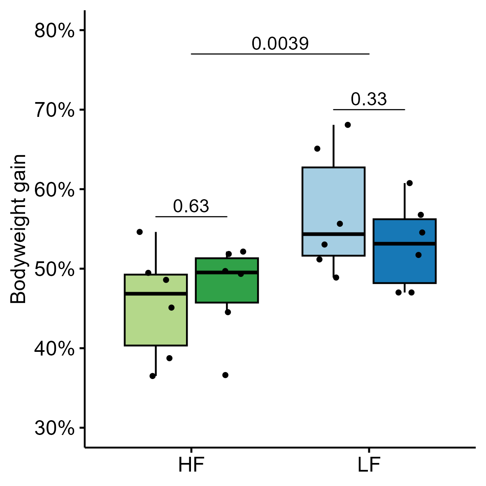
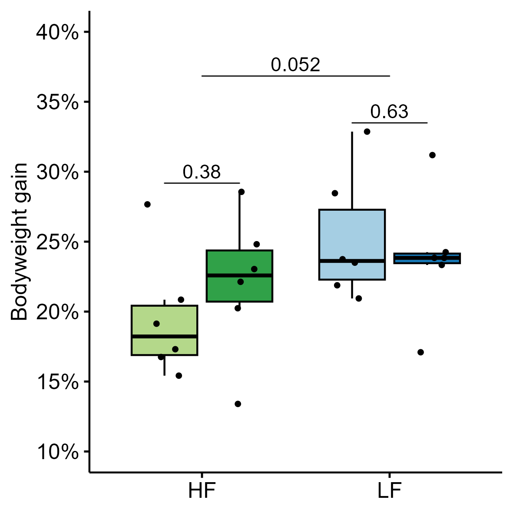

# INFO

This document contains the commands necessary to analyse experimental data obtained from "Fibrex" (internal project name: B-02-22), not including 16S-based microbiota data.

"Fibrex" refers to an animal study with the scope of investigating the effect of dietary fibres on uptake and wash-out of orally administered perfluorooctane sulfonic acid (PFOS) in adult male rats. The setup of the study is described below including a graphical overview of the setup:

- 48 adult male Sprague-Dawley rats were acclimatised (7 days prior to study start) to, and continuously fed, either:
  + Research Diet AIN-93G feed ("feed" *LF*) with low dietary fibres and mineral caseine (serial number D19090404), or
  + Altromin 1314 ("feed" *HF*), containing high dietary fibres.
  
- Half of the rats were dosed with corn oil with or without PFOS daily for 7 days by oral gavage (2 mL / kg):
  + 12 rats in each fed group were given pure corn oil as control ("treatment" *CTRL*)
    + R01-12 for AIN-93G (*LF_CTRL*)
    + R25-36 for Altromin (*HF_CTRL*)
  + 12 rats in each fed group were given corn oil with suspended 1.5 mg/mL PFOS (3 mg / kg) ("treatment" *PFOS*)
    + R13-24 for AIN-93G (*LF_PFOS*)
    + R37-48 for Altromin (*HF_PFOS*)
  
- Study period run from Day 0 to Day 21:

  + Day 0: Feces samples and first transit time was measured
  
  + Day 1-7: Dosing period - oral gavage was given daily in the morning (~ 06:00 - 08:00)
    + Body weight was measured daily
    + Day 7: Second transit time measured
    
  + Day 8: Dissection of half of each group
    + Body weight, feces and urine samples were collected from all animals in the morning (except urine for R19)
    + Blood samples from tongue-vein was taken from all animals not dissected
    + Animals dissected:
      + R01-06
      + R13-18
      + R25-30
      + R37-40 + R43-44
    
  + Day 8-21: Wash-out period - all remaining rats were measured for PFOS in blood, feces and urine
    + Day 12: Feces samples and body weight
    + Day 16: Feces, urine, tongue-vein blood samples and body weight
    + Day 20: Third transit time measured
    
  + Day 21: Dissection of remaining 24 rats
    + Body weight, feces and urine samples were collected prior to dissection
    + Animals dissected:
      + R07-12
      + R19-24
      + R31-37
      + R41-42 + R45-48

- During each dissections following samples and information were collected:
  + Weight: Cecum weight, and Liver weight
  + Blood samples
  + Tissue samples:
    + Liver
    + Brain
  + Gastrointestinal samples from:
    + Upper and lower jejunum
    + Ileum
    + Cecum
  
{width="100%"}

The project data contains:

- **Animal identifiers**:
  + "rat_org" lists rat names as given during the study
  + "rat_name" is corrected rat names due to non-continuous numbering for rat_org and dissection days for rat_org *R41-R42* (day 21) and *R43-R44* (day 8). This column should be used for rat identification - same is corrected in metadata for microbiome data. All following information is following rat_name nomenclature.
  + "cage" number (*01-24*)
  + "feed" given during the study: *LF* = no fibre, and *HF* = fibre
  + "treatment" for oral gavage given: *CTRL* for control, and *PFOS* for PFOS
  + "dissection" for dissection days of each rat: *d8* and *d21*
  + combined identifiers with values from above separated by "_": "feedtreat", "feedtreatday"

- **Animal weight** data (grams) including calculated weights per bw (ratio) and normalized weight data (normalised after mean weight of control group):
  + Body weight ("bw" followed by number of day) from day *0* to day *8* and subsequent days *12*, *16*, *20* and *21*, including bw gain from day 0 - 8, 0 - 21, and 8 - 21.
  + Liver and cecum weight from dissections on day *8* and *21*
  + Estimated brain weights per rat ("brain_wt_estimate") based on ["Herculano-Houzel, Mota, and Lent - 2006"]("https://doi.org/10.1073/pnas.0604911103")
  + Estimated blood volume per rat ("bloodvol_8", "bloodvol_16", "bloodvol_21") based on an standard average of 64mL blood / kilogram in rats ["Diehl et al. 2001"]("https://doi.org/10.1002/jat.727")

- **Transit time** per rat in minutes for:
  + Day 0 ("transit_0") - note: measurement were done per cage of 2 rats, hence the real value is not known for individual rats
  + Day 7 ("transit_7")
  + Day 20 ("transit_20")
  
- **Total dosed volume** (mL) of oral gavage per rat ("dose_total_ml")

- **PFOS quantitative data** in ug / g ("_ugg") or ug / mL ("_ugml), mg total ("_mg") and percentage of total dosed PFOS in systemic samples ("_pct"):
  + Total dosed PFOS per rat on day 8 ("pfos_total_mg"), respectively
  + Systemic samples:
    + Liver values for day *8* and *21*
    + Brain values for day *8* and *21* (except *R01*, *R02*, *R13*, *R40*, *R43*, due to missing or loss of sample)
    + Blood serum values for day *8*, *16*, and *21*
  + Secreted / Wash-out samples:
    + Cecum values for day *8* and *21* (except *R04*)
    + Feces values for day *8*, *12*, *16*, and *21*
    + Urine values for day *8*, *16*, and *21*
    + total PFOS detected in blood from total dosed per day (pct)

- **pH measurements** of gastrointestinal contents by 4x dilution (wt/vol) in sterile nuclease-free water:
  + Upper and lower jejunum
  + Ileum
  + Cecum (except *R04*)

- **Short-chain fatty acids** quantification of 10 compounds in cecal water from day *8* and *21* given in mM:
  + formic acid (formate),
  + acetic acid (acetate),
  + propanoic acid (propionate),
  + 2-methyl-propanoic acid (isobutyrate),
  + butanoic acid (butyrate),
  + 3-methyl-butanoic acid (isovalerate),
  + pentanoic acid (valerate),
  + 4-methyl-pentanoic acid (isocaproate),
  + hexanoic acid (coproate) and
  + heptanoic acid (enanthate)
  
The following content of this document goes through data analysis of the above mentioned data and contains code for creation of figures used for the associated publication.

# Setup 
Following code loads packages, creates necessary folder and saves parameters for the following analyses.
```{r setup, eval=TRUE, echo=TRUE, message=FALSE, warning = FALSE}
knitr::opts_chunk$set(echo = TRUE)

# Load libraries
library(tidyverse)
library(phyloseq)
library(decontam)
library(pals)
library(ggpubr)
library(vegan)
library(phangorn)
library(kableExtra)
library(plotly)
library(rstatix)
library(forcats)
library(dplyr)
library(tidyr)
library(ggplot2)
library(cowplot)
library(DAtest)
library(ggrepel)

# Create used folders if missing
if (!file.exists("R_objects")) dir.create(file.path(getwd(), "R_objects"))
if (!file.exists("plots")) dir.create(file.path(getwd(), "plots"))
if (!file.exists("plots/animal_data")) dir.create(file.path(getwd(), "plots/animal_data"))
if (!file.exists("plots/animal_data/pH")) dir.create(file.path(getwd(), "plots/animal_data/pH"))
if (!file.exists("plots/animal_data/transit")) dir.create(file.path(getwd(), "plots/animal_data/transit"))
if (!file.exists("plots/animal_data/pfos")) dir.create(file.path(getwd(), "plots/animal_data/pfos"))
if (!file.exists("plots/animal_data/weight")) dir.create(file.path(getwd(), "plots/animal_data/weight"))
if (!file.exists("plots/animal_data/scfa")) dir.create(file.path(getwd(), "plots/animal_data/scfa"))
if (!file.exists("scripts")) dir.create(file.path(getwd(), "scripts"))

# Save params
saveRDS(params, file = "R_objects/animal_params.RDS")
```

# Scripts
```{r functions, eval=TRUE, echo=TRUE, message=FALSE, warning=FALSE}


```


# LOAD DATA
Loading data from CSV-format and saves as Rdata-format.
```{r , eval=TRUE, echo=TRUE, error=TRUE}
params <- readRDS("R_objects/animal_params.RDS")
# Load analysis data
dat <- read.csv(params$input, header = TRUE, sep = ";", dec = ",")

save(dat, file = "R_objects/animal_data.Rdata")

# clear the environment and release memory
rm(list = ls(all.names = TRUE)) #will clear all objects includes hidden objects.
invisible(gc()) #free up memory and report the memory usage.
```


# ANIMAL WEIGHT DATA {.tabset .tabset-fade .tabset-pills}
Animal weight data contains data from body weight through the entire study period with calculated body weight gain, and organ weights from cecum and liver. 

## Body weight gain - Day 0-8 (n = 48)
This section will prepare to perform the data analysis for body weight gain

### Statistics
#### **Prepare data**

This section sets the variables to be used and prepares the data if necessary.

```{r, eval=TRUE}
# load data 
load("R_objects/animal_data.Rdata")
params <- readRDS("R_objects/animal_params.RDS")
dat.clean <- dat
#dat.clean <- dat %>% select_if(~ !any(is.na(.)))
#dat.clean <- subset(dat, !dat$rat_name %in% c("R01","R30"))

# Set names of variables
PREDICTOR <- "feedtreat"#c("treatment","pfos","van")
OUTCOME <- "bw_gain08"
SUBJECT <- "rat_name"

# Create formula
PREDICTOR.F <- ifelse(length(PREDICTOR) > 1, paste(PREDICTOR, collapse = "*"), PREDICTOR)
FORMULA <- as.formula(paste(OUTCOME,PREDICTOR.F, sep = " ~ "))

# Summary samples in groups
dat.clean %>% group_by(across(all_of(PREDICTOR))) %>% get_summary_stats(!!sym(OUTCOME), type = c("mean_sd"))
dat.clean %>% group_by(across(all_of(PREDICTOR))) %>% get_summary_stats(!!sym(OUTCOME), type = c("full"))

# Create plot
bxp <- dat.clean %>%
  ggboxplot(x = if_else(length(PREDICTOR) > 1, PREDICTOR[2],PREDICTOR[1]),
            y = OUTCOME,
            color = PREDICTOR[1],
            facet.by = if(length(PREDICTOR) == 3) PREDICTOR[3],
            palette = params$COL)
bxp

```
#### **Assumptions and preliminary tests**

The ANOVA tests assume the following characteristics about the data:

-   **Independence of the observations.** Each subject should belong to only one group. There is no relationship between the observations in each group.\
    *This is already done for the whole project*

-   **No significant outliers** in the two groups

-   **Normality.** the data for each group should be approximately normally distributed.

-   **Homogeneity of variances.** the variance of the outcome variable should be equal in each group.

In this section, we'll perform some preliminary tests to check whether these assumptions are met.

**Identify outliers**\
Outliers can be easily identified using boxplot methods, implemented in the R function identify_outliers() [rstatix package].

```{r, eval=TRUE}
# Test for outliers
dat.clean %>% 
  group_by(across(all_of(PREDICTOR))) %>% 
  identify_outliers(!!sym(OUTCOME))
```

Data contains two outliers: sample from rat_name R01 and R30. 

**Check normality**\
QQ plot and Shapiro-Wilk test of normality are used to analyze the model residuals.

```{r , eval=TRUE, echo=TRUE, error=TRUE}
# Build the linear model
model  <- lm(FORMULA, data = dat.clean)
# Create a QQ plot of residuals
ggqqplot(residuals(model))
# Compute Shapiro-Wilk test of normality
shapiro_test(residuals(model))
```

**Test homogneity of variance assumption**\
1. The residuals versus fits plot can be used to check the homogeneity of variances.

```{r , eval=TRUE, echo=TRUE, error=TRUE}
plot(model, 1)
```

2.  It's also possible to use the Levene's test to check the homogeneity of variances:

```{r , eval=TRUE, echo=TRUE, error=TRUE}
dat.clean %>% levene_test(FORMULA)

# Save result
EQUAL.VAR <- dat.clean %>% levene_test(FORMULA) %>% pull(p) > 0.05

```

This shows that body weight gain data has two outliers, has equal variance and is normally distributed without the outliers according to Shapiro-Wilk test. Therefore we use a **one-way ANOVA test with Tukey's honest significance test**.

#### ANOVA One-Way test

##### **Perform test**

If we had equality of variance we can now run a one-way ANOVA tests `anova_test()` (if we have equal variance) or a `welch_anova_test()` (if variance vary).

```{r , eval=TRUE, echo=TRUE, error=TRUE}

if(EQUAL.VAR) {
  res.aov <- dat.clean %>% anova_test(FORMULA)
  res.aov
} else {
  res.aov <- dat.clean %>% welch_anova_test(FORMULA)
  res.aov
}

```

##### **Perform posthoc test**

A significant one-way ANOVA is generally followed up by Tukey post-hoc tests to perform multiple pairwise comparisons between groups. When running relaxed Welch one-way test, the Games-Howell post hoc test or pairwise t-tests (with no assumption of equal variances) can be used to compare all possible combinations of group differences.

```{r , eval=TRUE, echo=TRUE, error=TRUE}
if(EQUAL.VAR) {
  pwc <- dat.clean %>% tukey_hsd(FORMULA)
  pwc
} else {
  pwc <- dat.clean %>% games_howell_test(FORMULA)
  pwc
}
```

### Create nested figure
```{r , eval=TRUE, echo=TRUE}
# ## Prepare statistical information:
# pwc.adj <- pwc %>% 
#   add_x_position(x = PREDICTOR) %>%
#   p_format("p.adj", accuracy = 0.0001, trailing.zero = TRUE, new.col = TRUE)
# 
# # Format for ggplot
# if (sum(pwc.adj$p.adj.signif != "ns") == 0) {
#   stat.sig <- pwc.adj %>%
#     add_y_position(step.increase = 0.25) %>%
#     mutate(y.position = seq(min(y.position), max(y.position),length.out = n()))
# } else {
#   stat.sig <- pwc.adj[pwc.adj$p.adj.signif != "ns",] %>%
#     add_y_position(step.increase = 0.25) %>%
#     mutate(y.position = seq(min(y.position), max(y.position),length.out = n()))
# }

# Set variables for inner and outer analysis, and variable for facet
INNER.VAR <- "treatment"
OUTER.VAR <- "feed"
FACETVAR <- "dissection"

# Statistics costumed for facet plotting
## Pairwise comparison for inner variable
stat.in <- dat.clean %>%
  group_by(.data[[OUTER.VAR]]) %>%
  t_test(as.formula(paste(OUTCOME,"~",INNER.VAR, sep = " ")), 
         paired = FALSE, var.equal = EQUAL.VAR, 
         detailed = TRUE, alternative = "two.sided") %>%
  # adjust_pvalue(method = "bonferroni") %>%
  add_significance() %>%
  p_format("p", accuracy = 0.001, trailing.zero = TRUE, new.col = TRUE)
stat.in

## Pairwise comparison for outer variable
stat.out <- dat.clean %>%
  # group_by(.data[[FACETVAR]]) %>%
  t_test(as.formula(paste(OUTCOME,"~", OUTER.VAR, sep = " ")), 
         paired = FALSE, var.equal = EQUAL.VAR, 
         detailed = TRUE, alternative = "two.sided") %>%
  # adjust_pvalue(method = "bonferroni") %>%
  add_significance() %>%
  p_format("p", accuracy = 0.001, trailing.zero = TRUE, new.col = TRUE)
stat.out

## Calculate positions statistics on plot
stat.in <- stat.in %>% add_xy_position(x = OUTER.VAR, dodge = 0.8)
stat.out <- stat.out %>% add_xy_position(x = OUTER.VAR)
stat.out$y.position <- max(stat.in$y.position)*1.1

# Sort dat.clean
dat.clean <- dat.clean[order(dat.clean$feedtreat),]

# Create plot
p <- ggboxplot(dat.clean, x = OUTER.VAR, y = OUTCOME,
               color = PREDICTOR,
               fill = PREDICTOR, 
               add =  "jitter", 
               add.params = list(size = 1)) +
  scale_fill_manual(values = params$COL1, name = "Group", labels = c("HF_CTRL" = "HF-CTRL","HF_PFOS" = "HF-PFOS","LF_CTRL" = "LF-CTRL","LF_PFOS" = "LF-PFOS")) +
  scale_color_manual(values = c("black","black","black","black")) +
  scale_y_continuous(name = "Bodyweight gain",limits = c(10,35),breaks = seq(10,35,5), labels = function(x) paste0(x, "%")) +
  guides(color = "none") +
  theme(axis.title.x = element_blank())

p <- p + stat_pvalue_manual(stat.in, label = "p.format",tip.length = 0, hide.ns = FALSE)+
  stat_pvalue_manual(stat.out, label = "p.format", tip.length = 0, hide.ns = FALSE)
p
# Plot for saving without legend
p2 <- p + theme(legend.position = "none")

# Output plot
ggsave(filename = paste0("plots/animal_data/weight/",OUTCOME,"_plot.png"), p2, device = "png", dpi = 300, units = "mm", width = 100, height = 100)
ggsave(filename = paste0("plots/animal_data/weight/",OUTCOME,"_plot.pdf"), p2, device = "pdf", dpi = 300, units = "mm", width = 100, height = 100)

# clear the environment and release memory
rm(list = ls(all.names = TRUE)) #will clear all objects includes hidden objects.
invisible(gc()) #free up memory and report the memory usage.
```

{width="100%"}

## Body weight gain - Day 0-21  (n = 24)
This section will prepare to perform the data analysis for body weight gain

### Statistics
#### **Prepare data**

This section sets the variables to be used and prepares the data if necessary.

```{r, eval=TRUE}
# load data 
load("R_objects/animal_data.Rdata")
params <- readRDS("R_objects/animal_params.RDS")

# Subset
dat.clean <- subset(dat, !is.na(bw_gain021))

# Set names of variables
PREDICTOR <- "feedtreat"#c("treatment","pfos","van")
OUTCOME <- "bw_gain021"
SUBJECT <- "rat_name"

# Create formula
PREDICTOR.F <- ifelse(length(PREDICTOR) > 1, paste(PREDICTOR, collapse = "*"), PREDICTOR)
FORMULA <- as.formula(paste(OUTCOME,PREDICTOR.F, sep = " ~ "))

# Summary samples in groups
dat.clean %>% group_by(across(all_of(PREDICTOR))) %>% get_summary_stats(!!sym(OUTCOME), type = "mean_sd")
dat.clean %>% group_by(across(all_of(PREDICTOR))) %>% get_summary_stats(!!sym(OUTCOME), type = c("full"))
```

#### **Visualise**

Create a boxplot of the data.

```{r , eval=TRUE, echo=TRUE, error=TRUE}
# Create plot
bxp <- dat.clean %>%
  ggboxplot(x = if_else(length(PREDICTOR) > 1, PREDICTOR[2],PREDICTOR[1]),
            y = OUTCOME,
            color = PREDICTOR[1],
            facet.by = if(length(PREDICTOR) == 3) PREDICTOR[3],
            palette = params$COL)
bxp

```
#### **Assumptions and preliminary tests**

The ANOVA tests assume the following characteristics about the data:

-   **Independence of the observations.** Each subject should belong to only one group. There is no relationship between the observations in each group.\
    *This is already done for the whole project*

-   **No significant outliers** in the two groups

-   **Normality.** the data for each group should be approximately normally distributed.

-   **Homogeneity of variances.** the variance of the outcome variable should be equal in each group.

In this section, we'll perform some preliminary tests to check whether these assumptions are met.

**Identify outliers**\
Outliers can be easily identified using boxplot methods, implemented in the R function identify_outliers() [rstatix package].

```{r, eval=TRUE}
# Test for outliers
dat.clean %>% 
  group_by(across(all_of(PREDICTOR))) %>% 
  identify_outliers(!!sym(OUTCOME))
```

Data contains two outliers: sample from rat_name R01 and R30. 

**Check normality**\
QQ plot and Shapiro-Wilk test of normality are used to analyze the model residuals.

```{r , eval=TRUE, echo=TRUE, error=TRUE}
# Build the linear model
model  <- lm(FORMULA, data = dat.clean)
# Create a QQ plot of residuals
ggqqplot(residuals(model))
# Compute Shapiro-Wilk test of normality
shapiro_test(residuals(model))
```

**Test homogneity of variance assumption**\
1. The residuals versus fits plot can be used to check the homogeneity of variances.

```{r , eval=TRUE, echo=TRUE, error=TRUE}
plot(model, 1)
```

2.  It's also possible to use the Levene's test to check the homogeneity of variances:

```{r , eval=TRUE, echo=TRUE, error=TRUE}
dat.clean %>% levene_test(FORMULA)

# Save result
EQUAL.VAR <- dat.clean %>% levene_test(FORMULA) %>% pull(p) > 0.05

```

This shows that body weight gain data has two outliers, has equal variance and is normally distributed without the outliers according to Shapiro-Wilk test. Therefore we use a **one-way ANOVA test with Tukey's honest significance test**.

#### ANOVA One-Way test

##### **Perform test**

If we had equality of variance we can now run a one-way ANOVA tests `anova_test()` (if we have equal variance) or a `welch_anova_test()` (if variance vary).

```{r , eval=TRUE, echo=TRUE, error=TRUE}

if(EQUAL.VAR) {
  res.aov <- dat.clean %>% anova_test(FORMULA)
  res.aov
} else {
  res.aov <- dat.clean %>% welch_anova_test(FORMULA)
  res.aov
}

```

##### **Perform posthoc test**

A significant one-way ANOVA is generally followed up by Tukey post-hoc tests to perform multiple pairwise comparisons between groups. When running relaxed Welch one-way test, the Games-Howell post hoc test or pairwise t-tests (with no assumption of equal variances) can be used to compare all possible combinations of group differences.

```{r , eval=TRUE, echo=TRUE, error=TRUE}
if(EQUAL.VAR) {
  pwc <- dat.clean %>% tukey_hsd(FORMULA)
  pwc
} else {
  pwc <- dat.clean %>% games_howell_test(FORMULA)
  pwc
}
```

### Create nested figure
```{r , eval=TRUE, echo=TRUE}
# Set variables for inner and outer analysis, and variable for facet
INNER.VAR <- "treatment"
OUTER.VAR <- "feed"
FACETVAR <- "dissection"

# Statistics costumed for facet plotting
## Pairwise comparison for inner variable
stat.in <- dat.clean %>%
  group_by(.data[[OUTER.VAR]]) %>%
  t_test(as.formula(paste(OUTCOME,"~",INNER.VAR, sep = " ")), 
         paired = FALSE, var.equal = EQUAL.VAR, 
         detailed = TRUE, alternative = "two.sided") %>%
  # adjust_pvalue(method = "bonferroni") %>%
  add_significance() %>%
  p_format("p", accuracy = 0.001, trailing.zero = TRUE, new.col = TRUE)
stat.in

## Pairwise comparison for outer variable
stat.out <- dat.clean %>%
  # group_by(.data[[FACETVAR]]) %>%
  t_test(as.formula(paste(OUTCOME,"~", OUTER.VAR, sep = " ")), 
         paired = FALSE, var.equal = EQUAL.VAR, 
         detailed = TRUE, alternative = "two.sided") %>%
  # adjust_pvalue(method = "bonferroni") %>%
  add_significance() %>%
  p_format("p", accuracy = 0.001, trailing.zero = TRUE, new.col = TRUE)
stat.out

## Calculate positions statistics on plot
stat.in <- stat.in %>% add_xy_position(x = OUTER.VAR, dodge = 0.8)
stat.out <- stat.out %>% add_xy_position(x = OUTER.VAR)
stat.out$y.position <- max(stat.in$y.position)*1.1

# Sort dat.clean
dat.clean <- dat.clean[order(dat.clean$feedtreat),]

# Create plot
p <- ggboxplot(dat.clean, x = OUTER.VAR, y = OUTCOME,
               color = PREDICTOR,
               fill = PREDICTOR, 
               add =  "jitter", 
               add.params = list(size = 1)) +
  scale_fill_manual(values = params$COL1, name = "Group", labels = c("HF_CTRL" = "HF-CTRL","HF_PFOS" = "HF-PFOS","LF_CTRL" = "LF-CTRL","LF_PFOS" = "LF-PFOS")) +
  scale_color_manual(values = c("black","black","black","black")) +
  scale_y_continuous(name = "Bodyweight gain",limits = c(30,80),breaks = seq(30,80,10), labels = function(x) paste0(x, "%")) +
  guides(color = "none") +
  theme(axis.title.x = element_blank())

p <- p + stat_pvalue_manual(stat.in, label = "p.format",tip.length = 0, hide.ns = FALSE)+
  stat_pvalue_manual(stat.out, label = "p.format", tip.length = 0, hide.ns = FALSE)

p

# Plot for saving without legend
p2 <- p + theme(legend.position = "none")

# Output plot
ggsave(filename = paste0("plots/animal_data/weight/",OUTCOME,"_plot.png"), p2, device = "png", dpi = 300, units = "mm", width = 100, height = 100)
ggsave(filename = paste0("plots/animal_data/weight/",OUTCOME,"_plot.pdf"), p2, device = "pdf", dpi = 300, units = "mm", width = 100, height = 100)

# clear the environment and release memory
rm(list = ls(all.names = TRUE)) #will clear all objects includes hidden objects.
invisible(gc()) #free up memory and report the memory usage.
```

{width="100%"}


## Body weight gain - Day 8-21  (n = 24)
This section will prepare to perform the data analysis for body weight gain

### Statistics
#### **Prepare data**

This section sets the variables to be used and prepares the data if necessary.

```{r, eval=TRUE}
# load data 
load("R_objects/animal_data.Rdata")
params <- readRDS("R_objects/animal_params.RDS")

# Subset
dat.clean <- subset(dat, !is.na(bw_gain821))

# Set names of variables
PREDICTOR <- "feedtreat"#c("treatment","pfos","van")
OUTCOME <- "bw_gain821"
SUBJECT <- "rat_name"

# Create formula
PREDICTOR.F <- ifelse(length(PREDICTOR) > 1, paste(PREDICTOR, collapse = "*"), PREDICTOR)
FORMULA <- as.formula(paste(OUTCOME,PREDICTOR.F, sep = " ~ "))

# Summary samples in groups
dat.clean %>% group_by(across(all_of(PREDICTOR))) %>% get_summary_stats(!!sym(OUTCOME), type = "mean_sd")
```

#### **Visualise**

Create a boxplot of the data.

```{r , eval=TRUE, echo=TRUE, error=TRUE}
# Create plot
bxp <- dat.clean %>%
  ggboxplot(x = if_else(length(PREDICTOR) > 1, PREDICTOR[2],PREDICTOR[1]),
            y = OUTCOME,
            color = PREDICTOR[1],
            facet.by = if(length(PREDICTOR) == 3) PREDICTOR[3],
            palette = params$COL)
bxp

```
#### **Assumptions and preliminary tests**

The ANOVA tests assume the following characteristics about the data:

-   **Independence of the observations.** Each subject should belong to only one group. There is no relationship between the observations in each group.\
    *This is already done for the whole project*

-   **No significant outliers** in the two groups

-   **Normality.** the data for each group should be approximately normally distributed.

-   **Homogeneity of variances.** the variance of the outcome variable should be equal in each group.

In this section, we'll perform some preliminary tests to check whether these assumptions are met.

**Identify outliers**\
Outliers can be easily identified using boxplot methods, implemented in the R function identify_outliers() [rstatix package].

```{r, eval=TRUE}
# Test for outliers
dat.clean %>% 
  group_by(across(all_of(PREDICTOR))) %>% 
  identify_outliers(!!sym(OUTCOME))
```

Data contains two outliers: sample from rat_name R01 and R30. 

**Check normality**\
QQ plot and Shapiro-Wilk test of normality are used to analyze the model residuals.

```{r , eval=TRUE, echo=TRUE, error=TRUE}
# Build the linear model
model  <- lm(FORMULA, data = dat.clean)
# Create a QQ plot of residuals
ggqqplot(residuals(model))
# Compute Shapiro-Wilk test of normality
shapiro_test(residuals(model))
```

**Test homogneity of variance assumption**\
1. The residuals versus fits plot can be used to check the homogeneity of variances.

```{r , eval=TRUE, echo=TRUE, error=TRUE}
plot(model, 1)
```

2.  It's also possible to use the Levene's test to check the homogeneity of variances:

```{r , eval=TRUE, echo=TRUE, error=TRUE}
dat.clean %>% levene_test(FORMULA)

# Save result
EQUAL.VAR <- dat.clean %>% levene_test(FORMULA) %>% pull(p) > 0.05

```

This shows that body weight gain data has two outliers, has equal variance and is normally distributed without the outliers according to Shapiro-Wilk test. Therefore we use a **one-way ANOVA test with Tukey's honest significance test**.

#### ANOVA One-Way test

##### **Perform test**

If we had equality of variance we can now run a one-way ANOVA tests `anova_test()` (if we have equal variance) or a `welch_anova_test()` (if variance vary).

```{r , eval=TRUE, echo=TRUE, error=TRUE}

if(EQUAL.VAR) {
  res.aov <- dat.clean %>% anova_test(FORMULA)
  res.aov
} else {
  res.aov <- dat.clean %>% welch_anova_test(FORMULA)
  res.aov
}

```

##### **Perform posthoc test**

A significant one-way ANOVA is generally followed up by Tukey post-hoc tests to perform multiple pairwise comparisons between groups. When running relaxed Welch one-way test, the Games-Howell post hoc test or pairwise t-tests (with no assumption of equal variances) can be used to compare all possible combinations of group differences.

```{r , eval=TRUE, echo=TRUE, error=TRUE}
if(EQUAL.VAR) {
  pwc <- dat.clean %>% tukey_hsd(FORMULA)
  pwc
} else {
  pwc <- dat.clean %>% games_howell_test(FORMULA)
  pwc
}
```

### Create figure
```{r , eval=TRUE, echo=TRUE}
# Set variables for inner and outer analysis, and variable for facet
INNER.VAR <- "treatment"
OUTER.VAR <- "feed"
FACETVAR <- "dissection"

# Statistics costumed for facet plotting
## Pairwise comparison for inner variable
stat.in <- dat.clean %>%
  group_by(.data[[OUTER.VAR]]) %>%
  t_test(as.formula(paste(OUTCOME,"~",INNER.VAR, sep = " ")), 
         paired = FALSE, var.equal = EQUAL.VAR, 
         detailed = TRUE, alternative = "two.sided") %>%
  # adjust_pvalue(method = "bonferroni") %>%
  add_significance() %>%
  p_format("p", accuracy = 0.001, trailing.zero = TRUE, new.col = TRUE)
stat.in

## Pairwise comparison for outer variable
stat.out <- dat.clean %>%
  # group_by(.data[[FACETVAR]]) %>%
  t_test(as.formula(paste(OUTCOME,"~", OUTER.VAR, sep = " ")), 
         paired = FALSE, var.equal = EQUAL.VAR, 
         detailed = TRUE, alternative = "two.sided") %>%
  # adjust_pvalue(method = "bonferroni") %>%
  add_significance() %>%
  p_format("p", accuracy = 0.001, trailing.zero = TRUE, new.col = TRUE)
stat.out

## Calculate positions statistics on plot
stat.in <- stat.in %>% add_xy_position(x = OUTER.VAR, dodge = 0.8)
stat.out <- stat.out %>% add_xy_position(x = OUTER.VAR)
stat.out$y.position <- max(stat.in$y.position)*1.1

# Sort dat.clean
dat.clean <- dat.clean[order(dat.clean$feedtreat),]

# Create plot
p <- ggboxplot(dat.clean, x = OUTER.VAR, y = OUTCOME,
               color = PREDICTOR,
               fill = PREDICTOR, 
               add =  "jitter", 
               add.params = list(size = 1)) +
  scale_fill_manual(values = params$COL1, name = "Group", labels = c("HF_CTRL" = "HF-CTRL","HF_PFOS" = "HF-PFOS","LF_CTRL" = "LF-CTRL","LF_PFOS" = "LF-PFOS")) +
  scale_color_manual(values = c("black","black","black","black")) +
  scale_y_continuous(name = "Bodyweight gain",limits = c(10,40),breaks = seq(10,40,5), labels = function(x) paste0(x, "%")) +
  guides(color = "none") +
  theme(axis.title.x = element_blank())

p <- p + stat_pvalue_manual(stat.in, label = "p.format",tip.length = 0, hide.ns = FALSE)+
  stat_pvalue_manual(stat.out, label = "p.format", tip.length = 0, hide.ns = FALSE)

p
# Plot for saving without legend
p2 <- p + theme(legend.position = "none")

# Output plot
ggsave(filename = paste0("plots/animal_data/weight/",OUTCOME,"_plot.png"), p2, device = "png", dpi = 300, units = "mm", width = 100, height = 100)
ggsave(filename = paste0("plots/animal_data/weight/",OUTCOME,"_plot.pdf"), p2, device = "pdf", dpi = 300, units = "mm", width = 100, height = 100)

# clear the environment and release memory
rm(list = ls(all.names = TRUE)) #will clear all objects includes hidden objects.
invisible(gc()) #free up memory and report the memory usage.
```

{width="100%"}

## Body weight over time
This section will prepare data analysis and illustration of body weight data per rat over the course of this study. Final plot shows a normalised weight over time (bw day x / bw day 0) while rate of growth is calculated based on true weight data to produce a rate of g/day.
###**Prepare data and growth rates**
```{r , eval=TRUE, echo=TRUE, error=TRUE}
# Load data
load("R_objects/animal_data.Rdata")
params <- readRDS("R_objects/animal_params.RDS")

# Set parameters
PREDICTOR <- c("bw_time_n","treatment","feed")
OUTCOME <- "wt_n"
SUBJECT <- "rat_name"

# Create data frame for data representation
dat.clean <- dat %>% select(rat_name, feed, treatment, feedtreat, dissection, bw_0, bw_1, bw_2, bw_3, bw_4, bw_5, bw_6, bw_7, bw_8, bw_12, bw_16, bw_21)

# Normalise data
dat.clean <- dat.clean %>% mutate(bw_0_n = bw_0 / bw_0, bw_1_n = bw_1 / bw_0, bw_2_n = bw_2 / bw_0, bw_3_n = bw_3 / bw_0, bw_4_n = bw_4 / bw_0, bw_5_n = bw_5 / bw_0, bw_6_n = bw_6 / bw_0, bw_7_n = bw_7 / bw_0, bw_8_n = bw_8 / bw_0, bw_12_n = bw_12 / bw_0, bw_16_n = bw_16 / bw_0, bw_21_n = bw_21 / bw_0)

# Pivot longer
dat.bwn <- dat.clean %>%
    pivot_longer(., cols = c(bw_0_n, bw_1_n, bw_2_n, bw_3_n, bw_4_n, bw_5_n, bw_6_n, bw_7_n, bw_8_n, bw_12_n, bw_16_n, bw_21_n), names_to = "bw_time_n", values_to = "wt_n")

dat.bw <- dat.clean %>% 
  pivot_longer(., cols = c(bw_0, bw_1, bw_2, bw_3, bw_4, bw_5, bw_6, bw_7, bw_8, bw_12, bw_16, bw_21), names_to = "bw_time", values_to = "wt")

# Create column for day of sampling (numeric)
dat.bwn <- dat.bwn %>% mutate("day" = case_when(bw_time_n == "bw_0_n" ~ 0,
                                                    bw_time_n == "bw_1_n" ~ 1,
                                                    bw_time_n == "bw_2_n" ~ 2,
                                                    bw_time_n == "bw_3_n" ~ 3,
                                                    bw_time_n == "bw_4_n" ~ 4,
                                                    bw_time_n == "bw_5_n" ~ 5,
                                                    bw_time_n == "bw_6_n" ~ 6,
                                                    bw_time_n == "bw_7_n" ~ 7,
                                                    bw_time_n == "bw_8_n" ~ 8,
                                                    bw_time_n == "bw_12_n" ~ 12,
                                                    bw_time_n == "bw_16_n" ~ 16,
                                                    bw_time_n == "bw_21_n" ~ 21))

# Create column for day of sampling (numeric)
dat.bw <- dat.bw %>% mutate("day" = case_when(bw_time == "bw_0" ~ 0,
                                                    bw_time == "bw_1" ~ 1,
                                                    bw_time == "bw_2" ~ 2,
                                                    bw_time == "bw_3" ~ 3,
                                                    bw_time == "bw_4" ~ 4,
                                                    bw_time == "bw_5" ~ 5,
                                                    bw_time == "bw_6" ~ 6,
                                                    bw_time == "bw_7" ~ 7,
                                                    bw_time == "bw_8" ~ 8,
                                                    bw_time == "bw_12" ~ 12,
                                                    bw_time == "bw_16" ~ 16,
                                                    bw_time == "bw_21" ~ 21))
# Order dataframe for analysis
dat.bwn <- dat.bwn[order(dat.bw$day),]

# Remove rows with NA
dat.bwn <- subset(dat.bwn, !is.na(wt_n))
dat.bw <- subset(dat.bw, !is.na(wt))

# Calculate regression lines per treatment group
reg_lines <- dat.bw %>%
  group_by(feedtreat) %>%
  summarize(slope = coef(lm(wt ~ day))[2],
            intercept = coef(lm(wt ~ day))[1])

# Calculate regression lines per rat over time
rl_rats <- dat.bw %>%
  group_by(rat_name) %>%
  summarize(slope = coef(lm(wt ~ day))[2],
            intercept = coef(lm(wt ~ day))[1]) %>%
  cbind(data.frame(feedtreat = rep(c("LF_CTRL","LF_PFOS","HF_CTRL","HF_PFOS"), each = 12),
                   feed = rep(c("LF","HF"), each = 24),
                   treatment = rep(c("CTRL","PFOS"), each = 12, times = 2),
                   day = rep(c("d8","d21"), each = 6, times = 4)))

# Build the linear model
model  <- lm(slope ~ feedtreat, data = rl_rats)
# Create a QQ plot of residuals
ggqqplot(residuals(model))
# Compute Shapiro-Wilk test of normality
shapiro_test(residuals(model))
# Test for equal variance
rl_rats %>% levene_test(slope ~ feedtreat)

# Save result
EQUAL.VAR <- rl_rats %>% levene_test(slope ~ feedtreat) %>% pull(p) > 0.05

# Kruskal-Wallis test
pwc1 <- rl_rats %>%
  kruskal_test(slope ~ feedtreat)
pwc1
# Posthoc Dunn's test
pwc2 <- rl_rats %>% 
  dunn_test(slope ~ feedtreat, p.adjust.method = "fdr") 
pwc2

```


### **Statistical analysis**
Based on the above tests of the regression for four groups we can analyse the data using Kruskal-Wallis with posthoc Dunn's test.
``` {r , eval=TRUE, echo=TRUE, error=TRUE}
# Set variables for inner and outer analysis, and variable for facet
INNER.VAR <- "treatment"
OUTER.VAR <- "feed"
FACETVAR <- "day"

# Statistics for overall data
stat.in2 <- rl_rats %>%
  group_by(.data[[OUTER.VAR]]) %>%
  wilcox_test(as.formula(paste("slope ~",INNER.VAR, sep = " "))) %>%
  adjust_pvalue(method = "BH") %>%
  add_significance("p.adj") %>% 
  p_format("p.adj", accuracy = 0.0001, trailing.zero = TRUE, new.col = TRUE)
stat.in2

stat.out2 <- rl_rats %>%
  wilcox_test(as.formula(paste("slope ~",OUTER.VAR, sep = " "))) %>%
  adjust_pvalue(method = "BH") %>%
  add_significance("p.adj") %>%
  p_format("p.adj", accuracy = 0.0001, trailing.zero = TRUE, new.col = TRUE)
stat.out2

## Calculate positions statistics on plot
stat.in2 <- stat.in2 %>% add_xy_position(x = OUTER.VAR, dodge = 0.8)
stat.out2 <- stat.out2 %>% add_xy_position(x = OUTER.VAR, dodge = 0.9)
stat.out2$y.position <- max(stat.in2$y.position)*1.1

# Sort dat.clean
rl_rats <- rl_rats[order(rl_rats$feedtreat),]

# Visualise growth rates per group with statistics
p <- rl_rats %>%
  ggboxplot(x = "feed",
            y = "slope",
            color = "feedtreat",
            palette = params$COL1)
p2 <- p + stat_pvalue_manual(stat.in2, label = "p.adj.format",tip.length = 0, hide.ns = FALSE) +
  stat_pvalue_manual(stat.out2, label = "p.adj.format",tip.length = 0, hide.ns = FALSE) +
  scale_y_continuous(expand = expansion(mult = c(0,0.1)))
p2

# Output plot
ggsave(filename = paste0("plots/animal_data/weight/bodyweight_slope_combined_plot.png"), p2, device = "png", dpi = 300, units = "mm", width = 100, height = 100)
ggsave(filename = paste0("plots/animal_data/weight/bodyweight_slope_combined_plot.pdf"), p2, device = "pdf", dpi = 300, units = "mm", width = 100, height = 100)

# Statistics for facet by day
stat.in1 <- rl_rats %>%
  group_by(.data[[OUTER.VAR]],.data[[FACETVAR]]) %>%
  wilcox_test(as.formula(paste("slope ~",INNER.VAR, sep = " "))) %>%
  adjust_pvalue(method = "BH") %>%
  add_significance("p.adj") %>% 
  p_format("p.adj", accuracy = 0.0001, trailing.zero = TRUE, new.col = TRUE)
stat.in1

stat.out1 <- rl_rats %>%
  group_by(.data[[FACETVAR]]) %>%
  wilcox_test(as.formula(paste("slope ~",OUTER.VAR, sep = " "))) %>%
  adjust_pvalue(method = "BH") %>%
  add_significance("p.adj") %>%
  p_format("p.adj", accuracy = 0.0001, trailing.zero = TRUE, new.col = TRUE)
stat.out1

## Calculate positions statistics on plot
stat.in1 <- stat.in1 %>% add_xy_position(x = OUTER.VAR, dodge = 0.8)
stat.out1 <- stat.out1 %>% add_xy_position(x = OUTER.VAR, dodge = 0.9)
stat.out1$y.position <- max(stat.in1$y.position)*1.1

# Sort dat.clean
rl_rats <- rl_rats[order(rl_rats$feedtreat),]

# Visualise growth rates per group with statistics
p <- rl_rats %>%
  ggboxplot(x = "feed",
            y = "slope",
            color = "feedtreat",
            palette = params$COL1,
            facet.by = "day")
p1 <- p + stat_pvalue_manual(stat.in1, label = "p.adj.format",tip.length = 0, hide.ns = FALSE) +
  stat_pvalue_manual(stat.out1, label = "p.adj.format",tip.length = 0, hide.ns = FALSE) +
  scale_y_continuous(expand = expansion(mult = c(0,0.1)))
p1

# Output plot
ggsave(filename = paste0("plots/animal_data/weight/bodyweight_slope_",FACETVAR,"_plot.png"), p2, device = "png", dpi = 300, units = "mm", width = 100, height = 100)
ggsave(filename = paste0("plots/animal_data/weight/bodyweight_slope_",FACETVAR,"_plot.pdf"), p2, device = "pdf", dpi = 300, units = "mm", width = 100, height = 100)

```

### Create figure
``` {r , eval=TRUE, echo=TRUE, error=TRUE}
# Mean and SD for growth rates for plotting
rl_rats_msd <- rl_rats %>% 
  group_by(feedtreat) %>% get_summary_stats(!!sym("slope"), type = "mean_sd")

# Slope texts for plot
slope_text <- data.frame(label = c(paste0("Rate = ",round(rl_rats_msd$mean[1],2),"(",round(rl_rats_msd$sd[1],2),") g/day"),
                                   paste0("Rate = ",round(rl_rats_msd$mean[2],2),"(",round(rl_rats_msd$sd[2],2),") g/day"),
                                   paste0("Rate = ",round(rl_rats_msd$mean[3],2),"(",round(rl_rats_msd$sd[3],2),") g/day"),
                                   paste0("Rate = ",round(rl_rats_msd$mean[4],2),"(",round(rl_rats_msd$sd[4],2),") g/day")),
                         feedtreat = names(table(dat.bw$feedtreat)),
                         x = c(rep(15, times = 4)), y = c(rep(1.15, times = 4)))

# Summary samples in groups
dat.bwn %>% group_by(across(all_of(PREDICTOR))) %>% get_summary_stats(!!sym(OUTCOME), type = "mean_sd")

# Setup rectangles
rec.df <- data.frame(x0 = -0.5, x1 = 0.5, x2 = 7.5, x3 = 21.5, y1 = 1.58, y2 = 1.6809, c0 = "a", c1 = "b", c2 = "c", t0 = "T0", t1 = "Dosing period", t2 = "Wash-out period")

# Generate plot
p <- ggplot(data = dat.bwn, aes(x = day, y = wt_n, fill = feedtreat)) +
  geom_rect(data = rec.df, mapping = aes(xmin = x0, xmax = x1, ymin = y1, ymax = y2, fill = c0), fill = "#f0f0f0", inherit.aes = FALSE) + #c, color = c1olor = "#a0a0a0",
  geom_text(data = rec.df, aes(x = x0+(x1-x0)/2, y = y1+(y2-y1)/2, label = t0), size = 2.5, inherit.aes = FALSE) +
  geom_rect(data = rec.df, mapping = aes(xmin = x1, xmax = x2, ymin = y1, ymax = y2, fill = c1), fill = "#ffffa0", inherit.aes = FALSE) + #c, color = c1olor = "#a0a0a0",
  geom_text(data = rec.df, aes(x = x1+(x2-x1)/2, y = y1+(y2-y1)/2, label = t1), size = 2.5, inherit.aes = FALSE) +
  geom_rect(data = rec.df, mapping = aes(xmin = x2, xmax = x3, ymin = y1, ymax = y2, fill = c2), fill = "#ffd0d0", inherit.aes = FALSE) +
  geom_text(data = rec.df, aes(x = x2+(x3-x2)/2, y = y1+(y2-y1)/2, label = t2), size = 2.5, inherit.aes = FALSE) +
  # geom_vline(data = NULL, xintercept = 1, linetype = "dashed", color = "grey") +
  # geom_vline(data = NULL, xintercept = 7, linetype = "dashed", color = "grey") +
  geom_vline(data = NULL, xintercept = 8, linetype = "dashed", color = "#909090") +
  geom_vline(data = NULL, xintercept = 21, linetype = "dashed", color = "#909090") +
  geom_line(aes(group = rat_name, color = feedtreat), stat = "identity", alpha = 0.6) +
  geom_smooth(aes(group = feedtreat, color = feedtreat), color = "#090909", method = "lm", se = FALSE, size = 0.5, fullrange = TRUE, linetype = "dashed") +
  geom_boxplot(aes(group = day), outlier.shape = NA) + 
  geom_point(size = 0.5) + #position = position_jitterdodge(jitter.width = 0.25),
  scale_fill_manual(values = params$COL1, labels = c("HF-CTRL","HF-PFOS","LF-CTRL","LF-PFOS"), name = "Groups") +
  scale_color_manual(values = params$COL1) + 
  scale_y_continuous(name = "Body weight ratio", limits = c(0.9,1.7), breaks = seq(1,1.7,0.2)) +
  scale_x_continuous(name = "Day", breaks = c(0,1,2,3,4,5,6,7,8,12,16,21)) +
  theme_pubr() +
  guides(color = "none", alpha = "none") +
  facet_wrap(.~feedtreat, labeller = labeller(feedtreat = c("LF_CTRL" = "LF-CTRL","LF_PFOS" = "LF-PFOS","HF_CTRL" = "HF-CTRL","HF_PFOS" = "HF-PFOS"))) +
  geom_text(data = slope_text, aes(x = x, y = y, label = label), position = position_dodge(width = 0.9), size = 3.5)
p

# Save plot
suppressMessages(ggsave(filename = "plots/animal_data/weight/bodyweight_norm_over_time.png", plot = p, device = "png", dpi = 300, units = "mm", height = 150, width = 260))
suppressMessages(ggsave(filename = "plots/animal_data/weight/bodyweight_norm_over_time.pdf", plot = p, device = "pdf", dpi = 300, units = "mm", height = 150, width = 260))

# clear the environment and release memory
rm(list = ls(all.names = TRUE)) #will clear all objects includes hidden objects.
invisible(gc()) #free up memory and report the memory usage.

```

## Cecum weight
This section will prepare to perform the data analysis for cecum weight-to-body weight ratio data presented as normalised data for easy interpretation. Data is normalised after no fiber group control on respective days, 

### Statistics
#### **Prepare data**
This section sets the variables to be used and prepares the data if necessary.

```{r, eval=TRUE}
# load data 
load("R_objects/animal_data.Rdata")
params <- readRDS("R_objects/animal_params.RDS")
dat.clean <- subset(dat, !is.na(cecum_norm))

# Set names of variables
PREDICTOR <- c("treatment","feed","dissection")
OUTCOME <- "cecum_wtbw"
SUBJECT <- "rat_name"

# Create formula
PREDICTOR.F <- ifelse(length(PREDICTOR) > 1, paste(PREDICTOR, collapse = "*"), PREDICTOR)
FORMULA <- as.formula(paste(OUTCOME,PREDICTOR.F, sep = " ~ "))

# Summary samples in groups
dat.clean %>% group_by(across(all_of(PREDICTOR))) %>% get_summary_stats(!!sym(OUTCOME), type = "mean_sd")

# SUmmary of original weight in grams
dat.clean %>% group_by(across(all_of(PREDICTOR))) %>% get_summary_stats(cecum_wt, type = "mean_sd")
dat.clean %>% group_by(across(all_of(PREDICTOR))) %>% get_summary_stats(cecum_wt, type = "full")

```

#### **Visualise**

Create a boxplot of the data.

```{r , eval=TRUE, echo=TRUE, error=TRUE}
# Create plot
bxp <- dat.clean %>%
  ggboxplot(x = if_else(length(PREDICTOR) > 1, PREDICTOR[2],PREDICTOR[1]),
            y = OUTCOME,
            color = PREDICTOR[1],
            facet.by = if(length(PREDICTOR) == 3) PREDICTOR[3],
            palette = "jco")
bxp

```
#### **Assumptions and preliminary tests**

The ANOVA tests assume the following characteristics about the data:

-   **Independence of the observations.** Each subject should belong to only one group. There is no relationship between the observations in each group.\
    *This is already done for the whole project*

-   **No significant outliers** in the two groups

-   **Normality.** the data for each group should be approximately normally distributed.

-   **Homogeneity of variances.** the variance of the outcome variable should be equal in each group.

In this section, we'll perform some preliminary tests to check whether these assumptions are met.

**Identify outliers**\
Outliers can be easily identified using boxplot methods, implemented in the R function identify_outliers() [rstatix package].

```{r, eval=TRUE}
# Test for outliers
dat.clean %>% 
  group_by(across(all_of(PREDICTOR))) %>% 
  identify_outliers(!!sym(OUTCOME))
```

Data contains **no outliers**.

**Check normality**\
QQ plot and Shapiro-Wilk test of normality are used to analyze the model residuals.

```{r , eval=TRUE, echo=TRUE, error=TRUE}
# Build the linear model
model  <- lm(FORMULA, data = dat.clean)
# Create a QQ plot of residuals
ggqqplot(residuals(model))
# Compute Shapiro-Wilk test of normality
shapiro_test(residuals(model))
```

Data is **Normally distributed**.

**Test homogneity of variance assumption**\
1. The residuals versus fits plot can be used to check the homogeneity of variances.

```{r , eval=TRUE, echo=TRUE, error=TRUE}
plot(model, 1)
```

2.  It's also possible to use the Levene's test to check the homogeneity of variances:

```{r , eval=TRUE, echo=TRUE, error=TRUE}
dat.clean %>% levene_test(FORMULA)

# Save result
EQUAL.VAR <- dat.clean %>% levene_test(FORMULA) %>% pull(p) > 0.05

```

This all shows that cecum weight data has three none-critical outliers, is normally distribution and has equal variance. Therefore we use a **one-way ANOVA test with Tukey's honest significance test** to test data for all factors of interest, while using **unpaired t-test** for pairwise comparisons.

#### ANOVA One-Way test

##### **Perform test**

If we had equality of variance we can now run a one-way ANOVA tests `anova_test()` (if we have equal variance) or a `welch_anova_test()` (if variance vary).

```{r , eval=TRUE, echo=TRUE, error=TRUE}

if(EQUAL.VAR) {
  res.aov <- dat.clean %>% anova_test(FORMULA)
  res.aov
} else {
  res.aov <- dat.clean %>% welch_anova_test(FORMULA)
  res.aov
}

```
ANOVA shows that feed has the only significant effect on the overall data.

##### **Perform posthoc test**

A significant one-way ANOVA is generally followed up by Tukey post-hoc tests to perform multiple pairwise comparisons between groups. When running relaxed Welch one-way test, the Games-Howell post hoc test or pairwise t-tests (with no assumption of equal variances) can be used to compare all possible combinations of group differences.

```{r , eval=TRUE, echo=TRUE, error=TRUE}
if(EQUAL.VAR) {
  pwc <- dat.clean %>% tukey_hsd(FORMULA)
  pwc
} else {
  pwc <- dat.clean %>% games_howell_test(FORMULA)
  pwc
}
```

### Nested analysis & Figure
Testing two variables are used when there is a nested aspect in the analysis, for example difference in treatment at each timepoint, that would have the timepoint as the outer variable and treatment as the inner variable

```{r , eval = FALSE}
# Set variables for inner and outer analysis, and variable for facet
INNER.VAR <- "treatment"
OUTER.VAR <- "feed"
FACETVAR <- "dissection"

# Remove samples with incomplete metadata
dat.clean <- dat.clean[!is.na(dat.clean[,INNER.VAR]) & !is.na(dat.clean[,OUTER.VAR]),]

# Set variables as factors
dat.clean[,OUTER.VAR] <- as.factor(dat.clean[,OUTER.VAR])
dat.clean[,INNER.VAR] <- as.factor(dat.clean[,INNER.VAR])
dat.clean[,FACETVAR] <- as.factor(dat.clean[,FACETVAR])

# Cecum_norm
fit <- aov(as.formula(paste(OUTCOME,"~", OUTER.VAR,"*",INNER.VAR, sep = " ")), data = dat.clean)
anova(fit)
TukeyHSD(fit)

# Statistics costumed for facet plotting
## Pairwise comparison for inner variable
stat.in <- dat.clean %>%
  group_by(.data[[OUTER.VAR]], .data[[FACETVAR]]) %>%
  t_test(as.formula(paste(OUTCOME,"~",INNER.VAR, sep = " ")), 
         paired = FALSE, var.equal = EQUAL.VAR, 
         detailed = TRUE, alternative = "two.sided") %>%
  # adjust_pvalue(method = "bonferroni") %>%
  add_significance() %>%
  p_format("p", accuracy = 0.001, trailing.zero = TRUE, new.col = TRUE)
stat.in

## Pairwise comparison for outer variable
stat.out <- dat.clean %>%
  group_by(.data[[FACETVAR]]) %>%
  t_test(as.formula(paste(OUTCOME,"~", OUTER.VAR, sep = " ")), 
         paired = FALSE, var.equal = EQUAL.VAR, 
         detailed = TRUE, alternative = "two.sided") %>%
  # adjust_pvalue(method = "bonferroni") %>%
  add_significance() %>%
  p_format("p", accuracy = 0.001, trailing.zero = TRUE, new.col = TRUE)
stat.out

## Calculate positions statistics on plot
stat.in <- stat.in %>% add_xy_position(x = OUTER.VAR, dodge = 0.8)
stat.out <- stat.out %>% add_xy_position(x = OUTER.VAR)
stat.out$y.position <- max(stat.in$y.position)*1.1

# Create plot
p <- ggboxplot(dat.clean, x = OUTER.VAR, y = "cecum_norm",
               color = "feedtreat",
               fill = "feedtreat",
               add = "jitter",
               add.params = list(size = 1),
               panel.labs = list("dissection" = c("Day 8","Day 21")),
               facet.by = "dissection") +
  theme_pubr(legend = "top") +
  scale_fill_manual(breaks = dat.clean$treatment, values = params$COL1) +
  scale_color_manual(breaks = dat.clean$treatment, values = c("HF_CTRL" = "black","HF_PFOS" = "black","LF_CTRL" = "black","LF_PFOS" = "black")) +
  scale_x_discrete(name = "Feed") +
  guides(color = FALSE) +
  theme(axis.title.x = element_blank())
p

# Add p-values for inner and outer analysis to plot
p.stat <- p + 
  stat_pvalue_manual(stat.in, label = "p.signif", tip.length = 0, hide.ns = TRUE, color = "red") + #y.position = c(1.5,1.5,0.7,0.7)   
  stat_pvalue_manual(stat.out, label = "p.signif", tip.length = 0, hide.ns = TRUE, y.position = c(1.45,1.45)) +
  scale_y_continuous(name ="Percentage from mean HF-CTRL", limits = c(0.15,1.5), breaks = seq(0,1.5,0.25), labels = function(x) paste0(x*100-100, "%"))
p.stat

### Create output plot
suppressMessages(ggsave(filename = paste0("plots/animal_data/weight/cecum_weight_nested_",OUTER.VAR,"_",INNER.VAR,".png"), plot = p.stat, device = "png", units = "mm", width = 130, height = 80, dpi = 300))
suppressMessages(ggsave(filename = paste0("plots/animal_data/weight/cecum_weight_nested_",OUTER.VAR,"_",INNER.VAR,".pdf"), plot = p.stat, device = "pdf", units = "mm", width = 130, height = 80, dpi = 300))

# clear the environment and release memory
rm(list = ls(all.names = TRUE)[ls(all.names = TRUE) != "params"])
invisible(gc())
```


## Liver weight
This section will prepare to perform the data analysis for liver weight-to-body weight data, presented as normalised data for easy interpretation.
### Statistics
#### **Prepare data**

This section sets the variables to be used and prepares the data if necessary.

```{r, eval=TRUE}
# load data 
load("R_objects/animal_data.Rdata")
params <- readRDS("R_objects/animal_params.RDS")
dat.clean <- subset(dat, !is.na(cecum_norm))

# Set names of variables
PREDICTOR <- c("treatment","feed","dissection")
OUTCOME <- "liver_wtbw"
SUBJECT <- "rat_name"

# Create formula
PREDICTOR.F <- ifelse(length(PREDICTOR) > 1, paste(PREDICTOR, collapse = "*"), PREDICTOR)
FORMULA <- as.formula(paste(OUTCOME,PREDICTOR.F, sep = " ~ "))

# Summary samples in groups
dat.clean %>% group_by(across(all_of(PREDICTOR))) %>% get_summary_stats(!!sym(OUTCOME), type = "mean_sd")

# SUmmary of original weight in grams
dat.clean %>% group_by(across(all_of(PREDICTOR))) %>% get_summary_stats(liver_wt, type = "mean_sd")
dat.clean %>% group_by(across(all_of(PREDICTOR))) %>% get_summary_stats(liver_wt, type = "full")
```

#### **Visualise**

Create a boxplot of the data.

```{r , eval=TRUE, echo=TRUE, error=TRUE}
# Create plot
bxp <- dat.clean %>%
  ggboxplot(x = if_else(length(PREDICTOR) > 1, PREDICTOR[2],PREDICTOR[1]),
            y = OUTCOME,
            color = PREDICTOR[1],
            facet.by = if(length(PREDICTOR) == 3) PREDICTOR[3],
            palette = "jco")
bxp

```
#### **Assumptions and preliminary tests**

The ANOVA tests assume the following characteristics about the data:

-   **Independence of the observations.** Each subject should belong to only one group. There is no relationship between the observations in each group.\
    *This is already done for the whole project*

-   **No significant outliers** in the two groups

-   **Normality.** the data for each group should be approximately normally distributed.

-   **Homogeneity of variances.** the variance of the outcome variable should be equal in each group.

In this section, we'll perform some preliminary tests to check whether these assumptions are met.

**Identify outliers**\
Outliers can be easily identified using boxplot methods, implemented in the R function identify_outliers() [rstatix package].

```{r, eval=TRUE}
# Test for outliers
dat.clean %>% 
  group_by(across(all_of(PREDICTOR))) %>% 
  identify_outliers(!!sym(OUTCOME))
```

Data contains **two none-critical outliers**. These do not change the outcome of the analysis and are left in.

**Check normality**\
QQ plot and Shapiro-Wilk test of normality are used to analyze the model residuals.

```{r , eval=TRUE, echo=TRUE, error=TRUE}
# Build the linear model
model  <- lm(FORMULA, data = dat.clean)
# Create a QQ plot of residuals
ggqqplot(residuals(model))
# Compute Shapiro-Wilk test of normality
shapiro_test(residuals(model))
```

Data is **Normally distributed**.

**Test homogneity of variance assumption**\
1. The residuals versus fits plot can be used to check the homogeneity of variances.

```{r , eval=TRUE, echo=TRUE, error=TRUE}
plot(model, 1)
```

2.  It's also possible to use the Levene's test to check the homogeneity of variances:

```{r , eval=TRUE, echo=TRUE, error=TRUE}
dat.clean %>% levene_test(FORMULA)

# Save result
EQUAL.VAR <- dat.clean %>% levene_test(FORMULA) %>% pull(p) > 0.05

```

This all shows that normalised cecum weight data has two outliers, is normally distribution and has equal variance. Therefore we use a **one-way ANOVA test with Tukey's honest significance test** to test data for all factors of interest, while using **unpaired t-test** for pairwise comparisons.

#### ANOVA One-Way test

##### **Perform test**

If we had equality of variance we can now run a one-way ANOVA tests `anova_test()` (if we have equal variance) or a `welch_anova_test()` (if variance vary).

```{r , eval=TRUE, echo=TRUE, error=TRUE}

if(EQUAL.VAR) {
  res.aov <- dat.clean %>% anova_test(FORMULA)
  res.aov
} else {
  res.aov <- dat.clean %>% welch_anova_test(FORMULA)
  res.aov
}

```
ANOVA shows that treatment and day of dissection for the samples have significant effects on the overall data.

##### **Perform posthoc test**

A significant one-way ANOVA is generally followed up by Tukey post-hoc tests to perform multiple pairwise comparisons between groups. When running relaxed Welch one-way test, the Games-Howell post hoc test or pairwise t-tests (with no assumption of equal variances) can be used to compare all possible combinations of group differences.

```{r , eval=TRUE, echo=TRUE, error=TRUE}
if(EQUAL.VAR) {
  pwc <- dat.clean %>% tukey_hsd(FORMULA)
  pwc
} else {
  pwc <- dat.clean %>% games_howell_test(FORMULA)
  pwc
}
```

Post hoc analysis however show only significant differences between groupings to be between overall treatment, overall dissection days, as well as cross-day comparisons.

#### Nested analysis & Figure
Testing two variables are used when there is a nested aspect in the analysis, for example difference in treatment at each timepoint, that would have the timepoint as the outer variable and treatment as the inner variable

```{r , eval = FALSE}
# Set variables for inner and outer analysis, and variable for facet
INNER.VAR <- "treatment"
OUTER.VAR <- "feed"
FACETVAR <- "dissection"

# Remove samples with incomplete metadata
dat.clean <- dat.clean[!is.na(dat.clean[,INNER.VAR]) & !is.na(dat.clean[,OUTER.VAR]),]

# Set variables as factors
dat.clean[,OUTER.VAR] <- as.factor(dat.clean[,OUTER.VAR])
dat.clean[,INNER.VAR] <- as.factor(dat.clean[,INNER.VAR])
dat.clean[,FACETVAR] <- as.factor(dat.clean[,FACETVAR])

# Cecum_norm
fit <- aov(as.formula(paste(OUTCOME,"~", OUTER.VAR,"*",INNER.VAR, sep = " ")), data = dat.clean)
anova(fit)
TukeyHSD(fit)

# Statistics costumed for facet plotting
## Pairwise comparison for inner variable
stat.in <- dat.clean %>%
  group_by(.data[[OUTER.VAR]], .data[[FACETVAR]]) %>%
  t_test(as.formula(paste(OUTCOME,"~",INNER.VAR, sep = " ")), 
         paired = FALSE, var.equal = EQUAL.VAR, 
         detailed = TRUE, alternative = "two.sided") %>%
  # adjust_pvalue(method = "bonferroni") %>%
  add_significance() %>%
  p_format("p", accuracy = 0.001, trailing.zero = TRUE, new.col = TRUE)
stat.in

## Pairwise comparison for outer variable
stat.out <- dat.clean %>%
  group_by(.data[[FACETVAR]]) %>%
  t_test(as.formula(paste(OUTCOME,"~", OUTER.VAR, sep = " ")), 
         paired = FALSE, var.equal = EQUAL.VAR, 
         detailed = TRUE, alternative = "two.sided") %>%
  # adjust_pvalue(method = "bonferroni") %>%
  add_significance() %>%
  p_format("p", accuracy = 0.001, trailing.zero = TRUE, new.col = TRUE)
stat.out

## Calculate positions statistics on plot
stat.in <- stat.in %>% add_xy_position(x = OUTER.VAR, dodge = 0.8)
stat.out <- stat.out %>% add_xy_position(x = OUTER.VAR)
stat.out$y.position <- max(stat.in$y.position)*1.1

# Create plot
p <- ggboxplot(dat.clean, x = OUTER.VAR, y = "liver_norm",
               color = "feedtreat",
               fill = "feedtreat",
               add = "jitter",
               add.params = list(size = 1),
               panel.labs = list("dissection" = c("Day 8","Day 21")),
               facet.by = "dissection") +
  theme_pubr(legend = "top") +
  scale_fill_manual(breaks = dat.clean$treatment, values = params$COL1) +
  scale_color_manual(breaks = dat.clean$treatment, values = c("HF_CTRL" = "black","HF_PFOS" = "black","LF_CTRL" = "black","LF_PFOS" = "black")) +
  scale_x_discrete(name = "Feed") +
  guides(color = FALSE) +
  theme(axis.title.x = element_blank())
p

# Add p-values for inner and outer analysis to plot
p.stat <- p + 
  stat_pvalue_manual(stat.in, label = "p.signif", tip.length = 0, hide.ns = TRUE,  color = "red", y.position = 1.28) + #, y.position = c(1.35,1.4))
  stat_pvalue_manual(stat.out, label = "p.signif", tip.length = 0, hide.ns = TRUE) +#, y.position = c(1.23,1.33,1.28,1.3)) + 
  scale_y_continuous(name ="Percentage from mean HF-CTRL", expand = expansion(mult = c(0.01, 0.1)), limits = c(0.85,1.3), breaks = seq(0.8,1.3,0.1), labels = function(x) paste0(x*100-100, "%"))
p.stat

### Create output plot
suppressMessages(ggsave(filename = paste0("plots/animal_data/weight/liver_weight_nested_",OUTER.VAR,"_",INNER.VAR,".png"), plot = p.stat, device = "png", units = "mm", width = 130, height = 80, dpi = 300))
suppressMessages(ggsave(filename = paste0("plots/animal_data/weight/liver_weight_nested_",OUTER.VAR,"_",INNER.VAR,".pdf"), plot = p.stat, device = "pdf", units = "mm", width = 130, height = 80, dpi = 300))

# clear the environment and release memory
rm(list = ls(all.names = TRUE)[ls(all.names = TRUE) != "params"])
invisible(gc())
```


# PFOS QUANTITATIVE DATA {.tabset .tabset-fade .tabset-pills}
Following section handles data analysis of PFOS samples. Biological samples were extracted in acetonitrile and run on a LC-HRMS system using UPLC (Vanquish Flex, Thermo Fisher Scientific) coupled to an Orbitrap HRMS (Exploris 120, Thermo Fisher Scientific) against a linear PFOS standard curve and with internal MPFOS standard. Data presented here in ug/mL, ug/g and total mg are calculated from dilution factors and the original sample concentrations. 

## Systemic measurements
Following systemic measurements are analysed and presented here:

  - Blood serum from day 8, 16, and 21
  - Brain tissue from dissection days 8 and 21
  - Liver tissue from dissection days 8 and 21

### Blood serum

#### ug/mL
#####**Prepare data**
```{r , eval=TRUE, echo=TRUE, error=TRUE}
# Load data
load("R_objects/animal_data.Rdata")
params <- readRDS("R_objects/animal_params.RDS")

# Set parameters
PREDICTOR <- c("feed","day")
OUTCOME <- "conc"
SUBJECT <- "rat_name"
#rat_name, feed, treatment, feedtreat, dissection, bw_8, bw_21, bloodvol_8, bloodvol_16, bloodvol_21, pfos_total_mg, pfos_serum8_ugml, pfos_serum8_mg, pfos_serum8_pct, pfos_serum16_ugml, pfos_serum16_mg, pfos_serum16_pct, pfos_serum21_ugml, pfos_serum21_mg, pfos_serum21_pct
# Create data frame for data representation
dat.clean <- dat %>% select(rat_name, feed, treatment, feedtreat, dissection, bw_8, bw_21, bloodvol_8, bloodvol_16, bloodvol_21, pfos_total_mg, pfos_serum8_ugml, pfos_serum16_ugml, pfos_serum21_ugml) %>%
  pivot_longer(., cols = c(pfos_serum8_ugml, pfos_serum16_ugml, pfos_serum21_ugml), names_to = "pfos_day", values_to = "conc")

# Create column for day of sampling
dat.clean <- dat.clean %>% 
  mutate("day" = case_when(pfos_day == "pfos_serum8_ugml" ~ "d08",
                           pfos_day == "pfos_serum16_ugml" ~ "d16",
                           pfos_day == "pfos_serum21_ugml" ~ "d21"))
  
# Order dataframe for analysis
dat.clean <- dat.clean[order(dat.clean$day),]

# Remove rows with NA
dat.clean <- subset(dat.clean, !is.na(conc))
# Subset to only PFOS groups
dat.clean <- subset(dat.clean, dat.clean$treatment == "PFOS")
dat.clean

# Create formula
PREDICTOR.F <- ifelse(length(PREDICTOR) > 1, paste(PREDICTOR, collapse = "*"), PREDICTOR)
FORMULA <- as.formula(paste(OUTCOME,PREDICTOR.F, sep = " ~ "))

# Summary samples in groups
dat.clean %>% group_by(across(all_of(PREDICTOR))) %>% get_summary_stats(!!sym(OUTCOME), type = "mean_sd")
```
##### **Visualise**

Create a boxplot of the data.

```{r , eval=TRUE, echo=TRUE, error=TRUE}
# Create plot
bxp <- dat.clean %>%
  ggboxplot(x = if_else(length(PREDICTOR) > 1, PREDICTOR[2],PREDICTOR[1]),
            y = OUTCOME,
            color = PREDICTOR[1],
            facet.by = if(length(PREDICTOR) == 3) PREDICTOR[3],
            palette = "jco")
bxp

```
##### **Assumptions and preliminary tests**

The ANOVA tests assume the following characteristics about the data:

-   **Independence of the observations.** Each subject should belong to only one group. There is no relationship between the observations in each group.\
    *This is already done for the whole project*

-   **No significant outliers** in the two groups

-   **Normality.** the data for each group should be approximately normally distributed.

-   **Homogeneity of variances.** the variance of the outcome variable should be equal in each group.

In this section, we'll perform some preliminary tests to check whether these assumptions are met.

**Identify outliers**\
Outliers can be easily identified using boxplot methods, implemented in the R function identify_outliers() [rstatix package].

```{r, eval=TRUE}
# Test for outliers
dat.clean %>% 
  group_by(across(all_of(PREDICTOR))) %>% 
  identify_outliers(!!sym(OUTCOME))
```

Data contains **three outliers**. These do not change the outcome of the analysis and are left in.

**Check normality**\
QQ plot and Shapiro-Wilk test of normality are used to analyze the model residuals.

```{r , eval=TRUE, echo=TRUE, error=TRUE}
# Build the linear model
model  <- lm(FORMULA, data = dat.clean)
# Create a QQ plot of residuals
ggqqplot(residuals(model))
# Compute Shapiro-Wilk test of normality
shapiro_test(residuals(model))
```

Data is **Normally distributed**.

**Test homogneity of variance assumption**\
1. The residuals versus fits plot can be used to check the homogeneity of variances.

```{r , eval=TRUE, echo=TRUE, error=TRUE}
plot(model, 1)
```

2.  It's also possible to use the Levene's test to check the homogeneity of variances:

```{r , eval=TRUE, echo=TRUE, error=TRUE}
dat.clean %>% levene_test(FORMULA)

# Save result
EQUAL.VAR <- dat.clean %>% levene_test(FORMULA) %>% pull(p) > 0.05

```

This all shows that normalised cecum weight data has two outliers, is normally distribution and has equal variance. Therefore we use a **one-way ANOVA test with Tukey's honest significance test** to test data for all factors of interest, while using **unpaired t-test** for pairwise comparisons.

##### ANOVA One-Way test

###### **Perform test**

If we had equality of variance we can now run a one-way ANOVA tests `anova_test()` (if we have equal variance) or a `welch_anova_test()` (if variance vary).

```{r , eval=TRUE, echo=TRUE, error=TRUE}

if(EQUAL.VAR) {
  res.aov <- dat.clean %>% anova_test(FORMULA)
  res.aov
} else {
  res.aov <- dat.clean %>% welch_anova_test(FORMULA)
  res.aov
}

```
ANOVA shows that *day* and *feed* have significant effects on the overall data.

###### **Perform posthoc test**

A significant one-way ANOVA is generally followed up by Tukey post-hoc tests to perform multiple pairwise comparisons between groups. When running relaxed Welch one-way test, the Games-Howell post hoc test or pairwise t-tests (with no assumption of equal variances) can be used to compare all possible combinations of group differences.

```{r , eval=TRUE, echo=TRUE, error=TRUE}
if(EQUAL.VAR) {
  pwc <- dat.clean %>% tukey_hsd(FORMULA)
  pwc
} else {
  pwc <- dat.clean %>% games_howell_test(FORMULA)
  pwc
}
```

Posthoc analysis however show significant differences between  to be between overall treatment, overall dissection days, as well as cross-day comparisons.

##### Nested analysis and Figure
```{r , eval=TRUE, echo=TRUE, error=TRUE}
# Set variables for inner and outer analyses
INNER.VAR <- "feed"
OUTER.VAR <- "day"

# Statistics costumed for facet plotting
## T-test comparison for inner variable
stat.in <- dat.clean %>%
  group_by(day) %>%
  t_test(conc ~ feed, 
         paired = FALSE, var.equal = EQUAL.VAR, 
         detailed = TRUE, alternative = "two.sided") %>%
  add_significance() %>%
  p_format("p", accuracy = 0.001, trailing.zero = TRUE, new.col = TRUE)
stat.in

## ANOVA comparison for outer variable
stat.out <- dat.clean %>%
  anova_test(conc ~ day) %>%
  add_significance() %>%
  p_format("p", accuracy = 0.001, trailing.zero = TRUE, new.col = TRUE)
stat.out

pwc2 <- dat.clean %>%
  tukey_hsd(conc ~ day) %>%
  add_significance() %>%
  p_format("p.adj", accuracy = 0.001, trailing.zero = TRUE, new.col = TRUE)
pwc2
  

## Calculate positions statistics on plot
stat.in <- stat.in %>% add_xy_position(x = "day", dodge = 0.8)
pwc2 <- pwc2 %>% add_xy_position(x = "day")
pwc2$y.position <- max(stat.in$y.position)*1.1

# Calculate slope and intercept for each group
reg_lines <- dat.clean %>%
  group_by(feed) %>%
  summarize(slope = coef(lm(conc ~ day))[2],
            intercept = coef(lm(conc ~ day))[1])

# Statistical test of regression slopes from all d21 rats
rls <- dat.clean %>% subset(dissection == "d21") %>%
  group_by(rat_name) %>%
  summarize(slope = coef(lm(conc ~ day))[2],
            intercept = coef(lm(conc ~ day))[1])
rls$group <- rep(c("LF","HF"), each = 6)

stat.rls <- rls %>%
  t_test(slope ~ group,
         paired = FALSE, var.equal = EQUAL.VAR, 
         detailed = TRUE, alternative = "two.sided") %>%
  add_significance() %>%
  p_format("p", accuracy = 0.001, trailing.zero = TRUE, new.col = TRUE)
stat.rls

# Create ggboxplot with regression lines for feed types and slope values as text
p <- ggboxplot(dat.clean, x = "day", y = "conc",
               fill = "feed",
               color = "feed",
               add = "jitter",
               add.params = list(size = 1)) +
  theme_pubr(legend = "top") +
  scale_fill_manual(values = params$COLFEED, name = "Feed") +
  scale_color_manual(breaks = dat.clean$feed, values = c("LF" = "#000040","HF" = "#004000")) +
  scale_x_discrete(name = "Day", labels = c("Day 8","Day 16","Day 21")) +
  guides(color = FALSE) +
  theme(axis.title.x=element_blank()) +
  geom_smooth(aes(group = feed, color = feed), method = "lm", se = FALSE, size = 0.5, fullrange = TRUE, linetype = "dashed") +
  annotate("text", x = 3, y = 65, label = paste("High fibre: ",round(reg_lines$slope[1],2)," g/mL/day")) +
  annotate("text", x = 3, y = 62, label = paste("Low fibre: ",round(reg_lines$slope[2],2)," g/mL/day"))

# Add statistics
p.stat <- p + 
  stat_pvalue_manual(stat.in, label = "p.signif", tip.length = 0, hide.ns = TRUE, color = "red") +
  stat_pvalue_manual(pwc2, label = "p.adj.signif", tip.length = 0, hide.ns = TRUE, y.position = c(73,76,70), limits = c(30,80),breaks = seq(30,80,10)) +
  scale_y_continuous(name ="Serum PFOS ug / mL", expand = expansion(mult = c(0.01, 0.1)))
# View the final plot
p.stat

suppressMessages(ggsave(filename = paste0("plots/animal_data/pfos/systemic_blood_",OUTCOME,".png"), plot = p.stat, device = "png", units = "mm", dpi = 300, height = 100, width = 120))
suppressMessages(ggsave(filename = paste0("plots/animal_data/pfos/systemic_blood_",OUTCOME,".pdf"), plot = p.stat, device = "pdf", units = "mm", dpi = 300, height = 100, width = 120))

# clear the environment and release memory
rm(list = ls(all.names = TRUE)[ls(all.names = TRUE) != "params"])
invisible(gc())

```


#### mg total blood volume (estimate)
#####**Prepare data**
```{r , eval=TRUE, echo=TRUE, error=TRUE}
# Load data
load("R_objects/animal_data.Rdata")
params <- readRDS("R_objects/animal_params.RDS")

# Set parameters
PREDICTOR <- c("feed","day")
OUTCOME <- "mg"
SUBJECT <- "rat_name"
#rat_name, feed, treatment, feedtreat, dissection, bw_8, bw_21, bloodvol_8, bloodvol_16, bloodvol_21, pfos_total_mg, pfos_serum8_ugml, pfos_serum8_mg, pfos_serum8_pct, pfos_serum16_ugml, pfos_serum16_mg, pfos_serum16_pct, pfos_serum21_ugml, pfos_serum21_mg, pfos_serum21_pct
# Create data frame for data representation
dat.clean <- dat %>% select(rat_name, feed, treatment, feedtreat, dissection, bw_8, bw_21, bloodvol_8, bloodvol_16, bloodvol_21, pfos_total_mg, pfos_serum8_mg, pfos_serum16_mg, pfos_serum21_mg) %>%
  pivot_longer(., cols = c(pfos_serum8_mg, pfos_serum16_mg, pfos_serum21_mg), names_to = "pfos_day", values_to = "mg")

# Create column for day of sampling
dat.clean <- dat.clean %>% 
  mutate("day" = case_when(pfos_day == "pfos_serum8_mg" ~ "d08",
                           pfos_day == "pfos_serum16_mg" ~ "d16",
                           pfos_day == "pfos_serum21_mg" ~ "d21"))
  
# Order dataframe for analysis
dat.clean <- dat.clean[order(dat.clean$day),]

# Remove rows with NA
dat.clean <- subset(dat.clean, !is.na(mg))
# Subset to only PFOS groups
dat.clean <- subset(dat.clean, dat.clean$treatment == "PFOS")
dat.clean

# Create formula
PREDICTOR.F <- ifelse(length(PREDICTOR) > 1, paste(PREDICTOR, collapse = "*"), PREDICTOR)
FORMULA <- as.formula(paste(OUTCOME,PREDICTOR.F, sep = " ~ "))

# Summary samples in groups
dat.clean %>% group_by(across(all_of(PREDICTOR))) %>% get_summary_stats(!!sym(OUTCOME), type = "mean_sd")
```
##### **Visualise**

Create a boxplot of the data.

```{r , eval=TRUE, echo=TRUE, error=TRUE}
# Create plot
bxp <- dat.clean %>%
  ggboxplot(x = if_else(length(PREDICTOR) > 1, PREDICTOR[2],PREDICTOR[1]),
            y = OUTCOME,
            color = PREDICTOR[1],
            facet.by = if(length(PREDICTOR) == 3) PREDICTOR[3],
            palette = "jco")
bxp

```
##### **Assumptions and preliminary tests**

The ANOVA tests assume the following characteristics about the data:

-   **Independence of the observations.** Each subject should belong to only one group. There is no relationship between the observations in each group.\
    *This is already done for the whole project*

-   **No significant outliers** in the two groups

-   **Normality.** the data for each group should be approximately normally distributed.

-   **Homogeneity of variances.** the variance of the outcome variable should be equal in each group.

In this section, we'll perform some preliminary tests to check whether these assumptions are met.

**Identify outliers**\
Outliers can be easily identified using boxplot methods, implemented in the R function identify_outliers() [rstatix package].

```{r, eval=TRUE}
# Test for outliers
dat.clean %>% 
  group_by(across(all_of(PREDICTOR))) %>% 
  identify_outliers(!!sym(OUTCOME))
```

Data contains **five outliers**. These do not change the outcome of the analysis and are left in.

**Check normality**\
QQ plot and Shapiro-Wilk test of normality are used to analyze the model residuals.

```{r , eval=TRUE, echo=TRUE, error=TRUE}
# Build the linear model
model  <- lm(FORMULA, data = dat.clean)
# Create a QQ plot of residuals
ggqqplot(residuals(model))
# Compute Shapiro-Wilk test of normality
shapiro_test(residuals(model))
```

Data is **Normally distributed**.

**Test homogneity of variance assumption**\
1. The residuals versus fits plot can be used to check the homogeneity of variances.

```{r , eval=TRUE, echo=TRUE, error=TRUE}
plot(model, 1)
```

2.  It's also possible to use the Levene's test to check the homogeneity of variances:

```{r , eval=TRUE, echo=TRUE, error=TRUE}
dat.clean %>% levene_test(FORMULA)

# Save result
EQUAL.VAR <- dat.clean %>% levene_test(FORMULA) %>% pull(p) > 0.05

```

This all shows that normalised cecum weight data has five outliers, is normally distribution and has equal variance. Therefore we use a **one-way ANOVA test with Tukey's honest significance test** to test data for all factors of interest, while using **Welch t-test** for two-group comparisons.

##### ANOVA One-Way test

###### **Perform test**

If we had equality of variance we can now run a one-way ANOVA tests `anova_test()` (if we have equal variance) or a `welch_anova_test()` (if variance vary).

```{r , eval=TRUE, echo=TRUE, error=TRUE}

if(EQUAL.VAR) {
  res.aov <- dat.clean %>% anova_test(FORMULA)
  res.aov
} else {
  res.aov <- dat.clean %>% welch_anova_test(FORMULA)
  res.aov
}

```
ANOVA shows that *day* and *feed* have significant effects on the overall data.

###### **Perform posthoc test**

A significant one-way ANOVA is generally followed up by Tukey post-hoc tests to perform multiple pairwise comparisons between groups. When running relaxed Welch one-way test, the Games-Howell post hoc test or pairwise t-tests (with no assumption of equal variances) can be used to compare all possible combinations of group differences.

```{r , eval=TRUE, echo=TRUE, error=TRUE}
if(EQUAL.VAR) {
  pwc <- dat.clean %>% tukey_hsd(FORMULA)
  pwc
} else {
  pwc <- dat.clean %>% games_howell_test(FORMULA)
  pwc
}
```

Posthoc analysis however show significant differences between  to be between overall treatment, overall dissection days, as well as cross-day comparisons.

##### Nested analysis and Figure
```{r , eval=TRUE, echo=TRUE, error=TRUE}
# Set variables for inner and outer analyses
INNER.VAR <- "feed"
OUTER.VAR <- "day"

# Statistics costumed for facet plotting
## Pairwise comparison for inner variable
stat.in <- dat.clean %>%
  group_by(day) %>%
  t_test(mg ~ feed, 
         paired = FALSE, var.equal = EQUAL.VAR, 
         detailed = TRUE, alternative = "two.sided") %>%
  add_significance() %>%
  p_format("p", accuracy = 0.001, trailing.zero = TRUE, new.col = TRUE)
stat.in

## Pairwise comparison for outer variable
stat.out <- dat.clean %>%
  anova_test(mg ~ day) %>%
  add_significance() %>%
  p_format("p", accuracy = 0.001, trailing.zero = TRUE, new.col = TRUE)
stat.out

pwc2 <- dat.clean %>%
  tukey_hsd(mg ~ day) %>%
  add_significance() %>%
  p_format("p.adj", accuracy = 0.001, trailing.zero = TRUE, new.col = TRUE)
pwc2

## Calculate positions statistics on plot
stat.in <- stat.in %>% add_xy_position(x = "day", dodge = 0.8)
pwc2 <- pwc2 %>% add_xy_position(x = "day")
pwc2$y.position <- max(stat.in$y.position)*1.1

# Calculate slope and intercept for each group
reg_lines <- dat.clean %>%
  group_by(feed) %>%
  summarize(slope = coef(lm(mg ~ day))[2],
            intercept = coef(lm(mg ~ day))[1])

# Create ggboxplot with regression lines for feed types and slope values as text
p <- ggboxplot(dat.clean, x = "day", y = "mg",
               fill = "feed",
               color = "feed",
               add = "jitter",
               add.params = list(size = 1)) +
  theme_pubr(legend = "top") +
  scale_fill_manual(values = params$COLFEED, labels = c("High fibre","Low fibre"), name = "Feed") +
  scale_color_manual(breaks = dat.clean$feed, values = c("LF" = "#000040","HF" = "#004000")) +
  scale_x_discrete(name = "Day", labels = c("Day 8","Day 16","Day 21")) +
  guides(color = FALSE) +
  theme(axis.title.x=element_blank()) +
  geom_smooth(aes(group = feed, color = feed), method = "lm", se = FALSE, size = 0.5, fullrange = TRUE, linetype = "dashed")

# Add statistics
p.stat <- p + 
  stat_pvalue_manual(stat.in, label = "p.signif", tip.length = 0, hide.ns = FALSE) +
  stat_pvalue_manual(pwc2, label = "p.adj.signif", tip.length = 0, hide.ns = FALSE, y.position = c(1.8,1.9,1.45)) +
  scale_y_continuous(name ="mg PFOS", expand = expansion(mult = c(0.01, 0.1)), limits = c(0.7,1.9), breaks = seq(0.7,1.9,0.2)) +
  annotate("text", x = 3, y = 1.78, size = 3, label = paste0("High fibre: ",round(reg_lines$slope[1],2)," mg/day")) +
  annotate("text", x = 3, y = 1.6, size = 3, label = paste0("Low fibre: ",round(reg_lines$slope[2],2)," mg/day"))
# View the final plot
p.stat

# Save plot as PNG and PDF formats
suppressMessages(ggsave(filename = paste0("plots/animal_data/pfos/systemic_blood_",OUTCOME,".png"), plot = p.stat, device = "png", units = "mm", dpi = 300, height = 100, width = 120))
suppressMessages(ggsave(filename = paste0("plots/animal_data/pfos/systemic_blood_",OUTCOME,".pdf"), plot = p.stat, device = "pdf", units = "mm", dpi = 300, height = 100, width = 120))

# clear the environment and release memory
rm(list = ls(all.names = TRUE)[ls(all.names = TRUE) != "params"])
invisible(gc())


```

#### Pct
#####**Prepare data**
```{r , eval=TRUE, echo=TRUE, error=TRUE}
# Load data
load("R_objects/animal_data.Rdata")
params <- readRDS("R_objects/animal_params.RDS")

# Set parameters
PREDICTOR <- c("feed","day")
OUTCOME <- "pct"
SUBJECT <- "rat_name"
#rat_name, feed, treatment, feedtreat, dissection, bw_8, bw_21, bloodvol_8, bloodvol_16, bloodvol_21, pfos_total_mg, pfos_serum8_ugml, pfos_serum8_mg, pfos_serum8_pct, pfos_serum16_ugml, pfos_serum16_mg, pfos_serum16_pct, pfos_serum21_ugml, pfos_serum21_mg, pfos_serum21_pct
# Create data frame for data representation
dat.clean <- dat %>% select(rat_name, feed, treatment, feedtreat, dissection, bw_8, bw_21, bloodvol_8, bloodvol_16, bloodvol_21, pfos_total_mg, pfos_serum8_pct, pfos_serum16_pct, pfos_serum21_pct) %>%
  pivot_longer(., cols = c(pfos_serum8_pct, pfos_serum16_pct, pfos_serum21_pct), names_to = "pfos_day", values_to = "pct")

# Create column for day of sampling
dat.clean <- dat.clean %>% 
  mutate("day" = case_when(pfos_day == "pfos_serum8_pct" ~ "d08",
                           pfos_day == "pfos_serum16_pct" ~ "d16",
                           pfos_day == "pfos_serum21_pct" ~ "d21"))
  
# Order dataframe for analysis
dat.clean <- dat.clean[order(dat.clean$day),]

# Remove rows with NA
dat.clean <- subset(dat.clean, !is.na(pct))
# Subset to only PFOS groups
dat.clean <- subset(dat.clean, dat.clean$treatment == "PFOS")
dat.clean

# Create formula
PREDICTOR.F <- ifelse(length(PREDICTOR) > 1, paste(PREDICTOR, collapse = "*"), PREDICTOR)
FORMULA <- as.formula(paste(OUTCOME,PREDICTOR.F, sep = " ~ "))

# Summary samples in groups
dat.clean %>% group_by(across(all_of(PREDICTOR))) %>% get_summary_stats(!!sym(OUTCOME), type = "mean_sd")
```
##### **Visualise**

Create a boxplot of the data.

```{r , eval=TRUE, echo=TRUE, error=TRUE}
# Create plot
bxp <- dat.clean %>%
  ggboxplot(x = if_else(length(PREDICTOR) > 1, PREDICTOR[2],PREDICTOR[1]),
            y = OUTCOME,
            color = PREDICTOR[1],
            facet.by = if(length(PREDICTOR) == 3) PREDICTOR[3],
            palette = "jco")
bxp

```
##### **Assumptions and preliminary tests**

The ANOVA tests assume the following characteristics about the data:

-   **Independence of the observations.** Each subject should belong to only one group. There is no relationship between the observations in each group.\
    *This is already done for the whole project*

-   **No significant outliers** in the two groups

-   **Normality.** the data for each group should be approximately normally distributed.

-   **Homogeneity of variances.** the variance of the outcome variable should be equal in each group.

In this section, we'll perform some preliminary tests to check whether these assumptions are met.

**Identify outliers**\
Outliers can be easily identified using boxplot methods, implemented in the R function identify_outliers() [rstatix package].

```{r, eval=TRUE}
# Test for outliers
dat.clean %>% 
  group_by(across(all_of(PREDICTOR))) %>% 
  identify_outliers(!!sym(OUTCOME))
```

Data contains **five outliers**. These do not change the outcome of the analysis and are left in.

**Check normality**\
QQ plot and Shapiro-Wilk test of normality are used to analyze the model residuals.

```{r , eval=TRUE, echo=TRUE, error=TRUE}
# Build the linear model
model  <- lm(FORMULA, data = dat.clean)
# Create a QQ plot of residuals
ggqqplot(residuals(model))
# Compute Shapiro-Wilk test of normality
shapiro_test(residuals(model))
```

Data is **Normally distributed**.

**Test homogneity of variance assumption**\
1. The residuals versus fits plot can be used to check the homogeneity of variances.

```{r , eval=TRUE, echo=TRUE, error=TRUE}
plot(model, 1)
```

2.  It's also possible to use the Levene's test to check the homogeneity of variances:

```{r , eval=TRUE, echo=TRUE, error=TRUE}
dat.clean %>% levene_test(FORMULA)

# Save result
EQUAL.VAR <- dat.clean %>% levene_test(FORMULA) %>% pull(p) > 0.05

```

This all shows that normalised cecum weight data has five outliers, is normally distribution and has equal variance. Therefore we use a **one-way ANOVA test with Tukey's honest significance test** to test data for all factors of interest, while using **unpaired t-test** for pairwise comparisons.

##### ANOVA One-Way test

###### **Perform test**

If we had equality of variance we can now run a one-way ANOVA tests `anova_test()` (if we have equal variance) or a `welch_anova_test()` (if variance vary).

```{r , eval=TRUE, echo=TRUE, error=TRUE}

if(EQUAL.VAR) {
  res.aov <- dat.clean %>% anova_test(FORMULA)
  res.aov
} else {
  res.aov <- dat.clean %>% welch_anova_test(FORMULA)
  res.aov
}

```
ANOVA shows that *day* and *feed* have significant effects on the overall data.

###### **Perform posthoc test**

A significant one-way ANOVA is generally followed up by Tukey post-hoc tests to perform multiple pairwise comparisons between groups. When running relaxed Welch one-way test, the Games-Howell post hoc test or pairwise t-tests (with no assumption of equal variances) can be used to compare all possible combinations of group differences.

```{r , eval=TRUE, echo=TRUE, error=TRUE}
if(EQUAL.VAR) {
  pwc <- dat.clean %>% tukey_hsd(FORMULA)
  pwc
} else {
  pwc <- dat.clean %>% games_howell_test(FORMULA)
  pwc
}
```

Posthoc analysis however show significant differences between  to be between overall treatment, overall dissection days, as well as cross-day comparisons.

##### Nested analysis and Figure
```{r , eval=TRUE, echo=TRUE, error=TRUE}
# Set variables for inner and outer analyses
INNER.VAR <- "feed"
OUTER.VAR <- "day"

# Statistics costumed for facet plotting
## Pairwise comparison for inner variable
stat.in <- dat.clean %>%
  group_by(day) %>%
  t_test(pct ~ feed, 
         paired = FALSE, var.equal = EQUAL.VAR, 
         detailed = TRUE, alternative = "two.sided") %>%
  add_significance() %>%
  p_format("p", accuracy = 0.001, trailing.zero = TRUE, new.col = TRUE)
stat.in

## Pairwise comparison for outer variable
stat.out <- dat.clean %>%
  anova_test(pct ~ day) %>%
  add_significance() %>%
  p_format("p", accuracy = 0.001, trailing.zero = TRUE, new.col = TRUE)
stat.out

pwc2 <- dat.clean %>%
  tukey_hsd(pct ~ day) %>%
  add_significance() %>%
  p_format("p.adj", accuracy = 0.001, trailing.zero = TRUE, new.col = TRUE)
pwc2

## Calculate positions statistics on plot
stat.in <- stat.in %>% add_xy_position(x = "day", dodge = 0.8)
pwc2 <- pwc2 %>% add_xy_position(x = "day")
pwc2$y.position <- max(stat.in$y.position)*1.1

# Calculate slope and intercept for each group
reg_lines <- dat.clean %>%
  group_by(feed) %>%
  summarize(slope = coef(lm(pct ~ day))[2],
            intercept = coef(lm(pct ~ day))[1])

# Create ggboxplot with regression lines for feed types and slope values as text
p <- ggboxplot(dat.clean, x = "day", y = "pct",
               fill = "feed",
               color = "feed",
               add = "jitter",
               add.params = list(size = 1)) +
  theme_pubr(legend = "top") +
  scale_fill_manual(values = params$COLFEED, labels = c("High fibre","Low fibre"), name = "Feed") +
  scale_color_manual(breaks = dat.clean$feed, values = c("LF" = "#000040","HF" = "#004000")) +
  scale_x_discrete(name = "Day", labels = c("Day 8","Day 16","Day 21")) +
  guides(color = FALSE) +
  theme(axis.title.x=element_blank()) +
  geom_smooth(aes(group = feed, color = feed), method = "lm", se = FALSE, size = 0.5, fullrange = TRUE, linetype = "dashed")

# Add statistics
p.stat <- p + 
  stat_pvalue_manual(stat.in, label = "p.signif", tip.length = 0, hide.ns = FALSE) +
  stat_pvalue_manual(pwc2, label = "p.adj.signif", tip.length = 0, hide.ns = FALSE, y.position = c(24,25,22)) +
  scale_y_continuous(name ="pct PFOS", expand = expansion(mult = c(0.01, 0.1)), limits = c(13,25), breaks = seq(13,25,2)) +
  annotate("text", x = 3, y = 23.5, size = 3, label = paste0("High fibre: ",round(reg_lines$slope[1],2)," pct/day")) +
  annotate("text", x = 3, y = 19, size = 3, label = paste0("Low fibre: ",round(reg_lines$slope[2],2)," pct/day"))
# View the final plot
p.stat

# Save plot as PNG and PDF formats
suppressMessages(ggsave(filename = paste0("plots/animal_data/pfos/systemic_blood_",OUTCOME,".png"), plot = p.stat, device = "png", units = "mm", dpi = 300, height = 100, width = 120))
suppressMessages(ggsave(filename = paste0("plots/animal_data/pfos/systemic_blood_",OUTCOME,".pdf"), plot = p.stat, device = "pdf", units = "mm", dpi = 300, height = 100, width = 120))

# clear the environment and release memory
rm(list = ls(all.names = TRUE)[ls(all.names = TRUE) != "params"])
invisible(gc())

```


### Brain tissue

#### ug/g
##### **Prepare data**

This section sets the variables to be used and prepares the data if necessary.

```{r, eval=TRUE}
# load data 
load("R_objects/animal_data.Rdata")
params <- readRDS("R_objects/animal_params.RDS")

# Set names of variables
PREDICTOR <- "dissection"#c("feed","day")
OUTCOME <- "pfos_brain_ugg"
SUBJECT <- "rat_name"

# Subset to a specific varible
dat.clean <- subset(dat, treatment == "PFOS")

# Remove rows with NA
dat.clean <- subset(dat.clean, !is.na(pfos_brain_ugg))

# Will yoou run a paired test? (set variable to `TRUE` or `FALSE`)
PAIRED <- FALSE

# Create formula
FORMULA <- as.formula(paste(OUTCOME, PREDICTOR, sep = "~"))

# Sort data for paired test
if (PAIRED) {
  # Order data
  dat.clean <- arrange(dat.clean, !!sym(SUBJECT))
  
  # Remove unpaired samples
  dat.clean <- dat.clean %>% 
    group_by(!!sym(SUBJECT)) %>%
    filter(n() != 1) %>%
    arrange(!!sym(PREDICTOR), !!sym(SUBJECT)) %>%
    droplevels() %>% 
    ungroup()
}
# identify outliers
dat.clean %>%
  group_by(!!sym(PREDICTOR)) %>%
  identify_outliers(!!sym(OUTCOME))
# Run Shapiro test
dat.clean %>% 
  group_by(!!sym(PREDICTOR)) %>%
  shapiro_test(!!sym(OUTCOME))
  
# Create QQplot
ggqqplot(dat.clean, x = OUTCOME, facet.by = PREDICTOR)

# Run test
dat.clean %>% levene_test(FORMULA)

# Save output
EQUAL.VAR <- dat.clean %>% levene_test(FORMULA) %>% pull(p) > 0.05

```

No outliers were identified. Data is normally distributed and has equal variance. Hence we use **t-test**.

##### PERFORM TEST

**T-test**\
We are now ready to perform the test

```{r , eval=TRUE, echo=TRUE, error=TRUE}
stat.test <- dat.clean %>% 
  t_test(FORMULA,
         var.equal = EQUAL.VAR,
         detailed = TRUE,
         paired = FALSE,
         alternative = "two.sided") %>%
  add_significance()
stat.test

```

**Effect size**\
The effect size is calculated as Cohen's D

```{r , eval=TRUE, echo=TRUE, error=TRUE}
dat.clean %>% cohens_d(FORMULA, 
                       var.equal = EQUAL.VAR,
                       paired = FALSE)

```

##### Nested analysis and Figure
```{r , eval=TRUE, echo=TRUE, error=TRUE}
# Set variables for inner and outer analyses
INNER.VAR <- "feed"
OUTER.VAR <- "dissection"

# Statistics costumed for facet plotting
## Pairwise comparison for inner variable
stat.in <- dat.clean %>%
  group_by(dissection) %>%
  t_test(pfos_brain_ugg ~ feed, 
         paired = FALSE, var.equal = EQUAL.VAR, 
         detailed = TRUE, alternative = "two.sided") %>%
  add_significance() %>%
  p_format("p", accuracy = 0.001, trailing.zero = TRUE, new.col = TRUE)
stat.in

## Pairwise comparison for outer variable
stat.out <- dat.clean %>%
  t_test(pfos_brain_ugg ~ dissection,
         paired = FALSE, var.equal = EQUAL.VAR,
         detailed = TRUE, alternative = "two.sided") %>%
  add_significance() %>%
  p_format("p", accuracy = 0.001, trailing.zero = TRUE, new.col = TRUE)
stat.out

## Calculate positions statistics on plot
stat.in <- stat.in %>% add_xy_position(x = "dissection", dodge = 0.8)
stat.out <- stat.out %>% add_xy_position(x = "dissection")
stat.out$y.position <- max(stat.in$y.position)*1.1

# Calculate slope and intercept for each group
reg_lines <- dat.clean %>%
  group_by(feed) %>%
  summarize(slope = coef(lm(pfos_brain_ugg ~ dissection))[2],
            intercept = coef(lm(pfos_brain_ugg ~ dissection))[1])

# slope.test <- reg_lines %>%
#   t_test(slope ~ feed,
#          paired = FALSE, var.equal = EQUAL.VAR,
#          detailed = TRUE, alternative = "two.sided") %>%
#   add_significance() %>%
#   p_format("p", accuracy = 0.001, trailing.zero = TRUE, new.col = TRUE)

# Create ggboxplot with regression lines for feed types and slope values as text
p <- ggboxplot(dat.clean, x = "dissection", y = "pfos_brain_ugg",
               fill = "feed",
               color = "feed",
               add = "jitter",
               add.params = list(size = 1)) +
  theme_pubr(legend = "top") +
  scale_fill_manual(values = params$COLFEED, name = "Feed") +
  scale_color_manual(breaks = dat.clean$feed, values = c("LF" = "#000040","HF" = "#004000")) +
  scale_x_discrete(name = "Day", labels = c("Day 8","Day 21")) +
  guides(color = FALSE) +
  theme(axis.title.x=element_blank()) +
  geom_smooth(aes(group = feed, color = feed), method = "lm", se = FALSE, size = 0.5, fullrange = TRUE, linetype = "dashed")

# Add statistics
p.stat <- p + 
  stat_pvalue_manual(stat.in, label = "p.signif", tip.length = 0, hide.ns = TRUE, color = "red") +
  stat_pvalue_manual(stat.out, label = "p.signif", tip.length = 0, hide.ns = TRUE) +
  scale_y_continuous(name ="Brain PFOS ug / g brain", expand = expansion(mult = c(0.01, 0.1)), limits = c(1,6), breaks = seq(1,6,1)) +
  annotate("text", x = 2, y = 5.1, size = 3, label = paste0("High fibre: ",round(reg_lines$slope[1],2)," g/g/day")) +
  annotate("text", x = 2, y = 4.3, size = 3, label = paste0("Low fibre: ",round(reg_lines$slope[2],2)," g/g/day"))
# View the final plot
p.stat

# Save plot as PNG and PDF formats
suppressMessages(ggsave(filename = paste0("plots/animal_data/pfos/systemic_brain_",OUTCOME,".png"), plot = p.stat, device = "png", units = "mm", dpi = 300, height = 100, width = 90))
suppressMessages(ggsave(filename = paste0("plots/animal_data/pfos/systemic_brain_",OUTCOME,".pdf"), plot = p.stat, device = "pdf", units = "mm", dpi = 300, height = 100, width = 90))

# clear the environment and release memory
rm(list = ls(all.names = TRUE)[ls(all.names = TRUE) != "params"])
invisible(gc())

```

#### ug total brain weight (estimate)
##### **Prepare data**

This section sets the variables to be used and prepares the data if necessary.

```{r, eval=TRUE}
# load data 
load("R_objects/animal_data.Rdata")
params <- readRDS("R_objects/animal_params.RDS")

# Set names of variables
PREDICTOR <- "dissection"#c("feed","day")
OUTCOME <- "pfos_brain_ug"
SUBJECT <- "rat_name"

# Subset to a specific varible
dat.clean <- subset(dat, treatment == "PFOS")

# Remove rows with NA
dat.clean <- subset(dat.clean, !is.na(pfos_brain_ug))

# Convert g to mg
for (i in dat.clean$rat_name) {
  dat.clean$pfos_brain_mg <- dat.clean$pfos_brain_ug / 1000
}

# Will yoou run a paired test? (set variable to `TRUE` or `FALSE`)
PAIRED <- FALSE

# Create formula
FORMULA <- as.formula(paste(OUTCOME, PREDICTOR, sep = "~"))

# Sort data for paired test
if (PAIRED) {
  # Order data
  dat.clean <- arrange(dat.clean, !!sym(SUBJECT))
  
  # Remove unpaired samples
  dat.clean <- dat.clean %>% 
    group_by(!!sym(SUBJECT)) %>%
    filter(n() != 1) %>%
    arrange(!!sym(PREDICTOR), !!sym(SUBJECT)) %>%
    droplevels() %>% 
    ungroup()
}

```

##### **Assumptions and preliminary tests**

The two-samples t-tests assume the following characteristics about the data:

-   **Independence of the observations.** Each subject should belong to only one group. There is no relationship between the observations in each group.\
    *This is already done for the whole project*

-   **No significant outliers** in the two groups

-   **Normality.** the data for each group should be approximately normally distributed.

-   **Homogeneity of variances.** the variance of the outcome variable should be equal in each group.

In this section, we'll perform some preliminary tests to check whether these assumptions are met.

**Identify outliers**\
Outliers can be easily identified using boxplot methods, implemented in the R function identify_outliers() [rstatix package].

```{r , eval=TRUE, echo=TRUE, error=TRUE}
# identify outliers
dat.clean %>%
  group_by(!!sym(PREDICTOR)) %>%
  identify_outliers(!!sym(OUTCOME))
```

Any extreme outliers can be bad samples or errors in data entry. If outliers compare a test with and without the outlier to determine if it is important, or run a non-parametric Wilcoxon test.

**Check normality by groups**\
The normality assumption can be checked by computing the Shapiro-Wilk test for each group. If the data is normally distributed, the p-value should be greater than 0.05. You can also create QQ plots for each group. QQ plot draws the correlation between a given data and the normal distribution.

> If your sample size is greater than 50, the normal QQ plot is preferred because at larger sample sizes the Shapiro-Wilk test becomes very sensitive even to a minor deviation from normality.

Consequently, we should not rely on only one approach for assessing the normality. A better strategy is to combine visual inspection and statistical test.

```{r , eval=TRUE, echo=TRUE, error=TRUE}
# Run Shapiro test
dat.clean %>% 
  group_by(!!sym(PREDICTOR)) %>%
  shapiro_test(!!sym(OUTCOME))
  
# Create QQplot
ggqqplot(dat.clean, x = OUTCOME, facet.by = PREDICTOR)

```

If both Shapiro test has p \> 0.05 and/ or the QQplot follows the reference line the data follows a normal distribution.

> If the data does not follow the normal distribution run a **Wilcoxon Rank-sum test**

**Check the equality of variances**\
This can be done using the Levene's test. If the variances of groups are equal, the p-value should be greater than 0.05.

```{r, warning=F}
# Run test
dat.clean %>% levene_test(FORMULA)

# Save output
EQUAL.VAR <- dat.clean %>% levene_test(FORMULA) %>% pull(p) > 0.05

```

If the p-value of the Levene's test is significant, it suggests that there is a significant difference between the variances of the two groups. In such case we should use Welch t-test, which doesn't assume the equality of the two variances (`var.equal=FALSE`). If the Levene's test is non-significant we can perform a Student t-test (`var.equal=TRUE`).

No outliers were identified. Data is normally distributed and has equal variance. Hence we use **t-test**.

##### PERFORM TEST

**T-test**\
We are now ready to perform the test

```{r , eval=TRUE, echo=TRUE, error=TRUE}
stat.test <- dat.clean %>% 
  t_test(FORMULA,
         var.equal = EQUAL.VAR,
         detailed = TRUE,
         paired = FALSE,
         alternative = "two.sided") %>%
  add_significance()
stat.test

```

**Effect size**\
The effect size is calculated as Cohen's D

```{r , eval=TRUE, echo=TRUE, error=TRUE}
dat.clean %>% cohens_d(FORMULA, 
                       var.equal = EQUAL.VAR,
                       paired = FALSE)

```

##### Nested analysis and Figure
```{r , eval=TRUE, echo=TRUE, error=TRUE}
# Set variables for inner and outer analyses
INNER.VAR <- "feed"
OUTER.VAR <- "dissection"

# Statistics costumed for facet plotting
## Pairwise comparison for inner variable
stat.in <- dat.clean %>%
  group_by(dissection) %>%
  t_test(pfos_brain_ug ~ feed, 
         paired = FALSE, var.equal = EQUAL.VAR, 
         detailed = TRUE, alternative = "two.sided") %>%
  add_significance() %>%
  p_format("p", accuracy = 0.001, trailing.zero = TRUE, new.col = TRUE)
stat.in

## Pairwise comparison for outer variable
stat.out <- dat.clean %>%
  t_test(pfos_brain_ug ~ dissection,
         paired = FALSE, var.equal = EQUAL.VAR,
         detailed = TRUE, alternative = "two.sided") %>%
  add_significance() %>%
  p_format("p", accuracy = 0.001, trailing.zero = TRUE, new.col = TRUE)
stat.out

## Calculate positions statistics on plot
stat.in <- stat.in %>% add_xy_position(x = "dissection", dodge = 0.8)
stat.out <- stat.out %>% add_xy_position(x = "dissection")
stat.out$y.position <- max(stat.in$y.position)*1.1

# Calculate slope and intercept for each group
reg_lines <- dat.clean %>%
  group_by(feed) %>%
  summarize(slope = coef(lm(pfos_brain_ug ~ dissection))[2],
            intercept = coef(lm(pfos_brain_ug ~ dissection))[1])

# slope.test <- reg_lines %>%
#   t_test(slope ~ feed,
#          paired = FALSE, var.equal = EQUAL.VAR,
#          detailed = TRUE, alternative = "two.sided") %>%
#   add_significance() %>%
#   p_format("p", accuracy = 0.001, trailing.zero = TRUE, new.col = TRUE)

# Create ggboxplot with regression lines for feed types and slope values as text
p <- ggboxplot(dat.clean, x = "dissection", y = "pfos_brain_ug",
               fill = "feed",
               color = "feed",
               add = "jitter",
               add.params = list(size = 1)) +
  theme_pubr(legend = "top") +
  scale_fill_manual(values = params$COLFEED, labels = c("High fibre","Low fibre"), name = "Feed") +
  scale_color_manual(breaks = dat.clean$feed, values = c("LF" = "#000040","HF" = "#004000")) +
  scale_x_discrete(name = "Day", labels = c("Day 8","Day 21")) +
  guides(color = FALSE) +
  theme(axis.title.x=element_blank()) +
  geom_smooth(aes(group = feed, color = feed), method = "lm", se = FALSE, size = 0.5, fullrange = TRUE, linetype = "dashed")

# Add statistics
p.stat <- p + 
  stat_pvalue_manual(stat.in, label = "p.signif", tip.length = 0, hide.ns = FALSE) +
  stat_pvalue_manual(stat.out, label = "p.signif", tip.length = 0, hide.ns = FALSE) +
  scale_y_continuous(name ="g PFOS", expand = expansion(mult = c(0.01, 0.1)), limits = c(5,20), breaks = seq(5,20,5)) +
  annotate("text", x = 2, y = 18, size = 3, label = paste0("High fibre: ",round(reg_lines$slope[1],2)," ug/day")) +
  annotate("text", x = 2, y = 15.5, size = 3, label = paste0("Low fibre: ",round(reg_lines$slope[2],2)," ug/day"))
# View the final plot
p.stat

# Save plot as PNG and PDF formats
suppressMessages(ggsave(filename = paste0("plots/animal_data/pfos/systemic_brain_",OUTCOME,".png"), plot = p.stat, device = "png", units = "mm", dpi = 300, height = 100, width = 90))
suppressMessages(ggsave(filename = paste0("plots/animal_data/pfos/systemic_brain_",OUTCOME,".pdf"), plot = p.stat, device = "pdf", units = "mm", dpi = 300, height = 100, width = 90))

# clear the environment and release memory
rm(list = ls(all.names = TRUE)[ls(all.names = TRUE) != "params"])
invisible(gc())

```


### Liver tissue
#### ug/g
##### **Prepare data**

This section sets the variables to be used and prepares the data if necessary.

```{r, eval=TRUE}
# load data 
load("R_objects/animal_data.Rdata")
params <- readRDS("R_objects/animal_params.RDS")

# Set names of variables
PREDICTOR <- "dissection"#c("feed","dissection")
OUTCOME <- "pfos_liver_ugg"
SUBJECT <- "rat_name"

# Subset to a specific varible
dat.clean <- subset(dat, treatment == "PFOS")

# Remove rows with NA
dat.clean <- subset(dat.clean, !is.na(pfos_liver_ugg))

# Will yoou run a paired test? (set variable to `TRUE` or `FALSE`)
PAIRED <- FALSE

# Create formula
FORMULA <- as.formula(paste(OUTCOME, PREDICTOR, sep = "~"))

# Sort data for paired test
if (PAIRED) {
  # Order data
  dat.clean <- arrange(dat.clean, !!sym(SUBJECT))
  
  # Remove unpaired samples
  dat.clean <- dat.clean %>% 
    group_by(!!sym(SUBJECT)) %>%
    filter(n() != 1) %>%
    arrange(!!sym(PREDICTOR), !!sym(SUBJECT)) %>%
    droplevels() %>% 
    ungroup()
}

# Summary samples in groups
dat.clean %>% group_by(across(all_of("feedtreatday"))) %>% get_summary_stats(!!sym(OUTCOME), type = "mean_sd")

# identify outliers
dat.clean %>%
  group_by(!!sym(PREDICTOR)) %>%
  identify_outliers(!!sym(OUTCOME))
# Run Shapiro test
dat.clean %>% 
  group_by(!!sym(PREDICTOR)) %>%
  shapiro_test(!!sym(OUTCOME))
  
# Create QQplot
ggqqplot(dat.clean, x = OUTCOME, facet.by = PREDICTOR)

# Run test
dat.clean %>% levene_test(FORMULA)

# Save output
EQUAL.VAR <- dat.clean %>% levene_test(FORMULA) %>% pull(p) > 0.05

```

No outliers were identified. Data is normally distributed and has equal variance. Hence we use **t-test**.

##### PERFORM TEST

**T-test**\
We are now ready to perform the test

```{r , eval=TRUE, echo=TRUE, error=TRUE}
stat.test <- dat.clean %>% 
  t_test(FORMULA,
         var.equal = EQUAL.VAR,
         detailed = TRUE,
         paired = FALSE,
         alternative = "two.sided") %>%
  add_significance()
stat.test

```

**Effect size**\
The effect size is calculated as Cohen's D

```{r , eval=TRUE, echo=TRUE, error=TRUE}
dat.clean %>% cohens_d(FORMULA, 
                       var.equal = EQUAL.VAR,
                       paired = FALSE)

```

##### Nested analysis and Figure
```{r , eval=TRUE, echo=TRUE, error=TRUE}
# Set variables for inner and outer analyses
INNER.VAR <- "feed"
OUTER.VAR <- "dissection"

# Statistics costumed for facet plotting
## Pairwise comparison for inner variable
stat.in <- dat.clean %>%
  group_by(dissection) %>%
  t_test(pfos_liver_ugg ~ feed, 
         paired = FALSE, var.equal = EQUAL.VAR, 
         detailed = TRUE, alternative = "two.sided") %>%
  add_significance() %>%
  p_format("p", accuracy = 0.001, trailing.zero = TRUE, new.col = TRUE)
stat.in

## Pairwise comparison for outer variable
stat.out <- dat.clean %>%
  t_test(pfos_liver_ugg ~ dissection,
         paired = FALSE, var.equal = EQUAL.VAR,
         detailed = TRUE, alternative = "two.sided") %>%
  add_significance() %>%
  p_format("p", accuracy = 0.001, trailing.zero = TRUE, new.col = TRUE)
stat.out

## Calculate positions statistics on plot
stat.in <- stat.in %>% add_xy_position(x = "dissection", dodge = 0.8)
stat.out <- stat.out %>% add_xy_position(x = "dissection")
stat.out$y.position <- max(stat.in$y.position)*1.1

# Calculate slope and intercept for each group
reg_lines <- dat.clean %>%
  group_by(feed) %>%
  summarize(slope = coef(lm(pfos_liver_ugg ~ dissection))[2],
            intercept = coef(lm(pfos_liver_ugg ~ dissection))[1])

# slope.test <- reg_lines %>%
#   t_test(slope ~ feed,
#          paired = FALSE, var.equal = EQUAL.VAR,
#          detailed = TRUE, alternative = "two.sided") %>%
#   add_significance() %>%
#   p_format("p", accuracy = 0.001, trailing.zero = TRUE, new.col = TRUE)

# Create ggboxplot with regression lines for feed types and slope values as text
p <- ggboxplot(dat.clean, x = "dissection", y = "pfos_liver_ugg",
               fill = "feed",
               color = "feed",
               add = "jitter",
               add.params = list(size = 1)) +
  theme_pubr(legend = "top") +
  scale_fill_manual(values = params$COLFEED, name = "Feed") +
  scale_color_manual(breaks = dat.clean$feed, values = c("LF" = "#000040","HF" = "#004000")) +
  scale_x_discrete(name = "Day", labels = c("Day 8","Day 21")) +
  guides(color = FALSE) +
  theme(axis.title.x=element_blank()) +
  geom_smooth(aes(group = feed, color = feed), method = "lm", se = FALSE, size = 0.5, fullrange = TRUE, linetype = "dashed")

# Add statistics
p.stat <- p + 
  stat_pvalue_manual(stat.in, label = "p.signif", tip.length = 0, hide.ns = TRUE, color = "red") +
  stat_pvalue_manual(stat.out, label = "p.signif", tip.length = 0, hide.ns = TRUE, y.position = 225) +
  scale_y_continuous(name ="Liver PFOS ug / g", expand = expansion(mult = c(0.01, 0.1)), limits = c(125,225), breaks = seq(125,225,25)) +
  annotate("text", x = 2, y = 210, size = 3, label = paste0("High fibre: ",round(reg_lines$slope[1],2)," g/g/day")) +
  annotate("text", x = 2, y = 190, size = 3, label = paste0("Low fibre: ",round(reg_lines$slope[2],2)," g/g/day"))
# View the final plot
p.stat

# Save plot as PNG and PDF formats
suppressMessages(ggsave(filename = paste0("plots/animal_data/pfos/systemic_liver_",OUTCOME,".png"), plot = p.stat, device = "png", units = "mm", dpi = 300, height = 100, width = 90))
suppressMessages(ggsave(filename = paste0("plots/animal_data/pfos/systemic_liver_",OUTCOME,".pdf"), plot = p.stat, device = "pdf", units = "mm", dpi = 300, height = 100, width = 90))

# clear the environment and release memory
rm(list = ls(all.names = TRUE)[ls(all.names = TRUE) != "params"])
invisible(gc())

```

#### mg total liver weight
##### **Prepare data**

This section sets the variables to be used and prepares the data if necessary.

```{r, eval=TRUE}
# load data 
load("R_objects/animal_data.Rdata")
params <- readRDS("R_objects/animal_params.RDS")

# Set names of variables
PREDICTOR <- "dissection"#c("feed","day")
OUTCOME <- "pfos_liver_mg"
SUBJECT <- "rat_name"

# Subset to a specific varible
dat.clean <- subset(dat, treatment == "PFOS")

# Remove rows with NA
dat.clean <- subset(dat.clean, !is.na(pfos_liver_mg))

# Will yoou run a paired test? (set variable to `TRUE` or `FALSE`)
PAIRED <- FALSE

# Create formula
FORMULA <- as.formula(paste(OUTCOME, PREDICTOR, sep = "~"))

# Sort data for paired test
if (PAIRED) {
  # Order data
  dat.clean <- arrange(dat.clean, !!sym(SUBJECT))
  
  # Remove unpaired samples
  dat.clean <- dat.clean %>% 
    group_by(!!sym(SUBJECT)) %>%
    filter(n() != 1) %>%
    arrange(!!sym(PREDICTOR), !!sym(SUBJECT)) %>%
    droplevels() %>% 
    ungroup()
}
# Summary samples in groups
dat.clean %>% group_by(across(all_of("feedtreatday"))) %>% get_summary_stats(!!sym(OUTCOME), type = "mean_sd")


```

##### **Assumptions and preliminary tests**

The two-samples t-tests assume the following characteristics about the data:

-   **Independence of the observations.** Each subject should belong to only one group. There is no relationship between the observations in each group.\
    *This is already done for the whole project*

-   **No significant outliers** in the two groups

-   **Normality.** the data for each group should be approximately normally distributed.

-   **Homogeneity of variances.** the variance of the outcome variable should be equal in each group.

In this section, we'll perform some preliminary tests to check whether these assumptions are met.

**Identify outliers**\
Outliers can be easily identified using boxplot methods, implemented in the R function identify_outliers() [rstatix package].

```{r , eval=TRUE, echo=TRUE, error=TRUE}
# identify outliers
dat.clean %>%
  group_by(!!sym(PREDICTOR)) %>%
  identify_outliers(!!sym(OUTCOME))
```

Any extreme outliers can be bad samples or errors in data entry. If outliers compare a test with and without the outlier to determine if it is important, or run a non-parametric Wilcoxon test.

**Check normality by groups**\
The normality assumption can be checked by computing the Shapiro-Wilk test for each group. If the data is normally distributed, the p-value should be greater than 0.05. You can also create QQ plots for each group. QQ plot draws the correlation between a given data and the normal distribution.

> If your sample size is greater than 50, the normal QQ plot is preferred because at larger sample sizes the Shapiro-Wilk test becomes very sensitive even to a minor deviation from normality.

Consequently, we should not rely on only one approach for assessing the normality. A better strategy is to combine visual inspection and statistical test.

```{r , eval=TRUE, echo=TRUE, error=TRUE}
# Run Shapiro test
dat.clean %>% 
  group_by(!!sym(PREDICTOR)) %>%
  shapiro_test(!!sym(OUTCOME))
  
# Create QQplot
ggqqplot(dat.clean, x = OUTCOME, facet.by = PREDICTOR)

```

If both Shapiro test has p \> 0.05 and/ or the QQplot follows the reference line the data follows a normal distribution.

> If the data does not follow the normal distribution run a **Wilcoxon Rank-sum test**

**Check the equality of variances**\
This can be done using the Levene's test. If the variances of groups are equal, the p-value should be greater than 0.05.

```{r, warning=F}
# Run test
dat.clean %>% levene_test(FORMULA)

# Save output
EQUAL.VAR <- dat.clean %>% levene_test(FORMULA) %>% pull(p) > 0.05

```

If the p-value of the Levene's test is significant, it suggests that there is a significant difference between the variances of the two groups. In such case we should use Welch t-test, which doesn't assume the equality of the two variances (`var.equal=FALSE`). If the Levene's test is non-significant we can perform a Student t-test (`var.equal=TRUE`).

No outliers were identified. Data is normally distributed and has equal variance. Hence we use **t-test**.

##### PERFORM TEST

**T-test**\
We are now ready to perform the test

```{r , eval=TRUE, echo=TRUE, error=TRUE}
stat.test <- dat.clean %>% 
  t_test(FORMULA,
         var.equal = EQUAL.VAR,
         detailed = TRUE,
         paired = FALSE,
         alternative = "two.sided") %>%
  add_significance()
stat.test

```

**Effect size**\
The effect size is calculated as Cohen's D

```{r , eval=TRUE, echo=TRUE, error=TRUE}
dat.clean %>% cohens_d(FORMULA, 
                       var.equal = EQUAL.VAR,
                       paired = FALSE)

```

##### Nested analysis and Figure
```{r , eval=TRUE, echo=TRUE, error=TRUE}
# Set variables for inner and outer analyses
INNER.VAR <- "feed"
OUTER.VAR <- "dissection"

# Statistics costumed for facet plotting
## Pairwise comparison for inner variable
stat.in <- dat.clean %>%
  group_by(dissection) %>%
  t_test(pfos_liver_mg ~ feed, 
         paired = FALSE, var.equal = EQUAL.VAR, 
         detailed = TRUE, alternative = "two.sided") %>%
  add_significance() %>%
  p_format("p", accuracy = 0.001, trailing.zero = TRUE, new.col = TRUE)
stat.in

## Pairwise comparison for outer variable
stat.out <- dat.clean %>%
  t_test(pfos_liver_mg ~ dissection,
         paired = FALSE, var.equal = EQUAL.VAR,
         detailed = TRUE, alternative = "two.sided") %>%
  add_significance() %>%
  p_format("p", accuracy = 0.001, trailing.zero = TRUE, new.col = TRUE)
stat.out

## Calculate positions statistics on plot
stat.in <- stat.in %>% add_xy_position(x = "dissection", dodge = 0.8)
stat.out <- stat.out %>% add_xy_position(x = "dissection")
stat.out$y.position <- max(stat.in$y.position)*1.1

# Calculate slope and intercept for each group
reg_lines <- dat.clean %>%
  group_by(feed) %>%
  summarize(slope = coef(lm(pfos_liver_mg ~ dissection))[2],
            intercept = coef(lm(pfos_liver_mg ~ dissection))[1])

# Create ggboxplot with regression lines for feed types and slope values as text
p <- ggboxplot(dat.clean, x = "dissection", y = "pfos_liver_mg",
               fill = "feed",
               color = "feed",
               add = "jitter",
               add.params = list(size = 1)) +
  theme_pubr(legend = "top") +
  scale_fill_manual(values = params$COLFEED, labels = c("HF","LF"), name = "Feed") +
  scale_color_manual(breaks = dat.clean$feed, values = c("LF" = "#222222","HF" = "#222222")) +
  scale_x_discrete(name = "Day", labels = c("Day 8","Day 21")) +
  guides(color = FALSE) +
  theme(axis.title.x=element_blank()) +
  geom_smooth(aes(group = feed, color = feed), method = "lm", se = FALSE, size = 0.5, fullrange = TRUE, linetype = "dashed")

# Add statistics
p.stat <- p + 
  stat_pvalue_manual(stat.in, label = "p.signif", tip.length = 0, hide.ns = TRUE, color = "red") +
  stat_pvalue_manual(stat.out, label = "p.signif", tip.length = 0, hide.ns = TRUE, y.position = 4.1) +
  scale_y_continuous(name ="Liver PFOS mg", expand = expansion(mult = c(0.01, 0.1)), limits = c(2,4.3), breaks = seq(2,4.2,0.5)) +
  annotate("text", x = 2, y = 3.9, size = 3, label = paste0("HF: ",round(reg_lines$slope[1],2)," mg/day")) +
  annotate("text", x = 2, y = 3.6, size = 3, label = paste0("LF: ",round(reg_lines$slope[2],2)," mg/day"))

# View the final plot
p.stat

# Save plot as PNG and PDF formats
suppressMessages(ggsave(filename = paste0("plots/animal_data/pfos/systemic_liver_",OUTCOME,".png"), plot = p.stat, device = "png", units = "mm", dpi = 300, height = 100, width = 90))
suppressMessages(ggsave(filename = paste0("plots/animal_data/pfos/systemic_liver_",OUTCOME,".pdf"), plot = p.stat, device = "pdf", units = "mm", dpi = 300, height = 100, width = 90))

# clear the environment and release memory
rm(list = ls(all.names = TRUE)[ls(all.names = TRUE) != "params"])
invisible(gc())

```

### Liver weight PFOS comparison
In this section we explore the large difference in HF-PFOS and LF-PFOS on Day 8 measured in ug/g. The hypothesis is that the increased relative liver weight in LF-PFOS in Day 8 plays a role in lowering the PFOS concentration per gram liver as daily PFOS dosing is dependent on body weight. In the available dataset there are already values available for liver weight at day of dissection (liver_wt), relative liver weight at day of dissection (liver_wtbw), total dose of PFOS given per rat dependent on body weight in mg (pfos_total_mg), and PFOS concentration in liver samples (per gram liver: pfos_liver_ugg, and for total liver weight: pfos_liver_mg)

```{r}
# Load data
load("R_objects/animal_data.Rdata")

dat.clean <- dat %>% subset(treatment == "PFOS") %>%
  select("rat_name","dissection","treatment","feed","bw_8","bw_21","liver_wt","liver_wtbw","pfos_total_mg","pfos_liver_ugg","pfos_liver_mg")


for (rat in dat.clean$rat_name) {
  dat.clean$pfos_liver_pct <- (dat.clean$pfos_liver_mg / dat.clean$pfos_total_mg)*100
}

# Set names of variables
PREDICTOR <- "dissection"#c("feed","day")
OUTCOME <- "pfos_liver_pct"
SUBJECT <- "rat_name"

# Will yoou run a paired test? (set variable to `TRUE` or `FALSE`)
PAIRED <- FALSE

# Create formula
FORMULA <- as.formula(paste(OUTCOME, PREDICTOR, sep = "~"))

# Sort data for paired test
if (PAIRED) {
  # Order data
  dat.clean <- arrange(dat.clean, !!sym(SUBJECT))
  
  # Remove unpaired samples
  dat.clean <- dat.clean %>% 
    group_by(!!sym(SUBJECT)) %>%
    filter(n() != 1) %>%
    arrange(!!sym(PREDICTOR), !!sym(SUBJECT)) %>%
    droplevels() %>% 
    ungroup()
}
# identify outliers
dat.clean %>%
  group_by(!!sym(PREDICTOR)) %>%
  identify_outliers(!!sym(OUTCOME))

# Run Shapiro test (normality)
dat.clean %>% 
  group_by(!!sym(PREDICTOR)) %>%
  shapiro_test(!!sym(OUTCOME))
  
# Create QQplot
ggqqplot(dat.clean, x = OUTCOME, facet.by = PREDICTOR)

# Run test for equal variance
dat.clean %>% levene_test(FORMULA)

# Save output
EQUAL.VAR <- dat.clean %>% levene_test(FORMULA) %>% pull(p) > 0.05

# Set variables for inner and outer analyses
INNER.VAR <- "feed"
OUTER.VAR <- "dissection"

# Statistics costumed for facet plotting
## Pairwise comparison for inner variable
stat.in <- dat.clean %>%
  group_by(dissection) %>%
  t_test(pfos_liver_pct ~ feed, 
         paired = FALSE, var.equal = EQUAL.VAR, 
         detailed = TRUE, alternative = "two.sided") %>%
  add_significance() %>%
  p_format("p", accuracy = 0.001, trailing.zero = TRUE, new.col = TRUE)
stat.in

## Pairwise comparison for outer variable
stat.out <- dat.clean %>%
  t_test(pfos_liver_pct ~ dissection,
         paired = FALSE, var.equal = EQUAL.VAR,
         detailed = TRUE, alternative = "two.sided") %>%
  add_significance() %>%
  p_format("p", accuracy = 0.001, trailing.zero = TRUE, new.col = TRUE)
stat.out

## Calculate positions statistics on plot
stat.in <- stat.in %>% add_xy_position(x = "dissection", dodge = 0.8)
stat.out <- stat.out %>% add_xy_position(x = "dissection")
stat.out$y.position <- max(stat.in$y.position)*1.1

# Create ggboxplot with regression lines for feed types and slope values as text
p <- ggboxplot(dat.clean, x = "dissection", y = "pfos_liver_pct",
               fill = "feed",
               color = "feed",
               add = "jitter",
               add.params = list(size = 1)) +
  theme_pubr(legend = "top") +
  scale_fill_manual(values = params$COLFEED, labels = c("HF","LF"), name = "Feed") +
  scale_color_manual(breaks = dat.clean$feed, values = c("LF" = "#222222","HF" = "#222222")) +
  scale_x_discrete(name = "Day", labels = c("Day 8","Day 21")) +
  guides(color = FALSE) +
  theme(axis.title.x=element_blank())


# Add statistics
p.stat <- p + 
  stat_pvalue_manual(stat.in, label = "p.signif", tip.length = 0, hide.ns = TRUE, color = "red") +
  stat_pvalue_manual(stat.out, label = "p.signif", tip.length = 0, hide.ns = TRUE, y.position = 55) +
  scale_y_continuous(name ="Total dosed PFOS in Liver (%)", expand = expansion(mult = c(0.01, 0.05)), labels = function(x) paste0(x, "%"))

p.stat


# Save plot as PNG and PDF formats
suppressMessages(ggsave(filename = paste0("plots/animal_data/pfos/systemic_liver_",OUTCOME,".png"), plot = p.stat, device = "png", units = "mm", dpi = 300, height = 100, width = 90))
suppressMessages(ggsave(filename = paste0("plots/animal_data/pfos/systemic_liver_",OUTCOME,".pdf"), plot = p.stat, device = "pdf", units = "mm", dpi = 300, height = 100, width = 90))

#test liver_wtbw between HF-PFOS and LF-PFOS
hf <- dat.clean %>% subset(feed == "HF" & dissection == "d08")
lf <- dat.clean %>% subset(feed == "LF" & dissection == "d08")

lfhf_liver <- (mean(lf$liver_wtbw) / mean(hf$liver_wtbw))
print(paste0("Ratio between relative LF and HF liver weight: ",round(lfhf_liver,3)))

lfhf_pfos <- (mean(lf$pfos_liver_ugg) / mean(hf$pfos_liver_ugg))
print(paste0("Ratio between LF and HF liver PFOS ug/g: ",round(lfhf_pfos,3)))


```


## TOTAL SYSTEMIC PFOS ACCUMULATION (Day 8 and 21)
### Analysis and Barplot 
#### **Prepare data**

```{r , eval=TRUE, echo=TRUE}
# load data 
load("R_objects/animal_data.Rdata")

# Create new dataframe with pfos data
dat.clean <- dat %>% subset(treatment == "PFOS") %>% select("rat_name","dissection","treatment","feed","pfos_total_mg","pfos_serum8_mg","pfos_serum21_mg","pfos_liver_mg","pfos_brain_ug")

dat.clean["pfos_brain_ug"][is.na(dat.clean["pfos_brain_ug"])] <- 0

# Calculate total and PFOS not accounted for (NA)
for (i in dat.clean$rat_name) {
  dat.clean$feedday <- paste0(dat.clean$feed,"_",dat.clean$dissection)
  dat.clean$pfos_brain_mg <- dat.clean$pfos_brain_ug/1000
  dat.clean$pfos_total_d8 <- dat.clean$pfos_liver_mg + dat.clean$pfos_serum8_mg + dat.clean$pfos_brain_mg
  dat.clean$pfos_total_d21 <- dat.clean$pfos_liver_mg + dat.clean$pfos_serum21_mg + dat.clean$pfos_brain_mg
  dat.clean$pfos_na_d8 <- dat.clean$pfos_total_mg - dat.clean$pfos_total_d8
  dat.clean$pfos_na_d21 <- dat.clean$pfos_total_mg - dat.clean$pfos_total_d21
  }

# Calculate percentage of detected PFOS in rats
for (i in dat.clean$rat_name) {
  dat.clean$pct_detected_d8 <- dat.clean$pfos_total_d8 / dat.clean$pfos_total_mg * 100
  dat.clean$pct_detected_d21 <- dat.clean$pfos_total_d21 / dat.clean$pfos_total_mg * 100
  dat.clean$pct_na_d8 <- dat.clean$pfos_na_d8 / dat.clean$pfos_total_mg * 100
  dat.clean$pct_na_d21 <- dat.clean$pfos_na_d21 / dat.clean$pfos_total_mg * 100
  dat.clean$pct_liver <- dat.clean$pfos_liver_mg / dat.clean$pfos_total_mg * 100
  dat.clean$pct_serum_d8 <- dat.clean$pfos_serum8_mg / dat.clean$pfos_total_mg * 100
  dat.clean$pct_serum_d21 <- dat.clean$pfos_serum21_mg / dat.clean$pfos_total_mg * 100
  dat.clean$pct_brain <- dat.clean$pfos_brain_mg / dat.clean$pfos_total_mg * 100
}

dat.clean <- dat.clean %>% 
  mutate("order" = case_when(rat_name == "R13" ~ "a01",
                             rat_name == "R14" ~ "a02",
                             rat_name == "R15" ~ "a03",
                             rat_name == "R16" ~ "a04",
                             rat_name == "R17" ~ "a05",
                             rat_name == "R18" ~ "a06",
                             rat_name == "R19" ~ "b01",
                             rat_name == "R20" ~ "b02",
                             rat_name == "R21" ~ "b03",
                             rat_name == "R22" ~ "b04",
                             rat_name == "R23" ~ "b05",
                             rat_name == "R24" ~ "b06",
                             rat_name == "R37" ~ "a07",
                             rat_name == "R38" ~ "a08",
                             rat_name == "R39" ~ "a09",
                             rat_name == "R40" ~ "a10",
                             rat_name == "R41" ~ "a11",
                             rat_name == "R42" ~ "a12",
                             rat_name == "R43" ~ "b07",
                             rat_name == "R44" ~ "b08",
                             rat_name == "R45" ~ "b09",
                             rat_name == "R46" ~ "b10",
                             rat_name == "R47" ~ "b11",
                             rat_name == "R48" ~ "b12"))


```

```{r , eval=TRUE, echo=TRUE, error=TRUE, warning=FALSE}
# Analysis of significance between treatment groups
# Set names of variables
PREDICTOR <- c("feed","dissection")#"feedday"
OUTCOME <- "pct_detected_d8"
SUBJECT <- "rat_name"

# Create formula
FORMULA <- as.formula(paste(OUTCOME, PREDICTOR, sep = "~"))


# Create formula
PREDICTOR.F <- ifelse(length(PREDICTOR) > 1, paste(PREDICTOR, collapse = "*"), PREDICTOR)
FORMULA <- as.formula(paste(OUTCOME,PREDICTOR.F, sep = " ~ "))

# Summary samples in groups
dat.clean %>% group_by(across(all_of(PREDICTOR))) %>% get_summary_stats(!!sym(OUTCOME), type = "mean_sd")

# Create plot
bxp <- dat.clean %>%
  ggboxplot(x = if_else(length(PREDICTOR) > 1, PREDICTOR[2],PREDICTOR[1]),
            y = OUTCOME,
            color = PREDICTOR[1],
            facet.by = if(length(PREDICTOR) == 3) PREDICTOR[3],
            palette = "jco")
bxp

# Test for outliers
dat.clean %>% 
  group_by(across(all_of(PREDICTOR))) %>% 
  identify_outliers(!!sym(OUTCOME))

# Build the linear model
model  <- lm(FORMULA, data = dat.clean)

# Create a QQ plot of residuals
ggqqplot(residuals(model))

# Compute Shapiro-Wilk test of normality
shapiro_test(residuals(model))
plot(model, 1)

# Run levene's test
dat.clean %>% levene_test(FORMULA)

# Save result
EQUAL.VAR <- dat.clean %>% levene_test(FORMULA) %>% pull(p) > 0.05

```

Data contain two extreme outliers but are not critical for data interpretation, is normally distributed, and has equal variance. Therefore we perform **one-way ANOVA with posthoc Tukey's test**. 

#### ANOVA One-Way test

##### **Perform test**

If we had equality of variance we can now run a one-way ANOVA tests `anova_test()` (if we have equal variance) or a `welch_anova_test()` (if variance vary).

```{r , eval=TRUE, echo=TRUE, error=TRUE}

if(EQUAL.VAR) {
  res.aov <- dat.clean %>% anova_test(FORMULA)
  res.aov
} else {
  res.aov <- dat.clean %>% welch_anova_test(FORMULA)
  res.aov
}

```
ANOVA shows that feed has no impact on accumulation of total PFOS on either day 

##### **Perform posthoc test**

A significant one-way ANOVA is generally followed up by Tukey post-hoc tests to perform multiple pairwise comparisons between groups. When running relaxed Welch one-way test, the Games-Howell post hoc test or pairwise t-tests (with no assumption of equal variances) can be used to compare all possible combinations of group differences.

```{r , eval=TRUE, echo=TRUE, error=TRUE}
if(EQUAL.VAR) {
  pwc <- dat.clean %>% tukey_hsd(FORMULA)
  pwc
} else {
  FORMULA <- as.formula(paste(OUTCOME,PREDICTOR2, sep = " ~ "))
  pwc <- dat.clean %>% games_howell_test(FORMULA)
  pwc
}
```

### Conclusion
Results from 

### Create barplots
```{r , eval=TRUE, echo=TRUE, error=TRUE}
# Prepare data columns for barplot
dat.d8 <- dat.clean %>% subset(dissection == "d08")
dat.d8$pct_na_d21 <- 0
dat.d8$pct_serum_d21 <- 0
dat.d8 <- dat.d8 %>% pivot_longer(., cols = c(pct_serum_d8, pct_serum_d21, pct_liver, pct_brain, pct_na_d8, pct_na_d21), names_to = "pct_of", values_to = "pct")

dat.d21 <- dat.clean %>% subset(dissection == "d21")
dat.d21$pct_na_d8 <- 0
dat.d21$pct_serum_d8 <- 0
dat.d21 <- dat.d21 %>% pivot_longer(., cols = c(pct_serum_d8, pct_serum_d21, pct_liver, pct_brain, pct_na_d8, pct_na_d21), names_to = "pct_of", values_to = "pct")

dat.f <- rbind(dat.d8, dat.d21)

# Remove NA
dat.f <- subset(dat.f, !is.na(pct))

# Rename pct_of
dat.f <- dat.f %>% 
  mutate("pct_of2" = case_when(pct_of == "pct_na_d8" ~ "NA",pct_of == "pct_na_d21" ~ "NA",pct_of == "pct_serum_d8" ~ "Serum",pct_of == "pct_serum_d21" ~ "Serum",pct_of == "pct_brain" ~ "Brain",pct_of == "pct_liver" ~ "Liver",))

# # Order dataframe
# sample_order <- c("pct_na_d8","pct_na_d21","pct_brain","pct_serum_d8","pct_serum_d21","pct_liver")
sample_order <- c("NA","Brain","Serum","Liver")

dat.f$pct_of2 <- factor(dat.f$pct_of2, levels = c(sample_order))
dat.f <- dat.f[order(dat.f$pct_of2),]

dat.f <- dat.f %>% arrange(order)

# dat.f$dissection <- factor(dat.f$dissection, levels = c(day_order))
# dat.f <- dat.f[order(dat.f$dissection),]
#labels = c("pct_na_d8" = "NA","pct_na_d21" = "NA","pct_brain" = "Brain","pct_na_d8" = "Serum",)
#"pct_na_d8"= "#ffffff","pct_na_d21"= "#ffffff", "pct_liver" = "#FECE00", "pct_serum_d8" = "#cf200D","pct_serum_d21" = "#cf200D", "pct_brain" = "#200DCF"), name = "Sample type"

# Create plot per rat
p <- ggplot(dat.f, aes(x = order, y = pct, fill = pct_of2, color = treatment)) +
  geom_bar(position = "fill", stat = "identity", color = "black") +
  theme_pubr(legend = "top") +
  facet_grid(~ dissection, scales = "free_x") +
  labs(fill = "Sample type", x = "Rats", y = "% of total dosed") +
  scale_fill_manual(values = c("NA"= "#ffffff","Liver" = "#FECE00", "Serum" = "#cf200D","Brain" = "#200DCF"), name = "Sample type") +
  theme(axis.text.x=element_blank()) +
#  facet_wrap(.~dissection) +
  scale_y_continuous(labels = function(x) paste0(x*100, "%"), breaks = seq(0,1,0.2))
p

ggsave(filename = paste0("plots/animal_data/pfos/total_rat_barplot.png"), p, device = "png", dpi = 300, units = "mm", width = 90, height = 100)
ggsave(filename = paste0("plots/animal_data/pfos/total_rat_barplot.pdf"), p, device = "pdf", dpi = 300, units = "mm", width = 70, height = 100)


# clear the environment and release memory
rm(list = ls(all.names = TRUE)) #will clear all objects includes hidden objects.
invisible(gc()) #free up memory and report the memory usage.
```

```{r}
# Create plot for average per treatment group
p <- ggplot(tmp2, aes(x = treatment, y = mg, fill = fct_rev(type))) +
  geom_bar(position = "fill", stat = "identity") +
  theme_pubr(legend = "top") +
  labs(fill = "Sample type", x = "Treatment",y = "% of total dosed") +
  scale_fill_manual(values = c("Unaccounted"= "#ffffff", "PFOS liver" = "#FECE00", "PFOS serum" = "#cf200D")) +
  theme(axis.ticks.x=element_blank()) +
  scale_y_continuous(labels = function(x) paste0(x*100, "%"))
p

# Plot for saving without legend
p2 <- p + theme(legend.position = "none")

ggsave(filename = paste0("plots/animal_data/pfos/total_mean_barplot.png"), p, device = "png", dpi = 300, units = "mm", width = 90, height = 100)
ggsave(filename = paste0("plots/animal_data/pfos/total_mean_barplot.pdf"), p2, device = "pdf", dpi = 300, units = "mm", width = 60, height = 100)

```


## Excreted measurements
Following PFOS measurements from excreted samples are analysed and presented here:

  - Feces from day 8, 12, 16, and 21
  - Cecum from dissection days 8 and 21
  - Urine from day 8, 16, and 21

### Feces
#### ug/g
#####**Prepare data**
```{r , eval=TRUE, echo=TRUE, error=TRUE}
# Load data
load("R_objects/animal_data.Rdata")
params <- readRDS("R_objects/animal_params.RDS")

# Set parameters
PREDICTOR <- c("feed","day")
OUTCOME <- "conc"
SUBJECT <- "rat_name"
#rat_name, feed, treatment, feedtreat, dissection, bw_8, bw_21, bloodvol_8, bloodvol_16, bloodvol_21, pfos_total_mg, pfos_serum8_ugml, pfos_serum8_mg, pfos_serum8_pct, pfos_serum16_ugml, pfos_serum16_mg, pfos_serum16_pct, pfos_serum21_ugml, pfos_serum21_mg, pfos_serum21_pct
# Create data frame for data representation
dat.clean <- dat %>% select(rat_name, feed, treatment, feedtreat, dissection, bw_8, bw_12, bw_16, bw_21, pfos_total_mg, pfos_feces8_ugg, pfos_feces12_ugg, pfos_feces16_ugg, pfos_feces21_ugg) %>%
  pivot_longer(., cols = c(pfos_feces8_ugg, pfos_feces12_ugg, pfos_feces16_ugg, pfos_feces21_ugg), names_to = "pfos_day", values_to = "conc")

# Create column for day of sampling
dat.clean <- dat.clean %>% 
  mutate("day" = case_when(pfos_day == "pfos_feces8_ugg" ~ "d08",
                           pfos_day == "pfos_feces12_ugg" ~ "d12",
                           pfos_day == "pfos_feces16_ugg" ~ "d16",
                           pfos_day == "pfos_feces21_ugg" ~ "d21"))
  
# Order dataframe for analysis
dat.clean <- dat.clean[order(dat.clean$day),]

# Remove rows with NA
dat.clean <- subset(dat.clean, !is.na(conc))
# Subset to only PFOS groups
dat.clean <- subset(dat.clean, dat.clean$treatment == "PFOS")
dat.clean

# Create formula
PREDICTOR.F <- ifelse(length(PREDICTOR) > 1, paste(PREDICTOR, collapse = "*"), PREDICTOR)
FORMULA <- as.formula(paste(OUTCOME,PREDICTOR.F, sep = " ~ "))

# Summary samples in groups
dat.clean %>% group_by(across(all_of(PREDICTOR))) %>% get_summary_stats(!!sym(OUTCOME), type = "mean_sd")

# Create plot
bxp <- dat.clean %>%
  ggboxplot(x = if_else(length(PREDICTOR) > 1, PREDICTOR[2],PREDICTOR[1]),
            y = OUTCOME,
            color = PREDICTOR[1],
            facet.by = if(length(PREDICTOR) == 3) PREDICTOR[3],
            palette = "jco")
bxp

# Test for outliers
dat.clean %>% 
  group_by(across(all_of(PREDICTOR))) %>% 
  identify_outliers(!!sym(OUTCOME))

# Build the linear model
model  <- lm(FORMULA, data = dat.clean)

# Create a QQ plot of residuals
ggqqplot(residuals(model))

# Compute Shapiro-Wilk test of normality
shapiro_test(residuals(model))
plot(model, 1)

# Run levene's test
dat.clean %>% levene_test(FORMULA)

# Save result
EQUAL.VAR <- dat.clean %>% levene_test(FORMULA) %>% pull(p) > 0.05

```

This all shows that normalised cecum weight data has two outliers, is normally distribution and has equal variance. Therefore we use a **Welch ANOVA test with Games Howell posthoc test** to test data for all factors of interest, while using **unpaired t-test** for pairwise comparisons.

##### WELCH's ANOVA One-Way test

###### **Perform test**

If we had equality of variance we can now run a one-way ANOVA tests `anova_test()` (if we have equal variance) or a `welch_anova_test()` (if variance vary).

```{r , eval=TRUE, echo=TRUE, error=TRUE}

if(EQUAL.VAR) {
  res.aov <- dat.clean %>% anova_test(FORMULA)
  res.aov
} else {
  res.aov <- dat.clean %>% welch_anova_test(FORMULA)
  res.aov
}

```
ANOVA shows that *day* and *feed* have significant effects on the overall data.

###### **Perform posthoc test**

A significant one-way ANOVA is generally followed up by Tukey post-hoc tests to perform multiple pairwise comparisons between groups. When running relaxed Welch one-way test, the Games-Howell post hoc test or pairwise t-tests (with no assumption of equal variances) can be used to compare all possible combinations of group differences.

```{r , eval=TRUE, echo=TRUE, error=TRUE}
if(EQUAL.VAR) {
  pwc <- dat.clean %>% tukey_hsd(FORMULA)
  pwc
} else {
  PREDICTOR2 <- "day"
  FORMULA <- as.formula(paste(OUTCOME,PREDICTOR2, sep = " ~ "))
  pwc <- dat.clean %>% games_howell_test(FORMULA)
  pwc
}
```

Posthoc analysis however show significant differences between  to be between overall treatment, overall dissection days, as well as cross-day comparisons.

##### Nested analysis and Figure
```{r , eval=TRUE, echo=TRUE, error=TRUE}
# Set variables for inner and outer analyses
INNER.VAR <- "feed"
OUTER.VAR <- "day"

# Statistics costumed for facet plotting
## Pairwise comparison for inner variable
stat.in <- dat.clean %>%
  group_by(day) %>%
  t_test(conc ~ feed, 
         paired = FALSE, var.equal = EQUAL.VAR, 
         detailed = TRUE, alternative = "two.sided") %>%
  add_significance() %>%
  p_format("p", accuracy = 0.001, trailing.zero = TRUE, new.col = TRUE)
stat.in

## Pairwise comparison for outer variable
stat.out <- dat.clean %>%
  welch_anova_test(conc ~ day) %>%
  # dunn_test(conc ~ day, p.adjust.method = "fdr") %>%
  add_significance() %>%
  p_format("p", accuracy = 0.001, trailing.zero = TRUE, new.col = TRUE)
stat.out

pwc2 <- dat.clean %>%
  # kruskal_test(conc ~ day) %>%
  games_howell_test(conc ~ day) %>%
  add_significance() %>%
  p_format("p.adj", accuracy = 0.001, trailing.zero = TRUE, new.col = TRUE)
pwc2

## Calculate positions statistics on plot
stat.in <- stat.in %>% add_xy_position(x = "day", dodge = 0.8)
pwc2 <- pwc2 %>% add_xy_position(x = "day")
pwc2$y.position <- max(stat.in$y.position)*1.1

# Calculate slope and intercept for each group
reg_lines <- dat.clean %>%
  group_by(feed) %>%
  summarize(slope = coef(lm(conc ~ day))[2],
            intercept = coef(lm(conc ~ day))[1])

# Statistical test of regression slopes from all d21 rats
rls <- dat.clean %>% subset(dissection == "d21") %>%
  group_by(rat_name) %>%
  summarize(slope = coef(lm(conc ~ day))[2],
            intercept = coef(lm(conc ~ day))[1])
rls$group <- rep(c("LF","HF"), each = 6)

stat.rls <- rls %>%
  t_test(slope ~ group,
         paired = FALSE, var.equal = EQUAL.VAR, 
         detailed = TRUE, alternative = "two.sided") %>%
  add_significance() %>%
  p_format("p", accuracy = 0.001, trailing.zero = TRUE, new.col = TRUE)
stat.rls

# Create ggboxplot with regression lines for feed types and slope values as text
p <- ggboxplot(dat.clean, x = "day", y = "conc",
               fill = "feed",
               color = "feed",
               add = "jitter",
               add.params = list(size = 1)) +
  theme_pubr(legend = "top") +
  scale_fill_manual(values = params$COLFEED, name = "Feed") +
  scale_color_manual(breaks = dat.clean$feed, values = c("LF" = "#000040","HF" = "#004000")) +
  scale_x_discrete(name = "Day", labels = c("Day 8","Day 12","Day 16","Day 21")) +
  guides(color = FALSE) +
  theme(axis.title.x=element_blank())# +
  # geom_smooth(aes(group = feed, color = feed), method = "lm", se = FALSE, size = 0.5, fullrange = TRUE, linetype = "dashed") +
  # annotate("text", x = 3, y = 4, size = 3, label = paste0("High fibre: ",round(reg_lines$slope[1],2)," g/g/day")) +
  # annotate("text", x = 3, y = 3.5, size = 3, label = paste0("Low fibre: ",round(reg_lines$slope[2],2)," g/g/day"))

# Add statistics
p.stat <- p + 
  stat_pvalue_manual(stat.in, label = "p.signif", tip.length = 0, hide.ns = TRUE, color = "red") +
  stat_pvalue_manual(pwc2, label = "p.adj.signif", tip.length = 0, hide.ns = TRUE) +#, y.position = c(5.4,5.7,6,4.8,5.1,4.5))+#, limits = c(30,80),breaks = seq(30,80,10)) +
  scale_y_continuous(name ="Faeces PFOS ug / g", expand = expansion(mult = c(0.01, 0.1)))
# View the final plot
p.stat

suppressMessages(ggsave(filename = paste0("plots/animal_data/pfos/excreted_feces_",OUTCOME,".png"), plot = p.stat, device = "png", units = "mm", dpi = 300, height = 100, width = 150))
suppressMessages(ggsave(filename = paste0("plots/animal_data/pfos/excreted_feces_",OUTCOME,".pdf"), plot = p.stat, device = "pdf", units = "mm", dpi = 300, height = 100, width = 150))

# clear the environment and release memory
rm(list = ls(all.names = TRUE)[ls(all.names = TRUE) != "params"])
invisible(gc())

```


### Cecum
#### ug/g
##### **Prepare data**

This section sets the variables to be used and prepares the data if necessary.

```{r, eval=TRUE}
# load data 
load("R_objects/animal_data.Rdata")
params <- readRDS("R_objects/animal_params.RDS")

# Set names of variables
PREDICTOR <- "dissection"#c("feed","dissection")
OUTCOME <- "pfos_cecum_ugg"
SUBJECT <- "rat_name"

# Subset to a specific varible
dat.clean <- subset(dat, treatment == "PFOS")

# Remove rows with NA
dat.clean <- subset(dat.clean, !is.na(pfos_cecum_ugg))

# Will you run a paired test? (set variable to `TRUE` or `FALSE`)
PAIRED <- FALSE

# Create formula
FORMULA <- as.formula(paste(OUTCOME, PREDICTOR, sep = "~"))

# Sort data for paired test
if (PAIRED) {
  # Order data
  dat.clean <- arrange(dat.clean, !!sym(SUBJECT))
  
  # Remove unpaired samples
  dat.clean <- dat.clean %>% 
    group_by(!!sym(SUBJECT)) %>%
    filter(n() != 1) %>%
    arrange(!!sym(PREDICTOR), !!sym(SUBJECT)) %>%
    droplevels() %>% 
    ungroup()
}

# identify outliers
dat.clean %>%
  group_by(!!sym(PREDICTOR)) %>%
  identify_outliers(!!sym(OUTCOME))

# Run Shapiro test
dat.clean %>% 
  group_by(!!sym(PREDICTOR)) %>%
  shapiro_test(!!sym(OUTCOME))
  
# Create QQplot
ggqqplot(dat.clean, x = OUTCOME, facet.by = PREDICTOR)


# Run test
dat.clean %>% levene_test(FORMULA)

# Save output
EQUAL.VAR <- dat.clean %>% levene_test(FORMULA) %>% pull(p) > 0.05

```

No outliers were identified. Data is normally distributed and has equal variance. Hence we use **t-test**.

##### PERFORM TEST

**T-test**\
We are now ready to perform the test

```{r , eval=TRUE, echo=TRUE, error=TRUE}
stat.test <- dat.clean %>% 
  t_test(FORMULA,
         var.equal = EQUAL.VAR,
         detailed = TRUE,
         paired = FALSE,
         alternative = "two.sided") %>%
  add_significance()
stat.test

```

**Effect size**\
The effect size is calculated as Cohen's D

```{r , eval=TRUE, echo=TRUE, error=TRUE}
dat.clean %>% cohens_d(FORMULA, 
                       var.equal = EQUAL.VAR,
                       paired = FALSE)

```

##### Nested analysis and Figure
```{r , eval=TRUE, echo=TRUE, error=TRUE}
# Set variables for inner and outer analyses
INNER.VAR <- "feed"
OUTER.VAR <- "dissection"

# Statistics costumed for facet plotting
## Pairwise comparison for inner variable
stat.in <- dat.clean %>%
  group_by(dissection) %>%
  t_test(pfos_cecum_ugg ~ feed, 
         paired = FALSE, var.equal = EQUAL.VAR, 
         detailed = TRUE, alternative = "two.sided") %>%
  add_significance() %>%
  p_format("p", accuracy = 0.001, trailing.zero = TRUE, new.col = TRUE)
stat.in

## Pairwise comparison for outer variable
stat.out <- dat.clean %>%
  t_test(pfos_cecum_ugg ~ dissection,
         paired = FALSE, var.equal = EQUAL.VAR,
         detailed = TRUE, alternative = "two.sided") %>%
  add_significance() %>%
  p_format("p", accuracy = 0.001, trailing.zero = TRUE, new.col = TRUE)
stat.out

## Calculate positions statistics on plot
stat.in <- stat.in %>% add_xy_position(x = "dissection", dodge = 0.8)
stat.out <- stat.out %>% add_xy_position(x = "dissection")
stat.out$y.position <- max(stat.in$y.position)*1.1

# Calculate slope and intercept for each group
reg_lines <- dat.clean %>%
  group_by(feed) %>%
  summarize(slope = coef(lm(pfos_cecum_ugg ~ dissection))[2],
            intercept = coef(lm(pfos_cecum_ugg ~ dissection))[1])

# slope.test <- reg_lines %>%
#   t_test(slope ~ feed,
#          paired = FALSE, var.equal = EQUAL.VAR,
#          detailed = TRUE, alternative = "two.sided") %>%
#   add_significance() %>%
#   p_format("p", accuracy = 0.001, trailing.zero = TRUE, new.col = TRUE)

# Create ggboxplot with regression lines for feed types and slope values as text
p <- ggboxplot(dat.clean, x = "dissection", y = "pfos_cecum_ugg",
               fill = "feed",
               color = "feed",
               add = "jitter",
               add.params = list(size = 1)) +
  theme_pubr(legend = "top") +
  scale_fill_manual(values = params$COLFEED, name = "Feed") + #labels = c("High fibre","Low fibre")
  scale_color_manual(breaks = dat.clean$feed, values = c("LF" = "#000040","HF" = "#004000")) +
  scale_x_discrete(name = "Day", labels = c("Day 8","Day 21")) +
  guides(color = FALSE) +
  theme(axis.title.x=element_blank()) #+
  # geom_smooth(aes(group = feed, color = feed), method = "lm", se = FALSE, size = 0.5, fullrange = TRUE, linetype = "dashed")

# Add statistics
p.stat <- p + 
  stat_pvalue_manual(stat.in, label = "p.signif", tip.length = 0, hide.ns = TRUE, color = "red") +
  stat_pvalue_manual(stat.out, label = "p.signif", tip.length = 0, hide.ns = TRUE, y.position = 2.2) +
  scale_y_continuous(name ="Caecal content PFOS g / g", expand = expansion(mult = c(0.01, 0.1)), limits = c(0.5,2.3), breaks = seq(0.5,2.3,0.5)) #+
  # annotate("text", x = 2, y = 1.95, label = paste("No fibre slope:\n",round(reg_lines$slope[1],2)," g/g/day")) +
  # annotate("text", x = 2, y = 1.65, label = paste("Fibre slope:\n",round(reg_lines$slope[2],2)," g/g/day"))
# View the final plot
p.stat

# Save plot as PNG and PDF formats
suppressMessages(ggsave(filename = paste0("plots/animal_data/pfos/excreted_cecum_",OUTCOME,".png"), plot = p.stat, device = "png", units = "mm", dpi = 300, height = 100, width = 90))
suppressMessages(ggsave(filename = paste0("plots/animal_data/pfos/excreted_cecum_",OUTCOME,".pdf"), plot = p.stat, device = "pdf", units = "mm", dpi = 300, height = 100, width = 90))

# clear the environment and release memory
rm(list = ls(all.names = TRUE)[ls(all.names = TRUE) != "params"])
invisible(gc())

```

### Urine
#### ug/mL
#####**Prepare data**
```{r , eval=TRUE, echo=TRUE, error=TRUE}
# Load data
load("R_objects/animal_data.Rdata")
params <- readRDS("R_objects/animal_params.RDS")

# Set parameters
PREDICTOR <- "day"#c("day","feed")
OUTCOME <- "conc"
SUBJECT <- "rat_name"
#rat_name, feed, treatment, feedtreat, dissection, bw_8, bw_21, bloodvol_8, bloodvol_16, bloodvol_21, pfos_total_mg, pfos_serum8_ugml, pfos_serum8_mg, pfos_serum8_pct, pfos_serum16_ugml, pfos_serum16_mg, pfos_serum16_pct, pfos_serum21_ugml, pfos_serum21_mg, pfos_serum21_pct
# Create data frame for data representation
dat.clean <- dat %>% select(rat_name, feed, treatment, feedtreat, dissection, bw_8, bw_21, pfos_total_mg, pfos_urine8_ugml, pfos_urine16_ugml, pfos_urine21_ugml) %>%
  pivot_longer(., cols = c(pfos_urine8_ugml, pfos_urine16_ugml, pfos_urine21_ugml), names_to = "pfos_day", values_to = "conc")

# Create column for day of sampling
dat.clean <- dat.clean %>% 
  mutate("day" = case_when(pfos_day == "pfos_urine8_ugml" ~ "d08",
                           pfos_day == "pfos_urine16_ugml" ~ "d16",
                           pfos_day == "pfos_urine21_ugml" ~ "d21"))
  
# Order dataframe for analysis
dat.clean <- dat.clean[order(dat.clean$day),]

# Remove rows with NA
dat.clean <- subset(dat.clean, !is.na(conc))
# Subset to only PFOS groups
dat.clean <- subset(dat.clean, dat.clean$treatment == "PFOS")
# Subset extreme outliers
dat.clean <- subset(dat.clean, !dat.clean$rat_name %in% c("R24","R46"))
dat.clean

# Create formula
PREDICTOR.F <- ifelse(length(PREDICTOR) > 1, paste(PREDICTOR, collapse = "*"), PREDICTOR)
FORMULA <- as.formula(paste(OUTCOME,PREDICTOR.F, sep = " ~ "))

# Summary samples in groups
dat.clean %>% group_by(across(all_of(PREDICTOR))) %>% get_summary_stats(!!sym(OUTCOME), type = "mean_sd")

# Create plot
bxp <- dat.clean %>%
  ggboxplot(x = if_else(length(PREDICTOR) > 1, PREDICTOR[2],PREDICTOR[1]),
            y = OUTCOME,
            color = PREDICTOR[1],
            facet.by = if(length(PREDICTOR) == 3) PREDICTOR[3],
            palette = "jco")
bxp

# Test for outliers
dat.clean %>% 
  group_by(across(all_of(PREDICTOR))) %>% 
  identify_outliers(!!sym(OUTCOME))

# Build the linear model
model  <- lm(FORMULA, data = dat.clean)
# Create a QQ plot of residuals
ggqqplot(residuals(model))
# Compute Shapiro-Wilk test of normality
shapiro_test(residuals(model))

plot(model, 1)

dat.clean %>% levene_test(FORMULA)

# Save result
EQUAL.VAR <- dat.clean %>% levene_test(FORMULA) %>% pull(p) > 0.05

```

Urine PFOS concentrations has five outliers, no normal distribution and has equal variance. This all shows that normalised cecum weight data has two outliers, is normally distribution and has equal variance. Therefore we use a **non-parametric Kruskal-Wallis test with Dunn's p-value adjustment**.

##### Kruskal-Wallis test

###### **Perform test**

```{r , eval=TRUE, echo=TRUE, error=TRUE}

res.aov <- dat.clean %>% kruskal_test(FORMULA)
res.aov

```

###### **Effect size**

The eta squared, based on the H-statistic, can be used as the measure of the Kruskal-Wallis test effect size. The interpretation values commonly in published literature are: 0.01- \< 0.06 (small effect), 0.06 - \< 0.14 (moderate effect) and \>= 0.14 (large effect).

```{r , eval=TRUE, echo=TRUE, error=TRUE}

dat.clean %>% kruskal_effsize(FORMULA)

```

###### **Post-hoc test if interaction is significant**

A significant Kruskal-Wallis test is generally followed up by Dunn's test to identify which groups are different. It's also possible to use the Wilcoxon's test to calculate pairwise comparisons between group levels with corrections for multiple testing.

```{r , eval=TRUE, echo=TRUE, error=TRUE}
# pairwise comparisons
pwc <- dat.clean %>% 
  dunn_test(FORMULA, p.adjust.method = "fdr") 
pwc
```

Posthoc analysis however show significant differences between  to be between overall treatment, overall dissection days, as well as cross-day comparisons.

##### Nested analysis and Figure
```{r , eval=TRUE, echo=TRUE, error=TRUE}
# Set variables for inner and outer analyses
INNER.VAR <- "feed"
OUTER.VAR <- "day"

# Statistics costumed for facet plotting
## Pairwise comparison for inner variable
stat.in <- dat.clean %>%
  group_by(.data[[OUTER.VAR]]) %>%
  wilcox_test(as.formula(paste("conc ~", INNER.VAR, sep = " "))) %>%
  adjust_pvalue(method = "BH") %>%
  add_significance("p.adj") %>% 
  add_xy_position(x = OUTER.VAR, dodge = 0.8) %>%
  p_format("p.adj", accuracy = 0.0001, trailing.zero = TRUE, new.col = TRUE)
stat.in

## Pairwise comparison for outer variable
stat.out <- dat.clean %>%
  kruskal_test(conc ~ day) %>%
  add_significance() %>%
  p_format("p", accuracy = 0.001, trailing.zero = TRUE, new.col = TRUE)
stat.out

pwc2 <- dat.clean %>%
  dunn_test(conc ~ day, p.adjust.method = "fdr") %>%
  add_significance() %>%
  p_format("p.adj", accuracy = 0.001, trailing.zero = TRUE, new.col = TRUE)
pwc2

## Calculate positions statistics on plot
stat.in <- stat.in %>% add_xy_position(x = "day", dodge = 0.8)
pwc2 <- pwc2 %>% add_xy_position(x = "day")
pwc2$y.position <- max(stat.in$y.position)*1.1

# # Calculate slope and intercept for each group
# reg_lines <- dat.clean %>%
#   group_by(feed) %>%
#   summarize(slope = coef(lm(conc ~ day))[2],
#             intercept = coef(lm(conc ~ day))[1])
# 
# Create ggboxplot with regression lines for feed types and slope values as text
p <- ggboxplot(dat.clean, x = "day", y = "conc",
               fill = "feed",
               color = "feed",
               add = "jitter",
               add.params = list(size = 1)) +
  theme_pubr(legend = "top") +
  scale_fill_manual(values = params$COLFEED, name = "Feed") +
  scale_color_manual(breaks = dat.clean$feed, values = c("LF" = "#000040","HF" = "#004000")) +
  scale_x_discrete(name = "Day", labels = c("Day 8","Day 16","Day 21")) +
  guides(color = FALSE) +
  theme(axis.title.x=element_blank())
  # geom_smooth(aes(group = feed, color = feed), method = "lm", se = FALSE, size = 0.5, fullrange = TRUE, linetype = "dashed") +
  # annotate("text", x = 3, y = 65, label = paste("No fibre slope: ",round(reg_lines$slope[1],2)," g/mL/day")) +
  # annotate("text", x = 3, y = 62, label = paste("Fibre slope: ",round(reg_lines$slope[2],2)," g/mL/day"))

# Add statistics
p.stat <- p + 
  stat_pvalue_manual(stat.in, label = "p.adj.signif", tip.length = 0, hide.ns = TRUE, color = "red") +
  stat_pvalue_manual(pwc2, label = "p.adj.signif", tip.length = 0, hide.ns = TRUE, y.position = c(3.0,3.2,2.8), limits = c(0,3.2),breaks = seq(0,3.2,1)) +
  scale_y_continuous(name ="Urine PFOS ug / mL", expand = expansion(mult = c(0.01, 0.1)))
# View the final plot
p.stat

suppressMessages(ggsave(filename = paste0("plots/animal_data/pfos/excreted_urine_",OUTCOME,".png"), plot = p.stat, device = "png", units = "mm", dpi = 300, height = 100, width = 120))
suppressMessages(ggsave(filename = paste0("plots/animal_data/pfos/excreted_urine_",OUTCOME,".pdf"), plot = p.stat, device = "pdf", units = "mm", dpi = 300, height = 100, width = 120))


#### TEST OF FEED OVERALL ####
# Set variables for inner and outer analyses
INNER.VAR <- "day"
OUTER.VAR <- "feed"

# Statistics costumed for facet plotting
## Pairwise comparison for inner variable
stat.out <- dat.clean %>%
  wilcox_test(as.formula(paste("conc ~", OUTER.VAR, sep = " "))) %>%
  adjust_pvalue(method = "BH") %>%
  add_significance("p.adj") %>% 
  add_xy_position(x = OUTER.VAR, dodge = 0.8) %>%
  p_format("p.adj", accuracy = 0.0001, trailing.zero = TRUE, new.col = TRUE)
stat.out

## Pairwise comparison for outer variable
stat.in1 <- dat.clean %>%
  group_by(.data[[INNER.VAR]]) %>%
  kruskal_test(conc ~ feed) %>%
  add_significance() %>%
  p_format("p", accuracy = 0.001, trailing.zero = TRUE, new.col = TRUE)
stat.in1

stat.in2 <- dat.clean %>%
  group_by(.data[[INNER.VAR]]) %>%
  dunn_test(conc ~ feed, p.adjust.method = "fdr") %>%
  add_significance() %>%
  p_format("p.adj", accuracy = 0.001, trailing.zero = TRUE, new.col = TRUE)
stat.in2

## Calculate positions statistics on plot
stat.out <- stat.out %>% add_xy_position(x = "day")
stat.in2 <- stat.in2 %>% add_xy_position(x = "day", dodge = 0.8)
#stat.in2$y.position <- max(stat.in$y.position)*1.1

# Create ggboxplot with regression lines for feed types and slope values as text
p <- ggboxplot(dat.clean, x = "feed", y = "conc",
               fill = "day",
               color = "day",
               add = "jitter",
               add.params = list(size = 1)) +
  theme_pubr(legend = "top") +
  # scale_fill_manual(values = params$COLFEEDDAY, name = "Day") +
  # scale_color_manual(breaks = dat.clean$feed) + #values = c("LF" = "#000040","HF" = "#004000")
  scale_x_discrete(name = "Feed") +
  guides(color = FALSE) +
  theme(axis.title.x=element_blank())
p
# Add statistics
p.stat <- p + 
  stat_pvalue_manual(stat.in2, label = "p.adj.signif", tip.length = 0, hide.ns = TRUE, color = "red") +
  stat_pvalue_manual(stat.out, label = "p.adj.signif", tip.length = 0, hide.ns = TRUE, limits = c(0,3.2),breaks = seq(0,3.2,1)) +
  scale_y_continuous(name ="Urine PFOS ug / mL", expand = expansion(mult = c(0.01, 0.1)))
# View the final plot
p.stat

# clear the environment and release memory
rm(list = ls(all.names = TRUE)[ls(all.names = TRUE) != "params"])
invisible(gc())

```

# PFOS ISOMER ANALYSIS {.tabset .tabset-fade .tabset-pills}
In this section we investigate branched (br-PFOS) and linear PFOS (l-PFOS) by a ratio of the two based on calculated AMT expressed as "bl-ratio". These data are obtained from quantitative mass spectrometry analysis on retention-time peaks for br-PFOS and l-PFOS, respectively.

Factors that will be investigated are each sample type (material: "Serum", "Liver", "Brain", "Feces", "Cecum", "Urine"), day of sampling (differs between sample type but generally, day: "d08", "d12", "d16", "d21"), feeding groups (feed: "LF","HF") and level of bl-ratio between samples and compound controls ("posctrl").

## Import data
Data is imported from CSV format. bl-ratios were calculated by **br-PFOS / l-PFOS**. Here we additionally investigate the percentage of br-PFOS as a measurement, calculated by **br-PFOS / (br-PFOS + l-PFOS)** calculated here.
```{r , eval=TRUE, echo=TRUE, error=TRUE}
# Load analysis data
dat <- read.csv("input/pfos_isomer_data.csv", header = TRUE, sep = ";", dec = ",")

#Add additional metadata + calculate br_pct (br-PFOS percentage)
for (i in dat$id) {
  # Add columns for easier sorting of data downstream
  dat$dayfeed <- paste0(dat$day,"_",dat$feed)
  dat$matfeed <- paste0(dat$material,"_",dat$feed)
  # Calculate br-PFOS % from quantitative AMT data of br-PFOS and total PFOS
  dat$br_pct <- dat$pfos_b_amt / dat$pfos_t_amt
  dat$br_pct2 <- dat$pfos_b_amt / (dat$pfos_l_amt + dat$pfos_b_amt)
  dat$br_dif <- (dat$br_pct / dat$br_pct2-1)*100
}

summary(dat$br_dif)

# Save object
save(dat, file = "R_objects/pfos_isomer_data.Rdata")
```

## Serum data
Investigation of br-PFOS % in treatment groups in serum samples on Day 8, Day 16 and Day 21.
### Prepare data
```{r , eval=TRUE, echo=TRUE, error=TRUE}
# Load data
load("R_objects/pfos_isomer_data.Rdata")

# Subset
dat.clean <- subset(dat, material == "Serum")
# Sort dat.clean
dat.clean <- dat.clean[order(dat.clean$feed),]

# Set names of variables
PREDICTOR <- c("day","feed")
OUTCOME <- "br_pct" #"bl_ratio"
SUBJECT <- "rat_name"

# Create formula
PREDICTOR.F <- ifelse(length(PREDICTOR) > 1, paste(PREDICTOR, collapse = "*"), PREDICTOR)
FORMULA <- as.formula(paste(OUTCOME,PREDICTOR.F, sep = " ~ "))

# Summary samples in groups
dat.clean %>% group_by(across(all_of(PREDICTOR))) %>% get_summary_stats(!!sym(OUTCOME), type = "mean_sd")

# Test for outliers
dat.clean %>% 
  group_by(across(all_of(PREDICTOR))) %>% 
  identify_outliers(!!sym(OUTCOME))

# Check normality
# Build the linear model
model  <- lm(FORMULA, data = dat.clean)
# Create a QQ plot of residuals
ggqqplot(residuals(model))
# Compute Shapiro-Wilk test of normality
shapiro_test(residuals(model))

# Check the homogeneity of variances with Levene's test
dat.clean %>% levene_test(FORMULA)

# Save result
EQUAL.VAR <- dat.clean %>% levene_test(FORMULA) %>% pull(p) > 0.05

```

This shows that data has two outlier, is normally distribution and has equal variance. Therefore we can test the data with a **one-way ANOVA test with Tukey's honest significance test**.

### ANOVA One-Way test

#### **Perform test**

If we had equality of variance we can now run a one-way ANOVA tests `anova_test()` (if we have equal variance) or a `welch_anova_test()` (if variance vary).

```{r , eval=TRUE, echo=TRUE, error=TRUE}

if(EQUAL.VAR) {
  res.aov <- dat.clean %>% anova_test(FORMULA)
  res.aov
} else {
  res.aov <- dat.clean %>% welch_anova_test(FORMULA)
  res.aov
}

```

#### **Perform posthoc test**

```{r , eval=TRUE, echo=TRUE, error=TRUE}
if(EQUAL.VAR) {
  pwc <- dat.clean %>% tukey_hsd(FORMULA)
  pwc
} else {
  pwc <- dat.clean %>% games_howell_test(FORMULA)
  pwc
}
```

Significant impact is observed between Day 21 and the two other days. We will plot this as a nested analysis with t-test and ANOVA with Tukey's HSD on the inner variable and the outer variable.

#### Create figure
```{r , eval=TRUE, echo=TRUE, error=TRUE}
## Pairwise comparison for inner variable: day
stat.in <- dat.clean %>%
  group_by(day) %>%
  t_test(as.formula(paste0(OUTCOME," ~ feed")), 
         paired = FALSE, var.equal = EQUAL.VAR, 
         detailed = TRUE, alternative = "two.sided") %>%
  add_significance() %>%
  p_format("p", accuracy = 0.001, trailing.zero = TRUE, new.col = TRUE)
stat.in

## Pairwise comparison for outer variable
stat.out <- dat.clean %>%
  anova_test(as.formula(paste0(OUTCOME," ~ day"))) %>%
  add_significance() %>%
  p_format("p", accuracy = 0.001, trailing.zero = TRUE, new.col = TRUE)
stat.out

pwc2 <- dat.clean %>%
  tukey_hsd(as.formula(paste0(OUTCOME," ~ day"))) %>%
  add_significance() %>%
  p_format("p.adj", accuracy = 0.001, trailing.zero = TRUE, new.col = TRUE)
pwc2

## Calculate positions statistics on plot
stat.in <- stat.in %>% add_xy_position(x = "day", dodge = 0.8)
pwc2 <- pwc2 %>% add_xy_position(x = "day")
pwc2$y.position <- max(stat.in$y.position)*1.1

# Create plot
p <- ggboxplot(dat.clean, x = "day", y = OUTCOME,
               fill = "feed",
               color = "feed",
               add = "jitter",
               add.params = list(size = 1)) +
  theme_pubr(legend = "top") +
  scale_color_manual(values = c("LF" = "black","HF" = "black")) +
  scale_fill_manual(values = params$COLFEED, name = "Feed") +
  scale_x_discrete(name = "Day", labels = c("d08" = "Day 8","d16" = "Day 16","d21" = "Day 21")) +
  theme(axis.title.x = element_blank()) +
  guides(color = "none")

if (OUTCOME == "bl_ratio") {
p.stat <- p + stat_pvalue_manual(stat.in, tip.length = 0, hide.ns = TRUE, color = "red") +
  stat_pvalue_manual(pwc2, tip.length = 0, hide.ns = TRUE, y.position = c(0.82, 0.78)) +
  scale_y_continuous(name = "Serum B/L ratio")
} else if (OUTCOME == "br_pct") {
p.stat <- p + stat_pvalue_manual(stat.in, tip.length = 0, hide.ns = TRUE, color = "red") +
  stat_pvalue_manual(pwc2, tip.length = 0, hide.ns = TRUE, y.position = c(0.46, 0.44)) +
  scale_y_continuous(name = "Serum br-PFOS %", labels = function(x) paste0(x*100, "%"))
}
p.stat

suppressMessages(ggsave(filename = paste0("plots/animal_data/pfos/isomer_",OUTCOME,"_serum.pdf"), plot = p.stat, device = "pdf", dpi = 300, units = "mm", height = 100, width = 100))
suppressMessages(ggsave(filename = paste0("plots/animal_data/pfos/isomer_",OUTCOME,"_serum.png"), plot = p.stat, device = "png", dpi = 300, units = "mm", height = 100, width = 100))

# BETWEEN DIETS
## Pairwise comparison for inner variable: day
stat.in2 <- dat.clean %>%
  group_by(feed) %>%
  anova_test(as.formula(paste0(OUTCOME," ~ day"))) %>%
  add_significance() %>%
  p_format("p", accuracy = 0.001, trailing.zero = TRUE, new.col = TRUE)
stat.in2

pwc.in2 <- dat.clean %>%
  group_by(feed) %>%
  tukey_hsd(as.formula(paste0(OUTCOME," ~ day"))) %>%
  add_significance() %>%
  p_format("p.adj", accuracy = 0.001, trailing.zero = TRUE, new.col = TRUE)
pwc.in2

## Pairwise comparison for outer variable
stat.out2 <- dat.clean %>%
  t_test(as.formula(paste0(OUTCOME," ~ feed")),
         paired = FALSE, var.equal = EQUAL.VAR,
         detailed = TRUE, alternative = "two.sided") %>%
  add_significance() %>%
  p_format("p", accuracy = 0.001, trailing.zero = TRUE, new.col = TRUE)
stat.out2

## Calculate positions statistics on plot
pwc.in2 <- pwc.in2 %>% add_xy_position(x = "feed", dodge = 0.8)
stat.out2 <- stat.out2 %>% add_xy_position(x = "feed")
stat.out2$y.position <- max(pwc.in2$y.position)*1.1

# Create plot
p <- ggboxplot(dat.clean, x = "feed", y = OUTCOME,
               fill = "dayfeed",
               color = "day",
               add = "jitter",
               add.params = list(size = 1, position_jitterdodge(dodge.width = 0.8))) +
  theme_pubr(legend = "none") +
  scale_color_manual(values = c("d08" = "black", "d12" = "black", "d16" = "black","d21" = "black")) +
  scale_fill_manual(values = params$COLFEEDDAY, name = "Day", labels = c("d08_HF" = "8", "d12_HF" = "12", "d16_HF" = "16", "d21_HF" = "21", "d08_LF" = "8", "d12_LF" = "12", "d16_LF" = "16", "d21_LF" = "21")) +
  scale_x_discrete(name = "Feed") +
  theme(axis.title.x = element_blank()) +
  guides(color = "none")

if (OUTCOME == "bl_ratio") {
p.stat2 <- p + stat_pvalue_manual(pwc.in2, tip.length = 0, hide.ns = TRUE, color = "red") +
  stat_pvalue_manual(stat.out2, tip.length = 0, hide.ns = TRUE) +
  scale_y_continuous(name = "Serum B/L ratio")
} else if (OUTCOME == "br_pct") {
  p.stat2 <- p + stat_pvalue_manual(pwc.in2, tip.length = 0, hide.ns = TRUE, color = "red") +
  stat_pvalue_manual(stat.out2, tip.length = 0, hide.ns = TRUE) +
  scale_y_continuous(name = "Serum br-PFOS %", labels = function(x) paste0(x*100, "%"))
}
p.stat2

suppressMessages(ggsave(filename = paste0("plots/animal_data/pfos/isomer_",OUTCOME,"_serum_feed.pdf"), plot = p.stat2, device = "pdf", dpi = 300, units = "mm", height = 80, width = 100))
suppressMessages(ggsave(filename = paste0("plots/animal_data/pfos/isomer_",OUTCOME,"_serum_feed.png"), plot = p.stat2, device = "png", dpi = 300, units = "mm", height = 80, width = 100))

p.serum1 <- p.stat
p.serum2 <- p.stat2
save(p.serum1, p.serum2, file = "plots/animal_data/pfos/serum_isomer.Rdata")

# clear the environment and release memory
rm(list = ls(all.names = TRUE)[ls(all.names = TRUE) != "params"])
invisible(gc())
```

#### Conclusion
From BL-ratio of serum, we can see that no significant difference was observed between feed groups on sampling days. However, BL-ratio is significantly higher on Day 21 compared to Day 8 and Day 16.


## Liver data
Investigation of bl-ratio in treatment groups in Liver tissue samples on Day 8 and Day 21.
### Prepare data
```{r , eval=TRUE, echo=TRUE, error=TRUE}
# Load data
load("R_objects/pfos_isomer_data.Rdata")

# Subset
dat.clean <- subset(dat, material == "Liver")
# Sort dat.clean
dat.clean <- dat.clean[order(dat.clean$feed),]

# Set names of variables
PREDICTOR <- c("day","feed")
OUTCOME <- "br_pct" #"bl_ratio"
SUBJECT <- "rat_name"

# Create formula
PREDICTOR.F <- ifelse(length(PREDICTOR) > 1, paste(PREDICTOR, collapse = "*"), PREDICTOR)
FORMULA <- as.formula(paste(OUTCOME,PREDICTOR.F, sep = " ~ "))

# Summary samples in groups
dat.clean %>% group_by(across(all_of(PREDICTOR))) %>% get_summary_stats(!!sym(OUTCOME), type = "mean_sd")

# Test for outliers
dat.clean %>% 
  group_by(across(all_of(PREDICTOR))) %>% 
  identify_outliers(!!sym(OUTCOME))

# Check normality
# Build the linear model
model  <- lm(FORMULA, data = dat.clean)
# Create a QQ plot of residuals
ggqqplot(residuals(model))
# Compute Shapiro-Wilk test of normality
shapiro_test(residuals(model))

# Check the homogeneity of variances with Levene's test
dat.clean %>% levene_test(FORMULA)

# Save result
EQUAL.VAR <- dat.clean %>% levene_test(FORMULA) %>% pull(p) > 0.05

```

This shows that data has two outlier, is normally distribution and has equal variance. Therefore we can test the data with a **one-way ANOVA test with Tukey's honest significance test**.

### ANOVA One-Way test

#### **Perform test**

If we had equality of variance we can now run a one-way ANOVA tests `anova_test()` (if we have equal variance) or a `welch_anova_test()` (if variance vary).

```{r , eval=TRUE, echo=TRUE, error=TRUE}

if(EQUAL.VAR) {
  res.aov <- dat.clean %>% anova_test(FORMULA)
  res.aov
} else {
  res.aov <- dat.clean %>% welch_anova_test(FORMULA)
  res.aov
}

```

#### **Perform posthoc test**

```{r , eval=TRUE, echo=TRUE, error=TRUE}
if(EQUAL.VAR) {
  pwc <- dat.clean %>% tukey_hsd(FORMULA)
  pwc
} else {
  pwc <- dat.clean %>% games_howell_test(FORMULA)
  pwc
}
```

Significant impact is observed for feed but no other factors. We will plot this as a nested analysis with pairwise t-tests on the inner variable and the outer variable.

#### Create figure
```{r , eval=TRUE, echo=TRUE, error=TRUE}
# BETWEEN DAYS
# Pairwise comparison for inner variable: day
stat.in <- dat.clean %>%
  group_by(day) %>%
  t_test(as.formula(paste0(OUTCOME," ~ feed")),
         paired = FALSE, var.equal = EQUAL.VAR,
         detailed = TRUE, alternative = "two.sided") %>%
  add_significance() %>%
  p_format("p", accuracy = 0.001, trailing.zero = TRUE, new.col = TRUE)
stat.in

## Pairwise comparison for outer variable
stat.out <- dat.clean %>%
  t_test(as.formula(paste0(OUTCOME," ~ day")),
         paired = FALSE, var.equal = EQUAL.VAR,
         detailed = TRUE, alternative = "two.sided") %>%
  add_significance() %>%
  p_format("p", accuracy = 0.001, trailing.zero = TRUE, new.col = TRUE)
stat.out

## Calculate positions statistics on plot
stat.in <- stat.in %>% add_xy_position(x = "day", dodge = 0.8)
stat.out <- stat.out %>% add_xy_position(x = "day")
stat.out$y.position <- max(stat.in$y.position)*1.1

# Create plot
p <- ggboxplot(dat.clean, x = "day", y = OUTCOME,
               fill = "feed",
               color = "feed",
               add = "jitter",
               add.params = list(size = 1)) +
  theme_pubr(legend = "top") +
  scale_color_manual(values = c("LF" = "black","HF" = "black")) +
  scale_fill_manual(values = params$COLFEED, name = "Feed") +
  scale_x_discrete(name = "Day", labels = c("d08" = "Day 8","d16" = "Day 16","d21" = "Day 21")) +
  theme(axis.title.x = element_blank()) +
  guides(color = "none")
if (OUTCOME == "bl_ratio") {
p.stat <- p + stat_pvalue_manual(stat.in, tip.length = 0, hide.ns = TRUE, color = "red") +
  stat_pvalue_manual(stat.out, tip.length = 0, hide.ns = TRUE) +
  scale_y_continuous(name = "Liver B/L ratio")
} else if (OUTCOME == "br_pct") {
p.stat <- p + stat_pvalue_manual(stat.in, tip.length = 0, hide.ns = TRUE, color = "red", y.position = 0.35) +
  stat_pvalue_manual(stat.out, tip.length = 0, hide.ns = TRUE) +
  scale_y_continuous(name = "Liver br-PFOS %", labels = function(x) paste0(x*100, "%"))
}
p.stat

suppressMessages(ggsave(filename = paste0("plots/animal_data/pfos/isomer_",OUTCOME,"_liver.pdf"), plot = p.stat, device = "pdf", dpi = 300, units = "mm", height = 100, width = 75))
suppressMessages(ggsave(filename = paste0("plots/animal_data/pfos/isomer_",OUTCOME,"_liver.png"), plot = p.stat, device = "png", dpi = 300, units = "mm", height = 100, width = 75))

# BETWEEN DIETS
## Pairwise comparison for inner variable: day
stat.in2 <- dat.clean %>%
  group_by(feed) %>%
  t_test(as.formula(paste0(OUTCOME," ~ day")), 
         paired = FALSE, var.equal = EQUAL.VAR, 
         detailed = TRUE, alternative = "two.sided") %>%
  add_significance() %>%
  p_format("p", accuracy = 0.001, trailing.zero = TRUE, new.col = TRUE)
stat.in2

## Pairwise comparison for outer variable
stat.out2 <- dat.clean %>%
  t_test(as.formula(paste0(OUTCOME," ~ feed")),
         paired = FALSE, var.equal = EQUAL.VAR,
         detailed = TRUE, alternative = "two.sided") %>%
  add_significance() %>%
  p_format("p", accuracy = 0.001, trailing.zero = TRUE, new.col = TRUE)
stat.out2

## Calculate positions statistics on plot
stat.in2 <- stat.in2 %>% add_xy_position(x = "feed", dodge = 0.8)
stat.out2 <- stat.out2 %>% add_xy_position(x = "feed")
stat.out2$y.position <- max(stat.in2$y.position)*1.1

# Create plot
p <- ggboxplot(dat.clean, x = "feed", y = OUTCOME,
               fill = "dayfeed",
               color = "day",
               add = "jitter",
               add.params = list(size = 1)) +
  theme_pubr(legend = "none") +
  scale_color_manual(values = c("d08" = "black","d12" = "black","d16" = "black","d21" = "black")) +
  scale_fill_manual(values = params$COLFEEDDAY, name = "Day", labels = c("d08_HF" = "8", "d12_HF" = "12", "d16_HF" = "16", "d21_HF" = "21", "d08_LF" = "8", "d12_LF" = "12", "d16_LF" = "16", "d21_LF" = "21")) +
  scale_x_discrete(name = "Feed") +
  theme(axis.title.x = element_blank()) +
  guides(color = "none")

if (OUTCOME == "bl_ratio") {
p.stat2 <- p + stat_pvalue_manual(stat.in2, tip.length = 0, hide.ns = TRUE, color = "red") +
  stat_pvalue_manual(stat.out2, tip.length = 0, hide.ns = TRUE) +
  scale_y_continuous(name = "Liver B/L ratio")
} else if (OUTCOME == "br_pct") {
p.stat2 <- p + stat_pvalue_manual(stat.in2, tip.length = 0, hide.ns = TRUE, color = "red") +
  stat_pvalue_manual(stat.out2, tip.length = 0, hide.ns = TRUE, y.position = 0.4) +
  scale_y_continuous(name = "Liver br-PFOS %", labels = function(x) paste0(x*100, "%"))
}
p.stat2

suppressMessages(ggsave(filename = paste0("plots/animal_data/pfos/isomer_",OUTCOME,"_liver_feed.pdf"), plot = p.stat2, device = "pdf", dpi = 300, units = "mm", height = 80, width = 75))
suppressMessages(ggsave(filename = paste0("plots/animal_data/pfos/isomer_",OUTCOME,"_liver_feed.png"), plot = p.stat2, device = "png", dpi = 300, units = "mm", height = 80, width = 75))

p.liver1 <- p.stat
p.liver2 <- p.stat2
save(p.liver1, p.liver2, file = "plots/animal_data/pfos/liver_isomer.Rdata")

# clear the environment and release memory
rm(list = ls(all.names = TRUE)[ls(all.names = TRUE) != "params"])
invisible(gc())
```

#### Conclusion
From BL-ratio of liver, we can see a significant higher ratio in the High fibre group was observed on Day 8, while no difference but similar tendency was observed on Day 21. There was no difference between days.

## Brain data
Investigation of bl-ratio in treatment groups in Brain tissue samples on Day 8 and 21.
### Prepare data
```{r , eval=TRUE, echo=TRUE, error=TRUE}
# Load data
load("R_objects/pfos_isomer_data.Rdata")

# Subset
dat.clean <- subset(dat, material == "Brain"& !id == 133) # & !id == 133
# Sort dat.clean
dat.clean <- dat.clean[order(dat.clean$feed),]

# Set names of variables
PREDICTOR <- c("day","feed")#c("treatment","pfos","van")
OUTCOME <- "br_pct" #"bl_ratio"
SUBJECT <- "rat_name"

# Create formula
PREDICTOR.F <- ifelse(length(PREDICTOR) > 1, paste(PREDICTOR, collapse = "*"), PREDICTOR)
FORMULA <- as.formula(paste(OUTCOME,PREDICTOR.F, sep = " ~ "))

# Summary samples in groups
dat.clean %>% group_by(across(all_of(PREDICTOR))) %>% get_summary_stats(!!sym(OUTCOME), type = "mean_sd")

# Test for outliers
dat.clean %>% 
  group_by(across(all_of(PREDICTOR))) %>% 
  identify_outliers(!!sym(OUTCOME))

# Check normality
# Build the linear model
model  <- lm(FORMULA, data = dat.clean)
# Create a QQ plot of residuals
ggqqplot(residuals(model))
# Compute Shapiro-Wilk test of normality
shapiro_test(residuals(model))

# Check the homogeneity of variances with Levene's test
dat.clean %>% levene_test(FORMULA)

# Save result
EQUAL.VAR <- dat.clean %>% levene_test(FORMULA) %>% pull(p) > 0.05

```

This shows that data has two outlier of which one is critical and has been excluded (id 133). Data is furthermore normally distribution and has equal variance. Therefore we can test the data with a **one-way ANOVA test with Tukey's honest significance test**.

### ANOVA One-Way test

#### **Perform test**

If we had equality of variance we can now run a one-way ANOVA tests `anova_test()` (if we have equal variance) or a `welch_anova_test()` (if variance vary).

```{r , eval=TRUE, echo=TRUE, error=TRUE}

if(EQUAL.VAR) {
  res.aov <- dat.clean %>% anova_test(FORMULA)
  res.aov
} else {
  res.aov <- dat.clean %>% welch_anova_test(FORMULA)
  res.aov
}

```

#### **Perform posthoc test**

```{r , eval=TRUE, echo=TRUE, error=TRUE}
if(EQUAL.VAR) {
  pwc <- dat.clean %>% tukey_hsd(FORMULA)
  pwc
} else {
  pwc <- dat.clean %>% games_howell_test(FORMULA)
  pwc
}
```

Significant impact is observed for between days but no other factors. We will plot this as a nested analysis with pairwise t-tests on the inner variable and the outer variable.

#### Create figure
```{r , eval=TRUE, echo=TRUE, error=TRUE}
## Pairwise comparison for inner variable: day
stat.in <- dat.clean %>%
  group_by(day) %>%
  t_test(as.formula(paste0(OUTCOME," ~ feed")), 
         paired = FALSE, var.equal = EQUAL.VAR, 
         detailed = TRUE, alternative = "two.sided") %>%
  add_significance() %>%
  p_format("p", accuracy = 0.001, trailing.zero = TRUE, new.col = TRUE)
stat.in

## Pairwise comparison for outer variable
stat.out <- dat.clean %>%
  t_test(as.formula(paste0(OUTCOME," ~ day")),
         paired = FALSE, var.equal = EQUAL.VAR,
         detailed = TRUE, alternative = "two.sided") %>%
  add_significance() %>%
  p_format("p", accuracy = 0.001, trailing.zero = TRUE, new.col = TRUE)
stat.out

## Calculate positions statistics on plot
stat.in <- stat.in %>% add_xy_position(x = "day", dodge = 0.8)
stat.out <- stat.out %>% add_xy_position(x = "day")
stat.out$y.position <- max(stat.in$y.position)*1.1

# Create plot
p <- ggboxplot(dat.clean, x = "day", y = OUTCOME,
               fill = "feed",
               color = "feed",
               add = "jitter",
               add.params = list(size = 1)) +
  theme_pubr(legend = "top") +
  scale_color_manual(values = c("LF" = "black","HF" = "black")) +
  scale_fill_manual(values = params$COLFEED, name = "Feed") +
  
  scale_x_discrete(name = "Day", labels = c("d08" = "Day 8","d16" = "Day 16","d21" = "Day 21")) +
  theme(axis.title.x = element_blank()) +
  guides(color = "none")

if (OUTCOME == "bl_ratio") {
p.stat <- p + stat_pvalue_manual(stat.in, tip.length = 0, hide.ns = TRUE, color = "red") +
  stat_pvalue_manual(stat.out, tip.length = 0, hide.ns = TRUE) +
  scale_y_continuous(name = "Brain B/L ratio")
} else if (OUTCOME == "br_pct") {
p.stat <- p + stat_pvalue_manual(stat.in, tip.length = 0, hide.ns = TRUE, color = "red") +
  stat_pvalue_manual(stat.out, tip.length = 0, hide.ns = TRUE) +
  scale_y_continuous(name = "Brain br-PFOS %", labels = function(x) paste0(x*100, "%"))
}
p.stat

suppressMessages(ggsave(filename = paste0("plots/animal_data/pfos/isomer_",OUTCOME,"_brain.pdf"), plot = p.stat, device = "pdf", dpi = 300, units = "mm", height = 100, width = 75))
suppressMessages(ggsave(filename = paste0("plots/animal_data/pfos/isomer_",OUTCOME,"_brain.png"), plot = p.stat, device = "png", dpi = 300, units = "mm", height = 100, width = 75))

# BETWEEN DIETS
## Pairwise comparison for inner variable: day
stat.in2 <- dat.clean %>%
  group_by(feed) %>%
  t_test(as.formula(paste0(OUTCOME," ~ day")), 
         paired = FALSE, var.equal = EQUAL.VAR, 
         detailed = TRUE, alternative = "two.sided") %>%
  add_significance() %>%
  p_format("p", accuracy = 0.001, trailing.zero = TRUE, new.col = TRUE)
stat.in2

## Pairwise comparison for outer variable
stat.out2 <- dat.clean %>%
  t_test(as.formula(paste0(OUTCOME," ~ feed")),
         paired = FALSE, var.equal = EQUAL.VAR,
         detailed = TRUE, alternative = "two.sided") %>%
  add_significance() %>%
  p_format("p", accuracy = 0.001, trailing.zero = TRUE, new.col = TRUE)
stat.out2

## Calculate positions statistics on plot
stat.in2 <- stat.in2 %>% add_xy_position(x = "feed", dodge = 0.8)
stat.out2 <- stat.out2 %>% add_xy_position(x = "feed")
stat.out2$y.position <- max(stat.in2$y.position)*1.1

# Create plot
p <- ggboxplot(dat.clean, x = "feed", y = OUTCOME,
               fill = "dayfeed",
               color = "day",
               add = "jitter",
               add.params = list(size = 1)) +
  theme_pubr(legend = "none") +
  scale_color_manual(values = c("d08" = "black","d12" = "black","d16" = "black","d21" = "black")) +
  scale_fill_manual(values = params$COLFEEDDAY, name = "Day", labels = c("d08_HF" = "8", "d12_HF" = "12", "d16_HF" = "16", "d21_HF" = "21", "d08_LF" = "8", "d12_LF" = "12", "d16_LF" = "16", "d21_LF" = "21")) +
  scale_x_discrete(name = "Feed") +
  theme(axis.title.x = element_blank()) +
  guides(color = "none")

if (OUTCOME == "bl_ratio") {
p.stat2 <- p + stat_pvalue_manual(stat.in2, tip.length = 0, hide.ns = TRUE, color = "red") +
  stat_pvalue_manual(stat.out2, tip.length = 0, hide.ns = TRUE) +
  scale_y_continuous(name = "Brain B/L ratio")
} else if (OUTCOME == "br_pct") {
p.stat2 <- p + stat_pvalue_manual(stat.in2, tip.length = 0, hide.ns = TRUE, color = "red") +
  stat_pvalue_manual(stat.out2, tip.length = 0, hide.ns = TRUE) +
  scale_y_continuous(name = "Brain br-PFOS %", labels = function(x) paste0(x*100, "%"))
}
p.stat2

suppressMessages(ggsave(filename = paste0("plots/animal_data/pfos/isomer_",OUTCOME,"_brain_feed.pdf"), plot = p.stat2, device = "pdf", dpi = 300, units = "mm", height = 80, width = 75))
suppressMessages(ggsave(filename = paste0("plots/animal_data/pfos/isomer_",OUTCOME,"_brain_feed.png"), plot = p.stat2, device = "png", dpi = 300, units = "mm", height = 80, width = 75))

p.brain1 <- p.stat
p.brain2 <- p.stat2
save(p.brain1, p.brain2, file = "plots/animal_data/pfos/brain_isomer.Rdata")

# clear the environment and release memory
rm(list = ls(all.names = TRUE)[ls(all.names = TRUE) != "params"])
invisible(gc())
```

#### Conclusion
From BL-ratio of brain, we can see a significant higher ratio in samples on DAy 21 compared to Day 8, while no significant difference is seen between feeding groups.

## Feces data
Investigation of bl-ratio in treatment groups in feces samples collected on Day 8, Day 12, Day 16 and Day 21.
### Prepare data
```{r , eval=TRUE, echo=TRUE, error=TRUE}
# Load data
load("R_objects/pfos_isomer_data.Rdata")

# Subset
dat.clean <- subset(dat, material == "Feces" & !id == c(474))
# Sort dat.clean
dat.clean <- dat.clean[order(dat.clean$feed),]

# Set names of variables
PREDICTOR <- "dayfeed"#c("day","feed")
OUTCOME <- "br_pct" #"bl_ratio"
SUBJECT <- "rat_name"

# Create formula
PREDICTOR.F <- ifelse(length(PREDICTOR) > 1, paste(PREDICTOR, collapse = "*"), PREDICTOR)
FORMULA <- as.formula(paste(OUTCOME,PREDICTOR.F, sep = " ~ "))

# Summary samples in groups
dat.clean %>% group_by(across(all_of(PREDICTOR))) %>% get_summary_stats(!!sym(OUTCOME), type = "mean_sd")

# Test for outliers
dat.clean %>% 
  group_by(across(all_of(PREDICTOR))) %>% 
  identify_outliers(!!sym(OUTCOME))

# Check normality
# Build the linear model
model  <- lm(FORMULA, data = dat.clean)
# Create a QQ plot of residuals
ggqqplot(residuals(model))
# Compute Shapiro-Wilk test of normality
shapiro_test(residuals(model))

# Check the homogeneity of variances with Levene's test
dat.clean %>% levene_test(FORMULA)

# Save result
EQUAL.VAR <- dat.clean %>% levene_test(FORMULA) %>% pull(p) > 0.05

```

This shows that data has seven outliers, is not normally distribution and has equal variance. Therefore we can test the data with a **Kruskal-Wallis with posthoc Dunn's test adjusted p-values**.

### Kruskal-Wallis test

###### **Perform test**

```{r , eval=TRUE, echo=TRUE, error=TRUE}

res.aov <- dat.clean %>% kruskal_test(FORMULA)
res.aov

```

###### **Effect size**

The eta squared, based on the H-statistic, can be used as the measure of the Kruskal-Wallis test effect size. The interpretation values commonly in published literature are: 0.01- \< 0.06 (small effect), 0.06 - \< 0.14 (moderate effect) and \>= 0.14 (large effect).

```{r , eval=TRUE, echo=TRUE, error=TRUE}

dat.clean %>% kruskal_effsize(FORMULA)

```

###### **Post-hoc test if interaction is significant**

A significant Kruskal-Wallis test is generally followed up by Dunn's test to identify which groups are different. It's also possible to use the Wilcoxon's test to calculate pairwise comparisons between group levels with corrections for multiple testing.

```{r , eval=TRUE, echo=TRUE, error=TRUE}
# pairwise comparisons
pwc <- dat.clean %>% 
  dunn_test(FORMULA, p.adjust.method = "fdr") 
pwc
```

Several groups show significant difference based of day and feed. We will plot this as a nested analysis with feed as the inner variable using a t-test and day as the outer variable using kruskal-wallis with posthoc Dunn's test.

#### Create figure
```{r , eval=TRUE, echo=TRUE, error=TRUE}
## Pairwise comparison for inner variable: day
stat.in <- dat.clean %>%
  group_by(day) %>%
  t_test(as.formula(paste0(OUTCOME," ~ feed")), 
         paired = FALSE, var.equal = EQUAL.VAR, 
         detailed = TRUE, alternative = "two.sided") %>%
  add_significance() %>%
  p_format("p", accuracy = 0.001, trailing.zero = TRUE, new.col = TRUE)
stat.in

## Pairwise comparison for outer variable
stat.out <- dat.clean %>%
  kruskal_test(as.formula(paste0(OUTCOME," ~ day"))) %>%
  add_significance() %>%
  p_format("p", accuracy = 0.001, trailing.zero = TRUE, new.col = TRUE)
stat.out

pwc2 <- dat.clean %>%
  dunn_test(as.formula(paste0(OUTCOME," ~ day"))) %>%
  add_significance() %>%
  p_format("p.adj", accuracy = 0.001, trailing.zero = TRUE, new.col = TRUE)
pwc2

## Calculate positions statistics on plot
stat.in <- stat.in %>% add_xy_position(x = "day", dodge = 0.8)
pwc2 <- pwc2 %>% add_xy_position(x = "day")
pwc2$y.position <- max(stat.in$y.position)*1.1

# Create plot
p <- ggboxplot(dat.clean, x = "day", y = OUTCOME,
               fill = "feed",
               color = "feed",
               add = "jitter",
               add.params = list(size = 1)) +
  theme_pubr(legend = "top") +
  scale_color_manual(values = c("LF" = "black","HF" = "black")) +
  scale_fill_manual(values = params$COLFEED, name = "Feed") +
  scale_x_discrete(name = "Day", labels = c("d08" = "Day 8","d12" = "Day 12","d16" = "Day 16","d21" = "Day 21")) +
  theme(axis.title.x = element_blank()) +
  guides(color = "none")

if (OUTCOME == "bl_ratio") {
p.stat <- p + stat_pvalue_manual(stat.in, tip.length = 0, hide.ns = TRUE, color = "red") +
  stat_pvalue_manual(pwc2, tip.length = 0, hide.ns = TRUE, y.position = c(0.33, 0.34)) +
  scale_y_continuous(name = "Faeces B/L ratio")
} else if (OUTCOME == "br_pct") {
p.stat <- p + stat_pvalue_manual(stat.in, tip.length = 0, hide.ns = TRUE, color = "red") +
  stat_pvalue_manual(pwc2, tip.length = 0, hide.ns = TRUE, y.position = c(0.26, 0.27)) +
  scale_y_continuous(name = "Faeces br-PFOS %", labels = function(x) paste0(x*100, "%"))
}
p.stat

suppressMessages(ggsave(filename = paste0("plots/animal_data/pfos/isomer_",OUTCOME,"_feces.pdf"), plot = p.stat, device = "pdf", dpi = 300, units = "mm", height = 100, width = 125))
suppressMessages(ggsave(filename = paste0("plots/animal_data/pfos/isomer_",OUTCOME,"_feces.png"), plot = p.stat, device = "png", dpi = 300, units = "mm", height = 100, width = 125))

# BETWEEN DIETS
## Pairwise comparison for inner variable: day
stat.in2 <- dat.clean %>%
  group_by(feed) %>%
  kruskal_test(as.formula(paste0(OUTCOME," ~ day"))) %>%
  add_significance() %>%
  p_format("p", accuracy = 0.001, trailing.zero = TRUE, new.col = TRUE)
stat.in2

pwc.in2 <- dat.clean %>%
  group_by(feed) %>%
  dunn_test(as.formula(paste0(OUTCOME," ~ day"))) %>%
  add_significance() %>%
  p_format("p.adj", accuracy = 0.001, trailing.zero = TRUE, new.col = TRUE)
pwc.in2

## Pairwise comparison for outer variable
stat.out2 <- dat.clean %>%
  t_test(as.formula(paste0(OUTCOME," ~ feed")),
         paired = FALSE, var.equal = EQUAL.VAR,
         detailed = TRUE, alternative = "two.sided") %>%
  add_significance() %>%
  p_format("p", accuracy = 0.001, trailing.zero = TRUE, new.col = TRUE)
stat.out2

## Calculate positions statistics on plot
pwc.in2 <- pwc.in2 %>% add_xy_position(x = "feed", dodge = 0.8)
stat.out2 <- stat.out2 %>% add_xy_position(x = "feed")
stat.out2$y.position <- max(pwc.in2$y.position)*1.1

# Create plot
p <- ggboxplot(dat.clean, x = "feed", y = OUTCOME,
               fill = "dayfeed",
               color = "day",
               add = "jitter",
               add.params = list(size = 1, position_jitterdodge(dodge.width = 0.8))) +
  theme_pubr(legend = "none") +
  scale_color_manual(values = c("d08" = "black", "d12" = "black", "d16" = "black","d21" = "black")) +
  scale_fill_manual(values = params$COLFEEDDAY, name = "Day", labels = c("d08_HF" = "8", "d12_HF" = "12", "d16_HF" = "16", "d21_HF" = "21", "d08_LF" = "8", "d12_LF" = "12", "d16_LF" = "16", "d21_LF" = "21")) +
  scale_x_discrete(name = "Feed") +
  theme(axis.title.x = element_blank()) +
  guides(color = "none")

if (OUTCOME == "bl_ratio") {
p.stat2 <- p + stat_pvalue_manual(pwc.in2, tip.length = 0, hide.ns = TRUE, color = "red") +
  stat_pvalue_manual(stat.out2, tip.length = 0, hide.ns = TRUE) +
  scale_y_continuous(name = "Faeces B/L ratio")
} else if (OUTCOME == "br_pct") {
  p.stat2 <- p + stat_pvalue_manual(pwc.in2, tip.length = 0, hide.ns = TRUE, color = "red", y.position = c(0.245,0.25,0.255,0.265)) +
  stat_pvalue_manual(stat.out2, tip.length = 0, hide.ns = TRUE) +
  scale_y_continuous(name = "Faeces br-PFOS %", labels = function(x) paste0(x*100, "%"))
}
p.stat2

suppressMessages(ggsave(filename = paste0("plots/animal_data/pfos/isomer_",OUTCOME,"_faeces_feed.pdf"), plot = p.stat2, device = "pdf", dpi = 300, units = "mm", height = 80, width = 125))
suppressMessages(ggsave(filename = paste0("plots/animal_data/pfos/isomer_",OUTCOME,"_faeces_feed.png"), plot = p.stat2, device = "png", dpi = 300, units = "mm", height = 80, width = 125))

p.faeces1 <- p.stat
p.faeces2 <- p.stat2
save(p.faeces1, p.faeces2, file = "plots/animal_data/pfos/faeces_isomer.Rdata")

# clear the environment and release memory
rm(list = ls(all.names = TRUE)[ls(all.names = TRUE) != "params"])
invisible(gc())
```

#### Conclusion
From BL-ratio of feces, we can see that a significant difference was observed between Day 8 and Day 21, as well as between feed groups on day 16. Results indicate that BL-ratio increase over time for feces excreted PFOS.

## Cecum data
Investigation of bl-ratio in treatment groups in caecal content samples on Day 8 and Day 21.
### Prepare data
```{r , eval=TRUE, echo=TRUE, error=TRUE}
# Load data
load("R_objects/pfos_isomer_data.Rdata")

# Subset
dat.clean <- subset(dat, material == "Cecum") # & !id == 133
# Sort dat.clean
dat.clean <- dat.clean[order(dat.clean$feed),]

# Set names of variables
PREDICTOR <- "dayfeed"#c("day","feed")
OUTCOME <- "br_pct" #"bl_ratio"
SUBJECT <- "rat_name"

# Create formula
PREDICTOR.F <- ifelse(length(PREDICTOR) > 1, paste(PREDICTOR, collapse = "*"), PREDICTOR)
FORMULA <- as.formula(paste(OUTCOME,PREDICTOR.F, sep = " ~ "))

# Summary samples in groups
dat.clean %>% group_by(across(all_of(PREDICTOR))) %>% get_summary_stats(!!sym(OUTCOME), type = "mean_sd")

# Test for outliers
dat.clean %>% 
  group_by(across(all_of(PREDICTOR))) %>% 
  identify_outliers(!!sym(OUTCOME))

# Check normality
# Build the linear model
model  <- lm(FORMULA, data = dat.clean)
# Create a QQ plot of residuals
ggqqplot(residuals(model))
# Compute Shapiro-Wilk test of normality
shapiro_test(residuals(model))

# Check the homogeneity of variances with Levene's test
dat.clean %>% levene_test(FORMULA)

# Save result
EQUAL.VAR <- dat.clean %>% levene_test(FORMULA) %>% pull(p) > 0.05

```

This shows that data has no outlier, normal distribution, but not equal variance. Therefore we can test the data with a **Welch ANOVA test with Games Howell test**.

### Welch ANOVA One-Way test

#### **Perform test**

If we had equality of variance we can now run a one-way ANOVA tests `anova_test()` (if we have equal variance) or a `welch_anova_test()` (if variance vary).

```{r , eval=TRUE, echo=TRUE, error=TRUE}

if(EQUAL.VAR) {
  res.aov <- dat.clean %>% anova_test(FORMULA)
  res.aov
} else {
  res.aov <- dat.clean %>% welch_anova_test(FORMULA)
  res.aov
}

```

#### **Perform posthoc test**

```{r , eval=TRUE, echo=TRUE, error=TRUE}
if(EQUAL.VAR) {
  pwc <- dat.clean %>% tukey_hsd(FORMULA)
  pwc
} else {
  pwc <- dat.clean %>% games_howell_test(FORMULA)
  pwc
}
```

No significant impact is observed. As data was normally distributed we will plot this as a nested analysis with pairwise t-tests on the inner variable and the outer variable.

#### Create figure
```{r , eval=TRUE, echo=TRUE, error=TRUE}
## Pairwise comparison for inner variable: day
stat.in <- dat.clean %>%
  group_by(day) %>%
  t_test(as.formula(paste0(OUTCOME," ~ feed")), 
         paired = FALSE, var.equal = EQUAL.VAR, 
         detailed = TRUE, alternative = "two.sided") %>%
  add_significance() %>%
  p_format("p", accuracy = 0.001, trailing.zero = TRUE, new.col = TRUE)
stat.in

## Pairwise comparison for outer variable
stat.out <- dat.clean %>%
  t_test(as.formula(paste0(OUTCOME," ~ day")),
         paired = FALSE, var.equal = EQUAL.VAR,
         detailed = TRUE, alternative = "two.sided") %>%
  add_significance() %>%
  p_format("p", accuracy = 0.001, trailing.zero = TRUE, new.col = TRUE)
stat.out

## Calculate positions statistics on plot
stat.in <- stat.in %>% add_xy_position(x = "day", dodge = 0.8)
stat.out <- stat.out %>% add_xy_position(x = "day")
stat.out$y.position <- max(stat.in$y.position)*1.1

# Create plot
p <- ggboxplot(dat.clean, x = "day", y = OUTCOME,
               fill = "feed",
               color = "feed",
               add = "jitter",
               add.params = list(size = 1)) +
  theme_pubr(legend = "top") +
  scale_color_manual(values = c("LF" = "black","HF" = "black")) +
  scale_fill_manual(values = params$COLFEED, name = "Feed") +
  scale_x_discrete(name = "Day", labels = c("d08" = "Day 8","d16" = "Day 16","d21" = "Day 21")) +
  theme(axis.title.x = element_blank()) +
  guides(color = "none")

if (OUTCOME == "bl_ratio") {
p.stat <- p + stat_pvalue_manual(stat.in, tip.length = 0, hide.ns = TRUE, color = "red") +
  stat_pvalue_manual(stat.out, tip.length = 0, hide.ns = TRUE) +
  scale_y_continuous(name = "Caecal B/L ratio")
} else if (OUTCOME == "br_pct") {
  p.stat <- p + stat_pvalue_manual(stat.in, tip.length = 0, hide.ns = TRUE, color = "red") +
  stat_pvalue_manual(stat.out, tip.length = 0, hide.ns = TRUE) +
  scale_y_continuous(name = "Caecal br-PFOS %", labels = function(x) paste0(x*100, "%"))
}
p.stat

suppressMessages(ggsave(filename = paste0("plots/animal_data/pfos/isomer_",OUTCOME,"_cecum.pdf"), plot = p.stat, device = "pdf", dpi = 300, units = "mm", height = 100, width = 75))
suppressMessages(ggsave(filename = paste0("plots/animal_data/pfos/isomer_",OUTCOME,"_cecum.png"), plot = p.stat, device = "png", dpi = 300, units = "mm", height = 100, width = 75))

# BETWEEN DIETS
## Pairwise comparison for inner variable: day
stat.in2 <- dat.clean %>%
  group_by(feed) %>%
  t_test(as.formula(paste0(OUTCOME," ~ day")), 
         paired = FALSE, var.equal = EQUAL.VAR, 
         detailed = TRUE, alternative = "two.sided") %>%
  add_significance() %>%
  p_format("p", accuracy = 0.001, trailing.zero = TRUE, new.col = TRUE)
stat.in2

## Pairwise comparison for outer variable
stat.out2 <- dat.clean %>%
  t_test(as.formula(paste0(OUTCOME," ~ feed")),
         paired = FALSE, var.equal = EQUAL.VAR,
         detailed = TRUE, alternative = "two.sided") %>%
  add_significance() %>%
  p_format("p", accuracy = 0.001, trailing.zero = TRUE, new.col = TRUE)
stat.out2

## Calculate positions statistics on plot
stat.in2 <- stat.in2 %>% add_xy_position(x = "feed", dodge = 0.8)
stat.out2 <- stat.out2 %>% add_xy_position(x = "feed")
stat.out2$y.position <- max(stat.in2$y.position)*1.1

# Create plot
p <- ggboxplot(dat.clean, x = "feed", y = OUTCOME,
               fill = "dayfeed",
               color = "day",
               add = "jitter",
               add.params = list(size = 1)) +
  theme_pubr(legend = "none") +
  scale_color_manual(values = c("d08" = "black","d12" = "black","d16" = "black","d21" = "black")) +
  scale_fill_manual(values = params$COLFEEDDAY, name = "Day", labels = c("d08_HF" = "8", "d12_HF" = "12", "d16_HF" = "16", "d21_HF" = "21", "d08_LF" = "8", "d12_LF" = "12", "d16_LF" = "16", "d21_LF" = "21")) +
  scale_x_discrete(name = "Feed") +
  theme(axis.title.x = element_blank()) +
  guides(color = "none")

if (OUTCOME == "bl_ratio") {
p.stat2 <- p + stat_pvalue_manual(stat.in2, tip.length = 0, hide.ns = TRUE, color = "red") +
  stat_pvalue_manual(stat.out2, tip.length = 0, hide.ns = TRUE) +
  scale_y_continuous(name = "Caecal B/L ratio")
} else if (OUTCOME == "br_pct") {
p.stat2 <- p + stat_pvalue_manual(stat.in2, tip.length = 0, hide.ns = TRUE, color = "red") +
  stat_pvalue_manual(stat.out2, tip.length = 0, hide.ns = TRUE) +
  scale_y_continuous(name = "Caecal br-PFOS %", labels = function(x) paste0(x*100, "%"))
}
p.stat2

suppressMessages(ggsave(filename = paste0("plots/animal_data/pfos/isomer_",OUTCOME,"_cecum_feed.pdf"), plot = p.stat2, device = "pdf", dpi = 300, units = "mm", height = 80, width = 75))
suppressMessages(ggsave(filename = paste0("plots/animal_data/pfos/isomer_",OUTCOME,"_cecum_feed.png"), plot = p.stat2, device = "png", dpi = 300, units = "mm", height = 80, width = 75))

p.caecum1 <- p.stat
p.caecum2 <- p.stat2
save(p.caecum1, p.caecum2, file = "plots/animal_data/pfos/caecum_isomer.Rdata")

# clear the environment and release memory
rm(list = ls(all.names = TRUE)[ls(all.names = TRUE) != "params"])
invisible(gc())
```

#### Conclusion
From BL-ratio of caecal content, we see no significant difference in either day or feed groups.

## Urine data
Investigation of bl-ratio in treatment groups in urine samples collected on Day 8, Day 16 and Day 21.
### Prepare data
```{r , eval=TRUE, echo=TRUE, error=TRUE}
# Load data
load("R_objects/pfos_isomer_data.Rdata")

# Subset
dat.clean <- subset(dat, material == "Urine")# & !id == c(474))
# Sort dat.clean
dat.clean <- dat.clean[order(dat.clean$feed),]

# Set names of variables
PREDICTOR <- c("day","feed")
OUTCOME <- "br_pct" #"bl_ratio"
SUBJECT <- "rat_name"

# Create formula
PREDICTOR.F <- ifelse(length(PREDICTOR) > 1, paste(PREDICTOR, collapse = "*"), PREDICTOR)
FORMULA <- as.formula(paste(OUTCOME,PREDICTOR.F, sep = " ~ "))

# Summary samples in groups
dat.clean %>% group_by(across(all_of(PREDICTOR))) %>% get_summary_stats(!!sym(OUTCOME), type = "mean_sd")

# Test for outliers
dat.clean %>% 
  group_by(across(all_of(PREDICTOR))) %>% 
  identify_outliers(!!sym(OUTCOME))

# Check normality
# Build the linear model
model  <- lm(FORMULA, data = dat.clean)
# Create a QQ plot of residuals
ggqqplot(residuals(model))
# Compute Shapiro-Wilk test of normality
shapiro_test(residuals(model))

# Check the homogeneity of variances with Levene's test
dat.clean %>% levene_test(FORMULA)

# Save result
EQUAL.VAR <- dat.clean %>% levene_test(FORMULA) %>% pull(p) > 0.05

```

This shows that data has one none-critical outlier, is normally distribution and has equal variance. Therefore we can test the data with a **one-way ANOVA test with Tukey's honest significance test**.

### ANOVA One-Way test

#### **Perform test**

If we had equality of variance we can now run a one-way ANOVA tests `anova_test()` (if we have equal variance) or a `welch_anova_test()` (if variance vary).

```{r , eval=TRUE, echo=TRUE, error=TRUE}

if(EQUAL.VAR) {
  res.aov <- dat.clean %>% anova_test(FORMULA)
  res.aov
} else {
  res.aov <- dat.clean %>% welch_anova_test(FORMULA)
  res.aov
}

```

#### **Perform posthoc test**

```{r , eval=TRUE, echo=TRUE, error=TRUE}
if(EQUAL.VAR) {
  pwc <- dat.clean %>% tukey_hsd(FORMULA)
  pwc
} else {
  pwc <- dat.clean %>% games_howell_test(FORMULA)
  pwc
}
```

Significant impact is observed on both day and feed. We will plot this as a nested analysis with t-test and ANOVA with Tukey's HSD on the inner variable and the outer variable.

#### Create figure
```{r , eval=TRUE, echo=TRUE, error=TRUE}
## Pairwise comparison for inner variable: day
stat.in <- dat.clean %>%
  group_by(day) %>%
  t_test(as.formula(paste0(OUTCOME," ~ feed")), 
         paired = FALSE, var.equal = EQUAL.VAR, 
         detailed = TRUE, alternative = "two.sided") %>%
  add_significance() %>%
  p_format("p", accuracy = 0.001, trailing.zero = TRUE, new.col = TRUE)
stat.in

## Pairwise comparison for outer variable
stat.out <- dat.clean %>%
  anova_test(as.formula(paste0(OUTCOME," ~ day"))) %>%
  add_significance() %>%
  p_format("p", accuracy = 0.001, trailing.zero = TRUE, new.col = TRUE)
stat.out

pwc2 <- dat.clean %>%
  tukey_hsd(as.formula(paste0(OUTCOME," ~ day"))) %>%
  add_significance() %>%
  p_format("p.adj", accuracy = 0.001, trailing.zero = TRUE, new.col = TRUE)
pwc2

## Calculate positions statistics on plot
stat.in <- stat.in %>% add_xy_position(x = "day", dodge = 0.8)
pwc2 <- pwc2 %>% add_xy_position(x = "day")
pwc2$y.position <- max(stat.in$y.position)*1.1

# Create plot
p <- ggboxplot(dat.clean, x = "day", y = OUTCOME,
               fill = "feed",
               color = "feed",
               add = "jitter",
               add.params = list(size = 1)) +
  theme_pubr(legend = "top") +
  scale_color_manual(values = c("LF" = "black","HF" = "black")) +
  scale_fill_manual(values = params$COLFEED, name = "Feed") +
  scale_x_discrete(name = "Day", labels = c("d08" = "Day 8","d16" = "Day 16","d21" = "Day 21")) +
  theme(axis.title.x = element_blank()) +
  guides(color = "none")

if (OUTCOME == "bl_ratio") {
p.stat <- p + stat_pvalue_manual(stat.in, tip.length = 0, hide.ns = TRUE, color = "red") +
  stat_pvalue_manual(pwc2, tip.length = 0, hide.ns = TRUE, y.position = c(1.95, 2.05, 1.85)) +
  scale_y_continuous(name = "Urine B/L ratio")
} else if (OUTCOME == "br_pct") {
p.stat <- p + stat_pvalue_manual(stat.in, tip.length = 0, hide.ns = TRUE, color = "red") +
  stat_pvalue_manual(pwc2, tip.length = 0, hide.ns = TRUE, y.position = c(0.67, 0.69, 0.65)) +
  scale_y_continuous(name = "Urine br-PFOS %", labels = function(x) paste0(x*100, "%"))
}
p.stat

suppressMessages(ggsave(filename = paste0("plots/animal_data/pfos/isomer_",OUTCOME,"_urine.pdf"), plot = p.stat, device = "pdf", dpi = 300, units = "mm", height = 100, width = 100))
suppressMessages(ggsave(filename = paste0("plots/animal_data/pfos/isomer_",OUTCOME,"_urine.png"), plot = p.stat, device = "png", dpi = 300, units = "mm", height = 100, width = 100))

# BETWEEN DIETS
## Pairwise comparison for inner variable: day
stat.in2 <- dat.clean %>%
  group_by(feed) %>%
  anova_test(as.formula(paste0(OUTCOME," ~ day"))) %>%
  add_significance() %>%
  p_format("p", accuracy = 0.001, trailing.zero = TRUE, new.col = TRUE)
stat.in2

pwc.in2 <- dat.clean %>%
  group_by(feed) %>%
  tukey_hsd(as.formula(paste0(OUTCOME," ~ day"))) %>%
  add_significance() %>%
  p_format("p.adj", accuracy = 0.001, trailing.zero = TRUE, new.col = TRUE)
pwc.in2

## Pairwise comparison for outer variable
stat.out2 <- dat.clean %>%
  t_test(as.formula(paste0(OUTCOME," ~ feed")),
         paired = FALSE, var.equal = EQUAL.VAR,
         detailed = TRUE, alternative = "two.sided") %>%
  add_significance() %>%
  p_format("p", accuracy = 0.001, trailing.zero = TRUE, new.col = TRUE)
stat.out2

## Calculate positions statistics on plot
pwc.in2 <- pwc.in2 %>% add_xy_position(x = "feed", dodge = 0.8)
stat.out2 <- stat.out2 %>% add_xy_position(x = "feed")
stat.out2$y.position <- max(pwc.in2$y.position)*1.1

# Create plot
p <- ggboxplot(dat.clean, x = "feed", y = OUTCOME,
               fill = "dayfeed",
               color = "day",
               add = "jitter",
               add.params = list(size = 1, position_jitterdodge(dodge.width = 0.8))) +
  theme_pubr(legend = "none") +
  scale_color_manual(values = c("d08" = "black", "d12" = "black", "d16" = "black","d21" = "black")) +
  scale_fill_manual(values = params$COLFEEDDAY, name = "Day", labels = c("d08_HF" = "8", "d12_HF" = "12", "d16_HF" = "16", "d21_HF" = "21", "d08_LF" = "8", "d12_LF" = "12", "d16_LF" = "16", "d21_LF" = "21")) +
  scale_x_discrete(name = "Feed") +
  theme(axis.title.x = element_blank()) +
  guides(color = "none")

if (OUTCOME == "bl_ratio") {
p.stat2 <- p + stat_pvalue_manual(pwc.in2, tip.length = 0, hide.ns = TRUE, color = "red") +
  stat_pvalue_manual(stat.out2, tip.length = 0, hide.ns = TRUE) +
  scale_y_continuous(name = "Urine B/L ratio")
} else if (OUTCOME == "br_pct") {
p.stat2 <- p + stat_pvalue_manual(pwc.in2, tip.length = 0, hide.ns = TRUE, color = "red") +
  stat_pvalue_manual(stat.out2, tip.length = 0, hide.ns = TRUE, y.position = 0.73) +
  scale_y_continuous(name = "Urine br-PFOS %", labels = function(x) paste0(x*100, "%"))
}
p.stat2

suppressMessages(ggsave(filename = paste0("plots/animal_data/pfos/isomer_",OUTCOME,"_urine_feed.pdf"), plot = p.stat2, device = "pdf", dpi = 300, units = "mm", height = 80, width = 100))
suppressMessages(ggsave(filename = paste0("plots/animal_data/pfos/isomer_",OUTCOME,"_urine_feed.png"), plot = p.stat2, device = "png", dpi = 300, units = "mm", height = 80, width = 100))

p.urine1 <- p.stat
p.urine2 <- p.stat2
save(p.urine1, p.urine2, file = "plots/animal_data/pfos/urine_isomer.Rdata")

# clear the environment and release memory
rm(list = ls(all.names = TRUE)[ls(all.names = TRUE) != "params"])
invisible(gc())
```

#### Conclusion
From BL-ratio of urine, we can see significant differences between sampling days and a trend towards higher BL-ratio in HF animals on Day 8 and 16, while only being significant on Day 8. Interestingly, Day 16 is significantly lower than both Day 8 and 21, which correlates with a significantly higher total PFOS concentration on Day 16 in urine. Overall the BL-ratio is very high compared to other materials, including feces and caecal content, indicating that br-PFOS is more readily expelled through urine in comparison.

## Material test
### Prepare test of "material" day 8
Here we aim to test differences in bl-ratio between systemic and excreted samples on Day 8 and 21. We exclude Day 12 and 16, as not all sample types were recorded on these days. Included in the samples presented here are spiked negative controls and solvent controls which all have had the same batch of PFOS added directly to the same before analysis. These controls reflect the batch proportion of l-PFOS to br-PFOS.
```{r , eval=TRUE, echo=TRUE, error=TRUE}
load("R_objects/pfos_isomer_data.Rdata")

# Subset
dat.clean <- subset(dat, !type %in% c("suspension"))# & !day %in% c("d12","d16")) #!treatment == "Control" &

# Set names of variables
PREDICTOR <- "matfeed"
OUTCOME <- "br_pct" #"bl_ratio"
SUBJECT <- "rat_name"

# Create formula
PREDICTOR.F <- ifelse(length(PREDICTOR) > 1, paste(PREDICTOR, collapse = "*"), PREDICTOR)
FORMULA <- as.formula(paste(OUTCOME,PREDICTOR.F, sep = " ~ "))

# Summary samples in groups
dat.clean %>% group_by(across(all_of(PREDICTOR))) %>% get_summary_stats(!!sym(OUTCOME), type = "mean_sd")

# Test for outliers
dat.clean %>% 
  group_by(across(all_of(PREDICTOR))) %>% 
  identify_outliers(!!sym(OUTCOME))

# Check normality
# Build the linear model
model  <- lm(FORMULA, data = dat.clean)
# Create a QQ plot of residuals
ggqqplot(residuals(model))
# Compute Shapiro-Wilk test of normality
shapiro_test(residuals(model))

# Check the homogeneity of variances with Levene's test
dat.clean %>% levene_test(FORMULA)

# Save result
EQUAL.VAR <- dat.clean %>% levene_test(FORMULA) %>% pull(p) > 0.05

```

This shows that data has two critical outliers, is not normally distribution and does not have equal variance. Therefore we can test the data with a **Kruskal-Wallis with Dunn's test adjusted p-values**.

### Kruskal-Wallis test

###### **Perform test**

```{r , eval=TRUE, echo=TRUE, error=TRUE}

res.aov <- dat.clean %>% kruskal_test(FORMULA)
res.aov

```

###### **Effect size**

The eta squared, based on the H-statistic, can be used as the measure of the Kruskal-Wallis test effect size. The interpretation values commonly in published literature are: 0.01- \< 0.06 (small effect), 0.06 - \< 0.14 (moderate effect) and \>= 0.14 (large effect).

```{r , eval=TRUE, echo=TRUE, error=TRUE}

dat.clean %>% kruskal_effsize(FORMULA)

```

###### **Post-hoc test if interaction is significant**

A significant Kruskal-Wallis test is generally followed up by Dunn's test to identify which groups are different. It's also possible to use the Wilcoxon's test to calculate pairwise comparisons between group levels with corrections for multiple testing.

```{r , eval=TRUE, echo=TRUE, error=TRUE}
# pairwise comparisons
pwc <- dat.clean %>% 
  dunn_test(FORMULA, p.adjust.method = "fdr") 
pwc
```

Several groups show significant difference based of day and feed. We will plot this as a nested analysis with feed as the inner variable using a t-test and day as the outer variable using kruskal-wallis with posthoc Dunn's test. Data from Day 8 and 21 are both included in analysis and plotted data in this analysis but with visually separate presentation. 

### Create figure
```{r}
# Order the data
df_order <- c("posctrl","Brain","Liver","Serum","Cecum","Feces","Urine") #old: c("Serum","Liver","Brain","Feces","Cecum","Urine","posctrl")
dat.clean$material <- factor(as.character(dat.clean$material), levels = df_order)
dat.clean <- dat.clean[order(dat.clean$material),]
# dat.8 <- subset(dat.clean, day == "d08")
# dat.21 <- subset(dat.clean, day == "d21")

## Pairwise comparison for inner variable
stat.in <- dat.clean %>% subset(!material == "posctrl") %>%
  group_by(material) %>%
  wilcox_test(as.formula(paste0(OUTCOME," ~ feed")),
              paired = FALSE) %>%
  add_significance() %>%
  p_format("p", accuracy = 0.001, trailing.zero = TRUE, new.col = TRUE)
stat.in

## Pairwise comparison for outer variable
stat.out <- dat.clean %>%
  kruskal_test(as.formula(paste0(OUTCOME," ~ material"))) %>%
  add_significance() %>%
  p_format("p", accuracy = 0.001, trailing.zero = TRUE, new.col = TRUE)
stat.out

pwc2 <- dat.clean %>%
  dunn_test(as.formula(paste0(OUTCOME," ~ material"))) %>%
  add_significance() %>%
  p_format("p.adj", accuracy = 0.001, trailing.zero = TRUE, new.col = TRUE)
pwc2

## Calculate positions statistics on plot
stat.in <- stat.in %>% add_xy_position(x = "material", dodge = 0.8)
pwc2 <- pwc2 %>% add_xy_position(x = "material")
pwc2$y.position <- max(stat.in$y.position)*1.1

# Mean and SD
dat.sum <- dat.clean %>% group_by(across(all_of(c("material","feed")))) %>% get_summary_stats(!!sym(OUTCOME), type = "mean_sd")
dat.sum$material <- factor(as.character(dat.sum$material), levels = df_order)
dat.sum <- dat.sum[order(dat.sum$material),]

# Create plot
p <- ggplot() +
  geom_crossbar(data=dat.sum, 
                aes(x = material,y = mean, ymin = mean, ymax = mean, color = feed),
                linewidth=0.1, width = .7, 
                position = position_dodge(width = 0.8)) +
  geom_errorbar(data=dat.sum, 
                aes(x = material,y = mean, ymin = mean-sd, ymax = mean+sd, color = feed),
                linewidth=0.1, width = .3, 
                position = position_dodge(width = 0.8)) +
  geom_point(data=dat.clean, 
             mapping = aes(x=material, y=.data[[OUTCOME]], color=feed), size = 1,
             position = position_jitterdodge(dodge.width = 0.8, jitter.width = 0.3)) +
  scale_color_manual(values = params$COLFEED, name = "Feed") +
  scale_x_discrete(labels = c("posctrl" = "Control", "Feces" = "Faeces", "Cecum" = "Caecum"))

if (OUTCOME == "bl_ratio") {
p.stat <- p + stat_pvalue_manual(stat.in, label = "p.signif", tip.length = 0, hide.ns = TRUE, color = "red", y.position = c(0.8, 1.7)) +
  stat_pvalue_manual(pwc2, label = "p.adj.signif", tip.length = 0, hide.ns = TRUE, y.position = c(1.1,1.2,1.3,2.2,2.5,1,2.1,2,2.4,1.9,2.3,1.8,2.15)) +
  scale_y_continuous(name = "B/L ratio",expand = expansion(mult = c(0.01, 0.1)), limits = c(0.05,2.5), breaks = seq(0.00,2.5,0.25)) +
  theme_pubr(legend = "left") +
  theme(axis.title.x = element_blank(), legend.position = c(0.99, .3),
    legend.justification = c("right", "top"),
    legend.box.just = "left",
    legend.margin = margin(4, 4, 4, 4)) +
  guides(color = guide_legend(override.aes = list(shape = 15, size = 4, linetype = c(0,0))))
} else if (OUTCOME == "br_pct") {
p.stat <- p + stat_pvalue_manual(stat.in, label = "p.signif", tip.length = 0, hide.ns = TRUE, color = "red", y.position = 0.65) +
  stat_pvalue_manual(pwc2, label = "p.adj.signif", tip.length = 0, hide.ns = TRUE, y.position = c(0.45,0.5,0.625,0.675, 0.475,0.525,0.7, 0.55,0.575,0.725, 0.6,0.65,0.75, 0.775, 0.8)) +
  scale_y_continuous(name = " br-PFOS %", labels = function(x) paste0(x*100, "%"),  limits = c(0,0.82), breaks = seq(0.00,0.82,0.2)) +
  theme_pubr(legend = "left") +
  theme(axis.title.x = element_blank(), legend.position = c(0.99, .3),
    legend.justification = c("right", "top"),
    legend.box.just = "left",
    legend.margin = margin(4, 4, 4, 4)) +
  guides(color = guide_legend(override.aes = list(shape = 15, size = 4, linetype = c(0,0))))

# Letter code for legend explanation (first attempt)
#letter <- data.frame(material = c("posctrl","Brain","Liver","Serum","Cecum","Feces","Urine"), sig = c("c","c","b","a","e","d","a"), y = c(0.17,0.27,0.5,0.5,0.3,0.35,0.74))
# Letter code for legend explanation (attempt same-as code)
letter <- data.frame(material = c("posctrl","Brain","Liver","Serum","Cecum","Feces","Urine"), sig = c("abe","abef","ef","d","abef","bcef","g"), y = c(0.17,0.32,0.47,0.5,0.3,0.35,0.74))

# Plot with letter explanation
p.letter <- p + stat_pvalue_manual(stat.in, label = "p.signif", tip.length = 0, hide.ns = TRUE, color = "red") +
  scale_y_continuous(name = " br-PFOS %", labels = function(x) paste0(x*100, "%"),  limits = c(0,0.75), breaks = seq(0.00,0.75,0.1)) +
  geom_text(data = letter, aes(x = material, y = y, label = sig, fontface = "bold.italic"), size = 4) +
  theme_pubr(legend = "top") +
  theme(axis.title.x = element_blank(),
        legend.position = c(0.5, 1),
        legend.justification = c("top"),
        legend.direction = "horizontal",
        legend.margin = margin(4, 4, 4, 4)) +
  guides(color = guide_legend(override.aes = list(shape = 15, size = 4, linetype = c(0,0)))) +
  # annotate("text", x = 0.5, y = 0.65, hjust = "left",
  #          label = "Significance to:\na: All other\nb: All but Faeces\nc: Liver, Serum, Faeces & Urine\nd: Control, Brain, Serum, Urine\ne: Liver, Serum, Urine")+
  scale_x_discrete(labels = c("posctrl" = "Control\n(a)","Brain" = "Brain\n(b)","Liver" = "Liver\n(c)","Serum" = "Serum\n(d)", "Cecum" = "Caecum\n(e)", "Feces" = "Faeces\n(f)", "Urine" = "Urine\n(g)"))
}
p.stat
p.letter

suppressMessages(ggsave(filename = paste0("plots/animal_data/pfos/isomer_",OUTCOME,"_material.pdf"), plot = p.stat, device = "pdf", dpi = 300, units = "mm", height = 100, width = 200))
suppressMessages(ggsave(filename = paste0("plots/animal_data/pfos/isomer_",OUTCOME,"_material.png"), plot = p.stat, device = "png", dpi = 300, units = "mm", height = 100, width = 200))
suppressMessages(ggsave(filename = paste0("plots/animal_data/pfos/isomer_",OUTCOME,"_material_letter.pdf"), plot = p.letter, device = "pdf", dpi = 300, units = "mm", height = 100, width = 200)) #250 before
suppressMessages(ggsave(filename = paste0("plots/animal_data/pfos/isomer_",OUTCOME,"_material_letter.png"), plot = p.letter, device = "png", dpi = 300, units = "mm", height = 100, width = 200))

p.mat_stat <- p.stat
p.mat_letter <- p.letter
save(p.mat_stat, p.mat_letter, file = "plots/animal_data/pfos/mat_isomer.Rdata")

# clear the environment and release memory
rm(list = ls(all.names = TRUE)[ls(all.names = TRUE) != "params"])
invisible(gc())
```

### Conclusion
Large significant differences observed between samples types (material), where all but cecum and brain were significantly higher than control samples. Among the systemic samples, the BL-ratio was highest in serum > liver > brain which interestingly correlated directly to the same order in total PFOS concentrations. Highest BL-ratio is observed in urine, suggesting that br-PFOS is more readily expelled by urine than by feces. Differences in feed show higher BL-ratio in HF in liver and urine samples, while no differences are observed in remaining sample types.

## Combine plots
```{r}

# Load rdata files with scfa plots
pfiles <- list.files(path = "plots/animal_data/pfos", pattern = "*isomer.Rdata", full.names = TRUE)
lapply(pfiles, load,.GlobalEnv)

# Plot isomer plots per feed
p.all <- ggarrange(p.brain2,p.liver2,p.serum2,p.caecum2,p.faeces2,p.urine2,
                   ncol = 3, nrow = 2, 
                   common.legend = TRUE,
                   legend = "top",
                   label.x = 0,
                   font.label = list(size = 24, face = "bold"),
                   labels = c("B","C","D","E","F","G"),
                   align = "hv")
p.all

# Save graphics
ggsave(filename = "plots/animal_data/pfos/isomer_all.png", p.all, device = "png", dpi = 300, height = 160, width = 250, units = "mm")
ggsave(filename = "plots/animal_data/pfos/isomer_all.pdf", p.all, device = "pdf", dpi = 300, height = 160, width = 250, units = "mm")

# clear the environment and release memory
rm(list = ls(all.names = TRUE)) #will clear all objects includes hidden objects.
invisible(gc()) #free up memory and report the memory usage.


```

# SHORT-CHAIN FATTY ACIDS

Concentrations in mM were recorded from caecal water samples from caecal content collected from all animals (except R04) at dissection. 

## Prepare SCFA data
```{r , eval=TRUE, echo=TRUE, error=TRUE}
# Load data
load("R_objects/animal_data.Rdata")
params <- readRDS("R_objects/animal_params.RDS")

dat.clean <- dat %>% select(rat_name, feed, treatment, feedtreat, dissection,
  acetic, formic, propanoic, m2_propanoic, butanoic, m3_butanoic, pentanoic, hexanoic)# not included due to low sample count: m4_pentanoic, heptanoic, 

# Subset data with NA
dat.clean <- subset(dat.clean, !dat.clean$rat_name == "R04") # Mostly <LOD - suspects error in sample handling

# Create SCFA table
row.names(dat.clean) <- dat.clean$rat_name
dat.SCFA <- dat.clean %>% select(acetic, formic, propanoic, m2_propanoic, butanoic, m3_butanoic, pentanoic, hexanoic) 
dat.SCFA

# Change all zeros to NA
dat.clean[dat.clean == 0] <- NA

# Summary samples in groups
tb <- dat.clean %>% group_by(across(all_of("feedtreat"))) %>% get_summary_stats(type = "mean_sd")
tb

save(dat.clean, dat.SCFA, tb, file = "R_objects/SCFA_data.Rdata")

# clear the environment and release memory
rm(list = ls(all.names = TRUE)[ls(all.names = TRUE) != "params"])
invisible(gc())
```

## Concentration plots
### Prepare conc. data
```{r}
# Load data
load("R_objects/SCFA_data.Rdata")

# Prepare data for faceted concentrations plots
dat.conc <- dat.clean %>% pivot_longer(., cols = c(acetic, formic, propanoic, m2_propanoic, butanoic, m3_butanoic, pentanoic, hexanoic), names_to = "compound", values_to = "mM") %>% mutate("comp_name" = case_when(compound == "formic" ~ "Formate", compound == "acetic" ~ "Acetate", compound == "propanoic" ~ "Propionate", compound == "m2_propanoic" ~ "Isobutyrate", compound == "butanoic" ~ "Butyrate", compound == "m3_butanoic" ~ "Isovalerate",compound == "pentanoic" ~ "Valerate", compound == "m4_pentanoic" ~ "Isocaproate", compound == "hexanoic" ~ "Caproate", compound == "heptanoic" ~ "Enanthate"))

dat.conc <- subset(dat.conc, !is.na(mM))

# Set names of variables
PREDICTOR <- c("feedtreat","comp_name") #"matfeed"
OUTCOME <- "mM"
SUBJECT <- "rat_name"

# Create formula
PREDICTOR.F <- ifelse(length(PREDICTOR) > 1, paste(PREDICTOR, collapse = "*"), PREDICTOR)
FORMULA <- as.formula(paste(OUTCOME,PREDICTOR.F, sep = " ~ "))

# Summary samples in groups
dat.conc %>% group_by(across(all_of(PREDICTOR))) %>% get_summary_stats(!!sym(OUTCOME), type = "mean_sd")
dat.conc %>% group_by(across(all_of(PREDICTOR))) %>% get_summary_stats(!!sym(OUTCOME), type = "full")

dat.conc %>% group_by(across(all_of(c("feedtreat","comp_name","dissection")))) %>% get_summary_stats(!!sym(OUTCOME), type = "mean_sd")
dat.conc %>% group_by(across(all_of(c("feedtreat","comp_name","dissection")))) %>% get_summary_stats(!!sym(OUTCOME), type = "full")

# Test for outliers
dat.conc %>% 
  group_by(across(all_of(PREDICTOR))) %>% 
  identify_outliers(!!sym(OUTCOME))

# Check normality
# Build the linear model
model  <- lm(FORMULA, data = dat.conc)
# Create a QQ plot of residuals
ggqqplot(residuals(model))
# Compute Shapiro-Wilk test of normality
shapiro_test(residuals(model))

# Check the homogeneity of variances with Levene's test
dat.conc %>% levene_test(FORMULA)

# Save result
EQUAL.VAR <- dat.conc %>% levene_test(FORMULA) %>% pull(p) > 0.05
```

This shows that data has ten outliers of which four are critical, it is not normally distribution and does not have equal variance, which is expected from the compiled SCFA data columns. Therefore we can test the data with a **Kruskal-Wallis with Dunn's test adjusted p-values**, which will here be calculated per compound across feed and treatment groups presented in a faceted plot.

### Create figure
```{r}
# Order the data
df_order <- c("Formate","Acetate","Propionate","Isobutyrate","Butyrate","Isovalerate","Valerate","Caproate")
dat.conc$comp_name <- factor(as.character(dat.conc$comp_name), levels = df_order)
dat.conc <- dat.conc[order(dat.conc$comp_name),]

## Pairwise comparison for inner variable
stat.in <- dat.conc %>%
  group_by(comp_name) %>%
  kruskal_test(mM ~ feedtreat) %>%
  add_significance() %>%
  p_format("p", accuracy = 0.001, trailing.zero = TRUE, new.col = TRUE)
stat.in

pwc <- dat.conc %>%
  group_by(comp_name) %>%
  dunn_test(mM ~ feedtreat, p.adjust.method = "fdr") %>%
  add_significance() %>%
  p_format("p.adj", accuracy = 0.001, trailing.zero = TRUE, new.col = TRUE)
pwc

pwc <- pwc %>% add_xy_position(x = "feedtreat", dodge = 0.8, scales = "free_y")

# Create list of mean and sd for plotting
dat.sum <- dat.conc %>% group_by(across(all_of(c("comp_name","feedtreat")))) %>% get_summary_stats(!!sym("mM"), type = "mean_sd")
dat.sum

# Plot
p <- ggplot() +
  geom_crossbar(data=dat.sum, 
                 aes(x = feedtreat, y = mean, ymin = mean, ymax = mean, color = feedtreat), 
                 linewidth=0.1, width = .7, color = "black",
                 position = position_dodge(width = 0.8)) +
  geom_errorbar(data=dat.sum, 
                aes(x = feedtreat, y = mean, ymin = mean-sd, ymax = mean+sd, color = feedtreat),
                linewidth=0.1, width = .3, color = "black",
                position = position_dodge(width = 0.8)) +
  geom_jitter(data = dat.conc, aes(x = feedtreat, y = mM, color = feedtreat, shape = dissection), position = position_jitterdodge(jitter.width = 0.1, dodge.width = 0.8)) +
  scale_x_discrete(name = "Group", labels = c("HF-CTRL","HF-PFOS","LF-CTRL","LF-PFOS")) +
  scale_color_manual(values = params$COL1, name = "Group", labels = c("HF-CTRL","HF-PFOS","LF-CTRL","LF-PFOS")) +
  scale_shape_discrete(name = "Day", label = c("d08" = "8","d21" = "21")) +
  theme_pubr() +
  theme(axis.title.x = element_blank(),
        axis.text.x = element_blank(),
        axis.ticks.x = element_blank()) +
  facet_wrap(.~comp_name, ncol = 4, nrow = 2, scales = "free_y") +
  guides(color = guide_legend(override.aes = list(size = 4)), shape = guide_legend(override.aes = list(size = 3)))
p

p.stat <- p + stat_pvalue_manual(pwc, label = "p.adj.signif", tip.length = 0, hide.ns = TRUE) +
  scale_y_continuous(expand = expansion(mult = c(0,0.1)), name = "mM compound")
p.stat

suppressMessages(ggsave(filename = "plots/animal_data/scfa/scfa_concentrations.pdf", plot = p.stat, device = "pdf", dpi = 300, units = "mm", height = 150, width = 200))
suppressMessages(ggsave(filename = "plots/animal_data/scfa/scfa_concentrations.png", plot = p.stat, device = "png", dpi = 300, units = "mm", height = 150, width = 200))

# clear the environment and release memory
rm(list = ls(all.names = TRUE)[ls(all.names = TRUE) != "params"])
invisible(gc())

```
Running a nested analysis requires pairwise comparisons and since the data is not normally distributed we can do this using **Wilcoxon with Benjamini-Hochberg adjusted p-values**, which will here be calculated per compound across feed and treatment groups presented in a faceted plot.

### Create nested figure
```{r}
# Order the data
df_order <- c("Formate","Acetate","Propionate","Isobutyrate","Butyrate","Isovalerate","Valerate","Caproate")
dat.conc$comp_name <- factor(as.character(dat.conc$comp_name), levels = df_order)
dat.conc <- dat.conc[order(dat.conc$comp_name),]

# Exclusion of Formate from statistical analysis, as pairwise analysis cannot be done on missing groups of data
dat.conc2 <- dat.conc %>% subset(!(comp_name %in% c("Formate")))

# Set variables for inner and outer analysis, and variable for facet
INNER.VAR <- "treatment"
OUTER.VAR <- "feed"
FACETVAR <- "comp_name"

# Statistics for facet by compound
stat.in <- dat.conc2 %>%
  group_by(.data[[FACETVAR]],.data[[OUTER.VAR]]) %>%
  wilcox_test(as.formula(paste("mM ~",INNER.VAR, sep = " ")), paired = FALSE) %>%
  adjust_pvalue(method = "BH") %>%
  add_significance("p.adj") %>% 
  p_format("p.adj", accuracy = 0.0001, trailing.zero = TRUE, new.col = TRUE)
stat.in

stat.out <- dat.conc2 %>%
  group_by(.data[[FACETVAR]]) %>%
  wilcox_test(as.formula(paste("mM ~",OUTER.VAR, sep = " ")), paired = FALSE) %>%
  adjust_pvalue(method = "BH") %>%
  add_significance("p.adj") %>%
  p_format("p.adj", accuracy = 0.0001, trailing.zero = TRUE, new.col = TRUE)
stat.out

## Calculate positions statistics on plot
stat.in <- stat.in %>% add_xy_position(x = OUTER.VAR, dodge = 0.8)
stat.out <- stat.out %>% add_xy_position(x = OUTER.VAR)
stat.out$y.position <- c(24,6.2,0.24,13,0.21,0.32,0.21) #manual adjustment

# Create list of mean and sd for plotting
dat.sum <- dat.conc %>% group_by(across(all_of(c("comp_name","feedtreat")))) %>% get_summary_stats(!!sym("mM"), type = "mean_sd")
dat.sum <- dat.sum %>% mutate("feed" = case_when(grepl("HF_",feedtreat) ~ "HF",
                                                 grepl("LF_",feedtreat) ~ "LF"))

# Plot
p <- ggplot() +
  geom_crossbar(data=dat.sum, 
                 aes(x = feed, y = mean, ymin = mean, ymax = mean, color = feedtreat), 
                 linewidth=0.1, width = 0.7,
                 position = position_dodge(width = 0.8)) +
  geom_errorbar(data=dat.sum, 
                aes(x = feed, y = mean, ymin = mean-sd, ymax = mean+sd, color = feedtreat),
                linewidth=0.1, width = 0.3,
                position = position_dodge(width = 0.8)) +
  geom_jitter(data = dat.conc, aes(x = feed, y = mM, color = feedtreat, shape = dissection), 
              position = position_jitterdodge(jitter.width = 0.1, dodge.width = 0.8)) +
  scale_x_discrete(name = "Group", labels = c("HF","LF")) +
  scale_color_manual(values = params$COL1, name = "Group", labels = c("HF-CTRL","HF-PFOS","LF-CTRL","LF-PFOS")) +
  scale_shape_discrete(name = "Day", label = c("d08" = "8","d21" = "21")) +
  theme_pubr() +
  theme(axis.title.x = element_blank()) +
  facet_wrap(.~comp_name, ncol = 4, nrow = 2, scales = "free_y") +
  guides(color = guide_legend(override.aes = list(size = 4, shape = 15, linetype = 0)), 
         shape = guide_legend(override.aes = list(size = 3)))

# Add statistics
p.stat <- p + stat_pvalue_manual(stat.in, label = "p.adj.signif", tip.length = 0, hide.ns = TRUE, color = "red") +
  stat_pvalue_manual(stat.out, label = "p.adj.signif", tip.length = 0, hide.ns = TRUE) +
  scale_y_continuous(expand = expansion(mult = c(0,0.1)), name = "mM compound")
p.stat

# Save plot
suppressMessages(ggsave(filename = "plots/animal_data/scfa/scfa_concentrations_nested.pdf", plot = p.stat, device = "pdf", dpi = 300, units = "mm", height = 150, width = 200))
suppressMessages(ggsave(filename = "plots/animal_data/scfa/scfa_concentrations_nested.png", plot = p.stat, device = "png", dpi = 300, units = "mm", height = 150, width = 200))

# clear the environment and release memory
rm(list = ls(all.names = TRUE)[ls(all.names = TRUE) != "params"])
invisible(gc())

```


## Principal component analysis (PCA)
### DAtest (treatment)
```{r , eval=TRUE}
# Test best method 
filt.test <- testDA(t(dat.SCFA), predictor = dat.clean$treatment, effectSize = 10, relative = FALSE, k = c(1,1,2))

# Evaluate the plot and summary table
sum.fil <- summary(filt.test)
p.fil <- plot(filt.test)
p.fil

# Run DAtest
DA.lim(t(dat.SCFA), dat.clean$feed)
DA.lim(t(dat.SCFA), dat.clean$treatment)
DA.ttt(t(dat.SCFA), dat.clean$feed)
DA.ttt(t(dat.SCFA), dat.clean$treatment)
DA.per(t(dat.SCFA), dat.clean$feed) # permanova
DA.per(t(dat.SCFA), dat.clean$treatment) # permanova

```
#### Conclusions
Best tests for data: t-tests and permanova
Significant impact from feed was detected for all compounds, but no difference for treatment in any testing method.

### PERMANOVA and PCA (visualization)
```{r , eval=TRUE, echo=TRUE, error=TRUE}
# Load data
load("R_objects/SCFA_data.Rdata")

# Calculating scaled Principal Component Analysis
pca.scfa <- prcomp(as.matrix(dat.SCFA), scale. = TRUE)

pca.scfa$rotation <- -1*pca.scfa$rotation
pca.scfa$x <- -1*pca.scfa$x

pca.scfa$rotation
pca.scfa$x

# Inspect result as biplot
biplot(pca.scfa, scale = 0)

# Calculate explained variance in each principal component
varex <- data.frame("PC" = 1:8, "variance" = pca.scfa$sdev^2 / sum(pca.scfa$sdev^2))
var.plot <- ggplot(varex, aes(x = PC, y = variance)) +
  geom_line() +
  geom_point() +
  xlab("PC") + ylab("Variance explained") + ylim(0,1)
var.plot

# Prepare data for plotting
mds.samples <- data.frame(pca.scfa$x) 
mds.scfa <- data.frame(pca.scfa$rotation)
mds.scfa$label1 <- row.names(pca.scfa$rotation)

# Renaming compounds to common name
mds.scfa$label2 <- case_when(mds.scfa$label1 == "formic" ~ "Formate", mds.scfa$label1 == "acetic" ~ "Acetate", mds.scfa$label1 == "propanoic" ~ "Propionate", mds.scfa$label1 == "m2_propanoic" ~ "Isobutyrate", mds.scfa$label1 == "butanoic" ~ "Butyrate", mds.scfa$label1 == "m3_butanoic" ~ "Isovalerate",mds.scfa$label1 == "pentanoic" ~ "Valerate", mds.scfa$label1 == "m4_pentanoic" ~ "Isocaproate", mds.scfa$label1 == "hexanoic" ~ "Caproate", mds.scfa$label1 == "heptanoic" ~ "Enanthate")

# Setting stating point for arrows
mds.scfa$x <- 0
mds.scfa$y <- 0

# Bind PCA data with main data
dat.mds <- cbind(dat.clean, mds.samples)

# PERMANOVA
perm <- adonis2(dat.SCFA ~ feed*treatment*dissection, data = dat.mds, permutations = 999, na.action = na.omit)
```

### Create figure
```{r}
# Create plot
p <- ggplot() +
  geom_point(data = dat.mds, mapping = aes(x = PC1, y = PC2, color = feedtreat, shape = dissection, group = feedtreat), size = 2) +
  stat_ellipse(data = dat.mds, mapping = aes(x = PC1, y = PC2, color = feedtreat, fill = feedtreat), geom = "polygon", alpha = 0.1) +
  geom_segment(data = mds.scfa, mapping = aes(x=x, y=y, xend=3*PC1, yend=3*PC2), 
               lineend = "butt",
               linejoin = "round",
               size = 0.5,
               arrow = arrow(length = unit(0.2, 'cm'))) +
  geom_label_repel(data = mds.scfa, 
             mapping = aes(x = 3*PC1, y =3*PC2), #
             label = mds.scfa$label2,
             size = 4,
             min.segment.length = 0,
             segment.alpha = 0.8,
             box.padding = 0.5,
             force = 1) +
  theme_pubr(legend = "right") +
  scale_color_manual(values = params$COL1, name = "Feed & treatment", labels = c("HF_CTRL" = "HF", "HF_PFOS" = "HF + PFOS","LF_CTRL" = "LF","LF_PFOS" = "LF + PFOS")) +
  scale_shape_discrete(name = "Day", labels = c("d08" = "8","d21" = "21")) +
  scale_fill_manual(values = params$COL1) +
  labs(x = "PC1", y = "PC2") +
  guides(fill = "none")
p

# Remove legend
leg <- get_legend(p)
p2 <- p + theme(legend.position = "none")

# Add marginal boxplots
p3 <- ggExtra::ggMarginal(p = p2, type = "boxplot", size = 10, groupFill = TRUE)
p3

# Add legend back to plot
p4 <- plot_grid(p3, leg, ncol = 2, rel_heights = 1, rel_widths = c(0.8,0.2))
p4

# Print permanova results
perm

# Save output
suppressMessages(ggsave(filename = "plots/animal_data/scfa/PCOA_weighed.png", plot = p3, device = "png", dpi = 300, height = 130, width = 130, units = "mm"))
suppressMessages(ggsave(filename = "plots/animal_data/scfa/PCOA_weighed.pdf", plot = p3, device = "pdf", dpi = 300, height = 130, width = 130, units = "mm"))

# clear the environment and release memory
rm(list = ls(all.names = TRUE))
invisible(gc())
```


## Correlation SCFA and taxa feces Day 8
The following analysis aims to investigate correlations between SCFAs and taxa in fecal samples from Day 8.

### Phylum level
Note that this following analysis should be run with pval.adj, and not pval.
```{r , eval=FALSE, echo=TRUE,fig.width=10, fig.height=5}
params <- readRDS("R_objects/comp_params.RDS")

#Set parameters
LVL <- "Phylum"
MTRL <- "Feces"
# PFOS <- "pfos"
# VAN <- "van"            # Also tesing "ctrl"
DAY <- "d8"
PDL <- c("acetic","propanoic", "X_2m_propanoic", "butanoic", "X_3m_butanoic", "pentanoic", "hexanoic")
#PDI <- "acetic" # Also testing "PFOS_liver_mg"
# Load data
SUBNAME <- "Feces_d8"
load(paste0("R_objects/Agglomerated_",SUBNAME,".RData"))

# Create sub-folder
if (!file.exists(paste0("plots/animal_data/scfa/",SUBNAME))) dir.create(file.path(getwd(), paste0("plots/animal_data/scfa/",SUBNAME)))
if (!file.exists(paste0("plots/animal_data/scfa/",SUBNAME,"/corr"))) dir.create(file.path(getwd(), paste0("plots/animal_data/scfa/",SUBNAME,"/corr")))

for (PDI in PDL) {
#  PDI <- "acetic" 
# Filter samples (if needed)
if(exists("VAN") == TRUE) {
  phy.ph <- subset_samples(phy.ph, material == MTRL & pfos == PFOS & day == DAY & van == VAN)
} else {
  phy.ph <- subset_samples(phy.ph, material == MTRL & day == DAY & !rat_name == "R08")
}

# Filter data
filt <- preDA(data = phy.ph, min.reads = 20, min.samples = 4)
filt <- transform_sample_counts(filt, function(x) x/sum(x))

# Run spearman selected analysis
filt.DA <- DA.spe(filt, predictor = PDI)

# Evaluate the plot and summary table
table(filt.DA$pval.adj < 0.05)
filt.p5 <- filt.DA[filt.DA$pval.adj < 0.05,]
filt.p5
# Print statistical results to CSV
if(exists("VAN") == TRUE) {
  write.csv(filt.p5,paste0("plots/difabu/",SUBNAME,"/corr/stats_",MTRL,"_",PFOS,"_",VAN,"_",DAY,"_",PDI,"_",LVL,".csv"))
} else {
  write.csv(filt.p5,paste0("plots/difabu/",SUBNAME,"/corr/stats_",MTRL,"_",DAY,"_",PDI,"_",LVL,".csv"))
}
if (any(filt.p5$pval.adj > 0)) {
# Create a subset of the samples
filt.ra <- transform_sample_counts(filt, function(x) x/sum(x)*100)
DA.sig <- prune_taxa(filt.DA$Feature[filt.DA$pval.adj < 0.05], x = filt.ra)
DA.sigpos <- prune_taxa(filt.DA$Feature[filt.DA$pval.adj < 0.05 & filt.DA$rho > 0], x = filt.ra)
DA.signeg <- prune_taxa(filt.DA$Feature[filt.DA$pval.adj < 0.05 & filt.DA$rho < 0], x = filt.ra)
# melt the data
DAm <- psmelt(DA.sig)
DAmpos <- psmelt(DA.sigpos)
DAmneg <- psmelt(DA.signeg)

# Add pseudo count
pseudocount <- min(DAm$Abundance[DAm$Abundance != 0])
pseudocount <- min(DAmpos$Abundance[DAmpos$Abundance != 0])
pseudocount <- min(DAmneg$Abundance[DAmneg$Abundance != 0])

# Create plot
p.cor <- ggplot(DAm, aes(x = .data[[PDI]], y = Abundance+pseudocount, color = .data[[LVL]])) + 
  geom_jitter() + 
  geom_smooth(method=lm) + 
  facet_wrap("Phylum", scales = "free_y") + 
  scale_y_log10() +
  scale_x_continuous() + #liver: 1.717, 2.931, 0.25   Serum: 21.84, 69.92, 10
  theme_pubr()

# Create positive and negative corr plots
p.pos <- ggplot(DAmpos, aes(x = .data[[PDI]], y = Abundance+pseudocount, color = .data[[LVL]])) + 
  geom_jitter() + 
  geom_smooth(method=lm) + 
  facet_wrap("Phylum", scales = "free_y") + 
  scale_y_log10() +
  scale_x_continuous() + #liver: 1.717, 2.931, 0.25   Serum: 21.84, 69.92, 10
  theme_pubr()
p.pos

p.neg <- ggplot(DAmneg, aes(x = .data[[PDI]], y = Abundance+pseudocount, color = .data[[LVL]])) + 
  geom_jitter() + 
  geom_smooth(method=lm) + 
  facet_wrap("Phylum", scales = "free_y") + 
  scale_y_log10() +
  scale_x_continuous() + #liver: 1.717, 2.931, 0.25   Serum: 21.84, 69.92, 10
  theme_pubr()
p.neg

# Save output
if(exists("VAN") == TRUE) {
  suppressMessages(ggsave(paste0("plots/animal_data/scfa/",SUBNAME,"/corr/Correlation_",SUBNAME,"_",PFOS,"_",VAN,"_",DAY,"_",PDI,"_",LVL,".pdf"), p.cor, device = "pdf", units = "mm", width = 500, height = 400, dpi = 300))
  suppressMessages(ggsave(paste0("plots/animal_data/scfa/",SUBNAME,"/corr/Correlation_",SUBNAME,"_",PFOS,"_",VAN,"_",DAY,"_",PDI,"_",LVL,".png"), p.cor, device = "png", units = "mm", width = 500, height = 400, dpi = 300))
} else {
  suppressMessages(ggsave(paste0("plots/animal_data/scfa/",SUBNAME,"/corr/Correlation_",SUBNAME,"_",PDI,"_",LVL,".pdf"), p.cor, device = "pdf", units = "mm", width = 500, height = 400, dpi = 300))
  suppressMessages(ggsave(paste0("plots/animal_data/scfa/",SUBNAME,"/corr/Correlation_",SUBNAME,"_",PDI,"_",LVL,".png"), p.cor, device = "png", units = "mm", width = 500, height = 400, dpi = 300))
  suppressMessages(ggsave(paste0("plots/animal_data/scfa/",SUBNAME,"/corr/Correlation_",SUBNAME,"_",PDI,"_",LVL,"_positive.pdf"), p.pos, device = "pdf", units = "mm", width = 500, height = 400, dpi = 300))
  suppressMessages(ggsave(paste0("plots/animal_data/scfa/",SUBNAME,"/corr/Correlation_",SUBNAME,"_",PDI,"_",LVL,"_positive.png"), p.pos, device = "png", units = "mm", width = 500, height = 400, dpi = 300))
  suppressMessages(ggsave(paste0("plots/animal_data/scfa/",SUBNAME,"/corr/Correlation_",SUBNAME,"_",PDI,"_",LVL,"_negative.pdf"), p.neg, device = "pdf", units = "mm", width = 500, height = 400, dpi = 300))
  suppressMessages(ggsave(paste0("plots/animal_data/scfa/",SUBNAME,"/corr/Correlation_",SUBNAME,"_",PDI,"_",LVL,"_negative.png"), p.neg, device = "png", units = "mm", width = 500, height = 400, dpi = 300))
}
} else {
  print(paste0("No signficance found in filt.p5 in ",PDI,"."))
}
}
# clear the environment and release memory
rm(list = ls(all.names = TRUE))
invisible(gc())
```

### Class level
Note that this following analysis should be run with pval.adj, and not pval.
```{r , eval=FALSE, echo=TRUE,fig.width=10, fig.height=5}
params <- readRDS("R_objects/comp_params.RDS")

#Set parameters
LVL <- "Class"
MTRL <- "Feces"
# PFOS <- "pfos"
# VAN <- "van"            # Also tesing "ctrl"
DAY <- "d8"
PDL <- c("acetic","propanoic", "X_2m_propanoic", "butanoic", "X_3m_butanoic", "pentanoic", "hexanoic")
#PDI <- "acetic" # Also testing "PFOS_liver_mg"
# Load data
SUBNAME <- "Feces_d8"
load(paste0("R_objects/Agglomerated_",SUBNAME,".RData"))

# Create sub-folder
if (!file.exists(paste0("plots/animal_data/scfa/",SUBNAME))) dir.create(file.path(getwd(), paste0("plots/animal_data/scfa/",SUBNAME)))
if (!file.exists(paste0("plots/animal_data/scfa/",SUBNAME,"/corr"))) dir.create(file.path(getwd(), paste0("plots/animal_data/scfa/",SUBNAME,"/corr")))

for (PDI in PDL) {
#  PDI <- "acetic" 
# Filter samples (if needed)
if(exists("VAN") == TRUE) {
  phy.cl <- subset_samples(phy.cl, material == MTRL & pfos == PFOS & day == DAY & van == VAN)
} else {
  phy.cl <- subset_samples(phy.cl, material == MTRL & day == DAY & !rat_name == "R08")
}

# Filter data
filt <- preDA(data = phy.cl, min.reads = 20, min.samples = 4)
filt <- transform_sample_counts(filt, function(x) x/sum(x))

# Run spearman selected analysis
filt.DA <- DA.spe(filt, predictor = PDI)

# Evaluate the plot and summary table
table(filt.DA$pval.adj < 0.05)
filt.p5 <- filt.DA[filt.DA$pval.adj < 0.05,]
filt.p5
# Print statistical results to CSV
if(exists("VAN") == TRUE) {
  write.csv(filt.p5,paste0("plots/difabu/",SUBNAME,"/corr/stats_",MTRL,"_",PFOS,"_",VAN,"_",DAY,"_",PDI,"_",LVL,".csv"))
} else {
  write.csv(filt.p5,paste0("plots/difabu/",SUBNAME,"/corr/stats_",MTRL,"_",DAY,"_",PDI,"_",LVL,".csv"))
}
if (any(filt.p5$pval.adj > 0)) {
# Create a subset of the samples
filt.ra <- transform_sample_counts(filt, function(x) x/sum(x)*100)
DA.sig <- prune_taxa(filt.DA$Feature[filt.DA$pval.adj < 0.05], x = filt.ra)
DA.sigpos <- prune_taxa(filt.DA$Feature[filt.DA$pval.adj < 0.05 & filt.DA$rho > 0], x = filt.ra)
DA.signeg <- prune_taxa(filt.DA$Feature[filt.DA$pval.adj < 0.05 & filt.DA$rho < 0], x = filt.ra)
# melt the data
DAm <- psmelt(DA.sig)
DAmpos <- psmelt(DA.sigpos)
DAmneg <- psmelt(DA.signeg)

# Add pseudo count
pseudocount <- min(DAm$Abundance[DAm$Abundance != 0])
pseudocount <- min(DAmpos$Abundance[DAmpos$Abundance != 0])
pseudocount <- min(DAmneg$Abundance[DAmneg$Abundance != 0])

# Create plot
p.cor <- ggplot(DAm, aes(x = .data[[PDI]], y = Abundance+pseudocount, color = .data[[LVL]])) + 
  geom_jitter() + 
  geom_smooth(method=lm) + 
  facet_wrap("Class", scales = "free_y") + 
  scale_y_log10() +
  scale_x_continuous() + #liver: 1.717, 2.931, 0.25   Serum: 21.84, 69.92, 10
  theme_pubr()

# Create positive and negative corr plots
p.pos <- ggplot(DAmpos, aes(x = .data[[PDI]], y = Abundance+pseudocount, color = .data[[LVL]])) + 
  geom_jitter() + 
  geom_smooth(method=lm) + 
  facet_wrap("Class", scales = "free_y") + 
  scale_y_log10() +
  scale_x_continuous() + #liver: 1.717, 2.931, 0.25   Serum: 21.84, 69.92, 10
  theme_pubr()
p.pos

p.neg <- ggplot(DAmneg, aes(x = .data[[PDI]], y = Abundance+pseudocount, color = .data[[LVL]])) + 
  geom_jitter() + 
  geom_smooth(method=lm) + 
  facet_wrap("Class", scales = "free_y") + 
  scale_y_log10() +
  scale_x_continuous() + #liver: 1.717, 2.931, 0.25   Serum: 21.84, 69.92, 10
  theme_pubr()
p.neg

# Save output
if(exists("VAN") == TRUE) {
  suppressMessages(ggsave(paste0("plots/animal_data/scfa/",SUBNAME,"/corr/Correlation_",SUBNAME,"_",PFOS,"_",VAN,"_",DAY,"_",PDI,"_",LVL,".pdf"), p.cor, device = "pdf", units = "mm", width = 500, height = 400, dpi = 300))
  suppressMessages(ggsave(paste0("plots/animal_data/scfa/",SUBNAME,"/corr/Correlation_",SUBNAME,"_",PFOS,"_",VAN,"_",DAY,"_",PDI,"_",LVL,".png"), p.cor, device = "png", units = "mm", width = 500, height = 400, dpi = 300))
} else {
  suppressMessages(ggsave(paste0("plots/animal_data/scfa/",SUBNAME,"/corr/Correlation_",SUBNAME,"_",PDI,"_",LVL,".pdf"), p.cor, device = "pdf", units = "mm", width = 500, height = 400, dpi = 300))
  suppressMessages(ggsave(paste0("plots/animal_data/scfa/",SUBNAME,"/corr/Correlation_",SUBNAME,"_",PDI,"_",LVL,".png"), p.cor, device = "png", units = "mm", width = 500, height = 400, dpi = 300))
  suppressMessages(ggsave(paste0("plots/animal_data/scfa/",SUBNAME,"/corr/Correlation_",SUBNAME,"_",PDI,"_",LVL,"_positive.pdf"), p.pos, device = "pdf", units = "mm", width = 500, height = 400, dpi = 300))
  suppressMessages(ggsave(paste0("plots/animal_data/scfa/",SUBNAME,"/corr/Correlation_",SUBNAME,"_",PDI,"_",LVL,"_positive.png"), p.pos, device = "png", units = "mm", width = 500, height = 400, dpi = 300))
  suppressMessages(ggsave(paste0("plots/animal_data/scfa/",SUBNAME,"/corr/Correlation_",SUBNAME,"_",PDI,"_",LVL,"_negative.pdf"), p.neg, device = "pdf", units = "mm", width = 500, height = 400, dpi = 300))
  suppressMessages(ggsave(paste0("plots/animal_data/scfa/",SUBNAME,"/corr/Correlation_",SUBNAME,"_",PDI,"_",LVL,"_negative.png"), p.neg, device = "png", units = "mm", width = 500, height = 400, dpi = 300))
}
} else {
  print(paste0("No signficance found in filt.p5 in ",PDI,"."))
}
}
# clear the environment and release memory
rm(list = ls(all.names = TRUE))
invisible(gc())
```

### Order level
Note that this following analysis should be run with pval.adj, and not pval.
```{r , eval=FALSE, echo=TRUE,fig.width=10, fig.height=5}
params <- readRDS("R_objects/comp_params.RDS")

#Set parameters
LVL <- "Order"
MTRL <- "Feces"
# PFOS <- "pfos"
# VAN <- "van"            # Also tesing "ctrl"
DAY <- "d8"
PDL <- c("acetic","propanoic", "X_2m_propanoic", "butanoic", "X_3m_butanoic", "pentanoic", "hexanoic")
#PDI <- "acetic" # Also testing "PFOS_liver_mg"
# Load data
SUBNAME <- "Feces_d8"
load(paste0("R_objects/Agglomerated_",SUBNAME,".RData"))

# Create sub-folder
if (!file.exists(paste0("plots/animal_data/scfa/",SUBNAME))) dir.create(file.path(getwd(), paste0("plots/animal_data/scfa/",SUBNAME)))
if (!file.exists(paste0("plots/animal_data/scfa/",SUBNAME,"/corr"))) dir.create(file.path(getwd(), paste0("plots/animal_data/scfa/",SUBNAME,"/corr")))

for (PDI in PDL) {
#  PDI <- "acetic" 
# Filter samples (if needed)
if(exists("VAN") == TRUE) {
  phy.or <- subset_samples(phy.or, material == MTRL & pfos == PFOS & day == DAY & van == VAN)
} else {
  phy.or <- subset_samples(phy.or, material == MTRL & day == DAY & !rat_name == "R08")
}

# Filter data
filt <- preDA(data = phy.or, min.reads = 20, min.samples = 4)
filt <- transform_sample_counts(filt, function(x) x/sum(x))

# Run spearman selected analysis
filt.DA <- DA.spe(filt, predictor = PDI)

# Evaluate the plot and summary table
table(filt.DA$pval.adj < 0.05)
filt.p5 <- filt.DA[filt.DA$pval.adj < 0.05,]
filt.p5
# Print statistical results to CSV
if(exists("VAN") == TRUE) {
  write.csv(filt.p5,paste0("plots/difabu/",SUBNAME,"/corr/stats_",MTRL,"_",PFOS,"_",VAN,"_",DAY,"_",PDI,"_",LVL,".csv"))
} else {
  write.csv(filt.p5,paste0("plots/difabu/",SUBNAME,"/corr/stats_",MTRL,"_",DAY,"_",PDI,"_",LVL,".csv"))
}
if (any(filt.p5$pval.adj > 0)) {
# Create a subset of the samples
filt.ra <- transform_sample_counts(filt, function(x) x/sum(x)*100)
DA.sig <- prune_taxa(filt.DA$Feature[filt.DA$pval.adj < 0.05], x = filt.ra)
DA.sigpos <- prune_taxa(filt.DA$Feature[filt.DA$pval.adj < 0.05 & filt.DA$rho > 0], x = filt.ra)
DA.signeg <- prune_taxa(filt.DA$Feature[filt.DA$pval.adj < 0.05 & filt.DA$rho < 0], x = filt.ra)
# melt the data
DAm <- psmelt(DA.sig)
DAmpos <- psmelt(DA.sigpos)
DAmneg <- psmelt(DA.signeg)

# Add pseudo count
pseudocount <- min(DAm$Abundance[DAm$Abundance != 0])
pseudocount <- min(DAmpos$Abundance[DAmpos$Abundance != 0])
pseudocount <- min(DAmneg$Abundance[DAmneg$Abundance != 0])

# Create plot
p.cor <- ggplot(DAm, aes(x = .data[[PDI]], y = Abundance+pseudocount, color = .data[[LVL]])) + 
  geom_jitter() + 
  geom_smooth(method=lm) + 
  facet_wrap("Order", scales = "free_y") + 
  scale_y_log10() +
  scale_x_continuous() + #liver: 1.717, 2.931, 0.25   Serum: 21.84, 69.92, 10
  theme_pubr()

# Create positive and negative corr plots
p.pos <- ggplot(DAmpos, aes(x = .data[[PDI]], y = Abundance+pseudocount, color = .data[[LVL]])) + 
  geom_jitter() + 
  geom_smooth(method=lm) + 
  facet_wrap("Order", scales = "free_y") + 
  scale_y_log10() +
  scale_x_continuous() + #liver: 1.717, 2.931, 0.25   Serum: 21.84, 69.92, 10
  theme_pubr()
p.pos

p.neg <- ggplot(DAmneg, aes(x = .data[[PDI]], y = Abundance+pseudocount, color = .data[[LVL]])) + 
  geom_jitter() + 
  geom_smooth(method=lm) + 
  facet_wrap("Order", scales = "free_y") + 
  scale_y_log10() +
  scale_x_continuous() + #liver: 1.717, 2.931, 0.25   Serum: 21.84, 69.92, 10
  theme_pubr()
p.neg

# Save output
if(exists("VAN") == TRUE) {
  suppressMessages(ggsave(paste0("plots/animal_data/scfa/",SUBNAME,"/corr/Correlation_",SUBNAME,"_",PFOS,"_",VAN,"_",DAY,"_",PDI,"_",LVL,".pdf"), p.cor, device = "pdf", units = "mm", width = 500, height = 400, dpi = 300))
  suppressMessages(ggsave(paste0("plots/animal_data/scfa/",SUBNAME,"/corr/Correlation_",SUBNAME,"_",PFOS,"_",VAN,"_",DAY,"_",PDI,"_",LVL,".png"), p.cor, device = "png", units = "mm", width = 500, height = 400, dpi = 300))
} else {
  suppressMessages(ggsave(paste0("plots/animal_data/scfa/",SUBNAME,"/corr/Correlation_",SUBNAME,"_",PDI,"_",LVL,".pdf"), p.cor, device = "pdf", units = "mm", width = 500, height = 400, dpi = 300))
  suppressMessages(ggsave(paste0("plots/animal_data/scfa/",SUBNAME,"/corr/Correlation_",SUBNAME,"_",PDI,"_",LVL,".png"), p.cor, device = "png", units = "mm", width = 500, height = 400, dpi = 300))
  suppressMessages(ggsave(paste0("plots/animal_data/scfa/",SUBNAME,"/corr/Correlation_",SUBNAME,"_",PDI,"_",LVL,"_positive.pdf"), p.pos, device = "pdf", units = "mm", width = 500, height = 400, dpi = 300))
  suppressMessages(ggsave(paste0("plots/animal_data/scfa/",SUBNAME,"/corr/Correlation_",SUBNAME,"_",PDI,"_",LVL,"_positive.png"), p.pos, device = "png", units = "mm", width = 500, height = 400, dpi = 300))
  suppressMessages(ggsave(paste0("plots/animal_data/scfa/",SUBNAME,"/corr/Correlation_",SUBNAME,"_",PDI,"_",LVL,"_negative.pdf"), p.neg, device = "pdf", units = "mm", width = 500, height = 400, dpi = 300))
  suppressMessages(ggsave(paste0("plots/animal_data/scfa/",SUBNAME,"/corr/Correlation_",SUBNAME,"_",PDI,"_",LVL,"_negative.png"), p.neg, device = "png", units = "mm", width = 500, height = 400, dpi = 300))
}
} else {
  print(paste0("No signficance found in filt.p5 in ",PDI,"."))
}
}
# clear the environment and release memory
rm(list = ls(all.names = TRUE))
invisible(gc())
```


### Family level
Note that this following analysis should be run with pval.adj, and not pval.
```{r , eval=FALSE, echo=TRUE,fig.width=10, fig.height=5}
params <- readRDS("R_objects/comp_params.RDS")

#Set parameters
LVL <- "Family"
MTRL <- "Feces"
# PFOS <- "pfos"
# VAN <- "van"            # Also tesing "ctrl"
DAY <- "d8"
PDL <- c("acetic","propanoic", "X_2m_propanoic", "butanoic", "X_3m_butanoic", "pentanoic", "hexanoic")
#PDI <- "acetic" # Also testing "PFOS_liver_mg"
# Load data
SUBNAME <- "Feces_d8"
load(paste0("R_objects/Agglomerated_",SUBNAME,".RData"))

# Create sub-folder
if (!file.exists(paste0("plots/animal_data/scfa/",SUBNAME))) dir.create(file.path(getwd(), paste0("plots/animal_data/scfa/",SUBNAME)))
if (!file.exists(paste0("plots/animal_data/scfa/",SUBNAME,"/corr"))) dir.create(file.path(getwd(), paste0("plots/animal_data/scfa/",SUBNAME,"/corr")))

for (PDI in PDL) {
#  PDI <- "acetic" 
# Filter samples (if needed)
if(exists("VAN") == TRUE) {
  phy.fa <- subset_samples(phy.fa, material == MTRL & pfos == PFOS & day == DAY & van == VAN)
} else {
  phy.fa <- subset_samples(phy.fa, material == MTRL & day == DAY & !rat_name == "R08")
}

# Filter data
filt <- preDA(data = phy.fa, min.reads = 20, min.samples = 4)
filt <- transform_sample_counts(filt, function(x) x/sum(x))

# Run spearman selected analysis
filt.DA <- DA.spe(filt, predictor = PDI)

# Evaluate the plot and summary table
table(filt.DA$pval.adj < 0.05)
filt.p5 <- filt.DA[filt.DA$pval.adj < 0.05,]
filt.p5
# Print statistical results to CSV
if(exists("VAN") == TRUE) {
  write.csv(filt.p5,paste0("plots/difabu/",SUBNAME,"/corr/stats_",MTRL,"_",PFOS,"_",VAN,"_",DAY,"_",PDI,"_",LVL,".csv"))
} else {
  write.csv(filt.p5,paste0("plots/difabu/",SUBNAME,"/corr/stats_",MTRL,"_",DAY,"_",PDI,"_",LVL,".csv"))
}
if (any(filt.p5$pval.adj > 0)) {
# Create a subset of the samples
filt.ra <- transform_sample_counts(filt, function(x) x/sum(x)*100)
DA.sig <- prune_taxa(filt.DA$Feature[filt.DA$pval.adj < 0.05], x = filt.ra)
DA.sigpos <- prune_taxa(filt.DA$Feature[filt.DA$pval.adj < 0.05 & filt.DA$rho > 0], x = filt.ra)
DA.signeg <- prune_taxa(filt.DA$Feature[filt.DA$pval.adj < 0.05 & filt.DA$rho < 0], x = filt.ra)
# melt the data
DAm <- psmelt(DA.sig)
DAmpos <- psmelt(DA.sigpos)
DAmneg <- psmelt(DA.signeg)

# Add pseudo count
pseudocount <- min(DAm$Abundance[DAm$Abundance != 0])
pseudocount <- min(DAmpos$Abundance[DAmpos$Abundance != 0])
pseudocount <- min(DAmneg$Abundance[DAmneg$Abundance != 0])

# Create plot
p.cor <- ggplot(DAm, aes(x = .data[[PDI]], y = Abundance+pseudocount, color = .data[[LVL]])) + 
  geom_jitter() + 
  geom_smooth(method=lm) + 
  facet_wrap("Family", scales = "free_y") + 
  scale_y_log10() +
  scale_x_continuous() + #liver: 1.717, 2.931, 0.25   Serum: 21.84, 69.92, 10
  theme_pubr()

# Create positive and negative corr plots
p.pos <- ggplot(DAmpos, aes(x = .data[[PDI]], y = Abundance+pseudocount, color = .data[[LVL]])) + 
  geom_jitter() + 
  geom_smooth(method=lm) + 
  facet_wrap("Family", scales = "free_y") + 
  scale_y_log10() +
  scale_x_continuous() + #liver: 1.717, 2.931, 0.25   Serum: 21.84, 69.92, 10
  theme_pubr()
p.pos

p.neg <- ggplot(DAmneg, aes(x = .data[[PDI]], y = Abundance+pseudocount, color = .data[[LVL]])) + 
  geom_jitter() + 
  geom_smooth(method=lm) + 
  facet_wrap("Family", scales = "free_y") + 
  scale_y_log10() +
  scale_x_continuous() + #liver: 1.717, 2.931, 0.25   Serum: 21.84, 69.92, 10
  theme_pubr()
p.neg

# Save output
if(exists("VAN") == TRUE) {
  suppressMessages(ggsave(paste0("plots/animal_data/scfa/",SUBNAME,"/corr/Correlation_",SUBNAME,"_",PFOS,"_",VAN,"_",DAY,"_",PDI,"_",LVL,".pdf"), p.cor, device = "pdf", units = "mm", width = 500, height = 400, dpi = 300))
  suppressMessages(ggsave(paste0("plots/animal_data/scfa/",SUBNAME,"/corr/Correlation_",SUBNAME,"_",PFOS,"_",VAN,"_",DAY,"_",PDI,"_",LVL,".png"), p.cor, device = "png", units = "mm", width = 500, height = 400, dpi = 300))
} else {
  suppressMessages(ggsave(paste0("plots/animal_data/scfa/",SUBNAME,"/corr/Correlation_",SUBNAME,"_",PDI,"_",LVL,".pdf"), p.cor, device = "pdf", units = "mm", width = 500, height = 400, dpi = 300))
  suppressMessages(ggsave(paste0("plots/animal_data/scfa/",SUBNAME,"/corr/Correlation_",SUBNAME,"_",PDI,"_",LVL,".png"), p.cor, device = "png", units = "mm", width = 500, height = 400, dpi = 300))
  suppressMessages(ggsave(paste0("plots/animal_data/scfa/",SUBNAME,"/corr/Correlation_",SUBNAME,"_",PDI,"_",LVL,"_positive.pdf"), p.pos, device = "pdf", units = "mm", width = 500, height = 400, dpi = 300))
  suppressMessages(ggsave(paste0("plots/animal_data/scfa/",SUBNAME,"/corr/Correlation_",SUBNAME,"_",PDI,"_",LVL,"_positive.png"), p.pos, device = "png", units = "mm", width = 500, height = 400, dpi = 300))
  suppressMessages(ggsave(paste0("plots/animal_data/scfa/",SUBNAME,"/corr/Correlation_",SUBNAME,"_",PDI,"_",LVL,"_negative.pdf"), p.neg, device = "pdf", units = "mm", width = 500, height = 400, dpi = 300))
  suppressMessages(ggsave(paste0("plots/animal_data/scfa/",SUBNAME,"/corr/Correlation_",SUBNAME,"_",PDI,"_",LVL,"_negative.png"), p.neg, device = "png", units = "mm", width = 500, height = 400, dpi = 300))
}
} else {
  print(paste0("No signficance found in filt.p5 in ",PDI,"."))
}
}
# clear the environment and release memory
rm(list = ls(all.names = TRUE))
invisible(gc())
```
### Genus level
Note that this following analysis should be run with pval.adj, and not pval.
```{r , eval=FALSE, echo=TRUE,fig.width=10, fig.height=5}
params <- readRDS("R_objects/comp_params.RDS")

#Set parameters
LVL <- "Genus"
MTRL <- "Feces"
# PFOS <- "pfos"
# VAN <- "van"            # Also tesing "ctrl"
DAY <- "d8"
PDL <- c("acetic","propanoic", "X_2m_propanoic", "butanoic", "X_3m_butanoic", "pentanoic", "hexanoic")
#PDI <- "acetic" # Also testing "PFOS_liver_mg"
# Load data
SUBNAME <- "Feces_d8"
load(paste0("R_objects/Agglomerated_",SUBNAME,".RData"))

# Create sub-folder
if (!file.exists(paste0("plots/animal_data/scfa/",SUBNAME))) dir.create(file.path(getwd(), paste0("plots/animal_data/scfa/",SUBNAME)))
if (!file.exists(paste0("plots/animal_data/scfa/",SUBNAME,"/corr"))) dir.create(file.path(getwd(), paste0("plots/animal_data/scfa/",SUBNAME,"/corr")))

for (PDI in PDL) {
#  PDI <- "acetic" 
# Filter samples (if needed)
if(exists("VAN") == TRUE) {
  phy.ge <- subset_samples(phy.ge, material == MTRL & pfos == PFOS & day == DAY & van == VAN)
} else {
  phy.ge <- subset_samples(phy.ge, material == MTRL & day == DAY & !rat_name == "R08")
}

# Filter data
filt <- preDA(data = phy.ge, min.reads = 20, min.samples = 4)
filt <- transform_sample_counts(filt, function(x) x/sum(x))

# Run spearman selected analysis
filt.DA <- DA.spe(filt, predictor = PDI)

# Evaluate the plot and summary table
table(filt.DA$pval.adj < 0.05)
filt.p5 <- filt.DA[filt.DA$pval.adj < 0.05,]
filt.p5
# Print statistical results to CSV
if(exists("VAN") == TRUE) {
  write.csv(filt.p5,paste0("plots/difabu/",SUBNAME,"/corr/stats_",MTRL,"_",PFOS,"_",VAN,"_",DAY,"_",PDI,"_",LVL,".csv"))
} else {
  write.csv(filt.p5,paste0("plots/difabu/",SUBNAME,"/corr/stats_",MTRL,"_",DAY,"_",PDI,"_",LVL,".csv"))
}
if (any(filt.p5$pval.adj > 0)) {
# Create a subset of the samples
filt.ra <- transform_sample_counts(filt, function(x) x/sum(x)*100)
DA.sig <- prune_taxa(filt.DA$Feature[filt.DA$pval.adj < 0.05], x = filt.ra)
DA.sigpos <- prune_taxa(filt.DA$Feature[filt.DA$pval.adj < 0.05 & filt.DA$rho > 0], x = filt.ra)
DA.signeg <- prune_taxa(filt.DA$Feature[filt.DA$pval.adj < 0.05 & filt.DA$rho < 0], x = filt.ra)
# melt the data
DAm <- psmelt(DA.sig)
DAmpos <- psmelt(DA.sigpos)
DAmneg <- psmelt(DA.signeg)

# Add pseudo count
pseudocount <- min(DAm$Abundance[DAm$Abundance != 0])
pseudocount <- min(DAmpos$Abundance[DAmpos$Abundance != 0])
pseudocount <- min(DAmneg$Abundance[DAmneg$Abundance != 0])

# Create plot
p.cor <- ggplot(DAm, aes(x = .data[[PDI]], y = Abundance+pseudocount, color = .data[[LVL]])) + 
  geom_jitter() + 
  geom_smooth(method=lm) + 
  facet_wrap("Genus", scales = "free_y") + 
  scale_y_log10() +
  scale_x_continuous() + #liver: 1.717, 2.931, 0.25   Serum: 21.84, 69.92, 10
  theme_pubr()

# Create positive and negative corr plots
p.pos <- ggplot(DAmpos, aes(x = .data[[PDI]], y = Abundance+pseudocount, color = .data[[LVL]])) + 
  geom_jitter() + 
  geom_smooth(method=lm) + 
  facet_wrap("Genus", scales = "free_y") + 
  scale_y_log10() +
  scale_x_continuous() + #liver: 1.717, 2.931, 0.25   Serum: 21.84, 69.92, 10
  theme_pubr()
p.pos

p.neg <- ggplot(DAmneg, aes(x = .data[[PDI]], y = Abundance+pseudocount, color = .data[[LVL]])) + 
  geom_jitter() + 
  geom_smooth(method=lm) + 
  facet_wrap("Genus", scales = "free_y") + 
  scale_y_log10() +
  scale_x_continuous() + #liver: 1.717, 2.931, 0.25   Serum: 21.84, 69.92, 10
  theme_pubr()
p.neg

# Save output
if(exists("VAN") == TRUE) {
  suppressMessages(ggsave(paste0("plots/animal_data/scfa/",SUBNAME,"/corr/Correlation_",SUBNAME,"_",PFOS,"_",VAN,"_",DAY,"_",PDI,"_",LVL,".pdf"), p.cor, device = "pdf", units = "mm", width = 500, height = 400, dpi = 300))
  suppressMessages(ggsave(paste0("plots/animal_data/scfa/",SUBNAME,"/corr/Correlation_",SUBNAME,"_",PFOS,"_",VAN,"_",DAY,"_",PDI,"_",LVL,".png"), p.cor, device = "png", units = "mm", width = 500, height = 400, dpi = 300))
} else {
  suppressMessages(ggsave(paste0("plots/animal_data/scfa/",SUBNAME,"/corr/Correlation_",SUBNAME,"_",PDI,"_",LVL,".pdf"), p.cor, device = "pdf", units = "mm", width = 500, height = 400, dpi = 300))
  suppressMessages(ggsave(paste0("plots/animal_data/scfa/",SUBNAME,"/corr/Correlation_",SUBNAME,"_",PDI,"_",LVL,".png"), p.cor, device = "png", units = "mm", width = 500, height = 400, dpi = 300))
  suppressMessages(ggsave(paste0("plots/animal_data/scfa/",SUBNAME,"/corr/Correlation_",SUBNAME,"_",PDI,"_",LVL,"_positive.pdf"), p.pos, device = "pdf", units = "mm", width = 500, height = 400, dpi = 300))
  suppressMessages(ggsave(paste0("plots/animal_data/scfa/",SUBNAME,"/corr/Correlation_",SUBNAME,"_",PDI,"_",LVL,"_positive.png"), p.pos, device = "png", units = "mm", width = 500, height = 400, dpi = 300))
  suppressMessages(ggsave(paste0("plots/animal_data/scfa/",SUBNAME,"/corr/Correlation_",SUBNAME,"_",PDI,"_",LVL,"_negative.pdf"), p.neg, device = "pdf", units = "mm", width = 500, height = 400, dpi = 300))
  suppressMessages(ggsave(paste0("plots/animal_data/scfa/",SUBNAME,"/corr/Correlation_",SUBNAME,"_",PDI,"_",LVL,"_negative.png"), p.neg, device = "png", units = "mm", width = 500, height = 400, dpi = 300))
}
} else {
  print(paste0("No signficance found in filt.p5 in ",PDI,"."))
}
}
# clear the environment and release memory
rm(list = ls(all.names = TRUE))
invisible(gc())
```


# pH DATA
Here we examine pH data recorded from 1:5 dilutions of gastrointestinal content from upper and lower jejunum, ileum, and cecum.
## Prepare data
```{r}
# load data 
load("R_objects/animal_data.Rdata")

# Isolate pH data and pivor longer
dat.clean <- dat %>% select(rat_name, treatment, feed, dissection, pH_je_up, pH_je_down, pH_ileum, pH_cecum) %>% pivot_longer(., cols = c(pH_je_up, pH_je_down, pH_ileum, pH_cecum), names_to = "group", values_to = "pH")

# Remove rows with NA
dat.clean <- subset(dat.clean, !is.na(pH))

for (i in dat.clean$rat_name) {
  dat.clean$grfeed <- paste0(dat.clean$group,"_",dat.clean$feed)
  dat.clean$grday <- paste0(dat.clean$group,"_",dat.clean$dissection)
  dat.clean$feedday <-paste0(dat.clean$feed,"_",dat.clean$dissection)
}

df_order <- c("pH_je_up","pH_je_down","pH_ileum","pH_cecum")
dat.clean$group <- factor(as.character(dat.clean$group), levels = df_order)

# Set names of variables
PREDICTOR <- "grfeed"
OUTCOME <- "pH"
SUBJECT <- "rat_name"

# Create formula
PREDICTOR.F <- ifelse(length(PREDICTOR) > 1, paste(PREDICTOR, collapse = "*"), PREDICTOR)
FORMULA <- as.formula(paste(OUTCOME,PREDICTOR.F, sep = " ~ "))

# Summary samples in groups
dat.clean %>% group_by(across(all_of(PREDICTOR))) %>% get_summary_stats(!!sym(OUTCOME), type = "mean_sd")

# Test for outliers
dat.clean %>% 
  group_by(across(all_of(PREDICTOR))) %>% 
  identify_outliers(!!sym(OUTCOME))

# Check normality
# Build the linear model
model  <- lm(FORMULA, data = dat.clean)
# Create a QQ plot of residuals
ggqqplot(residuals(model))
# Compute Shapiro-Wilk test of normality
shapiro_test(residuals(model))

# Check the homogeneity of variances with Levene's test
dat.clean %>% levene_test(FORMULA)

# Save result
EQUAL.VAR <- dat.clean %>% levene_test(FORMULA) %>% pull(p) > 0.05

```

This shows that data has four outliers, is not normally distribution and does not have equal variance. Therefore we can test the data with a **Kruskal-Wallis with posthoc Dunn's test adjusted p-values**.

### Kruskal-Wallis test

###### **Perform test**

```{r , eval=TRUE, echo=TRUE, error=TRUE}

res.aov <- dat.clean %>% kruskal_test(FORMULA)
res.aov

```

###### **Effect size**

The eta squared, based on the H-statistic, can be used as the measure of the Kruskal-Wallis test effect size. The interpretation values commonly in published literature are: 0.01- \< 0.06 (small effect), 0.06 - \< 0.14 (moderate effect) and \>= 0.14 (large effect).

```{r , eval=TRUE, echo=TRUE, error=TRUE}

dat.clean %>% kruskal_effsize(FORMULA)

```

###### **Post-hoc test if interaction is significant**

A significant Kruskal-Wallis test is generally followed up by Dunn's test to identify which groups are different. It's also possible to use the Wilcoxon's test to calculate pairwise comparisons between group levels with corrections for multiple testing.

```{r , eval=TRUE, echo=TRUE, error=TRUE}
# pairwise comparisons
pwc <- dat.clean %>% 
  dunn_test(FORMULA, p.adjust.method = "fdr") 
pwc
```

Several groups show significant difference based of compartment, feed and day of sampling. We will plot this as a nested analysis with feed and day as a combined inner variable and compartment (group) as the outer variable, using kruskal-wallis with posthoc Dunn's test for both.

### Create figure
```{r , eval=TRUE, echo=TRUE, error=TRUE}
## Comparison for inner variable
stat.in <- dat.clean %>%
  group_by(group) %>%
  kruskal_test(pH ~ feedday) %>%
  add_significance() %>%
  p_format("p", accuracy = 0.001, trailing.zero = TRUE, new.col = TRUE)
stat.in

pwc1 <- dat.clean %>%
  group_by(group) %>%
  dunn_test(pH ~ feedday) %>%
  add_significance() %>%
  p_format("p.adj", accuracy = 0.001, trailing.zero = TRUE, new.col = TRUE)
pwc1

## Comparison for outer variable
stat.out <- dat.clean %>%
  kruskal_test(pH ~ group) %>%
  add_significance() %>%
  p_format("p", accuracy = 0.001, trailing.zero = TRUE, new.col = TRUE)
stat.out

pwc2 <- dat.clean %>%
  dunn_test(pH ~ group) %>%
  add_significance() %>%
  p_format("p.adj", accuracy = 0.001, trailing.zero = TRUE, new.col = TRUE)
pwc2

## Calculate positions statistics on plot
pwc1 <- pwc1 %>% add_xy_position(x = "group", dodge = 0.8)
pwc2 <- pwc2 %>% add_xy_position(x = "group")
pwc2$y.position <- max(pwc1$y.position)*1.1

# Create plot ##"HF_d08" = "#ddffdd","HF_d21" = "#aaccaa","LF_d08" = "#ddddff","LF_d21" = "#aaaacc"
p <- ggboxplot(dat.clean, x = "group", y = "pH",
               fill = "feedday",
               color = "feedday",
               add = "jitter",
               add.params = list(size = 0.8)) +
  theme_pubr(legend = "top") +
  scale_color_manual(values = c("black","black","black","black")) +
  scale_fill_manual(values = c("HF_d08" = "#d2e9cc","HF_d21" = "#32a248","LF_d08" = "#bde7fb","LF_d21" = "#1879b7"), name = "Feed per day", labels = c("HF Day 8","HF Day 21","LF Day 8","LF Day 21")) +
  scale_alpha_manual(values = c(1,0.5,1,0.5)) +
  scale_y_continuous(name = "pH", breaks = seq(6,12,1)) +
  scale_x_discrete(name = "Compartment", labels = c("pH_je_up" = "Jejunum\nUpper","pH_je_down" = "Jejunum\nLower","pH_ileum" = "Ileum","pH_cecum" = "Cecum")) +
  theme(axis.title.x = element_blank()) +
  guides(color = "none")

p.stat <- p + stat_pvalue_manual(pwc1, tip.length = 0, hide.ns = TRUE, color = "red", y.position = c(8.5,8.2,9.2,9.5,9.8,10.1)) +
  stat_pvalue_manual(pwc2, tip.length = 0, hide.ns = TRUE, y.position = c(10.9,11.2,10.3,10.6))
p.stat

#"HF_d08" = "#b4d88a","HF_d21" = "#30a148","LF_d08" = "#a5cee3","LF_d21" = "#1778b6"
suppressMessages(ggsave(filename = "plots/animal_data/pH/pH_all_groups.pdf", plot = p.stat, device = "pdf", dpi = 300, units = "mm", height = 100, width = 200))
suppressMessages(ggsave(filename = "plots/animal_data/pH/pH_all_groups.png", plot = p.stat, device = "png", dpi = 300, units = "mm", height = 100, width = 200))

# clear the environment and release memory
rm(list = ls(all.names = TRUE)[ls(all.names = TRUE) != "params"])
invisible(gc())
```

### Conclusion
Measurements of pH in diluted GI content show significant variations between compartments in the GI with a generally increasing pH the further "down" the sample is taken. The largest feed-driven difference is observed in the caecal content, where pH is markedly lower in the HF group.

# TRANSIT TIME DATA
## Prepare data
```{r}
# load data 
load("R_objects/animal_data.Rdata")

#Isolate transit time data

dat.clean <- dat %>% select(rat_name, treatment, feed, feedtreat, dissection, cage, transit_0, transit_7, transit_20) %>% pivot_longer(., cols = c(transit_0, transit_7, transit_20), names_to = "transit", values_to = "min")

dat.clean <- dat.clean %>%
  mutate("day" = case_when(transit == "transit_0" ~ "d0",
                           transit == "transit_7" ~ "d07",
                           transit == "transit_20" ~ "d20"))
dat.clean <- subset(dat.clean, !is.na(min))

# Set names of variables
PREDICTOR <- c("day","feedtreat")#"day"
OUTCOME <- "min"
SUBJECT <- "rat_name"

# Create formula
PREDICTOR.F <- ifelse(length(PREDICTOR) > 1, paste(PREDICTOR, collapse = "*"), PREDICTOR)
FORMULA <- as.formula(paste(OUTCOME,PREDICTOR.F, sep = " ~ "))

# Summary samples in groups
dat.clean %>% group_by(across(all_of(PREDICTOR))) %>% get_summary_stats(!!sym(OUTCOME), type = "mean_sd")

# Test for outliers
dat.clean %>% 
  group_by(across(all_of(PREDICTOR))) %>% 
  identify_outliers(!!sym(OUTCOME))

# Check normality
# Build the linear model
model  <- lm(FORMULA, data = dat.clean)
# Create a QQ plot of residuals
ggqqplot(residuals(model))
# Compute Shapiro-Wilk test of normality
shapiro_test(residuals(model))

# Check the homogeneity of variances with Levene's test
dat.clean %>% levene_test(FORMULA)

# Save result
EQUAL.VAR <- dat.clean %>% levene_test(FORMULA) %>% pull(p) > 0.05

```
Data is normally distributed, has equal variance and three outliers, where one is critical. Therefore we can test the data with a **one-way ANOVA test with Tukey's honest significance test**.

### ANOVA One-Way test

#### **Perform test**

If we had equality of variance we can now run a one-way ANOVA tests `anova_test()` (if we have equal variance) or a `welch_anova_test()` (if variance vary).

```{r , eval=TRUE, echo=TRUE, error=TRUE}

if(EQUAL.VAR) {
  res.aov <- dat.clean %>% anova_test(FORMULA)
  res.aov
} else {
  res.aov <- dat.clean %>% welch_anova_test(FORMULA)
  res.aov
}

```

#### **Perform posthoc test**

```{r , eval=TRUE, echo=TRUE, error=TRUE}
if(EQUAL.VAR) {
  pwc <- dat.clean %>% tukey_hsd(FORMULA)
  pwc
} else {
  pwc <- dat.clean %>% games_howell_test(FORMULA)
  pwc
}
```

Significant impact is observed on both day and grouping (feedtreat). Based on the data we see a difference between all days. We will plot this as a nested analysis using ANOVA with Tukey's HSD on both the inner variable and the outer variable.


## Create figure (feedtreat)
```{r}
# dat.sum <- dat.clean %>% group_by(across(all_of(c("feed","treatment","feedtreat","cage","day")))) %>% get_summary_stats(!!sym("min"), type = "mean")
# dat.sumgr <- dat.sum %>% group_by(across(all_of(c("feedtreat","day")))) %>% get_summary_stats(!!sym("mean"), type = "mean_sd")
# 
# # Plot telling us that transit time increase over time
# p <- ggplot() +
#   geom_crossbar(data=dat.sumgr, 
#                  aes(x = feedtreat, y = mean, ymin = mean, ymax = mean, color = feedtreat, alpha = day), 
#                  linewidth=0.1, width = .7, 
#                  position = position_dodge(width = 0.8)) +
#   geom_errorbar(data=dat.sumgr, 
#                 aes(x = feedtreat,y = mean, ymin = mean-sd, ymax = mean+sd, color = feedtreat, alpha = day),
#                 linewidth=0.1, width = .3, 
#                 position = position_dodge(width = 0.8)) +
#   geom_jitter(data = dat.sum, aes(x = feedtreat, y = mean, color = feedtreat, alpha = day), position = position_jitterdodge(jitter.width = 0.1, dodge.width = 0.8)) +
#   scale_x_discrete(name = "Group") +
#   scale_y_continuous(name = "Average transit time per cage\n(Minutes)", breaks = seq(360,1100,60)) +
#   scale_color_manual(values = params$COL1) +
#   scale_alpha_manual(values = c(0.25,0.6,1)) +
#   theme_pubr()
# p

## Comparison for inner variable
stat.in <- dat.clean %>%
  group_by(day) %>%
  anova_test(min ~ feedtreat) %>%
  add_significance() %>%
  p_format("p", accuracy = 0.001, trailing.zero = TRUE, new.col = TRUE)
stat.in

pwc1 <- dat.clean %>%
  group_by(day) %>%
  tukey_hsd(min ~ feedtreat) %>%
  add_significance() %>%
  p_format("p.adj", accuracy = 0.001, trailing.zero = TRUE, new.col = TRUE)
pwc1

## Comparison for outer variable
stat.out <- dat.clean %>%
  anova_test(min ~ day) %>%
  add_significance() %>%
  p_format("p", accuracy = 0.001, trailing.zero = TRUE, new.col = TRUE)
stat.out

pwc2 <- dat.clean %>%
  tukey_hsd(min ~ day) %>%
  add_significance() %>%
  p_format("p.adj", accuracy = 0.001, trailing.zero = TRUE, new.col = TRUE)
pwc2

## Calculate positions statistics on plot
pwc1 <- pwc1 %>% add_xy_position(x = "day", dodge = 0.8)
pwc2 <- pwc2 %>% add_xy_position(x = "day")
pwc2$y.position <- max(pwc1$y.position)*1.1

# Create list of mean and sd for plotting
dat.sum2 <- dat.clean %>% group_by(across(all_of(c("feedtreat","day")))) %>% get_summary_stats(!!sym("min"), type = "mean_sd")

# Plot
p <- ggplot() +
  geom_crossbar(data=dat.sum2, 
                 aes(x = day, y = mean, ymin = mean, ymax = mean, color = feedtreat), 
                 linewidth=0.1, width = .7, 
                 position = position_dodge(width = 0.8)) +
  geom_errorbar(data=dat.sum2, 
                aes(x = day,y = mean, ymin = mean-sd, ymax = mean+sd, color = feedtreat),
                linewidth=0.1, width = .3, 
                position = position_dodge(width = 0.8)) +
  geom_jitter(data = dat.clean, aes(x = day, y = min, color = feedtreat), position = position_jitterdodge(jitter.width = 0.1, dodge.width = 0.8)) +
  scale_x_discrete(name = "Day", labels = c("Day 0","Day 7","Day 21")) +
  scale_y_continuous(name = "Transit time per rat (Minutes)", breaks = seq(360,1120,60)) +
  scale_color_manual(values = params$COL1, name = "Group", labels = c("HF-CTRL","HF-PFOS","LF-CTRL","LF-PFOS")) +
  theme_pubr() +
  theme(axis.title.x = element_blank())
p

p.stat <- p + stat_pvalue_manual(pwc1, tip.length = 0, hide.ns = TRUE, y.position = 1030, color = "red") +
  stat_pvalue_manual(pwc2, tip.length = 0, hide.ns = TRUE,y.position = c(1110,1140,1080))
p.stat

# Save output
suppressMessages(ggsave(filename = "plots/animal_data/transit/transit_time_feedtreat.pdf", plot = p.stat, device = "pdf", dpi = 300, units = "mm", height = 100, width = 130))
suppressMessages(ggsave(filename = "plots/animal_data/transit/transit_time_feedtreat.png", plot = p.stat, device = "png", dpi = 300, units = "mm", height = 100, width = 130))

# # clear the environment and release memory
# rm(list = ls(all.names = TRUE)[ls(all.names = TRUE) != "params"])
# invisible(gc())
```

## Create figure (feed)
```{r}
## Comparison for inner variable
stat.in <- dat.clean %>%
  group_by(day) %>%
  t_test(min ~ feed,
         paired = FALSE, var.equal = EQUAL.VAR, 
         detailed = TRUE, alternative = "two.sided") %>%
  add_significance() %>%
  p_format("p", accuracy = 0.001, trailing.zero = TRUE, new.col = TRUE)
stat.in

## Comparison for outer variable
stat.out <- dat.clean %>%
  anova_test(min ~ day) %>%
  add_significance() %>%
  p_format("p", accuracy = 0.001, trailing.zero = TRUE, new.col = TRUE)
stat.out

pwc2 <- dat.clean %>%
  tukey_hsd(min ~ day) %>%
  add_significance() %>%
  p_format("p.adj", accuracy = 0.001, trailing.zero = TRUE, new.col = TRUE)
pwc2

## Calculate positions statistics on plot
stat.in <- stat.in %>% add_xy_position(x = "day", dodge = 0.8)
pwc2 <- pwc2 %>% add_xy_position(x = "day")
pwc2$y.position <- max(stat.in$y.position)*1.1

# Create list of mean and sd for plotting
dat.sum2 <- dat.clean %>% group_by(across(all_of(c("feed","day")))) %>% get_summary_stats(!!sym("min"), type = "mean_sd")

# Plot
p <- ggplot() +
  geom_crossbar(data=dat.sum2, 
                 aes(x = day, y = mean, ymin = mean, ymax = mean, color = feed), 
                 linewidth=0.1, width = .7,
                 position = position_dodge(width = 0.8)) +
  geom_errorbar(data=dat.sum2, 
                aes(x = day,y = mean, ymin = mean-sd, ymax = mean+sd, color = feed),
                linewidth=0.1, width = .3,
                position = position_dodge(width = 0.8)) +
  geom_jitter(data = dat.clean, aes(x = day, y = min, color = feed), position = position_jitterdodge(jitter.width = 0.1, dodge.width = 0.8)) +
  scale_x_discrete(name = "Day", labels = c("Day 0","Day 7","Day 21")) +
  scale_y_continuous(name = "Transit time per rat (Minutes)", breaks = seq(360,1120,60)) +
  scale_color_manual(values = params$COLFEED, name = "Feed", labels = c("HF","LF")) +
  theme_pubr() +
  theme(axis.title.x = element_blank()) +
  guides(color = guide_legend(override.aes = list(size = 4, shape = 15, linetype = 0)))
p

p.stat <- p + stat_pvalue_manual(stat.in, tip.length = 0, hide.ns = TRUE, y.position = 1030, color = "red") +
  stat_pvalue_manual(pwc2, tip.length = 0, hide.ns = TRUE,y.position = c(1110,1140,1080))
p.stat

# Save output
suppressMessages(ggsave(filename = "plots/animal_data/transit/transit_time_feed.pdf", plot = p.stat, device = "pdf", dpi = 300, units = "mm", height = 100, width = 130))
suppressMessages(ggsave(filename = "plots/animal_data/transit/transit_time_feed.png", plot = p.stat, device = "png", dpi = 300, units = "mm", height = 100, width = 130))

# clear the environment and release memory
rm(list = ls(all.names = TRUE)[ls(all.names = TRUE) != "params"])
invisible(gc())

```


# ----------------
# ** OLD CODE FROM FLUREX **
### ug/mL in serum 
#### **Prepare data**

This section sets the variables to be used and prepares the data if necessary.

```{r, eval=TRUE}
# load data 
load("R_objects/animal_data.Rdata")
params <- readRDS("R_objects/animal_params.RDS")
# Remove rows with NA
dat.clean <- subset(dat, !is.na(pfos_serum4_ugml))
#dat.clean <- dat %>% select_if(~ !any(is.na(.)))
#dat.clean <- subset(dat, !dat$rat_name %in% c("R01","R30"))

# Set names of variables
PREDICTOR <- "treatment"#c("treatment","pfos","van")
OUTCOME <- "pfos_serum4_ugml"
SUBJECT <- "rat_name"

# Create formula
PREDICTOR.F <- ifelse(length(PREDICTOR) > 1, paste(PREDICTOR, collapse = "*"), PREDICTOR)
FORMULA <- as.formula(paste(OUTCOME,PREDICTOR.F, sep = " ~ "))

# Summary samples in groups
dat.clean %>% group_by(across(all_of(PREDICTOR))) %>% get_summary_stats(!!sym(OUTCOME), type = "mean_sd")
```

#### **Visualise**

Create a boxplot of the data.

```{r , eval=TRUE, echo=TRUE, error=TRUE}
# Create plot
bxp <- dat.clean %>%
  ggboxplot(x = if_else(length(PREDICTOR) > 1, PREDICTOR[2],PREDICTOR[1]),
            y = OUTCOME,
            color = PREDICTOR[1],
            facet.by = if(length(PREDICTOR) == 3) PREDICTOR[3],
            palette = params$COL)
bxp

```
#### **Assumptions and preliminary tests**

The ANOVA tests assume the following characteristics about the data:

-   **Independence of the observations.** Each subject should belong to only one group. There is no relationship between the observations in each group.\
    *This is already done for the whole project*

-   **No significant outliers** in the two groups

-   **Normality.** the data for each group should be approximately normally distributed.

-   **Homogeneity of variances.** the variance of the outcome variable should be equal in each group.

In this section, we'll perform some preliminary tests to check whether these assumptions are met.

**Identify outliers**\
Outliers can be easily identified using boxplot methods, implemented in the R function identify_outliers() [rstatix package].

```{r, eval=TRUE}
# Test for outliers
dat.clean %>% 
  group_by(across(all_of(PREDICTOR))) %>% 
  identify_outliers(!!sym(OUTCOME))
```

Data contains two outliers: sample from rat_name R01 and R30. 

**Check normality**\
QQ plot and Shapiro-Wilk test of normality are used to analyze the model residuals.

```{r , eval=TRUE, echo=TRUE, error=TRUE}
# Build the linear model
model  <- lm(FORMULA, data = dat.clean)
# Create a QQ plot of residuals
ggqqplot(residuals(model))
# Compute Shapiro-Wilk test of normality
shapiro_test(residuals(model))
```

**Test homogneity of variance assumption**\
1. The residuals versus fits plot can be used to check the homogeneity of variances.

```{r , eval=TRUE, echo=TRUE, error=TRUE}
plot(model, 1)
```

2.  It's also possible to use the Levene's test to check the homogeneity of variances:

```{r , eval=TRUE, echo=TRUE, error=TRUE}
dat.clean %>% levene_test(FORMULA)

# Save result
EQUAL.VAR <- dat.clean %>% levene_test(FORMULA) %>% pull(p) > 0.05

```

This shows that body weight gain data has two outliers and has equal variance, however falls short on the Shapiro-Wilk test of normality and is therefore not normally distributed. Therefore we use a **non-parametric Kruskal-Wallis test with Dunn's p-value adjustment**.

#### Kruskal-Wallis test

###### **Perform test**

```{r , eval=TRUE, echo=TRUE, error=TRUE}

res.aov <- dat.clean %>% kruskal_test(FORMULA)
res.aov

```

###### **Effect size**

The eta squared, based on the H-statistic, can be used as the measure of the Kruskal-Wallis test effect size. The interpretation values commonly in published literature are: 0.01- \< 0.06 (small effect), 0.06 - \< 0.14 (moderate effect) and \>= 0.14 (large effect).

```{r , eval=TRUE, echo=TRUE, error=TRUE}

dat.clean %>% kruskal_effsize(FORMULA)

```

###### **Post-hoc test if interaction is significant**

A significant Kruskal-Wallis test is generally followed up by Dunn's test to identify which groups are different. It's also possible to use the Wilcoxon's test to calculate pairwise comparisons between group levels with corrections for multiple testing.

```{r , eval=TRUE, echo=TRUE, error=TRUE}
# pairwise comparisons
pwc <- dat.clean %>% 
  dunn_test(FORMULA, p.adjust.method = "fdr") 
pwc
```


#### Create figure
```{r , eval=TRUE, echo=TRUE}
## Prepare statistical information:
pwc.adj <- pwc %>% 
  add_x_position(x = PREDICTOR) %>%
  p_format("p.adj", accuracy = 0.0001, trailing.zero = TRUE, new.col = TRUE)

# Format for ggplot
if (sum(pwc.adj$p.adj.signif != "ns") == 0) {
  stat.sig <- pwc.adj %>%
    add_y_position(step.increase = 0.25) %>%
    mutate(y.position = seq(min(y.position), max(y.position),length.out = n()))
} else {
  stat.sig <- pwc.adj[pwc.adj$p.adj.signif != "ns",] %>%
    add_y_position(step.increase = 0.25) %>%
    mutate(y.position = seq(min(y.position), max(y.position),length.out = n()))
}

# Create plot
p <- ggboxplot(dat, x = PREDICTOR, y = OUTCOME,
          fill = PREDICTOR,
          add =  "jitter",
          add.params = list(size = 1)) +
  scale_fill_manual(values = params$COL) +
  scale_y_continuous(name = "ug/mL",limits = c(0,20),breaks = seq(0,20,5)) +
  labs(fill = "Treatment") +
  scale_x_discrete(name = "Treatment")

p <- p + stat_pvalue_manual(stat.sig, label = "p.adj.format",tip.length = 0, hide.ns = TRUE, y.position = c(14,17,15,14))
p

# Plot for saving without legend
p2 <- p + theme(legend.position = "none")

ggsave(filename = paste0("plots/animal_data/pfos/",OUTCOME,"_plot.png"), p2, device = "png", dpi = 300, units = "mm", width = 100, height = 100)
ggsave(filename = paste0("plots/animal_data/pfos/",OUTCOME,"_plot.pdf"), p2, device = "pdf", dpi = 300, units = "mm", width = 100, height = 100)

# clear the environment and release memory
rm(list = ls(all.names = TRUE)) #will clear all objects includes hidden objects.
invisible(gc()) #free up memory and report the memory usage.
```
{width="100%"}

### Total mg in serum 
#### **Prepare data**

This section sets the variables to be used and prepares the data if necessary.

```{r, eval=TRUE}
# load data 
load("R_objects/animal_data.Rdata")
params <- readRDS("R_objects/animal_params.RDS")
# Set names of variables
PREDICTOR <- "treatment"
OUTCOME <- "pfos_serum4_mg"
SUBJECT <- "rat_name"

# Subset to a specific varible
dat.clean <- subset(dat, pfos == "yes")

# Remove rows with NA
dat.clean <- subset(dat.clean, !is.na(pfos_serum4_mg))

# Will yoou run a paired test? (set variable to `TRUE` or `FALSE`)
PAIRED <- FALSE

# Create formula
FORMULA <- as.formula(paste(OUTCOME, PREDICTOR, sep = "~"))

# Sort data for paired test
if (PAIRED) {
  # Order data
  dat.clean <- arrange(dat.clean, !!sym(SUBJECT))
  
  # Remove unpaired samples
  dat.clean <- dat.clean %>% 
    group_by(!!sym(SUBJECT)) %>%
    filter(n() != 1) %>%
    arrange(!!sym(PREDICTOR), !!sym(SUBJECT)) %>%
    droplevels() %>% 
    ungroup()
}

```

#### **Assumptions and preliminary tests**

The two-samples t-tests assume the following characteristics about the data:

-   **Independence of the observations.** Each subject should belong to only one group. There is no relationship between the observations in each group.\
    *This is already done for the whole project*

-   **No significant outliers** in the two groups

-   **Normality.** the data for each group should be approximately normally distributed.

-   **Homogeneity of variances.** the variance of the outcome variable should be equal in each group.

In this section, we'll perform some preliminary tests to check whether these assumptions are met.

**Identify outliers**\
Outliers can be easily identified using boxplot methods, implemented in the R function identify_outliers() [rstatix package].

```{r , eval=TRUE, echo=TRUE, error=TRUE}
# identify outliers
dat.clean %>%
  group_by(!!sym(PREDICTOR)) %>%
  identify_outliers(!!sym(OUTCOME))
```

Any extreme outliers can be bad samples or errors in data entry. If outliers compare a test with and without the outlier to determine if it is important, or run a non-parametric Wilcoxon test.

**Check normality by groups**\
The normality assumption can be checked by computing the Shapiro-Wilk test for each group. If the data is normally distributed, the p-value should be greater than 0.05. You can also create QQ plots for each group. QQ plot draws the correlation between a given data and the normal distribution.

> If your sample size is greater than 50, the normal QQ plot is preferred because at larger sample sizes the Shapiro-Wilk test becomes very sensitive even to a minor deviation from normality.

Consequently, we should not rely on only one approach for assessing the normality. A better strategy is to combine visual inspection and statistical test.

```{r , eval=TRUE, echo=TRUE, error=TRUE}
# Run Shapiro test
dat.clean %>% 
  group_by(!!sym(PREDICTOR)) %>%
  shapiro_test(!!sym(OUTCOME))
  
# Create QQplot
ggqqplot(dat.clean, x = OUTCOME, facet.by = PREDICTOR)

```

If both Shapiro test has p \> 0.05 and/ or the QQplot follows the reference line the data follows a normal distribution.

> If the data does not follow the normal distribution run a **Wilcoxon Rank-sum test**

**Check the equality of variances**\
This can be done using the Levene's test. If the variances of groups are equal, the p-value should be greater than 0.05.

```{r, warning=F}
# Run test
dat.clean %>% levene_test(FORMULA)

# Save output
EQUAL.VAR <- dat.clean %>% levene_test(FORMULA) %>% pull(p) > 0.05

```

If the p-value of the Levene's test is significant, it suggests that there is a significant difference between the variances of the two groups. In such case we should use Welch t-test, which doesn't assume the equality of the two variances (`var.equal=FALSE`). If the Levene's test is non-significant we can perform a Student t-test (`var.equal=TRUE`).

No outliers were identified. Data is normally distributed and has equal variance. Hence we use **t-test**.

#### PERFORM TEST

**T-test**\
We are now ready to perform the test

```{r , eval=TRUE, echo=TRUE, error=TRUE}
stat.test <- dat.clean %>% 
  t_test(FORMULA,
         var.equal = EQUAL.VAR,
         detailed = TRUE,
         paired = FALSE,
         alternative = "two.sided") %>%
  add_significance()
stat.test

```

The output provides:

-   `.y.`: the y variable used in the test.

-   `group1,group2`: the compared groups in the pairwise tests.

-   `statistic`: Test statistic used to compute the p-value.

-   `df`: degrees of freedom.

-   `p`: p-value.

-   `p.adj`: the adjusted p-value.

-   `method`: the statistical test used to compare groups.

-   `p.signif, p.adj.signif`: the significance level of p-values and adjusted p-values, respectively.

-   `estimate`: estimate of the effect size. It corresponds to the estimated mean or difference in means depending on whether it was a one-sample test or a two-sample test.

-   `estimate1, estimate2`: show the mean values of the two groups, respectively, for independent samples t-tests.

-   `alternative`: a character string describing the alternative hypothesis.

-   `conf.low,conf.high`: Lower and upper bound on a confidence interval.

**Effect size**\
The effect size is calculated as Cohen's D

```{r , eval=TRUE, echo=TRUE, error=TRUE}
dat.clean %>% cohens_d(FORMULA, 
                       var.equal = EQUAL.VAR,
                       paired = FALSE)

```

#### Create figure
```{r , eval=TRUE, echo=TRUE}
# Prepare stats
stat.test <- stat.test %>% add_xy_position(x = PREDICTOR)

# Create plot
p <- ggboxplot(dat.clean, x = PREDICTOR, y = OUTCOME,
          fill = PREDICTOR,
          add =  "jitter",
          add.params = list(size = 1)) +
  scale_fill_manual(values = params$COL) +
  scale_y_continuous(name = "mg PFOS",limits = c(0,0.30),breaks = seq(0,0.30,0.1)) +
  labs(fill = "Treatment") +
  scale_x_discrete(name = "Treatment")

p <- p + stat_pvalue_manual(stat.test, tip.length = 0, hide.ns = FALSE, y.position = c(0.28))
p2 <- p + labs(subtitle = get_test_label(stat.test, detailed = TRUE))
p

# Plot for saving without legend
p3 <- p + theme(legend.position = "none")

ggsave(filename = paste0("plots/animal_data/pfos/",OUTCOME,"_plot.png"), p2, device = "png", dpi = 300, units = "mm", width = 90, height = 100)
ggsave(filename = paste0("plots/animal_data/pfos/",OUTCOME,"_plot.pdf"), p3, device = "pdf", dpi = 300, units = "mm", width = 60, height = 100)

# clear the environment and release memory
rm(list = ls(all.names = TRUE)) #will clear all objects includes hidden objects.
invisible(gc()) #free up memory and report the memory usage.
```

{width="100%"}


### Pct. 
Data for PFOS levels in serum at day 4 calculated from the total PFOS dosed at the time point.
#### **Prepare data**

This section sets the variables to be used and prepares the data if necessary.

```{r, eval=TRUE}
# load data 
load("R_objects/animal_data.Rdata")
params <- readRDS("R_objects/animal_params.RDS")
# Set names of variables
PREDICTOR <- "treatment"
OUTCOME <- "pfos_serum4_pct"
SUBJECT <- "rat_name"

# Subset to a specific varible
dat.clean <- subset(dat, pfos == "yes")

# Remove rows with NA
dat.clean <- subset(dat.clean, !is.na(pfos_serum4_pct))

# Will yoou run a paired test? (set variable to `TRUE` or `FALSE`)
PAIRED <- FALSE

# Create formula
FORMULA <- as.formula(paste(OUTCOME, PREDICTOR, sep = "~"))

# Sort data for paired test
if (PAIRED) {
  # Order data
  dat.clean <- arrange(dat.clean, !!sym(SUBJECT))
  
  # Remove unpaired samples
  dat.clean <- dat.clean %>% 
    group_by(!!sym(SUBJECT)) %>%
    filter(n() != 1) %>%
    arrange(!!sym(PREDICTOR), !!sym(SUBJECT)) %>%
    droplevels() %>% 
    ungroup()
}

```

#### **Assumptions and preliminary tests**

The two-samples t-tests assume the following characteristics about the data:

-   **Independence of the observations.** Each subject should belong to only one group. There is no relationship between the observations in each group.\
    *This is already done for the whole project*

-   **No significant outliers** in the two groups

-   **Normality.** the data for each group should be approximately normally distributed.

-   **Homogeneity of variances.** the variance of the outcome variable should be equal in each group.

In this section, we'll perform some preliminary tests to check whether these assumptions are met.

**Identify outliers**\
Outliers can be easily identified using boxplot methods, implemented in the R function identify_outliers() [rstatix package].

```{r , eval=TRUE, echo=TRUE, error=TRUE}
# identify outliers
dat.clean %>%
  group_by(!!sym(PREDICTOR)) %>%
  identify_outliers(!!sym(OUTCOME))
```

Any extreme outliers can be bad samples or errors in data entry. If outliers compare a test with and without the outlier to determine if it is important, or run a non-parametric Wilcoxon test.

**Check normality by groups**\
The normality assumption can be checked by computing the Shapiro-Wilk test for each group. If the data is normally distributed, the p-value should be greater than 0.05. You can also create QQ plots for each group. QQ plot draws the correlation between a given data and the normal distribution.

> If your sample size is greater than 50, the normal QQ plot is preferred because at larger sample sizes the Shapiro-Wilk test becomes very sensitive even to a minor deviation from normality.

Consequently, we should not rely on only one approach for assessing the normality. A better strategy is to combine visual inspection and statistical test.

```{r , eval=TRUE, echo=TRUE, error=TRUE}
# Run Shapiro test
dat.clean %>% 
  group_by(!!sym(PREDICTOR)) %>%
  shapiro_test(!!sym(OUTCOME))
  
# Create QQplot
ggqqplot(dat.clean, x = OUTCOME, facet.by = PREDICTOR)

```

If both Shapiro test has p \> 0.05 and/ or the QQplot follows the reference line the data follows a normal distribution.

> If the data does not follow the normal distribution run a **Wilcoxon Rank-sum test**

**Check the equality of variances**\
This can be done using the Levene's test. If the variances of groups are equal, the p-value should be greater than 0.05.

```{r, warning=F}
# Run test
dat.clean %>% levene_test(FORMULA)

# Save output
EQUAL.VAR <- dat.clean %>% levene_test(FORMULA) %>% pull(p) > 0.05

```

If the p-value of the Levene's test is significant, it suggests that there is a significant difference between the variances of the two groups. In such case we should use Welch t-test, which doesn't assume the equality of the two variances (`var.equal=FALSE`). If the Levene's test is non-significant we can perform a Student t-test (`var.equal=TRUE`).

#### PERFORM TEST

**T-test**\
We are now ready to perform the test

```{r , eval=TRUE, echo=TRUE, error=TRUE}
stat.test <- dat.clean %>% 
  t_test(FORMULA,
         var.equal = EQUAL.VAR,
         detailed = TRUE,
         paired = FALSE,
         alternative = "two.sided") %>%
  add_significance()
stat.test

```

The output provides:

-   `.y.`: the y variable used in the test.

-   `group1,group2`: the compared groups in the pairwise tests.

-   `statistic`: Test statistic used to compute the p-value.

-   `df`: degrees of freedom.

-   `p`: p-value.

-   `p.adj`: the adjusted p-value.

-   `method`: the statistical test used to compare groups.

-   `p.signif, p.adj.signif`: the significance level of p-values and adjusted p-values, respectively.

-   `estimate`: estimate of the effect size. It corresponds to the estimated mean or difference in means depending on whether it was a one-sample test or a two-sample test.

-   `estimate1, estimate2`: show the mean values of the two groups, respectively, for independent samples t-tests.

-   `alternative`: a character string describing the alternative hypothesis.

-   `conf.low,conf.high`: Lower and upper bound on a confidence interval.

**Effect size**\
The effect size is calculated as Cohen's D

```{r , eval=TRUE, echo=TRUE, error=TRUE}
dat.clean %>% cohens_d(FORMULA, 
                       var.equal = EQUAL.VAR,
                       paired = FALSE)

```
#### Create figure
```{r , eval=TRUE, echo=TRUE}
# Prepare stats
stat.test <- stat.test %>% add_xy_position(x = PREDICTOR)

# Create plot
p <- ggboxplot(dat.clean, x = PREDICTOR, y = OUTCOME,
          fill = PREDICTOR,
          add =  "jitter",
          add.params = list(size = 1)) +
  scale_fill_manual(values = params$COL) +
  scale_y_continuous(name = "% of total dosed PFOS", limits = c(3,10),breaks = seq(3,10,1)) +
  labs(fill = "Treatment") +
  scale_x_discrete(name = "Treatment")

p <- p + stat_pvalue_manual(stat.test, tip.length = 0, hide.ns = FALSE) #, y.position = c(1.35,1.4,1.45,1.5))
p2 <- p + labs(subtitle = get_test_label(stat.test, detailed = TRUE))
p

# Plot for saving without legend
p3 <- p + theme(legend.position = "none")

ggsave(filename = paste0("plots/animal_data/pfos/",OUTCOME,"_plot.png"), p2, device = "png", dpi = 300, units = "mm", width = 90, height = 100)
ggsave(filename = paste0("plots/animal_data/pfos/",OUTCOME,"_plot.pdf"), p3, device = "pdf", dpi = 300, units = "mm", width = 60, height = 100)

# clear the environment and release memory
rm(list = ls(all.names = TRUE)) #will clear all objects includes hidden objects.
invisible(gc()) #free up memory and report the memory usage.
```

{width="100%"}

## Blood serum day 8
This section will prepare to perform the data analysis for PFOS data from serum on day 8.

### ug/L in serum 
#### **Prepare data**

This section sets the variables to be used and prepares the data if necessary.

```{r, eval=TRUE}
# load data 
load("R_objects/animal_data.Rdata")
params <- readRDS("R_objects/animal_params.RDS")
# Remove rows with NA
dat.clean <- subset(dat, !is.na(pfos_serum8_ugml))
#dat.clean <- dat %>% select_if(~ !any(is.na(.)))
#dat.clean <- subset(dat, !dat$rat_name %in% c("R01","R30"))

# Set names of variables
PREDICTOR <- "treatment"#c("treatment","pfos","van")
OUTCOME <- "pfos_serum8_ugml"
SUBJECT <- "rat_name"

# Create formula
PREDICTOR.F <- ifelse(length(PREDICTOR) > 1, paste(PREDICTOR, collapse = "*"), PREDICTOR)
FORMULA <- as.formula(paste(OUTCOME,PREDICTOR.F, sep = " ~ "))

# Summary samples in groups
dat.clean %>% group_by(across(all_of(PREDICTOR))) %>% get_summary_stats(!!sym(OUTCOME), type = "mean_sd")
```

#### **Visualise**

Create a boxplot of the data.

```{r , eval=TRUE, echo=TRUE, error=TRUE}
# Create plot
bxp <- dat.clean %>%
  ggboxplot(x = if_else(length(PREDICTOR) > 1, PREDICTOR[2],PREDICTOR[1]),
            y = OUTCOME,
            color = PREDICTOR[1],
            facet.by = if(length(PREDICTOR) == 3) PREDICTOR[3],
            palette = params$COL)
bxp

```
#### **Assumptions and preliminary tests**

The ANOVA tests assume the following characteristics about the data:

-   **Independence of the observations.** Each subject should belong to only one group. There is no relationship between the observations in each group.\
    *This is already done for the whole project*

-   **No significant outliers** in the two groups

-   **Normality.** the data for each group should be approximately normally distributed.

-   **Homogeneity of variances.** the variance of the outcome variable should be equal in each group.

In this section, we'll perform some preliminary tests to check whether these assumptions are met.

**Identify outliers**\
Outliers can be easily identified using boxplot methods, implemented in the R function identify_outliers() [rstatix package].

```{r, eval=TRUE}
# Test for outliers
dat.clean %>% 
  group_by(across(all_of(PREDICTOR))) %>% 
  identify_outliers(!!sym(OUTCOME))
```

Data contains two outliers: sample from rat_name R01 and R30. 

**Check normality**\
QQ plot and Shapiro-Wilk test of normality are used to analyze the model residuals.

```{r , eval=TRUE, echo=TRUE, error=TRUE}
# Build the linear model
model  <- lm(FORMULA, data = dat.clean)
# Create a QQ plot of residuals
ggqqplot(residuals(model))
# Compute Shapiro-Wilk test of normality
shapiro_test(residuals(model))
```

**Test homogneity of variance assumption**\
1. The residuals versus fits plot can be used to check the homogeneity of variances.

```{r , eval=TRUE, echo=TRUE, error=TRUE}
plot(model, 1)
```

2.  It's also possible to use the Levene's test to check the homogeneity of variances:

```{r , eval=TRUE, echo=TRUE, error=TRUE}
dat.clean %>% levene_test(FORMULA)

# Save result
EQUAL.VAR <- dat.clean %>% levene_test(FORMULA) %>% pull(p) > 0.05

```

This shows that body weight gain data has two outliers and has equal variance, however falls short on the Shapiro-Wilk test of normality and is therefore not normally distributed. Therefore we use a **non-parametric Kruskal-Wallis test with Dunn's p-value adjustment**.

#### Kruskal-Wallis test

###### **Perform test**

```{r , eval=TRUE, echo=TRUE, error=TRUE}

res.aov <- dat.clean %>% kruskal_test(FORMULA)
res.aov

```

###### **Effect size**

The eta squared, based on the H-statistic, can be used as the measure of the Kruskal-Wallis test effect size. The interpretation values commonly in published literature are: 0.01- \< 0.06 (small effect), 0.06 - \< 0.14 (moderate effect) and \>= 0.14 (large effect).

```{r , eval=TRUE, echo=TRUE, error=TRUE}

dat.clean %>% kruskal_effsize(FORMULA)

```

###### **Post-hoc test if interaction is significant**

A significant Kruskal-Wallis test is generally followed up by Dunn's test to identify which groups are different. It's also possible to use the Wilcoxon's test to calculate pairwise comparisons between group levels with corrections for multiple testing.

```{r , eval=TRUE, echo=TRUE, error=TRUE}
# pairwise comparisons
pwc <- dat.clean %>% 
  dunn_test(FORMULA, p.adjust.method = "fdr") 
pwc
```


#### Create figure
```{r , eval=TRUE, echo=TRUE}
## Prepare statistical information:
pwc.adj <- pwc %>% 
  add_x_position(x = PREDICTOR) %>%
  p_format("p.adj", accuracy = 0.0001, trailing.zero = TRUE, new.col = TRUE)

# Format for ggplot
if (sum(pwc.adj$p.adj.signif != "ns") == 0) {
  stat.sig <- pwc.adj %>%
    add_y_position(step.increase = 0.25) %>%
    mutate(y.position = seq(min(y.position), max(y.position),length.out = n()))
} else {
  stat.sig <- pwc.adj[pwc.adj$p.adj.signif != "ns",] %>%
    add_y_position(step.increase = 0.25) %>%
    mutate(y.position = seq(min(y.position), max(y.position),length.out = n()))
}

# Create plot
p <- ggboxplot(dat.clean, x = PREDICTOR, y = OUTCOME,
          fill = PREDICTOR,
          add =  "jitter",
          add.params = list(size = 1)) +
  scale_fill_manual(values = params$COL) +
  scale_y_continuous(name = "ug/mL",limits = c(0,80),breaks = seq(0,80,10)) +
  labs(fill = "Treatment") +
  scale_x_discrete(name = "Treatment")

p <- p + stat_pvalue_manual(stat.sig, label = "p.adj.format",tip.length = 0, hide.ns = TRUE, y.position = c(72,80,75,72))
p

# Plot for saving without legend
p2 <- p + theme(legend.position = "none")

ggsave(filename = paste0("plots/animal_data/pfos/",OUTCOME,"_plot.png"), p2, device = "png", dpi = 300, units = "mm", width = 100, height = 100)
ggsave(filename = paste0("plots/animal_data/pfos/",OUTCOME,"_plot.pdf"), p2, device = "pdf", dpi = 300, units = "mm", width = 100, height = 100)

# clear the environment and release memory
rm(list = ls(all.names = TRUE)) #will clear all objects includes hidden objects.
invisible(gc()) #free up memory and report the memory usage.
```
{width="100%"}

### Total mg in serum 
#### **Prepare data**

This section sets the variables to be used and prepares the data if necessary.

```{r, eval=TRUE}
# load data 
load("R_objects/animal_data.Rdata")
params <- readRDS("R_objects/animal_params.RDS")
# Set names of variables
PREDICTOR <- "treatment"
OUTCOME <- "pfos_serum8_mg"
SUBJECT <- "rat_name"

# Subset to a specific varible
dat.clean <- subset(dat, pfos == "yes")

# Remove rows with NA
dat.clean <- subset(dat.clean, !is.na(pfos_serum8_mg))

# Will yoou run a paired test? (set variable to `TRUE` or `FALSE`)
PAIRED <- FALSE

# Create formula
FORMULA <- as.formula(paste(OUTCOME, PREDICTOR, sep = "~"))

# Sort data for paired test
if (PAIRED) {
  # Order data
  dat.clean <- arrange(dat.clean, !!sym(SUBJECT))
  
  # Remove unpaired samples
  dat.clean <- dat.clean %>% 
    group_by(!!sym(SUBJECT)) %>%
    filter(n() != 1) %>%
    arrange(!!sym(PREDICTOR), !!sym(SUBJECT)) %>%
    droplevels() %>% 
    ungroup()
}

```

#### **Assumptions and preliminary tests**

The two-samples t-tests assume the following characteristics about the data:

-   **Independence of the observations.** Each subject should belong to only one group. There is no relationship between the observations in each group.\
    *This is already done for the whole project*

-   **No significant outliers** in the two groups

-   **Normality.** the data for each group should be approximately normally distributed.

-   **Homogeneity of variances.** the variance of the outcome variable should be equal in each group.

In this section, we'll perform some preliminary tests to check whether these assumptions are met.

**Identify outliers**\
Outliers can be easily identified using boxplot methods, implemented in the R function identify_outliers() [rstatix package].

```{r , eval=TRUE, echo=TRUE, error=TRUE}
# identify outliers
dat.clean %>%
  group_by(!!sym(PREDICTOR)) %>%
  identify_outliers(!!sym(OUTCOME))
```

Any extreme outliers can be bad samples or errors in data entry. If outliers compare a test with and without the outlier to determine if it is important, or run a non-parametric Wilcoxon test.

**Check normality by groups**\
The normality assumption can be checked by computing the Shapiro-Wilk test for each group. If the data is normally distributed, the p-value should be greater than 0.05. You can also create QQ plots for each group. QQ plot draws the correlation between a given data and the normal distribution.

> If your sample size is greater than 50, the normal QQ plot is preferred because at larger sample sizes the Shapiro-Wilk test becomes very sensitive even to a minor deviation from normality.

Consequently, we should not rely on only one approach for assessing the normality. A better strategy is to combine visual inspection and statistical test.

```{r , eval=TRUE, echo=TRUE, error=TRUE}
# Run Shapiro test
dat.clean %>% 
  group_by(!!sym(PREDICTOR)) %>%
  shapiro_test(!!sym(OUTCOME))
  
# Create QQplot
ggqqplot(dat.clean, x = OUTCOME, facet.by = PREDICTOR)

```

If both Shapiro test has p \> 0.05 and/ or the QQplot follows the reference line the data follows a normal distribution.

> If the data does not follow the normal distribution run a **Wilcoxon Rank-sum test**

**Check the equality of variances**\
This can be done using the Levene's test. If the variances of groups are equal, the p-value should be greater than 0.05.

```{r, warning=F}
# Run test
dat.clean %>% levene_test(FORMULA)

# Save output
EQUAL.VAR <- dat.clean %>% levene_test(FORMULA) %>% pull(p) > 0.05

```

If the p-value of the Levene's test is significant, it suggests that there is a significant difference between the variances of the two groups. In such case we should use Welch t-test, which doesn't assume the equality of the two variances (`var.equal=FALSE`). If the Levene's test is non-significant we can perform a Student t-test (`var.equal=TRUE`).

No outliers were identified. Data is normally distributed and has equal variance. Hence we use **t-test**.

#### PERFORM TEST

**T-test**\
We are now ready to perform the test

```{r , eval=TRUE, echo=TRUE, error=TRUE}
stat.test <- dat.clean %>% 
  t_test(FORMULA,
         var.equal = EQUAL.VAR,
         detailed = TRUE,
         paired = FALSE,
         alternative = "two.sided") %>%
  add_significance()
stat.test

```

**Effect size**\
The effect size is calculated as Cohen's D

```{r , eval=TRUE, echo=TRUE, error=TRUE}
dat.clean %>% cohens_d(FORMULA, 
                       var.equal = EQUAL.VAR,
                       paired = FALSE)

```

#### Create figure
```{r , eval=TRUE, echo=TRUE}
# Prepare stats
stat.test <- stat.test %>% add_xy_position(x = PREDICTOR)

# Create plot
p <- ggboxplot(dat.clean, x = PREDICTOR, y = OUTCOME,
          fill = PREDICTOR,
          add =  "jitter",
          add.params = list(size = 1)) +
  scale_fill_manual(values = params$COL) +
  scale_y_continuous(name = "mg PFOS",limits = c(0,2),breaks = seq(0,2,0.5)) +
  labs(fill = "Treatment") +
  scale_x_discrete(name = "Treatment")

p <- p + stat_pvalue_manual(stat.test, tip.length = 0, hide.ns = FALSE, y.position = c(1.75))
p2 <- p + labs(subtitle = get_test_label(stat.test, detailed = TRUE))
p2

# Plot for saving without legend
p3 <- p + theme(legend.position = "none")

ggsave(filename = paste0("plots/animal_data/pfos/",OUTCOME,"_plot.png"), p2, device = "png", dpi = 300, units = "mm", width = 90, height = 100)
ggsave(filename = paste0("plots/animal_data/pfos/",OUTCOME,"_plot.pdf"), p3, device = "pdf", dpi = 300, units = "mm", width = 60, height = 100)

# clear the environment and release memory
rm(list = ls(all.names = TRUE)) #will clear all objects includes hidden objects.
invisible(gc()) #free up memory and report the memory usage.
```

{width="100%"}


### Pct. 
#### **Prepare data**

This section sets the variables to be used and prepares the data if necessary.

```{r, eval=TRUE}
# load data 
load("R_objects/animal_data.Rdata")
params <- readRDS("R_objects/animal_params.RDS")
# Set names of variables
PREDICTOR <- "treatment"
OUTCOME <- "pfos_serum8_pct"
SUBJECT <- "rat_name"

# Subset to a specific varible
dat.clean <- subset(dat, pfos == "yes" & !rat_name == "R47")

# Remove rows with NA
dat.clean <- subset(dat.clean, !is.na(pfos_serum8_pct))

# Will yoou run a paired test? (set variable to `TRUE` or `FALSE`)
PAIRED <- FALSE

# Create formula
FORMULA <- as.formula(paste(OUTCOME, PREDICTOR, sep = "~"))

# Sort data for paired test
if (PAIRED) {
  # Order data
  dat.clean <- arrange(dat.clean, !!sym(SUBJECT))
  
  # Remove unpaired samples
  dat.clean <- dat.clean %>% 
    group_by(!!sym(SUBJECT)) %>%
    filter(n() != 1) %>%
    arrange(!!sym(PREDICTOR), !!sym(SUBJECT)) %>%
    droplevels() %>% 
    ungroup()
}

```

#### **Assumptions and preliminary tests**

The two-samples t-tests assume the following characteristics about the data:

-   **Independence of the observations.** Each subject should belong to only one group. There is no relationship between the observations in each group.\
    *This is already done for the whole project*

-   **No significant outliers** in the two groups

-   **Normality.** the data for each group should be approximately normally distributed.

-   **Homogeneity of variances.** the variance of the outcome variable should be equal in each group.

In this section, we'll perform some preliminary tests to check whether these assumptions are met.

**Identify outliers**\
Outliers can be easily identified using boxplot methods, implemented in the R function identify_outliers() [rstatix package].

```{r , eval=TRUE, echo=TRUE, error=TRUE}
# identify outliers
dat.clean %>%
  group_by(!!sym(PREDICTOR)) %>%
  identify_outliers(!!sym(OUTCOME))
```

Any extreme outliers can be bad samples or errors in data entry. If outliers compare a test with and without the outlier to determine if it is important, or run a non-parametric Wilcoxon test.

**Check normality by groups**\
The normality assumption can be checked by computing the Shapiro-Wilk test for each group. If the data is normally distributed, the p-value should be greater than 0.05. You can also create QQ plots for each group. QQ plot draws the correlation between a given data and the normal distribution.

> If your sample size is greater than 50, the normal QQ plot is preferred because at larger sample sizes the Shapiro-Wilk test becomes very sensitive even to a minor deviation from normality.

Consequently, we should not rely on only one approach for assessing the normality. A better strategy is to combine visual inspection and statistical test.

```{r , eval=TRUE, echo=TRUE, error=TRUE}
# Run Shapiro test
dat.clean %>% 
  group_by(!!sym(PREDICTOR)) %>%
  shapiro_test(!!sym(OUTCOME))
  
# Create QQplot
ggqqplot(dat.clean, x = OUTCOME, facet.by = PREDICTOR)

```

If both Shapiro test has p \> 0.05 and/ or the QQplot follows the reference line the data follows a normal distribution.

> If the data does not follow the normal distribution run a **Wilcoxon Rank-sum test**

**Check the equality of variances**\
This can be done using the Levene's test. If the variances of groups are equal, the p-value should be greater than 0.05.

```{r, warning=F}
# Run test
dat.clean %>% levene_test(FORMULA)

# Save output
EQUAL.VAR <- dat.clean %>% levene_test(FORMULA) %>% pull(p) > 0.05

```

If the p-value of the Levene's test is significant, it suggests that there is a significant difference between the variances of the two groups. In such case we should use Welch t-test, which doesn't assume the equality of the two variances (`var.equal=FALSE`). If the Levene's test is non-significant we can perform a Student t-test (`var.equal=TRUE`).

No outliers were identified. Data is normally distributed and has equal variance. Hence we use **t-test**.


#### PERFORM TEST

**T-test**\
We are now ready to perform the test

```{r , eval=TRUE, echo=TRUE, error=TRUE}
stat.test <- dat.clean %>% 
  t_test(FORMULA,
         var.equal = EQUAL.VAR,
         detailed = TRUE,
         paired = FALSE,
         alternative = "two.sided") %>%
  add_significance()
stat.test

```

**Effect size**\
The effect size is calculated as Cohen's D

```{r , eval=TRUE, echo=TRUE, error=TRUE}
dat.clean %>% cohens_d(FORMULA, 
                       var.equal = EQUAL.VAR,
                       paired = FALSE)

```

#### Create figure
```{r , eval=TRUE, echo=TRUE}
# Prepare stats
stat.test <- stat.test %>% add_xy_position(x = PREDICTOR)

# Create plot
p <- ggboxplot(dat.clean, x = PREDICTOR, y = OUTCOME,
          fill = PREDICTOR,
          add =  "jitter",
          add.params = list(size = 1)) +
  scale_fill_manual(values = params$COL) +
  scale_y_continuous(name = "% of total dosed PFOS", limits = c(5,25),breaks = seq(5,25,5)) +
  labs(fill = "Treatment") +
  scale_x_discrete(name = "Treatment")

p <- p + stat_pvalue_manual(stat.test, tip.length = 0, hide.ns = FALSE, y.position = c(24))
p2 <- p + labs(subtitle = get_test_label(stat.test, detailed = TRUE))
p2

# Plot for saving without legend
p3 <- p + theme(legend.position = "none")

ggsave(filename = paste0("plots/animal_data/pfos/",OUTCOME,"_plot.png"), p2, device = "png", dpi = 300, units = "mm", width = 90, height = 100)
ggsave(filename = paste0("plots/animal_data/pfos/",OUTCOME,"_plot.pdf"), p3, device = "pdf", dpi = 300, units = "mm", width = 60, height = 100)

# clear the environment and release memory
rm(list = ls(all.names = TRUE)) #will clear all objects includes hidden objects.
invisible(gc()) #free up memory and report the memory usage.
```

{width="100%"}

## Blood serum day 4 and 8
This section will prepare to perform the data analysis for PFOS data from serum on day 4 and 8 collected.

### Change from day 4 to 8 (Pct.) 
#### **Prepare data**

This section sets the variables to be used and prepares the data if necessary.

```{r, eval=TRUE}
# load data 
load("R_objects/animal_data.Rdata")
params <- readRDS("R_objects/animal_params.RDS")
# Set names of variables
PREDICTOR <- "treatment"
OUTCOME <- "pfos_change48_pct"
SUBJECT <- "rat_name"

# Subset to a specific varible
dat.clean <- subset(dat, pfos == "yes") # add following to subset() to remove the outliers: & !rat_name %in% c("R47","R27"))

# Remove rows with NA
dat.clean <- subset(dat.clean, !is.na(pfos_change48_pct))

# Will yoou run a paired test? (set variable to `TRUE` or `FALSE`)
PAIRED <- FALSE

# Create formula
FORMULA <- as.formula(paste(OUTCOME, PREDICTOR, sep = "~"))

# Sort data for paired test
if (PAIRED) {
  # Order data
  dat.clean <- arrange(dat.clean, !!sym(SUBJECT))
  
  # Remove unpaired samples
  dat.clean <- dat.clean %>% 
    group_by(!!sym(SUBJECT)) %>%
    filter(n() != 1) %>%
    arrange(!!sym(PREDICTOR), !!sym(SUBJECT)) %>%
    droplevels() %>% 
    ungroup()
}

```

#### **Assumptions and preliminary tests**

The two-samples t-tests assume the following characteristics about the data:

-   **Independence of the observations.** Each subject should belong to only one group. There is no relationship between the observations in each group.\
    *This is already done for the whole project*

-   **No significant outliers** in the two groups

-   **Normality.** the data for each group should be approximately normally distributed.

-   **Homogeneity of variances.** the variance of the outcome variable should be equal in each group.

In this section, we'll perform some preliminary tests to check whether these assumptions are met.

**Identify outliers**\
Outliers can be easily identified using boxplot methods, implemented in the R function identify_outliers() [rstatix package].

```{r , eval=TRUE, echo=TRUE, error=TRUE}
# identify outliers
dat.clean %>%
  group_by(!!sym(PREDICTOR)) %>%
  identify_outliers(!!sym(OUTCOME))
```

Any extreme outliers can be bad samples or errors in data entry. If outliers, compare a test with and without the outlier to determine if it is important, or run a non-parametric Wilcoxon test.

**Check normality by groups**\
The normality assumption can be checked by computing the Shapiro-Wilk test for each group. If the data is normally distributed, the p-value should be greater than 0.05. You can also create QQ plots for each group. QQ plot draws the correlation between a given data and the normal distribution.

> If your sample size is greater than 50, the normal QQ plot is preferred because at larger sample sizes the Shapiro-Wilk test becomes very sensitive even to a minor deviation from normality.

Consequently, we should not rely on only one approach for assessing the normality. A better strategy is to combine visual inspection and statistical test.

```{r , eval=TRUE, echo=TRUE, error=TRUE}
# Run Shapiro test
dat.clean %>% 
  group_by(!!sym(PREDICTOR)) %>%
  shapiro_test(!!sym(OUTCOME))
  
# Create QQplot
ggqqplot(dat.clean, x = OUTCOME, facet.by = PREDICTOR)

```

If both Shapiro test has p \> 0.05 and/ or the QQplot follows the reference line the data follows a normal distribution.

> If the data does not follow the normal distribution run a **Wilcoxon Rank-sum test**

**Check the equality of variances**\
This can be done using the Levene's test. If the variances of groups are equal, the p-value should be greater than 0.05.

```{r, warning=F}
# Run test
dat.clean %>% levene_test(FORMULA)

# Save output
EQUAL.VAR <- dat.clean %>% levene_test(FORMULA) %>% pull(p) > 0.05

```

Two outliers were identified (sample for R27 and R47). Analysis result and test method is similar with and without outliers. Data is normally distributed and has equal variance. Hence we use **t-test**.

#### PERFORM TEST

**T-test**\
We are now ready to perform the test

```{r , eval=TRUE, echo=TRUE, error=TRUE}
stat.test <- dat.clean %>% 
  t_test(FORMULA,
         var.equal = EQUAL.VAR,
         detailed = TRUE,
         paired = FALSE,
         alternative = "two.sided") %>%
  add_significance()
stat.test

```

**Effect size**\
The effect size is calculated as Cohen's D

```{r , eval=TRUE, echo=TRUE, error=TRUE}
dat.clean %>% cohens_d(FORMULA, 
                       var.equal = EQUAL.VAR,
                       paired = FALSE)

```

#### Conclusion


#### Create figure
```{r , eval=TRUE, echo=TRUE}
# Prepare stats
stat.test <- stat.test %>% add_xy_position(x = PREDICTOR)

# Create point plot with mean and SD
data_summary <- function(x) {
  m <- mean(x)
  ymin <- m-sd(x)
  ymax <- m+sd(x)
  return(c(y=m,ymin=ymin,ymax=ymax))
}
data_summary_collapsed <- function(x) {
  m <- mean(x)
  ymin <- m
  ymax <- m
  return(c(y=m,ymin=ymin,ymax=ymax))
}

p <- ggplot(dat.clean, aes(x = .data[[PREDICTOR]], y = .data[[OUTCOME]], color = .data[[PREDICTOR]])) +
  stat_summary(fun.data = data_summary_collapsed, geom = "crossbar", color = "black", width = 0.5, linewidth = 0.3) +
  stat_summary(fun.data = data_summary, geom = "errorbar", color = "black", width = 0.15, linewidth = 0.5) +
  geom_point(position = position_jitterdodge(dodge.width = 0.6, jitter.width = 0.4), size = 2, colour = "black", shape = 21, stroke = 0.5, aes(fill = treatment)) +
  scale_fill_manual(values = params$COL) +
  scale_y_continuous(name = "% change", limits = c(100,900),breaks = seq(100,900,100), labels = function(x) paste0(x, "%")) +
  labs(fill = "Treatment") +
  scale_x_discrete(name = "Treatment") +
  theme_pubr()
p

# Alternative: Create boxplot
# p <- ggboxplot(dat.clean, x = PREDICTOR, y = OUTCOME,
#           fill = PREDICTOR,
#           add =  "jitter",
#           add.params = list(size = 1)) +
#   scale_fill_manual(values = params$COL) +
#   scale_y_continuous(name = "% change", limits = c(100,900),breaks = seq(100,900,100)) +
#   labs(fill = "Treatment") +
#   scale_x_discrete(name = "Treatment")

p <- p + stat_pvalue_manual(stat.test, tip.length = 0, hide.ns = FALSE) #, y.position = c(1.35,1.4,1.45,1.5))
p2 <- p + labs(subtitle = get_test_label(stat.test, detailed = TRUE))
p2
p
# Plot for saving without legend
p3 <- p + theme(legend.position = "none")

ggsave(filename = paste0("plots/animal_data/pfos/",OUTCOME,"_plot.png"), p2, device = "png", dpi = 300, units = "mm", width = 90, height = 100)
ggsave(filename = paste0("plots/animal_data/pfos/",OUTCOME,"_plot.pdf"), p3, device = "pdf", dpi = 300, units = "mm", width = 70, height = 100)

# clear the environment and release memory
rm(list = ls(all.names = TRUE)) #will clear all objects includes hidden objects.
invisible(gc()) #free up memory and report the memory usage.
```

{width="100%"}

### Data ug/mL 
#### **Prepare data**
This section sets the variables to be used and prepares the data if necessary.
``` {r , eval=TRUE, echo=TRUE}
# load data
load("R_objects/animal_data.Rdata")
params <- readRDS("R_objects/animal_params.RDS")
# Color scheme
COL <- c("#61d46b","#ffe900","#31b44b","#efc000")

# Subset data
dat.sub <- subset(dat, pfos == "yes")

# Create data frame for data representation
dat.clean <- dat.sub %>% select(rat_name, treatment, pfos_serum4_ugml, pfos_serum8_ugml) %>%
  pivot_longer(., cols = c(pfos_serum4_ugml, pfos_serum8_ugml), names_to = "data_group", values_to = "conc")

# Create column for day of sampling
dat.clean <- transform(dat.clean, "day" = ifelse(dat.clean$data_group == "pfos_serum8_ugml","d8","d4"))

# Create ID column for easier handling
for (i in dat.sub$rat_name) {
  dat.clean$ID <- paste(dat.clean$day,"_",dat.clean$treatment)
}

# Order dataframe for analysis
dat.clean <- dat.clean[order(dat.clean$day),]

# Remove rows with NA
dat.clean <- subset(dat.clean, !is.na(conc))
dat.clean

# Set names of variables
PREDICTOR <- "ID"
OUTCOME <- "conc"
SUBJECT <- "rat_name"

# Create formula
PREDICTOR.F <- ifelse(length(PREDICTOR) > 1, paste(PREDICTOR, collapse = "*"), PREDICTOR)
FORMULA <- as.formula(paste(OUTCOME,PREDICTOR.F, sep = " ~ "))

# Summary samples in groups
dat.clean %>% group_by(across(all_of(PREDICTOR))) %>% get_summary_stats(!!sym(OUTCOME), type = "mean_sd")

```


#### **Visualise**

Create a boxplot of the data.

```{r , eval=TRUE, echo=TRUE, error=TRUE}
# Create plot
bxp <- dat.clean %>%
  ggboxplot(x = if_else(length(PREDICTOR) > 1, PREDICTOR[2],PREDICTOR[1]),
            y = OUTCOME,
            color = PREDICTOR[1],
            facet.by = if(length(PREDICTOR) == 3) PREDICTOR[3],
            palette = COL)
bxp

```

#### **Assumptions and preliminary tests**

The ANOVA tests assume the following characteristics about the data:

-   **Independence of the observations.** Each subject should belong to only one group. There is no relationship between the observations in each group.\
    *This is already done for the whole project*

-   **No significant outliers** in the two groups

-   **Normality.** the data for each group should be approximately normally distributed.

-   **Homogeneity of variances.** the variance of the outcome variable should be equal in each group.

In this section, we'll perform some preliminary tests to check whether these assumptions are met.

**Identify outliers**\
Outliers can be easily identified using boxplot methods, implemented in the R function identify_outliers() [rstatix package].

```{r, eval=TRUE}
# Test for outliers
dat.clean %>% 
  group_by(across(all_of(PREDICTOR))) %>% 
  identify_outliers(!!sym(OUTCOME))
```

Data contains two outliers: sample from rat_name R01 and R30. 

**Check normality**\
QQ plot and Shapiro-Wilk test of normality are used to analyze the model residuals.

```{r , eval=TRUE, echo=TRUE, error=TRUE}
# Build the linear model
model  <- lm(FORMULA, data = dat.clean)
# Create a QQ plot of residuals
ggqqplot(residuals(model))
# Compute Shapiro-Wilk test of normality
shapiro_test(residuals(model))
```

**Test homogneity of variance assumption**\
1. The residuals versus fits plot can be used to check the homogeneity of variances.

```{r , eval=TRUE, echo=TRUE, error=TRUE}
plot(model, 1)
```

2.  It's also possible to use the Levene's test to check the homogeneity of variances:

```{r , eval=TRUE, echo=TRUE, error=TRUE}
dat.clean %>% levene_test(FORMULA)

# Save result
EQUAL.VAR <- dat.clean %>% levene_test(FORMULA) %>% pull(p) > 0.05

```

This shows that PFOS concentrations from day 4 and 8 has two outliers, has unequal variance, and falls short on the Shapiro-Wilk test of normality (not normally distributed). Therefore we use a **non-parametric Kruskal-Wallis test with Dunn's p-value adjustment**.

#### Kruskal-Wallis test

###### **Perform test**

```{r , eval=TRUE, echo=TRUE, error=TRUE}

res.aov <- dat.clean %>% kruskal_test(FORMULA)
res.aov

```

###### **Effect size**

The eta squared, based on the H-statistic, can be used as the measure of the Kruskal-Wallis test effect size. The interpretation values commonly in published literature are: 0.01- \< 0.06 (small effect), 0.06 - \< 0.14 (moderate effect) and \>= 0.14 (large effect).

```{r , eval=TRUE, echo=TRUE, error=TRUE}

dat.clean %>% kruskal_effsize(FORMULA)

```

###### **Post-hoc test if interaction is significant**

A significant Kruskal-Wallis test is generally followed up by Dunn's test to identify which groups are different. It's also possible to use the Wilcoxon's test to calculate pairwise comparisons between group levels with corrections for multiple testing.

```{r , eval=TRUE, echo=TRUE, error=TRUE}
# pairwise comparisons
pwc <- dat.clean %>% 
  dunn_test(FORMULA, p.adjust.method = "fdr") 
pwc
```


#### Create figure
```{r , eval=TRUE, echo=TRUE}
## Prepare statistical information:
pwc.adj <- pwc %>% 
  add_x_position(x = PREDICTOR) %>%
  p_format("p.adj", accuracy = 0.0001, trailing.zero = TRUE, new.col = TRUE)

# Format for ggplot
if (sum(pwc.adj$p.adj.signif != "ns") == 0) {
  stat.sig <- pwc.adj %>%
    add_y_position(step.increase = 0.25) %>%
    mutate(y.position = seq(min(y.position), max(y.position),length.out = n()))
} else {
  stat.sig <- pwc.adj[pwc.adj$p.adj.signif != "ns",] %>%
    add_y_position(step.increase = 0.25) %>%
    mutate(y.position = seq(min(y.position), max(y.position),length.out = n()))
}

# Create plot
p <- ggboxplot(dat.clean, x = PREDICTOR, y = OUTCOME,
          fill = PREDICTOR,
          add =  "jitter",
          add.params = list(size = 1)) +
  scale_fill_manual(values = COL,labels = c("PFOS day 4","VAN+PFOS day 4","PFOS day 8","VAN+PFOS day 8")) +
  scale_y_continuous(name = "ug/mL",limits = c(0,85),breaks = seq(0,85,10)) +
  labs(fill = "Treatment") +
  scale_x_discrete(name = "Treatment", labels = c("PFOS\nday 4","VAN+PFOS\nday 4","PFOS\nday 8","VAN+PFOS\nday 8"))

p <- p + stat_pvalue_manual(stat.sig, label = "p.adj.format",tip.length = 0, hide.ns = FALSE, y.position = c(75,85,70,80))
p

# Plot for saving without legend
p2 <- p + theme(legend.position = "none")

ggsave(filename = paste0("plots/animal_data/pfos/pfos_day48_",OUTCOME,"_plot.png"), p2, device = "png", dpi = 300, units = "mm", width = 100, height = 100)
ggsave(filename = paste0("plots/animal_data/pfos/pfos_day48_",OUTCOME,"_plot.pdf"), p2, device = "pdf", dpi = 300, units = "mm", width = 100, height = 100)

# clear the environment and release memory
rm(list = ls(all.names = TRUE)) #will clear all objects includes hidden objects.
invisible(gc()) #free up memory and report the memory usage.
```
{width="100%"}


### Data mg 
#### **Prepare data**
This section sets the variables to be used and prepares the data if necessary.

``` {r , eval=TRUE, echo=TRUE}
# load data
load("R_objects/animal_data.Rdata")
params <- readRDS("R_objects/animal_params.RDS")
# Color scheme
COL <- c("#61d46b","#ffe900","#31b44b","#efc000")

# Subset data
dat.sub <- subset(dat, pfos == "yes")

# Create data frame for data representation
dat.clean <- dat.sub %>% select(rat_name, treatment, pfos_serum4_mg, pfos_serum8_mg) %>%
  pivot_longer(., cols = c(pfos_serum4_mg, pfos_serum8_mg), names_to = "data_group", values_to = "mg")

# Create column for day of sampling
dat.clean <- transform(dat.clean, "day" = ifelse(dat.clean$data_group == "pfos_serum8_mg","d8","d4"))

# Create ID column for easier handling
for (i in dat.sub$rat_name) {
  dat.clean$ID <- paste(dat.clean$day,"_",dat.clean$treatment)
}

# Order dataframe for analysis
dat.clean <- dat.clean[order(dat.clean$day),]

# Remove rows with NA
dat.clean <- subset(dat.clean, !is.na(mg))
dat.clean

# Set names of variables
PREDICTOR <- "ID"
OUTCOME <- "mg"
SUBJECT <- "rat_name"

# Create formula
PREDICTOR.F <- ifelse(length(PREDICTOR) > 1, paste(PREDICTOR, collapse = "*"), PREDICTOR)
FORMULA <- as.formula(paste(OUTCOME,PREDICTOR.F, sep = " ~ "))

# Summary samples in groups
dat.clean %>% group_by(across(all_of(PREDICTOR))) %>% get_summary_stats(!!sym(OUTCOME), type = "mean_sd")
```

#### **Visualise**

Create a boxplot of the data.

```{r , eval=TRUE, echo=TRUE, error=TRUE}
# Create plot
bxp <- dat.clean %>%
  ggboxplot(x = if_else(length(PREDICTOR) > 1, PREDICTOR[2],PREDICTOR[1]),
            y = OUTCOME,
            color = PREDICTOR[1],
            facet.by = if(length(PREDICTOR) == 3) PREDICTOR[3],
            palette = COL)
bxp

```

#### **Assumptions and preliminary tests**

The ANOVA tests assume the following characteristics about the data:

-   **Independence of the observations.** Each subject should belong to only one group. There is no relationship between the observations in each group.\
    *This is already done for the whole project*

-   **No significant outliers** in the two groups

-   **Normality.** the data for each group should be approximately normally distributed.

-   **Homogeneity of variances.** the variance of the outcome variable should be equal in each group.

In this section, we'll perform some preliminary tests to check whether these assumptions are met.

**Identify outliers**\
Outliers can be easily identified using boxplot methods, implemented in the R function identify_outliers() [rstatix package].

```{r, eval=TRUE}
# Test for outliers
dat.clean %>% 
  group_by(across(all_of(PREDICTOR))) %>% 
  identify_outliers(!!sym(OUTCOME))
```

Data contains two outliers: sample from rat_name R01 and R30. 

**Check normality**\
QQ plot and Shapiro-Wilk test of normality are used to analyze the model residuals.

```{r , eval=TRUE, echo=TRUE, error=TRUE}
# Build the linear model
model  <- lm(FORMULA, data = dat.clean)
# Create a QQ plot of residuals
ggqqplot(residuals(model))
# Compute Shapiro-Wilk test of normality
shapiro_test(residuals(model))
```

**Test homogneity of variance assumption**\
1. The residuals versus fits plot can be used to check the homogeneity of variances.

```{r , eval=TRUE, echo=TRUE, error=TRUE}
plot(model, 1)
```

2.  It's also possible to use the Levene's test to check the homogeneity of variances:

```{r , eval=TRUE, echo=TRUE, error=TRUE}
dat.clean %>% levene_test(FORMULA)

# Save result
EQUAL.VAR <- dat.clean %>% levene_test(FORMULA) %>% pull(p) > 0.05

```

This shows that PFOS concentrations from day 4 and 8 has two outliers, has unequal variance, and falls short on the Shapiro-Wilk test of normality (not normally distributed). Therefore we use a **non-parametric Kruskal-Wallis test with Dunn's p-value adjustment**.

#### Kruskal-Wallis test

###### **Perform test**

```{r , eval=TRUE, echo=TRUE, error=TRUE}

res.aov <- dat.clean %>% kruskal_test(FORMULA)
res.aov

```

###### **Effect size**

The eta squared, based on the H-statistic, can be used as the measure of the Kruskal-Wallis test effect size. The interpretation values commonly in published literature are: 0.01- \< 0.06 (small effect), 0.06 - \< 0.14 (moderate effect) and \>= 0.14 (large effect).

```{r , eval=TRUE, echo=TRUE, error=TRUE}

dat.clean %>% kruskal_effsize(FORMULA)

```

###### **Post-hoc test if interaction is significant**

A significant Kruskal-Wallis test is generally followed up by Dunn's test to identify which groups are different. It's also possible to use the Wilcoxon's test to calculate pairwise comparisons between group levels with corrections for multiple testing.

```{r , eval=TRUE, echo=TRUE, error=TRUE}
# pairwise comparisons
pwc <- dat.clean %>% 
  dunn_test(FORMULA, p.adjust.method = "fdr") 
pwc
```


#### Create figure
```{r , eval=TRUE, echo=TRUE}
## Prepare statistical information:
pwc.adj <- pwc %>% 
  add_x_position(x = PREDICTOR) %>%
  p_format("p.adj", accuracy = 0.0001, trailing.zero = TRUE, new.col = TRUE)

# Format for ggplot
if (sum(pwc.adj$p.adj.signif != "ns") == 0) {
  stat.sig <- pwc.adj %>%
    add_y_position(step.increase = 0.25) %>%
    mutate(y.position = seq(min(y.position), max(y.position),length.out = n()))
} else {
  stat.sig <- pwc.adj[pwc.adj$p.adj.signif != "ns",] %>%
    add_y_position(step.increase = 0.25) %>%
    mutate(y.position = seq(min(y.position), max(y.position),length.out = n()))
}

# Create plot
p <- ggboxplot(dat.clean, x = PREDICTOR, y = OUTCOME,
          fill = PREDICTOR,
          add =  "jitter",
          add.params = list(size = 1)) +
  scale_fill_manual(values = COL,labels = c("PFOS day 4","VAN+PFOS day 4","PFOS day 8","VAN+PFOS day 8")) +
  scale_y_continuous(name = "mg",limits = c(0,1.75),breaks = seq(0,1.75,0.5)) +
  labs(fill = "Treatment") +
  scale_x_discrete(name = "Treatment", labels = c("PFOS\nday 4","VAN+PFOS\nday 4","PFOS\nday 8","VAN+PFOS\nday 8")) +
  theme(axis.title.x = element_blank())

p <- p + stat_pvalue_manual(stat.sig, label = "p.adj.format",tip.length = 0, hide.ns = FALSE, y.position = c(1.635,1.75,1.4,1.52))
p

# Plot for saving without legend
p2 <- p + theme(legend.position = "none")

ggsave(filename = paste0("plots/animal_data/pfos/pfos_day48_",OUTCOME,"_plot.png"), p2, device = "png", dpi = 300, units = "mm", width = 100, height = 100)
ggsave(filename = paste0("plots/animal_data/pfos/pfos_day48_",OUTCOME,"_plot.pdf"), p2, device = "pdf", dpi = 300, units = "mm", width = 100, height = 100)

# clear the environment and release memory
rm(list = ls(all.names = TRUE)) #will clear all objects includes hidden objects.
invisible(gc()) #free up memory and report the memory usage.
```
{width="100%"}

## Liver day 8
This section will prepare to perform the data analysis for PFOS data from liver on day 8.

### ug/g in liver tissue 
#### **Prepare data**

This section sets the variables to be used and prepares the data if necessary.

```{r, eval=TRUE}
# load data 
load("R_objects/animal_data.Rdata")
params <- readRDS("R_objects/animal_params.RDS")
# Remove rows with NA
dat.clean <- subset(dat, !is.na(pfos_liver_ugg))
#dat.clean <- dat %>% select_if(~ !any(is.na(.)))
#dat.clean <- subset(dat, !dat$rat_name %in% c("R01","R30"))

# Set names of variables
PREDICTOR <- "treatment"#c("treatment","pfos","van")
OUTCOME <- "pfos_liver_ugg"
SUBJECT <- "rat_name"

# Create formula
PREDICTOR.F <- ifelse(length(PREDICTOR) > 1, paste(PREDICTOR, collapse = "*"), PREDICTOR)
FORMULA <- as.formula(paste(OUTCOME,PREDICTOR.F, sep = " ~ "))

# Summary samples in groups
dat.clean %>% group_by(across(all_of(PREDICTOR))) %>% get_summary_stats(!!sym(OUTCOME), type = "mean_sd")
```

#### **Visualise**

Create a boxplot of the data.

```{r , eval=TRUE, echo=TRUE, error=TRUE}
# Create plot
bxp <- dat.clean %>%
  ggboxplot(x = if_else(length(PREDICTOR) > 1, PREDICTOR[2],PREDICTOR[1]),
            y = OUTCOME,
            color = PREDICTOR[1],
            facet.by = if(length(PREDICTOR) == 3) PREDICTOR[3],
            palette = params$COL)
bxp

```
#### **Assumptions and preliminary tests**

The ANOVA tests assume the following characteristics about the data:

-   **Independence of the observations.** Each subject should belong to only one group. There is no relationship between the observations in each group.\
    *This is already done for the whole project*

-   **No significant outliers** in the two groups

-   **Normality.** the data for each group should be approximately normally distributed.

-   **Homogeneity of variances.** the variance of the outcome variable should be equal in each group.

In this section, we'll perform some preliminary tests to check whether these assumptions are met.

**Identify outliers**\
Outliers can be easily identified using boxplot methods, implemented in the R function identify_outliers() [rstatix package].

```{r, eval=TRUE}
# Test for outliers
dat.clean %>% 
  group_by(across(all_of(PREDICTOR))) %>% 
  identify_outliers(!!sym(OUTCOME))
```

Data contains two outliers: sample from rat_name R01 and R30. 

**Check normality**\
QQ plot and Shapiro-Wilk test of normality are used to analyze the model residuals.

```{r , eval=TRUE, echo=TRUE, error=TRUE}
# Build the linear model
model  <- lm(FORMULA, data = dat.clean)
# Create a QQ plot of residuals
ggqqplot(residuals(model))
# Compute Shapiro-Wilk test of normality
shapiro_test(residuals(model))
```

**Test homogneity of variance assumption**\
1. The residuals versus fits plot can be used to check the homogeneity of variances.

```{r , eval=TRUE, echo=TRUE, error=TRUE}
plot(model, 1)
```

2.  It's also possible to use the Levene's test to check the homogeneity of variances:

```{r , eval=TRUE, echo=TRUE, error=TRUE}
dat.clean %>% levene_test(FORMULA)

# Save result
EQUAL.VAR <- dat.clean %>% levene_test(FORMULA) %>% pull(p) > 0.05

```

This shows that body weight gain data has two outliers and has equal variance, however falls short on the Shapiro-Wilk test of normality and is therefore not normally distributed. Therefore we use a **non-parametric Kruskal-Wallis test with Dunn's p-value adjustment**.

#### Kruskal-Wallis test

###### **Perform test**

```{r , eval=TRUE, echo=TRUE, error=TRUE}

res.aov <- dat.clean %>% kruskal_test(FORMULA)
res.aov

```

###### **Effect size**

The eta squared, based on the H-statistic, can be used as the measure of the Kruskal-Wallis test effect size. The interpretation values commonly in published literature are: 0.01- \< 0.06 (small effect), 0.06 - \< 0.14 (moderate effect) and \>= 0.14 (large effect).

```{r , eval=TRUE, echo=TRUE, error=TRUE}

dat.clean %>% kruskal_effsize(FORMULA)

```

###### **Post-hoc test if interaction is significant**

A significant Kruskal-Wallis test is generally followed up by Dunn's test to identify which groups are different. It's also possible to use the Wilcoxon's test to calculate pairwise comparisons between group levels with corrections for multiple testing.

```{r , eval=TRUE, echo=TRUE, error=TRUE}
# pairwise comparisons
pwc <- dat.clean %>% 
  dunn_test(FORMULA, p.adjust.method = "fdr") 
pwc
```


#### Create figure
```{r , eval=TRUE, echo=TRUE}
## Prepare statistical information:
pwc.adj <- pwc %>% 
  add_x_position(x = PREDICTOR) %>%
  p_format("p.adj", accuracy = 0.0001, trailing.zero = TRUE, new.col = TRUE)

# Format for ggplot
if (sum(pwc.adj$p.adj.signif != "ns") == 0) {
  stat.sig <- pwc.adj %>%
    add_y_position(step.increase = 0.25) %>%
    mutate(y.position = seq(min(y.position), max(y.position),length.out = n()))
} else {
  stat.sig <- pwc.adj[pwc.adj$p.adj.signif != "ns",] %>%
    add_y_position(step.increase = 0.25) %>%
    mutate(y.position = seq(min(y.position), max(y.position),length.out = n()))
}

# Create plot
p <- ggboxplot(dat, x = PREDICTOR, y = OUTCOME,
          fill = PREDICTOR,
          add =  "jitter",
          add.params = list(size = 1)) +
  scale_fill_manual(values = params$COL) +
  scale_y_continuous(name = "ug/g",limits = c(0,300),breaks = seq(0,300,50)) +
  labs(fill = "Treatment") +
  scale_x_discrete(name = "Treatment")

p <- p + stat_pvalue_manual(stat.sig, label = "p.adj.format",tip.length = 0, hide.ns = TRUE, y.position = c(240,280,260,240))
p

# Plot for saving without legend
p2 <- p + theme(legend.position = "none")

ggsave(filename = paste0("plots/animal_data/pfos/",OUTCOME,"_plot.png"), p2, device = "png", dpi = 300, units = "mm", width = 100, height = 100)
ggsave(filename = paste0("plots/animal_data/pfos/",OUTCOME,"_plot.pdf"), p2, device = "pdf", dpi = 300, units = "mm", width = 100, height = 100)
ggsave(filename = paste0("plots/animal_data/pfos/",OUTCOME,"_plot_legend.pdf"), p, device = "pdf", dpi = 300, units = "mm", width = 100, height = 100)

# clear the environment and release memory
rm(list = ls(all.names = TRUE)) #will clear all objects includes hidden objects.
invisible(gc()) #free up memory and report the memory usage.
```
{width="100%"}
### mg in liver tissue in all groups
#### **Prepare data**

This section sets the variables to be used and prepares the data if necessary.

```{r, eval=TRUE}
# load data 
load("R_objects/animal_data.Rdata")
params <- readRDS("R_objects/animal_params.RDS")
# Remove rows with NA
dat.clean <- subset(dat, !is.na(pfos_liver_mg))
#dat.clean <- dat %>% select_if(~ !any(is.na(.)))
#dat.clean <- subset(dat, !dat$rat_name %in% c("R01","R30"))

# Set names of variables
PREDICTOR <- "treatment"#c("treatment","pfos","van")
OUTCOME <- "pfos_liver_mg"
SUBJECT <- "rat_name"

# Create formula
PREDICTOR.F <- ifelse(length(PREDICTOR) > 1, paste(PREDICTOR, collapse = "*"), PREDICTOR)
FORMULA <- as.formula(paste(OUTCOME,PREDICTOR.F, sep = " ~ "))

# Summary samples in groups
dat.clean %>% group_by(across(all_of(PREDICTOR))) %>% get_summary_stats(!!sym(OUTCOME), type = "mean_sd")
```

#### **Visualise**

Create a boxplot of the data.

```{r , eval=TRUE, echo=TRUE, error=TRUE}
# Create plot
bxp <- dat.clean %>%
  ggboxplot(x = if_else(length(PREDICTOR) > 1, PREDICTOR[2],PREDICTOR[1]),
            y = OUTCOME,
            color = PREDICTOR[1],
            facet.by = if(length(PREDICTOR) == 3) PREDICTOR[3],
            palette = params$COL)
bxp

```
#### **Assumptions and preliminary tests**

The ANOVA tests assume the following characteristics about the data:

-   **Independence of the observations.** Each subject should belong to only one group. There is no relationship between the observations in each group.\
    *This is already done for the whole project*

-   **No significant outliers** in the two groups

-   **Normality.** the data for each group should be approximately normally distributed.

-   **Homogeneity of variances.** the variance of the outcome variable should be equal in each group.

In this section, we'll perform some preliminary tests to check whether these assumptions are met.

**Identify outliers**\
Outliers can be easily identified using boxplot methods, implemented in the R function identify_outliers() [rstatix package].

```{r, eval=TRUE}
# Test for outliers
dat.clean %>% 
  group_by(across(all_of(PREDICTOR))) %>% 
  identify_outliers(!!sym(OUTCOME))
```

Data contains one not extreme outliers (R16). 

**Check normality**\
QQ plot and Shapiro-Wilk test of normality are used to analyze the model residuals.

```{r , eval=TRUE, echo=TRUE, error=TRUE}
# Build the linear model
model  <- lm(FORMULA, data = dat.clean)
# Create a QQ plot of residuals
ggqqplot(residuals(model))
# Compute Shapiro-Wilk test of normality
shapiro_test(residuals(model))
```

**Test homogneity of variance assumption**\
1. The residuals versus fits plot can be used to check the homogeneity of variances.

```{r , eval=TRUE, echo=TRUE, error=TRUE}
plot(model, 1)
```

2.  It's also possible to use the Levene's test to check the homogeneity of variances:

```{r , eval=TRUE, echo=TRUE, error=TRUE}
dat.clean %>% levene_test(FORMULA)

# Save result
EQUAL.VAR <- dat.clean %>% levene_test(FORMULA) %>% pull(p) > 0.05

```

This shows that mg PFOS in liver in all groups has one outlier, unequal variance, and falls short on the Shapiro-Wilk test of normality and is therefore not normally distributed. Therefore we use a **non-parametric Kruskal-Wallis test with Dunn's p-value adjustment**.

#### Kruskal-Wallis test

###### **Perform test**

```{r , eval=TRUE, echo=TRUE, error=TRUE}

res.aov <- dat.clean %>% kruskal_test(FORMULA)
res.aov

```

###### **Effect size**

The eta squared, based on the H-statistic, can be used as the measure of the Kruskal-Wallis test effect size. The interpretation values commonly in published literature are: 0.01- \< 0.06 (small effect), 0.06 - \< 0.14 (moderate effect) and \>= 0.14 (large effect).

```{r , eval=TRUE, echo=TRUE, error=TRUE}

dat.clean %>% kruskal_effsize(FORMULA)

```

###### **Post-hoc test if interaction is significant**

A significant Kruskal-Wallis test is generally followed up by Dunn's test to identify which groups are different. It's also possible to use the Wilcoxon's test to calculate pairwise comparisons between group levels with corrections for multiple testing.

```{r , eval=TRUE, echo=TRUE, error=TRUE}
# pairwise comparisons
pwc <- dat.clean %>% 
  dunn_test(FORMULA, p.adjust.method = "fdr") 
pwc
```


#### Create figure
```{r , eval=TRUE, echo=TRUE}
## Prepare statistical information:
pwc.adj <- pwc %>% 
  add_x_position(x = PREDICTOR) %>%
  p_format("p.adj", accuracy = 0.0001, trailing.zero = TRUE, new.col = TRUE)

# Format for ggplot
if (sum(pwc.adj$p.adj.signif != "ns") == 0) {
  stat.sig <- pwc.adj %>%
    add_y_position(step.increase = 0.25) %>%
    mutate(y.position = seq(min(y.position), max(y.position),length.out = n()))
} else {
  stat.sig <- pwc.adj[pwc.adj$p.adj.signif != "ns",] %>%
    add_y_position(step.increase = 0.25) %>%
    mutate(y.position = seq(min(y.position), max(y.position),length.out = n()))
}

# Create plot
p <- ggboxplot(dat.clean, x = PREDICTOR, y = OUTCOME,
          fill = PREDICTOR,
          add =  "jitter",
          add.params = list(size = 1)) +
  scale_fill_manual(values = params$COL) +
  scale_y_continuous(name = "mg PFOS",limits = c(0,3.5),breaks = seq(0,3.5,0.01)) +
  scale_y_break(breaks = c(0.01,1), scales = 3, ticklabels = c(1.0,2.0,3.0), space = 0.3) +
  labs(fill = "Treatment") +
  theme(axis.title.x = element_blank(),
        axis.line.y.right = element_blank(),
        axis.text.y.right = element_blank(),
        axis.ticks.y.right = element_blank()) +
  scale_x_discrete(name = "Treatment")
p <- p + stat_pvalue_manual(stat.sig, label = "p.adj.format",tip.length = 0, hide.ns = TRUE, y.position = c(3.2,3,3.4,3.2))
p

# Plot for saving without legend
p2 <- p + theme(legend.position = "none")

ggsave(filename = paste0("plots/animal_data/pfos/",OUTCOME,"_all_plot.png"), p2, device = "png", dpi = 300, units = "mm", width = 100, height = 100)
ggsave(filename = paste0("plots/animal_data/pfos/",OUTCOME,"_all_plot.pdf"), p2, device = "pdf", dpi = 300, units = "mm", width = 100, height = 100)
ggsave(filename = paste0("plots/animal_data/pfos/",OUTCOME,"_all_plot_legend.pdf"), p, device = "pdf", dpi = 300, units = "mm", width = 100, height = 100)

# clear the environment and release memory
rm(list = ls(all.names = TRUE)) #will clear all objects includes hidden objects.
invisible(gc()) #free up memory and report the memory usage.
```
{width="100%"}

### Total mg in liver 
#### **Prepare data**

This section sets the variables to be used and prepares the data if necessary.

```{r, eval=TRUE}
# load data 
load("R_objects/animal_data.Rdata")
params <- readRDS("R_objects/animal_params.RDS")
# Set names of variables
PREDICTOR <- "treatment"
OUTCOME <- "pfos_liver_mg"
SUBJECT <- "rat_name"

# Subset to a specific varible
dat.clean <- subset(dat, pfos == "yes")

# Remove rows with NA
dat.clean <- subset(dat.clean, !is.na(pfos_liver_mg))

# Will yoou run a paired test? (set variable to `TRUE` or `FALSE`)
PAIRED <- FALSE

# Create formula
FORMULA <- as.formula(paste(OUTCOME, PREDICTOR, sep = "~"))

# Sort data for paired test
if (PAIRED) {
  # Order data
  dat.clean <- arrange(dat.clean, !!sym(SUBJECT))
  
  # Remove unpaired samples
  dat.clean <- dat.clean %>% 
    group_by(!!sym(SUBJECT)) %>%
    filter(n() != 1) %>%
    arrange(!!sym(PREDICTOR), !!sym(SUBJECT)) %>%
    droplevels() %>% 
    ungroup()
}

```

#### **Assumptions and preliminary tests**

The two-samples t-tests assume the following characteristics about the data:

-   **Independence of the observations.** Each subject should belong to only one group. There is no relationship between the observations in each group.\
    *This is already done for the whole project*

-   **No significant outliers** in the two groups

-   **Normality.** the data for each group should be approximately normally distributed.

-   **Homogeneity of variances.** the variance of the outcome variable should be equal in each group.

In this section, we'll perform some preliminary tests to check whether these assumptions are met.

**Identify outliers**\
Outliers can be easily identified using boxplot methods, implemented in the R function identify_outliers() [rstatix package].

```{r , eval=TRUE, echo=TRUE, error=TRUE}
# identify outliers
dat.clean %>%
  group_by(!!sym(PREDICTOR)) %>%
  identify_outliers(!!sym(OUTCOME))
```

Any extreme outliers can be bad samples or errors in data entry. If outliers compare a test with and without the outlier to determine if it is important, or run a non-parametric Wilcoxon test.

**Check normality by groups**\
The normality assumption can be checked by computing the Shapiro-Wilk test for each group. If the data is normally distributed, the p-value should be greater than 0.05. You can also create QQ plots for each group. QQ plot draws the correlation between a given data and the normal distribution.

> If your sample size is greater than 50, the normal QQ plot is preferred because at larger sample sizes the Shapiro-Wilk test becomes very sensitive even to a minor deviation from normality.

Consequently, we should not rely on only one approach for assessing the normality. A better strategy is to combine visual inspection and statistical test.

```{r , eval=TRUE, echo=TRUE, error=TRUE}
# Run Shapiro test
dat.clean %>% 
  group_by(!!sym(PREDICTOR)) %>%
  shapiro_test(!!sym(OUTCOME))
  
# Create QQplot
ggqqplot(dat.clean, x = OUTCOME, facet.by = PREDICTOR)

```

If both Shapiro test has p \> 0.05 and/ or the QQplot follows the reference line the data follows a normal distribution.

> If the data does not follow the normal distribution run a **Wilcoxon Rank-sum test**

**Check the equality of variances**\
This can be done using the Levene's test. If the variances of groups are equal, the p-value should be greater than 0.05.

```{r, warning=F}
# Run test
dat.clean %>% levene_test(FORMULA)

# Save output
EQUAL.VAR <- dat.clean %>% levene_test(FORMULA) %>% pull(p) > 0.05

```

No outliers were identified. Data is normally distributed and has equal variance. Hence we use **t-test**.

#### PERFORM TEST

**T-test**\
We are now ready to perform the test

```{r , eval=TRUE, echo=TRUE, error=TRUE}
stat.test <- dat.clean %>% 
  t_test(FORMULA,
         var.equal = EQUAL.VAR,
         detailed = TRUE,
         paired = FALSE,
         alternative = "two.sided") %>%
  add_significance()
stat.test

```


**Effect size**\
The effect size is calculated as Cohen's D

```{r , eval=TRUE, echo=TRUE, error=TRUE}
dat.clean %>% cohens_d(FORMULA, 
                       var.equal = EQUAL.VAR,
                       paired = FALSE)

```

#### Create figure
```{r , eval=TRUE, echo=TRUE}
# Prepare stats
stat.test <- stat.test %>% add_xy_position(x = PREDICTOR)

# Create plot
p <- ggboxplot(dat.clean, x = PREDICTOR, y = OUTCOME,
          fill = PREDICTOR,
          add =  "jitter",
          add.params = list(size = 1)) +
  scale_fill_manual(values = params$COL) +
  scale_y_continuous(name = "mg PFOS",limits = c(0,3),breaks = seq(0,3,0.5)) +
  labs(fill = "Treatment") +
  scale_x_discrete(name = "Treatment")

p <- p + stat_pvalue_manual(stat.test, tip.length = 0, hide.ns = FALSE, y.position = c(3))
p2 <- p + labs(subtitle = get_test_label(stat.test, detailed = TRUE))
p2

# Plot for saving without legend
p3 <- p + theme(legend.position = "none")

ggsave(filename = paste0("plots/animal_data/pfos/",OUTCOME,"_plot.png"), p2, device = "png", dpi = 300, units = "mm", width = 90, height = 100)
ggsave(filename = paste0("plots/animal_data/pfos/",OUTCOME,"_plot.pdf"), p3, device = "pdf", dpi = 300, units = "mm", width = 60, height = 100)

# clear the environment and release memory
rm(list = ls(all.names = TRUE)) #will clear all objects includes hidden objects.
invisible(gc()) #free up memory and report the memory usage.
```

{width="100%"}

### Pct. 
#### **Prepare data**

This section sets the variables to be used and prepares the data if necessary.

```{r, eval=TRUE}
# load data 
load("R_objects/animal_data.Rdata")
params <- readRDS("R_objects/animal_params.RDS")
# Set names of variables
PREDICTOR <- "treatment"
OUTCOME <- "pfos_liver_pct"
SUBJECT <- "rat_name"

# Subset to a specific varible
dat.clean <- subset(dat, pfos == "yes")

# Remove rows with NA
dat.clean <- subset(dat.clean, !is.na(pfos_liver_pct))

# Will yoou run a paired test? (set variable to `TRUE` or `FALSE`)
PAIRED <- FALSE

# Create formula
FORMULA <- as.formula(paste(OUTCOME, PREDICTOR, sep = "~"))

# Sort data for paired test
if (PAIRED) {
  # Order data
  dat.clean <- arrange(dat.clean, !!sym(SUBJECT))
  
  # Remove unpaired samples
  dat.clean <- dat.clean %>% 
    group_by(!!sym(SUBJECT)) %>%
    filter(n() != 1) %>%
    arrange(!!sym(PREDICTOR), !!sym(SUBJECT)) %>%
    droplevels() %>% 
    ungroup()
}

```

#### **Assumptions and preliminary tests**

The two-samples t-tests assume the following characteristics about the data:

-   **Independence of the observations.** Each subject should belong to only one group. There is no relationship between the observations in each group.\
    *This is already done for the whole project*

-   **No significant outliers** in the two groups

-   **Normality.** the data for each group should be approximately normally distributed.

-   **Homogeneity of variances.** the variance of the outcome variable should be equal in each group.

In this section, we'll perform some preliminary tests to check whether these assumptions are met.

**Identify outliers**\
Outliers can be easily identified using boxplot methods, implemented in the R function identify_outliers() [rstatix package].

```{r , eval=TRUE, echo=TRUE, error=TRUE}
# identify outliers
dat.clean %>%
  group_by(!!sym(PREDICTOR)) %>%
  identify_outliers(!!sym(OUTCOME))
```

Any extreme outliers can be bad samples or errors in data entry. If outliers compare a test with and without the outlier to determine if it is important, or run a non-parametric Wilcoxon test.

**Check normality by groups**\
The normality assumption can be checked by computing the Shapiro-Wilk test for each group. If the data is normally distributed, the p-value should be greater than 0.05. You can also create QQ plots for each group. QQ plot draws the correlation between a given data and the normal distribution.

> If your sample size is greater than 50, the normal QQ plot is preferred because at larger sample sizes the Shapiro-Wilk test becomes very sensitive even to a minor deviation from normality.

Consequently, we should not rely on only one approach for assessing the normality. A better strategy is to combine visual inspection and statistical test.

```{r , eval=TRUE, echo=TRUE, error=TRUE}
# Run Shapiro test
dat.clean %>% 
  group_by(!!sym(PREDICTOR)) %>%
  shapiro_test(!!sym(OUTCOME))
  
# Create QQplot
ggqqplot(dat.clean, x = OUTCOME, facet.by = PREDICTOR)

```

If both Shapiro test has p \> 0.05 and/ or the QQplot follows the reference line the data follows a normal distribution.

> If the data does not follow the normal distribution run a **Wilcoxon Rank-sum test**

**Check the equality of variances**\
This can be done using the Levene's test. If the variances of groups are equal, the p-value should be greater than 0.05.

```{r, warning=F}
# Run test
dat.clean %>% levene_test(FORMULA)

# Save output
EQUAL.VAR <- dat.clean %>% levene_test(FORMULA) %>% pull(p) > 0.05

```

If the p-value of the Levene's test is significant, it suggests that there is a significant difference between the variances of the two groups. In such case we should use Welch t-test, which doesn't assume the equality of the two variances (`var.equal=FALSE`). If the Levene's test is non-significant we can perform a Student t-test (`var.equal=TRUE`).

Two outliers were identified but analysis does not differ in result when excluded. Data is normally distributed and has equal variance. Hence we use **t-test**.


#### PERFORM TEST

**T-test**\
We are now ready to perform the test

```{r , eval=TRUE, echo=TRUE, error=TRUE}
stat.test <- dat.clean %>% 
  t_test(FORMULA,
         var.equal = EQUAL.VAR,
         detailed = TRUE,
         paired = FALSE,
         alternative = "two.sided") %>%
  add_significance()
stat.test

```

The output provides:

-   `.y.`: the y variable used in the test.

-   `group1,group2`: the compared groups in the pairwise tests.

-   `statistic`: Test statistic used to compute the p-value.

-   `df`: degrees of freedom.

-   `p`: p-value.

-   `p.adj`: the adjusted p-value.

-   `method`: the statistical test used to compare groups.

-   `p.signif, p.adj.signif`: the significance level of p-values and adjusted p-values, respectively.

-   `estimate`: estimate of the effect size. It corresponds to the estimated mean or difference in means depending on whether it was a one-sample test or a two-sample test.

-   `estimate1, estimate2`: show the mean values of the two groups, respectively, for independent samples t-tests.

-   `alternative`: a character string describing the alternative hypothesis.

-   `conf.low,conf.high`: Lower and upper bound on a confidence interval.

**Effect size**\
The effect size is calculated as Cohen's D

```{r , eval=TRUE, echo=TRUE, error=TRUE}
dat.clean %>% cohens_d(FORMULA, 
                       var.equal = EQUAL.VAR,
                       paired = FALSE)

```
#### Create figure
```{r , eval=TRUE, echo=TRUE}
# Prepare stats
stat.test <- stat.test %>% add_xy_position(x = PREDICTOR)

# Create plot
p <- ggboxplot(dat.clean, x = PREDICTOR, y = OUTCOME,
          fill = PREDICTOR,
          add =  "jitter",
          add.params = list(size = 1)) +
  scale_fill_manual(values = params$COL) +
  scale_y_continuous(name = "% of total dosed PFOS", limits = c(25,45),breaks = seq(25,45,5)) +
  labs(fill = "Treatment") +
  scale_x_discrete(name = "Treatment")

p <- p + stat_pvalue_manual(stat.test, tip.length = 0, hide.ns = FALSE, y.position = c(45))
p2 <- p + labs(subtitle = get_test_label(stat.test, detailed = TRUE))
p2

# Plot for saving without legend
p3 <- p + theme(legend.position = "none")

ggsave(filename = paste0("plots/animal_data/pfos/",OUTCOME,"_plot.png"), p2, device = "png", dpi = 300, units = "mm", width = 90, height = 100)
ggsave(filename = paste0("plots/animal_data/pfos/",OUTCOME,"_plot.pdf"), p3, device = "pdf", dpi = 300, units = "mm", width = 60, height = 100)

# clear the environment and release memory
rm(list = ls(all.names = TRUE)) #will clear all objects includes hidden objects.
invisible(gc()) #free up memory and report the memory usage.
```

{width="100%"}

## Total PFOS detected on day 8
This section will prepare to perform the data analysis for total PFOS on day 8.

### Analysis and Barplot 
#### **Prepare data**

```{r , eval=TRUE, echo=TRUE}
# load data 
load("R_objects/animal_data.Rdata")
params <- readRDS("R_objects/animal_params.RDS")

# Create new dataframe with pfos data
dat.sub <- subset(dat, pfos == "yes")
tmp <- dat.sub[ , c("rat_name","ordering","treatment","tot_pfos8","pfos_serum8_mg","pfos_liver_mg")]

# Calculate ratios
for (i in tmp$rat_name) {
  tmp$total <- tmp$pfos_liver_mg + tmp$pfos_serum8_mg
  }
for (i in tmp$rat_name) {
  tmp$leftover <- tmp$tot_pfos8 - tmp$total
  }

# Calculate percentage of detected PFOS in rats
for (i in tmp$rat_name) {
  tmp$pct_det <- tmp$total / tmp$tot_pfos8 * 100
}

print("Group: PFOS")
tmp %>% subset(treatment == "PFOS") %>% select(pct_det) %>% summary()

print("Group: VAN+PFOS")
tmp %>% subset(treatment == "VAN+PFOS") %>% select(pct_det) %>% summary()

```

```{r , eval=TRUE, echo=TRUE, error=TRUE, warning=FALSE}
# Analysis of significance between treatment groups
# Set names of variables
PREDICTOR <- "treatment"
OUTCOME <- "pct_det"
SUBJECT <- "rat_name"

# Subset to a specific varible
dat.clean <- tmp

# Will you run a paired test? (set variable to `TRUE` or `FALSE`)
PAIRED <- FALSE

# Create formula
FORMULA <- as.formula(paste(OUTCOME, PREDICTOR, sep = "~"))

# Sort data for paired test
if (PAIRED) {
  # Order data
  dat.clean <- arrange(dat.clean, !!sym(SUBJECT))
  
  # Remove unpaired samples
  dat.clean <- dat.clean %>% 
    group_by(!!sym(SUBJECT)) %>%
    filter(n() != 1) %>%
    arrange(!!sym(PREDICTOR), !!sym(SUBJECT)) %>%
    droplevels() %>% 
    ungroup()
}

# identify outliers
dat.clean %>%
  group_by(!!sym(PREDICTOR)) %>%
  identify_outliers(!!sym(OUTCOME))

# Run Shapiro test
dat.clean %>% 
  group_by(!!sym(PREDICTOR)) %>%
  shapiro_test(!!sym(OUTCOME))
  
# Create QQplot
ggqqplot(dat.clean, x = OUTCOME, facet.by = PREDICTOR)

# Run test
dat.clean %>% levene_test(FORMULA)

# Save output
EQUAL.VAR <- dat.clean %>% levene_test(FORMULA) %>% pull(p) > 0.05

```

Data contains one not extreme outlier, is normally distributed, and has equal variance. Therefore we perform **unpaired two-tailed t-test**. 

#### PERFORM TEST

**T-test**\
We are now ready to perform the test

```{r , eval=TRUE, echo=TRUE, error=TRUE}
stat.test <- dat.clean %>% 
  t_test(FORMULA,
         var.equal = EQUAL.VAR,
         detailed = TRUE,
         paired = FALSE,
         alternative = "two.sided") %>%
  add_significance()
stat.test

```
Result of t-test show that there is no significant difference between the total percentage of detected PFOS (where 100% is the total dose) between the two groups.

#### Create barplots
```{r , eval=TRUE, echo=TRUE, error=TRUE}
# Prepare data columns for barplot
tmp2 <- rbind(data.frame("rat_name" = tmp$rat_name, "treatment" = tmp$treatment, "mg" = tmp$leftover, "type" = "Unaccounted"),
              data.frame("rat_name" = tmp$rat_name, "treatment" = tmp$treatment, "mg" = tmp$pfos_serum8_mg, "type" = "PFOS serum"),
              data.frame("rat_name" = tmp$rat_name, "treatment" = tmp$treatment, "mg" = tmp$pfos_liver_mg, "type" = "PFOS liver"))

# Create plot per rat
p <- ggplot(tmp2, aes(x = rat_name, y = mg, fill = fct_rev(type))) +
  geom_bar(position = "fill", stat = "identity") +
  theme_pubr(legend = "top") +
  facet_grid(~ treatment, scales = "free_x") +
  labs(fill = "Sample type", x = "Rats", y = "% of total dosed") +
  scale_fill_manual(values = c("Unaccounted"= "#ffffff", "PFOS liver" = "#FEBE00", "PFOS serum" = "#A91B0D")) +
  theme(axis.text.x=element_blank(),
        axis.ticks.x=element_blank()) +
  scale_y_continuous(labels = function(x) paste0(x*100, "%"))
p
# Plot for saving without legend
p2 <- p + theme(legend.position = "none")

ggsave(filename = paste0("plots/animal_data/pfos/total_rat_barplot.png"), p, device = "png", dpi = 300, units = "mm", width = 90, height = 100)
ggsave(filename = paste0("plots/animal_data/pfos/total_rat_barplot.pdf"), p2, device = "pdf", dpi = 300, units = "mm", width = 70, height = 100)

# Create plot for average per treatment group
p <- ggplot(tmp2, aes(x = treatment, y = mg, fill = fct_rev(type))) +
  geom_bar(position = "fill", stat = "identity") +
  theme_pubr(legend = "top") +
  labs(fill = "Sample type", x = "Treatment",y = "% of total dosed") +
  scale_fill_manual(values = c("Unaccounted"= "#ffffff", "PFOS liver" = "#FEBE00", "PFOS serum" = "#A91B0D")) +
  theme(axis.ticks.x=element_blank()) +
  scale_y_continuous(labels = function(x) paste0(x*100, "%"))
p

# Plot for saving without legend
p2 <- p + theme(legend.position = "none")

ggsave(filename = paste0("plots/animal_data/pfos/total_mean_barplot.png"), p, device = "png", dpi = 300, units = "mm", width = 90, height = 100)
ggsave(filename = paste0("plots/animal_data/pfos/total_mean_barplot.pdf"), p2, device = "pdf", dpi = 300, units = "mm", width = 60, height = 100)

# clear the environment and release memory
rm(list = ls(all.names = TRUE)) #will clear all objects includes hidden objects.
invisible(gc()) #free up memory and report the memory usage.
```


# SHORT CHAIN FATTY ACID DATA {.tabset .tabset-fade .tabset-pills}
Following section is handling data analysis of short chain fatty acids from colonic samples collected at day 8. Ten SCFAs are analysed by MS Omics A/S (Denmark), delivered as concentrations in millimolar (mM), and tested accordingly here.

## Formic acid / Formate
### **Prepare data**

```{r, eval=TRUE}
# load data 
load("R_objects/animal_data.Rdata")
params <- readRDS("R_objects/animal_params.RDS")

# Set names of variables
PREDICTOR <- "treatment"
OUTCOME <- "formic" #c("acetic","formic","propanoic","m2_propanoic","butanoic","m3_butanoic","pentanoic","m4_pentanoic","hexanoic","heptanoic")
SUBJECT <- "rat_name"

# Remove NA in the data column
dat.clean <- subset(dat, !is.na(dat$formic))

# Create formula
PREDICTOR.F <- ifelse(length(PREDICTOR) > 1, paste(PREDICTOR, collapse = "*"), PREDICTOR)
FORMULA <- as.formula(paste(OUTCOME,PREDICTOR.F, sep = " ~ "))

# Summary samples in groups
dat.clean %>% group_by(across(all_of(PREDICTOR))) %>% get_summary_stats(!!sym(OUTCOME), type = "mean_sd")
```

### **Visualise**

Create a boxplot of the data.

```{r , eval=TRUE, echo=TRUE, error=TRUE}
# Create plot
bxp <- dat.clean %>%
  ggboxplot(x = if_else(length(PREDICTOR) > 1, PREDICTOR[2],PREDICTOR[1]),
            y = OUTCOME,
            color = PREDICTOR[1],
            facet.by = if(length(PREDICTOR) == 3) PREDICTOR[3],
            palette = params$COL)
bxp

```

### **Assumptions and preliminary tests**

The ANOVA tests assume the following characteristics about the data:

-   **Independence of the observations.** Each subject should belong to only one group. There is no relationship between the observations in each group.\
    *This is already done for the whole project*

-   **No significant outliers** in the two groups

-   **Normality.** the data for each group should be approximately normally distributed.

-   **Homogeneity of variances.** the variance of the outcome variable should be equal in each group.

In this section, we'll perform some preliminary tests to check whether these assumptions are met.

**Identify outliers**\
Outliers can be easily identified using boxplot methods, implemented in the R function identify_outliers() [rstatix package].

```{r, eval=TRUE}
# Test for outliers
dat.clean %>% 
  group_by(across(all_of(PREDICTOR))) %>% 
  identify_outliers(!!sym(OUTCOME))
```
**Check normality**\
QQ plot and Shapiro-Wilk test of normality are used to analyze the model residuals.

```{r , eval=TRUE, echo=TRUE, error=TRUE}
# Build the linear model
model  <- lm(FORMULA, data = dat.clean)
# Create a QQ plot of residuals
ggqqplot(residuals(model))
# Compute Shapiro-Wilk test of normality
shapiro_test(residuals(model))
```

**Test homogneity of variance assumption**\
1. The residuals versus fits plot can be used to check the homogeneity of variances.

```{r , eval=TRUE, echo=TRUE, error=TRUE}
plot(model, 1)
```

2.  It's also possible to use the Levene's test to check the homogeneity of variances:

```{r , eval=TRUE, echo=TRUE, error=TRUE}
dat.clean %>% levene_test(FORMULA)

# Save result
EQUAL.VAR <- dat.clean %>% levene_test(FORMULA) %>% pull(p) > 0.05

```

Formic acid data contains vary little data above Limit of Detection (= 0.6) with a total of 10 valid data points. There are no outliers, Shapiro-Wilk test shows no normality and Levene test shows equal variance. We use a **non-parametric Kruskal-Wallis test with Dunn's p-value adjustment**.
### Kruskal-Wallis test

##### **Perform test**

```{r , eval=TRUE, echo=TRUE, error=TRUE}

res.aov <- dat.clean %>% kruskal_test(FORMULA)
res.aov

```

##### **Effect size**

The eta squared, based on the H-statistic, can be used as the measure of the Kruskal-Wallis test effect size. The interpretation values commonly in published literature are: 0.01- \< 0.06 (small effect), 0.06 - \< 0.14 (moderate effect) and \>= 0.14 (large effect).

```{r , eval=TRUE, echo=TRUE, error=TRUE}

dat.clean %>% kruskal_effsize(FORMULA)

```

##### **Post-hoc test if interaction is significant**

A significant Kruskal-Wallis test is generally followed up by Dunn's test to identify which groups are different. It's also possible to use the Wilcoxon's test to calculate pairwise comparisons between group levels with corrections for multiple testing.

```{r , eval=TRUE, echo=TRUE, error=TRUE}
# pairwise comparisons
pwc <- dat.clean %>% 
  dunn_test(FORMULA, p.adjust.method = "fdr") 
pwc
```

### Create figure
```{r , eval=TRUE, echo=TRUE}
## Prepare statistical information:
pwc.adj <- pwc %>% 
  add_x_position(x = PREDICTOR) %>%
  p_format("p.adj", accuracy = 0.0001, trailing.zero = TRUE, new.col = TRUE)

# Format for ggplot
if (sum(pwc.adj$p.adj.signif != "ns") == 0) {
  stat.sig <- pwc.adj %>%
    add_y_position(step.increase = 0.25) %>%
    mutate(y.position = seq(min(y.position), max(y.position),length.out = n()))
} else {
  stat.sig <- pwc.adj[pwc.adj$p.adj.signif != "ns",] %>%
    add_y_position(step.increase = 0.25) %>%
    mutate(y.position = seq(min(y.position), max(y.position),length.out = n()))
}
#Create plot
p <- ggboxplot(dat.clean, x = PREDICTOR, y = OUTCOME,
          fill = PREDICTOR,
          add =  "jitter",
          add.params = list(size = 1)) +
  scale_fill_manual(values = params$COL) +
  scale_y_continuous(name = "mM formate",limits = c(0,1.6),breaks = seq(0,1.6,0.5)) +
  labs(fill = "Treatment") +
  scale_x_discrete(name = "Treatment") +
  theme(axis.title.x=element_blank(),
        axis.text.x=element_blank(),
        axis.ticks.x=element_blank()) +
  geom_hline(yintercept = 0.6, linetype = "dashed", color = "#2f2f2f")
  
p <- p + stat_pvalue_manual(stat.sig, label = "p.adj.format",tip.length = 0, hide.ns = TRUE)
p
p.formic <- p
if (!file.exists("R_objects/scfa")) dir.create(file.path(getwd(), "R_objects/scfa"))
save(p.formic,file = paste0("R_objects/scfa/scfa_",OUTCOME,".rdata"))

# Plot for saving without legend
p2 <- p + theme(legend.position = "none")

ggsave(filename = paste0("plots/animal_data/scfa/scfa_",OUTCOME,"_plot.png"), p2, device = "png", dpi = 300, units = "mm", width = 100, height = 100)
ggsave(filename = paste0("plots/animal_data/scfa/scfa_",OUTCOME,"_plot.pdf"), p2, device = "pdf", dpi = 300, units = "mm", width = 100, height = 100)

# clear the environment and release memory
rm(list = ls(all.names = TRUE)) #will clear all objects includes hidden objects.
invisible(gc()) #free up memory and report the memory usage.
```
{width="100%"}


## Acetic acid / Acetate
### **Prepare data**
```{r, eval=TRUE}
# load data 
load("R_objects/animal_data.Rdata")
params <- readRDS("R_objects/animal_params.RDS")

# Set names of variables
PREDICTOR <- "treatment"
OUTCOME <- "acetic" #c("acetic","formic","propanoic","m2_propanoic","butanoic","m3_butanoic","pentanoic","m4_pentanoic","hexanoic","heptanoic")
SUBJECT <- "rat_name"

# Remove NA in the data column
dat.clean <- subset(dat, !is.na(OUTCOME) & !dat$rat_name == "R08")

# Create formula
PREDICTOR.F <- ifelse(length(PREDICTOR) > 1, paste(PREDICTOR, collapse = "*"), PREDICTOR)
FORMULA <- as.formula(paste(OUTCOME,PREDICTOR.F, sep = " ~ "))

# Summary samples in groups
dat.clean %>% group_by(across(all_of(PREDICTOR))) %>% get_summary_stats(!!sym(OUTCOME), type = "mean_sd")
```

### **Visualise**

Create a boxplot of the data.

```{r , eval=TRUE, echo=TRUE, error=TRUE}
# Create plot
bxp <- dat.clean %>%
  ggboxplot(x = if_else(length(PREDICTOR) > 1, PREDICTOR[2],PREDICTOR[1]),
            y = OUTCOME,
            color = PREDICTOR[1],
            facet.by = if(length(PREDICTOR) == 3) PREDICTOR[3],
            palette = params$COL)
bxp

```

### **Assumptions and preliminary tests**

The ANOVA tests assume the following characteristics about the data:

-   **Independence of the observations.** Each subject should belong to only one group. There is no relationship between the observations in each group.\
    *This is already done for the whole project*

-   **No significant outliers** in the two groups

-   **Normality.** the data for each group should be approximately normally distributed.

-   **Homogeneity of variances.** the variance of the outcome variable should be equal in each group.

In this section, we'll perform some preliminary tests to check whether these assumptions are met.

**Identify outliers**\
Outliers can be easily identified using boxplot methods, implemented in the R function identify_outliers() [rstatix package].

```{r, eval=TRUE}
# Test for outliers
dat.clean %>% 
  group_by(across(all_of(PREDICTOR))) %>% 
  identify_outliers(!!sym(OUTCOME))
```

Data contains two outliers, where one is extreme (R08). This outlier has been removed from the analysis.

**Check normality**\
QQ plot and Shapiro-Wilk test of normality are used to analyze the model residuals.

```{r , eval=TRUE, echo=TRUE, error=TRUE}
# Build the linear model
model  <- lm(FORMULA, data = dat.clean)
# Create a QQ plot of residuals
ggqqplot(residuals(model))
# Compute Shapiro-Wilk test of normality
shapiro_test(residuals(model))
```

**Test homogneity of variance assumption**\
1. The residuals versus fits plot can be used to check the homogeneity of variances.

```{r , eval=TRUE, echo=TRUE, error=TRUE}
plot(model, 1)
```

2.  It's also possible to use the Levene's test to check the homogeneity of variances:

```{r , eval=TRUE, echo=TRUE, error=TRUE}
dat.clean %>% levene_test(FORMULA)

# Save result
EQUAL.VAR <- dat.clean %>% levene_test(FORMULA) %>% pull(p) > 0.05

```

Most data for this set is above Limit of Detection (= 0.5). This shows that SCFA concentration has two outliers, where one is extreme and has been removed from analysis. Shapiro-Wilk test show normality but the data has unequal variance. Therefore we use a **non-parametric Kruskal-Wallis test with Dunn's p-value adjustment**.

### Kruskal-Wallis test

##### **Perform test**

```{r , eval=TRUE, echo=TRUE, error=TRUE}

res.aov <- dat.clean %>% kruskal_test(FORMULA)
res.aov

```

##### **Effect size**

The eta squared, based on the H-statistic, can be used as the measure of the Kruskal-Wallis test effect size. The interpretation values commonly in published literature are: 0.01- \< 0.06 (small effect), 0.06 - \< 0.14 (moderate effect) and \>= 0.14 (large effect).

```{r , eval=TRUE, echo=TRUE, error=TRUE}

dat.clean %>% kruskal_effsize(FORMULA)

```

##### **Post-hoc test if interaction is significant**

A significant Kruskal-Wallis test is generally followed up by Dunn's test to identify which groups are different. It's also possible to use the Wilcoxon's test to calculate pairwise comparisons between group levels with corrections for multiple testing.

```{r , eval=TRUE, echo=TRUE, error=TRUE}
# pairwise comparisons
pwc <- dat.clean %>% 
  dunn_test(FORMULA, p.adjust.method = "fdr") 
pwc
```

#### Create figure
```{r , eval=TRUE, echo=TRUE}
## Prepare statistical information:
pwc.adj <- pwc %>% 
  add_x_position(x = PREDICTOR) %>%
  p_format("p.adj", accuracy = 0.0001, trailing.zero = TRUE, new.col = TRUE)

# Format for ggplot
if (sum(pwc.adj$p.adj.signif != "ns") == 0) {
  stat.sig <- pwc.adj %>%
    add_y_position(step.increase = 0.25) %>%
    mutate(y.position = seq(min(y.position), max(y.position),length.out = n()))
} else {
  stat.sig <- pwc.adj[pwc.adj$p.adj.signif != "ns",] %>%
    add_y_position(step.increase = 0.25) %>%
    mutate(y.position = seq(min(y.position), max(y.position),length.out = n()))
}
# Create plot
p <- ggboxplot(dat.clean, x = PREDICTOR, y = OUTCOME,
          fill = PREDICTOR,
          add =  "jitter",
          add.params = list(size = 1)) +
  scale_fill_manual(values = params$COL) +
  scale_y_continuous(name = "mM acetate",limits = c(0,15),breaks = seq(0,15,2)) +
  labs(fill = "Treatment") +
  scale_x_discrete(name = "Treatment")  +
  theme(axis.title.x=element_blank(),
        axis.text.x=element_blank(),
        axis.ticks.x=element_blank()) +
  geom_hline(yintercept = 0.5, linetype = "dashed", color = "#2f2f2f")

p <- p + stat_pvalue_manual(stat.sig, label = "p.adj.format",tip.length = 0, hide.ns = FALSE, y.position = c(14,15,12,13))
p
p.acetic <- p
if (!file.exists("R_objects/scfa")) dir.create(file.path(getwd(), "R_objects/scfa"))
save(p.acetic,file = paste0("R_objects/scfa/scfa_",OUTCOME,".rdata"))

# Plot for saving without legend
p2 <- p + theme(legend.position = "none")

ggsave(filename = paste0("plots/animal_data/scfa/scfa_",OUTCOME,"_plot.png"), p2, device = "png", dpi = 300, units = "mm", width = 100, height = 100)
ggsave(filename = paste0("plots/animal_data/scfa/scfa_",OUTCOME,"_plot.pdf"), p2, device = "pdf", dpi = 300, units = "mm", width = 100, height = 100)

# clear the environment and release memory
rm(list = ls(all.names = TRUE)) #will clear all objects includes hidden objects.
invisible(gc()) #free up memory and report the memory usage.
```
{width="100%"}

## Propanoic acid / Propionate
### **Prepare data**
```{r, eval=TRUE}
# load data 
load("R_objects/animal_data.Rdata")
params <- readRDS("R_objects/animal_params.RDS")

# Set names of variables
PREDICTOR <- "treatment"
OUTCOME <- "propanoic" #c("acetic","formic","propanoic","m2_propanoic","butanoic","m3_butanoic","pentanoic","m4_pentanoic","hexanoic","heptanoic")
SUBJECT <- "rat_name"

# Remove NA in the data column
dat.clean <- subset(dat, !is.na(dat$propanoic))

# Create formula
PREDICTOR.F <- ifelse(length(PREDICTOR) > 1, paste(PREDICTOR, collapse = "*"), PREDICTOR)
FORMULA <- as.formula(paste(OUTCOME,PREDICTOR.F, sep = " ~ "))

# Summary samples in groups
dat.clean %>% group_by(across(all_of(PREDICTOR))) %>% get_summary_stats(!!sym(OUTCOME), type = "mean_sd")
```

### **Visualise**

Create a boxplot of the data.

```{r , eval=TRUE, echo=TRUE, error=TRUE}
# Create plot
bxp <- dat.clean %>%
  ggboxplot(x = if_else(length(PREDICTOR) > 1, PREDICTOR[2],PREDICTOR[1]),
            y = OUTCOME,
            color = PREDICTOR[1],
            facet.by = if(length(PREDICTOR) == 3) PREDICTOR[3],
            palette = params$COL)
bxp

```
#### **Assumptions and preliminary tests**

The ANOVA tests assume the following characteristics about the data:

-   **Independence of the observations.** Each subject should belong to only one group. There is no relationship between the observations in each group.\
    *This is already done for the whole project*

-   **No significant outliers** in the two groups

-   **Normality.** the data for each group should be approximately normally distributed.

-   **Homogeneity of variances.** the variance of the outcome variable should be equal in each group.

In this section, we'll perform some preliminary tests to check whether these assumptions are met.

**Identify outliers**\
Outliers can be easily identified using boxplot methods, implemented in the R function identify_outliers() [rstatix package].

```{r, eval=TRUE}
# Test for outliers
dat.clean %>% 
  group_by(across(all_of(PREDICTOR))) %>% 
  identify_outliers(!!sym(OUTCOME))
```

Data contains five outliers, where none are extreme. As removing outliers does not affect final outcome they are left in the analysis.

**Check normality**\
QQ plot and Shapiro-Wilk test of normality are used to analyze the model residuals.

```{r , eval=TRUE, echo=TRUE, error=TRUE}
# Build the linear model
model  <- lm(FORMULA, data = dat.clean)
# Create a QQ plot of residuals
ggqqplot(residuals(model))
# Compute Shapiro-Wilk test of normality
shapiro_test(residuals(model))
```

**Test homogneity of variance assumption**\
1. The residuals versus fits plot can be used to check the homogeneity of variances.

```{r , eval=TRUE, echo=TRUE, error=TRUE}
plot(model, 1)
```

2.  It's also possible to use the Levene's test to check the homogeneity of variances:

```{r , eval=TRUE, echo=TRUE, error=TRUE}
dat.clean %>% levene_test(FORMULA)

# Save result
EQUAL.VAR <- dat.clean %>% levene_test(FORMULA) %>% pull(p) > 0.05

```

This shows that propanoic acid concentration has 5 outliers, Shapiro-Wilk test shows normality and Levene test shows equal variance. Therefore we will use **one-way ANOVA test with Tukey's honest significance test**.
### ANOVA One-Way test

#### **Perform test**

If we had equality of variance we can now run a one-way ANOVA tests `anova_test()` (if we have equal variance) or a `welch_anova_test()` (if variance vary).

```{r , eval=TRUE, echo=TRUE, error=TRUE}

if(EQUAL.VAR) {
  res.aov <- dat.clean %>% anova_test(FORMULA)
  res.aov
} else {
  res.aov <- dat.clean %>% welch_anova_test(FORMULA)
  res.aov
}

```

#### **Perform posthoc test**

A significant one-way ANOVA is generally followed up by Tukey post-hoc tests to perform multiple pairwise comparisons between groups. When running relaxed Welch one-way test, the Games-Howell post hoc test or pairwise t-tests (with no assumption of equal variances) can be used to compare all possible combinations of group differences.

```{r , eval=TRUE, echo=TRUE, error=TRUE}
if(EQUAL.VAR) {
  pwc <- dat.clean %>% tukey_hsd(FORMULA)
  pwc
} else {
  pwc <- dat.clean %>% games_howell_test(FORMULA)
  pwc
}
```

### Create figure
```{r , eval=TRUE, echo=TRUE}
## Prepare statistical information:
pwc.adj <- pwc %>% 
  add_x_position(x = PREDICTOR) %>%
  p_format("p.adj", accuracy = 0.0001, trailing.zero = TRUE, new.col = TRUE)

# Format for ggplot
if (sum(pwc.adj$p.adj.signif != "ns") == 0) {
  stat.sig <- pwc.adj %>%
    add_y_position(step.increase = 0.25) %>%
    mutate(y.position = seq(min(y.position), max(y.position),length.out = n()))
} else {
  stat.sig <- pwc.adj[pwc.adj$p.adj.signif != "ns",] %>%
    add_y_position(step.increase = 0.25) %>%
    mutate(y.position = seq(min(y.position), max(y.position),length.out = n()))
}
#Create plot
p <- ggboxplot(dat.clean, x = PREDICTOR, y = OUTCOME,
          fill = PREDICTOR,
          add =  "jitter",
          add.params = list(size = 1)) +
  scale_fill_manual(values = params$COL) +
  scale_y_continuous(name = "mM propionate",limits = c(0,0.6),breaks = seq(0,0.6,0.2)) +
  labs(fill = "Treatment") +
  scale_x_discrete(name = "Treatment") +
  theme(axis.title.x=element_blank(),
        axis.text.x=element_blank(),
        axis.ticks.x=element_blank()) +
  geom_hline(yintercept = 0.03, linetype = "dashed", color = "#2f2f2f")
  
p <- p + stat_pvalue_manual(stat.sig, label = "p.adj.format",tip.length = 0, hide.ns = TRUE)
p
p.propanoic <- p
if (!file.exists("R_objects/scfa")) dir.create(file.path(getwd(), "R_objects/scfa"))
save(p.propanoic,file = paste0("R_objects/scfa/scfa_",OUTCOME,".rdata"))

# Plot for saving without legend
p2 <- p + theme(legend.position = "none")

ggsave(filename = paste0("plots/animal_data/scfa/scfa_",OUTCOME,"_plot.png"), p2, device = "png", dpi = 300, units = "mm", width = 100, height = 100)
ggsave(filename = paste0("plots/animal_data/scfa/scfa_",OUTCOME,"_plot.pdf"), p2, device = "pdf", dpi = 300, units = "mm", width = 100, height = 100)

# clear the environment and release memory
rm(list = ls(all.names = TRUE)) #will clear all objects includes hidden objects.
invisible(gc()) #free up memory and report the memory usage.
```
{width="100%"}

## 2-methyl-Propanoic acid / Isobutyrate
### **Prepare data**
```{r, eval=TRUE}
# load data 
load("R_objects/animal_data.Rdata")
params <- readRDS("R_objects/animal_params.RDS")

# Set names of variables
PREDICTOR <- "treatment"
OUTCOME <- "m2_propanoic" #c("acetic","formic","propanoic","m2_propanoic","butanoic","m3_butanoic","pentanoic","m4_pentanoic","hexanoic","heptanoic")
SUBJECT <- "rat_name"

# Remove NA in the data column
dat.clean <- subset(dat, !is.na(dat$m2_propanoic)) # & !dat$rat_name == "R01")

# Create formula
PREDICTOR.F <- ifelse(length(PREDICTOR) > 1, paste(PREDICTOR, collapse = "*"), PREDICTOR)
FORMULA <- as.formula(paste(OUTCOME,PREDICTOR.F, sep = " ~ "))

# Summary samples in groups
dat.clean %>% group_by(across(all_of(PREDICTOR))) %>% get_summary_stats(!!sym(OUTCOME), type = "mean_sd")
```

### **Visualise**

Create a boxplot of the data.

```{r , eval=TRUE, echo=TRUE, error=TRUE}
# Create plot
bxp <- dat.clean %>%
  ggboxplot(x = if_else(length(PREDICTOR) > 1, PREDICTOR[2],PREDICTOR[1]),
            y = OUTCOME,
            color = PREDICTOR[1],
            facet.by = if(length(PREDICTOR) == 3) PREDICTOR[3],
            palette = params$COL)
bxp

```
### **Assumptions and preliminary tests**

The ANOVA tests assume the following characteristics about the data:

-   **Independence of the observations.** Each subject should belong to only one group. There is no relationship between the observations in each group.\
    *This is already done for the whole project*

-   **No significant outliers** in the two groups

-   **Normality.** the data for each group should be approximately normally distributed.

-   **Homogeneity of variances.** the variance of the outcome variable should be equal in each group.

In this section, we'll perform some preliminary tests to check whether these assumptions are met.

**Identify outliers**\
Outliers can be easily identified using boxplot methods, implemented in the R function identify_outliers() [rstatix package].

```{r, eval=TRUE}
# Test for outliers
dat.clean %>% 
  group_by(across(all_of(PREDICTOR))) %>% 
  identify_outliers(!!sym(OUTCOME))
```

Data contains one outliers, where one is extreme (R01). This outlier has been removed from the analysis -> leading to new outlier but not extreme.

**Check normality**\
QQ plot and Shapiro-Wilk test of normality are used to analyze the model residuals.

```{r , eval=TRUE, echo=TRUE, error=TRUE}
# Build the linear model
model  <- lm(FORMULA, data = dat.clean)
# Create a QQ plot of residuals
ggqqplot(residuals(model))
# Compute Shapiro-Wilk test of normality
shapiro_test(residuals(model))
```

**Test homogneity of variance assumption**\
1. The residuals versus fits plot can be used to check the homogeneity of variances.

```{r , eval=TRUE, echo=TRUE, error=TRUE}
plot(model, 1)
```

2.  It's also possible to use the Levene's test to check the homogeneity of variances:

```{r , eval=TRUE, echo=TRUE, error=TRUE}
dat.clean %>% levene_test(FORMULA)

# Save result
EQUAL.VAR <- dat.clean %>% levene_test(FORMULA) %>% pull(p) > 0.05

```

This shows that 2-methyl-propanoic acid concentration has five outliers of which four are extreme outlier - these arise from several samples = 0, and based on this they will be left in. Shapiro-Wilk test show normality but the data has unequal variance. Furthermore, very few samples above Limit of Detection (= 0.02) are observed in vancomycin treated samples. Therefore we use a **non-parametric Kruskal-Wallis test with Dunn's p-value adjustment**.

### Kruskal-Wallis test

##### **Perform test**

```{r , eval=TRUE, echo=TRUE, error=TRUE}

res.aov <- dat.clean %>% kruskal_test(FORMULA)
res.aov

```

##### **Effect size**

The eta squared, based on the H-statistic, can be used as the measure of the Kruskal-Wallis test effect size. The interpretation values commonly in published literature are: 0.01- \< 0.06 (small effect), 0.06 - \< 0.14 (moderate effect) and \>= 0.14 (large effect).

```{r , eval=TRUE, echo=TRUE, error=TRUE}

dat.clean %>% kruskal_effsize(FORMULA)

```

##### **Post-hoc test if interaction is significant**

A significant Kruskal-Wallis test is generally followed up by Dunn's test to identify which groups are different. It's also possible to use the Wilcoxon's test to calculate pairwise comparisons between group levels with corrections for multiple testing.

```{r , eval=TRUE, echo=TRUE, error=TRUE}
# pairwise comparisons
pwc <- dat.clean %>% 
  dunn_test(FORMULA, p.adjust.method = "fdr") 
pwc
```

### Create figure
```{r , eval=TRUE, echo=TRUE}
## Prepare statistical information:
pwc.adj <- pwc %>% 
  add_x_position(x = PREDICTOR) %>%
  p_format("p.adj", accuracy = 0.0001, trailing.zero = TRUE, new.col = TRUE)

# Format for ggplot
if (sum(pwc.adj$p.adj.signif != "ns") == 0) {
  stat.sig <- pwc.adj %>%
    add_y_position(step.increase = 0.25) %>%
    mutate(y.position = seq(min(y.position), max(y.position),length.out = n()))
} else {
  stat.sig <- pwc.adj[pwc.adj$p.adj.signif != "ns",] %>%
    add_y_position(step.increase = 0.25) %>%
    mutate(y.position = seq(min(y.position), max(y.position),length.out = n()))
}
#Create plot
p <- ggboxplot(dat.clean, x = PREDICTOR, y = OUTCOME,
          fill = PREDICTOR,
          add =  "jitter",
          add.params = list(size = 1)) +
  scale_fill_manual(values = params$COL) +
  scale_y_continuous(name = "mM isobutyrate",limits = c(0,0.11),breaks = seq(0,0.11,0.02)) +
  labs(fill = "Treatment") +
  scale_x_discrete(name = "Treatment") +
  theme(axis.title.x=element_blank(),
        axis.text.x=element_blank(),
        axis.ticks.x=element_blank()) +
  geom_hline(yintercept = 0.02, linetype = "dashed", color = "#2f2f2f")
  
p <- p + stat_pvalue_manual(stat.sig, label = "p.adj.format",tip.length = 0, hide.ns = TRUE, y.position = c(0.102,0.11,0.096,0.088))
p
p.m2p <- p
if (!file.exists("R_objects/scfa")) dir.create(file.path(getwd(), "R_objects/scfa"))
save(p.m2p,file = paste0("R_objects/scfa/scfa_",OUTCOME,".rdata"))

# Plot for saving without legend
p2 <- p + theme(legend.position = "none")

ggsave(filename = paste0("plots/animal_data/scfa/scfa_",OUTCOME,"_plot.png"), p2, device = "png", dpi = 300, units = "mm", width = 100, height = 100)
ggsave(filename = paste0("plots/animal_data/scfa/scfa_",OUTCOME,"_plot.pdf"), p2, device = "pdf", dpi = 300, units = "mm", width = 100, height = 100)

# clear the environment and release memory
rm(list = ls(all.names = TRUE)) #will clear all objects includes hidden objects.
invisible(gc()) #free up memory and report the memory usage.
```
{width="100%"}

## Butanoic acid / Butyrate
### **Prepare data**
```{r, eval=TRUE}
# load data 
load("R_objects/animal_data.Rdata")
params <- readRDS("R_objects/animal_params.RDS")

# Set names of variables
PREDICTOR <- "treatment"
OUTCOME <- "butanoic" #c("acetic","formic","propanoic","m2_propanoic","butanoic","m3_butanoic","pentanoic","m4_pentanoic","hexanoic","heptanoic")
SUBJECT <- "rat_name"

# Remove NA in the data column
dat.clean <- subset(dat, !is.na(dat$butanoic))

# Create formula
PREDICTOR.F <- ifelse(length(PREDICTOR) > 1, paste(PREDICTOR, collapse = "*"), PREDICTOR)
FORMULA <- as.formula(paste(OUTCOME,PREDICTOR.F, sep = " ~ "))

# Summary samples in groups
dat.clean %>% group_by(across(all_of(PREDICTOR))) %>% get_summary_stats(!!sym(OUTCOME), type = "mean_sd")
```

### **Visualise**

Create a boxplot of the data.

```{r , eval=TRUE, echo=TRUE, error=TRUE}
# Create plot
bxp <- dat.clean %>%
  ggboxplot(x = if_else(length(PREDICTOR) > 1, PREDICTOR[2],PREDICTOR[1]),
            y = OUTCOME,
            color = PREDICTOR[1],
            facet.by = if(length(PREDICTOR) == 3) PREDICTOR[3],
            palette = params$COL)
bxp

```
### **Assumptions and preliminary tests**

The ANOVA tests assume the following characteristics about the data:

-   **Independence of the observations.** Each subject should belong to only one group. There is no relationship between the observations in each group.\
    *This is already done for the whole project*

-   **No significant outliers** in the two groups

-   **Normality.** the data for each group should be approximately normally distributed.

-   **Homogeneity of variances.** the variance of the outcome variable should be equal in each group.

In this section, we'll perform some preliminary tests to check whether these assumptions are met.

**Identify outliers**\
Outliers can be easily identified using boxplot methods, implemented in the R function identify_outliers() [rstatix package].

```{r, eval=TRUE}
# Test for outliers
dat.clean %>% 
  group_by(across(all_of(PREDICTOR))) %>% 
  identify_outliers(!!sym(OUTCOME))
```

Data contains two outliers, where one is extreme (R20). This outlier does not affect the final results or type of analysis and has been left in.

**Check normality**\
QQ plot and Shapiro-Wilk test of normality are used to analyze the model residuals.

```{r , eval=TRUE, echo=TRUE, error=TRUE}
# Build the linear model
model  <- lm(FORMULA, data = dat.clean)
# Create a QQ plot of residuals
ggqqplot(residuals(model))
# Compute Shapiro-Wilk test of normality
shapiro_test(residuals(model))
```

**Test homogneity of variance assumption**\
1. The residuals versus fits plot can be used to check the homogeneity of variances.

```{r , eval=TRUE, echo=TRUE, error=TRUE}
plot(model, 1)
```

2.  It's also possible to use the Levene's test to check the homogeneity of variances:

```{r , eval=TRUE, echo=TRUE, error=TRUE}
dat.clean %>% levene_test(FORMULA)

# Save result
EQUAL.VAR <- dat.clean %>% levene_test(FORMULA) %>% pull(p) > 0.05

```

Most data for this set is above Limit of Detection (= 0.03). This shows that butanioc acid concentration has two outliers, where one is extreme and has been removed from analysis. Shapiro-Wilk test shows no normality and Levene test shows unequal variance. Therefore we use a **non-parametric Kruskal-Wallis test with Dunn's p-value adjustment**.

### Kruskal-Wallis test

##### **Perform test**

```{r , eval=TRUE, echo=TRUE, error=TRUE}

res.aov <- dat.clean %>% kruskal_test(FORMULA)
res.aov

```

##### **Effect size**

The eta squared, based on the H-statistic, can be used as the measure of the Kruskal-Wallis test effect size. The interpretation values commonly in published literature are: 0.01- \< 0.06 (small effect), 0.06 - \< 0.14 (moderate effect) and \>= 0.14 (large effect).

```{r , eval=TRUE, echo=TRUE, error=TRUE}

dat.clean %>% kruskal_effsize(FORMULA)

```

##### **Post-hoc test if interaction is significant**

A significant Kruskal-Wallis test is generally followed up by Dunn's test to identify which groups are different. It's also possible to use the Wilcoxon's test to calculate pairwise comparisons between group levels with corrections for multiple testing.

```{r , eval=TRUE, echo=TRUE, error=TRUE}
# pairwise comparisons
pwc <- dat.clean %>% 
  dunn_test(FORMULA, p.adjust.method = "fdr") 
pwc
```


### Create figure
```{r , eval=TRUE, echo=TRUE}
## Prepare statistical information:
pwc.adj <- pwc %>% 
  add_x_position(x = PREDICTOR) %>%
  p_format("p.adj", accuracy = 0.0001, trailing.zero = TRUE, new.col = TRUE)

# Format for ggplot
if (sum(pwc.adj$p.adj.signif != "ns") == 0) {
  stat.sig <- pwc.adj %>%
    add_y_position(step.increase = 0.25) %>%
    mutate(y.position = seq(min(y.position), max(y.position),length.out = n()))
} else {
  stat.sig <- pwc.adj[pwc.adj$p.adj.signif != "ns",] %>%
    add_y_position(step.increase = 0.25) %>%
    mutate(y.position = seq(min(y.position), max(y.position),length.out = n()))
}
#Create plot
p <- ggboxplot(dat.clean, x = PREDICTOR, y = OUTCOME,
          fill = PREDICTOR,
          add =  "jitter",
          add.params = list(size = 1)) +
  scale_fill_manual(values = params$COL) +
  scale_y_continuous(name = "mM butyrate",limits = c(0,3),breaks = seq(0,3,0.5)) +
  labs(fill = "Treatment") +
  scale_x_discrete(name = "Treatment") +
  theme(axis.title.x=element_blank(),
        axis.text.x=element_blank(),
        axis.ticks.x=element_blank()) +
  geom_hline(yintercept = 0.03, linetype = "dashed", color = "#2f2f2f")
  
p <- p + stat_pvalue_manual(stat.sig, label = "p.adj.format",tip.length = 0, hide.ns = TRUE, y.position = c(2.6,3,2.4,2.8))
p
p.butanoic <- p
if (!file.exists("R_objects/scfa")) dir.create(file.path(getwd(), "R_objects/scfa"))
save(p.butanoic,file = paste0("R_objects/scfa/scfa_",OUTCOME,".rdata"))

# Plot for saving without legend
p2 <- p + theme(legend.position = "none")

ggsave(filename = paste0("plots/animal_data/scfa/scfa_",OUTCOME,"_plot.png"), p2, device = "png", dpi = 300, units = "mm", width = 100, height = 100)
ggsave(filename = paste0("plots/animal_data/scfa/scfa_",OUTCOME,"_plot.pdf"), p2, device = "pdf", dpi = 300, units = "mm", width = 100, height = 100)

# clear the environment and release memory
rm(list = ls(all.names = TRUE)) #will clear all objects includes hidden objects.
invisible(gc()) #free up memory and report the memory usage.
```
{width="100%"}

## 3-methyl-Butanoic acid / Isovalerate
### **Prepare data**
```{r, eval=TRUE}
# load data 
load("R_objects/animal_data.Rdata")
params <- readRDS("R_objects/animal_params.RDS")

# Set names of variables
PREDICTOR <- "treatment"
OUTCOME <- "m3_butanoic" #c("acetic","formic","propanoic","m2_propanoic","butanoic","m3_butanoic","pentanoic","m4_pentanoic","hexanoic","heptanoic")
SUBJECT <- "rat_name"

# Remove NA in the data column
dat.clean <- subset(dat, !is.na(dat$m3_butanoic))

# Create formula
PREDICTOR.F <- ifelse(length(PREDICTOR) > 1, paste(PREDICTOR, collapse = "*"), PREDICTOR)
FORMULA <- as.formula(paste(OUTCOME,PREDICTOR.F, sep = " ~ "))

# Summary samples in groups
dat.clean %>% group_by(across(all_of(PREDICTOR))) %>% get_summary_stats(!!sym(OUTCOME), type = "mean_sd")
```

### **Visualise**

Create a boxplot of the data.

```{r , eval=TRUE, echo=TRUE, error=TRUE}
# Create plot
bxp <- dat.clean %>%
  ggboxplot(x = if_else(length(PREDICTOR) > 1, PREDICTOR[2],PREDICTOR[1]),
            y = OUTCOME,
            color = PREDICTOR[1],
            facet.by = if(length(PREDICTOR) == 3) PREDICTOR[3],
            palette = params$COL)
bxp

```
### **Assumptions and preliminary tests**

The ANOVA tests assume the following characteristics about the data:

-   **Independence of the observations.** Each subject should belong to only one group. There is no relationship between the observations in each group.\
    *This is already done for the whole project*

-   **No significant outliers** in the two groups

-   **Normality.** the data for each group should be approximately normally distributed.

-   **Homogeneity of variances.** the variance of the outcome variable should be equal in each group.

In this section, we'll perform some preliminary tests to check whether these assumptions are met.

**Identify outliers**\
Outliers can be easily identified using boxplot methods, implemented in the R function identify_outliers() [rstatix package].

```{r, eval=TRUE}
# Test for outliers
dat.clean %>% 
  group_by(across(all_of(PREDICTOR))) %>% 
  identify_outliers(!!sym(OUTCOME))
```

Data contains three outliers arising from several data points being below Limit of detection. Furthermore removing extreme outliers does not affect the result or analysis - these have therefore been left in.

**Check normality**\
QQ plot and Shapiro-Wilk test of normality are used to analyze the model residuals.

```{r , eval=TRUE, echo=TRUE, error=TRUE}
# Build the linear model
model  <- lm(FORMULA, data = dat.clean)
# Create a QQ plot of residuals
ggqqplot(residuals(model))
# Compute Shapiro-Wilk test of normality
shapiro_test(residuals(model))
```

**Test homogneity of variance assumption**\
1. The residuals versus fits plot can be used to check the homogeneity of variances.

```{r , eval=TRUE, echo=TRUE, error=TRUE}
plot(model, 1)
```

2.  It's also possible to use the Levene's test to check the homogeneity of variances:

```{r , eval=TRUE, echo=TRUE, error=TRUE}
dat.clean %>% levene_test(FORMULA)

# Save result
EQUAL.VAR <- dat.clean %>% levene_test(FORMULA) %>% pull(p) > 0.05

```

This shows that 3-methyl-butanoic acid concentration has three outliers, which has been left in. Shapiro-Wilk test show no normality but the data has equal variance. Furthermore, very few samples above Limit of Detection (= 0.02) are observed in vancomycin treated samples. We use a **non-parametric Kruskal-Wallis test with Dunn's p-value adjustment**.

### Kruskal-Wallis test

##### **Perform test**

```{r , eval=TRUE, echo=TRUE, error=TRUE}

res.aov <- dat.clean %>% kruskal_test(FORMULA)
res.aov

```

##### **Effect size**

The eta squared, based on the H-statistic, can be used as the measure of the Kruskal-Wallis test effect size. The interpretation values commonly in published literature are: 0.01- \< 0.06 (small effect), 0.06 - \< 0.14 (moderate effect) and \>= 0.14 (large effect).

```{r , eval=TRUE, echo=TRUE, error=TRUE}

dat.clean %>% kruskal_effsize(FORMULA)

```

##### **Post-hoc test if interaction is significant**

A significant Kruskal-Wallis test is generally followed up by Dunn's test to identify which groups are different. It's also possible to use the Wilcoxon's test to calculate pairwise comparisons between group levels with corrections for multiple testing.

```{r , eval=TRUE, echo=TRUE, error=TRUE}
# pairwise comparisons
pwc <- dat.clean %>% 
  dunn_test(FORMULA, p.adjust.method = "fdr") 
pwc
```


### Create figure
```{r , eval=TRUE, echo=TRUE}
## Prepare statistical information:
pwc.adj <- pwc %>% 
  add_x_position(x = PREDICTOR) %>%
  p_format("p.adj", accuracy = 0.0001, trailing.zero = TRUE, new.col = TRUE)

# Format for ggplot
if (sum(pwc.adj$p.adj.signif != "ns") == 0) {
  stat.sig <- pwc.adj %>%
    add_y_position(step.increase = 0.25) %>%
    mutate(y.position = seq(min(y.position), max(y.position),length.out = n()))
} else {
  stat.sig <- pwc.adj[pwc.adj$p.adj.signif != "ns",] %>%
    add_y_position(step.increase = 0.25) %>%
    mutate(y.position = seq(min(y.position), max(y.position),length.out = n()))
}
#Create plot
p <- ggboxplot(dat.clean, x = PREDICTOR, y = OUTCOME,
          fill = PREDICTOR,
          add =  "jitter",
          add.params = list(size = 1)) +
  scale_fill_manual(values = params$COL) +
  scale_y_continuous(name = "mM isovalerate",limits = c(0,0.1),breaks = seq(0,0.1,0.02)) +
  labs(fill = "Treatment") +
  scale_x_discrete(name = "Treatment") +
  theme(axis.title.x=element_blank(),
        axis.text.x=element_blank(),
        axis.ticks.x=element_blank()) +
  geom_hline(yintercept = 0.02, linetype = "dashed", color = "#2f2f2f")
  
p <- p + stat_pvalue_manual(stat.sig, label = "p.adj.format",tip.length = 0, hide.ns = TRUE, y.position = c(0.092,0.1,0.084,0.076))
p
p.m3b <- p
if (!file.exists("R_objects/scfa")) dir.create(file.path(getwd(), "R_objects/scfa"))
save(p.m3b,file = paste0("R_objects/scfa/scfa_",OUTCOME,".rdata"))

# Plot for saving without legend
p2 <- p + theme(legend.position = "none")

ggsave(filename = paste0("plots/animal_data/scfa/scfa_",OUTCOME,"_plot.png"), p2, device = "png", dpi = 300, units = "mm", width = 100, height = 100)
ggsave(filename = paste0("plots/animal_data/scfa/scfa_",OUTCOME,"_plot.pdf"), p2, device = "pdf", dpi = 300, units = "mm", width = 100, height = 100)

# clear the environment and release memory
rm(list = ls(all.names = TRUE)) #will clear all objects includes hidden objects.
invisible(gc()) #free up memory and report the memory usage.
```
{width="100%"}

## Pentanoic acid / Valerate
### **Prepare data**
```{r, eval=TRUE}
# load data 
load("R_objects/animal_data.Rdata")
params <- readRDS("R_objects/animal_params.RDS")

# Set names of variables
PREDICTOR <- "treatment"
OUTCOME <- "pentanoic" #c("acetic","formic","propanoic","m2_propanoic","butanoic","m3_butanoic","pentanoic","m4_pentanoic","hexanoic","heptanoic")
SUBJECT <- "rat_name"

# Remove NA in the data column
dat.clean <- subset(dat, !is.na(dat$pentanoic))

# Create formula
PREDICTOR.F <- ifelse(length(PREDICTOR) > 1, paste(PREDICTOR, collapse = "*"), PREDICTOR)
FORMULA <- as.formula(paste(OUTCOME,PREDICTOR.F, sep = " ~ "))

# Summary samples in groups
dat.clean %>% group_by(across(all_of(PREDICTOR))) %>% get_summary_stats(!!sym(OUTCOME), type = "mean_sd")
```

### **Visualise**

Create a boxplot of the data.

```{r , eval=TRUE, echo=TRUE, error=TRUE}
# Create plot
bxp <- dat.clean %>%
  ggboxplot(x = if_else(length(PREDICTOR) > 1, PREDICTOR[2],PREDICTOR[1]),
            y = OUTCOME,
            color = PREDICTOR[1],
            facet.by = if(length(PREDICTOR) == 3) PREDICTOR[3],
            palette = params$COL)
bxp

```
### **Assumptions and preliminary tests**

The ANOVA tests assume the following characteristics about the data:

-   **Independence of the observations.** Each subject should belong to only one group. There is no relationship between the observations in each group.\
    *This is already done for the whole project*

-   **No significant outliers** in the two groups

-   **Normality.** the data for each group should be approximately normally distributed.

-   **Homogeneity of variances.** the variance of the outcome variable should be equal in each group.

In this section, we'll perform some preliminary tests to check whether these assumptions are met.

**Identify outliers**\
Outliers can be easily identified using boxplot methods, implemented in the R function identify_outliers() [rstatix package].

```{r, eval=TRUE}
# Test for outliers
dat.clean %>% 
  group_by(across(all_of(PREDICTOR))) %>% 
  identify_outliers(!!sym(OUTCOME))
```

Data contains three outliers arising from several data points being below Limit of detection. Furthermore removing extreme outliers does not affect the result or analysis - these have therefore been left in.

**Check normality**\
QQ plot and Shapiro-Wilk test of normality are used to analyze the model residuals.

```{r , eval=TRUE, echo=TRUE, error=TRUE}
# Build the linear model
model  <- lm(FORMULA, data = dat.clean)
# Create a QQ plot of residuals
ggqqplot(residuals(model))
# Compute Shapiro-Wilk test of normality
shapiro_test(residuals(model))
```

**Test homogneity of variance assumption**\
1. The residuals versus fits plot can be used to check the homogeneity of variances.

```{r , eval=TRUE, echo=TRUE, error=TRUE}
plot(model, 1)
```

2.  It's also possible to use the Levene's test to check the homogeneity of variances:

```{r , eval=TRUE, echo=TRUE, error=TRUE}
dat.clean %>% levene_test(FORMULA)

# Save result
EQUAL.VAR <- dat.clean %>% levene_test(FORMULA) %>% pull(p) > 0.05

```

This shows that pentanoic acid concentration has one outlier, which has been left in for the analysis. Shapiro-Wilk test shows no normality and Levene test shows equal variance. Therefore we use a **non-parametric Kruskal-Wallis test with Dunn's p-value adjustment**.

### Kruskal-Wallis test

##### **Perform test**

```{r , eval=TRUE, echo=TRUE, error=TRUE}

res.aov <- dat.clean %>% kruskal_test(FORMULA)
res.aov

```

##### **Effect size**

The eta squared, based on the H-statistic, can be used as the measure of the Kruskal-Wallis test effect size. The interpretation values commonly in published literature are: 0.01- \< 0.06 (small effect), 0.06 - \< 0.14 (moderate effect) and \>= 0.14 (large effect).

```{r , eval=TRUE, echo=TRUE, error=TRUE}

dat.clean %>% kruskal_effsize(FORMULA)

```

##### **Post-hoc test if interaction is significant**

A significant Kruskal-Wallis test is generally followed up by Dunn's test to identify which groups are different. It's also possible to use the Wilcoxon's test to calculate pairwise comparisons between group levels with corrections for multiple testing.

```{r , eval=TRUE, echo=TRUE, error=TRUE}
# pairwise comparisons
pwc <- dat.clean %>% 
  dunn_test(FORMULA, p.adjust.method = "fdr") 
pwc
```

### Create figure
```{r , eval=TRUE, echo=TRUE}
## Prepare statistical information:
pwc.adj <- pwc %>% 
  add_x_position(x = PREDICTOR) %>%
  p_format("p.adj", accuracy = 0.0001, trailing.zero = TRUE, new.col = TRUE)

# Format for ggplot
if (sum(pwc.adj$p.adj.signif != "ns") == 0) {
  stat.sig <- pwc.adj %>%
    add_y_position(step.increase = 0.25) %>%
    mutate(y.position = seq(min(y.position), max(y.position),length.out = n()))
} else {
  stat.sig <- pwc.adj[pwc.adj$p.adj.signif != "ns",] %>%
    add_y_position(step.increase = 0.25) %>%
    mutate(y.position = seq(min(y.position), max(y.position),length.out = n()))
}
#Create plot
p <- ggboxplot(dat.clean, x = PREDICTOR, y = OUTCOME,
          fill = PREDICTOR,
          add =  "jitter",
          add.params = list(size = 1)) +
  scale_fill_manual(values = params$COL) +
  scale_y_continuous(name = "mM valerate",limits = c(0,0.11),breaks = seq(0,0.11,0.02)) +
  labs(fill = "Treatment") +
  scale_x_discrete(name = "Treatment") +
  theme(axis.title.x=element_blank(),
        axis.text.x=element_blank(),
        axis.ticks.x=element_blank()) +
  geom_hline(yintercept = 0.01, linetype = "dashed", color = "#2f2f2f")
  
p <- p + stat_pvalue_manual(stat.sig, label = "p.adj.format",tip.length = 0, hide.ns = TRUE, y.position = c(0.086,0.094,0.11,0.102))
p
p.pentanoic <- p
if (!file.exists("R_objects/scfa")) dir.create(file.path(getwd(), "R_objects/scfa"))
save(p.pentanoic,file = paste0("R_objects/scfa/scfa_",OUTCOME,".rdata"))

# Plot for saving without legend
p2 <- p + theme(legend.position = "none")

ggsave(filename = paste0("plots/animal_data/scfa/scfa_",OUTCOME,"_plot.png"), p2, device = "png", dpi = 300, units = "mm", width = 100, height = 100)
ggsave(filename = paste0("plots/animal_data/scfa/scfa_",OUTCOME,"_plot.pdf"), p2, device = "pdf", dpi = 300, units = "mm", width = 100, height = 100)

# clear the environment and release memory
rm(list = ls(all.names = TRUE)) #will clear all objects includes hidden objects.
invisible(gc()) #free up memory and report the memory usage.
```
{width="100%"}

## 4-methyl-Pentanoic acid / Isocaproate
### **Prepare data**
```{r, eval=TRUE}
# load data 
load("R_objects/animal_data.Rdata")
params <- readRDS("R_objects/animal_params.RDS")

# Set names of variables
PREDICTOR <- "treatment"
OUTCOME <- "m4_pentanoic" #c("acetic","formic","propanoic","m2_propanoic","butanoic","m3_butanoic","pentanoic","m4_pentanoic","hexanoic","heptanoic")
SUBJECT <- "rat_name"

# Remove NA in the data column
dat.clean <- subset(dat, !is.na(dat$m4_pentanoic))# & !dat$rat_name %in% c("R42","R45"))

# Create formula
PREDICTOR.F <- ifelse(length(PREDICTOR) > 1, paste(PREDICTOR, collapse = "*"), PREDICTOR)
FORMULA <- as.formula(paste(OUTCOME,PREDICTOR.F, sep = " ~ "))

# Summary samples in groups
dat.clean %>% group_by(across(all_of(PREDICTOR))) %>% get_summary_stats(!!sym(OUTCOME), type = "mean_sd")
```

### **Visualise**

Create a boxplot of the data.

```{r , eval=TRUE, echo=TRUE, error=TRUE}
# Create plot
bxp <- dat.clean %>%
  ggboxplot(x = if_else(length(PREDICTOR) > 1, PREDICTOR[2],PREDICTOR[1]),
            y = OUTCOME,
            color = PREDICTOR[1],
            facet.by = if(length(PREDICTOR) == 3) PREDICTOR[3],
            palette = params$COL)
bxp

```
#### **Assumptions and preliminary tests**

The ANOVA tests assume the following characteristics about the data:

-   **Independence of the observations.** Each subject should belong to only one group. There is no relationship between the observations in each group.\
    *This is already done for the whole project*

-   **No significant outliers** in the two groups

-   **Normality.** the data for each group should be approximately normally distributed.

-   **Homogeneity of variances.** the variance of the outcome variable should be equal in each group.

In this section, we'll perform some preliminary tests to check whether these assumptions are met.

**Identify outliers**\
Outliers can be easily identified using boxplot methods, implemented in the R function identify_outliers() [rstatix package].

```{r, eval=TRUE}
# Test for outliers
dat.clean %>% 
  group_by(across(all_of(PREDICTOR))) %>% 
  identify_outliers(!!sym(OUTCOME))
```

Data contains five outliers, however, these outliers arise several data points being under Limit of Detection (=0.03). These data points are therefore kept.

**Check normality**\
QQ plot and Shapiro-Wilk test of normality are used to analyze the model residuals.

```{r , eval=TRUE, echo=TRUE, error=TRUE}
# Build the linear model
model  <- lm(FORMULA, data = dat.clean)
# Create a QQ plot of residuals
ggqqplot(residuals(model))
# Compute Shapiro-Wilk test of normality
shapiro_test(residuals(model))
```

**Test homogneity of variance assumption**\
1. The residuals versus fits plot can be used to check the homogeneity of variances.

```{r , eval=TRUE, echo=TRUE, error=TRUE}
plot(model, 1)
```

2.  It's also possible to use the Levene's test to check the homogeneity of variances:

```{r , eval=TRUE, echo=TRUE, error=TRUE}
dat.clean %>% levene_test(FORMULA)

# Save result
EQUAL.VAR <- dat.clean %>% levene_test(FORMULA) %>% pull(p) > 0.05

```

This shows that 4-methyl-pentanoic acid concentration has five outliers and only few data points are above Limit of Detection (= 0.03) - outliers are therefore kept. Shapiro-Wilk test show no normality but the data has equal variance. Therefore we use a **non-parametric Kruskal-Wallis test with Dunn's p-value adjustment**.

### Kruskal-Wallis test

##### **Perform test**

```{r , eval=TRUE, echo=TRUE, error=TRUE}

res.aov <- dat.clean %>% kruskal_test(FORMULA)
res.aov

```

##### **Effect size**

The eta squared, based on the H-statistic, can be used as the measure of the Kruskal-Wallis test effect size. The interpretation values commonly in published literature are: 0.01- \< 0.06 (small effect), 0.06 - \< 0.14 (moderate effect) and \>= 0.14 (large effect).

```{r , eval=TRUE, echo=TRUE, error=TRUE}

dat.clean %>% kruskal_effsize(FORMULA)

```

##### **Post-hoc test if interaction is significant**

A significant Kruskal-Wallis test is generally followed up by Dunn's test to identify which groups are different. It's also possible to use the Wilcoxon's test to calculate pairwise comparisons between group levels with corrections for multiple testing.

```{r , eval=TRUE, echo=TRUE, error=TRUE}
# pairwise comparisons
pwc <- dat.clean %>% 
  dunn_test(FORMULA, p.adjust.method = "fdr") 
pwc
```

### Create figure
```{r , eval=TRUE, echo=TRUE}
## Prepare statistical information:
pwc.adj <- pwc %>% 
  add_x_position(x = PREDICTOR) %>%
  p_format("p.adj", accuracy = 0.0001, trailing.zero = TRUE, new.col = TRUE)

# Format for ggplot
if (sum(pwc.adj$p.adj.signif != "ns") == 0) {
  stat.sig <- pwc.adj %>%
    add_y_position(step.increase = 0.25) %>%
    mutate(y.position = seq(min(y.position), max(y.position),length.out = n()))
} else {
  stat.sig <- pwc.adj[pwc.adj$p.adj.signif != "ns",] %>%
    add_y_position(step.increase = 0.25) %>%
    mutate(y.position = seq(min(y.position), max(y.position),length.out = n()))
}
#Create plot
p <- ggboxplot(dat.clean, x = PREDICTOR, y = OUTCOME,
          fill = PREDICTOR,
          add =  "jitter",
          add.params = list(size = 1)) +
  scale_fill_manual(values = params$COL) +
  scale_y_continuous(name = "mM isocaproate",limits = c(0,1.78),breaks = seq(0,1.78,0.2)) +
  labs(fill = "Treatment") +
  scale_x_discrete(name = "Treatment") +
  theme(axis.title.x=element_blank(),
        axis.text.x=element_blank(),
        axis.ticks.x=element_blank()) +
  geom_hline(yintercept = 0.03, linetype = "dashed", color = "#2f2f2f")
  
p <- p + stat_pvalue_manual(stat.sig, label = "p.adj.format",tip.length = 0, hide.ns = TRUE)
p
p.m4p <- p
if (!file.exists("R_objects/scfa")) dir.create(file.path(getwd(), "R_objects/scfa"))
save(p.m4p,file = paste0("R_objects/scfa/scfa_",OUTCOME,".rdata"))

# Plot for saving without legend
p2 <- p + theme(legend.position = "none")

ggsave(filename = paste0("plots/animal_data/scfa/scfa_",OUTCOME,"_plot.png"), p2, device = "png", dpi = 300, units = "mm", width = 100, height = 100)
ggsave(filename = paste0("plots/animal_data/scfa/scfa_",OUTCOME,"_plot.pdf"), p2, device = "pdf", dpi = 300, units = "mm", width = 100, height = 100)

# clear the environment and release memory
rm(list = ls(all.names = TRUE)) #will clear all objects includes hidden objects.
invisible(gc()) #free up memory and report the memory usage.
```
{width="100%"}

## Hexanoic acid / Caproate
### **Prepare data**
```{r, eval=TRUE, echo=TRUE, error=TRUE}
# load data 
load("R_objects/animal_data.Rdata")
params <- readRDS("R_objects/animal_params.RDS")

# Set names of variables
PREDICTOR <- "treatment"
OUTCOME <- "hexanoic" #c("acetic","formic","propanoic","m2_propanoic","butanoic","m3_butanoic","pentanoic","m4_pentanoic","hexanoic","heptanoic")
SUBJECT <- "rat_name"

# Remove NA in the data column
dat.clean <- subset(dat, !is.na(dat$hexanoic))

# Create formula
PREDICTOR.F <- ifelse(length(PREDICTOR) > 1, paste(PREDICTOR, collapse = "*"), PREDICTOR)
FORMULA <- as.formula(paste(OUTCOME,PREDICTOR.F, sep = " ~ "))

# Summary samples in groups
dat.clean %>% group_by(across(all_of(PREDICTOR))) %>% get_summary_stats(!!sym(OUTCOME), type = "mean_sd")
```

### **Visualise**

Create a boxplot of the data.

```{r , eval=TRUE, echo=TRUE, error=TRUE}
# Create plot
bxp <- dat.clean %>%
  ggboxplot(x = if_else(length(PREDICTOR) > 1, PREDICTOR[2],PREDICTOR[1]),
            y = OUTCOME,
            color = PREDICTOR[1],
            facet.by = if(length(PREDICTOR) == 3) PREDICTOR[3],
            palette = params$COL)
bxp

```
### **Assumptions and preliminary tests**

The ANOVA tests assume the following characteristics about the data:

-   **Independence of the observations.** Each subject should belong to only one group. There is no relationship between the observations in each group.\
    *This is already done for the whole project*

-   **No significant outliers** in the two groups

-   **Normality.** the data for each group should be approximately normally distributed.

-   **Homogeneity of variances.** the variance of the outcome variable should be equal in each group.

In this section, we'll perform some preliminary tests to check whether these assumptions are met.

**Identify outliers**\
Outliers can be easily identified using boxplot methods, implemented in the R function identify_outliers() [rstatix package].

```{r, eval=TRUE}
# Test for outliers
dat.clean %>% 
  group_by(across(all_of(PREDICTOR))) %>% 
  identify_outliers(!!sym(OUTCOME))
```
Data contains two outliers, both arising due to majority of data points in the vancomycin treated groups are below Limit of Detection (=0.01). Therefore these outliers are left in.

**Check normality**\
QQ plot and Shapiro-Wilk test of normality are used to analyze the model residuals.

```{r , eval=TRUE, echo=TRUE, error=TRUE}
# Build the linear model
model  <- lm(FORMULA, data = dat.clean)
# Create a QQ plot of residuals
ggqqplot(residuals(model))
# Compute Shapiro-Wilk test of normality
shapiro_test(residuals(model))
```

**Test homogneity of variance assumption**\
1. The residuals versus fits plot can be used to check the homogeneity of variances.

```{r , eval=TRUE, echo=TRUE, error=TRUE}
plot(model, 1)
```

2.  It's also possible to use the Levene's test to check the homogeneity of variances:

```{r , eval=TRUE, echo=TRUE, error=TRUE}
dat.clean %>% levene_test(FORMULA)

# Save result
EQUAL.VAR <- dat.clean %>% levene_test(FORMULA) %>% pull(p) > 0.05

```

This shows that hexanoic acid concentration has two outliers and several datapoint below Limit of Detection. Shapiro-Wilk test shows no normality and Levene test shows unequal variance. Therefore we use a **non-parametric Kruskal-Wallis test with Dunn's p-value adjustment**.

### Kruskal-Wallis test

##### **Perform test**

```{r , eval=TRUE, echo=TRUE, error=TRUE}

res.aov <- dat.clean %>% kruskal_test(FORMULA)
res.aov

```

##### **Effect size**

The eta squared, based on the H-statistic, can be used as the measure of the Kruskal-Wallis test effect size. The interpretation values commonly in published literature are: 0.01- \< 0.06 (small effect), 0.06 - \< 0.14 (moderate effect) and \>= 0.14 (large effect).

```{r , eval=TRUE, echo=TRUE, error=TRUE}

dat.clean %>% kruskal_effsize(FORMULA)

```

##### **Post-hoc test if interaction is significant**

A significant Kruskal-Wallis test is generally followed up by Dunn's test to identify which groups are different. It's also possible to use the Wilcoxon's test to calculate pairwise comparisons between group levels with corrections for multiple testing.

```{r , eval=TRUE, echo=TRUE, error=TRUE}
# pairwise comparisons
pwc <- dat.clean %>% 
  dunn_test(FORMULA, p.adjust.method = "fdr") 
pwc
```

### Create figure
```{r , eval=TRUE, echo=TRUE}
## Prepare statistical information:
pwc.adj <- pwc %>% 
  add_x_position(x = PREDICTOR) %>%
  p_format("p.adj", accuracy = 0.0001, trailing.zero = TRUE, new.col = TRUE)

# Format for ggplot
if (sum(pwc.adj$p.adj.signif != "ns") == 0) {
  stat.sig <- pwc.adj %>%
    add_y_position(step.increase = 0.25) %>%
    mutate(y.position = seq(min(y.position), max(y.position),length.out = n()))
} else {
  stat.sig <- pwc.adj[pwc.adj$p.adj.signif != "ns",] %>%
    add_y_position(step.increase = 0.25) %>%
    mutate(y.position = seq(min(y.position), max(y.position),length.out = n()))
}
#Create plot
p <- ggboxplot(dat.clean, x = PREDICTOR, y = OUTCOME,
          fill = PREDICTOR,
          add =  "jitter",
          add.params = list(size = 1)) +
  scale_fill_manual(values = params$COL) +
  scale_y_continuous(name = "mM caproate",limits = c(0,0.22),breaks = seq(0,0.22,0.05)) +
  labs(fill = "Treatment") +
  scale_x_discrete(name = "Treatment") +
  theme(axis.title.x=element_blank(),
        axis.text.x=element_blank(),
        axis.ticks.x=element_blank()) +
  geom_hline(yintercept = 0.01, linetype = "dashed", color = "#2f2f2f")
  
p <- p + stat_pvalue_manual(stat.sig, label = "p.adj.format",tip.length = 0, hide.ns = TRUE, y.position = c(0.205,0.22,0.175,0.19))
p
p.hexanoic <- p
if (!file.exists("R_objects/scfa")) dir.create(file.path(getwd(), "R_objects/scfa"))
save(p.hexanoic,file = paste0("R_objects/scfa/scfa_",OUTCOME,".rdata"))

# Plot for saving without legend
p2 <- p + theme(legend.position = "none")

ggsave(filename = paste0("plots/animal_data/scfa/scfa_",OUTCOME,"_plot.png"), p2, device = "png", dpi = 300, units = "mm", width = 100, height = 100)
ggsave(filename = paste0("plots/animal_data/scfa/scfa_",OUTCOME,"_plot.pdf"), p2, device = "pdf", dpi = 300, units = "mm", width = 100, height = 100)

# clear the environment and release memory
rm(list = ls(all.names = TRUE)) #will clear all objects includes hidden objects.
invisible(gc()) #free up memory and report the memory usage.
```
{width="100%"}

## Heptanoic acid / Enanthate
### **Prepare data**
```{r, eval=TRUE}
# load data 
load("R_objects/animal_data.Rdata")
params <- readRDS("R_objects/animal_params.RDS")

# Set names of variables
PREDICTOR <- "treatment"
OUTCOME <- "heptanoic" #c("acetic","formic","propanoic","m2_propanoic","butanoic","m3_butanoic","pentanoic","m4_pentanoic","hexanoic","heptanoic")
SUBJECT <- "rat_name"

# Remove NA in the data column
dat.clean <- subset(dat, !is.na(dat$heptanoic))

# Create formula
PREDICTOR.F <- ifelse(length(PREDICTOR) > 1, paste(PREDICTOR, collapse = "*"), PREDICTOR)
FORMULA <- as.formula(paste(OUTCOME,PREDICTOR.F, sep = " ~ "))

# Summary samples in groups
dat.clean %>% group_by(across(all_of(PREDICTOR))) %>% get_summary_stats(!!sym(OUTCOME), type = "mean_sd")
```

### **Visualise**

Create a boxplot of the data.

```{r , eval=TRUE, echo=TRUE, error=TRUE}
# Create plot
bxp <- dat.clean %>%
  ggboxplot(x = if_else(length(PREDICTOR) > 1, PREDICTOR[2],PREDICTOR[1]),
            y = OUTCOME,
            color = PREDICTOR[1],
            facet.by = if(length(PREDICTOR) == 3) PREDICTOR[3],
            palette = params$COL)
bxp

```
### **Assumptions and preliminary tests**

The ANOVA tests assume the following characteristics about the data:

-   **Independence of the observations.** Each subject should belong to only one group. There is no relationship between the observations in each group.\
    *This is already done for the whole project*

-   **No significant outliers** in the two groups

-   **Normality.** the data for each group should be approximately normally distributed.

-   **Homogeneity of variances.** the variance of the outcome variable should be equal in each group.

In this section, we'll perform some preliminary tests to check whether these assumptions are met.

**Identify outliers**\
Outliers can be easily identified using boxplot methods, implemented in the R function identify_outliers() [rstatix package].

```{r, eval=TRUE}
# Test for outliers
dat.clean %>% 
  group_by(across(all_of(PREDICTOR))) %>% 
  identify_outliers(!!sym(OUTCOME))
```

**Check normality**\
QQ plot and Shapiro-Wilk test of normality are used to analyze the model residuals.

```{r , eval=TRUE, echo=TRUE, error=TRUE}
# Build the linear model
model  <- lm(FORMULA, data = dat.clean)
# Create a QQ plot of residuals
ggqqplot(residuals(model))
# Compute Shapiro-Wilk test of normality
shapiro_test(residuals(model))
```

**Test homogneity of variance assumption**\
1. The residuals versus fits plot can be used to check the homogeneity of variances.

```{r , eval=TRUE, echo=TRUE, error=TRUE}
plot(model, 1)
```

2.  It's also possible to use the Levene's test to check the homogeneity of variances:

```{r , eval=TRUE, echo=TRUE, error=TRUE}
dat.clean %>% levene_test(FORMULA)

# Save result
EQUAL.VAR <- dat.clean %>% levene_test(FORMULA) %>% pull(p) > 0.05

```

This shows that heptanoic acid concentration only three data points above Limit of Detection (= 0.03) which is deemed too low for analysis. **No final analysis therefore made**.

### Create figure
```{r , eval=TRUE, echo=TRUE}
#Create plot
p <- ggboxplot(dat.clean, x = PREDICTOR, y = OUTCOME,
          fill = PREDICTOR,
          add =  "jitter",
          add.params = list(size = 1)) +
  scale_fill_manual(values = params$COL) +
  scale_y_continuous(name = "mM enanthate",limits = c(0,0.22),breaks = seq(0,0.22,0.05)) +
  labs(fill = "Treatment") +
  scale_x_discrete(name = "Treatment") +
  theme(axis.title.x=element_blank(),
        axis.text.x=element_blank(),
        axis.ticks.x=element_blank()) +
  geom_hline(yintercept = 0.01, linetype = "dashed", color = "#2f2f2f")
  
#p <- p + stat_pvalue_manual(stat.sig, label = "p.adj.format",tip.length = 0, hide.ns = TRUE, y.position = c(0.205,0.22,0.175,0.19))
p
p.heptanoic <- p
if (!file.exists("R_objects/scfa")) dir.create(file.path(getwd(), "R_objects/scfa"))
save(p.heptanoic,file = paste0("R_objects/scfa/scfa_",OUTCOME,".rdata"))

# Plot for saving without legend
p2 <- p + theme(legend.position = "none")

ggsave(filename = paste0("plots/animal_data/scfa/scfa_",OUTCOME,"_plot.png"), p2, device = "png", dpi = 300, units = "mm", width = 100, height = 100)
ggsave(filename = paste0("plots/animal_data/scfa/scfa_",OUTCOME,"_plot.pdf"), p2, device = "pdf", dpi = 300, units = "mm", width = 100, height = 100)

# clear the environment and release memory
rm(list = ls(all.names = TRUE)) #will clear all objects includes hidden objects.
invisible(gc()) #free up memory and report the memory usage.
```
{width="100%"}


## SCFA ggarrange
Here all plots from the SCFA analysis is combined into one figure.
```{r , eval=TRUE, echo=TRUE, error=TRUE}
params <- readRDS("R_objects/animal_params.RDS")

# Load rdata files with scfa plots
pfiles <- list.files(path = "R_objects/scfa/", pattern = "*.rdata", full.names = TRUE)
lapply(pfiles, load,.GlobalEnv)

# Create plot
p.all <- ggarrange(p.formic,p.acetic,p.propanoic,p.m2p,p.butanoic,p.m3b,p.pentanoic,p.m4p,p.hexanoic,p.heptanoic,
                   ncol = 5, nrow = 2, 
                   common.legend = TRUE,
                   legend = "top",
                   label.x = 0,
                   font.label = list(size = 24, face = "bold"),
                   labels = c("A","B","C","D","E","F","G","H","I","J"),
                   align = "hv")
p.all

# Save graphics
ggsave(filename = "plots/animal_data/scfa/all.png", p.all, device = "png", dpi = 300, height = 200, width = 400, units = "mm")
ggsave(filename = "plots/animal_data/scfa/all.pdf", p.all, device = "pdf", dpi = 300, height = 200, width = 400, units = "mm")

# clear the environment and release memory
rm(list = ls(all.names = TRUE)) #will clear all objects includes hidden objects.
invisible(gc()) #free up memory and report the memory usage.

```


# SETTINGS 

Overview of the parameters and packages that were used for this analysis

## PARAMETERS

The following paramenters were set in for this analysis:

```{r parameters, eval=FALSE}
params <- readRDS("R_objects/import_params.RDS")

tmp <- unlist(params)
dat <- data.frame(Parameter = names(tmp), Value = unname(tmp))


kbl(dat, row.names = F) %>% kable_classic(lightable_options = "striped")

```

## PACKAGES

The analysis was run in R version `r getRversion()` using the following packages:

```{r packages, eval=TRUE}
pack <- data.frame(Package = (.packages()))

for (i in seq(nrow(pack))) pack$Version[i] <- as.character(packageVersion(pack$Package[i]))

kbl(pack[order(pack$Package),], row.names = F) %>% kable_classic(lightable_options = "striped")   
     
```
