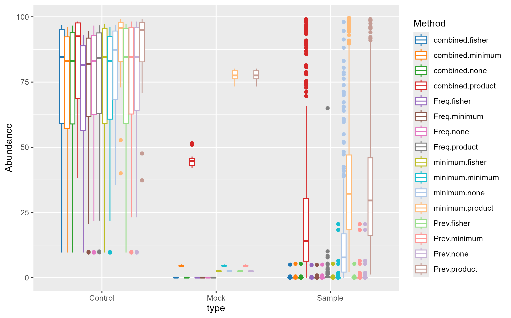
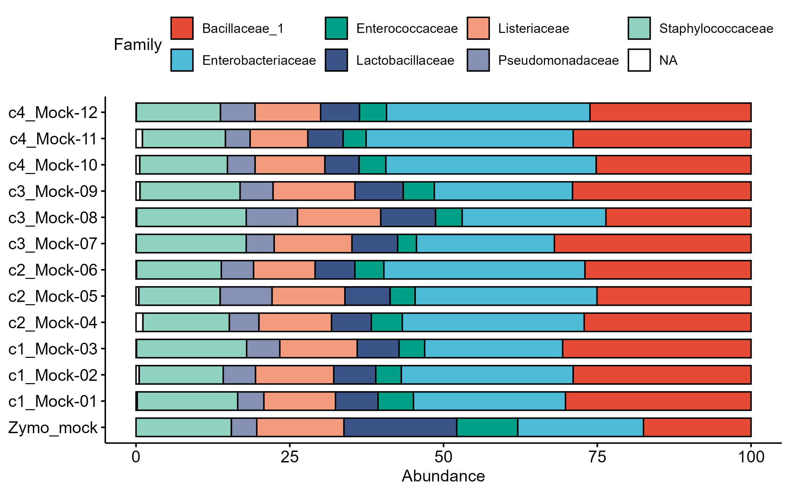
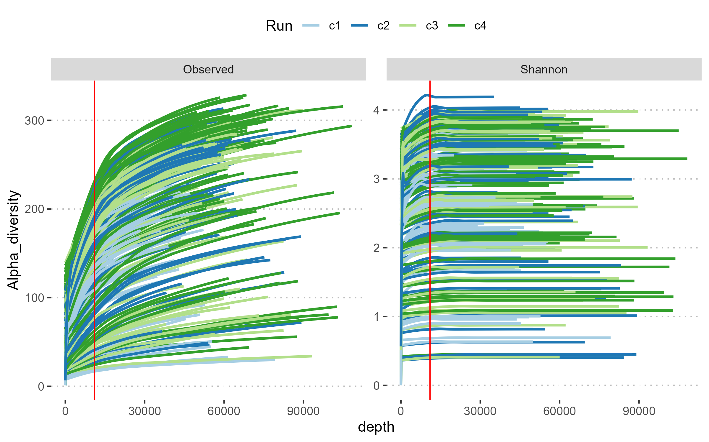
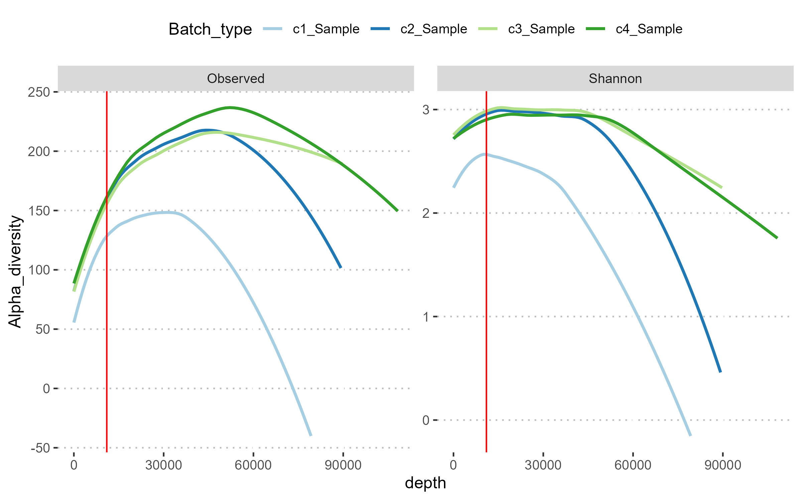
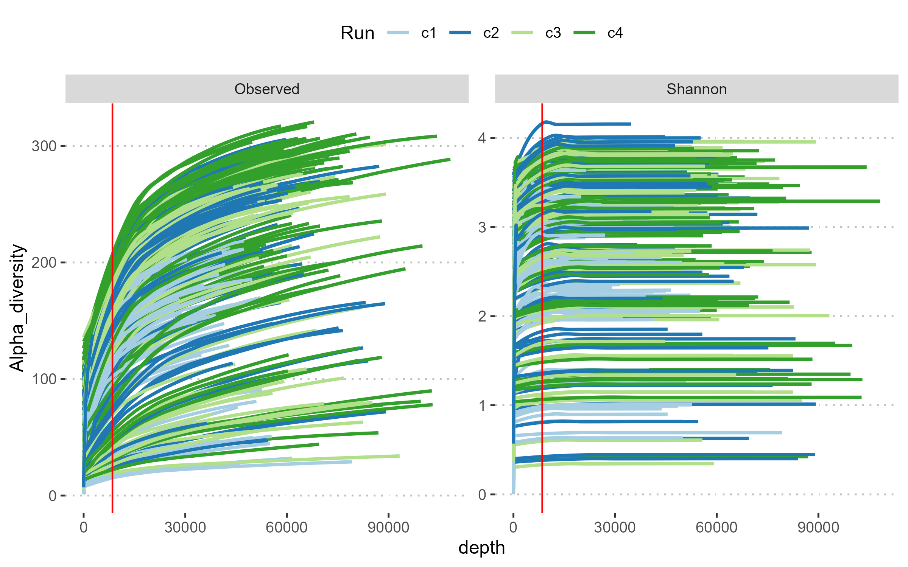
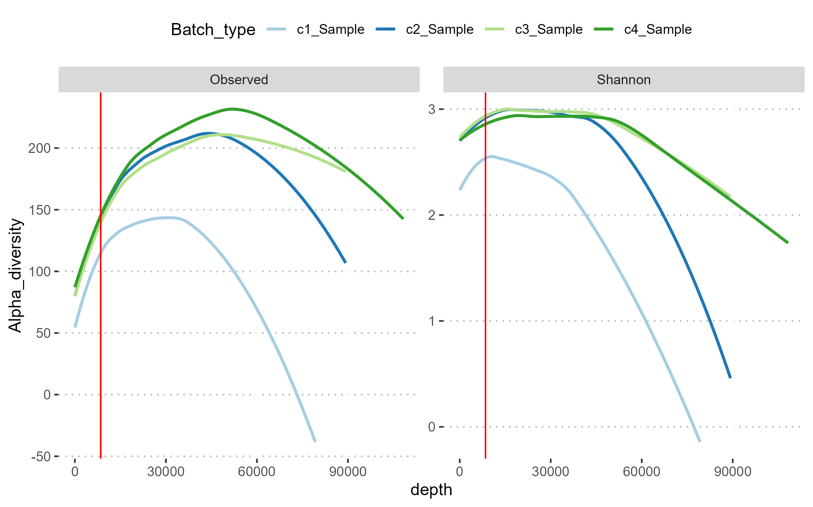

# INFO

This document contains the commands necessary to perform initial import and QC of the output from the DF_GMH_PIPELINE managing 16S V3 amplicon sequence data for gut microbiome analysis. Here it has been fitted for data from Fibrex (internal project number B-02-22).

# PROJECT

The FIBREX project is a PFOS exposure experiment focusing on the difference in uptake and wash-out of PFOS between rats given feed with and without dietary fibers. Samples for this analysis are 16S rRNA V3 amplicons from extracted total DNA of feces and luminal samples from ileum and cecum. Fecal samples were collected before exposure start (day 0, n=48) and hereafter at day 8 (n=48), 12 (n=24), 16 (n=24), 20 (n=24) and 21 (n=24). Sampling on day 20 was run as a test of effect of carmine treatment for transit time but has been left out of analyses included in main article as no marked differences were observed between day 20 and 21. Luminal contents were collected at dissections at day 8 (n=24) and 21 (n=24). DNA was sequenced on IonTorrent GSS5 platform and raw data converted to ASVs using cutadapt (Martin 2011) and DADA2 (Callahan et al. 2016) and converted into Phyloseq elements (McMurdie and Holmes 2013). Goal of the analysis is to investigate the impact of soluble dietary fibre, PFOS exposure, and PFOS depuration on the gut microbiota.

## Metadata
Metadata added contains results from:

- Weight data:
  + Body weight per sampling day (day *0*, *8*, *12*, *16*, and *21*)
  + Cecum and liver weight per dissection day (day *8* and *21*).

- Total PFOS quantification of:
  + *systemic concentrations* in blood serum from day 8, 16 and 21, liver and brain tissues (day 8 and 21).
  + *wash-out concentrations* in urine from day 8, 16 and 21, feces from day 8, 12, 16 and 21, and cecum (day 8 and 21).

- Short-chain fatty acids quantification of 10 compounds in cecum given in mM per dissection day (day 8 and 21).

- pH-values from upper and lower jejunum, ileum and cecum in separate columns: pH_je_up, pH_je_low, pH_il, pH_ce per day. Also one pH column "pH" with values fitting each sample type (feces are assigned cecum values).

- Transit time for each day (day 0 = measurement from day 0; day 8 = measurement from day 7; day 21 = measurement from day 20)

Division of groups are based on **Sample identifiers**:
  - "rat_name" is corrected rat names due to non-continuous numbering for rat_org and dissection days for rat_org *R41-R42* (day 21) and *R43-R44* (day 8). *This column should be used for rat identification*. All following information is following rat_name nomenclature.
  - "cage" number: *01-24*
  - "feed" given during the study: 
    + *LF* = low fibre (AIN-93G, D19090404 with mineral sourced casein, Research Diets)
    + *HF* = high fibre (Soy-free Altromin 1314, Altromin)
  - "treatment" for oral gavage given:
    + *CTRL* for control groups
    + *PFOS* for PFOS exposed groups
  - "day" for day of sampling: *d8* and *d21*
  - combined identifiers with values from above separated by "_": "feedtreat", "feedtreatday"
  
- Carmine treatment (0 = *no* and 1 = *yes*) for different days.

# SETUP
```{r setup, eval=TRUE, echo=TRUE, message=FALSE,warning = FALSE}
knitr::opts_chunk$set(echo = TRUE ,warning = FALSE, message = FALSE)

# Load libraries
library(tidyverse)
library(GMHmicrobiome)
library(phyloseq)
library(decontam)
library(pals)
library(ggpubr)
library(vegan)
library(phangorn)
library(kableExtra)

# Save params
saveRDS(params, file = "R_objects/import_params.RDS")
```

# IMPORT AND MERGE

This section will import and merge phyloseq data and metadata.

## SEQUENCING DATA

First step is to load the output from the pipeline. This section generates a unique sample identifiers that will be used to merge with metadata in the following section. The two additional variables created ("is.neg" and "type") will be used for decontamination later.

```{r Load-sequencing-data, eval = FALSE}

params <- readRDS("R_objects/import_params.RDS")
# Load analysis data
load(params$input)

# Create sample ID variable and use it as sample_names
sample_data(phy)$SampleID <- with(sample_data(phy), paste(Seq_run,Sample, sep = "_"))
sample_names(phy) <- sample_data(phy)$SampleID

# Create variables identifying negative controls. If negative controls are named differently update this option, "|" can be used to list more options
sample_data(phy)$is.neg <- grepl(params$neg,sample_data(phy)$Sample,ignore.case = TRUE)

# Create variables identifying sample types.Remember to update if Mock samples samples are named differently
sample_data(phy)$type <- ifelse(sample_data(phy)$is.neg, "Control",
                                ifelse(grepl("Mock",sample_data(phy)$Sample, 
                                             ignore.case = TRUE), "Mock","Sample"))

# Create backup of the original dataset
phy.org <- phy

```

## METADATA

Next step is to load the metadata for the project. This step will have to be edited to fit the files and names used. It can be easier to use the build in import function to import correctly and then save the created code here to reproduce import later (File \> Import Dataset \> From Text (readr)).

The section also creates a variable that matches the unique sample names and highlights if there are any mismatches between the sequencing and meta data.

```{r Load-metadata, eval = FALSE}
# export sample data
tmp <- data.frame(sample_data(phy))

# Load metadata - This part will be specific to the project
meta <- read.csv(params$meta, header = TRUE, sep = ";", dec = ",")

# Create an identical ID variable to use for merging
meta$SampleID <- with(meta, paste(Run,sample_name, sep = "_"))

# Verify that all the IDs are identical between the datasets
if (nrow(anti_join(tmp, meta, by = "SampleID")) != 0) {
  anti_join(tmp, meta, by = "SampleID")
} else message("All samples from sequencing data matched in metadata")

if (nrow(anti_join(meta, tmp, by = "SampleID")) != 0) {
  anti_join(meta, tmp, by = "SampleID")
} else message("All samples from metadata matched in sequencing data")

# Check which, if any columns, are in both tables
shared_cols <- colnames(tmp)[colnames(tmp) %in% colnames(meta)] %>% .[. != "SampleID"]

# Print shared columns
if (length(shared_cols) != 0) message("The following columns are present in both sequencing and metadata:\n", knitr::combine_words(shared_cols))
```

## MERGE DATA

This section will now add the metadata to the sequencing data and save the resulting phyloseq file.

```{r merge-data, eval = FALSE}
# If any other columns than ID is in both, consider if you want it removed
meta <- meta %>% select(-one_of(shared_cols))

# When you are sure that all match, then merge and add to phyloseq
mtmp <- left_join(tmp,meta,by="SampleID")
row.names(mtmp) <- mtmp$SampleID

# Add the merged data to the phyloseq object
sample_data(phy) <- mtmp

# Save the phyloseq object
save(phy.org, phy, file="R_objects/input.Rdata")

# clear the environment and release memory
rm(list = ls(all.names = TRUE)) #will clear all objects includes hidden objects.
invisible(gc()) #free up memory and report the memory usage.

```

*Merged phyloseq object saved in: "**R_objects/input.Rdata**"*

# CLEAN AND QC

This section cleans the taxonomic table and decontaminate the sequencing data.

## CLEAN TAXA

Many ASVs lacks species level, or higher, classification. Later steps will use the taxonomic annotation at various levels and some will remove taxa without classification. To avoid data being removed it is necessary to replace missing values with relevant information, this will be the highest available classification. At the same time, ASVs that could not be classified to Phylum or even Kingdom level is likely to be sequencing artifacts and will be removed. For some analyses it might be relevant to only include taxa that has been properly classified, so the level at which unclassified taxa are removed can be modified.

```{r Clean-taxa, eval = TRUE}
################################################################################
# load data 
load("R_objects/input.Rdata")
# Load function
load("scripts/clean_tax.Rdata")

# Clean phyloseq object
phy <- clean_taxa(phy, tax_remove = "Phylum", verbose = TRUE)

# Remove Cyanobacteria/Chloroplast
phy <- subset_taxa(phy, Phylum != "Cyanobacteria/Chloroplast")

# Save cleaned phyloseq object
save(phy.org, phy, file="R_objects/cleaned.Rdata")

# clear the environment and release memory
rm(list = ls(all.names = TRUE)) #will clear all objects includes hidden objects.
invisible(gc()) #free up memory and report the memory usage.

```

## DECONTAMINATE

This section runs decontam to remove likely contaminants from the data set [@decontam]. Frequency based decontam assumes a negative correlation between DNA concentration and contaminant abundance, while prevalence based decontam assumes higher abundance of contaminants in controls. If the project contains samples from multiple batches, or runs, this information should be included using the "batch" variable.

-   If your metadata contains **either** initial DNA concentration **OR** negative controls indication, **AND** the samples have been processed and sequenced in one batch, then use the **SINGLE SETTING** section.

-   If your metadata contains **both** initial DNA concentration **AND** negative controls indication, **OR** the samples have been processed and sequenced in more than one batch, then use the **MULTIPLE SETTINGS** section.

### SINGLE SETTING

Only one of the parts between the hashtags should be used. **REMEMBER** to delete the other part.

```{r Decontam-single, eval = FALSE}
params <- readRDS("R_objects/import_params.RDS")
# load data 
load("R_objects/cleaned.Rdata")
df <- data.frame(sample_data(phy))

############################################################################

### If using frequency based method
df <- df[order(df$dna_conc),]
df$Index <- seq(nrow(df))
ggplot(data=df, aes(x=Index, y=dna_conc, color=type)) + geom_point()
ggsave("plots/sequencing_depth.pdf")

# Set any sample with DNA below detection limit (or neg PCR controls) to half the lowest measured value
sample_data(phy)$dna_conc[sample_data(phy)$dna_conc == 0] <- min(sample_data(phy)$dna_conc[sample_data(phy)$dna_conc != 0])/2

# Identify contaminants
contamdf <- isContaminant(phy, method="frequency", conc="dna_conc")
table(contamdf$contaminant)

############################################################################

# ### If using prevalence based method
# 
# # Compare sequencing depth to sample type 
# df <- data.frame(sample_data(phy))
# df <- df[order(df$reads),]
# df$Index <- seq(nrow(df))
# ggplot(data=df, aes(x=Index, y=reads, color=type)) + geom_point()
# suppressMessages(ggsave("plots/sequencing_depth.pdf"))
# 
# # use prevalence method to decontam
# contamdf <- isContaminant(phy, method="prevalence", neg="is.neg")
# table(contamdf$contaminant)

############################################################################

# plot presence Abundance of contaminants
ps.prc <- transform_sample_counts(phy, function(x) 100*x/sum(x))
prc.melt <- psmelt(ps.prc)

prc.melt$contaminant <- prc.melt$OTU %in% row.names(contamdf)[contamdf$contaminant]
contam.prc <- aggregate(Abundance~Sample+type+contaminant, data = prc.melt, FUN = sum)

ggplot(contam.prc[contam.prc$contaminant,], aes(x = type, y = Abundance)) + geom_boxplot()
suppressMessages(ggsave("plots/contaminant_fraction_single.pdf"))

aggregate(Abundance~type+contaminant, data = contam.prc, FUN = mean)

# Create and store table of taxa and their abundance
tax.df <- aggregate(Abundance ~ OTU+Phylum+Class+Order+Family+Genus+Species+type+contaminant, data = prc.melt, FUN = mean)
tmp <- reshape2::dcast(tax.df,formula = Phylum+Class+Order+Family+Genus+Species+OTU+contaminant~type, value.var = "Abundance")

write.table(tmp, file = "tables/contaminant_taxa.tsv", row.names = F,quote = F, sep = "\t",col.names = T)

# Evaluate what you can agree to loose, I will use the default
phy <- prune_taxa(row.names(contamdf)[!contamdf$contaminant], phy)

# Filter ASVs with less than 5 reads
phy <- prune_taxa(taxa_sums(phy) >= 5,phy)

# Plot depth v type again
df <- data.frame(sample_data(phy))
df$depth <- sample_sums(phy)
df <- df[order(df$depth),]
df$Index <- seq(nrow(df))
ggplot(data=df, aes(x=Index, y=depth, color=type)) + geom_point()

# save the cleaned phyloseq object
save(phy, file="R_objects/Decontam.Rdata")

# clear the environment and release memory
rm(list = ls(all.names = TRUE)) #will clear all objects includes hidden objects.
invisible(gc()) #free up memory and report the memory usage.

```

*Cleaned phyloseq object saved in: "**R_objects/Decontam.Rdata**"*

### MULTIPLE SETTINGS

How the contaminants from each batch is combined is defined using the variable "batch.combine": - "minimum" = The minimum batch probabilities is used to identify contaminants - "product" = The product of the batch probabilities is used to identify contaminants - "fisher" = The batch probabilities are combined with Fishers method and used to identify contaminants Decontam can identify contaminants based on the initial DNA concentration (frequency) and/or based on prevalence in samples and controls. As for batches, the two methods can be used separately or combined. The variable "method" defines how decontam will run.

#### CLASSIFY

First we classify contaminants using all possible combinations of the settings.

If there is only one batch or just one method used, **remember** to delete the unused lines.

```{r decontam-multiple, eval = TRUE}

params <- readRDS("R_objects/import_params.RDS")
# load data 
load("R_objects/cleaned.Rdata")

# Compare sequencing depth to sample type 
df <- data.frame(sample_data(phy))
df <- df[order(df$reads),]
df$Index <- seq(nrow(df))
ggplot(data=df, aes(x=Index, y=reads, color=type)) + geom_point()
suppressMessages(ggsave("plots/sequencing_depth.pdf"))

# Prep table for output
contam.df <- data.frame(row.names = taxa_names(phy))

# Set any sample with DNA below detection limit (or neg PCR controls) to half the lowest measured value
sample_data(phy)$quant_reading <- ifelse(sample_data(phy)$dna_conc == 0, min(sample_data(phy)$dna_conc[sample_data(phy)$dna_conc != 0])/2, sample_data(phy)$dna_conc)

# Both methods, no batches
contam.df$Prev.none <- isContaminant(phy, method="prevalence", neg="is.neg", detailed = FALSE)
contam.df$Freq.none <- isContaminant(phy, method="frequency", conc="quant_reading", detailed = FALSE)
contam.df$combined.none <- isContaminant(phy, method="combined", neg="is.neg", conc="quant_reading", detailed = FALSE)
contam.df$minimum.none <- isContaminant(phy, method="minimum", neg="is.neg", conc="quant_reading", detailed = FALSE)

# Both methods, Batch minimum
contam.df$Prev.minimum <- isContaminant(phy, method="prevalence", neg="is.neg", detailed = FALSE, batch = "Run", batch.combine = "minimum")
contam.df$Freq.minimum <- isContaminant(phy, method="frequency", conc="quant_reading", detailed = FALSE, batch = "Run", batch.combine = "minimum")
contam.df$combined.minimum <- isContaminant(phy, method="combined", neg="is.neg", conc="quant_reading", detailed = FALSE, batch = "Run", batch.combine = "minimum")
contam.df$minimum.minimum <- isContaminant(phy, method="minimum", neg="is.neg", conc="quant_reading", detailed = FALSE, batch = "Run", batch.combine = "minimum")

# Both methods, Batch product
contam.df$Prev.product <- isContaminant(phy, method="prevalence", neg="is.neg", detailed = FALSE, batch = "Run", batch.combine = "product")
contam.df$Freq.product <- isContaminant(phy, method="frequency", conc="quant_reading", detailed = FALSE, batch = "Run", batch.combine = "product")
contam.df$combined.product <- isContaminant(phy, method="combined", neg="is.neg", conc="quant_reading", detailed = FALSE, batch = "Run", batch.combine = "product")
contam.df$minimum.product <- isContaminant(phy, method="minimum", neg="is.neg", conc="quant_reading", detailed = FALSE, batch = "Run", batch.combine = "product")

# Both methods, Batch minimum
contam.df$Prev.fisher <- isContaminant(phy, method="prevalence", neg="is.neg", detailed = FALSE, batch = "Run", batch.combine = "fisher")
contam.df$Freq.fisher <- isContaminant(phy, method="frequency", conc="quant_reading", detailed = FALSE, batch = "Run", batch.combine = "fisher")
contam.df$combined.fisher <- isContaminant(phy, method="combined", neg="is.neg", conc="quant_reading", detailed = FALSE, batch = "Run", batch.combine = "fisher")
contam.df$minimum.fisher <- isContaminant(phy, method="minimum", neg="is.neg", conc="quant_reading", detailed = FALSE, batch = "Run", batch.combine = "fisher")

# decontam summary
contam.df$ASV <- row.names(contam.df)
contam.long <- pivot_longer(contam.df, !ASV, names_to = "Method", values_to = "Contaminant")

# Merge with sample data
ps.prc <- transform_sample_counts(phy, function(x) 100*x/sum(x))
prc.melt <- suppressWarnings(psmelt(ps.prc))
prc.m <- full_join(prc.melt, contam.long, by = c("OTU" = "ASV"))

# Aggregate and plot
prc.agg <- prc.m %>% group_by(Sample, type, Method, Contaminant) %>% summarise(Abundance = sum(Abundance))
decontam.plot <- ggplot(prc.agg[prc.agg$Contaminant,], aes(x = type, y = Abundance,color = Method)) +
  geom_boxplot()  + ggsci::scale_color_d3(palette = "category20")
suppressMessages(ggsave(decontam.plot,file = "plots/contaminant_fraction_multiple.png",device = "png"))

# save data to avoid rerunning for each knitting
save(contam.df, contam.long, file = "R_objects/Decontam_tables.RData")
```

*complete decontam classifications is saved in: "**R_objects/Decontam_tables.RData**"*

{width="100%"}

#### COMPARE

The mean abundance classified as contaminant for each sample type and Decontam setting: {width="100%"}

The number of ASVs removed for each method is:

```{r Decontam-count, eval=TRUE,echo=TRUE}
load("R_objects/Decontam_tables.RData")

# table with number of ASVs classified as contaminants
with(contam.long, table(Method,Contaminant))
```

#### FILTER

This section contains the actual decontamination. This should be performed as harshly as makes sense for each specific project, but I suggest basing this on the comparisons above, considering that contaminants in the mock sample is unlikely, while as much as the negative control should be removed.
Based on the above decontamination analysis and testing out the MOCK (see below), Freq.minimum and Freq.product where selected.

```{r Decontam-filter, eval=TRUE,echo=TRUE}

# Evaluate what you can agree to loose and then use that column. I will use the minimum.minimum
phy <- prune_taxa(contam.df$ASV[contam.df$Freq.minimum == FALSE], phy)
phy.harsh <- prune_taxa(contam.df$ASV[contam.df$Freq.product == FALSE], phy)
# Filter ASVs with less than 5 reads
phy <- prune_taxa(taxa_sums(phy) >= 5,phy)
phy.harsh <- prune_taxa(taxa_sums(phy.harsh) >= 5,phy.harsh)

# Plot depth v type again
df <- data.frame(sample_data(phy))
df$depth <- sample_sums(phy)
df <- df[order(df$depth),]
df$Index <- seq(nrow(df))
ggplot(data=df, aes(x=Index, y=depth, color=type)) + geom_point() + 
  facet_wrap(params$batch, nrow = 1) + ggtitle("Sequencing depth after Decontam")

# Plot depth v type again
df <- data.frame(sample_data(phy.harsh))
df$depth <- sample_sums(phy.harsh)
df <- df[order(df$depth),]
df$Index <- seq(nrow(df))
ggplot(data=df, aes(x=Index, y=depth, color=type)) + geom_point() + 
  facet_wrap(params$batch, nrow = 1) + ggtitle("Sequencing depth after harsh Decontam")

# Remove samples with few reads and filter taxa again
phy <- prune_samples(sample_sums(phy) > 1000, phy)
phy.harsh <- prune_samples(sample_sums(phy.harsh) > 1000, phy.harsh)

# save the cleaned phyloseq object (extra objects, like harsh can be included as needed)
save(phy, phy.harsh, file="R_objects/Decontam.Rdata")

# Create csv with ASV abundance, taxonomy, and contaminant classification
tmp.phy <- suppressWarnings(merge_samples(ps.prc, "type"))
tmp.phy <- transform_sample_counts(tmp.phy, function(x) x/sum(x)*100)
tmp.samples <- data.frame(cbind(tax_table(tmp.phy), t(otu_table(tmp.phy))))

tmp.samples$ASV <- row.names(tmp.samples)
tmp.contam <- data.frame(ASV = contam.df$ASV, contam_phy = contam.df$minimum.minimum, contam_harsh = contam.df$Freq.product)
tmp.out <- full_join(tmp.samples, tmp.contam, by = "ASV")

write_csv(tmp.out,file = "output/Decontam_Overview.csv")
# clear the environment and release memory
rm(list = ls(all.names = TRUE))
invisible(gc())

```

*Cleaned phyloseq object saved in: "**R_objects/Decontam.Rdata**"*

## TEST MOCK

Here we test how the mock community looks compared to the expected abundance. While there might be some differences from the expected mock community, the important part is that mock communities are consistent across runs.

```{r Mock, eval = TRUE}
params <- readRDS("R_objects/import_params.RDS")

# load data
load("R_objects/Decontam.Rdata")

# Subset mocks
mocks <- subset_samples(phy, type == "Mock")
mocks <- prune_taxa(taxa_sums(mocks) >= 5, mocks)

# Control for depth of mocks
table(sample_sums(mocks))

# All fine, so transform to percentages
mocks.prc <- transform_sample_counts(mocks,fun = function(x) x*100/sum(x))

# Import original mock community data
mock.org <- readRDS("ZymoMock.RDS")
data("ZymoMock")
mock.org.clean <- aggregate(Abundance ~ Sample + Family, data = mock.org, FUN = sum)

# melt mocks
mock <- suppressWarnings(psmelt(mocks.prc))
mock <- mock[mock$Abundance > 0,]
mock.clean <- mock[,c("Sample","Abundance","Family")]

# Remove families not in mock
mock.clean$Family <- ifelse(mock.clean$Family %in% mock.org.clean$Family, mock.clean$Family, NA)

# Bind the data
mock.clean <- rbind(mock.clean,mock.org.clean)

mock.ag <- mock.clean %>% group_by(Sample, Family) %>% summarise(Abundance = sum(Abundance))

# Create plots
mock.plot <- ggbarplot(mock.ag, x = "Sample", y = "Abundance", fill = "Family", palette = "npg",rotate=TRUE, ylab = FALSE)

suppressMessages(ggsave("plots/test_mock_comparison.png",mock.plot,device = "png"))

# clear the environment and release memory
rm(list = ls(all.names = TRUE))
invisible(gc())
```

Comparison of the zymo mock community and the sequenced mock communities: {width="100%"}

# RAREFACTION CURVES

It is important to ensure that the samples have been sequenced to a sufficient depth and remove samples with to few sequencing reads. What number of sequences to set as cutoff should be balanced between the number of samples included, or excluded, and the alpha diversity level at that sequencing depth. To determine this we will calculate and evaluate rarefaction curves

## CALCULATE DATA FOR RAREFACTION CURVES

As this is used to assess the sequencing depth to use for the actual rarefaction fewer rarefactions is acceptable. Default maxdepth is set to the the 90th quantile of sample sequencing depths, but a lower value can be set.

```{r rare-curve-calc, eval = FALSE}
# load
load("R_objects/Decontam.Rdata")
load("scripts/adiv.Rdata")

# Set alpha diversity indexes to use
R.methods <- c("Observed", "Shannon")

# calculate rarefaction data
Rdat <- Rcurve_data(phy, methods = R.methods)

# melt data table
Rdat.m <- pivot_longer(data = Rdat, cols = R.methods, names_to = "Index", values_to = "Alpha_diversity")
Rdat.m$Alpha_diversity[Rdat.m$Alpha_diversity == "NaN"] <- 1

# save Rdat
save(Rdat.m, file = "R_objects/Rare_dat.RData")

# calculate rarefaction data
Rdat <- Rcurve_data(phy.harsh, methods = R.methods)

# melt data table
Rdat.m <- pivot_longer(data = Rdat, cols = R.methods, names_to = "Index", values_to = "Alpha_diversity")
Rdat.m$Alpha_diversity[Rdat.m$Alpha_diversity == "NaN"] <- 1

# save Rdat
save(Rdat.m, file = "R_objects/Rare_dat_harsh.RData")

# clear the environment and release memory
rm(list = ls(all.names = TRUE)) #will clear all objects includes hidden objects.
invisible(gc()) #free up memory and report the memory usage.

```

### PLOT RAREFACTION CURVES {.tabset .tabset-fade .tabset-pills}

#### GENTLE DECONTAM

The rarefaction curves can be plotted for each sample by some other variable. Remember that the mock samples are expected to be very different. Also when grouping by other than sample there might be large changes when passing the actual sequencing depth of individual samples.

```{r rare-curve-gentle, eval = TRUE, echo = TRUE}
params <- readRDS(file = "R_objects/import_params.RDS")

# Load data
load("R_objects/Rare_dat.RData")

# plot per sample
plot.ind <- ggplot(Rdat.m, aes(x = depth, y = Alpha_diversity, color = Run)) + 
  geom_smooth(aes(group = Sample), se = FALSE) + 
  facet_wrap("Index", scales = "free",nrow = 1) + 
  geom_vline(color = "red",xintercept = 11000) + 
  theme_pubclean() + scale_color_brewer(palette = "Paired")
suppressMessages(ggsave(filename = "plots/Rcurve_individual.png",plot = plot.ind, device = "png"))

Rdat.m <- Rdat.m[Rdat.m$type == "Sample",]
Rdat.m <- Rdat.m %>% unite("Batch_type", c(params$batch, "type"), na.rm = TRUE, remove = FALSE)

# plot per run and sample type
plot.group <- ggplot(Rdat.m, aes(x = depth, y = Alpha_diversity, color = Batch_type)) + 
  geom_smooth(aes(group = Batch_type), method = "loess", formula = y ~ x, se = FALSE) + 
  facet_wrap("Index", scales = "free",nrow = 1) + 
  geom_vline(color = "red",xintercept = 11000) + 
  theme_pubclean() + scale_color_brewer(palette = "Paired")
suppressMessages(ggsave("plots/Rcurve_grouped.png", plot = plot.group, device = "png"))

# clear the environment and release memory
rm(list = ls(all.names = TRUE)) #will clear all objects includes hidden objects.
invisible(gc()) #free up memory and report the memory usage.

```

Rarefaction curve for individual samples: {width="100%"} Rarefaction curve grouped by sample type and batch: {width="100%"}

#### HARSH DECONTAM

The rarefaction curves can be plottet for each sample by some other variable. Remember that the mock samples are expected to be very different. Also when grouping by other than sample there might be large changes when passing the actual sequencing depth of individual samples.

**REMEMBER** to update the position of the cutoff indicator (xintercept in geom_vline()).

```{r rare-curve-harsh, eval = TRUE, echo = TRUE}
params <- readRDS(file = "R_objects/import_params.RDS")

# Load data
load("R_objects/Rare_dat_harsh.RData")

# plot per sample
plot.ind <- ggplot(Rdat.m, aes(x = depth, y = Alpha_diversity, color = Run)) + 
  geom_smooth(aes(group = Sample), se = FALSE) + 
  facet_wrap("Index", scales = "free",nrow = 1) + 
  geom_vline(color = "red",xintercept = 8500) + 
  theme_pubclean() + scale_color_brewer(palette = "Paired")
suppressMessages(ggsave(filename = "plots/Rcurve_individual_harsh.png",plot = plot.ind, device = "png"))

Rdat.m <- Rdat.m[Rdat.m$type == "Sample",]
Rdat.m <- Rdat.m %>% unite("Batch_type", c(params$batch, "type"), na.rm = TRUE, remove = FALSE)

# plot per run and sample type
plot.group <- ggplot(Rdat.m, aes(x = depth, y = Alpha_diversity, color = Batch_type)) + 
  geom_smooth(aes(group = Batch_type), method = "loess", formula = y ~ x, se = FALSE) + 
  facet_wrap("Index", scales = "free",nrow = 1) + 
  geom_vline(color = "red",xintercept = 8500) + 
  theme_pubclean() + scale_color_brewer(palette = "Paired")
suppressMessages(ggsave("plots/Rcurve_grouped_harsh.png", plot = plot.group, device = "png"))

# clear the environment and release memory
rm(list = ls(all.names = TRUE)) #will clear all objects includes hidden objects.
invisible(gc()) #free up memory and report the memory usage.

```

Rarefaction curve for individual samples: {width="100%"} Rarefaction curve grouped by sample type and batch: {width="100%"}

## CLEAN PHYLOSEQ OBJECTS

After using decontaminate and evaluating the mock communities we can now create a phyloseq object with just the project samples.

**REMEMBER** to update the minimum sample sums based on the rarefaction curves.

```{r subset-samples, eval=TRUE, echo=TRUE}
# load data
load("R_objects/Decontam.Rdata")

# remove low read samples and mock
phy <- prune_samples(sample_sums(phy) > 11000, phy)
phy <- subset_samples(phy, type == "Sample")
phy <- prune_taxa(taxa_sums(phy) > 0, phy)
phy_tree(phy) <- midpoint(phy_tree(phy))

# Save gently decontaminated samples
save(phy, file="R_objects/Phyloseq.Rdata")

# remove low read samples and mock from harshly decontaminated
phy <- prune_samples(sample_sums(phy.harsh) > 8500, phy.harsh)
phy <- subset_samples(phy, type == "Sample")
phy <- prune_taxa(taxa_sums(phy) > 0, phy)
phy_tree(phy) <- midpoint(phy_tree(phy))

# save harshely decontaminated samples
save(phy, file="R_objects/Phyloseq_harsh.Rdata")

# clear the environment and release memory
rm(list = ls(all.names = TRUE))
invisible(gc())
```

# CALCULATE ALPHA DIVERSITY

There is randomness involved in performing rarefaction (random subsampling). To minimize any effect of this randomness it is recommended to use the mean of multiple rarefactions instead of just relying on just one random subsampling. Not rarefying a sample can create a bias, so to avoid this I will rarefy all samples to 90% of the lowest sample depth (default setting). As this will be done for just one sequencing depth and we need the results to be consistent default setting is to rarefy 100 times. The function will produce a data.frame with sample metadata and the mean and standard deviation for each sample using the methods set prior.

```{r alpha-div-calc, eval=TRUE}
params <- readRDS(file = "R_objects/import_params.RDS")
#load("scripts/adiv.Rdata")

# Set indeces
INDECES <- as.vector(str_split(params$indeces,pattern = "\\|",simplify = TRUE))

## First phyloseq object
# load data
load("R_objects/Phyloseq.Rdata")

# Calculate data
adat <- calculate_alpha_diversity(phy, INDECES = INDECES)

# Add data to phyloseq object
sample_data(phy) <- adat

# Save the phyloseq object
save(phy, INDECES, file="R_objects/Phyloseq.Rdata")

## Harsh phyloseq object
# load data
load("R_objects/Phyloseq_harsh.Rdata")

# Calculate data
adat <- calculate_alpha_diversity(phy, INDECES = INDECES)

# Add data to phyloseq object
sample_data(phy) <- adat

# Save the phyloseq object
save(phy, INDECES, file="R_objects/Phyloseq_harsh.Rdata")

# clear the environment and release memory
rm(list = ls(all.names = TRUE)) #will clear all objects includes hidden objects.
invisible(gc()) #free up memory and report the memory usage.

```

# FINAL COMMENT

This completes data import, initial cleaning, QC of the sequencing data, and calculation of alpha diversity. The data stored in "R_objects/Phyloseq.Rdata" and "R_objects/Phyloseq_harsh.Rdata". The phyloseq objects can now be used for further analysis in the templates for:

| Analysis               | Template                   | Note                                                               |
|------------------|---------------------|---------------------------------|
| Microbiome description | GMH_description            | Statistical test of sample_data variables, incl alpha diversity    |
| Statistical testing    | GMH_test_variables         | Statistical test and visualization of alpha diversity and metadata |
| Beta diversity         | GMH_beta_diveristy         | Statistical test and visualization of beta diversity               |
| Differential abundance | GMH_differential_abundance | Test differential abundance of taxa against sample variables       |

# SETTINGS {.tabset .tabset-fade .tabset-pills}

Overview of the parameters and packages that were used for this analysis

## PARAMETERS

The following paramenters were set in for this analysis:

```{r parameters, eval=TRUE}
params <- readRDS("R_objects/import_params.RDS")

tmp <- unlist(params)
dat <- data.frame(Parameter = names(tmp), Value = unname(tmp))


kbl(dat, row.names = F) %>% kable_classic(lightable_options = "striped")

```

## SESSION INFO

The analysis was run in the following environment:

```{r packages, eval=TRUE}
sessionInfo()
```
