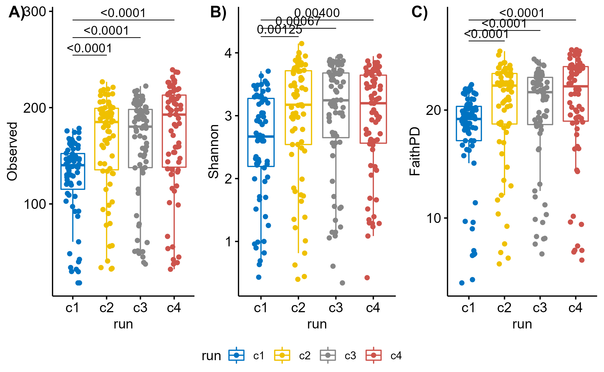

# INFO {.tabset .tabset-fade .tabset-pills}

This Rmarkdown contains the commands necessary to perform alpha diversity analysis of the output from the [DF_GMH_PIPELINE](https://github.com/MSMortensen/DF_GMH_pipeline). It is expected that the data has been imported, cleaned, and saved following the script **1_Import.Rmd** prior to using this script. It is recommend to visiting the ["Analysis of community ecology data in R"](https://www.davidzeleny.net/anadat-r/doku.php/en:start) to read about the theory behind the alpha and beta diversity and examples of the necessary R-code to execute them. Other excellent source of help is the R [cheat-sheets](https://www.rstudio.com/resources/cheatsheets/) and for problems related to Rmarkdown this resource is suggested [online Book](https://bookdown.org/yihui/rmarkdown/).

Alpha diversity, also called "within sample diversity" is calculated for each sample individually and is independent of all other samples. Alpha diversity is sensitive to sequencing depth, so rarefaction must be done first.
Here we calculate index:
 -    Observed richness (observed species)
 -    Shannon diversity index
 -    Pielou's Evenness (not included in final analysis as it is covered by Shannon diversity index)
 -    Faith's Phylogenetic Diversity

# SETUP

```{r setup, eval=TRUE, echo=TRUE, message=FALSE,warning = FALSE}
knitr::opts_chunk$set(echo = TRUE)

# Load libraries
library(tidyverse)
library(phyloseq)
library(ggpubr)
library(rstatix)
library(kableExtra)
library(picante)
library(plotly)
library(cowplot)

# Save params
saveRDS(params, file = "R_objects/Adiv_params.RDS")
```

# SCRIPTS
```{r}
adiv_batch_effect <- function(INNER.VAR, OUTER.VAR, MTRL, DAY) {
  load(params$input)
  adat <- data.frame(sample_data(phy))
  adat <- adat[adat$material == MTRL & adat$day == DAY,]
  
  # Remove samples with incomplete metadata
  adat <- adat[!is.na(adat[,INNER.VAR]) & !is.na(adat[,OUTER.VAR]),]
  adat[,OUTER.VAR] <- as.factor(adat[,OUTER.VAR])
  adat[,INNER.VAR] <- as.factor(adat[,INNER.VAR])
  
  # Determine if any batch effect might influence your data
  ## Calculate distribution counts
  freq.t <- with(adat, table(get(params$batch), feed, exclude = NULL))
  freq.t
  
  ## Determine distribution percentages
  pct.freq.t <- prop.table(freq.t,2)*100
  
  ## Test if any difference is significant (if not significant the batch effect should be negligible)
  chisq <- chisq_test(freq.t)
  output <- list(freq.t, pct.freq.t, chisq)
  output
  return(output)
}

# Process alpha divertsity data for a material and day and create combined plot with wilcoxon statistics
adiv_output <- function(INNER.VAR, OUTER.VAR, MTRL, DAY) {
  load(params$input)
  adat <- data.frame(sample_data(phy))
  adat <- adat[adat$material == MTRL & adat$day == DAY,]
  
  # Remove samples with incomplete metadata
  adat <- adat[!is.na(adat[,INNER.VAR]) & !is.na(adat[,OUTER.VAR]),]
  adat[,OUTER.VAR] <- as.factor(adat[,OUTER.VAR])
  adat[,INNER.VAR] <- as.factor(adat[,INNER.VAR])
  
  INDECES <- c("Observed","Evenness","Shannon","FaithPD")
  
  #### Test project variable
  for (i in INDECES) {
      fit <- aov(as.formula(paste(i, "~", OUTER.VAR,"*",INNER.VAR, sep = " ")), data = adat)
      aov <- anova(fit)
      thsd <- TukeyHSD(fit)
      
      ## Calculate stats for inner variable
      # Perform pairwise comparisons
      stat.test <- adat %>%
        group_by(.data[[OUTER.VAR]]) %>%
        wilcox_test(as.formula(paste(i, "~", INNER.VAR, sep = " "))) %>%
        adjust_pvalue(method = "BH") %>%
        add_significance("p.adj") %>% 
        add_xy_position(x = OUTER.VAR, dodge = 0.8) %>%
        p_format("p.adj", accuracy = 0.0001, trailing.zero = TRUE, new.col = TRUE)
      
      ## Calculate stats for outer variable
      # Perform pairwise comparisons
      stat.test2 <- adat %>%
        wilcox_test(as.formula(paste(i,"~", OUTER.VAR, sep = " "))) %>%
        adjust_pvalue(method = "BH") %>%
        add_significance("p.adj") %>% 
        add_xy_position(x = OUTER.VAR) %>%
        p_format("p.adj", accuracy = 0.0001, trailing.zero = TRUE, new.col = TRUE)
      
      print(stat.test)
      print(stat.test2)
      
      # Adjust y value for outer p-values
      stat.test2$y.position <- max(stat.test$y.position)*1.1
      
      # Create plot
      p <- ggboxplot(adat, x = OUTER.VAR, y = i,
                color = INNER.VAR,
                fill = INNER.VAR,
                add = "jitter",
                add.params = list(size = 1)) +
        scale_fill_manual(values = params$COL, name = "Group", labels = c("HF_CTRL" = "HF-CTRL","HF_PFOS" = "HF-PFOS","LF_CTRL" = "LF-CTRL","LF_PFOS" = "LF-PFOS")) +
        scale_color_manual(values = c("black","black","black","black")) +
        guides(color = "none") +
        theme(axis.title.x = element_blank())
      
      # Add p-values
      if (i == "Observed") {
        p.obs <- p + stat_pvalue_manual(stat.test, label = "p.adj.signif",tip.length = 0, hide.ns = TRUE, color = "red")
        p.obs <- p.obs + stat_pvalue_manual(stat.test2, label = "p.adj.signif",tip.length = 0, step.increase = 0.1, hide.ns = TRUE)
        obs <- list(fit = fit, ANOVA = aov, TukeyHSD = thsd)
      } else if (i == "Evenness") {
        p.eve <- p + stat_pvalue_manual(stat.test, label = "p.adj.signif",tip.length = 0, hide.ns = TRUE, color = "red")
        p.eve <- p.eve + stat_pvalue_manual(stat.test2, label = "p.adj.signif",tip.length = 0, step.increase = 0.1, hide.ns = TRUE)
        eve <- list(fit = fit, ANOVA = aov, TukeyHSD = thsd)
      } else if (i == "Shannon") {
        p.sha <- p + stat_pvalue_manual(stat.test, label = "p.adj.signif",tip.length = 0, hide.ns = TRUE, color = "red")
        p.sha <- p.sha + stat_pvalue_manual(stat.test2, label = "p.adj.signif",tip.length = 0, step.increase = 0.1, hide.ns = TRUE)
        sha <- list(fit = fit, ANOVA = aov, TukeyHSD = thsd)
      } else if (i == "FaithPD") {
        p.fpd <- p + stat_pvalue_manual(stat.test, label = "p.adj.signif",tip.length = 0, hide.ns = TRUE, color = "red")
        p.fpd <- p.fpd + stat_pvalue_manual(stat.test2, label = "p.adj.signif",tip.length = 0, step.increase = 0.1, hide.ns = TRUE)
        fph <- list(fit = fit, ANOVA = aov, TukeyHSD = thsd)
      }
  }
      adiv.plot <- ggarrange(p.obs,p.eve,p.sha,p.fpd, nrow = 1, labels = c("A)","B)","C)","D)"), common.legend = TRUE,legend = "top")
      adiv.plot
      
      save(p.obs,p.eve,p.sha,p.fpd, file = paste0("plots/adiv/alpha_",DAY,"/adiv_",MTRL,"_",DAY,".Rdata"))
      
      suppressMessages(ggsave(filename = paste0("plots/adiv/alpha_",DAY,"/adiv_",MTRL,"_",DAY,"_nested.png"), plot = adiv.plot, device = "png", units = "mm", width = 350, height = 100, dpi = 300))
      suppressMessages(ggsave(filename = paste0("plots/adiv/alpha_",DAY,"/adiv_",MTRL,"_",DAY,"_nested.pdf"), plot = adiv.plot, device = "pdf", units = "mm", width = 350, height = 100, dpi = 300))

      return(list(plot = adiv.plot, Observed = obs, Evenness = eve, Shannon = sha, FaithPH = fph))
}


adiv_day <- function(INNER.VAR, OUTER.VAR, MTRL, DAY) {
  load(params$input)
  adat <- data.frame(sample_data(phy))
  adat <- adat[adat$material == MTRL & adat$day == DAY,]
  
  # Remove samples with incomplete metadata
  adat <- adat[!is.na(adat[,INNER.VAR]) & !is.na(adat[,OUTER.VAR]),]
  adat[,OUTER.VAR] <- as.factor(adat[,OUTER.VAR])
  adat[,INNER.VAR] <- as.factor(adat[,INNER.VAR])
    
      
  ### Observed richness
  fit <- aov(as.formula(paste("Observed ~", OUTER.VAR,"*",INNER.VAR, sep = " ")), data = adat)
  anova(fit)
  TukeyHSD(fit)
  
  ## Calculate stats for inner variable
  # Perform pairwise comparisons
  stat.test <- adat %>%
    group_by(.data[[OUTER.VAR]]) %>%
    wilcox_test(as.formula(paste("Observed ~", INNER.VAR, sep = " "))) %>%
    adjust_pvalue(method = "BH") %>%
    add_significance("p.adj") %>% 
    add_xy_position(x = OUTER.VAR, dodge = 0.8) %>%
    p_format("p.adj", accuracy = 0.0001, trailing.zero = TRUE, new.col = TRUE)
  
  ## Calculate stats for outer variable
  # Perform pairwise comparisons
  stat.test2 <- adat %>%
    wilcox_test(as.formula(paste("Observed ~", OUTER.VAR, sep = " "))) %>%
    adjust_pvalue(method = "BH") %>%
    add_significance("p.adj") %>% 
    add_xy_position(x = OUTER.VAR) %>%
    p_format("p.adj", accuracy = 0.0001, trailing.zero = TRUE, new.col = TRUE)
  
  # Adjust y value for outer p-values
  stat.test2$y.position <- max(stat.test$y.position)*1.1
  
  # Create plot
  p <- ggboxplot(adat, x = OUTER.VAR, y = "Observed",
            color = INNER.VAR,
            fill = INNER.VAR,
            add = "jitter",
            add.params = list(size = 1)) +
    scale_fill_manual(values = params$COL, name = "Group", labels = c("HF_CTRL" = "HF-CTRL","HF_PFOS" = "HF-PFOS","LF_CTRL" = "LF-CTRL","LF_PFOS" = "LF-PFOS")) +
    scale_color_manual(values = c("black","black","black","black")) +
    guides(color = "none") +
    theme(axis.title.x = element_blank())
  
  # Add p-values
  p.obs <- p + stat_pvalue_manual(stat.test, label = "p.adj.format",tip.length = 0, color = "red", hide.ns = TRUE)
  p.obs <- p.obs + stat_pvalue_manual(stat.test2, label = "p.adj.format",tip.length = 0, step.increase = 0.1, hide.ns = TRUE)
  
  ### Evenness
  fit <- aov(as.formula(paste("Evenness ~", OUTER.VAR,"*",INNER.VAR, sep = " ")), data = adat)
  anova(fit)
  TukeyHSD(fit)
  
  ## Calculate stats for inner variable
  # Perform pairwise comparisons
  stat.test <- adat %>%
    group_by(.data[[OUTER.VAR]]) %>%
    wilcox_test(as.formula(paste("Evenness ~", INNER.VAR, sep = " "))) %>%
    adjust_pvalue(method = "BH") %>%
    add_significance("p.adj") %>% 
    add_xy_position(x = OUTER.VAR, dodge = 0.8) %>%
    p_format("p.adj", accuracy = 0.0001, trailing.zero = TRUE, new.col = TRUE)
  
  ## Calculate stats for outer variable
  # Perform pairwise comparisons
  stat.test2 <- adat %>%
    wilcox_test(as.formula(paste("Evenness ~", OUTER.VAR, sep = " "))) %>%
    adjust_pvalue(method = "BH") %>%
    add_significance("p.adj") %>% 
    add_xy_position(x = OUTER.VAR) %>%
    p_format("p.adj", accuracy = 0.0001, trailing.zero = TRUE, new.col = TRUE)
  
  # Adjust y value for outer p-values
  stat.test2$y.position <- max(stat.test$y.position)*1.1
  
  # Create plot
  p <- ggboxplot(adat, x = OUTER.VAR, y = "Evenness",
            color = INNER.VAR,
            fill = INNER.VAR,
            add = "jitter",
            add.params = list(size = 1)) +
    scale_fill_manual(values = params$COL, name = "Group", labels = c("HF_CTRL" = "HF-CTRL","HF_PFOS" = "HF-PFOS","LF_CTRL" = "LF-CTRL","LF_PFOS" = "LF-PFOS")) +
    scale_color_manual(values = c("black","black","black","black")) +
    guides(color = "none") +
    theme(axis.title.x = element_blank())
  # Add p-values
  p.eve <- p + stat_pvalue_manual(stat.test, label = "p.adj.format",tip.length = 0, color = "red", hide.ns = TRUE)
  p.eve <- p.eve + stat_pvalue_manual(stat.test2, label = "p.adj.format",tip.length = 0, step.increase = 0.1, hide.ns = TRUE)
  
  ### Shannon diversity index
  fit <- aov(as.formula(paste("Shannon ~", OUTER.VAR,"*",INNER.VAR, sep = " ")), data = adat)
  anova(fit)
  TukeyHSD(fit)
  
  ## Calculate stats for inner variable
  # Perform pairwise comparisons
  stat.test <- adat %>%
    group_by(.data[[OUTER.VAR]]) %>%
    wilcox_test(as.formula(paste("Shannon ~", INNER.VAR, sep = " "))) %>%
    adjust_pvalue(method = "BH") %>%
    add_significance("p.adj") %>% 
    add_xy_position(x = OUTER.VAR, dodge = 0.8) %>%
    p_format("p.adj", accuracy = 0.0001, trailing.zero = TRUE, new.col = TRUE)
  
  ## Calculate stats for outer variable
  # Perform pairwise comparisons
  stat.test2 <- adat %>%
    wilcox_test(as.formula(paste("Shannon ~", OUTER.VAR, sep = " "))) %>%
    adjust_pvalue(method = "BH") %>%
    add_significance("p.adj") %>% 
    add_xy_position(x = OUTER.VAR) %>%
    p_format("p.adj", accuracy = 0.0001, trailing.zero = TRUE, new.col = TRUE)
  
  # Adjust y value for outer p-values
  stat.test2$y.position <- max(stat.test$y.position)*1.1
  
  # Create plot
  p <- ggboxplot(adat, x = OUTER.VAR, y = "Shannon",
            color = INNER.VAR,
            fill = INNER.VAR,
            add = "jitter",
            add.params = list(size = 1)) +
    scale_fill_manual(values = params$COL, name = "Group", labels = c("HF_CTRL" = "HF-CTRL","HF_PFOS" = "HF-PFOS","LF_CTRL" = "LF-CTRL","LF_PFOS" = "LF-PFOS")) +
    scale_color_manual(values = c("black","black","black","black")) +
    guides(color = "none") +
    theme(axis.title.x = element_blank())
  # Add p-values
  p.sha <- p + stat_pvalue_manual(stat.test, label = "p.adj.format",tip.length = 0, color = "red", hide.ns = TRUE)
  p.sha <- p.sha + stat_pvalue_manual(stat.test2, label = "p.adj.format",tip.length = 0, step.increase = 0.1, hide.ns = TRUE)
  
  ### FaithPD diversity index
  fit <- aov(as.formula(paste("FaithPD ~", OUTER.VAR,"*",INNER.VAR, sep = " ")), data = adat)
  anova(fit)
  TukeyHSD(fit)
  
  ## Calculate stats for inner variable
  # Perform pairwise comparisons
  stat.test <- adat %>%
    group_by(.data[[OUTER.VAR]]) %>%
    wilcox_test(as.formula(paste("FaithPD ~", INNER.VAR, sep = " "))) %>%
    adjust_pvalue(method = "BH") %>%
    add_significance("p.adj") %>% 
    add_xy_position(x = OUTER.VAR, dodge = 0.8) %>%
    p_format("p.adj", accuracy = 0.0001, trailing.zero = TRUE, new.col = TRUE)
  
  ## Calculate stats for outer variable
  # Perform pairwise comparisons
  stat.test2 <- adat %>%
    wilcox_test(as.formula(paste("FaithPD ~", OUTER.VAR, sep = " "))) %>%
    adjust_pvalue(method = "BH") %>%
    add_significance("p.adj") %>% 
    add_xy_position(x = OUTER.VAR) %>%
    p_format("p.adj", accuracy = 0.0001, trailing.zero = TRUE, new.col = TRUE)
  
  # Adjust y value for outer p-values
  stat.test2$y.position <- max(stat.test$y.position)*1.1
  
  # Create plot
  p <- ggboxplot(adat, x = OUTER.VAR, y = "FaithPD",
            color = INNER.VAR,
            fill = INNER.VAR,
            add = "jitter",
            add.params = list(size = 1)) +
    scale_fill_manual(values = params$COL, name = "Group", labels = c("HF_CTRL" = "HF-CTRL","HF_PFOS" = "HF-PFOS","LF_CTRL" = "LF-CTRL","LF_PFOS" = "LF-PFOS")) +
    scale_color_manual(values = c("black","black","black","black")) +
    guides(color = "none") +
    theme(axis.title.x = element_blank())
  # Add p-values
  p.fpd <- p + stat_pvalue_manual(stat.test, label = "p.adj.format",tip.length = 0, color = "red", hide.ns = TRUE)
  p.fpd <- p.fpd + stat_pvalue_manual(stat.test2, label = "p.adj.format",tip.length = 0, step.increase = 0.1, hide.ns = TRUE)

    ### Create output plot
  adiv.plot <- ggarrange(p.obs,p.eve,p.sha,p.fpd, nrow = 1, labels = c("A)","B)","C)","D)"), common.legend = TRUE,legend = "top")
  adiv.plot
  suppressMessages(ggsave(filename = paste0("plots/adiv/alpha_",DAY,"/adiv_",MTRL,"_",DAY,"_nested.png"), plot = adiv.plot, device = "png", units = "mm", width = 350, height = 100, dpi = 300))
  suppressMessages(ggsave(filename = paste0("plots/adiv/alpha_",DAY,"/adiv_",MTRL,"_",DAY,"_nested.pdf"), plot = adiv.plot, device = "pdf", units = "mm", width = 350, height = 100, dpi = 300))
  
  return(adiv.plot)
}

rm_legend <- function(p){p + theme(legend.position = "none")}

save(adiv_day,adiv_batch_effect,adiv_output, rm_legend, file = "scripts/adiv.Rdata")

# clear the environment and release memory
rm(list = ls(all.names = TRUE))
invisible(gc())

```

# BATCH EFFECTS

Before testing any of the project specific variables it is important to determine if there is any batch effects that affect the samples (for example extraction batches or sequencing run)

```{r alpha_div_batch, eval=TRUE}
params <- readRDS("R_objects/Adiv_params.RDS")
# Load data
load("R_objects/Phyloseq.Rdata")
# Extract sample data and alpha diversity
adat <- as_tibble(sample_data(phy))

### Test observed richness
FORMULA <- as.formula(paste("Observed ~", params$batch, sep = " "))
compare_means(FORMULA,  data = adat, method = "kruskal")

## If significant:
# Perform pairwise comparisons
stat.test <- adat %>%
  wilcox_test(FORMULA) %>%
  adjust_pvalue(method = "BH") %>%
  add_significance("p.adj") %>% 
  add_x_position(x = params$batch) %>%
  p_format("p.adj", accuracy = 0.0001, trailing.zero = TRUE, new.col = TRUE)

# Format for 
if (sum(stat.test$p.adj.signif != "ns") == 0) {
  stat.sig <- stat.test %>%
    add_y_position(step.increase = 0.25) %>%
    mutate(y.position = seq(min(y.position), max(y.position),length.out = n()))
} else {
  stat.sig <- stat.test[stat.test$p.adj.signif != "ns",] %>%
    add_y_position(step.increase = 0.25) %>%
    mutate(y.position = seq(min(y.position), max(y.position),length.out = n()))
}

# Create plot
p <- ggboxplot(adat, x = params$batch, y = "Observed",
          color = params$batch, palette = "jco",
          add = "jitter")

p.obs <- p + stat_pvalue_manual(stat.sig, label = "p.adj.format",tip.length = 0)


### Test Evenness
FORMULA <- as.formula(paste("Evenness ~", params$batch, sep = " "))
compare_means(FORMULA,  data = adat, method = "kruskal")

## If significant:
# Perform pairwise comparisons
stat.test <- adat %>%
  wilcox_test(FORMULA) %>%
  adjust_pvalue(method = "BH") %>%
  add_significance("p.adj") %>% 
  add_x_position(x = params$batch) %>%
  p_format("p.adj", accuracy = 0.0001, trailing.zero = TRUE, new.col = TRUE)

# Format for 
if (sum(stat.test$p.adj.signif != "ns") == 0) {
  stat.sig <- stat.test %>%
    add_y_position(step.increase = 0.25) %>%
    mutate(y.position = seq(min(y.position), max(y.position),length.out = n()))
} else {
  stat.sig <- stat.test[stat.test$p.adj.signif != "ns",] %>%
    add_y_position(step.increase = 0.25) %>%
    mutate(y.position = seq(min(y.position), max(y.position),length.out = n()))
}

# Create plot
p <- ggboxplot(adat, x = params$batch, y = "Evenness",
          color = params$batch, palette = "jco",
          add = "jitter")

p.eve <- p + stat_pvalue_manual(stat.sig, label = "p.adj.format",tip.length = 0)

### Test shannon diversity index
# Run statistical test of batch effect
FORMULA <- as.formula(paste("Shannon ~", params$batch, sep = " "))
compare_means(FORMULA,  data = adat, method = "kruskal")

## If significant:
# Perform pairwise comparisons
stat.test <- adat %>%
  wilcox_test(FORMULA) %>%
  adjust_pvalue(method = "BH") %>%
  add_significance("p.adj") %>% 
  add_x_position(x = params$batch) %>%
  p_format("p.adj", accuracy = 0.0001, trailing.zero = TRUE, new.col = TRUE)

# Format for 
if (sum(stat.test$p.adj.signif != "ns") == 0) {
  stat.sig <- stat.test %>%
    add_y_position(step.increase = 0.25) %>%
    mutate(y.position = seq(min(y.position), max(y.position),length.out = n()))
} else {
  stat.sig <- stat.test[stat.test$p.adj.signif != "ns",] %>%
    add_y_position(step.increase = 0.25) %>%
    mutate(y.position = seq(min(y.position), max(y.position),length.out = n()))
}

# Create plot
p <- ggboxplot(adat, x = params$batch, y = "Shannon", color = params$batch, palette = "jco", add = "jitter")

p.sdi <- p + stat_pvalue_manual(stat.sig, label = "p.adj.format",tip.length = 0)
# If there is a significant batch effect, then it will be necessary to correct following tests for this effect.

# Test Faith phylogenetic distance
FORMULA <- as.formula(paste("FaithPD ~", params$batch, sep = " "))
compare_means(FORMULA,  data = adat, method = "kruskal")

## If significant:
# Perform pairwise comparisons
stat.test <- adat %>%
  wilcox_test(FORMULA) %>%
  adjust_pvalue(method = "BH") %>%
  add_significance("p.adj") %>% 
  add_x_position(x = params$batch) %>%
  p_format("p.adj", accuracy = 0.0001, trailing.zero = TRUE, new.col = TRUE)

# Format for 
if (sum(stat.test$p.adj.signif != "ns") == 0) {
  stat.sig <- stat.test %>%
    add_y_position(step.increase = 0.25) %>%
    mutate(y.position = seq(min(y.position), max(y.position),length.out = n()))
} else {
  stat.sig <- stat.test[stat.test$p.adj.signif != "ns",] %>%
    add_y_position(step.increase = 0.25) %>%
    mutate(y.position = seq(min(y.position), max(y.position),length.out = n()))
}

# Create plot
p <- ggboxplot(adat, x = params$batch, y = "FaithPD",
          color = params$batch, palette = "jco",
          add = "jitter")

p.fpd <- p + stat_pvalue_manual(stat.sig, label = "p.adj.format",tip.length = 0)

adiv_batch <- ggarrange(p.obs, p.eve, p.sdi, p.fpd, nrow = 1, labels = c("A)","B)","C)","D)"), common.legend = TRUE, legend = "bottom")
suppressMessages(ggsave(filename = "plots/adiv/misc/adiv_batch.png",plot = adiv_batch, device = "png", units = "mm", width = 350, height = 100, dpi = 300))
suppressMessages(ggsave(filename = "plots/adiv/misc/adiv_batch.pdf",plot = adiv_batch, device = "pdf", units = "mm", width = 350, height = 100, dpi = 300))
adiv_batch

# clear the environment and release memory
rm(list = ls(all.names = TRUE))
invisible(gc())

```

Boxplot of the influence of sequencing batches on alpha diversity: {width="100%"} Unfortunately, there is a batch effect between c1 and c2-4. This should be kept in mind for further analysis. However, as all batches are randomized across all samples, part of this effect should be equaled out by random dispersion. It is still important that we determine if any tested variables are independent of the batches or if there is an interaction.

# CATEGORICAL VARIABLES EFFECTS 

Keeping in mind possible batch effects, now we can test for project effects. Depending on the project it might be best to test each variable individually or to perform a nested test of the variables. It is important to ensure that R has interpreted the selected variable as a factor, character variables will automatically be interpreted as factors, but variables that consists solely of numbers (numerical or integers) is interpreted as continuous by R and must be transformed to be factors.

## Diversity per day (NESTED){.tabset .tabset-fade .tabset-pills}
Here we aim to look at diversity differences in each material on each day (0, 8, 12, 16 and 21).

### Feces day 0
```{r}
# Load parameters and scripts
params <- readRDS("R_objects/Adiv_params.RDS")
load("scripts/adiv.Rdata")

# Set variables for subset analysis
INNER.VAR <- "feed_treat"
OUTER.VAR <- "feed"
MTRL <- "Feces"
DAY <- "d0"

# Test batch effect for subset
adiv_batch_effect(INNER.VAR, OUTER.VAR, MTRL, DAY)

# Run alpha-diversity analysis and create output data with plot
adiv_output(INNER.VAR, OUTER.VAR, MTRL, DAY)
#INNER.VAR = "feed_treat", OUTER.VAR = "feed", MTRL = "Feces", DAY = "d08"

# clear the environment and release memory
rm(list = ls(all.names = TRUE)[ls(all.names = TRUE) != "params"])
invisible(gc())
```

### Feces day 8
```{r}
# Load parameters and scripts
params <- readRDS("R_objects/Adiv_params.RDS")
load("scripts/adiv.Rdata")

# Set variables for subset analysis
INNER.VAR <- "feed_treat"
OUTER.VAR <- "feed"
MTRL <- "Feces"
DAY <- "d08"

# Test batch effect for subset
adiv_batch_effect(INNER.VAR, OUTER.VAR, MTRL, DAY)

# Run alpha-diversity analysis and create output data with plot
adiv_output(INNER.VAR, OUTER.VAR, MTRL, DAY)

# clear the environment and release memory
rm(list = ls(all.names = TRUE)[ls(all.names = TRUE) != "params"])
invisible(gc())
```

### Feces day 12
```{r}
# Load parameters and scripts
params <- readRDS("R_objects/Adiv_params.RDS")
load("scripts/adiv.Rdata")

# Set variables for subset analysis
INNER.VAR <- "feed_treat"
OUTER.VAR <- "feed"
MTRL <- "Feces"
DAY <- "d12"

# Test batch effect for subset
adiv_batch_effect(INNER.VAR, OUTER.VAR, MTRL, DAY)

# Run alpha-diversity analysis and create output data with plot
adiv_output(INNER.VAR, OUTER.VAR, MTRL, DAY)

# clear the environment and release memory
rm(list = ls(all.names = TRUE)[ls(all.names = TRUE) != "params"])
invisible(gc())
```

### Feces day 16
```{r}
# Load parameters and scripts
params <- readRDS("R_objects/Adiv_params.RDS")
load("scripts/adiv.Rdata")

# Set variables for subset analysis
INNER.VAR <- "feed_treat"
OUTER.VAR <- "feed"
MTRL <- "Feces"
DAY <- "d16"

# Test batch effect for subset
adiv_batch_effect(INNER.VAR, OUTER.VAR, MTRL, DAY)

# Run alpha-diversity analysis and create output data with plot
adiv_output(INNER.VAR, OUTER.VAR, MTRL, DAY)

# clear the environment and release memory
rm(list = ls(all.names = TRUE)[ls(all.names = TRUE) != "params"])
invisible(gc())
```

### Feces day 20 (not included in presented data)
```{r}
# Load parameters and scripts
params <- readRDS("R_objects/Adiv_params.RDS")
load("scripts/adiv.Rdata")

# Set variables for subset analysis
INNER.VAR <- "feed_treat"
OUTER.VAR <- "feed"
MTRL <- "Feces"
DAY <- "d20"

# Test batch effect for subset
adiv_batch_effect(INNER.VAR, OUTER.VAR, MTRL, DAY)

# Run alpha-diversity analysis and create output data with plot
adiv_output(INNER.VAR, OUTER.VAR, MTRL, DAY)

# clear the environment and release memory
rm(list = ls(all.names = TRUE)[ls(all.names = TRUE) != "params"])
invisible(gc())
```

### Feces day 21
```{r}
# Load parameters and scripts
params <- readRDS("R_objects/Adiv_params.RDS")
load("scripts/adiv.Rdata")

# Set variables for subset analysis
INNER.VAR <- "feed_treat"
OUTER.VAR <- "feed"
MTRL <- "Feces"
DAY <- "d21"

# Test batch effect for subset
adiv_batch_effect(INNER.VAR, OUTER.VAR, MTRL, DAY)

# Run alpha-diversity analysis and create output data with plot
adiv_output(INNER.VAR, OUTER.VAR, MTRL, DAY)

# clear the environment and release memory
rm(list = ls(all.names = TRUE)[ls(all.names = TRUE) != "params"])
invisible(gc())
```

### Ileum day 8
```{r}
# Load parameters and scripts
params <- readRDS("R_objects/Adiv_params.RDS")
load("scripts/adiv.Rdata")

# Set variables for subset analysis
INNER.VAR <- "feed_treat"
OUTER.VAR <- "feed"
MTRL <- "Ileum"
DAY <- "d08"

# Test batch effect for subset
adiv_batch_effect(INNER.VAR, OUTER.VAR, MTRL, DAY)

# Run alpha-diversity analysis and create output data with plot
adiv_output(INNER.VAR, OUTER.VAR, MTRL, DAY)

# clear the environment and release memory
rm(list = ls(all.names = TRUE)[ls(all.names = TRUE) != "params"])
invisible(gc())
```

### Ileum day 21
```{r}
# Load parameters and scripts
params <- readRDS("R_objects/Adiv_params.RDS")
load("scripts/adiv.Rdata")

# Set variables for subset analysis
INNER.VAR <- "feed_treat"
OUTER.VAR <- "feed"
MTRL <- "Ileum"
DAY <- "d21"

# Test batch effect for subset
adiv_batch_effect(INNER.VAR, OUTER.VAR, MTRL, DAY)

# Run alpha-diversity analysis and create output data with plot
adiv_output(INNER.VAR, OUTER.VAR, MTRL, DAY)

# clear the environment and release memory
rm(list = ls(all.names = TRUE)[ls(all.names = TRUE) != "params"])
invisible(gc())
```

### Cecum day 8
```{r}
# Load parameters and scripts
params <- readRDS("R_objects/Adiv_params.RDS")
load("scripts/adiv.Rdata")

# Set variables for subset analysis
INNER.VAR <- "feed_treat"
OUTER.VAR <- "feed"
MTRL <- "Cecum"
DAY <- "d08"

# Test batch effect for subset
adiv_batch_effect(INNER.VAR, OUTER.VAR, MTRL, DAY)

# Run alpha-diversity analysis and create output data with plot
adiv_output(INNER.VAR, OUTER.VAR, MTRL, DAY)

# clear the environment and release memory
rm(list = ls(all.names = TRUE)[ls(all.names = TRUE) != "params"])
invisible(gc())
```

### Cecum day 21
```{r}
# Load parameters and scripts
params <- readRDS("R_objects/Adiv_params.RDS")
load("scripts/adiv.Rdata")

# Set variables for subset analysis
INNER.VAR <- "feed_treat"
OUTER.VAR <- "feed"
MTRL <- "Cecum"
DAY <- "d21"

# Test batch effect for subset
adiv_batch_effect(INNER.VAR, OUTER.VAR, MTRL, DAY)

# Run alpha-diversity analysis and create output data with plot
adiv_output(INNER.VAR, OUTER.VAR, MTRL, DAY)
#INNER.VAR = "feed_treat", OUTER.VAR = "feed", MTRL = "Feces", DAY = "d08"

# clear the environment and release memory
rm(list = ls(all.names = TRUE)[ls(all.names = TRUE) != "params"])
invisible(gc())
```


## Diversity plot with rats group-wise over time {.tabset .tabset-fade .tabset-pills}
Here we look at all data in one figure per metric. The first code-chunk is processing data and analysing which statistical analysis to use for each metric. The plots contain longitudinal faecal data from each rat along with summary of each treatment group per day as boxplots.

### Prepare data
```{r adiv_figure_over_time, eval=TRUE, echo=TRUE}
params <- readRDS("R_objects/Adiv_params.RDS")

# Load data
load("R_objects/Phyloseq.Rdata")

# Extract sample data and alpha diversity
adat <- as_tibble(sample_data(phy))

# Subset and order data
tmp <- adat[adat$material == "Feces" & adat$day != "d20",]
tmp <- tmp[order(tmp$day),]

# Add column
rats <- unique(tmp$rat_name)

# NORMALISED ADIV PLOT FOR RATS + TREATMENT OVER TIME (NORMALISED)
for (rat in rats){
  tmp$Observed_norm[tmp$rat_name == rat] <- tmp$Observed[tmp$rat_name == rat]/tmp$Observed[tmp$rat_name == rat & tmp$day == "d0"]
  tmp$Shannon_norm[tmp$rat_name == rat] <- tmp$Shannon[tmp$rat_name == rat]/tmp$Shannon[tmp$rat_name == rat & tmp$day == "d0"]
  tmp$Evenness_norm[tmp$rat_name == rat] <- tmp$Evenness[tmp$rat_name == rat]/tmp$Evenness[tmp$rat_name == rat & tmp$day == "d0"]
  tmp$FaithPD_norm[tmp$rat_name == rat] <- tmp$FaithPD[tmp$rat_name == rat]/tmp$FaithPD[tmp$rat_name == rat & tmp$day == "d0"]
}

# Set names of variables
PREDICTOR <- "feed_treat_day"#c("feed","treatment","day")
OCS <- c("Observed", "Evenness", "Shannon", "FaithPD")
OUTCOME <- "Observed"
SUBJECT <- "rat_name"

for (OUTCOME in OCS) {
print(paste0("Processing ",OUTCOME))
# Remove rows with NA
tmp <- subset(tmp, !is.na(OUTCOME))

# Will yoou run a paired test? (set variable to `TRUE` or `FALSE`)
PAIRED <- FALSE

# Create formula
FORMULA <- as.formula(paste(OUTCOME, PREDICTOR, sep = "~"))

# Sort data for paired test
if (PAIRED) {
  # Order data
  tmp <- arrange(tmp, !!sym(SUBJECT))
  
  # Remove unpaired samples
  tmp <- tmp %>% 
    group_by(!!sym(SUBJECT)) %>%
    filter(n() != 1) %>%
    arrange(!!sym(PREDICTOR), !!sym(SUBJECT)) %>%
    droplevels() %>% 
    ungroup()
}

# identify outliers
ol <- tmp %>%
  group_by(!!sym(PREDICTOR)) %>%
  identify_outliers(!!sym(OUTCOME))
print(ol)
# Run Shapiro test
st <- tmp %>% 
  group_by(!!sym(PREDICTOR)) %>%
  shapiro_test(!!sym(OUTCOME))
print(st)
# Create QQplot
qq <- ggqqplot(tmp, x = OUTCOME, facet.by = PREDICTOR)
print(qq)
# Run test
lt <- tmp %>% levene_test(FORMULA)
print(lt)
# Save output
EQUAL.VAR <- tmp %>% levene_test(FORMULA) %>% pull(p) > 0.05
print(paste0("Equal variance for ",OUTCOME," = ",EQUAL.VAR))
}

```
### Statistics and figure
Due to low sample count from day 12 and on (group n = 6) we will compare based on non-parametric Kruskal-Wallis with post hoc Dunn's test. Comparison between diets on each day is done using non-parametric t-test (Wilcoxon).
``` {r }
# Run statistics and create plots for all metrices in OCS
for (OUTCOME in OCS) {
  print(paste0("Processing ",OUTCOME,"..."))
## Pairwise comparison for inner variable
  FORM.OUT <- paste0(OUTCOME," ~ day")
  stat.out <- tmp %>%
    group_by(feed_treat) %>%
    kruskal_test(formula = as.formula(FORM.OUT)) %>%
    add_significance() %>%
    p_format("p", accuracy = 0.001, trailing.zero = TRUE, new.col = TRUE)
  print(stat.out)
  
  pwc1 <- tmp %>%
    group_by(feed_treat) %>%
    dunn_test(formula = as.formula(FORM.OUT)) %>%
    add_significance() %>%
    p_format("p.adj", accuracy = 0.001, trailing.zero = TRUE, new.col = TRUE) %>%
    add_xy_position(x = "day")
  print(pwc1)
  
#Plot
p <- ggplot(tmp, aes(x=day, y = .data[[paste0(OUTCOME,"_norm")]])) + 
  geom_boxplot(aes(fill = feed_treat), outlier.shape = NA, lwd=0.5, color = "#222222") + 
  geom_line(aes(group = rat_name, color = feed_treat), alpha = 0.5) + 
  geom_point(aes(fill = factor(feed_treat), color = factor(feed_treat)), shape = 21, stroke = NA, size = 1, fill = "#222222") + #, color = c("#222222","#222222","#222222","#222222")
  facet_wrap("feed_treat", nrow = 2, ncol = 2,, strip.position="top", labeller = labeller(feed_treat = c("LF_CTRL" = "LF-CTRL","LF_PFOS" = "LF-PFOS","HF_CTRL" = "HF-CTRL","HF_PFOS" = "HF-PFOS"))) + 
  scale_color_manual(values = params$COL) + 
  scale_fill_manual(name = "Group", values = params$COL, labels = c("HF_CTRL" = "HF-CTRL","HF_PFOS" = "HF-PFOS","LF_CTRL" = "LF-CTRL","LF_PFOS" = "LF-PFOS")) + 
  guides(color = "none") +
  scale_x_discrete(name = "Day", breaks=c("d0","d08","d12","d16","d21"), labels=c("0","8","12","16","21")) +
  scale_y_continuous(name = paste0(OUTCOME," % change"), labels = function(x) paste0(x*100-100, "%"), expand = expansion(mult = c(0.01, 0.1))) +
  theme_pubr(legend = "top")
p
if (OUTCOME == "Observed") {
  p.obs <- p + stat_pvalue_manual(pwc1, label = "p.adj.signif", tip.length = 0, hide.ns = TRUE, y.position = 2.6)
  pT <- p.obs
} else if (OUTCOME == "Evenness") {
  p.eve <- p + stat_pvalue_manual(pwc1, label = "p.adj.signif", tip.length = 0, hide.ns = TRUE, y.position = 2)
  pT <- p.eve
} else if (OUTCOME == "Shannon") {
  p.sha <- p + stat_pvalue_manual(pwc1, label = "p.adj.signif", tip.length = 0, hide.ns = TRUE, y.position = 2.5)
  pT <- p.sha
} else if (OUTCOME == "FaithPD") {
  p.fpd <- p + stat_pvalue_manual(pwc1, label = "p.adj.signif", tip.length = 0, hide.ns = TRUE, y.position = 1.6)
  pT <- p.fpd
}

pT
print(pT)

ggsave(filename = paste0("plots/adiv/timeline/adiv_over_time_rats_",OUTCOME,"_group.png"), plot = pT, device = "png", units = "mm", width = 130, height = 180, dpi = 300)
ggsave(filename = paste0("plots/adiv/timeline/adiv_over_time_rats_",OUTCOME,"_group.pdf"), plot = pT, device = "pdf", units = "mm", width = 130, height = 180, dpi = 300)
}

p.all <- ggarrange(p.obs,p.sha,p.fpd, nrow = 1, labels = c("A)","B)","C)"), common.legend = TRUE,legend = "top")
p.all
ggsave(filename = "plots/adiv/timeline/adiv_over_time_rats_group_all.png", plot = p.all, device = "png", units = "mm", width = 300, height = 150, dpi = 300)
ggsave(filename = "plots/adiv/timeline/adiv_over_time_rats_group_all.pdf", plot = p.all, device = "pdf", units = "mm", width = 300, height = 150, dpi = 300)

save(p.obs, p.eve, p.sha, p.fpd, p.all, file = "plots/adiv/timeline/adiv_figures.Rdata")

```

### Conclusions
Based on current analysis, a significant increase in alpha-diversity was observed in Shannon index and FaithPD for HF-PFOS. A significant increase in LF-CTRL was observed over time, however, Day 0 signficant difference between LF-CTRL and LF-PFOS elutes conclusions from Day 0 to 8 for LF. 


# SETTINGS {.tabset .tabset-fade .tabset-pills}

Overview of the parameters and packages that were used for this analysis

## PARAMETERS

The following paramenters were set in for this analysis:

```{r parameters, eval=TRUE}
params <- readRDS("R_objects/Adiv_params.RDS")

tmp <- unlist(params)
dat <- data.frame(Parameter = names(tmp), Value = unname(tmp))


kbl(dat, row.names = F) %>% kable_classic(lightable_options = "striped")

```

## PACKAGES

The analysis was run in R version `r getRversion()` using the following packages:

```{r packages, eval=TRUE}
pack <- data.frame(Package = (.packages()))

for (i in seq(nrow(pack))) pack$Version[i] <- as.character(packageVersion(pack$Package[i]))

kbl(pack[order(pack$Package),], row.names = F) %>% kable_classic(lightable_options = "striped")   
     
```
