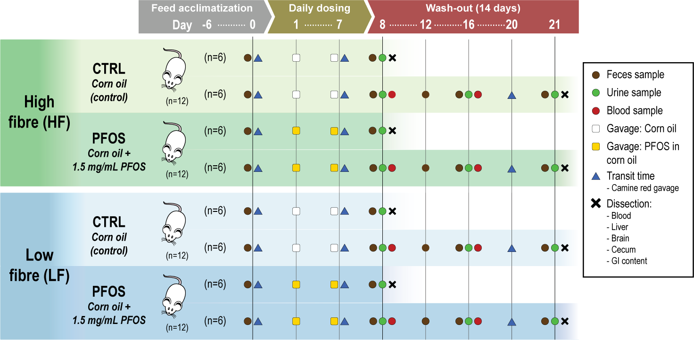

# INFO

This document contains the commands necessary to analyse experimental data obtained from "Fibrex" (internal project name: B-02-22), not including 16S-based microbiota data.

# PROJECT
"Fibrex" refers to an animal study with the scope of investigating the effect of dietary fibres on uptake and wash-out of orally administered perfluorooctane sulfonic acid (PFOS) in adult male rats. The setup of the study is described below including a graphical overview of the setup:

{width="100%"}

- 48 adult male Sprague-Dawley rats were acclimatised (7 days prior to study start) to, and continuously fed, either:
  + Research Diet AIN-93G feed ("feed" *LF*) with no soluble dietary fibres and mineral caseine (serial number D19090404), or
  + Altromin 1314 ("feed" *HF*), containing dietary fibres.
  
- Half of the rats were dosed with corn oil with or without PFOS daily for 7 days by oral gavage (2 mL / kg):
  + 12 rats in each fed group were given pure corn oil as control ("treatment" *CTRL*)
    + R01-12 for AIN-93G (*LF_CTRL*)
    + R25-36 for Altromin (*HF_CTRL*)
  + 12 rats in each fed group were given corn oil with suspended 1.5 mg/mL PFOS (3 mg / kg) ("treatment" *PFOS*)
    + R13-24 for AIN-93G (*LF_PFOS*)
    + R37-48 for Altromin (*HF_PFOS*)
  
- Study period run from Day 0 to Day 21:

  + Day 0: Feces samples and first transit time was measured
  
  + Day 1-7: Dosing period - oral gavage was given daily in the morning (~ 06:00 - 08:00)
    + Body weight was measured daily
    + Day 7: Second transit time measured
    
  + Day 8: Dissection of half of each group
    + Body weight, feces and urine samples were collected from all animals in the morning (except urine for R19)
    + Blood samples from tongue-vein was taken from all animals not dissected
    + Animals dissected:
      + R01-06
      + R13-18
      + R25-30
      + R37-40 + R43-44
    
  + Day 8-21: Wash-out period - all remaining rats were measured for PFOS in blood, feces and urine
    + Day 12: Feces samples and body weight
    + Day 16: Feces, urine, tongue-vein blood samples and body weight
    + Day 20: Third transit time measured
    
  + Day 21: Dissection of remaining 24 rats
    + Body weight, feces and urine samples were collected prior to dissection
    + Animals dissected:
      + R07-12
      + R19-24
      + R31-37
      + R41-42 + R45-48

- During each dissections following samples and information were collected:
  + Weight: Cecum weight, and Liver weight
  + Blood samples
  + Tissue samples:
    + Liver
    + Brain
  + Gastrointestinal samples from:
    + Upper and lower jejunum
    + Ileum
    + Cecum

## CONTENT

The project data contains:

- **Animal identifiers**:
  + "rat_org" lists rat names as given during the study
  + "rat_name" is corrected rat names due to non-continuous numbering for rat_org and dissection days for rat_org *R41-R42* (day 21) and *R43-R44* (day 8). This column should be used for rat identification - same is corrected in metadata for microbiome data. All following information is following rat_name nomenclature.
  + "cage" number (*01-24*)
  + "feed" given during the study: *LF* = no fibre, and *HF* = fibre
  + "treatment" for oral gavage given: *CTRL* for control, and *PFOS* for PFOS
  + "dissection" for dissection days of each rat: *d8* and *d21*
  + combined identifiers with values from above separated by "_": "feedtreat", "feedtreatday"

- **Animal weight** data (grams) including calculated weights per bw (ratio) and normalized weight data (normalised after mean weight of control group):
  + Body weight ("bw" followed by number of day) from day *0* to day *8* and subsequent days *12*, *16*, *20* and *21*, including bw gain from day 0 - 8, 0 - 21, and 8 - 21.
  + Liver and cecum weight from dissections on day *8* and *21*
  + Estimated brain weights per rat ("brain_wt_estimate") based on ["Herculano-Houzel, Mota, and Lent - 2006"]("https://doi.org/10.1073/pnas.0604911103")
  + Estimated blood volume per rat ("bloodvol_8", "bloodvol_16", "bloodvol_21") based on an standard average of 64mL blood / kilogram in rats ["Diehl et al. 2001"]("https://doi.org/10.1002/jat.727")

- **Transit time** per rat in minutes for:
  + Day 0 ("transit_0") - note: measurement were done per cage of 2 rats, hence the real value is not known for individual rats
  + Day 7 ("transit_7")
  + Day 20 ("transit_20")
  
- **Total dosed volume** (mL) of oral gavage per rat ("dose_total_ml")

- **PFOS quantitative data** in ug / g ("_ugg") or ug / mL ("_ugml), or mg total ("_mg") as well as **PFOS isomer data**:
  + Total dosed PFOS per rat on day 8 ("pfos_total_mg"), respectively
  + Systemic samples:
    + Liver values for day *8* and *21*
    + Brain values for day *8* and *21* (except *R01*, *R02*, *R13*, *R40*, *R43*, due to missing or loss of sample)
    + Blood serum values for day *8*, *16*, and *21*
  + Secreted / Wash-out samples:
    + Cecum values for day *8* and *21* (except *R04*)
    + Feces values for day *8*, *12*, *16*, and *21*
    + Urine values for day *8*, *16*, and *21*
    
- **pH measurements** of gastrointestinal contents by 4x dilution (wt/vol) in sterile nuclease-free water:
  + Upper and lower jejunum
  + Ileum
  + Cecum (except sample *R04*)

- **Short-chain fatty acids** quantification of 10 compounds in cecal water from day *8* and *21* given in mM:
  + formic acid (formate),
  + acetic acid (acetate),
  + propanoic acid (propionate),
  + 2-methyl-propanoic acid (isobutyrate),
  + butanoic acid (butyrate),
  + 3-methyl-butanoic acid (isovalerate),
  + pentanoic acid (valerate),
  + 4-methyl-pentanoic acid (isocaproate, not included due to low sample count > LOD),
  + hexanoic acid (coproate) and
  + heptanoic acid (enanthate, not included due to low sample count > LOD)
  
The following content of this document goes through data analysis of the above mentioned data and contains code for creation of figures used for the associated publication.

# SETUP 
Following code loads packages, creates necessary folder and saves parameters for the following analyses.
```{r setup, eval=TRUE, echo=TRUE, message=FALSE, warning = FALSE}
knitr::opts_chunk$set(echo = TRUE)

# Load libraries
library(tidyverse)
library(phyloseq)
library(decontam)
library(pals)
library(ggpubr)
library(vegan)
library(phangorn)
library(kableExtra)
library(plotly)
library(rstatix)
library(forcats)
library(dplyr)
library(tidyr)
library(ggplot2)
library(cowplot)
library(DAtest)
library(ggrepel)

# Save params
saveRDS(params, file = "R_objects/animal_params.RDS")
```

# LOAD DATA
Loading data from CSV-format in input folder and saves as Rdata-format.
```{r , eval=TRUE, echo=TRUE, error=TRUE}
# Load analysis data
dat <- read.csv(params$input, header = TRUE, sep = ";", dec = ",")

save(dat, file = "R_objects/animal_data.Rdata")

# clear the environment and release memory
rm(list = ls(all.names = TRUE)) #will clear all objects includes hidden objects.
invisible(gc()) #free up memory and report the memory usage.
```


# ABSOLUTE ABUNDANCE

This section investigates the absolute abundance and couples it to sequencing data. Quantitative data was obtained from qPCR of purified DNA from collected microbiota samples (Feces, Cecum and Ileum).
Briefly, 1ng of purified community DNA was amplified using universal 16S primers with SYBR-green nucleic acid fluorescent stain. Quantification was done against standard curve of E. coli genomic DNA with known concentration and copy number.

## Prepare data
``` {r }
# Load calculated mean values for absolute abundance
dat.abu <- read.csv(file = "input/result_mean_Fibrex_corrected.csv", header = TRUE, sep = ";", dec = ",")

dat.abu <- subset(dat.abu, Day != 20 & mat_type == "Feces")

# Load relative abundance data from 16S amplicons
load("R_objects/Agglomerated_all.RData")

phy <- subset_samples(phy, day != "d20" & material == "Feces")

dat.phy <- data.frame(sample_data(phy))

# Test for mismatches between tables
dat.abu$Name[!(dat.abu$Name %in% dat$Sample)]

# Merge the two
dam <- merge(dat.phy, dat.abu, by = "Sample")


# Set names of variables
PREDICTOR <- "plate"
OUTCOME <- "quantity_mean"
SUBJECT <- "rat_name"

# Create formula
PREDICTOR.F <- ifelse(length(PREDICTOR) > 1, paste(PREDICTOR, collapse = "*"), PREDICTOR)
FORMULA <- as.formula(paste(OUTCOME,PREDICTOR.F, sep = " ~ "))

# Summary samples in groups
dam %>% group_by(across(all_of(PREDICTOR))) %>% get_summary_stats(!!sym(OUTCOME), type = "mean_sd")
dam %>% group_by(across(all_of(PREDICTOR))) %>% get_summary_stats(!!sym(OUTCOME), type = c("full"))

# Create plot
bxp <- dam %>%
  ggboxplot(x = if_else(length(PREDICTOR) > 1, PREDICTOR[2],PREDICTOR[1]),
            y = OUTCOME,
            color = PREDICTOR[1],
            facet.by = if(length(PREDICTOR) == 3) PREDICTOR[3],
            palette = params$COL)
bxp

# Test for outliers
olr <- dam %>% 
  group_by(across(all_of(PREDICTOR))) %>% 
  identify_outliers(!!sym(OUTCOME))
olr

# Build the linear model
model  <- lm(FORMULA, data = dam)
# Create a QQ plot of residuals
ggqqplot(residuals(model))
# Compute Shapiro-Wilk test of normality
shapiro_test(residuals(model))

plot(model, 1)

# Calculate Levene's test for equal variance
dam %>% levene_test(FORMULA)

# Save result
EQUAL.VAR <- dam %>% levene_test(FORMULA) %>% pull(p) > 0.05

## Not normally distrubuted and equal variance -> Kruskal-Wallis with post-hoc Dunn's test

p <- ggplot(dam, aes(x = plate, y = quantity_mean, color = plate)) +
  geom_boxplot()
p


stat <- dam %>%
  kruskal_test(quantity_mean ~ plate) %>%
  add_significance() %>%
  p_format("p", accuracy = 0.001, trailing.zero = TRUE, new.col = TRUE)
stat

stat.tsd <- dam %>%
  dunn_test(quantity_mean ~ plate)  %>%
  add_significance() %>%
  add_xy_position(x = .[[OUTCOME]], dodge = 0.8) %>%
  p_format("p.adj", accuracy = 0.001, trailing.zero = TRUE, new.col = TRUE)
stat.tsd


p.stat <- p + stat_pvalue_manual(stat.tsd, tip.length = 0, hide.ns = FALSE, label = "p.adj.signif")
p.stat
```


```{r}

#   # load data 
# load("R_objects/Agglomerated_Feces.RData")
params <- readRDS("R_objects/params_description.RDS")

# Transform data
phy.rel <- transform_sample_counts(phy.ge, fun = function(x) x/sum(x)*100)
dat <- psmelt(phy.rel)

# summarise per sample
sumsample <- dat %>% 
  filter(Abundance > 0) %>% 
  group_by(Sample) %>% 
  summarise(pct_0 = n(),
            pct_0.1 = sum(Abundance < 0.1),
            pct_0_1 = sum(Abundance >= 0.1 & Abundance < 1),
            pct_1_10 = sum(Abundance >= 1 & Abundance < 10),
            pct_10 = sum(Abundance > 10)) %>% 
  pivot_longer(-Sample, 
               names_to = c("Cutoff"), 
               values_to = "Count") %>% 
  group_by(Cutoff) %>% 
  summarise(sample_mean = mean(Count), 
            sample_sd = sd(Count))

# summarise total
sumall <- dat %>% 
  filter(Abundance > 0) %>% 
  group_by(OTU) %>% 
  summarise(Abundance = mean(Abundance)) %>% 
  summarise(pct_0 = n(),
            pct_0.1 = sum(Abundance < 0.1),
            pct_0_1 = sum(Abundance >= 0.1 & Abundance < 1),
            pct_1_10 = sum(Abundance >= 1 & Abundance < 10),
            pct_10 = sum(Abundance > 10)) %>% 
  pivot_longer(cols = everything(), 
               names_to = c("Cutoff"), 
               values_to = "Count")

# Combine
output <- full_join(sumall, sumsample)
output$Cutoff <- c("All", "n < 0.1%", "0.1% < n < 1.0%", "1.0% < n < 10%", "10%  < n")

# Create output table
kable(output, row.names = F,digits = 2, caption = 'Count of genera in general and per sample',align = "r") %>% 
  kable_classic(full_width = F, position = "left")


# Filter by abundance, then rank
phy.top <- filter_abundance(phy.rel) %>% filter_rank(min.rank = 19)

#Melt data
dat <- suppressWarnings(psmelt(phy.top))

# Prevent duplicate column names
colnames(dat)[colnames(dat) %in% c("Taxa","SampleID")] <- paste(colnames(dat)[colnames(dat) %in% c("Taxa","SampleID")], "old", sep = "_")

# Rename relevant columns
colnames(dat)[c(1,4)] <- c("Taxa","SampleID")

# Sort taxa
dat.sort <- sort_taxa(dat) 

# rename taxa
levels(dat.sort$Taxa) <- LETTERS[seq(length(levels(dat.sort$Taxa)))]

# Create plot
p <- ggplot(dat.sort, aes(x = SampleID,
                          y = Abundance,
                          fill = Taxa,
                          color = Taxa)) +
  geom_col() +
  xlab("") + 
  facet_grid(. ~ get(params$group_var),space = "free_x",scales = "free_x") +
  ggsci::scale_color_d3(palette = "category20") + 
  ggsci::scale_fill_d3(palette = "category20") + 
  guides(fill=guide_legend(ncol=2), color=guide_legend(ncol=2)) +
  clean_theme()
p

# print tax table
# print tax table
tax <- dat.sort %>% group_by(Taxa, Kingdom, Phylum, Class, Order, Family, Genus) %>% summarise(Abundance = mean(Abundance))


kable(tax,digits = 2,caption = paste("Taxa plotted", sep = " ")) %>%
  kable_classic(full_width = F, position = "left")

# clear the environment and release memory
rm(list = ls(all.names = TRUE))
invisible(gc())


```


## Conclusion
Transit time was significantly shorter in HF at Day 7 but not at other times. It should be noted that shorts measurement are generally in HF rats.

# SETTINGS 

Overview of the parameters and packages that were used for this analysis

## PARAMETERS {.tabset .tabset-fade .tabset-pills}

The following paramenters were set in for this analysis:

```{r parameters, eval=TRUE}
params <- readRDS("R_objects/animal_params.RDS")

tmp <- unlist(params)
dat <- data.frame(Parameter = names(tmp), Value = unname(tmp))


kbl(dat, row.names = F) %>% kable_classic(lightable_options = "striped")

```

## PACKAGES

The analysis was run in R version `r getRversion()` using the following packages:

```{r packages, eval=TRUE}
pack <- data.frame(Package = (.packages()))

for (i in seq(nrow(pack))) pack$Version[i] <- as.character(packageVersion(pack$Package[i]))

kbl(pack[order(pack$Package),], row.names = F) %>% kable_classic(lightable_options = "striped")   
     
```
